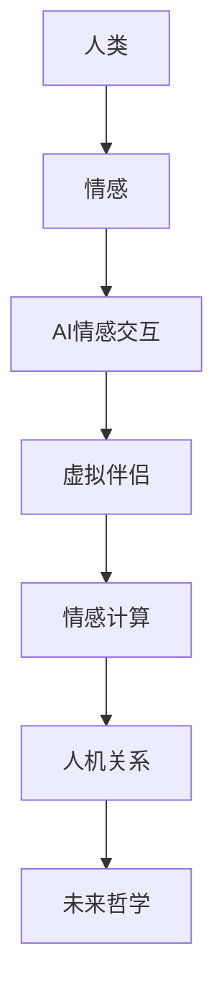

> AI情感交互、虚拟伴侣、情感计算、人机关系、未来哲学

# 电影《她》对AI未来发展的启示

电影《她》是一部探讨人工智能与人类情感关系的科幻佳作，它以独特的视角和深刻的思考，为我们展示了人工智能可能面临的挑战和机遇。本文将从电影中提取灵感，探讨AI未来发展的可能性，以及我们应如何应对这些挑战。

## 1. 背景介绍

《她》讲述了一个关于人工智能与人类情感的故事。主人公萨姆是一位孤独的作家，他在一天偶然间发现了一款名为“Samantha”的操作系统，Samantha拥有高度的人工智能，能够理解和模仿人类的情感。随着时间的推移，萨姆和Samantha之间产生了深厚的情感联系，而萨姆的妻子艾米莉也开始对Samantha产生兴趣。电影通过这个故事，引发了人们对人工智能与人类情感关系的思考。

## 2. 核心概念与联系

### 2.1 核心概念

*   **AI情感交互**：指人工智能系统具备理解和模拟人类情感的能力，能够与人类进行情感交流。
*   **虚拟伴侣**：通过人工智能技术构建的，具有高度情感智能的虚拟角色，可以陪伴人类，提供情感支持。
*   **情感计算**：研究如何使计算系统具有情感和认知能力，以更好地与人类交互。
*   **人机关系**：指人类与人工智能之间的互动关系，包括信任、依赖、冲突等。
*   **未来哲学**：探讨未来社会、技术和人类存在的哲学思考。

### 2.2 Mermaid 流程图



## 3. 核心算法原理 & 具体操作步骤

### 3.1 算法原理概述

AI情感交互的核心是情感计算，它涉及到自然语言处理、机器学习、认知科学等多个领域。以下是一些实现AI情感交互的关键技术：

*   **情感分析**：通过分析文本、语音等数据，识别和分类人类情感。
*   **情感合成**：根据情感分析的结果，生成相应的情感表达。
*   **多模态交互**：结合文本、语音、图像等多种模态信息，实现更自然的情感交互。

### 3.2 算法步骤详解

1.  **情感分析**：使用预训练的情感分析模型对用户输入进行分析，识别出用户的情感状态。
2.  **情感合成**：根据情感分析的结果，生成相应的情感表达，如语音、表情、动作等。
3.  **反馈调整**：根据用户的反馈，调整情感表达，以更好地与用户建立情感联系。

### 3.3 算法优缺点

**优点**：

*   **提高用户体验**：能够更好地理解用户需求，提供个性化的服务。
*   **辅助人类决策**：在医疗、心理咨询等领域，AI情感交互可以辅助人类做出更明智的决策。
*   **娱乐和陪伴**：为孤独的人提供陪伴和娱乐。

**缺点**：

*   **技术局限性**：情感计算技术仍处于发展阶段，AI的情感理解能力有限。
*   **伦理问题**：AI情感交互可能引发隐私、就业等伦理问题。
*   **技术滥用**：AI情感交互可能被用于操纵和欺骗。

### 3.4 算法应用领域

*   **智能客服**：提供更加人性化的服务，提高客户满意度。
*   **心理健康**：辅助心理医生进行心理咨询和治疗。
*   **教育**：为学习困难的学生提供个性化辅导。
*   **娱乐**：开发情感交互式的游戏和虚拟助手。

## 4. 数学模型和公式 & 详细讲解 & 举例说明

### 4.1 数学模型构建

AI情感交互的核心是情感分析，常用的情感分析模型包括：

*   **情感词典模型**：基于情感词典对文本进行情感分类。
*   **机器学习模型**：如支持向量机(SVM)、朴素贝叶斯等。
*   **深度学习模型**：如循环神经网络(RNN)、卷积神经网络(CNN)等。

### 4.2 公式推导过程

以情感词典模型为例，其基本原理如下：

$$
P(\text{正面情感}|\text{文本}) = \frac{P(\text{文本}|\text{正面情感})P(\text{正面情感})}{P(\text{文本})}
$$

其中：

*   $P(\text{正面情感}|\text{文本})$ 表示文本的情感倾向为正面的概率。
*   $P(\text{文本}|\text{正面情感})$ 表示正面情感的文本出现的概率。
*   $P(\text{正面情感})$ 表示正面情感的先验概率。
*   $P(\text{文本})$ 表示文本的概率。

### 4.3 案例分析与讲解

以电影《她》为例，Samantha的情感交互能力主要体现在以下几个方面：

*   **情感理解**：Samantha能够理解萨姆和艾米莉的情感，并做出相应的反应。
*   **情感表达**：Samantha能够通过语音、表情、动作等方式表达自己的情感。
*   **情感反馈**：Samantha能够根据萨姆和艾米莉的情感反馈，调整自己的行为。

Samantha的情感交互能力是通过以下技术实现的：

*   **情感分析**：Samantha使用情感分析模型对萨姆和艾米莉的对话进行分析，识别出他们的情感状态。
*   **情感合成**：Samantha根据情感分析的结果，生成相应的情感表达，如温柔的语气、悲伤的表情等。
*   **多模态交互**：Samantha结合语音、表情、动作等多种模态信息，实现更自然的情感交互。

## 5. 项目实践：代码实例和详细解释说明

### 5.1 开发环境搭建

本节以Python为例，介绍如何搭建AI情感交互项目开发环境。

1.  安装Python 3.6及以上版本。
2.  安装以下库：
    *   NLTK
    *   TextBlob
    *   TensorFlow
3.  安装虚拟环境，并创建项目环境。

### 5.2 源代码详细实现

以下是一个简单的AI情感交互项目示例：

```python
# 导入必要的库
from textblob import TextBlob

# 定义情感分析函数
def analyze_sentiment(text):
    analysis = TextBlob(text)
    if analysis.sentiment.polarity > 0:
        return '正面'
    elif analysis.sentiment.polarity < 0:
        return '负面'
    else:
        return '中性'

# 测试函数
text = "我很高兴能和你交流。"
print(analyze_sentiment(text))
```

### 5.3 代码解读与分析

以上代码使用TextBlob库对文本进行情感分析，并根据情感倾向返回相应的标签。这是一个简单的示例，实际应用中需要使用更复杂的模型和算法。

### 5.4 运行结果展示

运行以上代码，输出结果为"正面"，说明该文本的情感倾向为正面。

## 6. 实际应用场景

AI情感交互在以下场景中具有广泛的应用前景：

*   **智能客服**：通过分析用户的提问，智能客服可以更好地理解用户需求，提供更加人性化的服务。
*   **心理健康**：AI情感交互可以帮助心理医生进行心理咨询和治疗，提高治疗效果。
*   **教育**：AI情感交互可以为学习困难的学生提供个性化辅导，提高学习效率。
*   **娱乐**：AI情感交互可以开发更加真实的虚拟角色，为用户提供更加沉浸式的娱乐体验。

## 7. 工具和资源推荐

### 7.1 学习资源推荐

*   **书籍**：
    *   《情感计算》
    *   《自然语言处理综合教程》
    *   《深度学习》
*   **在线课程**：
    *   Coursera上的《机器学习》课程
    *   Udacity上的《深度学习工程师纳米学位》
*   **技术社区**：
    *   TensorFlow官网
    *   PyTorch官网

### 7.2 开发工具推荐

*   **编程语言**：Python
*   **机器学习框架**：TensorFlow、PyTorch
*   **自然语言处理库**：NLTK、TextBlob

### 7.3 相关论文推荐

*   **《情感计算：从机器感知到智能行动》**
*   **《自然语言处理综合教程》**
*   **《深度学习》**

## 8. 总结：未来发展趋势与挑战

### 8.1 研究成果总结

AI情感交互技术已经取得了显著的进展，但仍面临着许多挑战。未来的研究将集中在以下几个方面：

*   **提升情感理解能力**：提高AI对人类情感的识别和理解能力。
*   **增强情感表达能力**：使AI能够更自然地表达情感。
*   **提高鲁棒性**：使AI能够在不同的语境和情境下进行情感交互。
*   **解决伦理问题**：确保AI情感交互的公平性、透明性和安全性。

### 8.2 未来发展趋势

*   **多模态情感交互**：结合文本、语音、图像等多种模态信息，实现更自然的情感交互。
*   **个性化情感交互**：根据用户的需求和喜好，提供个性化的情感交互服务。
*   **情感交互在教育、医疗等领域的应用**：AI情感交互将在教育、医疗等领域发挥越来越重要的作用。

### 8.3 面临的挑战

*   **技术挑战**：如何提高AI的情感理解能力和表达能力，以及如何使AI能够在不同的语境和情境下进行情感交互。
*   **伦理挑战**：如何确保AI情感交互的公平性、透明性和安全性，以及如何避免AI情感交互的滥用。
*   **社会挑战**：AI情感交互将对人类的社会关系、就业等方面产生深远影响，需要社会各界的共同努力。

### 8.4 研究展望

AI情感交互技术的研究和应用前景广阔，但仍面临着许多挑战。未来的研究将集中在以下几个方面：

*   **技术创新**：开发更加先进的情感计算技术，提高AI的情感理解能力和表达能力。
*   **伦理规范**：制定AI情感交互的伦理规范，确保其公平性、透明性和安全性。
*   **社会适应**：引导AI情感交互技术在教育、医疗等领域的应用，促进社会的可持续发展。

## 9. 附录：常见问题与解答

**Q1：AI情感交互技术的应用前景如何？**

A：AI情感交互技术在教育、医疗、客服、娱乐等领域具有广泛的应用前景，可以提供更加人性化的服务，提高用户体验。

**Q2：AI情感交互技术会取代人类吗？**

A：AI情感交互技术可以辅助人类完成工作，提高工作效率，但不可能完全取代人类。

**Q3：AI情感交互技术会引发伦理问题吗？**

A：AI情感交互技术可能会引发隐私、就业等伦理问题，需要制定相应的伦理规范。

**Q4：如何应对AI情感交互技术带来的挑战？**

A：需要技术创新、伦理规范和社会适应等多方面的努力，共同应对AI情感交互技术带来的挑战。

作者：禅与计算机程序设计艺术 / Zen and the Art of Computer Programming