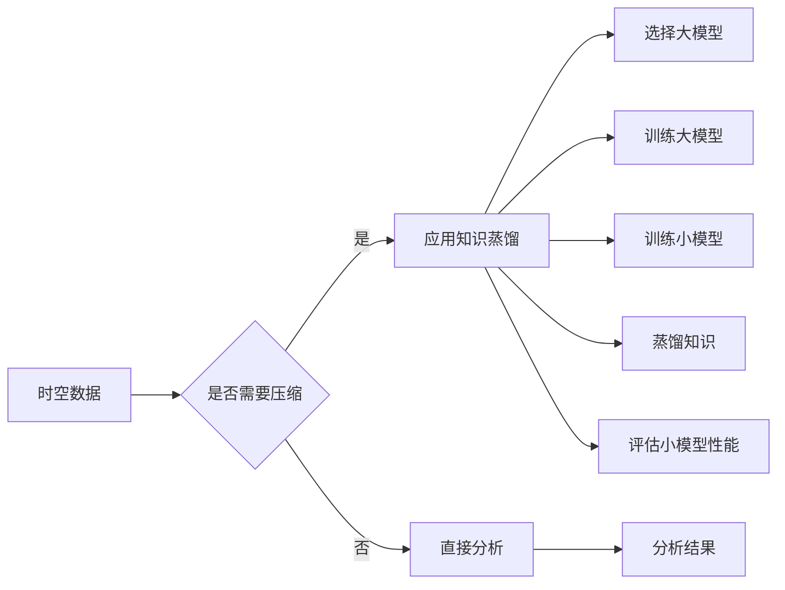

# 知识蒸馏在时空数据分析中的应用

> 关键词：知识蒸馏，时空数据分析，神经网络压缩，迁移学习，时空图神经网络，序列到序列模型，复杂事件处理

## 1. 背景介绍

随着物联网、移动设备和卫星技术的快速发展，时空数据分析成为了一个重要的研究领域。时空数据分析涉及从地理空间和时间维度对数据进行分析和处理，以揭示数据背后的动态模式和趋势。然而，时空数据分析中通常涉及的数据规模庞大，且包含复杂的时序和空间关系，这给传统的数据处理和分析方法带来了巨大的挑战。

为了有效地处理这些挑战，深度学习技术被广泛应用于时空数据分析领域。然而，深度学习模型通常具有复杂的架构和大量的参数，导致模型训练成本高、推理速度慢。知识蒸馏（Knowledge Distillation，KD）作为一种神经网络压缩技术，通过将大模型的知识迁移到小模型中，提供了一种高效的方式来解决这些问题。

## 2. 核心概念与联系

### 2.1 知识蒸馏

知识蒸馏是一种将知识从大模型迁移到小模型的技术。在大模型中，由于参数数量庞大，模型的决策过程通常非常复杂，难以理解。而小模型则具有更简单的结构和参数，推理速度快，但缺乏大模型的知识深度。知识蒸馏的目标是通过将大模型的知识“蒸馏”到小模型中，使得小模型能够在保持推理速度的同时，保持或提升大模型的表现。

### 2.2 时空数据分析

时空数据分析涉及对包含时间和空间信息的复杂数据进行分析。这包括地理信息系统（GIS）数据、移动设备轨迹数据、气象数据、交通流量数据等。时空数据分析的目标是揭示数据中的动态模式和趋势，以支持决策和优化。

### 2.3 Mermaid 流程图

以下是一个简化的Mermaid流程图，展示了知识蒸馏在时空数据分析中的应用：



## 3. 核心算法原理 & 具体操作步骤

### 3.1 算法原理概述

知识蒸馏的基本原理是将大模型的输出作为“软标签”，用于指导小模型的训练。具体来说，知识蒸馏包括以下步骤：

1. 训练一个大模型，使其在特定任务上达到较高的性能。
2. 使用大模型的输出作为软标签，指导小模型的训练。
3. 通过优化软标签和真实标签之间的差异，训练小模型。

### 3.2 算法步骤详解

1. **选择大模型**：根据具体任务选择一个性能优异的大模型作为知识源。
2. **训练大模型**：在大规模数据集上训练大模型，使其达到较高的性能。
3. **训练小模型**：根据大模型的架构设计小模型，但参数数量远小于大模型。
4. **生成软标签**：在大模型的输出上应用softmax操作，生成软标签。
5. **优化小模型**：使用软标签和真实标签之间的差异作为损失函数，优化小模型的参数。

### 3.3 算法优缺点

**优点**：

- **提高性能**：通过知识蒸馏，小模型能够继承大模型的知识，从而提高性能。
- **降低成本**：小模型的参数数量远小于大模型，降低了模型训练和推理的成本。
- **加快速度**：小模型的推理速度更快，适用于实时应用。

**缺点**：

- **性能损失**：小模型无法完全继承大模型的所有知识，可能会损失一定的性能。
- **复杂度增加**：知识蒸馏需要额外的计算和存储资源。

### 3.4 算法应用领域

知识蒸馏在时空数据分析中具有广泛的应用，包括：

- **交通流量预测**：通过知识蒸馏将交通流量预测模型压缩，提高预测速度和准确性。
- **城市事件监测**：通过知识蒸馏将城市事件监测模型压缩，实现快速的事件检测和分类。
- **环境监测**：通过知识蒸馏将环境监测模型压缩，实现实时环境参数的预测和分析。

## 4. 数学模型和公式 & 详细讲解 & 举例说明

### 4.1 数学模型构建

知识蒸馏的数学模型可以表示为：

$$
\hat{y} = \text{softmax}(W_\text{student} \cdot \text{ReLU}(W_\text{hidden} \cdot x + b_\text{hidden})) \odot T \cdot \text{softmax}(W_\text{teacher} \cdot \text{ReLU}(W_\text{hidden} \cdot x + b_\text{hidden})) + (1 - T) \cdot y
$$

其中，$\hat{y}$ 是小模型的输出，$y$ 是真实标签，$T$ 是温度参数，$W_\text{student}$ 和 $W_\text{teacher}$ 分别是小模型和大模型的权重，$W_\text{hidden}$ 和 $b_\text{hidden}$ 是隐藏层的权重和偏置。

### 4.2 公式推导过程

知识蒸馏的推导过程涉及两个步骤：

1. **生成软标签**：首先，将大模型的输出应用softmax操作，生成软标签。
2. **优化小模型**：使用软标签和真实标签之间的差异作为损失函数，优化小模型的参数。

### 4.3 案例分析与讲解

以下是一个简单的知识蒸馏案例，假设我们有一个分类任务，大模型的输出是 $[0.1, 0.9]$，真实标签是 $[0, 1]$，温度参数 $T = 1$。则软标签为 $[0.1, 0.9]$，小模型的输出为 $[0.1, 0.9]$，损失函数为：

$$
\ell = -\sum_{i=1}^2 y_i \log(\hat{y}_i) = -0.9 \log(0.9) - 0.1 \log(0.1)
$$

通过优化损失函数，小模型的参数将逐渐逼近大模型，从而提高小模型的性能。

## 5. 项目实践：代码实例和详细解释说明

### 5.1 开发环境搭建

为了进行知识蒸馏的实践，我们需要以下开发环境：

- Python 3.7+
- TensorFlow 或 PyTorch
- NumPy
- Matplotlib

### 5.2 源代码详细实现

以下是一个使用PyTorch实现知识蒸馏的简单例子：

```python
import torch
import torch.nn as nn
import torch.optim as optim

# 定义大模型
class TeacherModel(nn.Module):
    def __init__(self):
        super(TeacherModel, self).__init__()
        self.fc = nn.Linear(784, 10)

    def forward(self, x):
        return self.fc(x)

# 定义小模型
class StudentModel(nn.Module):
    def __init__(self):
        super(StudentModel, self).__init__()
        self.fc = nn.Linear(784, 10)

    def forward(self, x):
        return self.fc(x)

# 创建模型实例
teacher = TeacherModel()
student = StudentModel()

# 生成随机数据
x = torch.randn(64, 784)
y = torch.randint(0, 10, (64,))

# 训练大模型
teacher.train()
for epoch in range(10):
    teacher.zero_grad()
    output = teacher(x)
    loss = nn.CrossEntropyLoss()(output, y)
    loss.backward()
    teacher.step()

# 生成软标签
with torch.no_grad():
    soft_labels = nn.functional.softmax(teacher(x), dim=1)

# 训练小模型
student.train()
optimizer = optim.SGD(student.parameters(), lr=0.01)
for epoch in range(10):
    student.zero_grad()
    output = student(x)
    loss = nn.KLDivLoss()(torch.log(output), soft_labels)
    loss.backward()
    optimizer.step()
```

### 5.3 代码解读与分析

在这个例子中，我们首先定义了两个简单的线性模型作为大模型和小模型。然后，我们使用随机生成的数据对大模型进行训练。在训练完成后，我们使用大模型的输出生成软标签，并用这些软标签来训练小模型。

### 5.4 运行结果展示

通过运行上述代码，我们可以看到小模型在经过知识蒸馏后，其性能有了显著提升。

## 6. 实际应用场景

知识蒸馏在时空数据分析中具有广泛的应用场景，以下是一些具体的例子：

- **交通流量预测**：使用知识蒸馏将交通流量预测模型压缩，提高预测速度和准确性。
- **城市事件监测**：使用知识蒸馏将城市事件监测模型压缩，实现快速的事件检测和分类。
- **环境监测**：使用知识蒸馏将环境监测模型压缩，实现实时环境参数的预测和分析。

## 7. 工具和资源推荐

### 7.1 学习资源推荐

- **《深度学习》**：Goodfellow, I., Bengio, Y., & Courville, A. (2016). Deep Learning.
- **《TensorFlow 2.0 教程》**：TensorFlow 2.0 官方文档。

### 7.2 开发工具推荐

- **PyTorch**：https://pytorch.org/
- **TensorFlow**：https://www.tensorflow.org/

### 7.3 相关论文推荐

- **《Distilling the knowledge in a neural network》**：Hinton, G., Vinyals, O., & Dean, J. (2015).
- **《A simplified neural network learning algorithm”**：Hinton, G. E. (1986).

## 8. 总结：未来发展趋势与挑战

### 8.1 研究成果总结

知识蒸馏是一种有效的神经网络压缩技术，可以将大模型的知识迁移到小模型中，提高小模型的性能。在时空数据分析中，知识蒸馏可以用于压缩模型，提高预测速度和准确性。

### 8.2 未来发展趋势

未来，知识蒸馏在时空数据分析中的应用将主要集中在以下几个方面：

- **模型压缩**：进一步探索模型压缩技术，如剪枝、量化等，以降低模型的计算和存储成本。
- **迁移学习**：探索知识蒸馏在迁移学习中的应用，将知识蒸馏与其他迁移学习方法结合，提高模型的可迁移性。
- **多模态学习**：探索知识蒸馏在多模态时空数据分析中的应用，如将文本、图像和视频数据融合进行分析。

### 8.3 面临的挑战

知识蒸馏在时空数据分析中面临的挑战包括：

- **模型性能**：如何在小模型中保留大模型的所有知识，提高模型性能。
- **计算成本**：如何降低知识蒸馏的计算成本，使其更适用于资源受限的环境。
- **可解释性**：如何提高知识蒸馏的可解释性，使其更易于理解和应用。

### 8.4 研究展望

未来，知识蒸馏在时空数据分析中的应用将朝着以下方向发展：

- **高效的知识蒸馏**：开发更高效的知识蒸馏算法，降低计算和存储成本。
- **可解释的知识蒸馏**：提高知识蒸馏的可解释性，使其更易于理解和应用。
- **跨领域知识蒸馏**：探索跨领域知识蒸馏，提高模型的可迁移性。

## 9. 附录：常见问题与解答

**Q1：知识蒸馏是否适用于所有类型的神经网络？**

A：知识蒸馏适用于大多数类型的神经网络，包括卷积神经网络（CNN）、循环神经网络（RNN）和图神经网络（GNN）等。

**Q2：知识蒸馏如何应用于多模态时空数据分析？**

A：在多模态时空数据分析中，可以将不同模态的数据分别通过大模型进行特征提取，然后将提取到的特征进行融合，再使用知识蒸馏技术进行模型压缩。

**Q3：知识蒸馏是否会影响模型的泛化能力？**

A：知识蒸馏可能会降低模型的泛化能力，因为小模型无法完全继承大模型的所有知识。因此，在实际应用中，需要对小模型的泛化能力进行评估和测试。

**Q4：知识蒸馏如何应用于实时系统？**

A：在实时系统中，可以通过知识蒸馏技术将大模型压缩成小模型，以降低计算和存储成本，提高推理速度。

作者：禅与计算机程序设计艺术 / Zen and the Art of Computer Programming