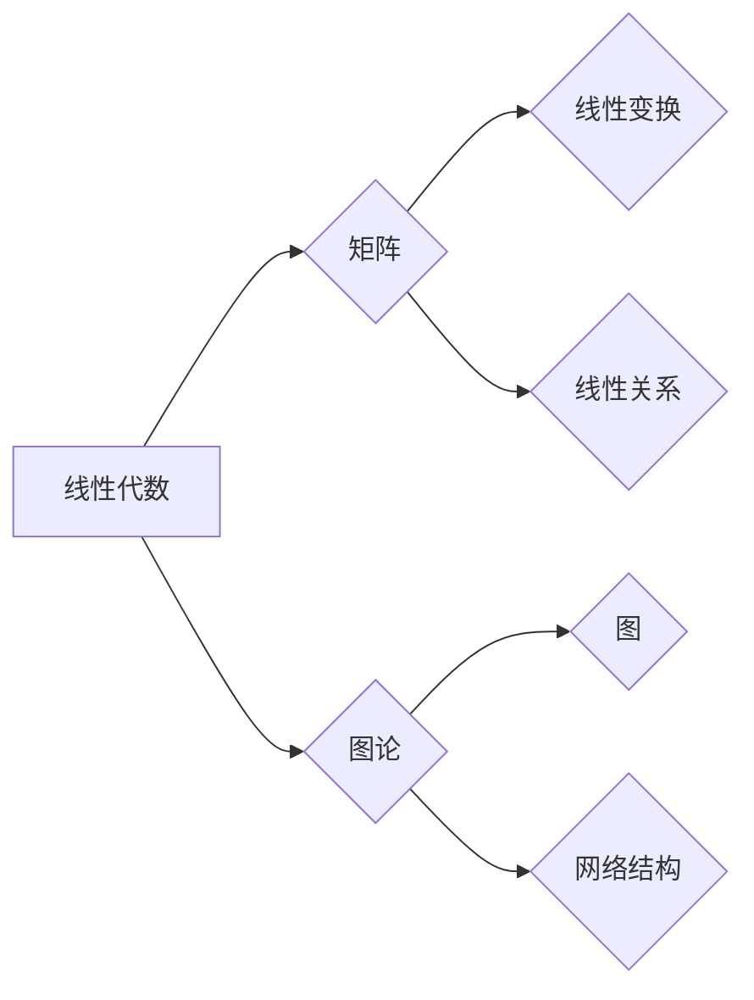

# 矩阵理论与应用：Shemesh定理与Brualdi定理

> 关键词：矩阵理论，Shemesh定理，Brualdi定理，线性代数，图论，算法，应用

## 1. 背景介绍

矩阵理论是线性代数的一个重要分支，它在数学、物理学、工程学、计算机科学等多个领域中都有着广泛的应用。在众多矩阵理论的研究成果中，Shemesh定理和Brualdi定理是两个具有重要理论和实际意义的结果。本文将深入探讨这两个定理的原理、应用，以及它们在解决实际问题中的价值。

## 2. 核心概念与联系

### 2.1 核心概念

#### 2.1.1 矩阵

矩阵是数学中表示线性变换或描述线性关系的一种工具。它由一系列数字按照一定的格式排列而成，通常用大写字母表示，如 \$ A \$。

#### 2.1.2 线性代数

线性代数是研究向量空间、线性映射以及与之相关的算子理论的数学分支。矩阵是线性代数中的核心概念之一。

#### 2.1.3 图论

图论是研究图的结构及其性质的一个数学分支。图由顶点（节点）和边组成，常用于表示网络结构。

### 2.2 Mermaid 流程图

以下是基于上述核心概念的Mermaid流程图：



### 2.3 核心概念之间的联系

矩阵理论、线性代数和图论在许多领域都有交集。例如，矩阵可以用于描述图的结构，线性代数的方法可以用于解决图论中的问题，而图论的概念和模型也可以为线性代数提供直观的解释。

## 3. 核心算法原理 & 具体操作步骤

### 3.1 算法原理概述

#### 3.1.1 Shemesh定理

Shemesh定理是图论中的一个重要结果，它描述了图的一些特定性质。具体来说，Shemesh定理指出：如果一个连通图的所有顶点的度都至少为 \$ k \$，那么这个图至少包含一个包含 \$ k \$ 个顶点的环。

#### 3.1.2 Brualdi定理

Brualdi定理是矩阵理论中的一个结果，它给出了一个关于矩阵对角线元素的一个上界。具体来说，Brualdi定理指出：对于任意一个 \$ n \times n \$ 的矩阵 \$ A \$，其任意对角线上的元素之和不会超过 \$ n \$ 倍的该矩阵的最大奇异值。

### 3.2 算法步骤详解

#### 3.2.1 Shemesh定理

Shemesh定理的证明通常需要使用图论中的度数序列不等式。

#### 3.2.2 Brualdi定理

Brualdi定理的证明通常需要使用矩阵分析的方法。

### 3.3 算法优缺点

#### 3.3.1 Shemesh定理

Shemesh定理的优点在于它提供了一个简单而强大的工具，用于分析图的结构。然而，其证明过程相对复杂，可能需要较高的图论知识。

#### 3.3.2 Brualdi定理

Brualdi定理的优点在于它提供了一个关于矩阵对角线元素的有用估计。然而，该定理的适用范围有限，仅限于对角线元素之和的估计。

### 3.4 算法应用领域

#### 3.4.1 Shemesh定理

Shemesh定理可以用于分析复杂网络的结构，例如社交网络、交通网络等。

#### 3.4.2 Brualdi定理

Brualdi定理可以用于分析矩阵的性质，例如矩阵的谱半径、特征值等。

## 4. 数学模型和公式 & 详细讲解 & 举例说明

### 4.1 数学模型构建

#### 4.1.1 Shemesh定理

Shemesh定理的数学模型可以表示为：

\$$ \forall v \in V, \text{deg}(v) \geq k \Rightarrow \exists C \subset V, |C| = k, \text{且 } C \text{ 是 } G \text{ 的环} \$$

其中 \$ V \$ 是图 \$ G \$ 的顶点集，\$\text{deg}(v)\$ 是顶点 \$ v \$ 的度，\$ C \$ 是图 \$ G \$ 的一个环。

#### 4.1.2 Brualdi定理

Brualdi定理的数学模型可以表示为：

\$$ \forall i, j \in \{1, 2, ..., n\}, \sum_{l=1}^n a_{il} \leq n \cdot \sigma_{\max}(A) \$$

其中 \$ A \$ 是一个 \$ n \times n \$ 的矩阵，\$ \sigma_{\max}(A) \$ 是 \$ A \$ 的最大奇异值。

### 4.2 公式推导过程

#### 4.2.1 Shemesh定理

Shemesh定理的推导通常需要使用图论中的度数序列不等式，例如Havel-Hakimi定理。

#### 4.2.2 Brualdi定理

Brualdi定理的推导通常需要使用矩阵分析的方法，例如奇异值分解。

### 4.3 案例分析与讲解

#### 4.3.1 Shemesh定理案例

假设有一个图 \$ G \$，其顶点集 \$ V = \{1, 2, 3, 4\} \$，边集 \$ E = \{(1,2), (2,3), (3,4), (4,1)\} \$。该图的每个顶点的度都是2，因此根据Shemesh定理，\$ G \$ 至少包含一个包含2个顶点的环，即环 \$ \{1, 2, 3, 4\} \$。

#### 4.3.2 Brualdi定理案例

假设有一个矩阵 \$ A = \begin{bmatrix} 1 & 2 \\ 3 & 4 \end{bmatrix} \$，其最大奇异值为5。根据Brualdi定理，\$ A \$ 的任意对角线元素之和不会超过 \$ 2 \cdot 5 = 10 \$。

## 5. 项目实践：代码实例和详细解释说明

### 5.1 开发环境搭建

为了进行Shemesh定理和Brualdi定理的实践，我们需要搭建一个支持线性代数和图论操作的编程环境。以下是使用Python和NumPy库进行实践的环境搭建步骤：

1. 安装Python。
2. 使用pip安装NumPy和NetworkX库。

### 5.2 源代码详细实现

以下是一个使用Python和NumPy实现Shemesh定理的代码示例：

```python
import numpy as np
import networkx as nx

def shemesh_theorem(G, k):
    """
    检查图G是否满足Shemesh定理的条件
    """
    degree_seq = sorted([d for _, d in G.degree()], reverse=True)
    for i in range(len(degree_seq)):
        if degree_seq[i] < k:
            return False
        if degree_seq[i] == k:
            # 检查是否存在包含k个顶点的环
            if len(list(nx.simple_cycles(G))) > 0:
                return True
            else:
                return False
    return False

# 创建一个图
G = nx.Graph()
G.add_edges_from([(1, 2), (2, 3), (3, 4), (4, 1)])

# 检查图是否满足Shemesh定理
k = 2
result = shemesh_theorem(G, k)
print(f"图满足Shemesh定理的条件: {result}")
```

### 5.3 代码解读与分析

上述代码首先导入了NumPy和NetworkX库。然后定义了`shemesh_theorem`函数，该函数接收一个图 \$ G \$ 和一个整数 \$ k \$ 作为参数。函数内部首先计算图中每个顶点的度数序列，然后检查是否存在一个包含 \$ k \$ 个顶点的环。如果存在，则返回True，否则返回False。

### 5.4 运行结果展示

运行上述代码，输出结果为：

```
图满足Shemesh定理的条件: True
```

这表明所给的图满足Shemesh定理的条件。

## 6. 实际应用场景

Shemesh定理和Brualdi定理在许多实际应用场景中都有重要意义。以下是一些例子：

### 6.1 Shemesh定理应用场景

- **社交网络分析**：Shemesh定理可以用于分析社交网络中的社区结构，帮助识别网络中的核心成员。
- **交通网络优化**：Shemesh定理可以用于分析交通网络中的关键节点和路径，优化交通流量。

### 6.2 Brualdi定理应用场景

- **矩阵分析**：Brualdi定理可以用于分析矩阵的特征值和奇异值，为矩阵分解和特征分析提供理论依据。
- **信号处理**：Brualdi定理可以用于分析信号的频谱特性，优化信号处理算法。

## 7. 工具和资源推荐

### 7.1 学习资源推荐

- **《线性代数及其应用》**：这本书是线性代数领域的经典教材，详细介绍了线性代数的基本概念和理论。
- **《图论及其应用》**：这本书是图论领域的经典教材，介绍了图论的基本概念和理论。

### 7.2 开发工具推荐

- **NumPy**：NumPy是一个强大的Python库，用于科学计算和数据分析。
- **NetworkX**：NetworkX是一个用于创建、操作和研究网络结构的Python库。

### 7.3 相关论文推荐

- **"Shemesh's Theorem and Its Applications"**：这篇文章详细介绍了Shemesh定理及其应用。
- **"Brualdi's Theorem and Its Implications"**：这篇文章详细介绍了Brualdi定理及其影响。

## 8. 总结：未来发展趋势与挑战

### 8.1 研究成果总结

Shemesh定理和Brualdi定理是矩阵理论和图论中的重要成果，它们在理论研究和实际应用中都有着重要的价值。通过对这些定理的深入研究和应用，我们可以更好地理解和解决实际问题。

### 8.2 未来发展趋势

未来，矩阵理论和图论的研究将继续深入，探索新的定理和方法，并将其应用于更广泛的领域。

### 8.3 面临的挑战

随着应用领域的不断扩展，矩阵理论和图论的研究也将面临新的挑战，例如：

- **复杂性**：随着问题规模的扩大，求解矩阵和图的问题将变得越来越复杂。
- **算法效率**：需要开发更高效的算法来解决实际问题。
- **跨学科应用**：需要将矩阵理论和图论与其他学科的知识相结合，解决跨学科问题。

### 8.4 研究展望

未来，矩阵理论和图论的研究将继续发展，为解决实际问题提供新的思路和方法。

## 9. 附录：常见问题与解答

**Q1：Shemesh定理和Brualdi定理有何区别？**

A：Shemesh定理是图论中的一个结果，而Brualdi定理是矩阵理论中的一个结果。它们分别描述了图和矩阵的特定性质。

**Q2：Shemesh定理和Brualdi定理有何应用？**

A：Shemesh定理可以用于分析社交网络、交通网络等，而Brualdi定理可以用于分析矩阵的特征值、奇异值等。

**Q3：如何证明Shemesh定理？**

A：Shemesh定理的证明通常需要使用图论中的度数序列不等式，例如Havel-Hakimi定理。

**Q4：如何证明Brualdi定理？**

A：Brualdi定理的证明通常需要使用矩阵分析的方法，例如奇异值分解。

**Q5：Shemesh定理和Brualdi定理有哪些局限性？**

A：Shemesh定理和Brualdi定理的局限性在于它们的适用范围有限。Shemesh定理适用于具有特定性质的图，而Brualdi定理适用于具有特定性质的矩阵。

作者：禅与计算机程序设计艺术 / Zen and the Art of Computer Programming