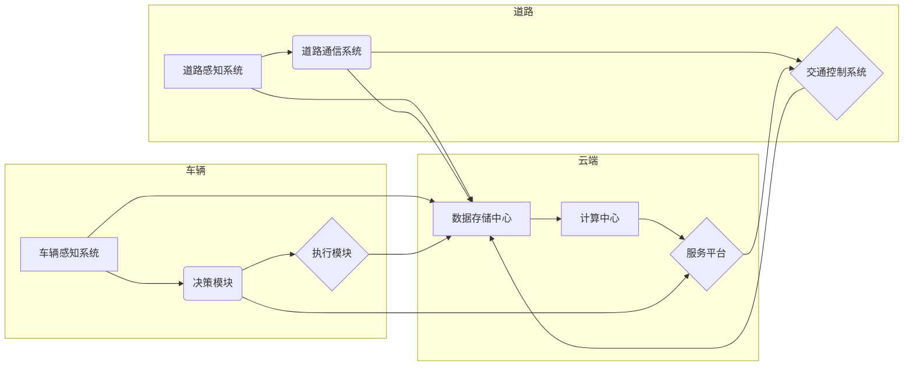

# 端到端自动驾驶的车路云一体化方案

> 关键词：自动驾驶，车路云，一体化，边缘计算，人工智能，物联网，智能交通系统，数据融合

## 1. 背景介绍

随着科技的不断进步，自动驾驶技术正在逐渐从实验室走向实际应用。自动驾驶系统需要实时感知环境、做出决策、控制车辆，这对车辆本身的计算能力、外部环境感知以及数据处理能力提出了极高的要求。车路云一体化方案作为一种新兴的智能交通系统，通过整合车辆、道路、云端资源，实现了自动驾驶的端到端解决方案。本文将深入探讨车路云一体化方案的核心概念、技术原理、实施步骤以及未来发展趋势。

### 1.1 自动驾驶的发展现状

自动驾驶技术经历了从辅助驾驶到部分自动驾驶再到完全自动驾驶的发展过程。目前，L1到L2级别的辅助驾驶技术已经相对成熟，并开始在市场上得到应用。L3级别的部分自动驾驶技术也在逐步推广中，而L4和L5级别的完全自动驾驶技术则仍处于研发和测试阶段。

### 1.2 车路云一体化方案的意义

车路云一体化方案旨在通过整合车辆、道路、云端资源，构建一个安全、高效、智能的交通生态系统。该方案具有以下意义：

- 提高道路使用效率，缓解交通拥堵。
- 降低交通事故发生率，保障交通安全。
- 提升车辆性能，提高驾驶舒适性和便利性。
- 促进智能交通系统的发展，推动城市智能化进程。

## 2. 核心概念与联系

车路云一体化方案的核心概念包括：

- 车辆：搭载感知、决策、执行等模块，实现自动驾驶功能。
- 道路：具备感知、通信、控制等功能的道路基础设施。
- 云端：提供数据存储、计算、服务等功能的数据中心。

以下是车路云一体化方案的核心概念原理和架构的Mermaid流程图：



## 3. 核心算法原理 & 具体操作步骤

### 3.1 算法原理概述

车路云一体化方案的核心算法包括：

- 感知算法：用于获取车辆和道路的实时信息。
- 决策算法：根据感知信息，制定驾驶策略。
- 执行算法：控制车辆执行决策。

### 3.2 算法步骤详解

**3.2.1 感知算法**

感知算法主要包括：

- 视觉感知：利用摄像头、激光雷达等传感器获取周围环境信息。
- 传感器融合：将来自不同传感器的信息进行融合，提高感知精度。
- 地图匹配：将感知到的信息与地图进行匹配，确定车辆位置。

**3.2.2 决策算法**

决策算法主要包括：

- 规划算法：根据车辆位置和目标，规划行驶路径。
- 策略算法：根据规划结果和当前环境，选择最佳行驶策略。
- 逆控制算法：将策略转换为车辆控制指令。

**3.2.3 执行算法**

执行算法主要包括：

- 加速、减速、转向等控制指令的发送。
- 与车辆控制系统进行通信，实现车辆动作。

### 3.3 算法优缺点

**3.3.1 优点**

- 提高自动驾驶系统的稳定性和安全性。
- 提高驾驶效率，降低交通事故发生率。
- 提升驾驶体验，满足个性化需求。

**3.3.2 缺点**

- 技术难度高，需要整合多种传感器和算法。
- 需要大量的测试和验证，确保系统安全性。
- 需要较高的成本投入。

### 3.4 算法应用领域

车路云一体化方案可应用于以下领域：

- 智能交通系统
- 自动驾驶车辆
- 智能道路
- 智能停车
- 智能物流

## 4. 数学模型和公式 & 详细讲解 & 举例说明

### 4.1 数学模型构建

车路云一体化方案的数学模型主要包括：

- 传感器数据融合模型：用于融合来自不同传感器的数据。
- 规划模型：用于规划行驶路径。
- 策略模型：用于选择最佳行驶策略。

### 4.2 公式推导过程

以下以传感器数据融合模型为例，进行公式推导。

假设传感器 $S_1$ 和 $S_2$ 分别获取到观测值 $z_1$ 和 $z_2$，噪声分别为 $v_1$ 和 $v_2$，则融合后的观测值为：

$$
z = \frac{z_1 \sigma_1^2 + z_2 \sigma_2^2}{\sigma_1^2 + \sigma_2^2}
$$

其中，$\sigma_1^2$ 和 $\sigma_2^2$ 分别为 $S_1$ 和 $S_2$ 的方差。

### 4.3 案例分析与讲解

以智能交通系统为例，说明车路云一体化方案的应用。

在智能交通系统中，车路云一体化方案可以实现对车辆、道路、交通信号的实时监测和智能控制。例如，通过车载传感器获取车辆位置和速度信息，通过道路传感器获取道路状况信息，通过交通信号传感器获取交通信号信息，然后通过云端平台进行数据处理和分析，实现对交通拥堵的预测和缓解。

## 5. 项目实践：代码实例和详细解释说明

### 5.1 开发环境搭建

以下是使用Python进行车路云一体化方案开发的开发环境搭建流程：

1. 安装Anaconda：从官网下载并安装Anaconda，用于创建独立的Python环境。
2. 创建并激活虚拟环境：
```bash
conda create -n car-road-cloud-env python=3.8
conda activate car-road-cloud-env
```
3. 安装必要的库：
```bash
conda install numpy pandas scikit-learn matplotlib
pip install carla
```
4. 安装CARLA仿真平台：CARLA是一个开源的自动驾驶仿真平台，可以用于测试和验证自动驾驶算法。

### 5.2 源代码详细实现

以下是一个简单的车路云一体化方案示例代码：

```python
import carla

def main():
    client = carla.Client('localhost', 2000)
    world = client.get_world()

    # 创建车辆
    blueprint_library = world.get_blueprint_library()
    vehicle_bp = blueprint_library.find('vehicle.tesla.model3')

    # 加载车辆
    vehicle = world.spawn_actor(vehicle_bp, world.get_map().get_spawn_points()[0])

    # 模拟驾驶
    while True:
        world.tick()
        location = vehicle.get_location()
        print(f"Vehicle location: x={location.x}, y={location.y}, z={location.z}")

if __name__ == '__main__':
    main()
```

### 5.3 代码解读与分析

以上代码展示了如何使用CARLA仿真平台创建车辆并模拟驾驶。首先，创建CARLA客户端并获取世界对象。然后，从蓝图库中找到特斯拉Model 3的车辆蓝图，并将其加载到世界中。最后，进入模拟驾驶循环，每帧更新车辆位置信息。

### 5.4 运行结果展示

运行以上代码，可以看到模拟车辆在仿真环境中移动，并实时输出车辆位置信息。

## 6. 实际应用场景

### 6.1 智能交通系统

车路云一体化方案可以应用于智能交通系统，实现对交通流量、车辆位置、道路状况的实时监测和智能控制。例如，通过道路传感器获取道路占用情况，通过车载传感器获取车辆速度和位置信息，通过云端平台进行数据处理和分析，实现对交通拥堵的预测和缓解。

### 6.2 自动驾驶车辆

车路云一体化方案可以应用于自动驾驶车辆，实现车辆的自主驾驶。例如，通过车载传感器获取周围环境信息，通过云端平台进行数据处理和分析，实现对车辆行驶路径的规划和控制。

### 6.3 智能道路

车路云一体化方案可以应用于智能道路建设，实现道路的智能化。例如，通过道路传感器获取道路状况信息，通过云端平台进行数据处理和分析，实现对道路维护、修复和优化的智能决策。

### 6.4 智能停车

车路云一体化方案可以应用于智能停车系统，实现车辆的自动停车和取车。例如，通过车载传感器获取车辆位置信息，通过云端平台进行数据处理和分析，实现对停车位占用情况的监测和车辆停取车的智能调度。

### 6.5 智能物流

车路云一体化方案可以应用于智能物流，实现车辆的自动配送和调度。例如，通过车载传感器获取车辆位置信息，通过云端平台进行数据处理和分析，实现对物流路线的规划和车辆配送的智能调度。

## 7. 工具和资源推荐

### 7.1 学习资源推荐

- 《自动驾驶原理与关键技术》
- 《车联网技术》
- 《云计算技术》

### 7.2 开发工具推荐

- CARLA仿真平台
- ROS（机器人操作系统）
- Python编程语言

### 7.3 相关论文推荐

- 《Deep Reinforcement Learning for Autonomous Navigation》
- 《A Survey on Vehicular Ad-Hoc Networks: Research Challenges and Opportunities》
- 《Cloud Computing for Smart Transportation Systems: A Survey》

## 8. 总结：未来发展趋势与挑战

### 8.1 研究成果总结

车路云一体化方案作为一种新兴的智能交通系统，通过整合车辆、道路、云端资源，实现了自动驾驶的端到端解决方案。该方案具有提高道路使用效率、降低交通事故发生率、提升车辆性能、促进智能交通系统发展等意义。

### 8.2 未来发展趋势

- 人工智能技术的进一步发展，将推动自动驾驶系统的智能化水平。
- 5G通信技术的普及，将提高车路云一体化方案的实时性和可靠性。
- 边缘计算技术的应用，将降低对云端资源的依赖，提高系统性能。

### 8.3 面临的挑战

- 自动驾驶系统的安全性问题。
- 车路云一体化方案的成本问题。
- 伦理道德和法律法规问题。

### 8.4 研究展望

车路云一体化方案在未来将面临更多挑战，但同时也充满机遇。随着技术的不断进步，相信车路云一体化方案将为人类社会带来更加安全、高效、智能的交通出行方式。

## 9. 附录：常见问题与解答

**Q1：车路云一体化方案与智能交通系统的区别是什么？**

A: 车路云一体化方案是智能交通系统的一种实现方式，它通过整合车辆、道路、云端资源，实现自动驾驶的端到端解决方案。而智能交通系统是指利用信息技术改造交通系统，提高交通效率、降低交通拥堵、减少交通事故等。

**Q2：车路云一体化方案有哪些优点？**

A: 车路云一体化方案具有以下优点：

- 提高道路使用效率，缓解交通拥堵。
- 降低交通事故发生率，保障交通安全。
- 提升车辆性能，提高驾驶舒适性和便利性。
- 促进智能交通系统的发展，推动城市智能化进程。

**Q3：车路云一体化方案面临哪些挑战？**

A: 车路云一体化方案面临以下挑战：

- 自动驾驶系统的安全性问题。
- 车路云一体化方案的成本问题。
- 伦理道德和法律法规问题。

**Q4：车路云一体化方案的应用领域有哪些？**

A: 车路云一体化方案可应用于以下领域：

- 智能交通系统
- 自动驾驶车辆
- 智能道路
- 智能停车
- 智能物流

---

作者：禅与计算机程序设计艺术 / Zen and the Art of Computer Programming