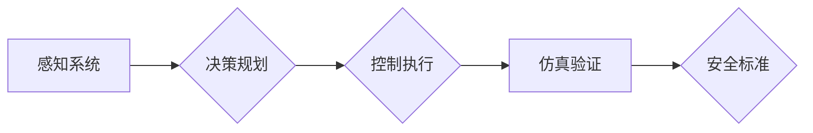

# 端到端自动驾驶的车辆主动安全仿真验证

> 关键词：端到端自动驾驶，主动安全，仿真验证，感知系统，决策规划，控制执行，仿真工具，安全标准

## 1. 背景介绍

随着人工智能和自动驾驶技术的迅猛发展，端到端自动驾驶系统逐渐成为未来交通出行的重要趋势。端到端自动驾驶系统通过整合感知、决策、规划和控制执行等多个模块，实现对车辆在复杂交通环境中的自主导航和控制。然而，自动驾驶系统的安全性和可靠性是至关重要的，任何潜在的故障都可能导致严重的事故。因此，对端到端自动驾驶系统进行全面的主动安全仿真验证成为确保其安全可靠运行的关键环节。

### 1.1 问题的由来

自动驾驶技术面临的主要挑战包括：

- 感知系统的不确定性：环境感知是自动驾驶系统的核心，但真实世界中的感知系统往往受到光照、天气、遮挡等因素的影响，导致感知信息的准确性难以保证。
- 决策规划的复杂性：自动驾驶系统需要在复杂多变的交通环境中做出实时决策，这涉及到大量的路径规划和风险评估。
- 控制执行的可靠性：控制执行模块需要将决策转换为具体的控制指令，如制动、转向等，确保车辆按照预期行驶。
- 仿真验证的挑战：由于真实世界环境的复杂性和不确定性，对自动驾驶系统进行全面的仿真验证成为一个技术难题。

### 1.2 研究现状

目前，国内外许多研究机构和企业在自动驾驶仿真验证领域取得了显著进展，主要研究方向包括：

- 高 fidelity 模型开发：开发高精度的车辆、环境、传感器等模型，以更真实地模拟现实世界。
- 仿真平台构建：构建可扩展、可复现的仿真平台，支持不同类型的仿真场景和测试用例。
- 安全性分析方法：研究基于模型检查、符号执行、测试生成等安全性分析方法，确保系统满足安全标准。
- 集成测试与验证：将仿真验证与实际道路测试相结合，全面评估自动驾驶系统的安全性和可靠性。

### 1.3 研究意义

端到端自动驾驶的车辆主动安全仿真验证具有以下重要意义：

- 降低安全风险：通过仿真验证，可以在实际道路测试之前发现和修复潜在的安全问题，降低事故风险。
- 缩短研发周期：仿真验证可以加速自动驾驶系统的开发过程，缩短产品上市时间。
- 优化系统设计：通过仿真验证，可以评估不同设计方案的性能，为系统设计提供数据支持。
- 提升行业竞争力：掌握自动驾驶仿真验证技术，有助于提升企业在自动驾驶领域的竞争力。

### 1.4 本文结构

本文将围绕端到端自动驾驶的车辆主动安全仿真验证展开讨论，主要内容包括：

- 核心概念与联系：介绍自动驾驶仿真验证中的核心概念，并使用Mermaid流程图展示其架构。
- 核心算法原理与具体操作步骤：讲解自动驾驶仿真验证中常用的算法原理和操作步骤。
- 数学模型和公式：介绍仿真验证中涉及的数学模型和公式，并进行详细讲解和举例说明。
- 项目实践：以实际项目为例，展示自动驾驶仿真验证的代码实例和详细解释说明。
- 实际应用场景：探讨自动驾驶仿真验证在现实世界中的应用场景。
- 工具和资源推荐：推荐自动驾驶仿真验证相关的学习资源、开发工具和参考文献。
- 总结：总结研究成果，展望未来发展趋势与挑战。

## 2. 核心概念与联系

### 2.1 核心概念

- **端到端自动驾驶**：指从感知到决策再到控制执行的全过程均由自动驾驶系统自主完成，无需人工干预。
- **主动安全**：指自动驾驶系统在遇到潜在危险时，能够主动采取措施避免事故发生。
- **仿真验证**：指使用计算机模拟真实世界环境，对自动驾驶系统进行测试和评估。
- **感知系统**：指自动驾驶系统中的视觉、雷达、激光雷达等传感器，用于获取周围环境信息。
- **决策规划**：指自动驾驶系统根据感知信息，规划车辆的行驶路径和动作。
- **控制执行**：指自动驾驶系统将决策转换为具体的控制指令，如制动、转向等。
- **仿真工具**：指用于构建和运行仿真实验的软件平台，如CarSim、Matlab/Simulink等。
- **安全标准**：指为确保自动驾驶系统安全可靠运行而制定的标准，如SAE国际协会的自动驾驶分级标准。

### 2.2 Mermaid流程图



图中，感知系统获取环境信息，传递给决策规划模块进行路径和动作规划；控制执行模块根据决策规划结果，输出控制指令；仿真验证模块对整个系统进行测试和评估，确保其满足安全标准。

## 3. 核心算法原理 & 具体操作步骤

### 3.1 算法原理概述

自动驾驶仿真验证的核心算法主要包括：

- **感知系统**：使用计算机视觉、雷达、激光雷达等传感器，结合图像处理、目标检测、语义分割等技术，实现环境信息的感知。
- **决策规划**：使用路径规划、轨迹规划、行为预测等技术，对车辆的行驶路径和动作进行规划。
- **控制执行**：根据决策规划结果，使用PID控制、模型预测控制等技术，输出控制指令，实现对车辆的精确控制。
- **仿真验证**：使用仿真工具，模拟真实世界环境，对整个自动驾驶系统进行测试和评估。

### 3.2 算法步骤详解

**感知系统**：

1. 数据采集：使用传感器收集周围环境信息，包括车辆、行人、交通标志等。
2. 数据预处理：对采集到的数据进行处理，如去噪、归一化等。
3. 目标检测：使用深度学习模型进行目标检测，识别和定位道路上的物体。
4. 语义分割：使用深度学习模型进行语义分割，将图像中的物体分类为不同的类别，如车辆、行人、道路等。
5. 道路线检测：使用深度学习模型检测道路线，为路径规划提供参考。

**决策规划**：

1. 路径规划：根据当前车辆位置、速度、目标位置等信息，规划车辆的行驶路径。
2. 轨迹规划：根据路径规划和周围环境信息，规划车辆的行驶轨迹。
3. 行为预测：根据历史数据和行为模式，预测周围车辆、行人的行为。

**控制执行**：

1. 控制策略设计：根据决策规划结果，设计合适的控制策略，如PID控制、模型预测控制等。
2. 控制指令输出：根据控制策略，输出控制指令，如制动、转向、加速等。

**仿真验证**：

1. 仿真环境构建：使用仿真工具构建真实世界环境，包括道路、车辆、行人等。
2. 测试用例设计：设计不同类型的测试用例，如紧急制动、车道偏离等。
3. 系统测试：在仿真环境中运行自动驾驶系统，对系统的性能和安全性进行测试。
4. 结果分析：分析测试结果，评估系统的性能和安全性。

### 3.3 算法优缺点

- **感知系统**：
  - 优点：能够实时获取周围环境信息，提高自动驾驶系统的响应速度。
  - 缺点：受光照、天气、遮挡等因素影响，感知信息的准确性难以保证。
- **决策规划**：
  - 优点：能够规划车辆的行驶路径和动作，提高自动驾驶系统的安全性。
  - 缺点：决策规划过程复杂，对计算资源要求较高。
- **控制执行**：
  - 优点：能够将决策规划结果转换为具体的控制指令，实现对车辆的精确控制。
  - 缺点：控制策略设计复杂，对控制器的性能要求较高。
- **仿真验证**：
  - 优点：能够在安全的环境下进行测试和评估，降低事故风险。
  - 缺点：仿真环境与真实世界存在差异，仿真结果可能存在偏差。

### 3.4 算法应用领域

自动驾驶仿真验证算法广泛应用于以下领域：

- **自动驾驶汽车**：对自动驾驶汽车进行测试和评估，确保其安全可靠运行。
- **无人驾驶卡车**：对无人驾驶卡车进行测试和评估，提高运输效率。
- **无人机**：对无人机进行测试和评估，确保其在复杂环境中的安全飞行。
- **机器人**：对机器人进行测试和评估，提高其在特定环境中的作业能力。

## 4. 数学模型和公式 & 详细讲解 & 举例说明

### 4.1 数学模型构建

自动驾驶仿真验证中常用的数学模型包括：

- **感知系统**：卡尔曼滤波、粒子滤波、贝叶斯网络等。
- **决策规划**：图搜索算法、Dijkstra算法、A*算法等。
- **控制执行**：PID控制、模型预测控制等。

### 4.2 公式推导过程

以下以卡尔曼滤波为例，介绍其公式推导过程。

#### 卡尔曼滤波公式：

$$
\begin{align*}
x_{k|k-1} &= F_{k|k-1} x_{k-1|k-1} + B_{k|k-1} u_{k-1} \\
P_{k|k-1} &= F_{k|k-1} P_{k-1|k-1} F_{k|k-1}^T + Q_{k|k-1} \\
y_k &= H_k x_k + v_k \\
K_k &= P_{k|k-1} H_k^T (H_k P_{k|k-1} H_k^T + R_k)^{-1} \\
x_k &= x_{k|k-1} + K_k (y_k - H_k x_{k|k-1}) \\
P_k &= (I - K_k H_k) P_{k|k-1}
\end{align*}
$$

#### 公式推导：

1. **状态预测**：
   - 状态预测方程 $x_{k|k-1} = F_{k|k-1} x_{k-1|k-1} + B_{k|k-1} u_{k-1}$ 描述了在已知前一时刻状态和输入的情况下，预测当前时刻状态。
   - 状态协方差预测方程 $P_{k|k-1} = F_{k|k-1} P_{k-1|k-1} F_{k|k-1}^T + Q_{k|k-1}$ 描述了在已知前一时刻状态和输入的情况下，预测当前时刻状态的不确定性。

2. **观测更新**：
   - 观测方程 $y_k = H_k x_k + v_k$ 描述了当前时刻的观测值与状态之间的关系。
   - 观测协方差 $R_k$ 描述了观测值的噪声水平。

3. **卡尔曼增益计算**：
   - 卡尔曼增益 $K_k = P_{k|k-1} H_k^T (H_k P_{k|k-1} H_k^T + R_k)^{-1}$ 用于调整状态预测，以匹配观测值。

4. **状态更新**：
   - 状态更新方程 $x_k = x_{k|k-1} + K_k (y_k - H_k x_{k|k-1})$ 将观测信息融入状态预测。

5. **协方差更新**：
   - 协方差更新方程 $P_k = (I - K_k H_k) P_{k|k-1}$ 更新状态协方差，以反映观测信息的影响。

### 4.3 案例分析与讲解

以下以自动驾驶车辆的自动驾驶系统为例，介绍卡尔曼滤波在感知系统中的应用。

**案例背景**：

自动驾驶车辆的感知系统由多个传感器组成，包括摄像头、雷达、激光雷达等。其中，摄像头主要用于获取周围环境中的车辆和行人信息。为了提高感知系统的准确性，可以使用卡尔曼滤波对摄像头采集的图像进行处理，消除噪声和干扰。

**案例步骤**：

1. **状态定义**：定义状态向量 $x_k$，包含车辆的位置、速度、加速度等参数。
2. **状态转移方程**：定义状态转移方程 $F_{k|k-1}$，描述车辆在不同时间步的状态变化。
3. **观测方程**：定义观测方程 $H_k$，描述摄像头观测到的图像信息与车辆状态之间的关系。
4. **噪声模型**：定义噪声协方差矩阵 $Q_k$ 和观测协方差矩阵 $R_k$，描述系统噪声和观测噪声的统计特性。
5. **卡尔曼滤波算法**：根据卡尔曼滤波公式，对摄像头采集的图像进行处理，得到更准确的状态估计。

**案例结果**：

通过卡尔曼滤波处理，可以有效消除摄像头采集的图像中的噪声和干扰，提高自动驾驶车辆感知系统的准确性，为后续的决策规划和控制执行提供可靠的输入信息。

## 5. 项目实践：代码实例和详细解释说明

### 5.1 开发环境搭建

以下以Python为例，介绍自动驾驶仿真验证项目的开发环境搭建。

**软件环境**：

- Python 3.x
- PyTorch 1.8.0
- OpenCV 4.5.2
- NumPy 1.19.2

**安装依赖**：

```bash
pip install torch torchvision opencv-python numpy
```

### 5.2 源代码详细实现

以下以自动驾驶车辆的目标检测为例，展示使用PyTorch和OpenCV进行目标检测的代码实现。

```python
import torch
import cv2
from torchvision.models import det_model
from torchvision.transforms.functional import to_tensor

def detect_objects(image_path):
    # 加载预训练的检测模型
    model = det_model('faster_rcnn_resnet50_fpn')
    model.eval()
    
    # 读取图像
    image = cv2.imread(image_path)
    image = cv2.cvtColor(image, cv2.COLOR_BGR2RGB)
    
    # 将图像转换为模型所需的格式
    image = to_tensor(image)
    image = image.unsqueeze(0)
    
    # 检测目标
    with torch.no_grad():
        pred = model(image)
    
    # 获取检测结果
    boxes = pred[0]['boxes']
    scores = pred[0]['scores']
    
    # 绘制检测框
    for box, score in zip(boxes, scores):
        if score > 0.5:
            x1, y1, x2, y2 = box
            cv2.rectangle(image, (x1, y1), (x2, y2), (0, 255, 0), 2)
            cv2.putText(image, f'{score:.2f}', (x1, y1 - 10), cv2.FONT_HERSHEY_SIMPLEX, 0.9, (36,255,12), 2)
    
    # 显示结果
    cv2.imshow('Detected Objects', image)
    cv2.waitKey(0)
    cv2.destroyAllWindows()

# 示例：检测图像中的目标
detect_objects('path/to/image.jpg')
```

### 5.3 代码解读与分析

- **导入依赖**：导入所需的库，如PyTorch、OpenCV、NumPy等。
- **加载模型**：加载预训练的检测模型，如Faster R-CNN。
- **读取图像**：读取待检测的图像，并将其转换为RGB格式。
- **图像转换**：将图像转换为PyTorch模型所需的格式，即单通道张量。
- **目标检测**：使用预训练模型对图像进行目标检测。
- **获取检测结果**：从检测结果中提取检测框和置信度。
- **绘制检测结果**：在原图上绘制检测框，并在框内显示置信度。
- **显示结果**：显示检测后的图像。

以上代码展示了使用PyTorch和OpenCV进行自动驾驶车辆目标检测的完整流程。通过加载预训练模型，可以快速实现图像中的目标检测，为自动驾驶系统的感知模块提供基础。

### 5.4 运行结果展示

运行上述代码，将会在窗口中显示检测后的图像，其中包含了检测到的车辆和行人，并标明了置信度。

## 6. 实际应用场景

### 6.1 自动驾驶汽车

自动驾驶汽车是端到端自动驾驶技术最典型的应用场景。通过仿真验证，可以评估自动驾驶汽车在不同道路环境、交通状况下的安全性和可靠性，为实际道路测试提供数据支持。

### 6.2 无人驾驶卡车

无人驾驶卡车在物流运输领域具有广阔的应用前景。通过仿真验证，可以评估无人驾驶卡车在复杂道路环境、恶劣天气条件下的行驶性能，提高运输效率，降低运输成本。

### 6.3 无人机

无人机在安防、测绘、农业等领域具有广泛的应用。通过仿真验证，可以评估无人机在不同飞行环境、任务场景下的飞行性能和安全性，提高无人机作业的效率和可靠性。

### 6.4 未来应用展望

随着自动驾驶技术的不断发展，未来端到端自动驾驶的车辆主动安全仿真验证将在以下方面得到进一步发展：

- **多传感器融合**：将摄像头、雷达、激光雷达等传感器数据进行融合，提高感知系统的鲁棒性和准确性。
- **深度学习应用**：利用深度学习技术，提高自动驾驶系统的决策规划和控制执行能力。
- **人机协作**：将自动驾驶系统与人类驾驶员进行协作，提高系统的安全性和可靠性。
- **开源平台**：构建开源的自动驾驶仿真平台，促进自动驾驶技术的发展。

## 7. 工具和资源推荐

### 7.1 学习资源推荐

- **书籍**：
  - 《深度学习》
  - 《计算机视觉：算法与应用》
  - 《自动驾驶系统设计》
- **在线课程**：
  - Coursera上的《深度学习专项课程》
  - Udacity上的《自动驾驶工程师纳米学位》
  - edX上的《计算机视觉与深度学习》

### 7.2 开发工具推荐

- **编程语言**：
  - Python
  - C++
- **深度学习框架**：
  - PyTorch
  - TensorFlow
- **仿真工具**：
  - CarSim
  - Matlab/Simulink

### 7.3 相关论文推荐

- **感知系统**：
  - "Faster R-CNN: Towards Real-Time Object Detection with Region Proposal Networks"
  - "You Only Look Once: Unified, Real-Time Object Detection"
- **决策规划**：
  - "Model Predictive Control for Autonomous Vehicles"
  - "A Probabilistic Road Map Planner for Real-Time Path Planning"
- **控制执行**：
  - "PID Control: Theory and Design"
  - "Model Predictive Control: Theory and Design with Applications"

## 8. 总结：未来发展趋势与挑战

### 8.1 研究成果总结

本文围绕端到端自动驾驶的车辆主动安全仿真验证，介绍了相关核心概念、算法原理、项目实践和实际应用场景。通过仿真验证，可以有效地评估自动驾驶系统的安全性和可靠性，为实际道路测试提供数据支持。

### 8.2 未来发展趋势

未来，端到端自动驾驶的车辆主动安全仿真验证将呈现以下发展趋势：

- **多传感器融合**：将摄像头、雷达、激光雷达等传感器数据进行融合，提高感知系统的鲁棒性和准确性。
- **深度学习应用**：利用深度学习技术，提高自动驾驶系统的决策规划和控制执行能力。
- **人机协作**：将自动驾驶系统与人类驾驶员进行协作，提高系统的安全性和可靠性。
- **开源平台**：构建开源的自动驾驶仿真平台，促进自动驾驶技术的发展。

### 8.3 面临的挑战

尽管端到端自动驾驶的车辆主动安全仿真验证取得了显著进展，但仍然面临着以下挑战：

- **仿真环境与真实世界差异**：仿真环境与真实世界存在差异，仿真结果可能存在偏差。
- **模型复杂度**：自动驾驶系统的模型复杂度较高，对计算资源要求较高。
- **数据安全性**：自动驾驶系统需要处理大量敏感数据，需要确保数据的安全性。
- **伦理道德问题**：自动驾驶系统在面临道德困境时，需要制定相应的伦理道德标准。

### 8.4 研究展望

未来，端到端自动驾驶的车辆主动安全仿真验证需要在以下方面进行深入研究：

- **提高仿真环境的真实性**：开发更加真实的仿真环境，缩小仿真结果与真实世界的差异。
- **降低模型复杂度**：研究轻量级模型，降低对计算资源的要求。
- **确保数据安全性**：制定数据安全标准，确保自动驾驶系统的数据安全。
- **制定伦理道德标准**：制定自动驾驶系统的伦理道德标准，确保其安全可靠运行。

通过不断努力，相信端到端自动驾驶的车辆主动安全仿真验证技术将不断完善，为自动驾驶技术的安全可靠运行提供有力保障。

## 9. 附录：常见问题与解答

**Q1：自动驾驶仿真验证与传统道路测试有什么区别？**

A：自动驾驶仿真验证和传统道路测试是两种不同的测试方法。仿真验证在计算机模拟的环境中进行，可以模拟多种复杂的场景和状况，成本较低，但仿真环境可能与真实世界存在差异。传统道路测试在真实环境中进行，可以全面评估系统的性能和安全性，但成本较高，且存在安全风险。

**Q2：如何提高自动驾驶仿真验证的准确性？**

A：提高自动驾驶仿真验证的准确性主要从以下几个方面入手：

- 开发高 fidelity 模型：使用高精度的车辆、环境、传感器等模型，以更真实地模拟现实世界。
- 优化仿真平台：构建可扩展、可复现的仿真平台，支持不同类型的仿真场景和测试用例。
- 使用安全性分析方法：研究基于模型检查、符号执行、测试生成等安全性分析方法，确保系统满足安全标准。

**Q3：自动驾驶仿真验证对计算资源有什么要求？**

A：自动驾驶仿真验证对计算资源的要求较高，需要高性能的CPU、GPU和存储设备。此外，还需要开发高效的仿真算法，以降低计算资源消耗。

**Q4：自动驾驶仿真验证有哪些应用场景？**

A：自动驾驶仿真验证可以应用于以下场景：

- **自动驾驶汽车**：对自动驾驶汽车进行测试和评估，确保其安全可靠运行。
- **无人驾驶卡车**：对无人驾驶卡车进行测试和评估，提高运输效率。
- **无人机**：对无人机进行测试和评估，确保其在复杂环境中的安全飞行。
- **机器人**：对机器人进行测试和评估，提高其在特定环境中的作业能力。

**Q5：自动驾驶仿真验证的未来发展趋势是什么？**

A：自动驾驶仿真验证的未来发展趋势包括：

- **多传感器融合**：将摄像头、雷达、激光雷达等传感器数据进行融合，提高感知系统的鲁棒性和准确性。
- **深度学习应用**：利用深度学习技术，提高自动驾驶系统的决策规划和控制执行能力。
- **人机协作**：将自动驾驶系统与人类驾驶员进行协作，提高系统的安全性和可靠性。
- **开源平台**：构建开源的自动驾驶仿真平台，促进自动驾驶技术的发展。

作者：禅与计算机程序设计艺术 / Zen and the Art of Computer Programming