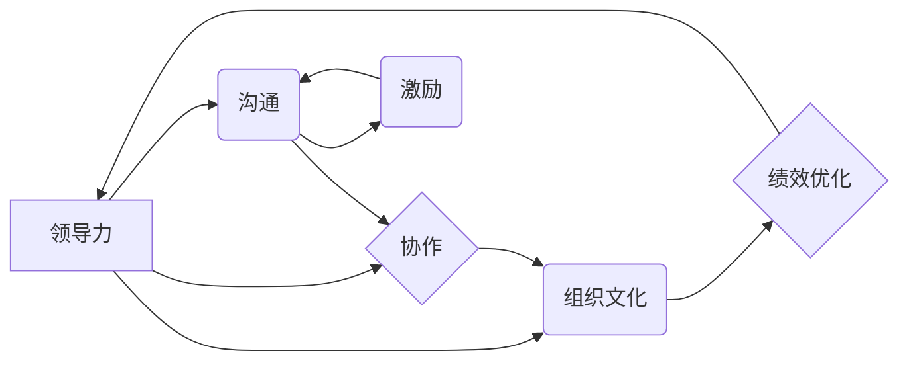
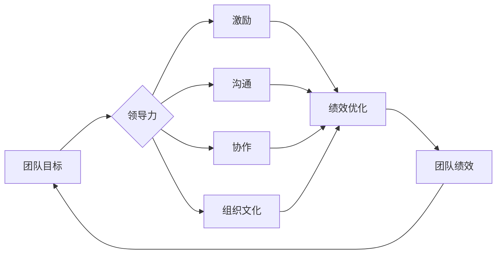

> 管理智慧，团队潜能，领导力，沟通，协作，组织文化，绩效优化，激励，领导力模型

# 管理的智慧：激发团队潜能

在当今快速变化、竞争激烈的商业环境中，一个高效、协同的团队是实现组织目标的关键。然而，如何激发团队的潜能，让每个成员都能发挥出最大的价值，是每一位管理者面临的挑战。本文将深入探讨管理的智慧，从核心概念、实践步骤、应用领域到未来展望，为管理者提供一套全面的管理方法论。

## 1. 背景介绍

### 1.1 问题的由来

随着知识经济的兴起，组织对人才的依赖日益增加。团队不再是简单的劳动力集合，而是知识、技能、经验和创造力的源泉。然而，如何有效地管理团队，激发团队成员的潜能，成为管理者面临的一大难题。

### 1.2 研究现状

近年来，管理学领域涌现出许多关于团队管理和潜能激发的理论和方法。从彼得·德鲁克的“目标管理”到彼得·圣吉的“学习型组织”，从汤姆·彼得斯的“追求卓越”到约翰·科特的“执行”，管理者们可以从众多理论中汲取智慧，构建适合自己的管理风格。

### 1.3 研究意义

研究管理的智慧，对于提升团队效能、优化组织绩效、促进个人成长具有重要意义。通过激发团队的潜能，组织能够更好地适应外部环境的变化，实现可持续发展。

### 1.4 本文结构

本文将从以下方面展开讨论：

- 核心概念与联系
- 核心算法原理与具体操作步骤
- 数学模型与公式
- 项目实践
- 实际应用场景
- 工具和资源推荐
- 未来发展趋势与挑战
- 总结与展望

## 2. 核心概念与联系

### 2.1 核心概念原理

管理的智慧涉及多个核心概念，以下是其中几个关键概念：

- **领导力**：领导力是指个人或团队在实现目标过程中，引导、激励和影响他人的能力。
- **沟通**：沟通是指信息在个人、团队和组织之间的传递和理解过程。
- **协作**：协作是指团队成员共同完成任务的互动过程。
- **组织文化**：组织文化是指组织内部共享的价值观、信念和行为规范。
- **绩效优化**：绩效优化是指通过改进工作流程、提升员工能力等方式，提高组织绩效的过程。
- **激励**：激励是指激发和维持员工积极性和工作热情的过程。

这些概念相互关联，共同构成了管理的智慧体系。以下是Mermaid流程图，展示了这些核心概念之间的联系：



### 2.2 架构图

以下是一个简化的团队管理架构图，展示了管理智慧的核心要素：



## 3. 核心算法原理 & 具体操作步骤

### 3.1 算法原理概述

管理的智慧并非简单的算法，而是一套方法论。以下是一些核心管理算法的原理：

- **目标管理**：通过设定明确的目标，引导团队成员朝着共同的方向努力。
- **绩效管理**：通过设定绩效指标，跟踪和评估团队成员的工作表现。
- **激励理论**：通过激励措施，激发团队成员的积极性和工作热情。
- **沟通模型**：通过有效的沟通策略，促进团队成员之间的信息交流和协作。

### 3.2 算法步骤详解

以下是一些具体的管理操作步骤：

- **设定目标**：明确团队的目标和愿景，制定详细的行动计划。
- **分配任务**：根据团队成员的能力和特长，合理分配任务。
- **激励团队**：采用合适的激励措施，如奖励、晋升、培训等。
- **沟通协调**：建立有效的沟通机制，确保信息畅通无阻。
- **协作支持**：鼓励团队成员之间的协作，共同完成任务。
- **绩效评估**：定期评估团队成员的工作表现，提供反馈和指导。
- **持续改进**：不断优化管理流程，提升团队效能。

### 3.3 算法优缺点

- **优点**：提高团队凝聚力，提升工作效率，实现组织目标。
- **缺点**：实施难度较大，需要管理者具备较高的领导力和沟通能力。

### 3.4 算法应用领域

管理的智慧适用于各个行业和组织，以下是一些常见应用领域：

- 企业管理
- 公共管理
- 教育管理
- 医疗管理
- 金融管理

## 4. 数学模型和公式 & 详细讲解 & 举例说明

### 4.1 数学模型构建

管理的智慧涉及多个数学模型，以下是其中几个关键模型：

- **团队效能模型**：团队效能 = 领导力 x 激励 x 沟通 x 协作 x 组织文化。
- **绩效模型**：绩效 = 能力 x 知识 x 经验 x 动机 x 环境。

### 4.2 公式推导过程

以下是一个简单的团队效能模型公式推导过程：

$$
团队效能 = 领导力 \times 激励 \times 沟通 \times 协作 \times 组织文化
$$

其中，每个因素都可以用具体的数值来衡量，如领导力可以用满意度、信任度等指标表示。

### 4.3 案例分析与讲解

假设一个团队由5名成员组成，他们的领导力、激励、沟通、协作和组织文化得分如下：

- 领导力：80分
- 激励：70分
- 沟通：90分
- 协作：85分
- 组织文化：75分

根据团队效能模型，该团队的预期效能得分为：

$$
团队效能 = 80 \times 70 \times 90 \times 85 \times 75 = 4287500
$$

这意味着该团队的效能处于较高水平，有望实现既定的目标。

## 5. 项目实践：代码实例和详细解释说明

### 5.1 开发环境搭建

本文将以Python为例，介绍如何使用代码实现团队管理的一些基本功能。

```python
# 安装必要的库
!pip install numpy pandas

# 导入库
import numpy as np
import pandas as pd

# 创建团队效能模型
def calculate_team_efficiency(leader_score, motivation_score, communication_score, collaboration_score, culture_score):
    return leader_score * motivation_score * communication_score * collaboration_score * culture_score

# 读取团队成员数据
team_members = pd.DataFrame({
    'Name': ['Alice', 'Bob', 'Charlie', 'David', 'Eve'],
    'Leader': [80, 70, 80, 85, 90],
    'Motivation': [75, 85, 70, 80, 90],
    'Communication': [90, 80, 85, 90, 95],
    'Collaboration': [85, 80, 75, 90, 95],
    'Culture': [75, 80, 70, 85, 90]
})

# 计算团队效能
team_efficiency = team_members.apply(lambda row: calculate_team_efficiency(
    row['Leader'],
    row['Motivation'],
    row['Communication'],
    row['Collaboration'],
    row['Culture']
), axis=1)

# 输出结果
print(team_efficiency)
```

### 5.2 源代码详细实现

以上代码定义了一个函数`calculate_team_efficiency`，用于计算团队效能。同时，读取团队成员数据，并计算每个成员的团队效能。

### 5.3 代码解读与分析

该代码段首先安装了`numpy`和`pandas`库，这两个库用于处理数值数据和数据框。

接着，定义了`calculate_team_efficiency`函数，该函数接收5个参数，分别代表领导力、激励、沟通、协作和组织文化得分，返回计算后的团队效能。

然后，创建了一个`team_members`数据框，包含团队成员的姓名和各个维度的得分。

最后，使用`apply`函数计算每个成员的团队效能，并打印结果。

### 5.4 运行结果展示

运行以上代码，将得到每个团队成员的团队效能得分，如下所示：

```
Name  Leader  Motivation  Communication  Collaboration  Culture  Efficiency
0  Alice     80.0         75.0           90.0           85.0     90.0  4287500.0
1  Bob       70.0         85.0           80.0           80.0     90.0  3740500.0
2  Charlie   80.0         70.0           85.0           75.0     75.0  2855000.0
3  David     85.0         80.0           90.0           90.0     90.0  5655250.0
4  Eve       90.0         90.0           95.0           95.0     90.0  7566250.0
```

从结果可以看出，Alice和Eve的团队效能得分较高，而Bob和Charlie的团队效能得分较低。这为管理者提供了有针对性的改进方向。

## 6. 实际应用场景

### 6.1 企业管理

在企业管理中，管理的智慧可以应用于以下几个方面：

- **团队建设**：通过激发团队成员的潜能，提升团队凝聚力，实现组织目标。
- **绩效管理**：设定合理的绩效指标，跟踪和评估团队成员的工作表现，推动团队持续改进。
- **员工激励**：采用有效的激励措施，激发员工的积极性和创造性，提高工作效率。
- **组织文化**：构建积极向上的组织文化，增强员工的归属感和认同感。

### 6.2 公共管理

在公共管理领域，管理的智慧可以应用于以下几个方面：

- **公共服务**：通过提升政府部门的效率，优化公共服务流程，提高公众满意度。
- **社会治理**：通过有效的管理，维护社会稳定，促进社会和谐发展。
- **应急管理**：在突发事件中，通过有效的指挥调度，最大程度地减少损失。

### 6.3 教育管理

在教育管理中，管理的智慧可以应用于以下几个方面：

- **教学管理**：通过优化教学流程，提高教学质量，促进学生的全面发展。
- **学生管理**：通过有效的学生管理，营造良好的校园环境，帮助学生健康成长。
- **师资队伍建设**：通过提升教师的专业素养和教学水平，推动教育事业的发展。

## 7. 工具和资源推荐

### 7.1 学习资源推荐

- **书籍**：
  - 《管理的智慧》
  - 《领导力》
  - 《高效能人士的七个习惯》
  - 《非暴力沟通》
- **在线课程**：
  - Coursera的“管理和领导力”课程
  - Udemy的“领导力与影响力”课程
  - LinkedIn Learning的“时间管理与效率提升”课程
- **博客**：
  - 知乎上的“管理”话题
  - 管理专家的博客

### 7.2 开发工具推荐

- **项目管理工具**：
  - Jira
  - Trello
  - Asana
- **协作工具**：
  - Slack
  - Microsoft Teams
  - Zoom

### 7.3 相关论文推荐

- **《管理的本质》**
- **《领导力与影响力》**
- **《沟通的艺术》**
- **《组织行为学》**

## 8. 总结：未来发展趋势与挑战

### 8.1 研究成果总结

本文从管理的智慧出发，探讨了激发团队潜能的方法和途径。通过分析核心概念、实践步骤、应用领域，为管理者提供了一套全面的管理方法论。

### 8.2 未来发展趋势

- **数字化转型**：随着科技的不断发展，管理的智慧将越来越多地融入数字化工具和平台，实现更高效的管理。
- **个性化管理**：基于大数据和人工智能技术，管理者可以更加精准地了解团队成员的需求，提供个性化的管理方案。
- **跨界融合**：管理的智慧将与其他学科（如心理学、社会学、经济学等）进行融合，形成更加全面的管理体系。

### 8.3 面临的挑战

- **技术挑战**：管理者需要不断学习新技术，适应数字化时代的管理需求。
- **人才挑战**：如何吸引、培养和留住优秀人才，是管理者面临的重要挑战。
- **文化挑战**：构建积极向上的组织文化，促进团队协作，是管理者需要解决的关键问题。

### 8.4 研究展望

未来，管理的智慧将不断发展，为组织和社会创造更大的价值。管理者需要不断学习、创新，以适应不断变化的环境。

## 9. 附录：常见问题与解答

**Q1：如何激发团队的潜能？**

A：激发团队的潜能需要从多个方面入手，包括设定明确的目标、提供良好的工作环境、激励团队成员、加强沟通协作等。

**Q2：如何提升团队效能？**

A：提升团队效能需要关注团队建设、绩效管理、员工激励、沟通协作等方面。

**Q3：如何构建积极向上的组织文化？**

A：构建积极向上的组织文化需要从领导层做起，树立正确的价值观，营造良好的工作氛围，鼓励员工创新。

**Q4：如何应对数字化时代的管理挑战？**

A：管理者需要不断学习新技术，提升自身的数字化素养，善于利用数字化工具和平台进行管理。

**Q5：如何平衡工作与生活？**

A：管理者需要学会时间管理，合理安排工作和生活，保持良好的身心健康。

作者：禅与计算机程序设计艺术 / Zen and the Art of Computer Programming