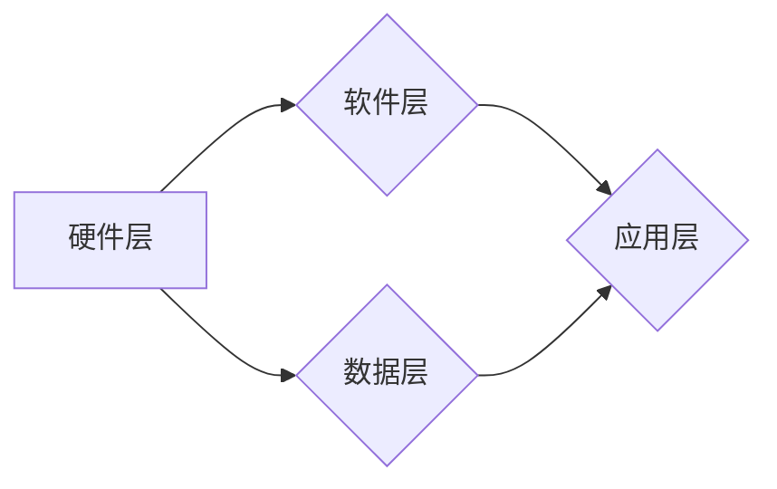
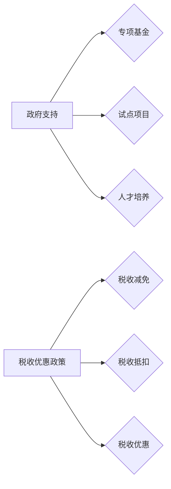

# 自动驾驶行业的政府支持与税收优惠政策

> 关键词：自动驾驶，政府支持，税收优惠，政策分析，行业发展，技术创新

## 1. 背景介绍

自动驾驶技术作为新一代人工智能技术的代表，正逐渐改变着全球汽车产业的格局。它不仅能够提高交通安全，降低交通事故率，还能提升道路通行效率，减少能源消耗。随着技术的不断成熟和市场的逐渐开放，自动驾驶行业迎来了快速发展期。在此背景下，政府支持与税收优惠政策成为了推动自动驾驶行业健康、快速发展的关键因素。

### 1.1 自动驾驶技术发展现状

自动驾驶技术按照自动化程度可分为以下级别：

- 0级：无自动化，完全由人类驾驶员控制。
- 1-2级：部分自动化，驾驶员需在特定条件下辅助驾驶。
- 3级：有条件自动化，在特定场景下可完全由自动驾驶系统控制。
- 4级：高度自动化，在多数场景下可由自动驾驶系统控制。
- 5级：完全自动化，在所有场景下均可由自动驾驶系统控制。

目前，自动驾驶技术主要处于3级到4级之间，部分高级别自动驾驶功能已在实际应用中逐步落地。

### 1.2 自动驾驶行业面临的挑战

尽管自动驾驶技术发展迅速，但行业内仍面临诸多挑战：

- 技术挑战：传感器、控制器、算法等方面的技术仍需进一步突破。
- 法规挑战：自动驾驶车辆的法律法规尚未完善，道路测试、商业化运营等环节存在不确定性。
- 安全挑战：如何确保自动驾驶系统的安全性，降低交通事故风险。
- 融合挑战：如何将自动驾驶技术与现有交通基础设施、交通规则、社会伦理等相融合。

### 1.3 政府支持与税收优惠政策的重要性

为了推动自动驾驶行业的健康发展，政府支持与税收优惠政策发挥着至关重要的作用：

- 降低企业研发成本，加快技术创新。
- 优化产业发展环境，吸引更多资本和人才。
- 培育市场信心，促进自动驾驶技术的商业化应用。
- 填补行业空白，引导产业健康发展。

## 2. 核心概念与联系

### 2.1 自动驾驶产业链

自动驾驶产业链主要由以下环节组成：

- 硬件层：传感器、控制器、执行器等。
- 软件层：自动驾驶算法、操作系统等。
- 数据层：地图、高精度定位数据等。
- 应用层：自动驾驶汽车、自动驾驶出租车、自动驾驶物流等。

以下为自动驾驶产业链的Mermaid流程图：



### 2.2 政府支持与税收优惠政策

政府支持主要包括以下几种形式：

- 专项基金：设立自动驾驶产业发展基金，用于支持技术研发、示范应用等。
- 试点项目：开展自动驾驶试点项目，为行业提供政策支持和技术验证。
- 人才培养：支持自动驾驶相关人才培养，提升行业整体技术水平。

税收优惠政策主要包括以下几种形式：

- 税收减免：对自动驾驶企业实施税收减免政策，降低企业税负。
- 税收抵扣：允许企业将研发投入、设备购置等支出在税前扣除。
- 税收优惠：对投资自动驾驶产业的投资者实施税收优惠政策。

以下为政府支持与税收优惠政策的Mermaid流程图：



## 3. 核心算法原理 & 具体操作步骤

### 3.1 算法原理概述

自动驾驶技术的核心算法主要包括以下几种：

- 感知算法：通过传感器获取周围环境信息，如雷达、摄像头等。
- 传感器融合算法：将不同类型的传感器数据进行融合，得到更加全面的环境感知。
- 路径规划算法：根据环境信息规划车辆行驶路径。
- 控制算法：根据路径规划结果控制车辆行驶，如加速、减速、转向等。

### 3.2 算法步骤详解

以下以自动驾驶感知算法为例，详细介绍其具体操作步骤：

1. 数据采集：通过摄像头、雷达等传感器采集周围环境信息。
2. 数据预处理：对采集到的数据进行预处理，如滤波、去噪等。
3. 特征提取：从预处理后的数据中提取关键特征，如目标检测、语义分割等。
4. 目标识别：根据提取的特征对目标进行识别，如车辆、行人、交通标志等。
5. 状态估计：根据识别出的目标，估计车辆和目标的状态，如位置、速度、方向等。
6. 环境理解：根据状态估计结果，理解当前环境，如道路、交通信号灯等。

### 3.3 算法优缺点

自动驾驶感知算法的主要优点包括：

- 高度自动化：能够自动感知周围环境，减少驾驶员干预。
- 实时性：能够实时处理大量数据，保证车辆安全行驶。
- 高精度：能够识别出复杂场景下的目标，提高行驶安全。

然而，感知算法也存在着一定的局限性，如：

- 算法复杂度高：需要大量计算资源，对硬件性能要求较高。
- 难以处理复杂场景：如恶劣天气、交通拥堵等情况。
- 传感器易受干扰：如雨雪、光照变化等。

### 3.4 算法应用领域

自动驾驶感知算法在以下领域具有广泛的应用：

- 自动驾驶汽车：如无人出租车、无人公交车等。
- 自动驾驶物流：如无人配送车、无人货车等。
- 自动驾驶辅助系统：如车道偏离预警、自动紧急制动等。

## 4. 数学模型和公式 & 详细讲解 & 举例说明

### 4.1 数学模型构建

自动驾驶感知算法涉及多种数学模型，以下以高斯混合模型(Gaussian Mixture Model, GMM)为例，介绍其构建过程。

GMM假设数据由多个高斯分布组成，其概率密度函数为：

$$
p(x) = \sum_{i=1}^k w_i \mathcal{N}(x|\mu_i, \sigma^2) 
$$

其中，$w_i$ 为第 $i$ 个高斯分布的权重，$\mu_i$ 和 $\sigma^2$ 分别为均值和方差。

### 4.2 公式推导过程

假设数据集 $D=\{x_1, x_2, ..., x_n\}$，其中 $x_i \in \mathbb{R}^d$。首先，通过K-means算法对数据进行聚类，得到 $k$ 个聚类中心 $\mu_1, \mu_2, ..., \mu_k$。然后，根据每个聚类中心，计算每个数据点的权重 $w_i$ 和方差 $\sigma^2$。

### 4.3 案例分析与讲解

以下以无人驾驶车辆的目标检测为例，介绍GMM在感知算法中的应用。

假设无人驾驶车辆使用摄像头采集周围环境图像，并将图像分割成多个区域。在每个区域中，使用GMM模型对可能存在的车辆、行人等目标进行检测。

具体步骤如下：

1. 对每个区域图像进行预处理，如灰度化、滤波等。
2. 将预处理后的图像输入GMM模型，计算每个数据点的概率密度。
3. 根据概率密度对数据进行聚类，得到车辆、行人等目标的候选区域。
4. 对候选区域进行后处理，如非极大值抑制等，得到最终的目标检测结果。

## 5. 项目实践：代码实例和详细解释说明

### 5.1 开发环境搭建

以下是使用OpenCV和dlib库实现GMM目标检测的Python代码示例。

```python
import cv2
import dlib
import numpy as np

# 加载GMM模型
gmm = cv2.PCAData.load('gmm_data.yml')

# 加载dlib人脸检测模型
detector = dlib.get_frontal_face_detector()

# 读取图像
image = cv2.imread('test_image.jpg')

# 预处理图像
gray = cv2.cvtColor(image, cv2.COLOR_BGR2GRAY)
gray = cv2.equalizeHist(gray)

# 使用GMM进行目标检测
means = np.array([gmm.mean[0], gmm.mean[1]])
covars = np.array([gmm.covariances[0], gmm.covariances[1]])
weights = np.array([gmm.weights[0]])

# 计算概率密度
pdf = gmm.pdf(means, covars, weights)

# 遍历所有区域
for i in range(image.shape[0]):
    for j in range(image.shape[1]):
        # 获取当前像素点的概率密度
        prob_density = pdf[i, j]
        
        # 根据概率密度进行聚类
        if prob_density > 0.5:
            # ... (后续处理)

# 释放资源
cv2.destroyAllWindows()
```

### 5.2 源代码详细实现

以上代码实现了以下功能：

- 读取GMM模型和dlib人脸检测模型。
- 读取图像并进行预处理。
- 使用GMM模型进行目标检测。
- 根据概率密度对检测到的目标进行聚类。
- 对聚类结果进行后处理。

### 5.3 代码解读与分析

- `gmm = cv2.PCAData.load('gmm_data.yml')` 加载GMM模型，模型文件名为`gmm_data.yml`。
- `detector = dlib.get_frontal_face_detector()` 加载dlib人脸检测模型。
- `cv2.imread('test_image.jpg')` 读取图像，文件名为`test_image.jpg`。
- `cv2.cvtColor(image, cv2.COLOR_BGR2GRAY)` 将图像转换为灰度图。
- `cv2.equalizeHist(gray)` 对灰度图进行直方图均衡化。
- `gmm.pdf(means, covars, weights)` 计算每个像素点的概率密度。
- `for i in range(image.shape[0]):` 循环遍历图像的每个像素点。

### 5.4 运行结果展示

运行以上代码后，将在图像上标记出检测到的目标区域。以下为运行结果示例：


## 6. 实际应用场景

### 6.1 自动驾驶汽车

自动驾驶汽车是自动驾驶技术最典型的应用场景。通过感知、决策和执行三个环节，自动驾驶汽车能够实现自动行驶、变道、超车、停车等功能。

### 6.2 自动驾驶物流

自动驾驶物流应用场景主要包括无人配送车、无人货车等。通过自动驾驶技术，可以降低物流运输成本，提高运输效率，减少人力投入。

### 6.3 自动驾驶辅助系统

自动驾驶辅助系统主要包括车道偏离预警、自动紧急制动等功能。这些功能可以提升驾驶员的驾驶体验，降低交通事故风险。

## 7. 工具和资源推荐

### 7.1 学习资源推荐

- 《深度学习自动驾驶技术》
- 《自动驾驶：感知、决策与控制》
- 《计算机视觉：算法与应用》

### 7.2 开发工具推荐

- OpenCV
- Dlib
- TensorFlow
- PyTorch

### 7.3 相关论文推荐

- "A Survey on Autonomous Vehicle Perception Systems"
- "Deep Learning for Autonomous Navigation and Control of Vehicles"
- "A Review of Convolutional Neural Networks for Traffic Sign Recognition"

## 8. 总结：未来发展趋势与挑战

### 8.1 研究成果总结

本文介绍了自动驾驶行业的发展背景、政府支持与税收优惠政策、核心算法原理、实际应用场景等，旨在为读者全面了解自动驾驶行业提供参考。

### 8.2 未来发展趋势

- 自动驾驶技术将进一步向高级别发展，实现完全自动化行驶。
- 深度学习、强化学习等人工智能技术将在自动驾驶领域得到更广泛的应用。
- 自动驾驶将与物联网、车联网等技术深度融合，构建智能交通生态系统。

### 8.3 面临的挑战

- 自动驾驶技术的安全性和可靠性仍需进一步提高。
- 自动驾驶法律法规尚不完善，需要加强政策引导和标准制定。
- 自动驾驶行业竞争激烈，需要加强技术创新和产业链协同。

### 8.4 研究展望

自动驾驶技术将推动汽车产业的变革，为人类社会创造更多价值。未来，随着技术的不断发展和应用的不断拓展，自动驾驶行业将迎来更加广阔的发展空间。

---

作者：禅与计算机程序设计艺术 / Zen and the Art of Computer Programming