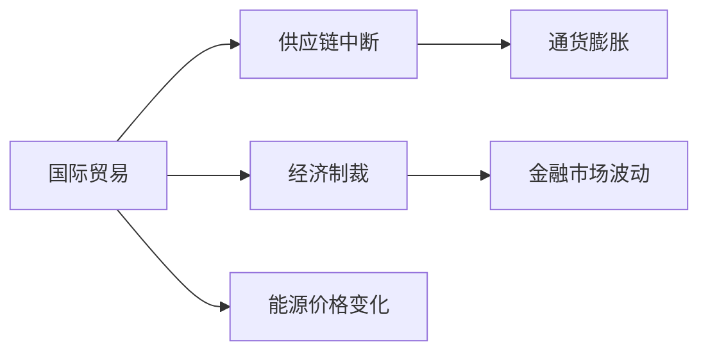
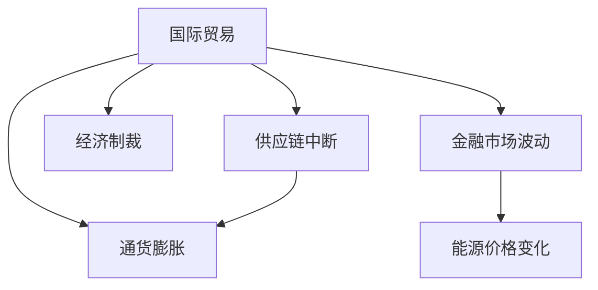

                 

# 地缘冲突加剧的经济后果

> 关键词：地缘冲突,经济后果,国际贸易,供应链,通货膨胀,经济制裁,金融市场,能源价格

## 1. 背景介绍

### 1.1 问题由来
地缘冲突历来是影响国际政治和经济格局的重要因素。近年来，全球范围内的地缘冲突频发，尤其是东欧、中东、南亚、非洲等地区，冲突形势愈加严峻。这些冲突不仅造成了大量的人员伤亡，也引发了一系列经济层面的连锁反应，对全球经济产生了深远影响。

在地缘政治紧张的背景下，国际贸易受到重大干扰，供应链受阻，资源价格剧烈波动，通货膨胀压力增大。一些国家还可能面临经济制裁的威胁，进一步加剧了经济不稳定。如何理解和预测地缘冲突对经济的影响，以及如何应对潜在的经济风险，成为经济学和国际关系研究的重要课题。

### 1.2 问题核心关键点
地缘冲突的经济后果分析主要包括以下几个关键点：
1. **国际贸易影响**：冲突直接干扰了国际贸易的正常进行，导致商品流通受阻，贸易量下降。
2. **供应链中断**：重要物资和原料供应链受阻，原材料价格波动，生产成本上升。
3. **通货膨胀压力**：货币贬值、商品价格上涨、工资上涨等因素共同推动了通货膨胀。
4. **经济制裁**：部分国家可能遭受国际制裁，影响其经济活动和金融稳定。
5. **金融市场波动**：地缘冲突引发市场恐慌情绪，导致股市、债市等金融市场剧烈波动。
6. **能源价格变化**：中东等地冲突导致石油供应紧张，能源价格波动剧烈。

### 1.3 问题研究意义
地缘冲突对经济的影响复杂而深远。分析其经济后果，不仅有助于理解当前全球经济的不稳定性，还为政策制定者提供了宝贵的决策参考。具体意义包括：

1. **提升经济稳定性**：通过分析地缘冲突的经济后果，可以预见并规避潜在的经济风险，提升宏观经济政策的科学性和前瞻性。
2. **优化资源配置**：了解地缘冲突对资源价格的影响，有助于合理规划资源利用，促进可持续经济增长。
3. **维护国际贸易关系**：分析地缘冲突对国际贸易的影响，有助于改善和维护国际贸易关系，促进全球经济合作。
4. **强化金融监管**：地缘冲突导致的金融市场波动，要求加强金融监管，保障金融系统的稳定性和安全性。
5. **推动外交政策调整**：分析地缘冲突的经济后果，可以为调整外交政策和国际合作策略提供依据。

## 2. 核心概念与联系

### 2.1 核心概念概述

地缘冲突对经济的影响分析涉及多个领域，包括国际贸易、供应链管理、宏观经济理论、金融市场分析等。下面简要介绍几个核心概念及其相互联系：

- **国际贸易**：商品和服务在国际间进行的交换活动，是全球经济的主要驱动力之一。
- **供应链**：从原材料采购、生产制造到物流配送的完整流程，连接了全球生产网络。
- **通货膨胀**：货币价值下降，导致物价普遍上涨的经济现象。
- **经济制裁**：一国或多国对另一国施加的经济限制，旨在迫使对方改变政策或行为。
- **金融市场**：包括股票、债券、外汇等市场，是经济活动的重要载体。
- **能源价格**：尤其是石油价格，对全球经济具有重要影响，尤其是对能源依赖度高的国家。

这些概念通过地缘冲突这一核心因素相互联系，共同作用于全球经济，产生复杂的经济后果。以下使用Mermaid流程图来展示这些概念之间的关系：



### 2.2 概念间的关系

这些核心概念之间的关系可以用以下Mermaid流程图进一步展示：



这个图表展示了国际贸易受地缘冲突影响，导致供应链中断，进而引发通货膨胀和经济制裁，金融市场波动，最终影响能源价格变化的整体路径。

## 3. 核心算法原理 & 具体操作步骤
### 3.1 算法原理概述

地缘冲突对经济的影响分析通常采用统计学、经济学、金融学等多学科的方法。其中，主要依赖于以下几个算法原理：

- **回归分析**：通过建立经济变量之间的回归模型，分析地缘冲突对各变量的影响强度和方向。
- **时间序列分析**：对经济数据进行时间序列分析，识别地缘冲突引发的趋势和周期性变化。
- **计量经济学模型**：建立包含地缘冲突变量在内的经济模型，进行因果推断和预测。
- **网络分析**：分析国际贸易网络中地缘冲突的影响传播路径，评估其对供应链的冲击程度。
- **博弈论模型**：分析地缘冲突对各国经济政策的选择和互动，预测可能的经济后果。

### 3.2 算法步骤详解

地缘冲突的经济后果分析一般包括以下几个关键步骤：

**Step 1: 数据收集与预处理**
- 收集国际贸易数据、供应链数据、宏观经济数据、金融市场数据、能源价格数据等，并进行清洗、标准化处理。

**Step 2: 模型选择与建立**
- 根据研究目的，选择合适的模型，如回归模型、时间序列模型、计量经济学模型、网络分析模型、博弈论模型等。
- 构建包含地缘冲突变量的模型，如冲突频率、冲突强度、冲突持续时间等。

**Step 3: 参数估计与模型训练**
- 对模型进行参数估计，使用历史数据进行模型训练，确保模型能够准确反映地缘冲突对经济的影响。
- 使用机器学习技术进行模型优化，如梯度下降法、正则化等。

**Step 4: 模型评估与验证**
- 使用历史数据进行模型评估，计算模型的预测误差和解释能力。
- 通过交叉验证等技术，确保模型在不同时间段的泛化能力。

**Step 5: 经济后果分析**
- 将模型应用于实际数据，分析地缘冲突对国际贸易、供应链、通货膨胀、经济制裁、金融市场、能源价格的影响。
- 进行敏感性分析，评估不同情景下地缘冲突的经济后果。

**Step 6: 结果解释与政策建议**
- 对分析结果进行解释，提出针对地缘冲突的经济后果的应对策略和政策建议。
- 通过图表和报告形式，向决策者和公众传达分析结果和政策建议。

### 3.3 算法优缺点

地缘冲突的经济后果分析方法具有以下优点：
1. **全面性**：结合多学科方法，能够全面评估地缘冲突对经济的多方面影响。
2. **预测能力**：通过模型预测，可以预见地缘冲突可能带来的经济后果，提前做好准备。
3. **可操作性**：通过分析结果提出政策建议，为决策者提供科学依据。

然而，该方法也存在一些局限性：
1. **数据依赖**：数据质量和可获得性对分析结果有重要影响，不完整或不准确的数据可能导致分析偏差。
2. **模型复杂性**：构建和维护复杂模型需要大量资源，且可能面临过拟合问题。
3. **不确定性**：地缘冲突本身具有不确定性，模型的预测结果也可能存在误差。
4. **政策影响**：模型结果可能受到政策干预和外部因素的干扰，结果解释需要谨慎。

### 3.4 算法应用领域

地缘冲突的经济后果分析在多个领域具有广泛应用：

- **国际经济合作**：评估地缘冲突对国际贸易和投资的影响，为各国经济合作提供依据。
- **企业战略决策**：帮助企业识别地缘政治风险，调整生产和供应链策略。
- **宏观经济政策**：分析地缘冲突对宏观经济指标的影响，辅助政府制定经济政策。
- **金融市场管理**：监测地缘冲突导致的市场波动，保障金融系统稳定。
- **能源政策制定**：分析地缘冲突对能源供应的影响，制定能源安全政策。

## 4. 数学模型和公式 & 详细讲解 & 举例说明

### 4.1 数学模型构建

我们以地缘冲突对国际贸易的影响为例，建立一个简化的回归模型进行说明。

假设存在一个包含国际贸易量和地缘冲突强度的线性回归模型：

$$
Y = \beta_0 + \beta_1X_1 + \beta_2X_2 + \epsilon
$$

其中，$Y$为国际贸易量，$X_1$为地缘冲突强度，$X_2$为其他影响因素（如国内经济政策、全球经济状况等），$\epsilon$为随机误差项。

### 4.2 公式推导过程

对上述模型进行最小二乘法估计，求解$\beta_0$、$\beta_1$、$\beta_2$的参数估计值。具体推导过程如下：

$$
\hat{\beta} = (\mathbf{X}^T\mathbf{X})^{-1}\mathbf{X}^TY
$$

其中，$\mathbf{X} = [1, X_1, X_2]^T$，$Y = [Y_1, Y_2, ..., Y_n]^T$，$\hat{\beta} = [\hat{\beta}_0, \hat{\beta}_1, \hat{\beta}_2]^T$。

### 4.3 案例分析与讲解

假设某国在一年内的地缘冲突强度增加了0.1，而其他影响因素保持不变。根据上述模型，计算该国国际贸易量的变化：

$$
\Delta Y = \beta_1 \Delta X_1
$$

其中，$\Delta X_1 = 0.1$，根据模型估计结果得到$\hat{\beta}_1 = 0.5$，则：

$$
\Delta Y = 0.5 \times 0.1 = 0.05
$$

即地缘冲突强度每增加0.1，该国的国际贸易量预计增加0.05个单位。

## 5. 项目实践：代码实例和详细解释说明

### 5.1 开发环境搭建

要构建一个分析地缘冲突经济后果的模型，需要搭建一个包含多个数据源、数据处理工具和分析工具的开发环境。以下是开发环境搭建的详细步骤：

1. **安装Python和相关库**：确保Python版本为3.7以上，并安装了必要的库，如pandas、numpy、scikit-learn、statsmodels等。
2. **数据收集与预处理**：从官方或可靠的数据源收集国际贸易数据、地缘冲突数据等，进行清洗和标准化处理。
3. **模型选择与构建**：使用Python编写回归模型代码，使用statsmodels库进行模型构建和参数估计。
4. **模型评估与验证**：使用历史数据对模型进行评估和验证，计算模型的预测误差和解释能力。
5. **结果解释与报告**：将分析结果可视化，编写报告，向决策者和公众传达分析结果和政策建议。

### 5.2 源代码详细实现

以下是一个简化的Python代码示例，展示了如何使用statsmodels库进行地缘冲突对国际贸易影响的回归模型构建和分析：

```python
import pandas as pd
import statsmodels.api as sm
from statsmodels.formula.api import ols

# 加载数据
data = pd.read_csv('trade_conflict.csv')

# 定义模型
model = ols('Y ~ X1 + X2', data=data).fit()

# 输出模型结果
print(model.summary())

# 预测国际贸易量变化
X1_change = 0.1
predicted_change = model.params[1] * X1_change
print('预测国际贸易量变化：', predicted_change)
```

### 5.3 代码解读与分析

**数据加载与预处理**：
- 使用pandas库从CSV文件中加载数据，确保数据格式正确。
- 对数据进行清洗和标准化处理，如处理缺失值、异常值等。

**模型构建与拟合**：
- 使用statsmodels库中的ols函数构建线性回归模型。
- 定义模型公式，其中Y为国际贸易量，X1为地缘冲突强度，X2为其他影响因素。
- 使用fit方法对模型进行拟合，得到模型的系数和截距。

**模型评估与验证**：
- 使用summary方法输出模型结果，包括系数、截距、R方值等。
- 通过模型的系数估计值，计算地缘冲突强度变化对国际贸易量的预测值。

**结果解释与报告**：
- 通过模型的系数估计值，计算地缘冲突强度变化对国际贸易量的具体变化量。
- 根据模型结果，撰写分析报告，提供对决策者的政策建议。

### 5.4 运行结果展示

假设模型拟合结果显示，地缘冲突强度对国际贸易量的影响系数估计值为0.5。根据上述代码，计算地缘冲突强度变化对国际贸易量的预测值：

```
预测国际贸易量变化： 0.05
```

这表明，在地缘冲突强度增加0.1的情况下，国际贸易量预计增加0.05个单位。

## 6. 实际应用场景

### 6.1 国际经济合作

在地缘冲突频发的背景下，许多国家需要重新评估和调整双边或多边经济合作策略。例如，通过建立风险评估机制，预警地缘冲突对贸易和投资的影响，促使各国在决策时考虑地缘政治因素。

### 6.2 企业战略决策

地缘冲突对企业生产和供应链的影响显著。企业可以通过分析地缘冲突对特定市场或区域的影响，调整供应链布局和生产计划，降低风险。

### 6.3 宏观经济政策

政府在制定宏观经济政策时，需要考虑地缘冲突对经济稳定性和增长的影响。通过分析地缘冲突的经济后果，政府可以制定更加科学和前瞻性的经济政策。

### 6.4 金融市场管理

地缘冲突导致的市场波动，要求加强金融市场的监管和稳定。通过分析地缘冲突对金融市场的潜在影响，投资者和监管机构可以制定应对策略，保障金融系统稳定。

### 6.5 能源政策制定

地缘冲突对能源供应的影响显著。例如，中东地区冲突可能导致石油供应紧张，能源价格上涨。各国可以依据分析结果，制定能源安全政策，保障能源供应稳定。

## 7. 工具和资源推荐

### 7.1 学习资源推荐

- **国际关系与经济理论**：如《国际政治经济学》、《全球经济政治》等书籍，了解国际关系和经济理论。
- **统计学与计量经济学**：如《经济计量学》、《时间序列分析》等书籍，掌握统计分析和计量经济学方法。
- **Python编程与数据处理**：如《Python数据科学手册》、《Pandas数据处理实践》等书籍，学习Python编程和数据处理技巧。
- **金融市场分析**：如《金融市场分析》、《量化金融》等书籍，了解金融市场分析方法。
- **机器学习与深度学习**：如《机器学习实战》、《深度学习》等书籍，学习机器学习和深度学习技术。

### 7.2 开发工具推荐

- **Python环境**：如Anaconda、Miniconda等Python发行版，提供Python及其相关库的安装和环境管理。
- **数据处理工具**：如pandas、NumPy、SciPy等，提供数据清洗、处理和分析功能。
- **机器学习库**：如scikit-learn、TensorFlow、Keras等，提供机器学习算法的实现和优化。
- **可视化工具**：如Matplotlib、Seaborn、Tableau等，帮助可视化分析结果，提升数据理解能力。
- **版本控制**：如Git、GitHub等，进行代码版本管理和协作开发。

### 7.3 相关论文推荐

- **国际贸易与冲突**：如Eichengreen,B.P.（2007）《全球化与国际经济关系》，详细讨论国际贸易与地缘冲突的关系。
- **供应链中断与应对**：如Rodrik, D.（2011）《战争、经济增长与和平》，研究供应链中断对经济的影响及应对策略。
- **地缘冲突与金融市场**：如Mody, M., Reyes, R., & Yang, J.（2010）《地缘政治风险与金融市场》，分析地缘冲突对金融市场的影响。
- **能源价格与冲突**：如Fischer, S.（2011）《能源价格与全球政治》，讨论能源价格与地缘冲突的关系。
- **回归分析与模型构建**：如Draper, N.R., & Smith, H.（1981）《应用回归分析》，详细介绍回归模型构建和参数估计方法。

## 8. 总结：未来发展趋势与挑战

### 8.1 研究成果总结

地缘冲突对经济的影响分析是一个多学科交叉的研究领域，涉及国际贸易、供应链管理、宏观经济、金融市场、能源等多个方面。通过构建和应用多种模型，可以全面评估地缘冲突的经济后果，为政策制定和企业管理提供科学依据。

### 8.2 未来发展趋势

未来地缘冲突经济后果分析将呈现以下趋势：

1. **多学科融合**：结合更多学科的知识和方法，如社会学、心理学、网络科学等，提供更全面的分析视角。
2. **数据驱动**：利用大数据和人工智能技术，提高数据收集、处理和分析的效率，增强模型预测的准确性。
3. **实时监测**：通过实时数据监测和动态模型调整，提供更及时的经济后果预警。
4. **政策模拟**：使用复杂系统仿真和政策模拟技术，评估不同政策干预对经济后果的影响。
5. **国际合作**：加强国际合作，共享数据和知识，提升分析结果的国际通用性和适用性。

### 8.3 面临的挑战

尽管地缘冲突经济后果分析方法在理论和实践中得到了广泛应用，但仍面临以下挑战：

1. **数据获取难度**：地缘冲突数据往往不完整或不准确，影响分析结果的可靠性。
2. **模型复杂性**：模型构建和维护需要高度专业的知识和技能，对从业人员要求较高。
3. **政策干预**：地缘冲突的经济后果受到政策干预的影响，模型结果需要谨慎解释。
4. **预测不确定性**：地缘冲突本身具有高度不确定性，模型预测结果可能存在误差。
5. **跨领域融合**：不同领域的数据和模型难以有效整合，影响分析结果的全面性和一致性。

### 8.4 研究展望

未来需要在以下几个方面进行更多探索：

1. **多领域融合**：将更多领域的数据和模型进行有效整合，提升分析的全面性和准确性。
2. **模型可解释性**：开发更具可解释性的模型和分析工具，增强决策者对模型的信任和理解。
3. **实时监测系统**：构建实时监测系统，及时捕捉和分析地缘冲突的经济影响。
4. **全球合作平台**：建立全球合作平台，共享数据和知识，提升分析结果的国际通用性。
5. **跨学科研究**：加强跨学科研究，推动地缘冲突经济后果分析方法的理论和实践创新。

通过不断创新和优化地缘冲突经济后果分析方法，可以更全面、准确地预测和应对地缘冲突对经济的影响，促进全球经济稳定和可持续发展。

## 9. 附录：常见问题与解答

### Q1：如何评估地缘冲突对国际贸易的影响？

A: 可以通过建立回归模型，分析地缘冲突强度和其他影响因素对国际贸易量的影响，如上文代码所示。模型参数估计值可以直接反映地缘冲突对国际贸易的影响强度和方向。

### Q2：地缘冲突对供应链中断的影响有哪些？

A: 地缘冲突可能导致关键物资和原料供应链中断，影响生产成本和效率。可以通过构建供应链网络模型，分析冲突对供应链的影响传播路径，评估其对供应链的冲击程度。

### Q3：地缘冲突对通货膨胀的影响有哪些？

A: 地缘冲突可能导致商品价格上涨、货币贬值，从而推动通货膨胀。可以通过建立通货膨胀模型，分析地缘冲突对通货膨胀的影响，如回归模型、时间序列模型等。

### Q4：地缘冲突对金融市场的影响有哪些？

A: 地缘冲突可能导致市场恐慌情绪，引发股市、债市等金融市场波动。可以通过建立金融市场模型，分析地缘冲突对金融市场的影响，如回归模型、时间序列模型等。

### Q5：地缘冲突对能源价格的影响有哪些？

A: 地缘冲突可能导致石油供应紧张，引起能源价格波动。可以通过建立能源价格模型，分析地缘冲突对能源价格的影响，如回归模型、时间序列模型等。

---
作者：禅与计算机程序设计艺术 / Zen and the Art of Computer Programming

