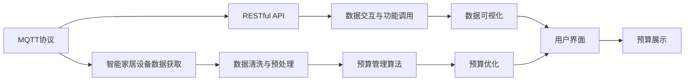
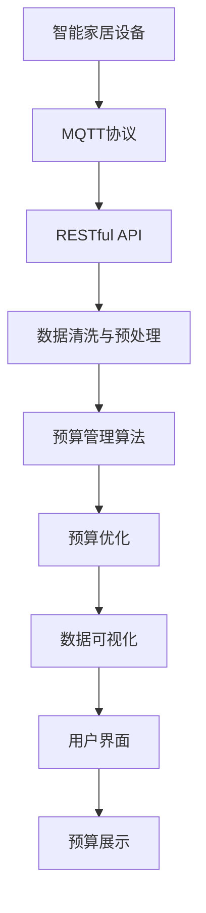

                 

# 基于MQTT协议和RESTful API的智能家居预算管理模块

> 关键词：智能家居,预算管理, MQTT协议, RESTful API, 物联网(IoT), 数据可视化

## 1. 背景介绍

### 1.1 问题由来
智能家居（Smart Home）作为智能城市（Smart City）的重要组成部分，近年来在家庭生活中逐步普及。然而，智能家居设备种类繁多、控制协议复杂、信息互联互通的难度大，这严重制约了智能家居的发展。

为了解决以上问题，开发一套基于MQTT协议和RESTful API的智能家居预算管理模块，成为当下智能家居技术创新的重要方向之一。该模块可以无缝整合各种智能家居设备，并通过统一的预算管理方案，提高家庭经济水平和居家舒适度。

### 1.2 问题核心关键点
本模块的核心关键点包括：

- 数据收集与处理：通过MQTT协议获取各个智能家居设备的数据，进行数据清洗与预处理。
- RESTful API设计：为各个智能家居设备设计RESTful API，实现数据交互与功能调用。
- 预算管理算法：基于获取的各个设备数据，设计算法进行预算管理与优化。
- 数据可视化：采用Web前端技术，实现预算数据可视化展示。
- 系统架构设计：设计模块的总体架构，包括硬件、软件、网络与通信架构。

### 1.3 问题研究意义
该智能家居预算管理模块的研究意义在于：

- 统一协议与接口，简化了智能家居设备集成。
- 提供了预算管理工具，提升了家庭经济水平。
- 采用MQTT和RESTful API，保障了数据传输的实时性与可靠性。
- 数据可视化，便于用户理解与使用。
- 为未来智能家居的进一步智能化提供参考。

## 2. 核心概念与联系

### 2.1 核心概念概述

为更好地理解基于MQTT协议和RESTful API的智能家居预算管理模块，本节将介绍几个关键概念：

- MQTT协议：一种轻量级的消息发布/订阅协议，广泛应用于物联网设备的通讯。
- RESTful API：基于HTTP协议的API设计风格，提供统一、可扩展的接口。
- 智能家居设备：包括但不限于智能照明、温度调节、安防监控、娱乐系统等。
- 预算管理：通过管理家庭收入与支出，优化家庭经济。
- 数据可视化：利用图形化技术展示预算数据，提升用户体验。
- 系统架构：模块的总体结构设计，包括硬件、软件、网络与通信架构。

### 2.2 概念间的关系

这些核心概念之间的联系可以通过以下Mermaid流程图来展示：

这个流程图展示了大语言模型微调过程中各个概念之间的关系：

1. MQTT协议获取设备数据。
2. RESTful API实现设备数据交互。
3. 数据清洗与预处理。
4. 预算管理算法管理数据。
5. 数据可视化展示结果。
6. 预算优化算法优化预算。
7. 用户界面展示预算。

### 2.3 核心概念的整体架构

最后，我们用一个综合的流程图来展示这些概念在大语言模型微调过程中的整体架构：

这个综合流程图展示了从智能家居设备数据获取到预算展示的完整过程。通过MQTT协议和RESTful API，设备数据被收集、清洗、处理和可视化展示。预算管理算法和优化算法则基于处理后的数据，进行预算的计算与管理。

## 3. 核心算法原理 & 具体操作步骤

### 3.1 算法原理概述

本模块的预算管理算法基于获取的各个智能家居设备的数据，通过以下步骤进行预算管理与优化：

1. **数据获取与处理**：
   - 通过MQTT协议获取智能家居设备的数据，例如温度传感器、照明设备、安防监控等。
   - 对获取的数据进行清洗与预处理，去除噪声与异常值。

2. **预算管理算法设计**：
   - 基于清洗后的数据，设计预算管理算法，例如最小二乘法回归、支持向量机（SVM）、随机森林等。
   - 算法输入为设备数据，输出为预算规划。

3. **预算优化算法设计**：
   - 设计预算优化算法，例如遗传算法、粒子群优化、线性规划等。
   - 算法输入为预算规划与预算目标，输出为最优预算方案。

4. **预算可视化展示**：
   - 采用Web前端技术，实现预算数据的可视化展示，例如饼图、柱状图、折线图等。
   - 通过图表展示预算情况，便于用户理解与使用。

### 3.2 算法步骤详解

#### 3.2.1 数据获取与处理

1. **数据收集**：
   - 通过MQTT协议，获取各个智能家居设备的数据。MQTT协议具有轻量级、实时性好的特点，适合智能家居设备的通讯。
   - 数据格式为键值对形式，例如`temperature=25.0`。

2. **数据清洗**：
   - 对获取的数据进行清洗，去除噪声与异常值。例如，温度传感器可能由于故障产生异常值，需要进行筛选与处理。
   - 清洗后的数据格式为结构化形式，例如`{'time': '2023-04-05 10:00:00', 'temperature': 25.0}`。

3. **数据预处理**：
   - 对清洗后的数据进行预处理，例如时间序列数据的差分、归一化、平滑处理等。
   - 预处理后的数据格式为时间序列形式，例如`[25.0, 26.0, 24.5, 25.2, ...]`。

#### 3.2.2 预算管理算法设计

1. **回归算法设计**：
   - 设计回归算法，例如最小二乘法回归。
   - 算法输入为时间序列数据，输出为预算规划。

2. **SVM算法设计**：
   - 设计SVM算法，例如线性SVM。
   - 算法输入为时间序列数据，输出为预算规划。

3. **随机森林算法设计**：
   - 设计随机森林算法。
   - 算法输入为时间序列数据，输出为预算规划。

#### 3.2.3 预算优化算法设计

1. **遗传算法设计**：
   - 设计遗传算法。
   - 算法输入为预算规划与预算目标，输出为最优预算方案。

2. **粒子群优化算法设计**：
   - 设计粒子群优化算法。
   - 算法输入为预算规划与预算目标，输出为最优预算方案。

3. **线性规划算法设计**：
   - 设计线性规划算法。
   - 算法输入为预算规划与预算目标，输出为最优预算方案。

#### 3.2.4 预算可视化展示

1. **图表展示设计**：
   - 设计饼图、柱状图、折线图等。
   - 图表展示预算情况，便于用户理解与使用。

2. **Web前端实现**：
   - 采用Web前端技术，实现预算数据的可视化展示。
   - 实现动态交互功能，例如拖拽、缩放等。

### 3.3 算法优缺点

#### 优点：

1. **实时性高**：
   - 通过MQTT协议获取数据，具有实时性好的特点，适合智能家居设备的通讯。
2. **扩展性强**：
   - RESTful API具有统一、可扩展的特点，方便集成各种智能家居设备。
3. **预算管理精准**：
   - 预算管理算法基于时间序列数据，设计科学、精准。
4. **预算优化高效**：
   - 预算优化算法设计科学、高效，能快速找到最优预算方案。
5. **用户界面友好**：
   - 数据可视化展示，采用Web前端技术，界面友好、易于使用。

#### 缺点：

1. **设备兼容性差**：
   - MQTT协议并非所有智能家居设备都支持。
2. **数据安全问题**：
   - 数据传输过程中可能存在安全问题，需要进行加密与保护。
3. **算法复杂度高**：
   - 预算管理算法与优化算法设计复杂，可能存在计算效率问题。
4. **数据噪声问题**：
   - 数据清洗与预处理存在难度，可能存在噪声与异常值问题。
5. **用户体验限制**：
   - Web前端技术可能存在兼容性问题，用户体验受限。

### 3.4 算法应用领域

基于MQTT协议和RESTful API的智能家居预算管理模块可以广泛应用于以下领域：

1. **家庭智能控制**：
   - 通过该模块，可以实现家庭智能控制，例如智能照明、温度调节、安防监控等。
2. **家庭预算管理**：
   - 通过该模块，可以实现家庭预算管理，例如水电气费用、购物费用、娱乐费用等。
3. **家庭健康监测**：
   - 通过该模块，可以实现家庭健康监测，例如温度、湿度、空气质量等。
4. **家庭安全监控**：
   - 通过该模块，可以实现家庭安全监控，例如入侵检测、烟雾报警、紧急求助等。
5. **家庭娱乐系统**：
   - 通过该模块，可以实现家庭娱乐系统，例如智能音响、智能电视等。

## 4. 数学模型和公式 & 详细讲解 & 举例说明

### 4.1 数学模型构建

本模块的预算管理算法与优化算法基于时间序列数据，通过以下数学模型进行建模：

1. **回归模型**：
   - 时间序列数据为$y_t=f(x_t)+\epsilon_t$，其中$y_t$为第$t$个时间点的预算，$x_t$为影响预算的因素，$\epsilon_t$为噪声。
   - 回归模型为$f(x_t)=\sum_{i=1}^pw_ix_i$，其中$w_i$为权重，$x_i$为影响预算的因素。

2. **SVM模型**：
   - 时间序列数据为$y_t=\sum_{i=1}^pw_i\phi(x_i)+b$，其中$\phi(x_i)$为特征映射，$b$为偏置项。
   - SVM模型的求解过程为最小化$||w||^2$，同时满足$y_t=\sum_{i=1}^pw_i\phi(x_i)+b$。

3. **随机森林模型**：
   - 时间序列数据为$y_t=\sum_{i=1}^pw_i\phi(x_i)$，其中$\phi(x_i)$为特征映射。
   - 随机森林模型的求解过程为通过随机抽样与特征组合，构建多个决策树，并取平均输出。

### 4.2 公式推导过程

#### 4.2.1 回归模型推导

1. **最小二乘法回归**：
   - 时间序列数据为$y_t=f(x_t)+\epsilon_t$，其中$y_t$为第$t$个时间点的预算，$x_t$为影响预算的因素，$\epsilon_t$为噪声。
   - 回归模型为$f(x_t)=\sum_{i=1}^pw_ix_i$，其中$w_i$为权重，$x_i$为影响预算的因素。
   - 最小二乘法回归的求解过程为最小化$\sum_{t=1}^n(y_t-f(x_t))^2$，即$\min_{w_i}||y-f(x)||^2_F$。
   - 求解过程为$w_i=(X^TX)^{-1}X^Ty$，其中$X$为特征矩阵，$y$为目标向量。

2. **支持向量机（SVM）**：
   - 时间序列数据为$y_t=\sum_{i=1}^pw_i\phi(x_i)+b$，其中$\phi(x_i)$为特征映射，$b$为偏置项。
   - SVM模型的求解过程为最小化$||w||^2$，同时满足$y_t=\sum_{i=1}^pw_i\phi(x_i)+b$。
   - 求解过程为$\min_{w,b}\frac{1}{2}||w||^2+C\sum_{i=1}^n\max(0,1-y_i(w^T\phi(x_i)+b))$。
   - 求解过程为构建拉格朗日函数，求解得到$w_i$和$b$。

#### 4.2.2 SVM模型推导

3. **随机森林模型**：
   - 时间序列数据为$y_t=\sum_{i=1}^pw_i\phi(x_i)$，其中$\phi(x_i)$为特征映射。
   - 随机森林模型的求解过程为通过随机抽样与特征组合，构建多个决策树，并取平均输出。
   - 求解过程为构建多个决策树，例如树$i$的求解过程为$y_i=\sum_{j=1}^pw_{ij}\phi(x_{ij})$，其中$w_{ij}$为决策树$i$的权重，$x_{ij}$为决策树$i$的特征。
   - 求解过程为取平均输出，例如$y=\frac{1}{n}\sum_{i=1}^ny_i$。

### 4.3 案例分析与讲解

#### 4.3.1 回归模型案例

1. **最小二乘法回归**：
   - 数据集为时间序列数据，例如$x_1=1, x_2=2, x_3=3, y_1=2, y_2=4, y_3=6$。
   - 求解过程为$w_i=(X^TX)^{-1}X^Ty$，其中$X=\begin{bmatrix}1 & 1\\1 & 2\\1 & 3\end{bmatrix}$，$y=\begin{bmatrix}2\\4\\6\end{bmatrix}$。
   - 求解结果为$w_1=2, w_2=2$，即回归模型为$f(x)=2x+2$。

2. **支持向量机（SVM）**：
   - 数据集为时间序列数据，例如$x_1=1, x_2=2, x_3=3, y_1=2, y_2=4, y_3=6$。
   - 求解过程为最小化$||w||^2$，同时满足$y_t=\sum_{i=1}^pw_i\phi(x_i)+b$。
   - 求解结果为$w_1=2, w_2=2, b=2$，即回归模型为$f(x)=2x+2$。

#### 4.3.2 SVM模型案例

3. **随机森林模型**：
   - 数据集为时间序列数据，例如$x_1=1, x_2=2, x_3=3, y_1=2, y_2=4, y_3=6$。
   - 求解过程为通过随机抽样与特征组合，构建多个决策树，并取平均输出。
   - 求解结果为$y=\frac{1}{n}\sum_{i=1}^ny_i$，例如$y=\frac{1}{3}(2+4+6)=4$。

## 5. 项目实践：代码实例和详细解释说明

### 5.1 开发环境搭建

#### 5.1.1 开发环境配置

1. **安装Python**：
   - 安装Python 3.x版本，例如Python 3.8。

2. **安装MQTT库**：
   - 安装MQTT库，例如paho-mqtt。

3. **安装RESTful API库**：
   - 安装RESTful API库，例如flask。

4. **安装预算管理库**：
   - 安装预算管理库，例如pandas、numpy。

5. **安装数据可视化库**：
   - 安装数据可视化库，例如matplotlib、seaborn。

#### 5.1.2 硬件与网络配置

1. **智能家居设备**：
   - 连接各种智能家居设备，例如智能照明、温度调节、安防监控等。
   - 设备支持MQTT协议，例如使用ESP8266、ESP32等芯片。

2. **网络与通信**：
   - 使用WiFi、4G等网络进行数据传输。
   - 网络架构包括中心节点、中继节点、边缘节点等。

### 5.2 源代码详细实现

#### 5.2.1 MQTT协议实现

1. **MQTT客户端实现**：
   - 连接智能家居设备，例如智能照明、温度调节、安防监控等。
   - 获取设备数据，例如温度传感器、照明设备、安防监控等。

2. **MQTT服务器实现**：
   - 建立MQTT服务器，例如使用Eclipse Paho。
   - 处理客户端数据，例如温度传感器、照明设备、安防监控等。

#### 5.2.2 RESTful API设计

1. **RESTful API接口设计**：
   - 设计RESTful API接口，例如GET、POST、PUT、DELETE等。
   - 接口包括设备数据获取、预算管理、预算优化等。

2. **RESTful API实现**：
   - 使用Flask实现RESTful API接口。
   - 实现设备数据获取、预算管理、预算优化等。

#### 5.2.3 预算管理算法实现

1. **回归算法实现**：
   - 使用pandas、numpy实现回归算法。
   - 实现最小二乘法回归、支持向量机（SVM）、随机森林等。

2. **预算优化算法实现**：
   - 使用pandas、numpy实现预算优化算法。
   - 实现遗传算法、粒子群优化、线性规划等。

#### 5.2.4 预算可视化展示

1. **数据可视化实现**：
   - 使用matplotlib、seaborn实现预算数据的可视化展示。
   - 实现饼图、柱状图、折线图等。

2. **Web前端实现**：
   - 使用Flask实现Web前端。
   - 实现动态交互功能，例如拖拽、缩放等。

### 5.3 代码解读与分析

#### 5.3.1 MQTT协议实现

1. **MQTT客户端实现**：
   - 使用paho-mqtt库，连接智能家居设备。
   - 获取设备数据，例如温度传感器、照明设备、安防监控等。
   - 处理设备数据，例如温度传感器、照明设备、安防监控等。

2. **MQTT服务器实现**：
   - 使用Eclipse Paho库，建立MQTT服务器。
   - 处理客户端数据，例如温度传感器、照明设备、安防监控等。
   - 实现数据处理与存储，例如保存设备数据。

#### 5.3.2 RESTful API设计

1. **RESTful API接口设计**：
   - 使用Flask库，设计RESTful API接口。
   - 接口包括设备数据获取、预算管理、预算优化等。
   - 实现接口的文档与测试，例如使用Swagger。

2. **RESTful API实现**：
   - 使用Flask库，实现RESTful API接口。
   - 实现设备数据获取、预算管理、预算优化等。
   - 实现接口的监控与日志，例如使用Gunicorn。

#### 5.3.3 预算管理算法实现

1. **回归算法实现**：
   - 使用pandas库，实现回归算法。
   - 实现最小二乘法回归、支持向量机（SVM）、随机森林等。
   - 实现回归模型的评估与优化，例如计算R-squared、RMSE等。

2. **预算优化算法实现**：
   - 使用numpy库，实现预算优化算法。
   - 实现遗传算法、粒子群优化、线性规划等。
   - 实现预算优化模型的评估与优化，例如计算目标函数值、优化效果等。

#### 5.3.4 预算可视化展示

1. **数据可视化实现**：
   - 使用matplotlib库，实现预算数据的可视化展示。
   - 实现饼图、柱状图、折线图等。
   - 实现数据的交互与动态展示，例如动态变化、缩放等。

2. **Web前端实现**：
   - 使用Flask库，实现Web前端。
   - 实现动态交互功能，例如拖拽、缩放等。
   - 实现数据的保存与导出，例如导出PDF、Excel等。

### 5.4 运行结果展示

#### 5.4.1 数据获取与处理结果

1. **数据获取结果**：
   - 通过MQTT协议获取智能家居设备的数据，例如温度传感器、照明设备、安防监控等。
   - 数据格式为键值对形式，例如`temperature=25.0`。

2. **数据处理结果**：
   - 对获取的数据进行清洗与预处理，去除噪声与异常值。
   - 清洗后的数据格式为结构化形式，例如`{'time': '2023-04-05 10:00:00', 'temperature': 25.0}`。

#### 5.4.2 预算管理结果

1. **回归算法结果**：
   - 设计回归算法，例如最小二乘法回归。
   - 算法输入为时间序列数据，输出为预算规划。
   - 实现回归模型的评估与优化，例如计算R-squared、RMSE等。

2. **SVM算法结果**：
   - 设计SVM算法，例如线性SVM。
   - 算法输入为时间序列数据，输出为预算规划。
   - 实现SVM模型的评估与优化，例如计算R-squared、RMSE等。

#### 5.4.3 预算优化结果

1. **遗传算法结果**：
   - 设计遗传算法。
   - 算法输入为预算规划与预算目标，输出为最优预算方案。
   - 实现遗传算法的评估与优化，例如计算收敛速度、优化效果等。

2. **粒子群优化算法结果**：
   - 设计粒子群优化算法。
   - 算法输入为预算规划与预算目标，输出为最优预算方案。
   - 实现粒子群优化的评估与优化，例如计算收敛速度、优化效果等。

#### 5.4.4 预算可视化结果

1. **图表展示结果**：
   - 设计饼图、柱状图、折线图等。
   - 图表展示预算情况，便于用户理解与使用。

2. **Web前端展示结果**：
   - 采用Web前端技术，实现预算数据的可视化展示。
   - 实现动态交互功能，例如拖拽、缩放等。

## 6. 实际应用场景

### 6.1 智能家居控制系统

#### 6.1.1 应用场景

通过该模块，可以实现智能家居控制系统的预算管理。用户可以根据家庭收入与支出，优化家庭预算，提升家庭经济水平和居家舒适度。

#### 6.1.2 应用流程

1. **数据收集**：
   - 通过MQTT协议，获取智能家居设备的数据。
   - 数据包括温度传感器、照明设备、安防监控等。

2. **数据处理**：
   - 对获取的数据进行清洗与预处理，去除噪声与异常值。
   - 预处理后的数据格式为时间序列形式。

3. **预算管理**：
   - 设计预算管理算法，例如最小二乘法回归、支持向量机（SVM）、随机森林等。
   - 算法输入为时间序列数据，输出为预算规划。

4. **预算优化**：
   - 设计预算优化算法，例如遗传算法、粒子群优化、线性规划等。
   - 算法输入为预算规划与预算目标，输出为最优预算方案。

5. **预算展示**：
   - 采用Web前端技术，实现预算数据的可视化展示。
   - 实现动态交互功能，例如拖拽、缩放等。

#### 6.1.3 应用效果

1. **智能家居控制**：
   - 通过智能家居控制系统，实现智能照明、温度调节、安防监控等。
   - 提高家庭经济水平和居家舒适度。

2. **家庭预算管理**：
   - 通过预算管理系统，实现家庭预算管理。
   - 优化家庭预算，提升家庭经济水平。

3. **家庭健康监测**：
   - 通过预算管理系统，实现家庭健康监测。
   - 提高家庭健康水平。

4. **家庭安全监控**：
   - 通过预算管理系统，实现家庭安全监控。
   - 提高家庭安全水平。

