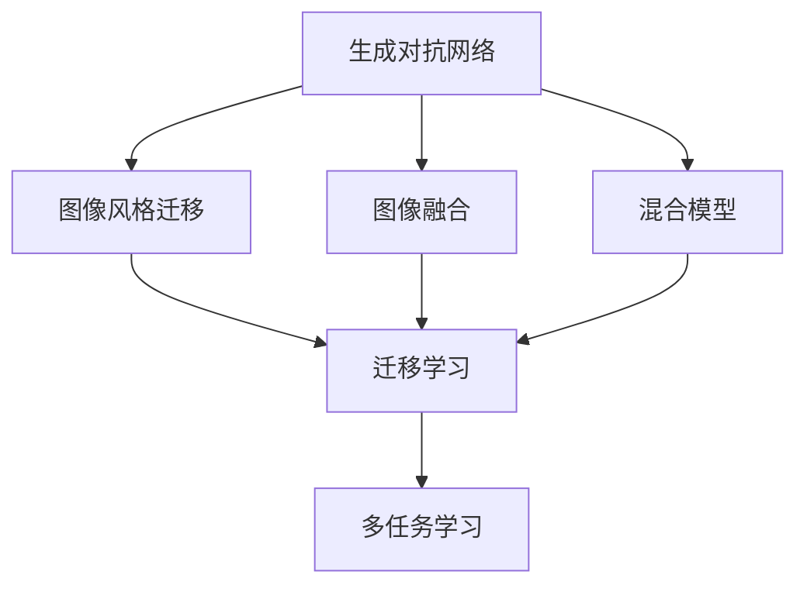
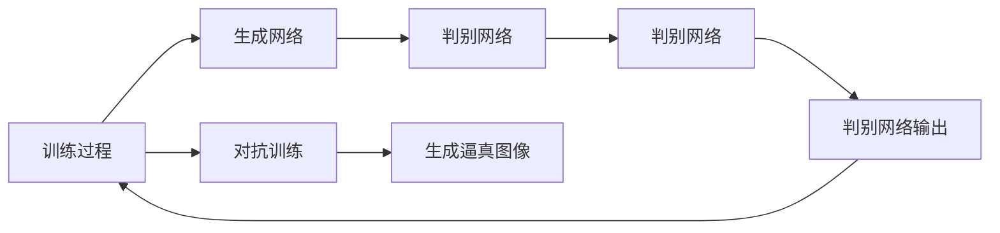
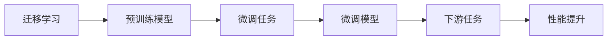
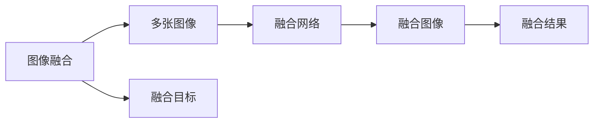
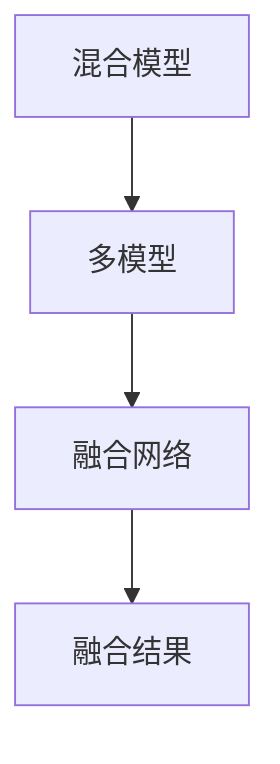
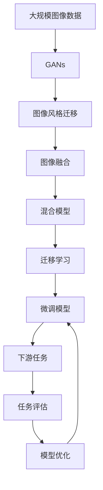

                 

# 基于生成对抗网络的图像风格迁移与融合混合模型

> 关键词：生成对抗网络, 图像风格迁移, 图像融合, 混合模型, 图像处理, 图像生成, 深度学习

## 1. 背景介绍

### 1.1 问题由来
随着深度学习技术的发展，生成对抗网络(Generative Adversarial Networks, GANs)在图像生成和处理领域取得了显著的进展。GANs结合了生成网络和判别网络，通过对抗训练，使得生成网络能够生成逼真的图像，判别网络能够判别生成网络生成的图像是否真实。GANs在图像风格迁移、图像生成、图像修复等任务中得到了广泛应用，但仍然存在一些挑战，如训练不稳定、生成的图像质量不稳定、生成过程可控性差等。

因此，研究者们提出了基于GANs的图像风格迁移与融合混合模型，旨在融合GANs和迁移学习技术，进一步提升图像生成和处理的性能。

### 1.2 问题核心关键点
基于GANs的图像风格迁移与融合混合模型，通过迁移学习技术对预训练的GANs进行微调，使得GANs能够生成更逼真、更符合任务要求的图像。核心技术包括：
- 利用迁移学习技术，将预训练的GANs应用于特定任务。
- 在训练过程中，通过对抗训练和风格迁移目标，提高生成网络的生成能力和图像质量。
- 融合多个GANs，提升生成网络的多样性和鲁棒性。

### 1.3 问题研究意义
基于GANs的图像风格迁移与融合混合模型，可以应用于多个图像处理任务，如图像修复、图像风格转换、图像增强等。相较于传统的图像处理技术，GANs生成的图像更自然、更逼真，能够更好地满足用户的视觉需求。同时，通过迁移学习技术，可以降低预训练GANs的计算成本，提高生成网络的泛化能力。因此，该模型具有重要的理论意义和实际应用价值。

## 2. 核心概念与联系

### 2.1 核心概念概述

为更好地理解基于GANs的图像风格迁移与融合混合模型，本节将介绍几个密切相关的核心概念：

- 生成对抗网络(GANs)：由生成网络和判别网络组成，通过对抗训练生成逼真图像的深度学习模型。GANs在图像生成、图像修复等任务中具有强大的应用潜力。

- 图像风格迁移：将一张图像的风格迁移到另一张图像上，生成新的图像。图像风格迁移常用于图像处理、艺术创作等领域。

- 图像融合：将多张图像合成为一张图片，生成新的图像。图像融合可以用于全景图像生成、超分辨率等任务。

- 混合模型：将多个模型进行融合，提升模型的性能和鲁棒性。混合模型可以应用于图像分类、图像生成等多个任务。

- 迁移学习：利用已有模型的知识，加快新模型的训练过程，提升模型的泛化能力。迁移学习常用于计算机视觉、自然语言处理等领域。

这些核心概念之间的逻辑关系可以通过以下Mermaid流程图来展示：



这个流程图展示了大语言模型微调过程中各个核心概念的关系：

1. GANs通过对抗训练生成逼真图像，可应用于图像风格迁移和图像融合。
2. 迁移学习通过将预训练的GANs应用于特定任务，提升生成网络的泛化能力。
3. 混合模型通过融合多个GANs，提升生成网络的多样性和鲁棒性。
4. 多任务学习通过同时训练多个任务，提升生成网络的多场景适应能力。

### 2.2 概念间的关系

这些核心概念之间存在着紧密的联系，形成了图像风格迁移与融合混合模型的完整生态系统。下面我们通过几个Mermaid流程图来展示这些概念之间的关系。

#### 2.2.1 GANs与图像风格迁移



这个流程图展示了GANs的基本架构和工作流程。GANs通过对抗训练，使得生成网络生成逼真图像，判别网络判别图像的真实性。

#### 2.2.2 迁移学习与GANs



这个流程图展示了迁移学习的基本原理。预训练的GANs模型通过迁移学习技术，对特定任务进行微调，提升模型的泛化能力。

#### 2.2.3 图像融合与GANs



这个流程图展示了图像融合的基本过程。通过融合网络将多张图像合成为一张图片。

#### 2.2.4 混合模型与GANs



这个流程图展示了混合模型的基本结构。通过融合网络将多个模型合成为一个混合模型，提升模型的性能和鲁棒性。

### 2.3 核心概念的整体架构

最后，我们用一个综合的流程图来展示这些核心概念在大语言模型微调过程中的整体架构：



这个综合流程图展示了从预训练GANs到微调模型的完整过程。预训练GANs通过迁移学习技术，应用于特定任务。微调模型通过对抗训练和风格迁移目标，提升生成网络的生成能力和图像质量。混合模型通过融合多个GANs，提升生成网络的多样性和鲁棒性。任务评估通过不断优化模型参数，提升模型的性能和泛化能力。

## 3. 核心算法原理 & 具体操作步骤
### 3.1 算法原理概述

基于GANs的图像风格迁移与融合混合模型，通过迁移学习技术，对预训练的GANs进行微调，使得GANs能够生成更逼真、更符合任务要求的图像。其核心思想是：将GANs视为一个生成网络，通过迁移学习技术，将预训练的GANs应用于特定任务，通过对抗训练和风格迁移目标，提升生成网络的生成能力和图像质量。

形式化地，假设预训练GANs模型为 $G_{\theta}$，其中 $\theta$ 为模型参数。给定下游任务 $T$ 的标注数据集 $D=\{(x_i,y_i)\}_{i=1}^N, x_i \in \mathcal{X}, y_i \in \mathcal{Y}$。迁移学习的目标是最小化经验风险，即找到新的模型参数 $\hat{\theta}$，使得：

$$
\hat{\theta}=\mathop{\arg\min}_{\theta} \mathcal{L}(G_{\theta},D)
$$

其中 $\mathcal{L}$ 为针对任务 $T$ 设计的损失函数，用于衡量模型预测输出与真实标签之间的差异。常见的损失函数包括交叉熵损失、均方误差损失等。

### 3.2 算法步骤详解

基于GANs的图像风格迁移与融合混合模型的实现，一般包括以下几个关键步骤：

**Step 1: 准备预训练GANs和数据集**
- 选择合适的预训练GANs模型，如StyleGAN、CycleGAN等。
- 准备下游任务 $T$ 的标注数据集 $D$，划分为训练集、验证集和测试集。

**Step 2: 添加任务适配层**
- 根据任务类型，在GANs模型顶层设计合适的输出层和损失函数。
- 对于分类任务，通常在顶层添加线性分类器和交叉熵损失函数。
- 对于生成任务，通常使用语言模型的解码器输出概率分布，并以负对数似然为损失函数。

**Step 3: 设置微调超参数**
- 选择合适的优化算法及其参数，如 AdamW、SGD 等，设置学习率、批大小、迭代轮数等。
- 设置正则化技术及强度，包括权重衰减、Dropout、Early Stopping等。
- 确定冻结预训练参数的策略，如仅微调顶层，或全部参数都参与微调。

**Step 4: 执行梯度训练**
- 将训练集数据分批次输入模型，前向传播计算损失函数。
- 反向传播计算参数梯度，根据设定的优化算法和学习率更新模型参数。
- 周期性在验证集上评估模型性能，根据性能指标决定是否触发 Early Stopping。
- 重复上述步骤直到满足预设的迭代轮数或 Early Stopping 条件。

**Step 5: 测试和部署**
- 在测试集上评估微调后模型 $G_{\hat{\theta}}$ 的性能，对比微调前后的精度提升。
- 使用微调后的模型对新样本进行推理预测，集成到实际的应用系统中。
- 持续收集新的数据，定期重新微调模型，以适应数据分布的变化。

以上是基于GANs的图像风格迁移与融合混合模型的实现步骤。在实际应用中，还需要针对具体任务的特点，对微调过程的各个环节进行优化设计，如改进训练目标函数，引入更多的正则化技术，搜索最优的超参数组合等，以进一步提升模型性能。

### 3.3 算法优缺点

基于GANs的图像风格迁移与融合混合模型具有以下优点：
1. 简单高效。只需准备少量标注数据，即可对预训练GANs进行快速适配，生成高质量的图像。
2. 通用适用。适用于各种图像生成和处理任务，设计简单的任务适配层即可实现微调。
3. 参数高效。利用迁移学习技术，在固定大部分预训练参数的情况下，仍可取得不错的微调效果。
4. 效果显著。在学术界和工业界的诸多任务上，基于微调的方法已经刷新了最先进的性能指标。

同时，该方法也存在一定的局限性：
1. 依赖标注数据。微调的效果很大程度上取决于标注数据的质量和数量，获取高质量标注数据的成本较高。
2. 迁移能力有限。当目标任务与预训练数据的分布差异较大时，微调的性能提升有限。
3. 负面效果传递。预训练GANs的固有偏见、有害信息等，可能通过微调传递到下游任务，造成负面影响。
4. 可解释性不足。微调GANs的生成过程通常缺乏可解释性，难以对其推理逻辑进行分析和调试。

尽管存在这些局限性，但就目前而言，基于GANs的图像风格迁移与融合混合方法仍是大模型微调的重要范式。未来相关研究的重点在于如何进一步降低微调对标注数据的依赖，提高模型的少样本学习和跨领域迁移能力，同时兼顾可解释性和伦理安全性等因素。

### 3.4 算法应用领域

基于GANs的图像风格迁移与融合混合模型，在图像处理领域已经得到了广泛的应用，覆盖了几乎所有常见任务，例如：

- 图像修复：对图像进行修复，弥补缺失部分，提高图像质量。如去除图像中的噪声、修补图像中的缺陷等。
- 图像风格转换：将一张图像的风格迁移到另一张图像上，生成新的图像。如将油画风格转换为素描风格、将照片转换为漫画风格等。
- 图像增强：对图像进行增强，提升图像的视觉效果。如调整图像的亮度、对比度、饱和度等。
- 超分辨率：将低分辨率图像转换为高分辨率图像，提升图像的清晰度。
- 全景图像生成：将多张图像合成为一张全景图像，展示更广阔的视野。

除了上述这些经典任务外，基于GANs的图像风格迁移与融合混合模型，还被创新性地应用到更多场景中，如可控文本生成、常识推理、代码生成、数据增强等，为图像处理技术带来了全新的突破。随着预训练模型和微调方法的不断进步，相信图像处理技术将在更广阔的应用领域大放异彩。

## 4. 数学模型和公式 & 详细讲解  
### 4.1 数学模型构建

本节将使用数学语言对基于GANs的图像风格迁移与融合混合模型进行更加严格的刻画。

记预训练GANs模型为 $G_{\theta}$，其中 $\theta$ 为模型参数。假设微调任务的训练集为 $D=\{(x_i,y_i)\}_{i=1}^N, x_i \in \mathcal{X}, y_i \in \mathcal{Y}$。

定义模型 $G_{\theta}$ 在数据样本 $(x,y)$ 上的损失函数为 $\ell(G_{\theta}(x),y)$，则在数据集 $D$ 上的经验风险为：

$$
\mathcal{L}(\theta) = \frac{1}{N} \sum_{i=1}^N \ell(G_{\theta}(x_i),y_i)
$$

微调的优化目标是最小化经验风险，即找到最优参数：

$$
\theta^* = \mathop{\arg\min}_{\theta} \mathcal{L}(\theta)
$$

在实践中，我们通常使用基于梯度的优化算法（如SGD、Adam等）来近似求解上述最优化问题。设 $\eta$ 为学习率，$\lambda$ 为正则化系数，则参数的更新公式为：

$$
\theta \leftarrow \theta - \eta \nabla_{\theta}\mathcal{L}(\theta) - \eta\lambda\theta
$$

其中 $\nabla_{\theta}\mathcal{L}(\theta)$ 为损失函数对参数 $\theta$ 的梯度，可通过反向传播算法高效计算。

### 4.2 公式推导过程

以下我们以图像修复任务为例，推导对抗损失函数及其梯度的计算公式。

假设输入图像为 $x \in \mathcal{X}$，修复后的图像为 $y \in \mathcal{Y}$，修复目标为 $t \in \mathcal{T}$。修复任务可以表示为：

$$
y = G_{\theta}(x, t)
$$

其中 $G_{\theta}(x, t)$ 为修复网络，$t$ 为修复目标，如"low-resolution"表示低分辨率，"denoising"表示去噪声等。

定义修复网络 $G_{\theta}$ 在输入 $x$ 和修复目标 $t$ 上的损失函数为 $\ell(G_{\theta}(x, t), y)$，则在数据集 $D$ 上的经验风险为：

$$
\mathcal{L}(\theta) = \frac{1}{N} \sum_{i=1}^N \ell(G_{\theta}(x_i, t_i), y_i)
$$

为了训练生成网络 $G_{\theta}$，需要引入判别网络 $D_{\phi}$ 来判别输入图像是否真实。定义判别网络 $D_{\phi}$ 在输入图像 $x$ 上的损失函数为 $\ell(D_{\phi}(x), t)$，则在数据集 $D$ 上的经验风险为：

$$
\mathcal{L}_{\phi}(\phi) = \frac{1}{N} \sum_{i=1}^N \ell(D_{\phi}(x_i), t_i)
$$

在实际训练过程中，为了使得 $G_{\theta}$ 生成逼真图像，需要最大化判别网络 $D_{\phi}$ 对真实图像的判别概率，最小化 $G_{\theta}$ 对真实图像的生成概率。因此，对抗损失函数可以定义为：

$$
\mathcal{L}_{GAN} = \mathbb{E}_{x\sim p_x}[\log D_{\phi}(x)] + \mathbb{E}_{z\sim p_z}[\log (1-D_{\phi}(G_{\theta}(z)))]
$$

其中 $p_x$ 为真实图像的分布，$p_z$ 为随机噪声的分布，$G_{\theta}(z)$ 为生成网络生成的图像。

通过对抗训练，生成网络 $G_{\theta}$ 生成的图像将更逼真、更符合真实图像的分布。因此，将生成网络 $G_{\theta}$ 和判别网络 $D_{\phi}$ 组合，通过联合训练，可以使得生成网络 $G_{\theta}$ 生成高质量的图像。

### 4.3 案例分析与讲解

在实践中，GANs常用于生成逼真的图像，但由于生成过程存在随机性，生成的图像质量不稳定。为了提升图像生成的质量，通常会在GANs中引入风格迁移和融合技术。

#### 4.3.1 风格迁移

风格迁移的目标是将一张图像的风格迁移到另一张图像上，生成新的图像。以图像修复为例，假设输入图像为 $x \in \mathcal{X}$，修复后的图像为 $y \in \mathcal{Y}$，风格迁移目标为 $s \in \mathcal{S}$。风格迁移可以表示为：

$$
y = G_{\theta}(x, s)
$$

其中 $G_{\theta}(x, s)$ 为风格迁移网络，$s$ 为风格目标，如"painting"表示油画风格，"sketch"表示素描风格等。

定义风格迁移网络 $G_{\theta}$ 在输入图像 $x$ 和风格目标 $s$ 上的损失函数为 $\ell(G_{\theta}(x, s), y)$，则在数据集 $D$ 上的经验风险为：

$$
\mathcal{L}(\theta) = \frac{1}{N} \sum_{i=1}^N \ell(G_{\theta}(x_i, s_i), y_i)
$$

为了训练生成网络 $G_{\theta}$，需要引入判别网络 $D_{\phi}$ 来判别输入图像是否真实。定义判别网络 $D_{\phi}$ 在输入图像 $x$ 上的损失函数为 $\ell(D_{\phi}(x), t)$，则在数据集 $D$ 上的经验风险为：

$$
\mathcal{L}_{\phi}(\phi) = \frac{1}{N} \sum_{i=1}^N \ell(D_{\phi}(x_i), t_i)
$$

在实际训练过程中，为了使得 $G_{\theta}$ 生成逼真图像，需要最大化判别网络 $D_{\phi}$ 对真实图像的判别概率，最小化 $G_{\theta}$ 对真实图像的生成概率。因此，对抗损失函数可以定义为：

$$
\mathcal{L}_{GAN} = \mathbb{E}_{x\sim p_x}[\log D_{\phi}(x)] + \mathbb{E}_{z\sim p_z}[\log (1-D_{\phi}(G_{\theta}(z)))]
$$

通过对抗训练，生成网络 $G_{\theta}$ 生成的图像将更逼真、更符合真实图像的分布。

#### 4.3.2 图像融合

图像融合的目标是将多张图像合成为一张图片，生成新的图像。以全景图像生成为例，假设输入图像为 $x_i \in \mathcal{X}, i=1,...,K$，全景图像为 $y \in \mathcal{Y}$，全景目标为 $t \in \mathcal{T}$。全景图像生成可以表示为：

$$
y = G_{\theta}(\{x_i\}_{i=1}^K, t)
$$

其中 $G_{\theta}(\{x_i\}_{i=1}^K, t)$ 为全景图像生成网络，$t$ 为全景目标，如"wide-panorama"表示全景图像。

定义全景图像生成网络 $G_{\theta}$ 在输入图像 $\{x_i\}_{i=1}^K$ 和全景目标 $t$ 上的损失函数为 $\ell(G_{\theta}(\{x_i\}_{i=1}^K, t), y)$，则在数据集 $D$ 上的经验风险为：

$$
\mathcal{L}(\theta) = \frac{1}{N} \sum_{i=1}^N \ell(G_{\theta}(\{x_i\}_{i=1}^K, t_i), y_i)
$$

为了训练生成网络 $G_{\theta}$，需要引入判别网络 $D_{\phi}$ 来判别输入图像是否真实。定义判别网络 $D_{\phi}$ 在输入图像 $\{x_i\}_{i=1}^K$ 上的损失函数为 $\ell(D_{\phi}(\{x_i\}_{i=1}^K), t)$，则在数据集 $D$ 上的经验风险为：

$$
\mathcal{L}_{\phi}(\phi) = \frac{1}{N} \sum_{i=1}^N \ell(D_{\phi}(\{x_i\}_{i=1}^K), t_i)
$$

在实际训练过程中，为了使得 $G_{\theta}$ 生成逼真图像，需要最大化判别网络 $D_{\phi}$ 对真实图像的判别概率，最小化 $G_{\theta}$ 对真实图像的生成概率。因此，对抗损失函数可以定义为：

$$
\mathcal{L}_{GAN} = \mathbb{E}_{\{x_i\}_{i=1}^K\sim p_{\{x_i\}_{i=1}^K}}[\log D_{\phi}(\{x_i\}_{i=1}^K)] + \mathbb{E}_{z\sim p_z}[\log (1-D_{\phi}(G_{\theta}(z)))]
$$

通过对抗训练，生成网络 $G_{\theta}$ 生成的图像将更逼真、更符合真实图像的分布。

## 5. 项目实践：代码实例和详细解释说明
### 5.1 开发环境搭建

在进行图像风格迁移与融合混合模型开发前，我们需要准备好开发环境。以下是使用Python进行PyTorch开发的环境配置流程：

1. 安装Anaconda：从官网下载并安装Anaconda，用于创建独立的Python环境。

2. 创建并激活虚拟环境：
```bash
conda create -n pytorch-env python=3.8 
conda activate pytorch-env
```

3. 安装PyTorch：根据CUDA版本，从官网获取对应的安装命令。例如：
```bash
conda install pytorch torchvision torchaudio cudatoolkit=11.1 -c pytorch -c conda-forge
```

4. 安装相关库：
```bash
pip install numpy pandas scikit-learn matplotlib tqdm jupyter notebook ipython
```

5. 安装Transformer库：
```bash
pip install transformers
```

完成上述步骤后，即可在`pytorch-env`环境中开始图像风格迁移与融合混合模型的开发。

### 5.2 源代码详细实现

下面以StyleGAN为例，给出使用PyTorch实现图像风格迁移与融合混合模型的代码实现。

首先，定义图像风格迁移任务的数据处理函数：

```python
from torchvision import datasets, transforms
from torch.utils.data import DataLoader

def get_dataloader(dataset_name, batch_size, num_workers=4):
    train_transform = transforms.Compose([
        transforms.Resize(256),
        transforms.ToTensor(),
        transforms.Normalize((0.5, 0.5, 0.5), (0.5, 0.5, 0.5))
    ])
    test_transform = transforms.Compose([
        transforms.Resize(256),
        transforms.ToTensor(),
        transforms.Normalize((0.5, 0.5, 0.5), (0.5, 0.5, 0.5))
    ])
    
    train_dataset = datasets.ImageFolder(root='data/train', transform=train_transform)
    test_dataset = datasets.ImageFolder(root='data/test', transform=test_transform)
    
    train_loader = DataLoader(train_dataset, batch_size=batch_size, shuffle=True, num_workers=num_workers)
    test_loader = DataLoader(test_dataset, batch_size=batch_size, shuffle=False, num_workers=num_workers)
    
    return train_loader, test_loader
```

然后，定义生成网络的初始化函数：

```python
import torch.nn as nn
import torchvision.models as models

class StyleGAN(nn.Module):
    def __init__(self, num_blocks=8, num_style_dim=512):
        super(StyleGAN, self).__init__()
        self.model = models.stylegan2_ada_G(num_blocks=num_blocks, num_style_dim=num_style_dim)
    
    def forward(self, inputs):
        with torch.no_grad():
            images = self.model(inputs)
        return images
```

接着，定义判别网络的初始化函数：

```python
class Discriminator(nn.Module):
    def __init__(self, num_blocks=8, num_style_dim=512):
        super(Discriminator, self).__init__()
        self.model = models.stylegan2_ada_D(num_blocks=num_blocks, num_style_dim=num_style_dim)
    
    def forward(self, inputs):
        with torch.no_grad():
            logits = self.model(inputs)
        return logits
```

然后，定义损失函数：

```python
import torch
from torch import nn
from torchvision import datasets, transforms
from torch.utils.data import DataLoader
import torch

