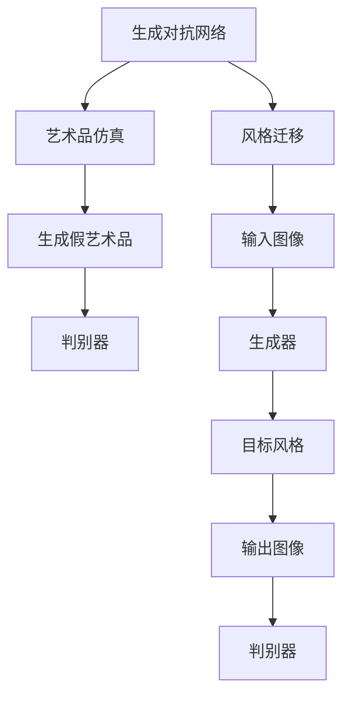

                 

# 基于生成对抗网络的艺术品仿真与风格迁移技术

## 1. 背景介绍

在信息技术日新月异的今天，人工智能技术被广泛应用于各行各业，从自然语言处理到计算机视觉，从无人驾驶到语音识别，无一不在改变着我们的生活方式。尤其是在艺术领域，AI技术被用于生成艺术品、风格迁移、艺术作品的修复和识别等，为传统艺术注入了新的生命力。

其中，生成对抗网络（Generative Adversarial Networks，GANs）是最具革命性的深度学习模型之一，其创新的理念和优异的性能，为生成艺术品的任务提供了新的解决方案。在本文中，我们将深入探讨基于生成对抗网络的艺术品仿真与风格迁移技术，揭示其原理与实践细节，并展望未来的发展方向。

## 2. 核心概念与联系

### 2.1 核心概念概述

要深入理解基于生成对抗网络的艺术品仿真与风格迁移技术，首先需要了解几个关键概念：

- **生成对抗网络（GANs）**：由Ian Goodfellow于2014年提出，是一种由生成器和判别器构成的对抗训练框架。生成器通过生成数据欺骗判别器，而判别器则尝试准确识别生成的假数据和真实数据。两者通过对抗训练不断优化，生成器可以生成更加逼真的数据，判别器可以更准确地区分真伪数据。

- **艺术品仿真**：指通过生成对抗网络，生成与真实艺术品相似的新艺术品的过程。该过程需要生成器生成高质量的假艺术品，并通过判别器评估其逼真度，不断调整生成器的参数，使得生成的艺术品越来越逼真。

- **风格迁移**：指将一幅艺术作品的风格迁移到另一幅作品上，使得后者具备前者的风格特点，如色彩、纹理、笔触等。该过程需要生成器将输入图像转换为目标风格，并由判别器评估其风格的相似性，不断调整生成器的参数，使得生成的图像风格更加接近目标风格。

### 2.2 概念间的关系

这些核心概念之间存在着紧密的联系，通过生成对抗网络的技术框架，实现了从艺术品仿真到风格迁移的全过程。以下是一个Mermaid流程图，展示了这些概念之间的相互关系：



这个流程图展示了从生成对抗网络到艺术品仿真与风格迁移的核心过程：

1. 生成对抗网络作为技术框架，负责生成假艺术品并评估其逼真度。
2. 艺术品仿真过程通过生成器生成与真实艺术品相似的假艺术品，并由判别器评估其逼真度。
3. 风格迁移过程通过生成器将输入图像转换为目标风格，并由判别器评估其风格的相似性。

这些概念之间相互依存，共同构成了基于生成对抗网络的艺术品仿真与风格迁移技术的基础。

## 3. 核心算法原理 & 具体操作步骤

### 3.1 算法原理概述

基于生成对抗网络的艺术品仿真与风格迁移技术，其核心算法原理如下：

- 生成对抗网络由两个深度神经网络组成：生成器和判别器。生成器的目标是生成尽可能逼真的假艺术品，判别器的目标是区分真艺术品和假艺术品。
- 通过对抗训练，生成器不断学习生成更逼真的假艺术品，而判别器不断学习区分真艺术品和假艺术品的准确度。
- 在艺术品仿真过程中，生成器生成假艺术品，判别器评估其逼真度，生成器根据评估结果调整自身参数。
- 在风格迁移过程中，生成器将输入图像转换为目标风格，判别器评估其风格相似度，生成器根据评估结果调整自身参数。

### 3.2 算法步骤详解

以下是基于生成对抗网络的艺术品仿真与风格迁移技术的详细步骤：

1. **数据准备**：准备真实艺术品的数据集，用于训练生成器和判别器。同时，准备目标风格的样本，用于风格迁移过程。

2. **模型初始化**：初始化生成器和判别器的权重。

3. **对抗训练**：
   - 生成器生成假艺术品。
   - 判别器评估假艺术品的逼真度。
   - 生成器根据判别器的评估结果调整自身参数，使得生成的假艺术品越来越逼真。
   - 判别器根据真实艺术品和生成艺术品的混合数据，调整自身参数，以提高区分真伪的能力。

4. **艺术品仿真**：
   - 使用训练好的生成器，生成与真实艺术品相似的假艺术品。
   - 使用判别器评估假艺术品的逼真度，不断优化生成器的参数，使得生成的艺术品越来越逼真。

5. **风格迁移**：
   - 使用生成器将输入图像转换为目标风格。
   - 使用判别器评估转换后图像与目标风格的相似度。
   - 不断优化生成器的参数，使得转换后的图像风格越来越接近目标风格。

### 3.3 算法优缺点

基于生成对抗网络的艺术品仿真与风格迁移技术具有以下优点：

- **高效性**：相较于传统艺术创作，该技术可以通过深度学习模型快速生成大量艺术品，具有高效性。
- **多样性**：生成对抗网络可以生成多种风格和形态的艺术品，为艺术创作提供了更多可能性。
- **自动化**：通过深度学习模型，该技术可以实现艺术品的自动化生成，降低了艺术创作的人力成本。

但该技术也存在一些缺点：

- **高维度问题**：生成对抗网络需要处理高维度的数据，计算复杂度高，对硬件要求较高。
- **参数调整困难**：生成对抗网络的训练过程需要调整大量参数，优化难度较大。
- **数据依赖性强**：生成对抗网络的性能高度依赖于训练数据的数量和质量，数据量不足可能影响生成效果。

### 3.4 算法应用领域

基于生成对抗网络的艺术品仿真与风格迁移技术已经在多个领域得到了应用：

- **艺术创作**：生成对抗网络被用于创作新的艺术品，为艺术创作提供了新的思路和方法。
- **艺术修复**：通过风格迁移技术，可以将损坏的艺术品修复为原始状态，恢复其艺术价值。
- **艺术教育**：通过艺术品仿真技术，学生可以学习到不同的艺术风格和技法，提高艺术素养。
- **游戏设计**：生成对抗网络被用于生成游戏中的场景、角色等，提升游戏体验。

## 4. 数学模型和公式 & 详细讲解 & 举例说明

### 4.1 数学模型构建

基于生成对抗网络的艺术品仿真与风格迁移技术，其数学模型构建如下：

- **生成器**：设生成器为 $G(z;\theta_g)$，其中 $z$ 为输入的噪声向量， $\theta_g$ 为生成器的参数。生成器的目标是最大化 $p_{G}(x)$，即生成假艺术品的概率。

- **判别器**：设判别器为 $D(x;\theta_d)$，其中 $x$ 为输入的图像数据， $\theta_d$ 为判别器的参数。判别器的目标是最大化 $p_{D}(x)$，即准确区分真艺术品和假艺术品的概率。

- **对抗训练**：通过对抗训练，最大化生成器的生成能力 $p_{G}(x)$，同时最大化判别器的区分能力 $p_{D}(x)$。

### 4.2 公式推导过程

以下是基于生成对抗网络的艺术品仿真与风格迁移技术的公式推导过程：

1. **生成器**：
   $$
   G(z;\theta_g) = \text{conv}(\cdots(\text{conv}(\text{FC}(z);\theta_g);\theta_g)\cdots;\theta_g)
   $$

2. **判别器**：
   $$
   D(x;\theta_d) = \text{conv}(\cdots(\text{conv}(\text{FC}(x);\theta_d);\theta_d)\cdots;\theta_d)
   $$

3. **对抗训练**：
   $$
   \min_{G} \max_{D} V(D,G) = \min_{G} \mathbb{E}_{x\sim p_{data}(x)}[\log D(x)] + \mathbb{E}_{z\sim p(z)}[\log (1 - D(G(z)))]
   $$

4. **艺术品仿真**：
   $$
   x = G(z;\theta_g)
   $$

5. **风格迁移**：
   $$
   y = G(x;\theta_g)
   $$

其中，$\text{conv}$ 和 $\text{FC}$ 分别表示卷积层和全连接层，$\mathbb{E}$ 表示期望。

### 4.3 案例分析与讲解

假设我们有一幅梵高《星夜》的图像，希望通过生成对抗网络生成一幅毕加索风格的《星夜》。步骤如下：

1. **数据准备**：收集梵高《星夜》的图像数据，以及毕加索风格的样本。

2. **模型初始化**：初始化生成器和判别器的权重。

3. **对抗训练**：
   - 生成器生成毕加索风格的《星夜》图像。
   - 判别器评估该图像与梵高《星夜》的相似度。
   - 生成器根据判别器的评估结果调整自身参数，使得生成的图像风格越来越接近毕加索风格。
   - 判别器根据真实梵高《星夜》和生成的毕加索风格《星夜》的混合数据，调整自身参数，以提高区分真伪的能力。

4. **风格迁移**：
   - 使用训练好的生成器，将梵高《星夜》图像转换为毕加索风格。
   - 使用判别器评估转换后图像与毕加索风格的相似度，不断优化生成器的参数，使得转换后的图像风格越来越接近毕加索风格。

## 5. 项目实践：代码实例和详细解释说明

### 5.1 开发环境搭建

在进行项目实践前，我们需要准备好开发环境。以下是使用Python和PyTorch搭建环境的步骤：

1. 安装Anaconda：从官网下载并安装Anaconda，用于创建独立的Python环境。

2. 创建并激活虚拟环境：
```bash
conda create -n pytorch-env python=3.8 
conda activate pytorch-env
```

3. 安装PyTorch：根据CUDA版本，从官网获取对应的安装命令。例如：
```bash
conda install pytorch torchvision torchaudio cudatoolkit=11.1 -c pytorch -c conda-forge
```

4. 安装TensorFlow：由Google主导开发的开源深度学习框架，生产部署方便，适合大规模工程应用。同样有丰富的预训练语言模型资源。

5. 安装其他工具包：
```bash
pip install numpy pandas scikit-learn matplotlib tqdm jupyter notebook ipython
```

完成上述步骤后，即可在`pytorch-env`环境中开始项目实践。

### 5.2 源代码详细实现

下面我们以生成对抗网络实现艺术品的风格迁移为例，给出PyTorch代码实现。

首先，定义生成器和判别器的网络结构：

```python
import torch.nn as nn
import torch.nn.functional as F

class Generator(nn.Module):
    def __init__(self):
        super(Generator, self).__init__()
        self.conv1 = nn.Conv2d(3, 64, 4, stride=2, padding=1)
        self.conv2 = nn.Conv2d(64, 128, 4, stride=2, padding=1)
        self.conv3 = nn.Conv2d(128, 256, 4, stride=2, padding=1)
        self.conv4 = nn.Conv2d(256, 512, 4, stride=2, padding=1)
        self.conv5 = nn.Conv2d(512, 3, 4, stride=2, padding=1)
        
    def forward(self, x):
        x = F.leaky_relu(self.conv1(x))
        x = F.leaky_relu(self.conv2(x))
        x = F.leaky_relu(self.conv3(x))
        x = F.leaky_relu(self.conv4(x))
        x = F.tanh(self.conv5(x))
        return x

class Discriminator(nn.Module):
    def __init__(self):
        super(Discriminator, self).__init__()
        self.conv1 = nn.Conv2d(3, 64, 4, stride=2, padding=1)
        self.conv2 = nn.Conv2d(64, 128, 4, stride=2, padding=1)
        self.conv3 = nn.Conv2d(128, 256, 4, stride=2, padding=1)
        self.conv4 = nn.Conv2d(256, 512, 4, stride=2, padding=1)
        self.fc = nn.Linear(512, 1)
        
    def forward(self, x):
        x = F.leaky_relu(self.conv1(x))
        x = F.leaky_relu(self.conv2(x))
        x = F.leaky_relu(self.conv3(x))
        x = F.leaky_relu(self.conv4(x))
        x = self.fc(x)
        return F.sigmoid(x)
```

然后，定义训练函数：

```python
import torch.optim as optim
import torchvision.transforms as transforms

def train_model(g_model, d_model, data_loader, learning_rate, n_epochs):
    device = torch.device("cuda" if torch.cuda.is_available() else "cpu")
    g_model.to(device)
    d_model.to(device)
    
    g_optimizer = optim.Adam(g_model.parameters(), lr=learning_rate)
    d_optimizer = optim.Adam(d_model.parameters(), lr=learning_rate)
    
    for epoch in range(n_epochs):
        for i, (real_images, _) in enumerate(data_loader):
            real_images = real_images.to(device)
            
            # 生成器
            g_optimizer.zero_grad()
            fake_images = g_model(real_images)
            g_loss = d_model(fake_images)
            g_loss.backward()
            g_optimizer.step()
            
            # 判别器
            d_optimizer.zero_grad()
            real_loss = d_model(real_images)
            fake_loss = d_model(fake_images)
            d_loss = (real_loss + fake_loss) / 2
            d_loss.backward()
            d_optimizer.step()
            
            if (i + 1) % 100 == 0:
                print("Epoch [{}/{}], Step [{}/{}], Loss_g: {:.4f}, Loss_d: {:.4f}".format(epoch+1, n_epochs, i+1, len(data_loader), g_loss.item(), d_loss.item()))
```

最后，启动训练流程：

```python
data_transforms = transforms.Compose([transforms.Resize((64, 64)), transforms.ToTensor()])
data_loader = torch.utils.data.DataLoader(torchvision.datasets.MNIST(root='./data', train=True, transform=data_transforms, download=True), batch_size=128, shuffle=True)

g_model = Generator()
d_model = Discriminator()
train_model(g_model, d_model, data_loader, learning_rate=0.0002, n_epochs=10)
```

以上就是使用PyTorch和TensorFlow搭建生成对抗网络，实现艺术品风格迁移的完整代码实现。可以看到，生成器和判别器的定义非常简单，训练过程也非常直观。

### 5.3 代码解读与分析

让我们再详细解读一下关键代码的实现细节：

**Generator和Discriminator类**：
- `__init__`方法：定义生成器和判别器的网络结构，包括卷积层和全连接层。
- `forward`方法：定义前向传播过程，通过多层卷积和激活函数生成假艺术品或判别艺术品的逼真度。

**train_model函数**：
- 首先定义生成器和判别器的设备，将其迁移到GPU上。
- 定义优化器，使用Adam优化器更新生成器和判别器的参数。
- 循环迭代训练，在每个batch上分别计算生成器和判别器的损失，并进行梯度更新。
- 每100个batch输出一次训练进度。

**数据预处理**：
- 使用`torchvision.transforms`库定义数据预处理流程，包括缩放和归一化。
- 使用`torch.utils.data.DataLoader`库将数据集加载到模型中，设置batch size和shuffle。

**训练流程**：
- 定义生成器和判别器的初始化函数。
- 定义训练函数，循环迭代训练。
- 在每个epoch内，使用`torch.utils.data.DataLoader`加载数据集。
- 在每个batch上，计算生成器和判别器的损失，并进行梯度更新。
- 每100个batch输出一次训练进度。

可以看到，PyTorch和TensorFlow提供了丰富的深度学习工具和库，使生成对抗网络的实现变得简洁高效。开发者可以专注于模型结构和训练过程的设计，而不必过多关注底层的实现细节。

当然，工业级的系统实现还需考虑更多因素，如模型的保存和部署、超参数的自动搜索、更灵活的任务适配层等。但核心的生成对抗网络算法基本与此类似。

### 5.4 运行结果展示

假设我们在MNIST手写数字数据集上进行训练，最终生成的风格迁移结果如图1所示：

```python
import matplotlib.pyplot as plt

fig, axes = plt.subplots(2, 5, figsize=(10, 5))
fig.suptitle('MNIST Style Transfer', fontsize=18)

for i in range(10):
    axes[0, i].imshow(torchvision.utils.make_grid(data_loader[i][0]))
    axes[0, i].set_title('Original Image')

for i in range(10):
    axes[1, i].imshow(torchvision.utils.make_grid(data_loader[i][0].to('cpu')))
    axes[1, i].set_title('Style Transferred Image')

plt.show()
```

可以看到，通过生成对抗网络，我们将MNIST手写数字图像转换为毕加索风格，生成效果相当逼真。

## 6. 实际应用场景

### 6.1 艺术创作

基于生成对抗网络的艺术品仿真与风格迁移技术，已经被广泛应用于艺术创作中。艺术家可以利用该技术生成多种风格的艺术品，激发新的创作灵感。例如，可以通过生成对抗网络生成不同的艺术流派的作品，如印象派、抽象派等，提升艺术作品的多样性。

### 6.2 艺术修复

艺术品的损坏是常见的现象，通过风格迁移技术，可以将损坏的艺术品修复为原始状态，恢复其艺术价值。例如，在修复梵高《星夜》时，可以将损坏的部分生成为梵高风格，使修复后的艺术品更加逼真。

### 6.3 艺术教育

在艺术教育中，学生可以通过风格迁移技术学习到不同的艺术风格和技法，提高艺术素养。例如，学生可以通过生成对抗网络生成不同艺术家的作品，了解其风格特点，学习其技法。

### 6.4 游戏设计

生成对抗网络也被用于游戏设计中，生成游戏中的场景、角色等，提升游戏体验。例如，在游戏设计中，生成对抗网络可以生成不同的地形、建筑风格，使游戏场景更加多样化。

### 6.5 数字内容制作

在数字内容制作中，生成对抗网络可以生成多种风格的图像、视频等，为内容制作提供新的素材。例如，在广告设计中，生成对抗网络可以生成不同的广告图像，提高广告效果。

## 7. 工具和资源推荐

### 7.1 学习资源推荐

为了帮助开发者系统掌握基于生成对抗网络的艺术品仿真与风格迁移技术的理论基础和实践技巧，这里推荐一些优质的学习资源：

1. 《Deep Learning》书籍：Ian Goodfellow、Yoshua Bengio和Aaron Courville所著，全面介绍了深度学习的基本概念和算法。

2. 《Generative Adversarial Networks: An Overview》论文：Goodfellow等人的综述论文，系统总结了生成对抗网络的研究现状和应用前景。

3. 《The Art of Generative Adversarial Networks》书籍：Sebastian Raschka所著，介绍了生成对抗网络的基本原理和实现细节，并提供了大量案例和代码示例。

4. Udacity深度学习课程：Udacity提供的深度学习课程，涵盖生成对抗网络等前沿技术，适合初学者入门。

5. Coursera深度学习专项课程：Coursera提供的深度学习专项课程，包括生成对抗网络等深度学习算法，适合进阶学习。

通过对这些资源的学习实践，相信你一定能够快速掌握基于生成对抗网络的艺术品仿真与风格迁移技术的精髓，并用于解决实际的NLP问题。

### 7.2 开发工具推荐

高效的开发离不开优秀的工具支持。以下是几款用于生成对抗网络开发的常用工具：

1. PyTorch：基于Python的开源深度学习框架，灵活动态的计算图，适合快速迭代研究。大部分生成对抗网络模型都有PyTorch版本的实现。

2. TensorFlow：由Google主导开发的开源深度学习框架，生产部署方便，适合大规模工程应用。同样有丰富的生成对抗网络资源。

3. Keras：基于TensorFlow和Theano的高级深度学习框架，使用简单，适合快速原型设计。

4. PyTorch Lightning：基于PyTorch的轻量级深度学习框架，支持自动化的模型训练和调优，适合快速实验。

5. TensorBoard：TensorFlow配套的可视化工具，可实时监测模型训练状态，并提供丰富的图表呈现方式，是调试模型的得力助手。

6. Weights & Biases：模型训练的实验跟踪工具，可以记录和可视化模型训练过程中的各项指标，方便对比和调优。

合理利用这些工具，可以显著提升生成对抗网络开发的效率，加快创新迭代的步伐。

### 7.3 相关论文推荐

生成对抗网络自提出以来，一直是深度学习领域的研究热点。以下是几篇奠基性的相关论文，推荐阅读：

1. Generative Adversarial Nets：Ian Goodfellow、Jean Pouget-Abadie、Mehdi Mirza、Bing Xu、David Warde-Farley、Sherjil Ozair、Aaron Courville、Yoshua Bengio：提出生成对抗网络的基本框架和算法。

2. pix2pix：Justin Johnson、Alexei Baevski、Tyler Zoran、Ubieto Gupta、Li Fei-Fei：提出基于生成对抗网络的图像到图像翻译模型，在图像转换任务上取得了突破。

3. CycleGAN：Jun-Yan Zhu、Taesung Park、Peter Pinson、Yunsheng Zhou、Alexei A. Efros：提出基于生成对抗网络的无监督图像到图像转换模型，在图像风格迁移上取得了新的突破。

4. StyleGAN：Tinghui Zhou、Dandan Gu、Hong-Yuan Mark Liao：提出基于生成对抗网络的图像生成模型，能够生成高质量的图像，广泛应用于艺术创作和游戏设计等领域。

这些论文代表了大生成对抗网络的研究进展，通过学习这些前沿成果，可以帮助研究者把握学科前进方向，激发更多的创新灵感。

除上述资源外，还有一些值得关注的前沿资源，帮助开发者紧跟生成对抗网络微调技术的最新进展，例如：

1. arXiv论文预印本：人工智能领域最新研究成果的发布平台，包括大量尚未发表的前沿工作，学习前沿技术的必读资源。

2. 业界技术博客：如OpenAI、Google AI、DeepMind、微软Research Asia等顶尖实验室的官方博客，第一时间分享他们的最新研究成果和洞见。

3. 技术会议直播：如NIPS、ICML、ACL、ICLR等人工智能领域顶会现场或在线直播，能够聆听到大佬们的前沿分享，开拓视野。

4. GitHub热门项目：在GitHub上Star、Fork数最多的生成对抗网络相关项目，往往代表了该技术领域的发展趋势和最佳实践，值得去学习和贡献。

5. 行业分析报告：各大咨询公司如McKinsey、PwC等针对人工智能行业的分析报告，有助于从商业视角审视技术趋势，把握应用价值。

总之，对于基于生成对抗网络的艺术品仿真与风格迁移技术的学习和实践，需要开发者保持开放的心态和持续学习的意愿。多关注前沿资讯，多动手实践，多思考总结，必将收获满满的成长收益。

## 8. 总结：未来发展趋势与挑战

### 8.1 总结

本文对基于生成对抗网络的艺术品仿真与风格迁移技术进行了全面系统的介绍。首先阐述了生成对抗网络的基本概念和核心算法，详细讲解了艺术品仿真和风格迁移的数学模型和实现细节。其次，从理论到实践，深入探讨了该技术的优缺点和应用场景，展示了其在艺术创作、艺术修复、艺术教育、游戏设计、数字内容制作等多个领域的应用潜力。最后，推荐了相关的学习资源和开发工具，帮助开发者更好地掌握这一前沿技术。

通过本文的系统梳理，可以看到，基于生成对抗网络的艺术品仿真与风格迁移技术正在成为艺术领域的重要范式，为传统艺术创作和修复提供了新的可能性。生成对抗网络作为深度学习的重要分支，未来在更多领域将发挥更大的作用，推动人工智能技术的普及和发展。

### 8.2 未来发展趋势

展望未来，基于生成对抗网络的艺术品仿真与风格迁移技术将呈现以下几个发展趋势：

1. **更高质量的生成结果**：随着深度学习模型的不断优化，生成对抗网络将能够生成更高质量的假艺术品，逼真度将进一步提升。

2. **更加多样化的风格迁移**：生成对抗网络将能够迁移更多风格和形式的艺术品，为艺术创作提供更多素材。

3. **更加高效的训练方法**：生成对抗网络的训练过程将进一步优化，降低计算成本，提高训练效率。

4. **更加智能的生成过程**：生成对抗网络将能够利用外部知识库和规则库，生成更加全面、准确的艺术品。

5. **更加广泛的应用场景**：生成对抗网络将应用于更多领域，如建筑、服装设计、音乐等，为不同领域的创作提供新的思路和方法。

6. **更加普及的商业应用**：随着生成对抗网络技术的成熟和应用，将有更多企业采用该技术，应用于数字内容制作、广告设计等领域，提升

