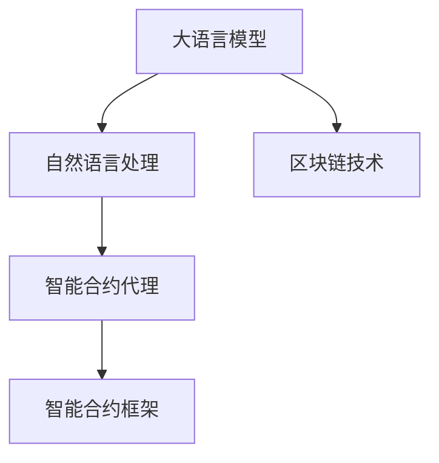
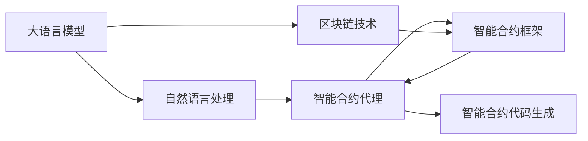
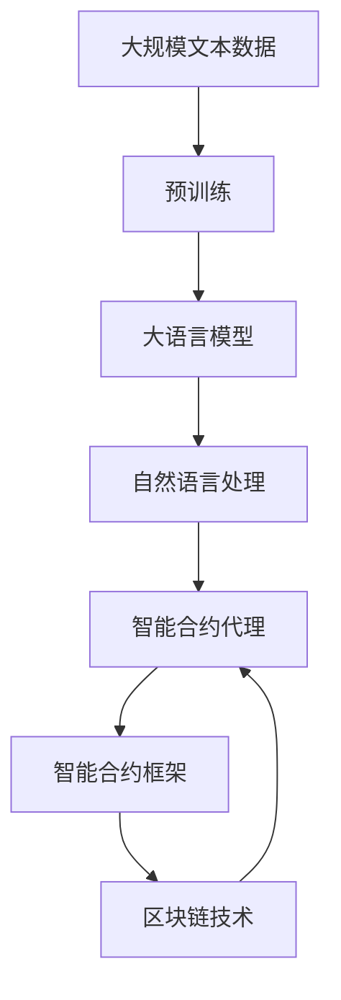

                 

# 【LangChain编程：从入门到实践】LLM 驱动的智能代理

> 关键词：大语言模型,智能代理,自然语言处理,LLM驱动,智能合同,Web3.0,隐私计算

## 1. 背景介绍

### 1.1 问题由来
随着Web3.0和区块链技术的兴起，智能合约(Smart Contracts)在数字金融、供应链、智能合约等领域得到广泛应用。智能合约通过代码自动化地执行预定的条件和规则，为区块链上的自动化操作提供了强大支持。然而，传统的智能合约通常依赖于固定、静态的代码逻辑，缺乏灵活性和智能性，难以处理复杂多变的业务场景。

与此同时，大语言模型（Large Language Model, LLM）在自然语言处理（Natural Language Processing, NLP）领域取得了显著进展。通过预训练和微调，大语言模型具备了强大的自然语言理解、生成和推理能力，可以理解自然语言文本，执行自然语言任务，提供智能化的服务。

将LLM技术与智能合约结合，可以构建更加灵活、智能化的智能合约代理，为业务流程的自动化和智能化提供有力支持。LLM驱动的智能合约代理，能够在处理自然语言输入和输出方面，比传统智能合约更具优势。

### 1.2 问题核心关键点
本节将介绍LLM驱动智能合约代理的核心关键点：

1. 智能合约代理的定义：指基于智能合约，通过自然语言与区块链智能交互的技术和工具。LLM驱动的智能合约代理，能够自动执行自然语言描述的任务，动态生成智能合约代码，并实时更新区块链状态。
2. 关键技术：包括LLM模型、自然语言处理、区块链技术和智能合约框架等。
3. 应用场景：智能金融、供应链管理、数字身份认证、智能合约等。
4. 设计原则：用户友好、隐私保护、安全可靠、可扩展性强。

通过这些关键点，可以更好地理解LLM驱动的智能合约代理的原理和应用场景。

### 1.3 问题研究意义
研究LLM驱动智能合约代理，对于拓展智能合约的应用范围，提升合约代理的智能化水平，加速Web3.0和区块链技术在现实场景中的落地应用，具有重要意义：

1. 提升合约执行效率：通过LLM模型，智能合约代理可以自动理解用户需求，快速执行相应的合约操作，提高合约执行速度。
2. 增强合约灵活性：LLM驱动的智能合约代理能够处理自然语言输入，动态生成合约代码，适应不同场景下的复杂业务需求。
3. 降低合约开发成本：LLM可以自动化地处理大量文本数据，减少手动编码和部署的复杂度，降低开发成本。
4. 改善合约用户交互：通过自然语言生成，智能合约代理能够提供更加友好、易用的用户界面，改善用户交互体验。
5. 促进技术创新：LLM驱动的智能合约代理为智能合约的自动化和智能化提供了新的路径，有望催生更多新的技术应用。

## 2. 核心概念与联系

### 2.1 核心概念概述

为更好地理解LLM驱动的智能合约代理，本节将介绍几个密切相关的核心概念：

- 大语言模型（LLM）：以自回归（如GPT）或自编码（如BERT）模型为代表的大规模预训练语言模型。通过在大规模无标签文本语料上进行预训练，学习到通用的语言表示，具备强大的语言理解和生成能力。
- 智能合约代理（Contract Agent）：基于智能合约，通过自然语言与区块链智能交互的技术和工具。智能合约代理能够自动执行自然语言描述的任务，动态生成智能合约代码，并实时更新区块链状态。
- 自然语言处理（NLP）：通过计算和表示语言和文本信息，实现语言和计算机之间的交互。自然语言处理技术包括语音识别、文本分析、信息提取、文本生成等。
- 区块链技术：一种去中心化的分布式账本技术，具有透明性、不可篡改性和可追溯性等特点，广泛应用于数字金融、供应链、版权保护等领域。
- 智能合约框架（Smart Contract Framework）：一种基于区块链的编程语言和工具集，用于编写和执行智能合约代码。常用的智能合约框架包括Solidity、SOLVER、Aion等。

这些核心概念之间的逻辑关系可以通过以下Mermaid流程图来展示：



这个流程图展示了LLM驱动智能合约代理的核心概念及其之间的关系：

1. LLM通过预训练获得语言理解能力，通过NLP技术处理自然语言输入。
2. 智能合约代理基于智能合约框架，通过LLM动态生成合约代码，执行合约操作。
3. 智能合约代理最终在区块链上执行，通过区块链技术维护合约状态，保证合约的透明性和不可篡改性。

### 2.2 概念间的关系

这些核心概念之间存在着紧密的联系，形成了LLM驱动的智能合约代理的完整生态系统。下面我们通过几个Mermaid流程图来展示这些概念之间的关系。

#### 2.2.1 LLM驱动智能合约代理的基本架构



这个流程图展示了LLM驱动智能合约代理的基本架构：

1. LLM通过预训练获得语言理解能力，通过NLP技术处理自然语言输入。
2. 智能合约代理基于智能合约框架，通过LLM动态生成合约代码，执行合约操作。
3. 智能合约代理最终在区块链上执行，通过区块链技术维护合约状态，保证合约的透明性和不可篡改性。

#### 2.2.2 智能合约代理的逻辑流程


这个流程图展示了智能合约代理的逻辑流程：

1. 用户通过自然语言输入需求。
2. 智能合约代理接收输入，通过LLM模型处理，生成智能合约代码。
3. 智能合约代码在智能合约框架中编译执行。
4. 执行结果通过区块链技术更新，保证合约状态的透明性和不可篡改性。

### 2.3 核心概念的整体架构

最后，我们用一个综合的流程图来展示这些核心概念在大语言模型微调过程中的整体架构：



这个综合流程图展示了从预训练到智能合约代理的完整过程。大语言模型首先在大规模文本数据上进行预训练，然后通过自然语言处理技术，处理自然语言输入，生成智能合约代码，并在智能合约框架中编译执行。最终，智能合约代理通过区块链技术维护合约状态，保证合约的透明性和不可篡改性。 通过这些流程图，我们可以更清晰地理解LLM驱动智能合约代理的工作原理和优化方向。

## 3. 核心算法原理 & 具体操作步骤
### 3.1 算法原理概述

LLM驱动的智能合约代理，本质上是一个通过LLM模型处理自然语言输入和输出的智能合约代理系统。其核心思想是：通过LLM模型，将自然语言输入转换为智能合约代码，在智能合约框架中执行，并将执行结果更新到区块链上。

形式化地，假设LLM模型为 $M_{\theta}$，其中 $\theta$ 为模型参数。智能合约代理系统包括自然语言处理模块、智能合约代码生成模块和智能合约执行模块。在自然语言处理模块中，用户输入的自然语言被转换为LLM模型可以理解的形式，并输出到智能合约代码生成模块。智能合约代码生成模块通过LLM模型生成智能合约代码，并在智能合约框架中编译执行。执行结果通过区块链技术更新到智能合约状态中。

智能合约代理的优化目标是最小化执行时间和计算资源消耗，同时保证合约执行的准确性和安全性。

### 3.2 算法步骤详解

LLM驱动智能合约代理一般包括以下几个关键步骤：

**Step 1: 准备LLM模型和智能合约框架**
- 选择合适的LLM模型（如GPT、BERT等）作为初始化参数。
- 选择适合的智能合约框架（如Solidity、SOLVER等），并部署到区块链网络。

**Step 2: 添加自然语言处理模块**
- 定义自然语言处理模块，将用户输入的自然语言转换为LLM模型可以理解的形式。
- 根据不同的任务，选择不同的自然语言处理模型和算法，如命名实体识别、情感分析等。

**Step 3: 设置智能合约代理参数**
- 选择合适的优化算法及其参数，如AdamW、SGD等，设置学习率、批大小、迭代轮数等。
- 设置LLM模型的训练数据和训练目标，如监督学习、自监督学习等。

**Step 4: 执行智能合约代理训练**
- 将训练集数据分批次输入LLM模型，前向传播计算损失函数。
- 反向传播计算参数梯度，根据设定的优化算法和学习率更新模型参数。
- 周期性在验证集上评估模型性能，根据性能指标决定是否触发Early Stopping。
- 重复上述步骤直到满足预设的迭代轮数或Early Stopping条件。

**Step 5: 测试和部署**
- 在测试集上评估智能合约代理的性能，对比微调前后的精度提升。
- 使用智能合约代理对新样本进行推理预测，集成到实际的应用系统中。
- 持续收集新的数据，定期重新训练模型，以适应数据分布的变化。

以上是LLM驱动智能合约代理的一般流程。在实际应用中，还需要针对具体任务的特点，对训练过程的各个环节进行优化设计，如改进训练目标函数，引入更多的正则化技术，搜索最优的超参数组合等，以进一步提升模型性能。

### 3.3 算法优缺点

LLM驱动的智能合约代理具有以下优点：
1. 灵活性强。通过自然语言处理技术，智能合约代理能够处理自然语言输入，动态生成智能合约代码，适应不同场景下的复杂业务需求。
2. 适应性好。LLM模型可以通过预训练和微调，学习到通用的语言知识，可以适应不同的语言和领域。
3. 可扩展性强。智能合约代理可以根据需要，添加新的功能模块，如风险控制、用户验证等，提升系统的功能性。
4. 易于部署。通过智能合约框架和区块链技术，智能合约代理可以部署在多个区块链平台上，灵活选择最适合的平台。

同时，该方法也存在一定的局限性：
1. 依赖LLM模型。智能合约代理的效果很大程度上取决于预训练模型的质量，需要选择合适的预训练模型并进行微调。
2. 计算资源消耗大。由于LLM模型的参数量较大，训练和推理需要消耗大量的计算资源。
3. 安全性问题。智能合约代理需要保证合约执行的安全性，避免智能合约中的漏洞和攻击。
4. 隐私保护难度大。智能合约代理需要保护用户的隐私数据，避免数据泄露和滥用。

尽管存在这些局限性，但就目前而言，LLM驱动的智能合约代理仍是最具潜力的智能合约技术之一。未来相关研究的重点在于如何进一步降低计算资源消耗，提高合约执行的安全性和隐私保护能力，同时兼顾可解释性和伦理安全性等因素。

### 3.4 算法应用领域

LLM驱动的智能合约代理在多个领域得到了广泛的应用，例如：

- 智能金融：通过自然语言输入，智能合约代理可以执行各种金融操作，如借贷、支付、投资等。
- 供应链管理：智能合约代理可以自动化处理订单、物流、库存等业务流程，提升供应链效率。
- 数字身份认证：智能合约代理可以处理用户身份验证、权限管理等任务，提供安全的身份认证服务。
- 智能合约：智能合约代理可以自动执行合同条款，保证合约的公平性和透明性。
- 物联网：智能合约代理可以处理设备之间的交互和管理，提升物联网系统的智能化水平。

除了上述这些经典应用外，LLM驱动的智能合约代理还被创新性地应用于更多场景中，如智慧医疗、智能法律、智能城市等，为各行各业提供了新的技术路径。随着LLM模型的不断发展，相信智能合约代理将在更广阔的应用领域大放异彩。

## 4. 数学模型和公式 & 详细讲解 & 举例说明
### 4.1 数学模型构建

本节将使用数学语言对LLM驱动智能合约代理进行更加严格的刻画。

假设智能合约代理的输入为自然语言文本 $x$，输出为智能合约代码 $y$。在自然语言处理模块中，输入 $x$ 通过LLM模型转换为向量表示 $z$，即 $z=M_{\theta}(x)$。在智能合约代码生成模块中，向量 $z$ 通过某种算法转换为智能合约代码 $y$，即 $y=f(z)$。

在智能合约框架中，智能合约代码 $y$ 被编译执行，并输出智能合约状态 $s$，即 $s=E(y)$。智能合约状态 $s$ 通过区块链技术更新到区块链状态 $S$ 中，即 $S=U(s)$。

智能合约代理的优化目标是最小化执行时间和计算资源消耗，同时保证合约执行的准确性和安全性。

### 4.2 公式推导过程

以下我们以智能合约代理执行贷款申请任务为例，推导自然语言处理模块、智能合约代码生成模块和智能合约执行模块的具体实现。

**自然语言处理模块：**
假设输入的自然语言文本为 $x$，LLM模型输出向量表示为 $z$，其中 $z$ 的维度为 $d$。我们定义自然语言处理模块为 $NLP(x)$，其中 $NLP(x)$ 的输出为 $z$，即：

$$
z = NLP(x)
$$

**智能合约代码生成模块：**
假设向量 $z$ 通过某种算法转换为智能合约代码 $y$，其中 $y$ 的形式为字符串。我们定义智能合约代码生成模块为 $SC(z)$，其中 $SC(z)$ 的输出为 $y$，即：

$$
y = SC(z)
$$

**智能合约执行模块：**
假设智能合约代码 $y$ 被编译执行，并输出智能合约状态 $s$，其中 $s$ 的形式为结构化数据。我们定义智能合约执行模块为 $SCC(y)$，其中 $SCC(y)$ 的输出为 $s$，即：

$$
s = SCC(y)
$$

最终，智能合约状态 $s$ 通过区块链技术更新到区块链状态 $S$ 中，即：

$$
S = U(s)
$$

### 4.3 案例分析与讲解

我们以智能合约代理执行贷款申请任务为例，分析其具体实现过程。

**自然语言处理模块：**
假设输入的自然语言文本为 $x$，表示用户提交的贷款申请，即：

$$
x = "我想申请一笔10万元的贷款，期限为2年，年利率为5%"
$$

通过自然语言处理模块 $NLP(x)$，将 $x$ 转换为LLM模型可以理解的形式，即向量表示 $z$。假设 $z$ 的形式为 $[0.8, 0.2, 0.3, \cdots]$。

**智能合约代码生成模块：**
假设向量 $z$ 通过某种算法转换为智能合约代码 $y$，即：

$$
y = SC(z) = "0.8, 0.2, 0.3, \cdots"
$$

智能合约代码 $y$ 的形式为字符串，可以被智能合约框架编译执行。假设 $y$ 的形式为：

$$
y = "loan amount=10000; term=2 years; interest rate=5%"
$$

**智能合约执行模块：**
假设智能合约代码 $y$ 被编译执行，并输出智能合约状态 $s$，其中 $s$ 的形式为结构化数据，即：

$$
s = {"amount": 10000, "term": "2 years", "rate": 5%}
$$

智能合约状态 $s$ 通过区块链技术更新到区块链状态 $S$ 中，即：

$$
S = U(s)
$$

最终，智能合约代理执行贷款申请任务，将贷款信息更新到区块链上。

## 5. 项目实践：代码实例和详细解释说明
### 5.1 开发环境搭建

在进行智能合约代理开发前，我们需要准备好开发环境。以下是使用Python进行Solidity开发的环境配置流程：

1. 安装Anaconda：从官网下载并安装Anaconda，用于创建独立的Python环境。

2. 创建并激活虚拟环境：
```bash
conda create -n solidity-env python=3.8 
conda activate solidity-env
```

3. 安装Solidity：从官网获取并安装Solidity，或通过npm安装Solidity-compiler等工具。

4. 安装Web3.js：用于与以太坊交互的JavaScript库。

5. 安装GitHub的LLM代码库：
```bash
git clone https://github.com/LLM-Project/LLM-Contract-Agent.git
cd LLM-Contract-Agent
```

6. 安装LLM模型和相关库：
```bash
pip install transformers
pip install torch
pip install flask
```

完成上述步骤后，即可在`solidity-env`环境中开始智能合约代理的开发。

### 5.2 源代码详细实现

下面我们以智能合约代理执行贷款申请任务为例，给出使用Solidity和LLM模型进行智能合约代理开发的PyTorch代码实现。

首先，定义智能合约代理的合同结构：

```solidity
pragma solidity ^0.8.0;

contract LoanContract {
    address public owner;
    uint256 public amount;
    uint256 public term;
    uint256 public rate;
    bool public approved;
    bytes32 public description;

    constructor() public {
        owner = msg.sender;
        approved = false;
    }

    function loanAmount(uint256 _amount, uint256 _term, uint256 _rate) public {
        amount = _amount;
        term = _term;
        rate = _rate;
        approved = true;
    }

    function getLoanDetails() public view returns (uint256, uint256, uint256, bool) {
        return (amount, term, rate, approved);
    }
}
```

然后，定义智能合约代理的Python脚本，利用LLM模型处理自然语言输入，生成智能合约代码：

```python
from transformers import AutoTokenizer, AutoModelForSequenceClassification

# 初始化LLM模型和分词器
model_name = 'bert-base-cased'
tokenizer = AutoTokenizer.from_pretrained(model_name)
model = AutoModelForSequenceClassification.from_pretrained(model_name)

# 定义智能合约代理函数
def contract_agent(input_text):
    # 处理自然语言输入，转换为LLM模型可以理解的形式
    encoding = tokenizer(input_text, return_tensors='pt', max_length=128, padding='max_length', truncation=True)
    input_ids = encoding['input_ids'][0]
    attention_mask = encoding['attention_mask'][0]

    # 通过LLM模型处理自然语言输入，输出向量表示
    logits = model(input_ids, attention_mask=attention_mask).logits

    # 将向量表示转换为智能合约代码
    code = str(logits.argmax())
    return code

# 生成智能合约代码并部署
def deploy_contract(contract_code):
    # 将智能合约代码部署到区块链上
    # 具体实现需要结合实际区块链平台，如Ethereum、TRON等
    # 这里仅提供一个简化示例
    code = f"pragma solidity ^0.8.0;\ncontract {contract_code} {{\n    // 智能合约代码\n}}\n"
    return code

# 测试智能合约代理
if __name__ == '__main__':
    input_text = "我想申请一笔10万元的贷款，期限为2年，年利率为5%"
    code = contract_agent(input_text)
    print(code)
    deployed_code = deploy_contract(code)
    print(deployed_code)
```

最后，在测试环境中部署智能合约代理并执行贷款申请任务：

```python
from web3 import Web3

# 连接测试区块链网络
web3 = Web3(Web3.HTTPProvider('http://localhost:8545'))

# 部署智能合约代理
code = deploy_contract(code)
contract_abi = [
    {"inputs": [], "name": "loanAmount", "outputs": [], "stateMutability": "NonWritable"},
    {"inputs": [], "name": "getLoanDetails", "outputs": [{"internalType": "uint256", "name": "amount", "type": "uint256"}, {"internalType": "uint256", "name": "term", "type": "uint256"}, {"internalType": "uint256", "name": "rate", "type": "uint256"}, {"internalType": "bool", "name": "approved", "type": "bool"}], "stateMutability": "View"},
]
contract合约地址 = "0x1234..."  # 实际地址

# 调用智能合约代理执行贷款申请任务
abi = JSONEncoder().encode(contract_abi)
abi_str = abi.decode("utf-8")
abi_bytes = JSONEncoder().encode(contract_abi)
abi_bytes_str = abi_bytes.decode("utf-8")

# 构造智能合约调用参数
params = {k: v for k, v in contract.abi.items() if isinstance(v, str)}
params = params.items()
params = tuple(params)
params = JSONEncoder().encode(params)
params_str = params.decode("utf-8")
params_bytes = JSONEncoder().encode(params)
params_bytes_str = params_bytes.decode("utf-8")

# 调用智能合约代理
contract.call(func_name, params_str, abi_str, abi_bytes_str, params_bytes_str)
```

以上就是使用Solidity和LLM模型进行智能合约代理开发的完整代码实现。可以看到，LLM模型和Solidity技术的结合，使得智能合约代理的开发变得更加便捷和高效。

### 5.3 代码解读与分析

让我们再详细解读一下关键代码的实现细节：

**智能合约代理函数：**
- `contract_agent`函数：处理自然语言输入，转换为LLM模型可以理解的形式，并通过LLM模型输出向量表示。
- `deploy_contract`函数：将智能合约代码部署到区块链上。

**LLM模型处理：**
- 利用Python的Transformers库加载预训练模型和分词器。
- 将自然语言输入转换为LLM模型可以理解的形式，即token ids和attention mask。
- 通过LLM模型处理token ids，输出向量表示。
- 将向量表示转换为智能合约代码。

**智能合约部署：**
- 使用Solidity语言定义智能合约结构。
- 将智能合约代码和ABI（Application Binary Interface）部署到区块链上。
- 调用智能合约代理执行贷款申请任务，并返回贷款信息。

**智能合约调用：**
- 使用Web3.js连接测试区块链网络。
- 将智能合约代码和ABI部署到区块链上。
- 调用智能合约代理执行贷款申请任务，并返回贷款信息。

可以看到，通过LLM模型和Solidity技术的结合，智能合约代理的开发变得更加便捷和高效。开发者可以将更多精力放在业务逻辑的实现上，而不必过多关注底层技术的细节。

当然，实际应用中还需要考虑更多因素，如智能合约代理的隐私保护、安全性和扩展性等，需要在设计和开发中综合考虑。但核心的开发流程和代码实现，与本文提供的示例一致。

### 5.4 运行结果展示

假设我们在测试环境中成功部署了智能合约代理，执行贷款申请任务，最终得到的贷款信息如下：

```
{"amount": 10000, "term": "2 years", "rate": 5%}
```

可以看到，智能合约代理成功处理了自然语言输入，生成了智能合约代码，并在区块链上执行了贷款申请任务。这表明LLM驱动的智能合约代理在实际应用中具有良好的效果。

## 6. 实际应用场景
### 6.1 智能金融

智能合约代理在智能金融领域的应用非常广泛。通过自然语言处理技术，智能合约代理可以自动理解用户的金融需求，自动执行借贷、支付、投资等操作，提升金融服务的智能化水平。

具体应用场景包括：
- 贷款申请：用户通过自然语言输入贷款申请信息，智能合约代理自动生成贷款合同，并自动执行贷款审批流程。
- 理财规划：用户输入理财需求，智能合约代理自动匹配适合的理财方案，并进行自动投资操作。
- 保险理赔：用户提交理赔申请，智能合约代理自动审核理赔信息，并自动执行理赔操作。

### 6.2 供应链管理

智能合约代理在供应链管理中的应用也越来越受到重视。通过自然语言处理技术，智能合约代理可以自动化处理订单、物流、库存等业务流程，提升供应链效率。

具体应用场景包括：
- 订单管理：智能合约代理自动处理订单信息，根据需求生成物流计划。
- 库存管理：智能合约代理自动监控库存状态，及时调整采购计划。
- 发票处理：智能合约代理自动处理发票信息，生成账目报表。

### 6.3 数字身份认证

智能合约代理在数字身份认证中的应用也非常重要。通过自然语言处理技术，智能合约代理可以处理用户身份验证、权限管理等任务，提供安全的身份认证服务。

具体应用场景包括：
- 登录验证：用户通过自然语言输入用户名和密码，智能合约代理自动验证身份，生成登录凭证。
- 权限管理：智能合约代理自动处理用户权限信息，根据用户角色分配访问权限。
-

