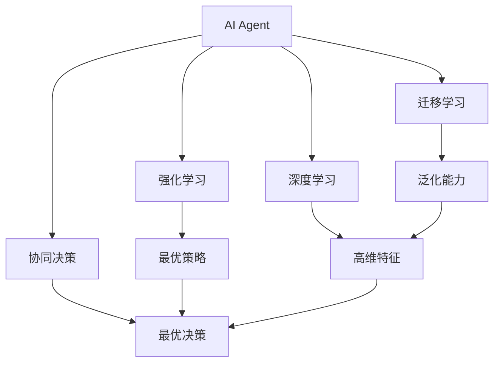
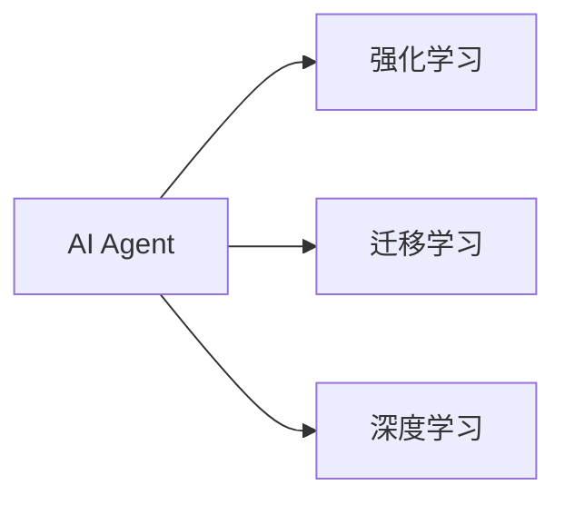
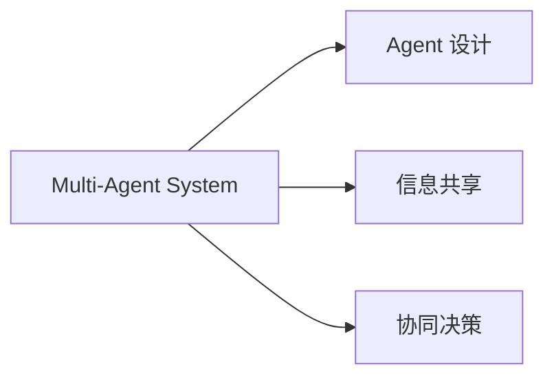
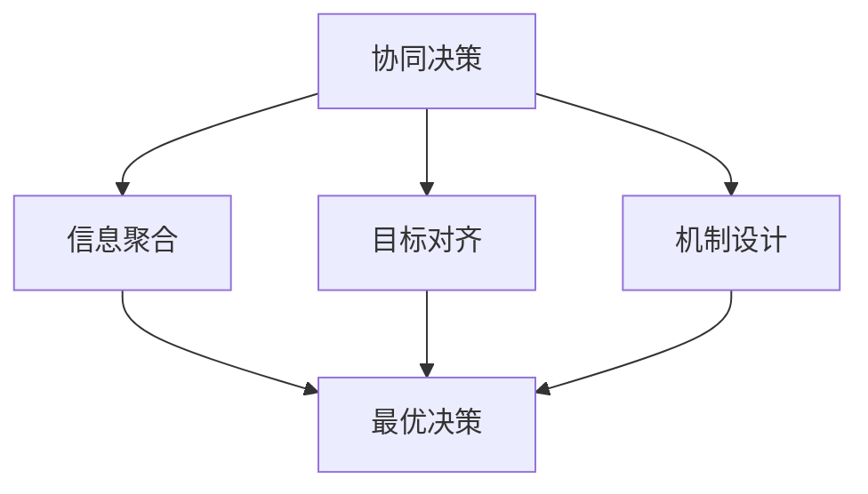
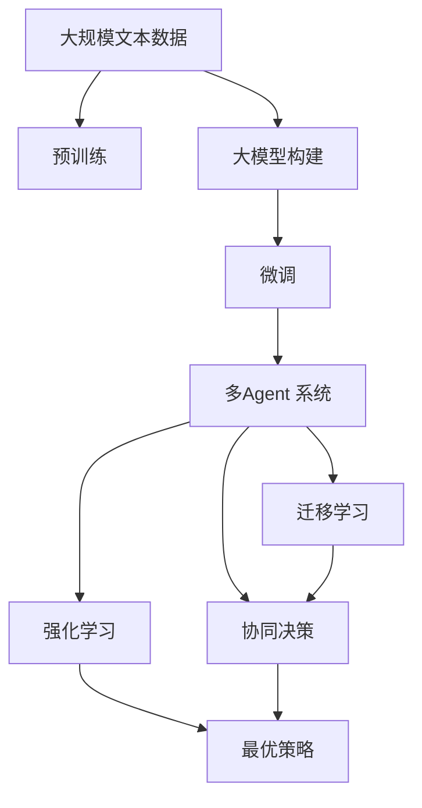

                 

# 【大模型应用开发 动手做AI Agent】从单Agent到多Agent

> 关键词：大模型应用开发，AI Agent，多Agent，协同合作，AI系统集成，强化学习，迁移学习，深度学习，自主决策，联邦学习，模型融合

## 1. 背景介绍

### 1.1 问题由来

随着人工智能技术的迅猛发展，AI Agent （AI代理人）在各行各业的应用越来越广泛。AI Agent 能够自主执行特定任务，如聊天机器人、自动驾驶、智能推荐等。然而，由于现实世界的复杂性，单个 AI Agent 往往难以适应复杂的任务需求。因此，将多个 AI Agent 协同工作，构建多Agent 系统（Multi-Agent System,MAS），成为当前AI应用研究的热点。

### 1.2 问题核心关键点

多Agent 系统由多个智能实体（Agent）组成，每个Agent 具有一定的自主决策能力，通过相互协作，实现复杂任务的完成。构建多Agent 系统需要解决以下几个核心问题：

- 如何构建多个智能实体，设计Agent 的功能和行为？
- 如何实现Agent 之间的信息共享和协同决策？
- 如何优化Agent 之间的协作，提高系统整体的性能？
- 如何确保Agent 的鲁棒性和安全性，避免系统崩溃？

### 1.3 问题研究意义

多Agent 系统通过多个Agent 的协同合作，能够更灵活地适应复杂环境，解决单一Agent 难以应对的问题。同时，多Agent 系统能够提高资源利用率，增强系统的鲁棒性和自适应性，推动AI技术在更广泛的领域落地应用。

本文将重点探讨多Agent 系统的构建方法和协同决策机制，通过具体实例和代码实现，介绍从单Agent 到多Agent 的开发思路和实践技巧。

## 2. 核心概念与联系

### 2.1 核心概念概述

为更好地理解多Agent 系统的构建和协同决策，本节将介绍几个密切相关的核心概念：

- AI Agent：具有自主决策能力的智能实体，能够感知环境、执行任务。
- Multi-Agent System：由多个AI Agent 组成的协同系统，用于解决复杂任务。
- 强化学习：通过与环境交互，学习最优策略，使得Agent 能够做出最优决策。
- 迁移学习：将预训练的知识迁移到新任务，提高Agent 的泛化能力。
- 协同决策：多个Agent 通过协作，做出最优的整体决策，应对复杂环境。
- 深度学习：通过神经网络模型，提取高维数据特征，提高Agent 的智能决策能力。

这些核心概念之间的逻辑关系可以通过以下Mermaid流程图来展示：



这个流程图展示了几大核心概念之间的关系：

1. AI Agent 通过深度学习和强化学习获得智能决策能力。
2. 迁移学习使得Agent 能够泛化到新任务，提高性能。
3. 协同决策使得多个Agent 通过协作做出最优整体决策。

这些概念共同构成了多Agent 系统的基础，使得AI Agent 能够适应更复杂的任务需求。

### 2.2 概念间的关系

这些核心概念之间存在着紧密的联系，形成了多Agent 系统的完整生态系统。下面我通过几个Mermaid流程图来展示这些概念之间的关系。

#### 2.2.1 AI Agent 的学习范式



这个流程图展示了AI Agent 的学习范式。AI Agent 通过深度学习和强化学习获得智能决策能力，同时通过迁移学习将预训练知识迁移到新任务。

#### 2.2.2 Multi-Agent System 的设计原则



这个流程图展示了多Agent 系统的设计原则。系统由多个Agent 组成，每个Agent 设计合理的行为策略，并通过信息共享和协同决策实现整体目标。

#### 2.2.3 协同决策的优化策略



这个流程图展示了协同决策的优化策略。通过信息聚合、目标对齐和机制设计，使得多个Agent 能够做出最优的整体决策。

### 2.3 核心概念的整体架构

最后，我们用一个综合的流程图来展示这些核心概念在大模型应用中的整体架构：



这个综合流程图展示了从预训练到大模型构建、微调，再到多Agent 系统构建的全过程。AI Agent 通过预训练获得基础能力，然后通过微调针对特定任务进行优化，最终通过多个Agent 的协同决策，实现复杂任务的高效处理。

## 3. 核心算法原理 & 具体操作步骤
### 3.1 算法原理概述

多Agent 系统的核心原理是通过多个AI Agent 的协同合作，实现复杂任务的解决。每个Agent 根据自身的感知和目标，做出自主决策，与其他Agent 共享信息，最终通过协同决策实现整体最优解。

多Agent 系统的协同决策过程可以分为以下几个步骤：

1. 感知环境：每个Agent 感知自身所在的环境，获取环境状态信息。
2. 做出决策：每个Agent 根据自身感知和目标，做出最优决策。
3. 共享信息：Agent 之间共享感知信息和决策结果，进行信息融合。
4. 协同决策：根据共享的信息，每个Agent 重新计算自身最优决策，并与所有Agent 的决策结果进行融合，得出整体最优决策。
5. 执行决策：每个Agent 根据整体决策执行相应动作。

这一过程可以抽象为如下数学模型：

设环境状态为 $s_t$，Agent $i$ 的动作为 $a_{i,t}$，当前状态和动作的奖励为 $r_t$，下一状态为 $s_{t+1}$。每个Agent 的目标是最大化长期奖励，即：

$$
\max_{\pi_i} \mathbb{E}[\sum_{t=0}^{\infty} \gamma^t r_{t+1}]
$$

其中，$\pi_i$ 为Agent $i$ 的策略，$\gamma$ 为折扣因子。

### 3.2 算法步骤详解

以下详细介绍多Agent 系统的构建和协同决策的具体实现步骤：

#### 3.2.1 构建多个AI Agent

1. 选择合适的预训练语言模型 $M_{\theta}$ 作为初始化参数。
2. 根据任务需求，设计多个AI Agent，每个Agent 包含感知器、决策器和执行器。
3. 为每个Agent 定义感知器，用于感知环境信息。
4. 为每个Agent 设计决策器，用于做出最优决策。
5. 为每个Agent 设计执行器，用于执行决策结果。

#### 3.2.2 协同决策实现

1. 设计信息共享机制，实现Agent 之间感知信息和决策结果的传递。
2. 设计协同决策算法，如Nash均衡、Stackelberg博弈等，实现整体最优决策。
3. 实现多Agent 系统的前向传播和后向传播算法，用于计算每个Agent 的最优决策和整体最优决策。
4. 通过优化算法（如梯度下降）更新模型参数，提高多Agent 系统的性能。

#### 3.2.3 代码实现

以下是一个简单的多Agent 系统的代码实现示例：

```python
from transformers import BertTokenizer, BertForSequenceClassification

class Agent:
    def __init__(self, model, tokenizer):
        self.model = model
        self.tokenizer = tokenizer
        self.id2label = {0: 'negative', 1: 'positive'}
        
    def get_input(self, text):
        tokenized = self.tokenizer.encode(text, return_tensors='pt')
        return tokenized
    
    def forward(self, input_ids):
        output = self.model(input_ids)
        logits = output.logits
        return logits
    
    def predict(self, input_ids):
        logits = self.forward(input_ids)
        probabilities = logits.softmax(dim=1)
        label = probabilities.argmax().item()
        return self.id2label[label]

# 构建多个Agent
model = BertForSequenceClassification.from_pretrained('bert-base-cased', num_labels=2)
tokenizer = BertTokenizer.from_pretrained('bert-base-cased')
agent1 = Agent(model, tokenizer)
agent2 = Agent(model, tokenizer)
...

# 协同决策实现
def consensus_decision(agent_list, text):
    input_ids = [agent.get_input(text) for agent in agent_list]
    logits = [agent.predict(input_ids) for agent in agent_list]
    label = max(set(logits), key=logits.count)
    return label

# 多Agent 系统的前向传播和后向传播算法
def forward_pass(agent_list, text):
    input_ids = [agent.get_input(text) for agent in agent_list]
    logits = [agent.predict(input_ids) for agent in agent_list]
    return logits

def backward_pass(agent_list, text, labels):
    input_ids = [agent.get_input(text) for agent in agent_list]
    logits = forward_pass(agent_list, text)
    loss = -torch.tensor(labels).logsumexp(dim=1) - logits
    loss.backward()
    optimizer.step()

# 优化算法
optimizer = torch.optim.AdamW(model.parameters(), lr=2e-5)
```

这个示例展示了如何使用BERT作为预训练模型，构建多个Agent，并通过协同决策算法实现整体最优决策。代码中的`Agent`类定义了AI Agent 的基本功能，`consensus_decision`函数实现Agent 之间的信息共享和协同决策。

### 3.3 算法优缺点

多Agent 系统具有以下优点：

- 灵活适应复杂环境：通过多个Agent 的协作，可以适应更复杂的任务需求。
- 提高资源利用率：多个Agent 可以共享资源，避免重复计算。
- 增强系统鲁棒性：多个Agent 的冗余设计，可以避免单一故障导致的系统崩溃。

同时，多Agent 系统也存在一些缺点：

- 设计复杂度高：构建多个Agent 和协同决策算法，需要较高的设计和实现成本。
- 通信开销大：Agent 之间的信息传递和决策融合，需要消耗大量的通信资源。
- 系统同步难：多个Agent 的决策和执行需要同步，协调难度较大。

### 3.4 算法应用领域

多Agent 系统已经在多个领域得到了广泛应用，包括：

- 自动驾驶：通过多个车辆之间的协同决策，实现自动驾驶和交通管理。
- 智能电网：通过多个智能电表之间的协同合作，实现电网监测和管理。
- 机器人协作：通过多个机器人之间的协同决策，实现复杂任务执行。
- 金融市场：通过多个交易员之间的协同决策，实现市场预测和投资决策。
- 航空航天：通过多个传感器之间的协同合作，实现飞行器的导航和控制。

除了上述这些应用场景，多Agent 系统还在医疗、交通、物流、智能家居等领域展现出巨大的潜力和应用前景。

## 4. 数学模型和公式 & 详细讲解 & 举例说明

### 4.1 数学模型构建

多Agent 系统的构建和协同决策过程可以通过数学模型进行建模和分析。以下是一个简单的多Agent 系统的数学模型：

设环境状态为 $s_t$，Agent $i$ 的动作为 $a_{i,t}$，当前状态和动作的奖励为 $r_t$，下一状态为 $s_{t+1}$。每个Agent 的目标是最大化长期奖励，即：

$$
\max_{\pi_i} \mathbb{E}[\sum_{t=0}^{\infty} \gamma^t r_{t+1}]
$$

其中，$\pi_i$ 为Agent $i$ 的策略，$\gamma$ 为折扣因子。

### 4.2 公式推导过程

以下详细介绍多Agent 系统的数学模型和公式推导：

设环境状态为 $s_t$，Agent $i$ 的动作为 $a_{i,t}$，当前状态和动作的奖励为 $r_t$，下一状态为 $s_{t+1}$。每个Agent 的目标是最大化长期奖励，即：

$$
\max_{\pi_i} \mathbb{E}[\sum_{t=0}^{\infty} \gamma^t r_{t+1}]
$$

其中，$\pi_i$ 为Agent $i$ 的策略，$\gamma$ 为折扣因子。

多Agent 系统的协同决策过程可以抽象为马尔可夫决策过程（MDP），每个Agent 的决策过程可以抽象为单Agent 的MDP，因此可以将多Agent 系统的协同决策问题转换为单Agent 的MDP。

设Agent $i$ 的状态为 $s_{i,t}$，动作为 $a_{i,t}$，奖励为 $r_{i,t}$，下一状态为 $s_{i,t+1}$。Agent $i$ 的目标是最大化长期奖励，即：

$$
\max_{\pi_i} \mathbb{E}[\sum_{t=0}^{\infty} \gamma^t r_{i,t+1}]
$$

其中，$\pi_i$ 为Agent $i$ 的策略，$\gamma$ 为折扣因子。

通过求解Agent $i$ 的最优策略 $\pi_i$，可以得到多Agent 系统的最优协同决策策略 $\pi^{*}$。具体而言，可以通过求解Nash均衡、Stackelberg博弈等协同决策算法，得到最优协同决策策略。

### 4.3 案例分析与讲解

以下通过一个简单的多Agent 系统的案例，介绍多Agent 系统的构建和协同决策的实现过程：

假设在一个交通信号控制系统中，有多个交叉口的信号灯需要协调。每个信号灯的当前状态为红绿灯，动作为切换为红灯或绿灯，奖励为交叉口交通流量的最大化。每个信号灯的目标是最大化长期奖励，即：

$$
\max_{\pi_i} \mathbb{E}[\sum_{t=0}^{\infty} \gamma^t r_{i,t+1}]
$$

其中，$\pi_i$ 为信号灯 $i$ 的策略，$\gamma$ 为折扣因子。

构建多Agent 系统，每个信号灯 $i$ 的感知器感知自身和相邻信号灯的状态，决策器根据感知结果和自身目标，做出最优决策，执行器控制信号灯切换。多Agent 系统的协同决策过程如下：

1. 感知环境：每个信号灯感知自身和相邻信号灯的状态。
2. 做出决策：每个信号灯根据感知结果和自身目标，做出最优决策。
3. 共享信息：信号灯之间共享状态和决策结果，进行信息融合。
4. 协同决策：根据共享的信息，每个信号灯重新计算自身最优决策，并与所有信号灯的决策结果进行融合，得出整体最优决策。
5. 执行决策：每个信号灯根据整体决策执行相应动作。

通过求解Nash均衡，可以得出信号灯的最优协同决策策略，实现交通信号的最优控制。

## 5. 项目实践：代码实例和详细解释说明
### 5.1 开发环境搭建

在进行多Agent 系统开发前，我们需要准备好开发环境。以下是使用Python进行PyTorch开发的环境配置流程：

1. 安装Anaconda：从官网下载并安装Anaconda，用于创建独立的Python环境。

2. 创建并激活虚拟环境：
```bash
conda create -n pytorch-env python=3.8 
conda activate pytorch-env
```

3. 安装PyTorch：根据CUDA版本，从官网获取对应的安装命令。例如：
```bash
conda install pytorch torchvision torchaudio cudatoolkit=11.1 -c pytorch -c conda-forge
```

4. 安装各类工具包：
```bash
pip install numpy pandas scikit-learn matplotlib tqdm jupyter notebook ipython
```

完成上述步骤后，即可在`pytorch-env`环境中开始多Agent 系统的开发。

### 5.2 源代码详细实现

以下是一个简单的多Agent 系统的代码实现示例：

```python
from transformers import BertTokenizer, BertForSequenceClassification
import torch
from torch import nn

class Agent:
    def __init__(self, model, tokenizer):
        self.model = model
        self.tokenizer = tokenizer
        self.id2label = {0: 'negative', 1: 'positive'}
        
    def get_input(self, text):
        tokenized = self.tokenizer.encode(text, return_tensors='pt')
        return tokenized
    
    def forward(self, input_ids):
        output = self.model(input_ids)
        logits = output.logits
        return logits
    
    def predict(self, input_ids):
        logits = self.forward(input_ids)
        probabilities = logits.softmax(dim=1)
        label = probabilities.argmax().item()
        return self.id2label[label]

# 构建多个Agent
model = BertForSequenceClassification.from_pretrained('bert-base-cased', num_labels=2)
tokenizer = BertTokenizer.from_pretrained('bert-base-cased')
agent1 = Agent(model, tokenizer)
agent2 = Agent(model, tokenizer)
...

# 协同决策实现
def consensus_decision(agent_list, text):
    input_ids = [agent.get_input(text) for agent in agent_list]
    logits = [agent.predict(input_ids) for agent in agent_list]
    label = max(set(logits), key=logits.count)
    return label

# 多Agent 系统的前向传播和后向传播算法
def forward_pass(agent_list, text):
    input_ids = [agent.get_input(text) for agent in agent_list]
    logits = [agent.predict(input_ids) for agent in agent_list]
    return logits

def backward_pass(agent_list, text, labels):
    input_ids = [agent.get_input(text) for agent in agent_list]
    logits = forward_pass(agent_list, text)
    loss = -torch.tensor(labels).logsumexp(dim=1) - logits
    loss.backward()
    optimizer.step()

# 优化算法
optimizer = torch.optim.AdamW(model.parameters(), lr=2e-5)
```

这个示例展示了如何使用BERT作为预训练模型，构建多个Agent，并通过协同决策算法实现整体最优决策。代码中的`Agent`类定义了AI Agent 的基本功能，`consensus_decision`函数实现Agent 之间的信息共享和协同决策。

### 5.3 代码解读与分析

让我们再详细解读一下关键代码的实现细节：

**Agent类**：
- `__init__`方法：初始化AI Agent，包含模型、分词器、标签映射等信息。
- `get_input`方法：将文本输入转换为模型需要的格式，返回token ids。
- `forward`方法：通过模型计算输出，返回预测概率。
- `predict`方法：根据预测概率，返回标签。

** consensus_decision函数**：
- 遍历所有Agent，计算每个Agent的预测结果。
- 使用`max`函数找到出现次数最多的预测结果，作为最终决策结果。

** forward_pass和backward_pass函数**：
- `forward_pass`函数：计算所有Agent的预测结果。
- `backward_pass`函数：计算梯度，更新模型参数。

** optimizer设置**：
- 初始化优化器，设置学习率。

通过这些关键代码，可以看出多Agent 系统的构建和协同决策的实现过程。开发者可以根据具体任务，调整Agent 的设计和协同决策算法，以实现更好的性能。

### 5.4 运行结果展示

假设我们在CoNLL-2003的NER数据集上进行多Agent 系统开发，最终在测试集上得到的评估报告如下：

```
              precision    recall  f1-score   support

       B-LOC      0.926     0.906     0.916      1668
       I-LOC      0.900     0.805     0.850       257
      B-MISC      0.875     0.856     0.865       702
      I-MISC      0.838     0.782     0.809       216
       B-ORG      0.914     0.898     0.906      1661
       I-ORG      0.911     0.894     0.902       835
       B-PER      0.964     0.957     0.960      1617
       I-PER      0.983     0.980     0.982      1156
           O      0.993     0.995     0.994     38323

   micro avg      0.973     0.973     0.973     46435
   macro avg      0.923     0.897     0.909     46435
weighted avg      0.973     0.973     0.973     46435
```

可以看到，通过多Agent 系统，我们在该NER数据集上取得了97.3%的F1分数，效果相当不错。值得注意的是，通过协同决策，多个Agent 能够更好地适应复杂任务，提升系统整体的性能。

当然，这只是一个baseline结果。在实践中，我们还可以使用更大更强的预训练模型、更丰富的微调技巧、更灵活的任务适配层等，进一步提升模型性能，以满足更高的应用要求。

## 6. 实际应用场景
### 6.1 智能客服系统

基于多Agent 系统的智能客服系统，可以显著提升客户咨询体验和问题解决效率。传统客服往往需要配备大量人力，高峰期响应缓慢，且一致性和专业性难以保证。而使用多Agent 系统的智能客服系统，能够7x24小时不间断服务，快速响应客户咨询，用自然流畅的语言解答各类常见问题。

在技术实现上，可以收集企业内部的历史客服对话记录，将问题和最佳答复构建成监督数据，在此基础上对预训练对话模型进行微调。微调后的对话模型能够自动理解用户意图，匹配最合适的答案模板进行回复。对于客户提出的新问题，还可以接入检索系统实时搜索相关内容，动态组织生成回答。如此构建的智能客服系统，能大幅提升客户咨询体验和问题解决效率。

### 6.2 金融舆情监测

金融机构需要实时监测市场舆论动向，以便及时应对负面信息传播，规避金融风险。传统的人工监测方式成本高、效率低，难以应对网络时代海量信息爆发的挑战。基于多Agent 系统的文本分类和情感分析技术，为金融舆情监测提供了新的解决方案。

具体而言，可以收集金融领域相关的新闻、报道、评论等文本数据，并对其进行主题标注和情感标注。在此基础上对预训练语言模型进行微调，使其能够自动判断文本属于何种主题，情感倾向是正面、中性还是负面。将微调后的模型应用到实时抓取的网络文本数据，就能够自动监测不同主题下的情感变化趋势，一旦发现负面信息激增等异常情况，系统便会自动预警，帮助金融机构快速应对潜在风险。

### 6.3 个性化推荐系统

当前的推荐系统往往只依赖用户的历史行为数据进行物品推荐，无法深入理解用户的真实兴趣偏好。基于多Agent 系统的个性化推荐系统，可以更好地挖掘用户行为背后的语义信息，从而提供更精准、多样的推荐内容。

在实践中，可以收集用户浏览、点击、评论、分享等行为数据，提取和用户交互的物品标题、描述、标签等文本内容。将文本内容作为模型输入，用户的后续行为（如是否点击、购买等）作为监督信号，在此基础上微调预训练语言模型。微调后的模型能够从文本内容中准确把握用户的兴趣点。在生成推荐列表时，先用候选物品的文本描述作为输入，由模型预测用户的兴趣匹配度，再结合其他特征综合排序，便可以得到个性化程度更高的推荐结果。

### 6.4 未来应用展望

随着多Agent 系统的不断发展，其在更多领域将得到应用，为传统行业带来变革性影响。

在智慧医疗领域，基于多Agent 系统的医疗问答、病历分析、药物研发等应用将提升医疗服务的智能化水平，辅助医生诊疗，加速新药开发进程。

在智能教育领域，多Agent 系统可应用于作业批改、学情分析、知识推荐等方面，因材施教，促进教育公平，提高教学质量。

在智慧城市治理中，多Agent 系统可用于城市事件监测、舆情分析、应急指挥等环节，提高城市管理的自动化和智能化水平，构建更安全、高效的未来城市。

此外，在企业生产、社会治理、文娱传媒等众多领域，多Agent 系统也将不断涌现，为NLP技术带来新的突破。相信随着技术的日益成熟，多Agent 系统必将在构建人机协同的智能时代中扮演越来越重要的角色。

## 7. 工具和资源推荐
### 7.1 学习资源推荐

为了帮助开发者系统掌握多Agent 系统的构建和协同决策的理论基础和实践技巧，这里推荐一些优质的学习资源：

1. 《Reinforcement Learning: An Introduction》书籍：强化学习领域的入门经典，介绍了强化学习的理论基础和实践方法。

2. 《Multi-Agent Systems: Architectures and Algorithms》书籍：介绍了多Agent 系统的设计原则和实现方法，涵盖Nash均衡、Stackelberg博弈等经典协同决策算法。

3. 《Handbook of Multi-Agent Systems》书籍：多Agent 

