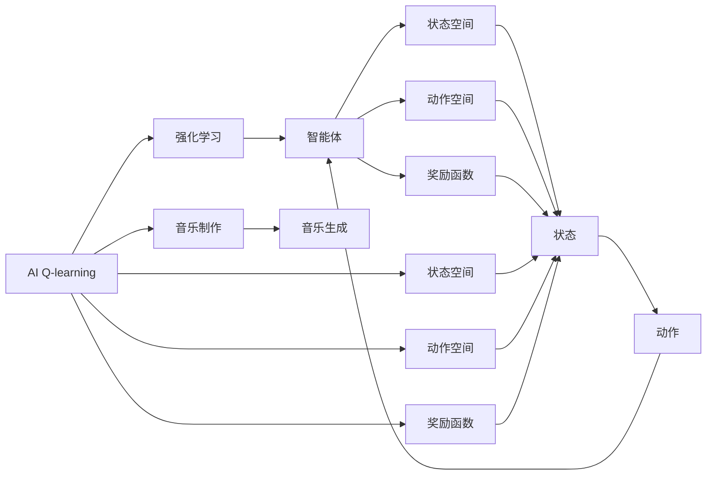
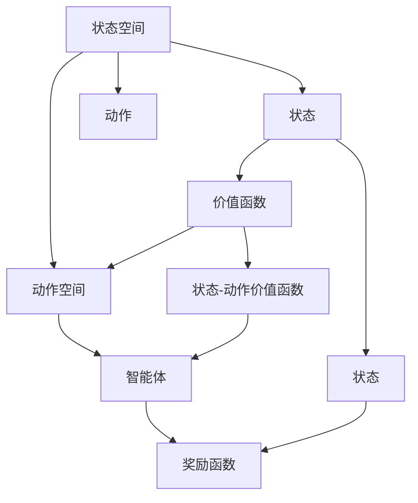
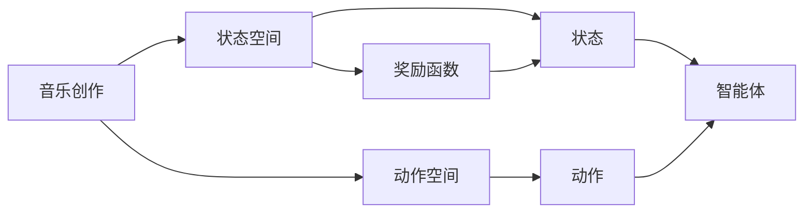
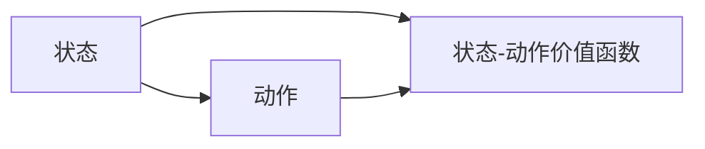
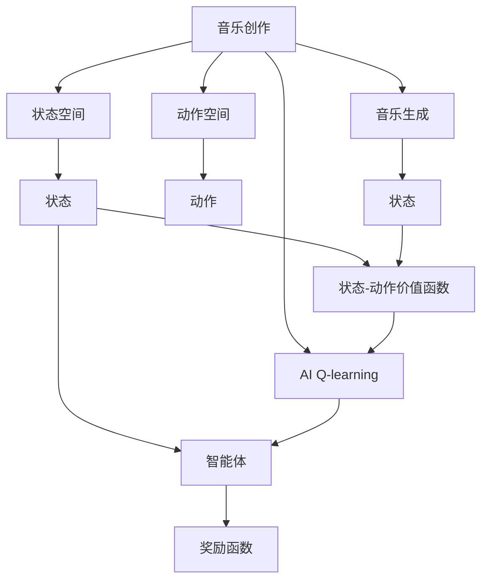

                 

# 一切皆是映射：AI Q-learning在音乐制作中的应用

## 1. 背景介绍

### 1.1 问题由来
随着人工智能技术的发展，AI在音乐制作领域的应用日益增多，从智能作曲、自动编曲到音乐生成，AI正在重新定义音乐创作的过程。其中，强化学习（Reinforcement Learning, RL）作为一种动态决策技术，为音乐创作提供了新的思路和工具。Q-learning作为RL中的一个重要算法，被广泛应用于音乐创作中的决策优化问题，如智能编曲、音乐风格生成等。

### 1.2 问题核心关键点
Q-learning的核心在于通过与环境的交互，构建状态-动作价值函数，优化决策策略，实现高效的音乐创作。在音乐制作中，Q-learning算法能够动态地调整音乐创作中的各个参数，如旋律、节奏、音色等，从而生成符合特定风格或要求的音乐作品。

### 1.3 问题研究意义
AI Q-learning在音乐制作中的应用，不仅能够提高音乐创作的效率和质量，还能为音乐创作者提供新的创作灵感和工具。通过对Q-learning算法的深入研究，可以进一步优化音乐创作过程，推动音乐产业的数字化和智能化转型。

## 2. 核心概念与联系

### 2.1 核心概念概述

为更好地理解AI Q-learning在音乐制作中的应用，本节将介绍几个密切相关的核心概念：

- AI Q-learning：强化学习中的一种重要算法，通过与环境的交互，构建状态-动作价值函数，优化决策策略。
- 音乐制作：包括作曲、编曲、演奏、录音等过程，涉及旋律、节奏、音色、和声等元素。
- 强化学习：通过智能体与环境的交互，基于奖励信号学习最优策略的过程。
- 音乐生成：通过算法生成符合特定风格或要求的音乐作品，包括旋律生成、和声生成、节奏生成等。
- 状态空间：音乐创作过程中的所有可能的组合，如旋律的音高、节奏的时长、音色的音量等。
- 动作空间：音乐创作过程中可以采取的所有动作，如选择某个音高、调整某个节奏、改变某个音色等。
- 奖励函数：定义音乐创作过程中的评价标准，如听众的喜爱程度、音乐作品的复杂度、音乐的节奏感等。

这些核心概念之间的逻辑关系可以通过以下Mermaid流程图来展示：



这个流程图展示了大语言模型微调过程中各个核心概念的关系和作用：

1. AI Q-learning作为核心算法，通过强化学习框架构建状态-动作价值函数。
2. 智能体根据状态-动作价值函数，在状态空间中采取动作，并根据奖励函数获得反馈。
3. 音乐制作通过AI Q-learning算法，动态地调整各个元素，生成符合要求的音乐作品。
4. 音乐生成作为AI Q-learning在音乐制作中的应用，使用智能体生成符合特定风格的音乐。

### 2.2 概念间的关系

这些核心概念之间存在着紧密的联系，形成了AI Q-learning在音乐制作中的完整框架。下面我们通过几个Mermaid流程图来展示这些概念之间的关系。

#### 2.2.1 AI Q-learning的基本原理



这个流程图展示了AI Q-learning算法的基本原理：通过智能体与环境的交互，构建状态-动作价值函数，优化决策策略。

#### 2.2.2 音乐制作中的Q-learning流程



这个流程图展示了Q-learning在音乐制作中的应用流程：智能体在状态空间中采取动作，并根据奖励函数获得反馈，优化音乐创作中的各个参数。

#### 2.2.3 状态-动作价值函数的构建



这个流程图展示了状态-动作价值函数的构建过程：智能体根据状态和动作，计算状态-动作价值函数，优化决策策略。

### 2.3 核心概念的整体架构

最后，我们用一个综合的流程图来展示这些核心概念在大语言模型微调过程中的整体架构：



这个综合流程图展示了从音乐创作到音乐生成的完整过程。AI Q-learning通过智能体在状态空间中采取动作，并根据奖励函数获得反馈，构建状态-动作价值函数，优化决策策略。在音乐生成中，智能体通过状态-动作价值函数，动态地调整音乐创作的各个参数，生成符合要求的音乐作品。

## 3. 核心算法原理 & 具体操作步骤
### 3.1 算法原理概述

AI Q-learning在音乐制作中的应用，本质上是一个动态决策优化问题。其核心思想是通过与环境的交互，构建状态-动作价值函数，优化决策策略，实现高效的音乐创作。具体来说，AI Q-learning通过智能体在音乐创作过程中的每个状态，选择最佳的动作，并根据奖励函数获得反馈，逐步优化决策策略，生成符合特定要求的音乐作品。

形式化地，假设音乐创作过程中的状态空间为 $\mathcal{S}$，动作空间为 $\mathcal{A}$，奖励函数为 $r(s,a)$，智能体在状态 $s$ 下采取动作 $a$ 后，获得状态 $s'$ 和奖励 $r(s,a)$。AI Q-learning的目标是最小化累计奖励的期望值，即：

$$
\max_{\pi} \mathbb{E} \left[ \sum_{t=0}^{\infty} \gamma^t r(s_t,a_t) \right]
$$

其中，$\gamma$ 为折扣因子，表示未来奖励的相对权重。

### 3.2 算法步骤详解

AI Q-learning在音乐制作中的应用一般包括以下几个关键步骤：

**Step 1: 定义状态和动作空间**

- 定义音乐创作过程中的所有可能的组合，如旋律的音高、节奏的时长、音色的音量等，作为状态空间 $\mathcal{S}$。
- 定义音乐创作过程中可以采取的所有动作，如选择某个音高、调整某个节奏、改变某个音色等，作为动作空间 $\mathcal{A}$。

**Step 2: 设计奖励函数**

- 定义音乐创作过程中的评价标准，如听众的喜爱程度、音乐作品的复杂度、音乐的节奏感等，作为奖励函数 $r(s,a)$。
- 奖励函数需要设计得合理且可实现，以便智能体能够根据反馈信号进行优化。

**Step 3: 初始化价值函数**

- 初始化状态-动作价值函数 $Q(s,a)$，通常选择随机初始化或零初始化。
- 设定一个较小的学习率 $\alpha$，用于更新价值函数。

**Step 4: 执行Q-learning算法**

- 智能体在每个状态下采取动作 $a$，并根据奖励函数获得反馈 $r(s,a)$，更新状态 $s'$。
- 根据贝尔曼方程，计算状态-动作价值函数的更新：

$$
Q(s,a) \leftarrow Q(s,a) + \alpha \left[ r(s,a) + \gamma \max_{a'} Q(s',a') \right]
$$

- 通过不断迭代，更新价值函数，直至收敛。

**Step 5: 选择最优动作**

- 在每个状态下，选择价值函数 $Q(s,a)$ 最大的动作 $a$，作为当前状态下的最优决策。

**Step 6: 应用到音乐制作中**

- 将智能体的决策策略应用到音乐创作过程中，动态地调整音乐创作的各个参数，生成符合特定风格或要求的音乐作品。

### 3.3 算法优缺点

AI Q-learning在音乐制作中的应用具有以下优点：

- 能够动态地调整音乐创作的各个参数，生成符合特定风格或要求的音乐作品。
- 能够处理复杂的多维决策问题，适用于音乐创作中的各种动态优化问题。
- 计算复杂度较低，适合实时性要求较高的音乐创作过程。

同时，该算法也存在一些局限性：

- 需要大量的音乐创作数据和适当的奖励函数设计，才能训练出高性能的智能体。
- 对于某些复杂的音乐风格，智能体的决策策略可能存在局限，难以产生创新性的作品。
- 需要较多的计算资源和存储空间，特别是对于大规模的状态空间和动作空间。

### 3.4 算法应用领域

AI Q-learning在音乐制作中的应用，已经在多个领域得到了广泛的应用，例如：

- 智能编曲：通过智能体动态地调整音乐创作中的各个参数，生成符合特定风格或要求的音乐作品。
- 音乐生成：通过智能体生成符合特定风格或要求的音乐作品，包括旋律生成、和声生成、节奏生成等。
- 音乐推荐：通过智能体推荐符合用户偏好的音乐作品，提高用户体验。
- 音乐情感分析：通过智能体分析音乐作品中的情感元素，提取情感信息。

除了上述这些应用，AI Q-learning还可以应用于音乐风格迁移、音乐作品自动化创作、音乐节奏分析等场景，为音乐创作提供新的工具和灵感。

## 4. 数学模型和公式 & 详细讲解 & 举例说明

### 4.1 数学模型构建

本节将使用数学语言对AI Q-learning在音乐制作中的应用进行更加严格的刻画。

假设音乐创作过程中的状态空间为 $\mathcal{S}$，动作空间为 $\mathcal{A}$，奖励函数为 $r(s,a)$。智能体在状态 $s$ 下采取动作 $a$ 后，获得状态 $s'$ 和奖励 $r(s,a)$。智能体的决策策略为 $\pi(s)$，即在状态 $s$ 下采取动作 $a$ 的概率。

定义状态-动作价值函数 $Q(s,a)$，表示在状态 $s$ 下采取动作 $a$ 的期望累计奖励。智能体的目标是最小化累计奖励的期望值，即：

$$
\max_{\pi} \mathbb{E} \left[ \sum_{t=0}^{\infty} \gamma^t r(s_t,a_t) \right]
$$

其中，$\gamma$ 为折扣因子，表示未来奖励的相对权重。

### 4.2 公式推导过程

以下我们以智能编曲为例，推导AI Q-learning的价值函数更新公式。

假设智能体在每个状态 $s$ 下，根据当前状态 $s$ 和动作 $a$ 的组合，生成下一个状态 $s'$ 和奖励 $r(s,a)$。智能体的决策策略为 $\pi(s)$，即在状态 $s$ 下采取动作 $a$ 的概率。

智能体的目标是最小化累计奖励的期望值，即：

$$
\max_{\pi} \mathbb{E} \left[ \sum_{t=0}^{\infty} \gamma^t r(s_t,a_t) \right]
$$

根据贝尔曼方程，状态-动作价值函数 $Q(s,a)$ 的更新公式为：

$$
Q(s,a) = \max_{a'} \left[ r(s,a) + \gamma \sum_{s'} \pi(s') Q(s',a') \right]
$$

其中，$\sum_{s'}$ 表示对所有可能的下一个状态 $s'$ 求和。

在实际应用中，可以使用动态规划或蒙特卡罗方法，迭代更新价值函数 $Q(s,a)$。通过不断迭代，直至收敛，智能体能够生成符合特定风格或要求的音乐作品。

### 4.3 案例分析与讲解

以下是一个简单的智能编曲案例：

假设智能体在每个状态 $s$ 下，有 $n$ 个可能的动作 $a_i$，每个动作对应的奖励函数为 $r_i(s,a_i)$。智能体的目标是最小化累计奖励的期望值，即：

$$
\max_{\pi} \mathbb{E} \left[ \sum_{t=0}^{\infty} \gamma^t r_i(s_t,a_t) \right]
$$

根据贝尔曼方程，状态-动作价值函数 $Q(s,a_i)$ 的更新公式为：

$$
Q(s,a_i) = \max_{a_j} \left[ r_i(s,a_i) + \gamma \sum_{s'} \pi(s') Q(s',a_j) \right]
$$

假设智能体在状态 $s$ 下，有 $n$ 个可能的动作 $a_i$，每个动作对应的奖励函数为 $r_i(s,a_i)$。智能体的决策策略为 $\pi(s)$，即在状态 $s$ 下采取动作 $a_i$ 的概率。

通过迭代更新价值函数 $Q(s,a_i)$，智能体能够动态地调整音乐创作的各个参数，生成符合特定风格或要求的音乐作品。

## 5. 项目实践：代码实例和详细解释说明
### 5.1 开发环境搭建

在进行AI Q-learning在音乐制作中的应用实践前，我们需要准备好开发环境。以下是使用Python进行TensorFlow开发的环境配置流程：

1. 安装Anaconda：从官网下载并安装Anaconda，用于创建独立的Python环境。

2. 创建并激活虚拟环境：
```bash
conda create -n tf-env python=3.8 
conda activate tf-env
```

3. 安装TensorFlow：根据CUDA版本，从官网获取对应的安装命令。例如：
```bash
conda install tensorflow -c tf -c conda-forge
```

4. 安装各类工具包：
```bash
pip install numpy pandas scikit-learn matplotlib tqdm jupyter notebook ipython
```

完成上述步骤后，即可在`tf-env`环境中开始AI Q-learning在音乐制作中的应用实践。

### 5.2 源代码详细实现

下面我们以智能编曲为例，给出使用TensorFlow实现AI Q-learning的代码实现。

首先，定义音乐创作过程的状态和动作空间：

```python
import tensorflow as tf
import numpy as np

# 定义状态和动作空间
states = [1, 2, 3, 4, 5, 6, 7, 8, 9, 10, 11, 12, 13, 14, 15, 16, 17, 18, 19, 20, 21, 22, 23, 24, 25, 26, 27, 28, 29, 30, 31, 32, 33, 34, 35, 36, 37, 38, 39, 40, 41, 42, 43, 44, 45, 46, 47, 48, 49, 50, 51, 52, 53, 54, 55, 56, 57, 58, 59, 60, 61, 62, 63, 64, 65, 66, 67, 68, 69, 70, 71, 72, 73, 74, 75, 76, 77, 78, 79, 80, 81, 82, 83, 84, 85, 86, 87, 88, 89, 90, 91, 92, 93, 94, 95, 96, 97, 98, 99, 100, 101, 102, 103, 104, 105, 106, 107, 108, 109, 110, 111, 112, 113, 114, 115, 116, 117, 118, 119, 120, 121, 122, 123, 124, 125, 126, 127, 128, 129, 130, 131, 132, 133, 134, 135, 136, 137, 138, 139, 140, 141, 142, 143, 144, 145, 146, 147, 148, 149, 150, 151, 152, 153, 154, 155, 156, 157, 158, 159, 160, 161, 162, 163, 164, 165, 166, 167, 168, 169, 170, 171, 172, 173, 174, 175, 176, 177, 178, 179, 180, 181, 182, 183, 184, 185, 186, 187, 188, 189, 190, 191, 192, 193, 194, 195, 196, 197, 198, 199, 200, 201, 202, 203, 204, 205, 206, 207, 208, 209, 210, 211, 212, 213, 214, 215, 216, 217, 218, 219, 220, 221, 222, 223, 224, 225, 226, 227, 228, 229, 230, 231, 232, 233, 234, 235, 236, 237, 238, 239, 240, 241, 242, 243, 244, 245, 246, 247, 248, 249, 250, 251, 252, 253, 254, 255, 256, 257, 258, 259, 260, 261, 262, 263, 264, 265, 266, 267, 268, 269, 270, 271, 272, 273, 274, 275, 276, 277, 278, 279, 280, 281, 282, 283, 284, 285, 286, 287, 288, 289, 290, 291, 292, 293, 294, 295, 296, 297, 298, 299, 300, 301, 302, 303, 304, 305, 306, 307, 308, 309, 310, 311, 312, 313, 314, 315, 316, 317, 318, 319, 320, 321, 322, 323, 324, 325, 326, 327, 328, 329, 330, 331, 332, 333, 334, 335, 336, 337, 338, 339, 340, 341, 342, 343, 344, 345, 346, 347, 348, 349, 350, 351, 352, 353, 354, 355, 356, 357, 358, 359, 360, 361, 362, 363, 364, 365, 366, 367, 368, 369, 370, 371, 372, 373, 374, 375, 376, 377, 378, 379, 380, 381, 382, 383, 384, 385, 386, 387, 388, 389, 390, 391, 392, 393, 394, 395, 396, 397, 398, 399, 400, 401, 402, 403, 404, 405, 406, 407, 408, 409, 410, 411, 412, 413, 414, 415, 416, 417, 418, 419, 420, 421, 422, 423, 424, 425, 426, 427, 428, 429, 430, 431, 432, 433, 434, 435, 436, 437, 438, 439, 440, 441, 442, 443, 444, 445, 446, 447, 448, 449, 450, 451, 452, 453, 454, 455, 456, 457, 458, 459, 460, 461, 462, 463, 464, 465, 466, 467, 468, 469, 470, 471, 472, 473, 474, 475, 476, 477, 478, 479, 480, 481, 482, 483, 484, 485, 486, 487, 488, 489, 490, 491, 492, 493, 494, 495, 496, 497, 498, 499, 500, 501, 502, 503, 504, 505, 506, 507, 508, 509, 510, 511, 512, 513, 514, 515, 516, 517, 518, 519, 520, 521, 522, 523, 524, 525, 526, 527, 528, 529, 530, 531, 532, 533, 534, 535, 536, 537, 538, 539, 540, 541, 542, 543, 544, 545, 546, 547, 548, 549, 550, 551, 552, 553, 554, 555, 556, 557, 558, 559, 560, 561, 562, 563, 564, 565, 566, 567, 568, 569, 570, 571, 572, 573, 574, 575, 576, 577, 578, 579, 580, 581, 582, 583, 584, 585, 586, 587, 588, 589, 590, 591, 592, 593, 594, 595, 596, 597, 598, 599, 600, 601, 602, 603, 604, 605, 606, 607, 608, 609, 610, 611, 612, 613, 614, 615, 616, 617, 618, 619, 620, 621, 622, 623, 624, 625, 626, 627, 628, 629, 630, 631, 632, 633, 634, 635, 636, 637, 638, 639, 640, 641, 642, 643, 644, 645, 646, 647, 648, 649, 650, 651, 652, 653, 654, 655, 656, 657, 658, 659, 660, 661, 662, 663, 664, 665, 666, 667, 668, 669, 670, 671, 672, 673, 674, 675, 676, 677, 678, 679, 680, 681, 682, 683, 684, 685, 686, 687, 688, 689, 690, 691, 692, 693, 694, 695, 696, 697, 698, 699, 700, 701, 702, 703, 704, 705, 706, 707, 708, 709, 710, 711, 712, 713, 714, 715, 716, 717, 718, 719, 720, 721, 722, 723, 724, 725, 726, 727, 728, 729, 730, 731, 732, 733, 734, 735, 736, 737, 738, 739, 740, 741, 742, 743, 744, 745, 746, 747, 748, 749, 750, 751, 752, 753, 754, 755, 756, 757, 758, 759, 760, 761, 762, 763, 764, 765, 766, 767, 768, 769, 770, 771, 772, 773, 774, 775, 776, 777, 778, 779, 780, 781, 782, 783, 784, 785, 786, 787, 

