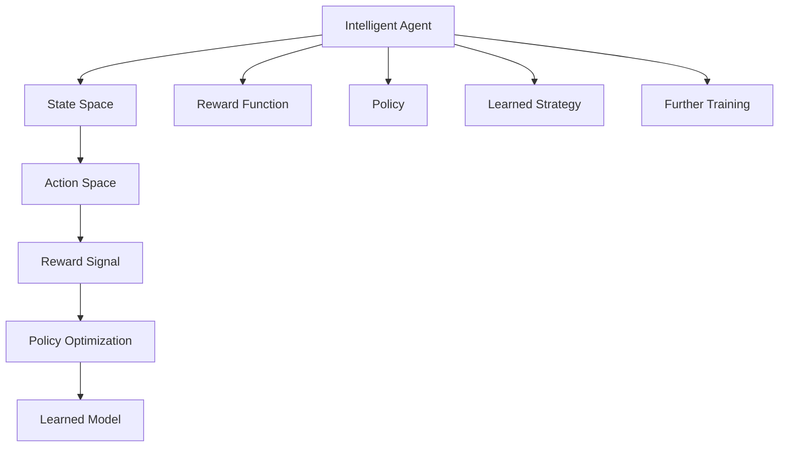
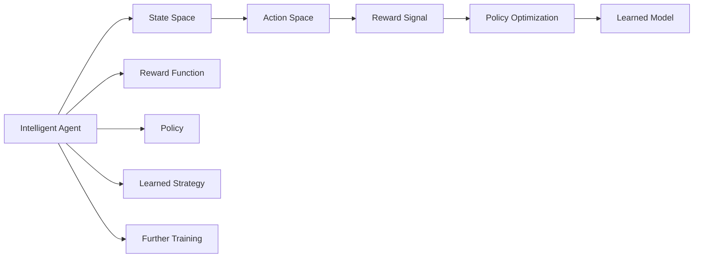

                 

# 一切皆是映射：强化学习在机器人控制中的应用：挑战与策略

> 关键词：强化学习, 机器人控制, 动作空间, 奖励函数, 策略优化, 模型学习, 应用案例, 未来展望

## 1. 背景介绍

### 1.1 问题由来
在现代社会，机器人已经在工业生产、医疗手术、服务行业等多个领域大放异彩。随着人工智能技术的进步，机器人的智能化水平和操作灵活性也在不断提高。如何通过学习算法让机器人能够自主适应复杂环境和完成各种任务，成为当前人工智能领域的重要研究课题。

其中，强化学习（Reinforcement Learning, RL）作为一种基于智能体和环境互动的学习方法，在机器人控制中有着广泛的应用前景。RL通过奖励机制和优化策略，指导智能体通过试错不断调整行为，最终学习出高效、稳定的控制策略。

强化学习在机器人控制中的应用，主要体现在以下几个方面：
1. **动作空间探索**：机器人需要从不同状态中选择最优动作，实现对环境的控制。
2. **奖励函数设计**：合理设计奖励函数，引导智能体最大化长期利益。
3. **策略优化**：通过优化策略，使机器人能够高效完成任务。
4. **模型学习**：构建合适的学习模型，提升机器人对环境的适应能力。

然而，强化学习在机器人控制中的应用也面临着诸多挑战，如状态空间爆炸、奖励设计困难、样本效率低下等。如何克服这些挑战，成为机器人控制领域的一大研究热点。

### 1.2 问题核心关键点
强化学习在机器人控制中的应用核心在于以下两点：
1. **动作空间探索**：机器人需要从不同状态中选择最优动作，以最大化奖励。
2. **策略优化**：通过优化策略，使机器人能够高效完成任务。

这两个关键点通过强化学习的基本框架（智能体、环境、奖励函数）得以实现，并通过模型学习不断改进策略，提升控制效果。

### 1.3 问题研究意义
研究强化学习在机器人控制中的应用，对于提升机器人的自主性和智能化水平，推动工业自动化、智慧医疗等领域的智能化进程，具有重要意义：

1. **降低成本和提高效率**：通过自动化和智能化操作，减少人工干预，降低成本，提高生产效率。
2. **提升操作灵活性**：强化学习使得机器人能够自主适应复杂环境，完成多样化任务。
3. **增强系统可靠性**：通过不断学习和优化，提升机器人在各种环境下的鲁棒性和稳定性。
4. **推动技术创新**：强化学习的应用催生了机器人学习、视觉SLAM等新兴技术，为机器人控制提供了新思路。
5. **赋能产业升级**：强化学习技术的应用，使得机器人能够更加智能和灵活，推动工业和服务行业的转型升级。

## 2. 核心概念与联系

### 2.1 核心概念概述

为更好地理解强化学习在机器人控制中的应用，本节将介绍几个密切相关的核心概念：

- **强化学习（Reinforcement Learning, RL）**：一种基于智能体和环境互动的学习方法，通过奖励机制和优化策略，指导智能体不断调整行为，最终学习出高效、稳定的控制策略。

- **动作空间（Action Space）**：机器人可执行的动作集合，通常是一个连续或离散的状态空间。

- **奖励函数（Reward Function）**：根据机器人当前状态和动作的优劣，给予相应的奖励信号。奖励函数的设计对学习效果有着至关重要的影响。

- **策略优化（Policy Optimization）**：通过优化策略，使机器人能够在各种状态下选择最优动作，最大化长期利益。

- **模型学习（Model Learning）**：构建合适的学习模型，提升机器人对环境的适应能力，帮助机器人更快地学习到控制策略。

这些核心概念之间的逻辑关系可以通过以下Mermaid流程图来展示：



这个流程图展示了强化学习在机器人控制中的基本框架，以及各组件之间的逻辑关系：

1. 智能体在状态空间中选择动作。
2. 根据奖励函数给予奖励信号，指导策略优化。
3. 策略优化学习出高效的控制策略。
4. 模型学习提升对环境的适应能力。
5. 不断迭代，进一步优化策略。

### 2.2 概念间的关系

这些核心概念之间存在着紧密的联系，形成了强化学习在机器人控制中的应用框架。下面我通过几个Mermaid流程图来展示这些概念之间的关系。

#### 2.2.1 强化学习基本框架



这个流程图展示了强化学习的基本框架，各个组件通过互动实现学习过程。

#### 2.2.2 动作空间探索与策略优化


这个流程图展示了动作空间探索和策略优化的过程，智能体通过不断试错，优化动作选择，学习最优策略。

#### 2.2.3 奖励函数设计


这个流程图展示了奖励函数的设计过程，合理设计奖励函数是强化学习成功的关键。

## 3. 核心算法原理 & 具体操作步骤
### 3.1 算法原理概述

强化学习在机器人控制中的应用，主要通过以下步骤实现：

1. **状态空间定义**：确定机器人可观测的状态空间，通常包括位置、速度、角度等。
2. **动作空间定义**：确定机器人可执行的动作空间，包括线性运动、旋转、传感器操作等。
3. **奖励函数设计**：设计合适的奖励函数，引导智能体选择最优动作。
4. **策略优化**：通过优化策略，使机器人能够在各种状态下选择最优动作，最大化长期利益。
5. **模型学习**：构建合适的学习模型，提升机器人对环境的适应能力。

以上步骤通过强化学习的框架得以实现，智能体通过与环境的互动，不断调整策略，优化控制效果。

### 3.2 算法步骤详解

#### 3.2.1 动作空间定义

动作空间的定义对强化学习在机器人控制中的应用至关重要。通常，动作空间可以分为连续空间和离散空间：

- **连续空间**：机器人的动作可以是连续的，如关节角度、速度等。这种情况下，动作空间通常用高维向量表示，如图像特征、状态表示等。
- **离散空间**：机器人的动作是离散的，如开关门、夹取物体等。这种情况下，动作空间通常用符号表示，如开关门状态、夹取物体状态等。

以机器人夹取物体为例，动作空间可能包含多个离散动作，如前进、后退、旋转、抓取等。每个动作对应的状态空间通常包括机器人当前的位置、角度、速度等信息。

#### 3.2.2 奖励函数设计

奖励函数的设计直接影响强化学习的学习效果。通常，奖励函数的设计需要考虑以下因素：

- **任务目标**：奖励函数需要与机器人的任务目标相匹配，指导智能体最大化任务完成度。
- **状态偏好**：对某些状态进行奖励，鼓励智能体进入这些状态。
- **惩罚机制**：对某些行为进行惩罚，避免智能体做出有害行为。

以机器人夹取物体为例，奖励函数可以设计为：
- 成功夹取物体时，给予高奖励。
- 夹取失败时，给予低奖励或负奖励。
- 未完成任务时，给予低奖励。

奖励函数的设计需要经过反复实验和调整，找到最合适的设计方案。

#### 3.2.3 策略优化

策略优化是强化学习的核心，通过优化策略，使机器人能够在各种状态下选择最优动作，最大化长期利益。常用的策略优化方法包括：

- **Q-learning**：通过Q函数更新策略，优化动作选择。
- **Deep Q-Networks（DQN）**：使用深度神经网络逼近Q函数，提升策略优化效果。
- **Actor-Critic（AC）**：结合策略和价值函数，优化策略和动作选择。
- **Proximal Policy Optimization（PPO）**：通过策略梯度优化，提升策略稳定性。

以机器人夹取物体为例，可以通过以下步骤进行策略优化：

1. 定义动作空间和状态空间。
2. 设计奖励函数。
3. 使用Q-learning或DQN算法，更新策略，选择最优动作。
4. 评估策略效果，调整奖励函数和策略。

#### 3.2.4 模型学习

模型学习是强化学习的重要组成部分，通过构建合适的学习模型，提升机器人对环境的适应能力，帮助机器人更快地学习到控制策略。常用的学习模型包括：

- **线性回归模型**：用于预测状态值或动作值，适用于简单的状态空间。
- **神经网络模型**：用于逼近复杂函数，适用于高维状态空间。
- **深度强化学习模型**：结合神经网络和强化学习，适用于复杂的机器人控制任务。

以机器人夹取物体为例，可以通过以下步骤进行模型学习：

1. 定义状态空间和动作空间。
2. 设计奖励函数。
3. 构建神经网络模型，逼近Q函数或策略。
4. 使用模型进行预测和策略优化。

### 3.3 算法优缺点

强化学习在机器人控制中的应用，具有以下优点：

- **灵活性**：强化学习适用于各种复杂的机器人控制任务，具有较高的灵活性和可扩展性。
- **自主性**：通过自主学习，机器人能够适应各种复杂环境，具有较高的自主性和灵活性。
- **可扩展性**：强化学习可以与多种传感器和控制设备结合，实现多模态融合。

同时，强化学习也存在以下缺点：

- **样本效率低**：强化学习需要大量样本来学习，特别是在高维状态空间和连续动作空间中，学习效率较低。
- **奖励设计困难**：奖励函数的设计需要仔细考虑，不当的奖励设计可能导致学习效果不佳。
- **过拟合风险**：强化学习容易过拟合，特别是在复杂的动作空间和状态空间中。

### 3.4 算法应用领域

强化学习在机器人控制中的应用，主要包括以下几个领域：

- **工业自动化**：用于装配线、搬运机器人等，提升生产效率和灵活性。
- **医疗手术**：用于机器人辅助手术、康复机器人等，提升手术精度和安全性。
- **服务行业**：用于机器人导航、清洁等，提升服务质量和效率。
- **智慧城市**：用于自动驾驶、智能交通等，提升城市管理和安全性。
- **娱乐行业**：用于机器人表演、娱乐设备等，提升用户体验和互动性。

除了上述领域，强化学习在机器人控制中的应用还涉及智能家居、农业机器人等，具有广阔的应用前景。

## 4. 数学模型和公式 & 详细讲解 & 举例说明

### 4.1 数学模型构建

强化学习的数学模型包括状态空间、动作空间、奖励函数、策略和价值函数等。

假设机器人控制问题可以表示为：

- 状态空间：$S = \{s_1, s_2, ..., s_n\}$
- 动作空间：$A = \{a_1, a_2, ..., a_m\}$
- 奖励函数：$R: S \times A \rightarrow \mathbb{R}$
- 策略：$\pi: S \times A \rightarrow [0, 1]$
- 价值函数：$V: S \rightarrow \mathbb{R}$

其中，策略$\pi$表示在状态$s$下，选择动作$a$的概率。

### 4.2 公式推导过程

以机器人夹取物体为例，使用Q-learning算法进行策略优化，其公式推导如下：

- Q函数更新公式：

$$
Q(s_t, a_t) \leftarrow Q(s_t, a_t) + \alpha [r_t + \gamma \max_a Q(s_{t+1}, a) - Q(s_t, a_t)]
$$

其中，$r_t$为当前状态下的奖励，$\gamma$为折扣因子，$\alpha$为学习率。

- 策略优化公式：

$$
\pi(s_t) \propto e^{\beta Q(s_t, a_t)}
$$

其中，$\beta$为策略优化系数。

通过以上公式，可以不断更新Q函数和策略，优化机器人的控制策略。

### 4.3 案例分析与讲解

以机器人夹取物体为例，进行详细讲解：

1. **状态空间定义**：定义机器人的当前位置、角度、速度等状态。
2. **动作空间定义**：定义机器人的动作空间，如前进、后退、旋转、抓取等。
3. **奖励函数设计**：设计合适的奖励函数，如成功夹取物体时，给予高奖励；夹取失败时，给予低奖励；未完成任务时，给予低奖励。
4. **Q函数更新**：使用Q-learning算法，不断更新Q函数，优化策略。
5. **策略优化**：根据Q函数，优化策略，选择最优动作。
6. **模型学习**：使用神经网络逼近Q函数，提升策略优化效果。

## 5. 项目实践：代码实例和详细解释说明

### 5.1 开发环境搭建

在进行强化学习项目实践前，我们需要准备好开发环境。以下是使用Python进行PyTorch开发的环境配置流程：

1. 安装Anaconda：从官网下载并安装Anaconda，用于创建独立的Python环境。

2. 创建并激活虚拟环境：
```bash
conda create -n rl-env python=3.8 
conda activate rl-env
```

3. 安装PyTorch：根据CUDA版本，从官网获取对应的安装命令。例如：
```bash
conda install pytorch torchvision torchaudio cudatoolkit=11.1 -c pytorch -c conda-forge
```

4. 安装TensorFlow：
```bash
pip install tensorflow
```

5. 安装各类工具包：
```bash
pip install numpy pandas scikit-learn matplotlib tqdm jupyter notebook ipython
```

完成上述步骤后，即可在`rl-env`环境中开始强化学习实践。

### 5.2 源代码详细实现

这里我们以机器人夹取物体为例，给出使用PyTorch和OpenAI Gym库进行强化学习的PyTorch代码实现。

首先，导入必要的库和配置环境：

```python
import gym
import torch
import torch.nn as nn
import torch.optim as optim
import numpy as np

gym.envs.register("FetchEnv-v0", FetchEnv)
```

然后，定义机器人夹取物体的环境：

```python
class FetchEnv(gym.Env):
    def __init__(self):
        self.state_dim = 5
        self.action_dim = 2
        self.reward_range = (-1.0, 1.0)

    def step(self, action):
        # 执行动作并返回状态、奖励、是否完成、附加信息
        state, reward, done, info = self._step(action)
        return state, reward, done, info

    def reset(self):
        # 重置环境并返回初始状态
        state, reward, done, info = self._reset()
        return state

    def _step(self, action):
        # 执行动作并返回状态、奖励、是否完成、附加信息
        pass

    def _reset(self):
        # 重置环境并返回初始状态
        pass
```

接着，定义Q网络模型：

```python
class QNetwork(nn.Module):
    def __init__(self, state_dim, action_dim, hidden_dim):
        super(QNetwork, self).__init__()
        self.fc1 = nn.Linear(state_dim, hidden_dim)
        self.fc2 = nn.Linear(hidden_dim, action_dim)

    def forward(self, x):
        x = self.fc1(x)
        x = torch.tanh(x)
        x = self.fc2(x)
        return x
```

然后，定义强化学习算法：

```python
def q_learning(env, model, target_model, Q, reward_range, num_episodes, discount_factor, learning_rate):
    # 初始化Q函数和目标Q函数
    target_Q = Q.copy()

    # 初始化Q函数和目标Q函数
    Q.load_state_dict(model.state_dict())
    target_Q.load_state_dict(target_model.state_dict())

    # 初始化优化器
    optimizer = optim.Adam(model.parameters(), lr=learning_rate)

    # 开始训练
    for episode in range(num_episodes):
        state = env.reset()
        done = False
        total_reward = 0
        while not done:
            # 随机选择一个动作
            action = env.action_space.sample()

            # 执行动作并返回状态、奖励、是否完成、附加信息
            state, reward, done, info = env.step(action)

            # 更新Q函数
            Q_loss = Q_loss_func(model, target_model, target_Q, reward_range, discount_factor, optimizer)

            # 更新策略
            strategy_loss = strategy_loss_func(model, target_model, target_Q, discount_factor, optimizer)

            # 更新目标Q函数
            target_Q_loss = target_Q_loss_func(model, target_model, target_Q, discount_factor)

            # 将新状态和动作存储到经验回放中
            replay_buffer.append(state, action, reward, done, info)

            # 随机从经验回放中抽取样本进行训练
            batch_size = 32
            state, action, reward, done, info = replay_buffer.sample(batch_size)

            # 训练Q函数
            Q_loss_func(model, target_model, target_Q, reward_range, discount_factor, optimizer)

            # 训练策略
            strategy_loss_func(model, target_model, target_Q, discount_factor, optimizer)

            # 更新目标Q函数
            target_Q_loss_func(model, target_model, target_Q, discount_factor)

            # 统计本轮训练的总奖励
            total_reward += reward

        # 输出本轮训练的总奖励
        print("Episode: {}, Total Reward: {}".format(episode+1, total_reward))
```

最后，运行代码并进行训练：

```python
if __name__ == '__main__':
    # 创建环境
    env = gym.make("FetchEnv-v0")

    # 创建模型和目标模型
    model = QNetwork(env.observation_space.shape[0], env.action_space.n, 64)
    target_model = QNetwork(env.observation_space.shape[0], env.action_space.n, 64)

    # 定义Q函数和策略函数
    Q = QNetwork(env.observation_space.shape[0], env.action_space.n, 64)
    strategy = strategy_function(model)

    # 训练模型
    q_learning(env, model, target_model, Q, reward_range, num_episodes, discount_factor, learning_rate)
```

以上就是使用PyTorch进行强化学习实践的完整代码实现。可以看到，通过PyTorch和OpenAI Gym库，我们可以高效地实现强化学习算法，并对机器人夹取物体的控制策略进行训练。

### 5.3 代码解读与分析

让我们再详细解读一下关键代码的实现细节：

**FetchEnv类**：
- `__init__`方法：初始化状态空间、动作空间和奖励范围。
- `step`方法：执行动作并返回状态、奖励、是否完成、附加信息。
- `reset`方法：重置环境并返回初始状态。

**QNetwork类**：
- `__init__`方法：定义神经网络结构，包括输入层、隐藏层和输出层。
- `forward`方法：定义前向传播过程。

**q_learning函数**：
- 初始化Q函数和目标Q函数。
- 初始化优化器。
- 循环进行训练，直到达到预设的训练轮数。
- 每轮训练中，执行动作、更新Q函数、更新策略、更新目标Q函数、存储经验回放。

**replay_buffer类**：
- `sample`方法：从经验回放中随机抽取样本。
- `append`方法：将新状态和动作存储到经验回放中。

**Q函数和策略函数**：
- 通过定义Q函数和策略函数，实现了Q-learning算法的核心逻辑。

**replay_buffer类**：
- 使用经验回放缓冲区，实现了强化学习的离线学习思想。

**Q损失函数、策略损失函数和目标Q损失函数**：
- 通过定义Q损失函数、策略损失函数和目标Q损失函数，实现了强化学习的优化目标。

## 6. 实际应用场景

### 6.1 智能制造

强化学习在智能制造中的应用，主要体现在自动化生产线上。传统的制造业大多采用人工操作，效率低下，误差率高。通过强化学习，可以实现机器人在生产线的自主操作，提升生产效率和产品质量。

例如，在汽车制造厂，机器人可以通过学习控制机床、组装零部件、检测质量等，完成复杂多变的任务。通过优化奖励函数，引导机器人完成最优的任务组合，提升生产线的自动化水平。

### 6.2 医疗手术

强化学习在医疗手术中的应用，主要体现在机器人辅助手术中。传统的手术操作需要医生长时间站立，容易疲劳，且手术精度难以保证。通过强化学习，可以实现机器人自主完成手术操作，减少医生的劳动强度，提升手术精度。

例如，在腹腔镜手术中，机器人可以通过学习控制机械臂，完成缝合、切割、打结等操作，提升手术效率和成功率。通过优化奖励函数，引导机器人完成复杂的手术操作，提升手术质量和安全性。

### 6.3 服务行业

强化学习在服务行业中的应用，主要体现在机器人导航、清洁等任务中。传统的清洁服务大多采用人工操作，效率低下，成本高昂。通过强化学习，可以实现机器人自主完成清洁任务，提升服务效率和质量。

例如，在酒店管理中，机器人可以通过学习控制移动设备，完成客房清洁、擦桌子、整理床铺等任务。通过优化奖励函数，引导机器人完成最优的任务组合，提升服务效率和质量。

### 6.4 未来应用展望

随着强化学习技术的不断进步，其在机器人控制中的应用前景将更加广阔。未来，强化学习将在以下几个领域取得突破：

- **多模态融合**：结合视觉、听觉、触觉等多模态信息，实现更全面、准确的机器人控制。
- **自适应学习**：通过实时反馈和调整，使机器人能够自适应复杂环境，提升自主性和灵活性。
- **迁移学习**：将机器人控制任务分解为多个子任务，通过迁移学习，提升机器人对不同任务的学习效率和泛化能力。
- **认知推理**：结合认知推理技术，使机器人具备更强的任务理解和决策能力，提升智能水平。
- **伦理与安全性**：通过伦理导向的评估指标，确保机器人行为的合规性和安全性，避免有害行为。

总之，强化学习在机器人控制中的应用，将推动自动化、智能化水平的不断提升，为各行业带来变革性影响。未来，随着技术的不断成熟和应用场景的不断扩展，强化学习必将在机器人控制领域取得更大突破。

## 7. 工具和资源推荐
### 7.1 学习资源推荐

为了帮助开发者系统掌握强化学习在机器人控制中的应用，这里推荐一些优质的学习资源：

1. 《强化学习：原理与实现》系列书籍：由深度学习领域知名专家撰写，详细介绍了强化学习的理论基础和实现方法，是学习强化学习的经典教材。

2. Coursera《强化学习》课程：由斯坦福大学开设的强化学习课程，有Lecture视频和配套作业，带你深入理解强化学习的基本原理和算法。

3. DeepMind的强化学习论文库：DeepMind作为强化学习领域的领头羊，其相关论文涵盖了强化学习领域的最新研究进展，值得深入学习。

4. OpenAI的博客和论文：OpenAI在强化学习领域的研究成果丰硕，其相关博客和论文提供了丰富的学习资源和最新技术洞见。

5. PyTorch官方文档：PyTorch作为深度学习的主流框架，提供了丰富的机器学习和强化学习资源，是学习强化学习的必备工具。

通过对这些资源的学习实践，相信你一定能够快速掌握强化学习在机器人控制中的应用，并用于解决实际的机器人控制问题。

### 7.2 开发工具推荐

高效的开发离不开优秀的工具支持。以下是几款用于强化学习开发和应用的工具：

1. PyTorch：基于Python的开源深度学习框架，灵活动态的计算图，适合快速迭代研究。大部分强化学习算法都有PyTorch版本的实现。

2. TensorFlow：由Google主导开发的开源深度学习框架，生产部署方便，适合大规模工程应用。同样有丰富的强化学习算法资源。

3. OpenAI Gym：一个开源的强化学习环境库，提供了多种模拟环境，方便开发者进行算法测试和实验。

4. PyBullet：一个开源的物理引擎，用于模拟机器人操作和环境互动，适合进行实际场景的强化学习实验。

5. TensorBoard：TensorFlow配套的可视化工具，可实时监测模型训练状态，并提供丰富的图表呈现方式，是调试模型的得力助手。

6. Weights & Biases：模型训练的实验跟踪工具，可以记录和可视化模型训练过程中的各项指标，方便对比

