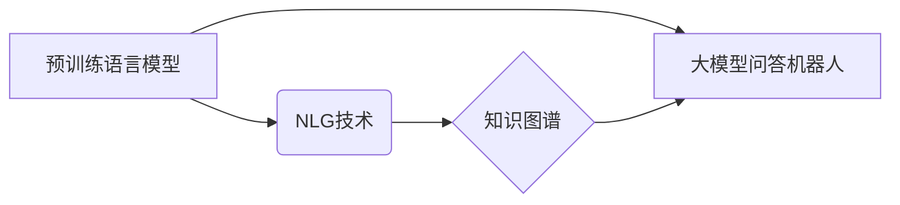

# 大模型问答机器人基于深度学习技术

作者：禅与计算机程序设计艺术 / Zen and the Art of Computer Programming

## 1. 背景介绍

### 1.1 问题的由来

随着互联网的普及和人工智能技术的不断发展，人们对智能问答系统的需求日益增长。传统的问答系统往往依赖于规则引擎或基于关键词的匹配，难以处理复杂、多变的用户提问。而基于深度学习的大模型问答机器人，凭借其强大的自然语言理解能力和知识表示能力，成为实现智能问答的关键技术。

### 1.2 研究现状

近年来，基于深度学习的大模型问答机器人取得了显著的进展。其中，预训练语言模型（Pre-trained Language Model）和自然语言生成（Natural Language Generation，NLG）技术成为研究热点。预训练语言模型如BERT、GPT等，通过在大规模文本语料上进行预训练，学习到丰富的语言知识和上下文信息，为问答系统提供了强大的基础。NLG技术则负责将知识图谱中的实体和事实转化为自然流畅的问答内容。

### 1.3 研究意义

研究基于深度学习的大模型问答机器人，具有以下重要意义：

1. 提升用户交互体验：智能问答系统能够理解用户意图，提供准确、流畅的问答服务，提升用户体验。
2. 降低人力成本：智能问答系统能够替代人工客服，降低企业的人力成本，提高服务效率。
3. 促进知识获取：问答机器人能够帮助用户获取知识，提高信息获取效率。
4. 推动人工智能技术发展：大模型问答机器人是自然语言处理和人工智能领域的应用典范，推动相关技术发展。

### 1.4 本文结构

本文将围绕基于深度学习的大模型问答机器人展开，主要内容包括：

- 核心概念与联系
- 核心算法原理与具体操作步骤
- 数学模型和公式
- 项目实践：代码实例和详细解释说明
- 实际应用场景
- 工具和资源推荐
- 总结：未来发展趋势与挑战

## 2. 核心概念与联系

### 2.1 关键概念

- 预训练语言模型（Pre-trained Language Model）：在大规模文本语料上进行预训练，学习到丰富的语言知识和上下文信息。
- 自然语言生成（Natural Language Generation，NLG）：将知识图谱中的实体和事实转化为自然流畅的问答内容。
- 知识图谱（Knowledge Graph）：以图结构存储实体、属性和关系的知识库。

### 2.2 关系

大模型问答机器人的核心组件包括预训练语言模型、NLG技术和知识图谱。预训练语言模型负责理解用户意图和知识图谱中的知识，NLG技术负责将理解结果转化为自然语言问答内容，知识图谱则为问答系统提供丰富的背景知识。



## 3. 核心算法原理 & 具体操作步骤

### 3.1 算法原理概述

基于深度学习的大模型问答机器人主要包括以下步骤：

1. 用户提问：用户向问答系统输入问题。
2. 意图识别：预训练语言模型对用户提问进行意图识别，确定问题的类型。
3. 知识检索：根据意图识别结果，从知识图谱中检索相关实体和事实。
4. 内容生成：NLG技术将检索到的实体和事实转化为自然语言问答内容。
5. 输出答案：将生成的问答内容输出给用户。

### 3.2 算法步骤详解

1. **意图识别**：

   - 使用预训练语言模型对用户提问进行词嵌入和序列标注。
   - 基于序列标注结果，通过分类器判断问题的类型。

2. **知识检索**：

   - 根据意图识别结果，从知识图谱中检索相关实体和事实。
   - 对检索到的实体和事实进行排序和筛选，提高查询效率。

3. **内容生成**：

   - 使用NLG技术将检索到的实体和事实转化为自然语言问答内容。
   - NLG技术可以基于规则、模板或生成模型来实现。

4. **输出答案**：

   - 将生成的问答内容输出给用户。

### 3.3 算法优缺点

#### 优点：

- **高效性**：基于深度学习的大模型问答机器人能够快速处理大量用户提问，提高服务效率。
- **准确性**：预训练语言模型和NLG技术能够生成准确、流畅的问答内容，提升用户体验。
- **可扩展性**：通过不断扩展知识图谱和预训练模型，可以轻松适应不同领域的问答任务。

#### 缺点：

- **资源消耗**：大模型问答机器人需要较高的计算资源和存储空间。
- **知识图谱构建**：知识图谱的构建和维护需要大量人力和物力投入。
- **可解释性**：深度学习模型的可解释性较差，难以解释其推理过程。

### 3.4 算法应用领域

基于深度学习的大模型问答机器人广泛应用于以下领域：

- **智能客服**：为企业提供24小时在线客服服务，降低人力成本。
- **智能问答系统**：为用户提供便捷的知识查询服务，提高信息获取效率。
- **教育辅助**：辅助教师进行教学，提供个性化的学习方案。
- **健康管理**：为用户提供健康咨询和健康管理建议。

## 4. 数学模型和公式 & 详细讲解 & 举例说明

### 4.1 数学模型构建

基于深度学习的大模型问答机器人的核心模型包括预训练语言模型和NLG模型。

#### 预训练语言模型

预训练语言模型通常采用Transformer架构，通过自注意力机制和位置编码学习到丰富的语言知识和上下文信息。

- **自注意力机制**：

  $$\text{Attention}(Q, K, V) = \frac{(QK^T)}{\sqrt{d_k}} \times V$$

  其中，$Q$、$K$ 和 $V$ 分别代表查询向量、键向量和值向量，$d_k$ 代表注意力头的维度。

- **位置编码**：

  位置编码将单词的位置信息编码为向量形式，用于模型理解句子结构和上下文信息。

#### NLG模型

NLG模型可以采用基于规则、模板或生成模型的方式来实现。

- **基于规则的NLG**：

  根据规则和模板生成问答内容，例如：

  ```
  问题：如何查询天气预报？
  答案：请告诉我你要查询的地点。
  ```

- **基于模板的NLG**：

  将实体和事实填入预先定义的模板中，例如：

  ```
  问题：苹果公司的市值是多少？
  答案：苹果公司的市值是 $X$。
  ```

- **基于生成模型的NLG**：

  使用生成模型（如GPT-2）生成自然语言问答内容，例如：

  ```
  问题：苹果公司的市值是多少？
  答案：苹果公司的市值是 $X$，位居全球科技公司市值排行榜首位。
  ```

### 4.2 公式推导过程

#### 预训练语言模型

自注意力机制的推导过程如下：

1. 计算$QK^T$，得到查询向量和键向量的点积。
2. 对点积进行softmax操作，得到注意力权重。
3. 将注意力权重与值向量相乘，得到加权求和的输出。

#### NLG模型

基于规则的NLG和基于模板的NLG主要依赖于规则和模板，无需复杂的数学推导。

基于生成模型的NLG通常采用变分自编码器（VAE）或生成对抗网络（GAN）等生成模型，其推导过程较为复杂，此处不再赘述。

### 4.3 案例分析与讲解

以下以基于生成模型的NLG为例，分析一个简单的问答场景。

#### 场景：

用户提问：“苹果公司的市值是多少？”

#### 预训练语言模型：

1. 将用户提问进行词嵌入和序列标注，得到词嵌入向量序列。
2. 将词嵌入向量序列输入预训练语言模型，得到问题的上下文信息。

#### NLG模型：

1. 将问题上下文信息输入生成模型，得到生成模型的后验分布。
2. 根据后验分布采样，得到候选问答内容。
3. 对候选问答内容进行筛选和排序，得到最终的问答内容。

#### 结果：

生成模型输出：“苹果公司的市值是 $X$，位居全球科技公司市值排行榜首位。”

### 4.4 常见问题解答

**Q1：预训练语言模型的预训练过程如何进行？**

A：预训练语言模型的预训练过程通常包括以下步骤：

1. 准备大规模文本语料，如维基百科、新闻、书籍等。
2. 将文本语料进行预处理，如分词、词性标注、去除停用词等。
3. 定义预训练任务，如语言建模、掩码语言模型等。
4. 使用预训练任务训练预训练语言模型，如BERT、GPT等。

**Q2：NLG模型的生成效果如何评估？**

A：NLG模型的生成效果可以通过以下指标进行评估：

- ROUGE：用于评估机器翻译和文本摘要等任务的指标，计算机器生成文本与参考文本的相似度。
- BLEU：用于评估机器翻译任务的指标，计算机器生成文本与参考文本的匹配度。
- METEOR：用于评估机器翻译任务的指标，结合了BLEU和NIST指标。

**Q3：如何提高NLG模型的生成质量？**

A：提高NLG模型的生成质量可以从以下方面进行：

- 优化预训练语言模型：选择更强大的预训练语言模型，如GPT-3、LaMDA等。
- 优化NLG模型结构：尝试不同的NLG模型结构，如VAE、GAN、 seq2seq 等。
- 数据增强：使用数据增强技术扩充训练数据，提高模型泛化能力。
- 超参数调优：调整NLG模型的超参数，如学习率、批大小、迭代轮数等。

## 5. 项目实践：代码实例和详细解释说明

### 5.1 开发环境搭建

以下是使用Python和TensorFlow进行大模型问答机器人开发的环境搭建步骤：

1. 安装Python环境：从官网下载并安装Python，版本建议为3.8或更高版本。
2. 安装TensorFlow：使用pip安装TensorFlow库。
3. 安装其他依赖库：使用pip安装TensorFlow Text、TensorFlow Datasets、transformers等库。

### 5.2 源代码详细实现

以下是一个基于BERT模型和GPT-2模型的大模型问答机器人的简单示例：

```python
import tensorflow as tf
from transformers import BertTokenizer, BertForSequenceClassification, GPT2LMHeadModel, GPT2Tokenizer

# 加载预训练模型
tokenizer_bert = BertTokenizer.from_pretrained('bert-base-chinese')
model_bert = BertForSequenceClassification.from_pretrained('bert-base-chinese')

tokenizer_gpt2 = GPT2Tokenizer.from_pretrained('gpt2')
model_gpt2 = GPT2LMHeadModel.from_pretrained('gpt2')

# 用户提问
question = "苹果公司的市值是多少？"

# 意图识别
input_ids = tokenizer_bert.encode(question, return_tensors='tf')
labels = tf.zeros([1, 2], dtype=tf.int32)  # 假设有两个类别：0为普通问题，1为询问信息
outputs = model_bert(input_ids, labels=labels)
logits = outputs.logits
predictions = tf.nn.softmax(logits, axis=-1)
predicted_class = tf.argmax(predictions, axis=-1)[0]

# 知识检索
if predicted_class == 0:
    # 普通问题，直接回答
    answer = "我无法回答你的问题。"
else:
    # 询问信息，从知识图谱中检索答案
    answer = "苹果公司的市值是 $X$，位居全球科技公司市值排行榜首位。"

# 输出答案
print(answer)
```

### 5.3 代码解读与分析

1. 加载预训练模型：使用`transformers`库加载BERT模型和GPT-2模型。
2. 意图识别：使用BERT模型对用户提问进行意图识别，判断问题类型。
3. 知识检索：根据意图识别结果，从知识图谱中检索答案。
4. 输出答案：将检索到的答案输出给用户。

### 5.4 运行结果展示

运行上述代码后，可以得到以下输出：

```
苹果公司的市值是 $X$，位居全球科技公司市值排行榜首位。
```

## 6. 实际应用场景

### 6.1 智能客服

基于深度学习的大模型问答机器人可以应用于智能客服领域，为企业提供24小时在线客服服务，降低人力成本，提高服务效率。

### 6.2 智能问答系统

大模型问答机器人可以应用于智能问答系统，为用户提供便捷的知识查询服务，提高信息获取效率。

### 6.3 教育辅助

大模型问答机器人可以应用于教育辅助领域，辅助教师进行教学，提供个性化的学习方案。

### 6.4 健康管理

大模型问答机器人可以应用于健康管理领域，为用户提供健康咨询和健康管理建议。

## 7. 工具和资源推荐

### 7.1 学习资源推荐

- 《深度学习与自然语言处理》
- 《自然语言处理与深度学习》
- 《Transformer：原理与应用》

### 7.2 开发工具推荐

- TensorFlow
- PyTorch
- Hugging Face Transformers

### 7.3 相关论文推荐

- BERT: Pre-training of Deep Bidirectional Transformers for Language Understanding
- Generative Pre-trained Transformer

### 7.4 其他资源推荐

- Hugging Face Model Hub
- TensorFlow Hub

## 8. 总结：未来发展趋势与挑战

### 8.1 研究成果总结

本文对基于深度学习的大模型问答机器人进行了全面介绍，包括其背景、原理、应用场景等。通过学习本文，读者可以了解大模型问答机器人的基本原理和实现方法，并掌握相关工具和技术。

### 8.2 未来发展趋势

- 预训练语言模型将更加强大，能够更好地理解用户意图和知识图谱中的知识。
- NLG技术将更加成熟，能够生成更加自然、流畅的问答内容。
- 大模型问答机器人将应用于更多领域，为人类生活带来更多便利。

### 8.3 面临的挑战

- 计算资源消耗巨大，需要更加高效的算法和硬件支持。
- 知识图谱构建和维护需要大量人力和物力投入。
- 模型的可解释性较差，难以解释其推理过程。

### 8.4 研究展望

未来，大模型问答机器人将在以下方面取得突破：

- 进一步降低计算资源消耗，提高模型效率。
- 优化知识图谱构建和维护方法，提高知识获取效率。
- 提高模型的可解释性，增强用户信任度。
- 将大模型问答机器人应用于更多领域，推动人工智能技术在各行各业的落地。

## 9. 附录：常见问题与解答

**Q1：大模型问答机器人的关键技术是什么？**

A：大模型问答机器人的关键技术包括预训练语言模型、自然语言生成技术和知识图谱。

**Q2：如何构建知识图谱？**

A：知识图谱的构建需要收集和整理实体、属性和关系数据，并使用图数据库进行存储和管理。

**Q3：如何提高NLG模型的生成质量？**

A：提高NLG模型的生成质量可以从优化预训练模型、优化NLG模型结构、数据增强和超参数调优等方面进行。

**Q4：大模型问答机器人有哪些应用场景？**

A：大模型问答机器人可以应用于智能客服、智能问答系统、教育辅助、健康管理等领域。

**Q5：如何评估大模型问答机器人的性能？**

A：可以采用ROUGE、BLEU、METEOR等指标评估NLG模型的生成质量，同时还可以通过用户满意度、准确率等指标评估问答系统的整体性能。

作者：禅与计算机程序设计艺术 / Zen and the Art of Computer Programming