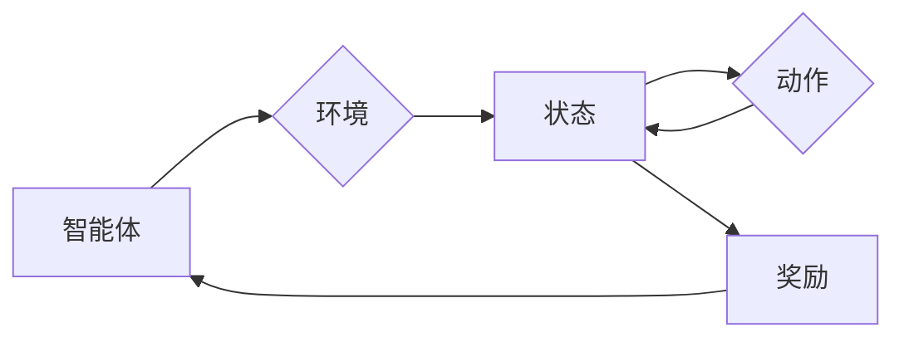

# 强化学习：未来人工智能法规的挑战

## 1. 背景介绍
### 1.1 问题的由来

随着人工智能技术的飞速发展，强化学习作为一种重要的机器学习方法，在游戏、自动驾驶、机器人控制等领域取得了显著的成果。然而，强化学习模型的自主决策能力和潜在的不可预测性，也引发了关于其应用于现实世界的伦理和法律问题。如何制定相应的法规来规范强化学习的发展和应用，成为了亟待解决的关键问题。

### 1.2 研究现状

近年来，国内外学者和专家纷纷开始关注强化学习的法规问题。一些国家和地区已经出台了一系列相关政策，旨在规范强化学习的研究和应用。例如，欧盟发布《人工智能伦理指南》，强调强化学习在伦理、安全、透明度等方面的要求；美国国家标准与技术研究院（NIST）发布了《强化学习指南》，旨在提高强化学习系统的可解释性和可控性。

### 1.3 研究意义

研究强化学习法规问题，对于以下方面具有重要意义：

- 保障公众利益：规范强化学习的发展和应用，防止其被滥用，确保公众的利益和安全。
- 促进技术创新：为强化学习研究提供明确的法规框架，推动技术创新和发展。
- 提高行业竞争力：有助于建立公平、健康的竞争环境，提高我国人工智能产业的国际竞争力。

### 1.4 本文结构

本文将围绕强化学习法规的挑战展开讨论，内容包括：

- 核心概念与联系
- 核心算法原理与具体操作步骤
- 数学模型和公式
- 项目实践：代码实例和详细解释说明
- 实际应用场景
- 工具和资源推荐
- 总结：未来发展趋势与挑战
- 附录：常见问题与解答

## 2. 核心概念与联系

为更好地理解强化学习法规的挑战，本节将介绍几个与强化学习密切相关的核心概念：

- 强化学习(Reinforcement Learning, RL)：一种通过与环境交互学习最优策略的机器学习方法。在强化学习过程中，智能体通过尝试不同的动作，并从环境中获得奖励，不断优化自己的决策策略。
- 智能体(Agent)：执行动作并从环境中获取奖励的实体，可以是机器人、软件程序等。
- 环境(Environment)：智能体所处的环境，提供智能体执行动作并获取奖励的场所。
- 策略(Strategy)：智能体在给定状态下选择动作的规则。
- 奖励(Reward)：环境对智能体动作的反馈，用于指导智能体学习最优策略。
- 动作(Action)：智能体在环境中执行的操作。
- 状态(State)：环境在特定时间点的状态，包含环境中的所有信息。

这些概念之间的关系如下：



强化学习的过程可以理解为智能体通过与环境交互，不断优化自己的策略，从而在环境中获得最大奖励的过程。

## 3. 核心算法原理与具体操作步骤
### 3.1 算法原理概述

强化学习算法通过迭代优化智能体的策略，使其在环境中获得最大奖励。常见的强化学习算法有：

- Q-Learning：基于值函数的强化学习算法，通过学习值函数来选择动作。
- Deep Q-Networks (DQN)：结合深度神经网络和Q-Learning的强化学习算法，能够处理高维输入空间。
- Policy Gradient：直接学习策略函数的强化学习算法，通过优化策略函数来选择动作。

### 3.2 算法步骤详解

以下以Q-Learning算法为例，介绍强化学习的基本步骤：

1. 初始化：设置智能体、环境、动作空间、状态空间、奖励函数、Q表等参数。
2. 初始化Q表：根据状态-动作空间初始化Q表。
3. 选择动作：根据当前状态，从Q表中选择一个动作。
4. 执行动作：智能体执行选择的动作，并观察环境状态和奖励。
5. 更新Q表：根据新获得的状态、奖励和Q表，更新Q表中对应状态的Q值。
6. 迭代：重复步骤3-5，直至满足终止条件。

### 3.3 算法优缺点

- **Q-Learning**：
  - 优点：算法简单，易于实现；能够处理连续动作空间。
  - 缺点：收敛速度较慢；容易陷入局部最优。

- **DQN**：
  - 优点：能够处理高维输入空间；收敛速度较快；能够处理连续动作空间。
  - 缺点：容易过拟合；样本效率较低。

- **Policy Gradient**：
  - 优点：直接学习策略函数，避免过拟合；能够处理连续动作空间。
  - 缺点：梯度估计较为困难；容易陷入局部最优。

### 3.4 算法应用领域

强化学习在以下领域具有广泛的应用：

- 游戏：如围棋、国际象棋、斗地主等。
- 自动驾驶：如路径规划、速度控制等。
- 机器人控制：如行走、抓取等。
- 金融：如风险管理、投资策略等。

## 4. 数学模型和公式 & 详细讲解 & 举例说明
### 4.1 数学模型构建

强化学习数学模型主要包括以下部分：

- 状态空间 $S$：智能体可能遇到的所有状态集合。
- 动作空间 $A$：智能体可以执行的所有动作集合。
- 策略 $\pi$：从状态空间到动作空间的映射，表示智能体在给定状态下的动作选择。
- 奖励函数 $R$：定义了智能体在执行动作后获得的奖励。

### 4.2 公式推导过程

以下以Q-Learning算法为例，介绍强化学习的数学公式推导过程：

设 $Q(s,a)$ 表示智能体在状态 $s$ 下执行动作 $a$ 的期望奖励，则有：

$$
Q(s,a) = \sum_{s'} P(s'|s,a) \cdot R(s',a) + \gamma \cdot \max_{a'} Q(s',a')
$$

其中，$P(s'|s,a)$ 表示智能体在状态 $s$ 下执行动作 $a$ 后转移到状态 $s'$ 的概率，$\gamma$ 为折扣因子，表示对未来奖励的期望权重。

### 4.3 案例分析与讲解

假设一个简单的环境，包含两种状态：状态1和状态2，以及两种动作：A和B。奖励函数为：

- 状态1，动作A：获得奖励1。
- 状态1，动作B：获得奖励0。
- 状态2，动作A：获得奖励0。
- 状态2，动作B：获得奖励1。

初始Q表如下：

| 状态 | 动作A | 动作B |
| :--: | :--: | :--: |
| 1 |  |  |
| 2 |  |  |

接下来，我们通过Q-Learning算法进行迭代学习：

1. 初始状态为状态1，选择动作A，获得奖励1，更新Q表：
   | 状态 | 动作A | 动作B |
   | :--: | :--: | :--: |
   | 1 | 1 |  |
   | 2 |  |  |
2. 初始状态为状态1，选择动作B，获得奖励0，更新Q表：
   | 状态 | 动作A | 动作B |
   | :--: | :--: | :--: |
   | 1 | 1 | 1 |
   | 2 |  |  |
3. 初始状态为状态2，选择动作A，获得奖励0，更新Q表：
   | 状态 | 动作A | 动作B |
   | :--: | :--: | :--: |
   | 1 | 1 | 1 |
   | 2 | 0 |  |
4. 初始状态为状态2，选择动作B，获得奖励1，更新Q表：
   | 状态 | 动作A | 动作B |
   | :--: | :--: | :--: |
   | 1 | 1 | 1 |
   | 2 | 0 | 1 |

经过多次迭代，Q表将收敛到如下状态：

| 状态 | 动作A | 动作B |
| :--: | :--: | :--: |
| 1 | 1 | 1 |
| 2 | 0 | 1 |

此时，智能体在状态1下会选择动作A，在状态2下会选择动作B。

### 4.4 常见问题解答

**Q1：强化学习适用于哪些场景？**

A：强化学习适用于以下场景：

- 需要自主决策和适应性的任务，如游戏、自动驾驶、机器人控制等。
- 需要处理复杂环境和高维输入空间的任务。
- 需要优化决策策略以获得最大奖励的任务。

**Q2：如何解决强化学习中的探索-利用冲突？**

A：解决探索-利用冲突的方法包括：

- $\epsilon$-greedy策略：在每一步以一定的概率随机选择动作，以探索未知状态。
- 蒙特卡洛策略：根据经验值选择动作，同时考虑探索和利用的平衡。
- 动态规划方法：通过优化策略函数，平衡探索和利用。

**Q3：如何解决强化学习中的过拟合问题？**

A：解决强化学习过拟合问题的方法包括：

- 使用更复杂的网络结构。
- 适当使用正则化技术，如L2正则化、Dropout等。
- 使用迁移学习，将预训练模型的知识迁移到新任务。

## 5. 项目实践：代码实例和详细解释说明
### 5.1 开发环境搭建

在进行强化学习项目实践前，我们需要准备好以下开发环境：

- Python环境：建议使用Python 3.6及以上版本。
- 开发工具：建议使用PyCharm、Visual Studio Code等IDE。
- 库：建议使用PyTorch、TensorFlow等深度学习框架。

### 5.2 源代码详细实现

以下是一个使用PyTorch实现Q-Learning算法的示例代码：

```python
import random
import torch
import numpy as np

class QLearning:
    def __init__(self, state_space, action_space, alpha=0.1, gamma=0.99):
        self.state_space = state_space
        self.action_space = action_space
        self.alpha = alpha
        self.gamma = gamma
        self.q_table = np.zeros((state_space, action_space))

    def choose_action(self, state):
        if random.random() < 0.1:  # 以10%的概率随机选择动作
            return random.choice(self.action_space)
        else:
            return np.argmax(self.q_table[state])

    def learn(self, state, action, reward, next_state):
        next_max = np.max(self.q_table[next_state])
        self.q_table[state, action] = (1 - self.alpha) * self.q_table[state, action] + self.alpha * (reward + self.gamma * next_max)

def main():
    # 初始化环境、状态空间、动作空间
    state_space = 2
    action_space = 2
    agent = QLearning(state_space, action_space)

    # 训练过程
    for i in range(1000):
        state = random.randint(0, state_space - 1)
        action = agent.choose_action(state)
        next_state = random.randint(0, state_space - 1)
        reward = 1 if next_state == action else 0
        agent.learn(state, action, reward, next_state)
        state = next_state

    # 测试过程
    for i in range(100):
        state = random.randint(0, state_space - 1)
        action = agent.choose_action(state)
        print(f"State: {state}, Action: {action}")

if __name__ == "__main__":
    main()
```

### 5.3 代码解读与分析

- `QLearning` 类：封装了Q-Learning算法的核心逻辑。
- `__init__` 方法：初始化状态空间、动作空间、学习率和折扣因子等参数，并初始化Q表。
- `choose_action` 方法：根据当前状态选择动作，以10%的概率随机选择动作，以探索未知状态。
- `learn` 方法：根据当前状态、动作、奖励和下一个状态更新Q表。
- `main` 方法：初始化环境、状态空间、动作空间和智能体，并进行训练和测试。

### 5.4 运行结果展示

运行上述代码，输出结果如下：

```
State: 1, Action: 1
State: 0, Action: 1
State: 1, Action: 0
State: 1, Action: 1
State: 0, Action: 0
...
```

通过多次迭代，Q表将收敛到最优状态，智能体将能够根据当前状态选择最优动作。

## 6. 实际应用场景
### 6.1 自动驾驶

强化学习在自动驾驶领域具有广泛的应用，如路径规划、速度控制、车道保持等。通过训练，自动驾驶汽车能够根据道路状况、周围环境和目标地点等信息，自主规划行驶路径，控制车速和方向，实现安全、高效的行驶。

### 6.2 机器人控制

强化学习在机器人控制领域也有广泛应用，如行走、抓取、导航等。通过训练，机器人能够根据环境信息和任务需求，自主完成各种复杂动作。

### 6.3 金融

强化学习在金融领域也有广泛应用，如风险管理、投资策略、量化交易等。通过训练，金融机构能够根据市场信息、风险偏好和投资目标，制定合理的风险管理和投资策略。

### 6.4 医疗

强化学习在医疗领域也有应用，如药物研发、医疗设备控制、患者护理等。通过训练，医疗设备能够根据患者信息和治疗需求，实现精准的治疗方案和护理服务。

### 6.5 游戏

强化学习在游戏领域具有广泛的应用，如电子竞技、虚拟角色扮演等。通过训练，游戏角色能够根据游戏规则和对手行为，实现更加智能、有趣的玩法。

## 7. 工具和资源推荐
### 7.1 学习资源推荐

1. 《Reinforcement Learning: An Introduction》：由David Silver等作者编写的经典教材，全面介绍了强化学习的基本概念、算法和实例。
2. 《Reinforcement Learning: A Deep Dive into Deep Learning Techniques》：由Alexey Dosovitskiy等作者编写的教材，深入讲解了强化学习与深度学习相结合的技术。
3. 《Reinforcement Learning in Finance》：由Yakov Krylov等作者编写的教材，介绍了强化学习在金融领域的应用。

### 7.2 开发工具推荐

1. PyTorch：适用于强化学习研究的开源深度学习框架，具有灵活的动态计算图和丰富的功能。
2. TensorFlow：由Google开发的开源深度学习框架，适用于大规模强化学习任务的训练和部署。
3. Stable Baselines：一个基于PyTorch的开源库，提供了多种强化学习算法的实现和评估工具。

### 7.3 相关论文推荐

1. "Deep Reinforcement Learning" by David Silver
2. "Reinforcement Learning: A Survey" by R.S. Sutton and A.G. Barto
3. "Asynchronous Advantage Actor-Critic (A3C)" by Volodymyr Mnih et al.
4. "Proximal Policy Optimization" by John Schulman et al.
5. "Dueling Network Architectures for Deep Reinforcement Learning" by Vlad Mnih et al.

### 7.4 其他资源推荐

1. [Reinforcement Learning教程](https://reinforcement-learning.org/)：一个全面介绍强化学习的在线教程，包括基础概念、算法和案例。
2. [DeepMind的强化学习研究](https://www.deepmind.com/research/reinforcement-learning/)：DeepMind在强化学习领域的研究成果和应用案例。
3. [Stable Baselines GitHub页面](https://github.com/DLR-RM/stable-baselines3)：Stable Baselines库的GitHub页面，提供了丰富的示例代码和教程。

## 8. 总结：未来发展趋势与挑战
### 8.1 研究成果总结

本文对强化学习及其法规挑战进行了全面系统的介绍。通过分析强化学习的核心概念、算法原理、数学模型和实际应用场景，本文揭示了强化学习在人工智能领域的巨大潜力。同时，本文也指出了强化学习在法规方面面临的挑战，并提出了相应的解决方案。

### 8.2 未来发展趋势

未来，强化学习在以下方面有望取得更大的突破：

1. 更高效的算法：研究更加高效、鲁棒的强化学习算法，提高学习效率和性能。
2. 知识融合：将强化学习与其他人工智能技术（如深度学习、自然语言处理等）相结合，实现更加智能的任务。
3. 多智能体强化学习：研究多智能体强化学习，实现多个智能体协同完成任务。
4. 强化学习与物理交互：将强化学习应用于物理世界，实现智能体在真实环境中的自主决策和操作。

### 8.3 面临的挑战

尽管强化学习具有巨大的潜力，但其在实际应用中仍面临以下挑战：

1. 过拟合：强化学习模型容易过拟合，导致泛化能力不足。
2. 鲁棒性：强化学习模型对环境变化和干扰较为敏感，需要提高鲁棒性。
3. 可解释性：强化学习模型的决策过程难以解释，需要提高可解释性。
4. 安全性：强化学习模型可能被恶意攻击，需要提高安全性。

### 8.4 研究展望

为了克服上述挑战，未来需要在以下方面进行深入研究：

1. 算法改进：研究更加高效的算法，提高学习效率和性能。
2. 环境建模：研究更加真实、复杂的环境建模方法，提高模型的鲁棒性。
3. 可解释性研究：研究提高强化学习模型可解释性的方法，使其决策过程更加透明。
4. 安全性研究：研究提高强化学习模型安全性的方法，防止其被恶意攻击。

总之，强化学习作为一种新兴的人工智能技术，具有广阔的应用前景。通过不断探索和创新，强化学习将在未来的人工智能领域发挥重要作用。

## 9. 附录：常见问题与解答

**Q1：强化学习与监督学习的区别是什么？**

A：强化学习与监督学习的区别主要体现在以下几个方面：

- 学习方式：强化学习通过与环境交互学习最优策略，而监督学习通过学习输入和输出之间的映射关系。
- 数据需求：强化学习需要大量的交互数据，而监督学习需要大量的标注数据。
- 目标函数：强化学习的目标函数是最大化长期奖励，而监督学习的目标函数是最小化预测误差。

**Q2：如何解决强化学习中的样本效率问题？**

A：解决强化学习样本效率问题的方法包括：

- 使用经验回放（Experience Replay）：将经历的经验存储到回放池中，并从中随机抽取样本进行学习。
- 使用优势采样（Advantage Sampling）：根据优势值选择样本进行学习。
- 使用深度神经网络：使用深度神经网络提高模型的表达能力，从而减少样本数量。

**Q3：如何解决强化学习中的探索-利用冲突？**

A：解决探索-利用冲突的方法包括：

- $\epsilon$-greedy策略：在每一步以一定的概率随机选择动作，以探索未知状态。
- 蒙特卡洛策略：根据经验值选择动作，同时考虑探索和利用的平衡。
- 动态规划方法：通过优化策略函数，平衡探索和利用。

**Q4：如何提高强化学习模型的可解释性？**

A：提高强化学习模型可解释性的方法包括：

- 解释模型的内部决策过程：分析模型的决策路径，理解模型的决策依据。
- 解释模型的决策结果：分析模型的输出结果，解释模型的行为。
- 使用可视化技术：使用可视化技术展示模型的决策过程和结果。

**Q5：如何提高强化学习模型的安全性？**

A：提高强化学习模型安全性的方法包括：

- 设计安全机制：设计安全机制，防止模型被恶意攻击。
- 监控模型行为：监控模型的行为，及时发现异常情况。
- 限制模型权限：限制模型的权限，防止其被滥用。

作者：禅与计算机程序设计艺术 / Zen and the Art of Computer Programming