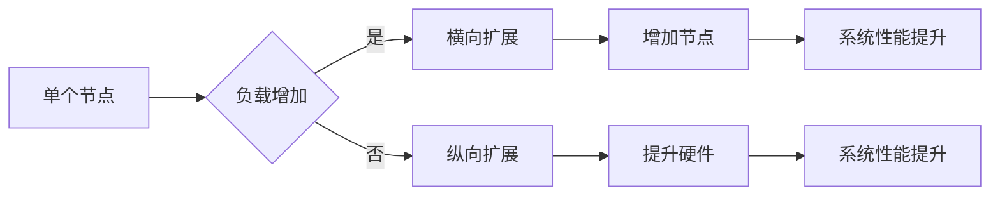
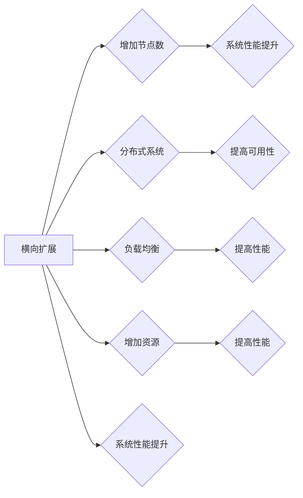

# 横向扩展与纵向扩展的最佳实践

> 关键词：横向扩展，纵向扩展，负载均衡，分布式系统，可伸缩性，性能优化，数据库设计，云计算

## 1. 背景介绍

在现代IT系统中，可伸缩性是确保系统稳定性和性能的关键因素。随着业务的不断增长，系统需要能够适应增加的用户负载和数据处理需求。横向扩展（Scaling Out）和纵向扩展（Scaling Up）是两种主要的系统可伸缩性策略。本文将深入探讨这两种扩展策略的原理、最佳实践以及它们在实际应用中的具体实施。

### 1.1 问题的由来

随着互联网的普及和数字化转型的发展，企业对IT系统的依赖日益增加。如何确保系统在面对高并发、大数据量的情况下仍能保持稳定运行，成为了一个迫切需要解决的问题。横向扩展和纵向扩展提供了两种不同的解决方案，但它们各自都有其适用场景和优缺点。

### 1.2 研究现状

目前，许多企业都在探索和实施横向扩展和纵向扩展。一些云服务提供商如Amazon Web Services (AWS)、Microsoft Azure和Google Cloud Platform (GCP) 提供了丰富的服务来支持这两种扩展策略。同时，开源社区也涌现出许多工具和框架，如Kubernetes、Docker等，以简化扩展过程。

### 1.3 研究意义

研究横向扩展和纵向扩展的最佳实践，对于企业构建高效、可靠的IT系统具有重要意义：

1. **提高系统性能**：通过合理的扩展策略，可以显著提高系统处理请求的能力，提升用户体验。
2. **降低成本**：合理选择扩展策略可以优化资源利用，降低硬件和运营成本。
3. **增强系统稳定性**：通过扩展，可以提高系统的可用性和容错性，减少单点故障的风险。
4. **适应业务增长**：随着业务的发展，系统能够灵活地扩展以满足不断增长的需求。

### 1.4 本文结构

本文将围绕横向扩展和纵向扩展展开，具体内容包括：

- 核心概念与联系
- 核心算法原理 & 具体操作步骤
- 数学模型和公式 & 详细讲解 & 举例说明
- 项目实践：代码实例和详细解释说明
- 实际应用场景
- 工具和资源推荐
- 总结：未来发展趋势与挑战
- 附录：常见问题与解答

## 2. 核心概念与联系

### 2.1 横向扩展与纵向扩展的定义

**横向扩展**：通过增加服务器或计算资源来提升系统处理能力。通常涉及增加更多相同的硬件或虚拟机实例。

**纵向扩展**：通过提升单个服务器的处理能力来提升系统性能。通常涉及升级硬件、增加内存、提升处理器性能等。

### 2.2 Mermaid 流程图



### 2.3 关系图



### 2.4 横向扩展与纵向扩展的联系

横向扩展和纵向扩展都是提高系统性能和可伸缩性的方法，但它们的目标和实现方式有所不同。横向扩展侧重于通过增加节点数来提高系统处理能力，而纵向扩展侧重于提升单个节点的性能。在实际应用中，这两种策略往往结合使用，以达到最佳效果。

## 3. 核心算法原理 & 具体操作步骤

### 3.1 算法原理概述

横向扩展主要涉及负载均衡和分布式系统设计。负载均衡算法负责将请求分配到不同的节点上，而分布式系统设计确保了数据的一致性和系统的可靠性。

纵向扩展主要涉及硬件升级和性能优化技术。硬件升级包括增加处理器、内存和存储等，而性能优化包括数据库索引优化、缓存机制、代码优化等。

### 3.2 算法步骤详解

#### 3.2.1 横向扩展

1. **负载均衡**：选择合适的负载均衡算法，如轮询、最少连接、IP哈希等。
2. **分布式系统设计**：设计分布式数据库、缓存和消息队列等。
3. **微服务架构**：将系统拆分为多个微服务，每个服务独立部署和扩展。
4. **自动化部署**：使用自动化工具（如Kubernetes）进行服务部署和扩展。

#### 3.2.2 纵向扩展

1. **硬件升级**：根据需求升级服务器硬件，如增加CPU核心数、内存容量等。
2. **性能优化**：优化数据库查询、缓存机制和代码性能。
3. **资源监控**：监控系统资源使用情况，及时进行硬件升级或性能优化。

### 3.3 算法优缺点

#### 3.3.1 横向扩展

**优点**：

- 可以线性地提高系统处理能力。
- 可以轻松地增加新的节点。
- 可以提高系统的可用性和容错性。

**缺点**：

- 需要更多的硬件资源。
- 系统复杂度增加。
- 需要维护多个节点。

#### 3.3.2 纵向扩展

**优点**：

- 可以在单个节点上提高性能。
- 可以更有效地利用现有硬件资源。
- 可以减少系统复杂度。

**缺点**：

- 性能提升有限。
- 难以扩展到更高的性能水平。
- 可能需要更换硬件设备。

### 3.4 算法应用领域

横向扩展和纵向扩展在许多应用领域都有广泛的应用，如Web应用、电子商务、在线游戏、大数据处理等。

## 4. 数学模型和公式 & 详细讲解 & 举例说明

### 4.1 数学模型构建

横向扩展和纵向扩展的数学模型可以根据系统性能、资源需求和成本等因素进行构建。以下是一个简单的数学模型示例：

$$
P_{\text{total}} = P_{\text{node}} \times N_{\text{nodes}}
$$

其中，$P_{\text{total}}$ 表示系统总性能，$P_{\text{node}}$ 表示单个节点的性能，$N_{\text{nodes}}$ 表示节点数。

### 4.2 公式推导过程

假设每个节点都能够独立处理请求，那么系统总性能等于单个节点性能乘以节点数。

### 4.3 案例分析与讲解

假设我们有一个Web应用，每个节点可以处理1000个请求/秒。如果我们将节点数从1增加到10，那么系统总性能将从1000个请求/秒增加到10000个请求/秒。

## 5. 项目实践：代码实例和详细解释说明

### 5.1 开发环境搭建

为了演示横向扩展，我们将使用Kubernetes进行集群管理。以下是搭建Kubernetes开发环境的步骤：

1. 安装Docker。
2. 安装Minikube，一个Kubernetes本地集群工具。
3. 启动Minikube集群。
4. 安装Kubernetes命令行工具kubectl。

### 5.2 源代码详细实现

以下是一个简单的Kubernetes部署文件示例，用于部署一个简单的Web应用：

```yaml
apiVersion: apps/v1
kind: Deployment
metadata:
  name: web-app
spec:
  replicas: 3
  selector:
    matchLabels:
      app: web-app
  template:
    metadata:
      labels:
        app: web-app
    spec:
      containers:
      - name: web-app
        image: nginx:latest
        ports:
        - containerPort: 80
```

### 5.3 代码解读与分析

这个部署文件定义了一个名为`web-app`的Deployment，它将部署3个副本的Nginx容器。每个容器都将监听80端口，从而提供Web服务。

### 5.4 运行结果展示

在执行以下命令后，我们可以查看部署的状态：

```bash
kubectl get deployments
```

输出结果将显示`web-app`的副本数量和状态。

## 6. 实际应用场景

横向扩展和纵向扩展在许多实际应用场景中都有广泛的应用。以下是一些例子：

### 6.1 Web应用

Web应用通常需要处理高并发的用户请求。通过横向扩展，可以将请求分配到多个服务器上，从而提高系统的处理能力和可用性。

### 6.2 数据库

数据库是许多企业系统的核心组件。通过横向扩展，可以将数据库数据分散到多个节点上，从而提高数据处理的性能和可靠性。

### 6.3 大数据处理

大数据处理通常需要处理海量数据。通过横向扩展，可以将数据处理任务分配到多个节点上，从而提高数据处理的效率。

## 7. 工具和资源推荐

### 7.1 学习资源推荐

- 《Kubernetes权威指南》
- 《Docker实战》
- 《高性能MySQL》

### 7.2 开发工具推荐

- Kubernetes
- Docker
- Jenkins

### 7.3 相关论文推荐

- 《大规模分布式系统的负载均衡》
- 《分布式数据库技术》
- 《大数据处理技术》

## 8. 总结：未来发展趋势与挑战

### 8.1 研究成果总结

本文深入探讨了横向扩展和纵向扩展的原理、最佳实践以及它们在实际应用中的具体实施。通过分析这两种扩展策略的优缺点和应用场景，本文为读者提供了宝贵的参考。

### 8.2 未来发展趋势

随着云计算和容器技术的不断发展，横向扩展和纵向扩展将变得更加简单和高效。未来，以下趋势值得关注：

- 自动化扩展：通过自动化工具和平台，系统可以根据负载自动进行扩展。
- 弹性计算：云服务提供商将提供更加灵活的计算资源，以满足不同的扩展需求。
- 智能负载均衡：智能负载均衡算法将根据请求的特点和节点的性能进行动态调整。

### 8.3 面临的挑战

尽管横向扩展和纵向扩展具有许多优势，但在实际应用中也面临着一些挑战：

- 系统复杂性：随着系统规模的扩大，系统的复杂性也会增加，增加了维护难度。
- 数据一致性：在分布式系统中，确保数据一致性是一个挑战。
- 安全性：随着系统规模的扩大，安全性成为一个重要问题。

### 8.4 研究展望

为了应对这些挑战，未来的研究需要在以下方面取得突破：

- 简化系统架构：通过模块化、微服务化等技术简化系统架构，降低维护难度。
- 数据一致性和容错性：研究更加可靠的数据一致性和容错技术，提高系统的可用性和可靠性。
- 安全性：研究更加安全的数据加密、访问控制和身份验证技术，保护系统免受攻击。

## 9. 附录：常见问题与解答

### 9.1 横向扩展和纵向扩展有什么区别？

A: 横向扩展通过增加节点数来提高系统处理能力，而纵向扩展通过提升单个节点的性能来提高系统处理能力。

### 9.2 什么是负载均衡？

A: 负载均衡是一种将请求分配到不同服务器或节点上的技术，以提高系统的处理能力和可用性。

### 9.3 横向扩展和纵向扩展哪种更好？

A: 这取决于具体的应用场景和需求。一般来说，横向扩展更适合处理高并发场景，而纵向扩展更适合处理单个节点性能瓶颈。

### 9.4 如何选择合适的负载均衡算法？

A: 选择合适的负载均衡算法需要考虑请求的特点和系统的需求。例如，轮询算法简单易用，但可能不适用于有状态服务。

### 9.5 横向扩展和纵向扩展的成本如何？

A: 横向扩展的成本主要来自于额外的硬件和软件资源，而纵向扩展的成本主要来自于硬件升级和性能优化。

作者：禅与计算机程序设计艺术 / Zen and the Art of Computer Programming