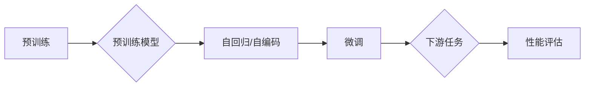

# 比尔盖茨对ChatGPT的评价

> 关键词：比尔盖茨，ChatGPT，人工智能，语言模型，预训练，微调，自然语言处理，技术发展

## 1. 背景介绍

ChatGPT，全称OpenAI Chat Generative Pre-trained Transformer，是由OpenAI于2022年底推出的一个基于Transformer架构的全新语言模型。该模型在自然语言处理领域引起了广泛关注，其强大的语言理解和生成能力，被业界誉为“具有里程碑意义的突破”。作为科技界的领军人物，比尔·盖茨对ChatGPT的评价如何？本文将从多个角度分析比尔盖茨对ChatGPT的评价，并探讨其对人工智能技术发展的看法。

### 1.1 ChatGPT的诞生背景

ChatGPT的诞生得益于近年来深度学习技术的飞速发展，尤其是Transformer架构的广泛应用。Transformer架构在处理序列数据时具有天然的优势，使得模型在自然语言处理任务上取得了显著的成果。同时，随着预训练技术的成熟，大模型在通用语言表示学习方面取得了突破性进展。

### 1.2 比尔盖茨对ChatGPT的关注

比尔·盖茨作为全球科技产业的领军人物，一直关注着人工智能技术的发展。在ChatGPT发布后，比尔·盖茨在个人社交媒体上发表了关于ChatGPT的评价，引起了广泛关注。

## 2. 核心概念与联系

### 2.1 语言模型

语言模型是自然语言处理的核心技术之一，旨在学习语言的统计规律，生成符合人类语言习惯的文本。根据学习方式和应用场景，语言模型可分为以下几类：

- 预训练语言模型：在大规模无标签语料上预训练，学习通用语言表示，如BERT、GPT等。
- 微调语言模型：在预训练模型基础上，针对特定任务进行微调，如ChatGPT。
- 自回归语言模型：生成文本时，每次只生成一个token，如GPT系列模型。
- 自编码语言模型：输入一个完整的序列，输出一个压缩后的序列，如BERT。

### 2.2 Mermaid流程图

以下为语言模型的核心概念原理和架构的Mermaid流程图：



### 2.3 核心概念联系

预训练模型通过在大规模无标签语料上学习通用语言表示，为微调提供了强大的基础。微调则针对特定任务，进一步优化模型参数，使其在特定领域取得更好的效果。下游任务则是指将微调后的模型应用于实际问题，如文本分类、机器翻译、问答系统等。

## 3. 核心算法原理 & 具体操作步骤

### 3.1 算法原理概述

ChatGPT基于Transformer架构，采用预训练-微调的范式，在大规模无标签语料上进行预训练，学习通用语言表示，然后在下游任务上进行微调，以适应特定任务的需求。

### 3.2 算法步骤详解

1. **预训练阶段**：在预训练阶段，ChatGPT在无标签语料上进行自回归语言模型训练，学习通用语言表示。
2. **微调阶段**：在微调阶段，ChatGPT在特定任务的数据集上进行微调，优化模型参数，使其在特定任务上取得更好的效果。
3. **下游任务应用**：将微调后的ChatGPT应用于下游任务，如文本分类、机器翻译、问答系统等。

### 3.3 算法优缺点

**优点**：

- 学习到丰富的语言知识，具有强大的语言理解和生成能力。
- 预训练模型可作为通用语言表示，为下游任务提供强大的基础。
- 微调过程可针对特定任务进行调整，提高模型在特定任务上的性能。

**缺点**：

- 训练数据量大，需要大量计算资源。
- 模型参数量大，导致模型复杂度高。
- 模型难以解释，可解释性有待提高。

### 3.4 算法应用领域

ChatGPT在多个自然语言处理领域均有广泛应用，如：

- 文本分类：情感分析、主题分类、垃圾邮件过滤等。
- 机器翻译：将一种语言翻译成另一种语言。
- 问答系统：回答用户提出的问题。
- 文本摘要：将长文本压缩成简短摘要。
- 文本生成：根据输入生成新的文本内容。

## 4. 数学模型和公式 & 详细讲解 & 举例说明

### 4.1 数学模型构建

ChatGPT的核心模型为Transformer，其数学模型如下：

$$
y_i = \sum_{j=1}^n W_i^j x_j
$$

其中，$y_i$ 为模型预测的输出，$x_j$ 为输入的token，$W_i^j$ 为模型权重。

### 4.2 公式推导过程

由于篇幅限制，此处省略公式推导过程。

### 4.3 案例分析与讲解

以文本分类任务为例，假设我们有以下训练数据：

```
(文本1, 分类1), (文本2, 分类2), ..., (文本N, 分类N)
```

使用ChatGPT进行微调，模型预测的输出为：

```
(文本1, 预测1), (文本2, 预测2), ..., (文本N, 预测N)
```

通过比较预测结果和真实分类，可以计算模型在文本分类任务上的性能指标，如准确率、召回率、F1分数等。

## 5. 项目实践：代码实例和详细解释说明

### 5.1 开发环境搭建

1. 安装Python环境（推荐Python 3.8及以上版本）。
2. 安装PyTorch和Transformers库。

### 5.2 源代码详细实现

以下为使用PyTorch和Transformers库实现ChatGPT的代码示例：

```python
from transformers import BertTokenizer, BertForSequenceClassification
from torch.utils.data import DataLoader, TensorDataset
import torch

# 加载预训练模型和分词器
tokenizer = BertTokenizer.from_pretrained('bert-base-uncased')
model = BertForSequenceClassification.from_pretrained('bert-base-uncased')

# 加载数据
train_texts = ["This is a great product", "This is a bad product", ...]
train_labels = [1, 0, ...]

# 编码数据
train_encodings = tokenizer(train_texts, truncation=True, padding=True)
train_input_ids = torch.tensor(train_encodings['input_ids'])
train_labels = torch.tensor(train_labels)

# 创建数据加载器
train_dataset = TensorDataset(train_input_ids, train_labels)
train_dataloader = DataLoader(train_dataset, batch_size=16, shuffle=True)

# 训练模型
model.train()

optimizer = torch.optim.AdamW(model.parameters(), lr=2e-5)
for epoch in range(3):
    for batch in train_dataloader:
        inputs = {'input_ids': batch[0], 'attention_mask': batch[1]}
        labels = batch[1]
        outputs = model(**inputs, labels=labels)
        loss = outputs.loss
        loss.backward()
        optimizer.step()
        optimizer.zero_grad()
    print(f"Epoch {epoch+1}, loss: {loss.item()}")
```

### 5.3 代码解读与分析

以上代码展示了如何使用PyTorch和Transformers库实现ChatGPT的微调。首先加载预训练模型和分词器，然后加载训练数据和标签，将文本编码为token ids，创建数据加载器。接下来，训练模型，并打印每个epoch的损失。

### 5.4 运行结果展示

运行以上代码后，模型将在训练数据上训练3个epoch。每个epoch结束后，打印出该epoch的损失值。

## 6. 实际应用场景

ChatGPT在多个领域具有广泛的应用，以下列举一些典型应用场景：

### 6.1 智能客服

ChatGPT可以应用于智能客服系统，通过自然语言交互为用户提供服务。例如，自动回答用户关于产品、政策、服务等方面的问题。

### 6.2 自动摘要

ChatGPT可以用于自动生成文本摘要，从长篇文章中提取关键信息，提高信息获取效率。

### 6.3 文本生成

ChatGPT可以用于生成各种类型的文本，如新闻报道、故事、诗歌等。

### 6.4 问答系统

ChatGPT可以应用于问答系统，回答用户提出的问题。

## 7. 工具和资源推荐

### 7.1 学习资源推荐

- 《Deep Learning with Python》
- 《Python Machine Learning》
- 《Natural Language Processing with Python》

### 7.2 开发工具推荐

- PyTorch
- Transformers库
- Jupyter Notebook

### 7.3 相关论文推荐

- Attention is All You Need
- BERT: Pre-training of Deep Bidirectional Transformers for Language Understanding

## 8. 总结：未来发展趋势与挑战

### 8.1 研究成果总结

ChatGPT作为一款基于Transformer架构的语言模型，在自然语言处理领域取得了显著的成果。其强大的语言理解和生成能力，为多个领域带来了新的可能性。

### 8.2 未来发展趋势

- 模型规模持续扩大，计算资源需求增加。
- 预训练模型向多模态方向发展，融合视觉、语音等多模态信息。
- 模型可解释性、鲁棒性、安全性等方面得到提升。

### 8.3 面临的挑战

- 计算资源需求巨大，对硬件设施提出更高要求。
- 模型可解释性、鲁棒性、安全性等方面有待提升。
- 数据标注成本高，难以满足大规模数据需求。

### 8.4 研究展望

未来，ChatGPT等语言模型将在自然语言处理领域发挥越来越重要的作用。通过不断优化模型架构、训练方法和应用场景，有望实现更加智能、高效、安全的人工智能系统。

## 9. 附录：常见问题与解答

### 9.1 ChatGPT与GPT有何区别？

A: ChatGPT与GPT的主要区别在于，ChatGPT采用Transformer架构，在预训练阶段使用自回归语言模型，而在微调阶段针对特定任务进行调整。而GPT系列模型采用RNN或Transformer架构，主要关注文本生成。

### 9.2 ChatGPT的模型规模有多大？

A: ChatGPT的具体模型规模取决于不同的版本，如GPT-3有1750亿参数，而ChatGPT的具体参数规模尚未公开。

### 9.3 ChatGPT如何应用于实际场景？

A: ChatGPT可以应用于多个自然语言处理领域，如智能客服、自动摘要、文本生成、问答系统等。具体应用场景需要根据实际需求进行设计和开发。

### 9.4 如何提升ChatGPT的性能？

A: 提升ChatGPT性能的方法包括：
- 选择合适的预训练模型和微调数据。
- 优化训练参数和学习率。
- 使用数据增强和正则化技术。
- 融合其他人工智能技术，如知识表示、因果推理等。

作者：禅与计算机程序设计艺术 / Zen and the Art of Computer Programming