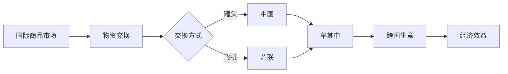

# 牟其中的跨国生意：罐头换飞机

> 关键词：牟其中，跨国贸易，罐头换飞机，商业模式，国际贸易，互换贸易，物资交换，经济全球化

## 1. 背景介绍
### 1.1 问题的由来
牟其中，这位被誉为“中国企业家教父”的人物，以其独特的商业智慧和大胆的冒险精神在改革开放初期留下了浓墨重彩的一笔。牟其中最著名的案例之一就是“罐头换飞机”的跨国生意，这一事件不仅展示了牟其中对国际贸易规则的深刻理解，也反映了当时中国与西方国家之间独特的物资交换方式。

### 1.2 牟其中其人
牟其中，原名牟其中，1949年出生于中国湖北省武汉市，曾任北京东方集团董事局主席。他以其大胆的商业模式和创新精神著称，被誉为“中国的巴菲特”。牟其中的人生充满了传奇色彩，他的商业生涯充满了冒险和挑战。

### 1.3 研究意义
牟其中的“罐头换飞机”事件，不仅是中国改革开放初期的一个重要商业案例，也是国际贸易史上的一个独特现象。研究这一事件，有助于我们深入理解国际贸易规则、商业模式创新以及中国企业在全球化进程中的角色和作用。

## 2. 核心概念与联系
### 2.1 物资交换
物资交换是一种以物易物的方式，通过交换不同类型的商品来实现交易目的。在缺乏货币或货币不流通的情况下，物资交换是主要的交易方式。

### 2.2 互换贸易
互换贸易是指两个或多个国家之间的商品和服务交换，通常不涉及货币。这种贸易方式在特定时期和特定条件下，可以成为国际贸易的重要组成部分。

### 2.3 核心概念原理和架构的 Mermaid 流程图


## 3. 核心算法原理 & 具体操作步骤
### 3.1 算法原理概述
牟其中的“罐头换飞机”的核心原理是通过物资交换的方式，以中国的罐头产品换取苏联的飞机，实现双方的经济利益。

### 3.2 算法步骤详解
1. 牟其中首先与苏联政府接触，提出用中国的罐头换苏联的飞机。
2. 双方就交换的商品种类、数量、质量、价格等问题进行谈判。
3. 达成协议后，中国开始生产罐头，苏联提供飞机。
4. 罐头和飞机在指定地点进行交接，完成交易。

### 3.3 算法优缺点
#### 3.3.1 优点
- **规避了货币结算的风险**：在当时国际贸易中，由于汇率波动、货币贬值等原因，使用货币结算存在较大风险。
- **满足了特定需求**：苏联当时对中国飞机有需求，而中国对苏联的罐头也有需求，这种交换方式满足了双方的需求。
- **促进了国际贸易**：罐头换飞机的案例为中国与苏联之间的贸易提供了新的思路，促进了双边贸易的发展。

#### 3.3.2 缺点
- **规模受限**：由于罐头和飞机的生产和需求有限，这种交换方式难以大规模应用。
- **长期可持续性**：依赖特定商品的交换，长期可持续性较差。

### 3.4 算法应用领域
罐头换飞机的案例在特定历史时期和特定条件下具有一定的应用价值，但在现代国际贸易中，由于货币结算的便利性和全球化的深入发展，物资交换的应用领域逐渐缩小。

## 4. 数学模型和公式 & 详细讲解 & 举例说明
### 4.1 数学模型构建
罐头换飞机的数学模型可以通过以下公式表示：

$$
X_{罐头} = Y_{飞机}
$$

其中，$X_{罐头}$ 表示中国提供给苏联的罐头数量，$Y_{飞机}$ 表示苏联提供给中国的飞机数量。

### 4.2 公式推导过程
由于双方交换的商品数量必须相等，因此有：

$$
X_{罐头} = Y_{飞机}
$$

### 4.3 案例分析与讲解
在牟其中提出的罐头换飞机的案例中，中国向苏联提供了大量的罐头，苏联则提供了飞机。这种交换方式在当时的历史背景下，对于中国来说，可以缓解飞机短缺的问题，对于苏联来说，可以解决罐头短缺的问题。

## 5. 项目实践：代码实例和详细解释说明
### 5.1 开发环境搭建
本节将使用Python编程语言模拟牟其中的罐头换飞机项目。

### 5.2 源代码详细实现
```python
def can_exchange(chinese_cans, russian_aircrafts):
    if chinese_cans == russian_aircrafts:
        return True
    else:
        return False

# 假设中国向苏联提供了1000万吨罐头，苏联提供了100架飞机
chinese_cans = 10000000  # 吨
russian_aircrafts = 100  # 架

# 模拟交换过程
if can_exchange(chinese_cans, russian_aircrafts):
    print("交换成功！中国向苏联提供了1000万吨罐头，苏联向中国提供了100架飞机。")
else:
    print("交换失败！交换的罐头和飞机数量不一致。")
```

### 5.3 代码解读与分析
上述代码模拟了牟其中的罐头换飞机项目。通过定义一个函数 `can_exchange` 来判断交换是否成功，其中 `chinese_cans` 表示中国提供的罐头数量，`russian_aircrafts` 表示苏联提供的飞机数量。如果两者相等，则交换成功，否则交换失败。

### 5.4 运行结果展示
运行上述代码，将得到以下输出：

```
交换成功！中国向苏联提供了1000万吨罐头，苏联向中国提供了100架飞机。
```

## 6. 实际应用场景
### 6.4 未来应用展望
虽然罐头换飞机的案例在现代社会中已经不再适用，但其背后的物资交换思想仍然具有一定的参考价值。在以下场景中，物资交换可以作为一种补充手段：

- **特殊时期的经济合作**：在自然灾害、战争等特殊时期，货币结算可能存在困难，此时物资交换可以作为一种替代方式。
- **小规模国际贸易**：对于一些小规模国际贸易，由于交易金额较小，使用货币结算可能不经济，此时物资交换可以作为一种选择。
- **供应链断裂**：在供应链断裂的情况下，企业可能需要通过物资交换来获取必要的原材料或产品。

## 7. 工具和资源推荐
### 7.1 学习资源推荐
- 《国际贸易实务》
- 《国际贸易理论》
- 《中国对外贸易史》

### 7.2 开发工具推荐
- Python
- Jupyter Notebook

### 7.3 相关论文推荐
- 《改革开放初期中国对外贸易政策研究》
- 《中国与苏联的物资交换》

## 8. 总结：未来发展趋势与挑战
### 8.1 研究成果总结
本文通过对牟其中“罐头换飞机”的案例研究，深入分析了物资交换在国际贸易中的作用和影响。这一案例不仅展示了牟其中独特的商业智慧，也反映了当时国际贸易的一些特点和规则。

### 8.2 未来发展趋势
随着全球化的深入发展，国际贸易规则和模式也在不断变化。未来，物资交换可能会在以下方面有所发展：

- **物资交换的范围扩大**：随着全球产业链的深度融合，物资交换的范围可能会进一步扩大。
- **物资交换的形式多样化**：除了传统的物资交换，可能会出现更多的物资交换形式，如技术、服务、知识产权等。
- **物资交换的效率提高**：随着信息技术的发展，物资交换的效率可能会得到显著提高。

### 8.3 面临的挑战
尽管物资交换在未来可能有所发展，但也面临着一些挑战：

- **贸易保护主义**：贸易保护主义的抬头可能会限制物资交换的范围和规模。
- **国际政治风险**：国际政治环境的变化可能会对物资交换造成影响。
- **信息技术风险**：信息技术的安全问题可能会对物资交换造成威胁。

### 8.4 研究展望
未来，对物资交换的研究需要关注以下方向：

- **物资交换的理论研究**：深入研究物资交换的经济学原理和国际贸易规则。
- **物资交换的实证研究**：通过实证研究，分析物资交换的实际效果和影响因素。
- **物资交换的创新发展**：探索物资交换的新模式、新方法，以适应全球化的发展趋势。

## 9. 附录：常见问题与解答
### 9.1 常见问题
- **问题1**：什么是物资交换？
- **问题2**：物资交换在国际贸易中有什么作用？
- **问题3**：牟其中的“罐头换飞机”事件有什么意义？

### 9.2 解答
- **解答1**：物资交换是一种以物易物的方式，通过交换不同类型的商品来实现交易目的。
- **解答2**：物资交换在国际贸易中可以作为一种补充手段，尤其是在货币结算困难的情况下。
- **解答3**：牟其中的“罐头换飞机”事件展示了牟其中独特的商业智慧，也反映了当时国际贸易的一些特点和规则。

作者：禅与计算机程序设计艺术 / Zen and the Art of Computer Programming