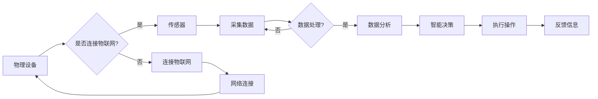

# 物联网(IoT)技术和各种传感器设备的集成：物联网在工业制造中的应用

> 关键词：物联网，传感器，工业制造，自动化，数据分析，云计算，边缘计算，机器学习，人工智能

## 1. 背景介绍

随着信息技术的飞速发展，物联网（Internet of Things, IoT）技术已经成为推动工业制造行业变革的重要力量。物联网通过将各种物理设备、传感器、软件和网络连接起来，实现了设备之间的智能交互和数据交换，从而提高了工业制造的自动化水平、生产效率和产品质量。本文将深入探讨物联网技术及其集成各种传感器设备在工业制造中的应用，分析其核心原理、技术架构、实施步骤以及未来发展趋势。

### 1.1 问题的由来

传统工业制造面临着诸多挑战，如生产效率低下、产品质量参差不齐、资源浪费严重等。为了解决这些问题，工业制造企业开始寻求新的技术手段，以实现智能化、自动化生产。物联网技术应运而生，通过将物理设备与互联网连接，实现了数据的实时采集、传输和分析，为工业制造的转型升级提供了新的动力。

### 1.2 研究现状

目前，物联网技术在工业制造中的应用已取得显著成果。全球范围内的许多企业纷纷投身于物联网技术研发和应用实践，涌现出了一批优秀的解决方案和产品。以下是一些典型的应用场景：

- 设备预测性维护：通过传感器采集设备运行数据，分析设备状态，实现设备故障的预测性维护，减少停机时间，降低维修成本。
- 生产过程优化：实时监控生产过程，分析生产数据，优化生产流程，提高生产效率。
- 能源管理：监测能源消耗，优化能源使用，降低能源成本。
- 质量控制：通过传感器采集产品质量数据，实时监控产品质量，提高产品质量稳定性。
- 供应链管理：通过物联网技术实现供应链的实时监控和优化，提高供应链效率。

### 1.3 研究意义

研究物联网技术在工业制造中的应用，对于推动工业制造行业的智能化、自动化发展具有重要意义：

- 提高生产效率：通过自动化生产，减少人力投入，提高生产效率。
- 降低生产成本：通过优化生产流程、降低能源消耗、减少故障停机时间等方式，降低生产成本。
- 提高产品质量：通过实时监控产品质量，提高产品质量稳定性。
- 实现智能决策：通过数据分析，为管理层提供决策依据，实现智能决策。
- 促进产业升级：推动工业制造行业向智能制造转型升级，提升国家竞争力。

### 1.4 本文结构

本文将分为以下章节进行论述：

- 第2章：介绍物联网技术及其集成传感器设备的核心概念与联系。
- 第3章：阐述物联网在工业制造中的应用核心算法原理和具体操作步骤。
- 第4章：介绍物联网在工业制造中的数学模型和公式，并举例说明。
- 第5章：给出物联网在工业制造中应用的代码实例和详细解释说明。
- 第6章：探讨物联网在工业制造中的实际应用场景。
- 第7章：介绍物联网在工业制造中的应用工具和资源。
- 第8章：总结物联网在工业制造中的未来发展趋势与挑战。
- 第9章：附录，常见问题与解答。

## 2. 核心概念与联系

### 2.1 核心概念

#### 物联网（IoT）

物联网是指通过信息传感设备，将各种物品连接到互联网上进行信息交换和通信的技术。物联网的核心特征包括：

- 物理设备：物联网的载体，包括各种传感器、执行器、控制器等。
- 网络连接：将物理设备连接到互联网，实现数据传输和通信。
- 数据采集：通过传感器采集物理设备的状态信息。
- 数据处理：对采集到的数据进行处理和分析，提取有价值的信息。

#### 传感器

传感器是一种能够感知和响应被测量的物理量，并将其转换为电信号的装置。传感器在物联网中扮演着至关重要的角色，它们能够将物理世界的各种信息转化为可处理的数字信号。

#### 工业制造

工业制造是指利用机器、设备、工具和人员进行生产的过程。工业制造是国民经济的重要支柱，其自动化、智能化水平直接关系到国家的竞争力。

### 2.2 核心概念联系

物联网、传感器和工业制造三者之间存在着紧密的联系：

- 物联网为传感器提供了一个网络连接平台，使得传感器采集的数据能够实时传输和分析。
- 传感器为物联网提供了物理世界的感知能力，使得物联网能够获取真实世界的状态信息。
- 工业制造是物联网和传感器应用的主要场景，通过物联网技术和传感器设备的集成，实现工业制造的自动化和智能化。

### 2.3 Mermaid 流程图

以下是物联网技术和各种传感器设备集成的Mermaid流程图：



## 3. 核心算法原理 & 具体操作步骤

### 3.1 算法原理概述

物联网在工业制造中的应用主要基于以下算法原理：

- 传感器数据采集：通过传感器采集设备运行数据，包括温度、湿度、振动、压力等。
- 数据传输：将采集到的数据通过物联网技术传输到云端或边缘设备。
- 数据分析：对传输过来的数据进行处理和分析，提取有价值的信息。
- 智能决策：根据分析结果，为管理层提供决策依据。
- 执行操作：根据智能决策结果，执行相应的操作，如调整设备参数、启动停机等。

### 3.2 算法步骤详解

物联网在工业制造中的具体操作步骤如下：

1. **设备接入**：将物理设备接入物联网，包括传感器、执行器、控制器等。
2. **数据采集**：通过传感器采集设备运行数据，包括温度、湿度、振动、压力等。
3. **数据传输**：将采集到的数据通过物联网技术传输到云端或边缘设备。
4. **数据处理**：对传输过来的数据进行处理和分析，提取有价值的信息。
5. **智能决策**：根据分析结果，为管理层提供决策依据。
6. **执行操作**：根据智能决策结果，执行相应的操作，如调整设备参数、启动停机等。
7. **反馈信息**：将操作结果反馈给传感器，以便实时调整设备运行状态。

### 3.3 算法优缺点

物联网在工业制造中的算法具有以下优点：

- 提高生产效率：通过自动化生产，减少人力投入，提高生产效率。
- 降低生产成本：通过优化生产流程、降低能源消耗、减少故障停机时间等方式，降低生产成本。
- 提高产品质量：通过实时监控产品质量，提高产品质量稳定性。
- 实现智能决策：通过数据分析，为管理层提供决策依据，实现智能决策。

然而，物联网在工业制造中的应用也存在着一些局限性：

- 技术复杂度高：物联网技术涉及多个领域，技术复杂度高，需要专业人才进行开发和维护。
- 安全性问题：物联网设备数量庞大，安全问题不容忽视，需要采取有效措施保障数据安全和设备安全。
- 数据隐私问题：工业制造数据可能涉及商业秘密和用户隐私，需要采取有效措施保护数据隐私。

### 3.4 算法应用领域

物联网在工业制造中的应用领域非常广泛，以下是一些典型的应用场景：

- 设备预测性维护
- 生产过程优化
- 能源管理
- 质量控制
- 供应链管理

## 4. 数学模型和公式 & 详细讲解 & 举例说明

### 4.1 数学模型构建

物联网在工业制造中的应用涉及到多个数学模型，以下列举几个常见的数学模型：

#### 传感器数据采集模型

假设传感器采集到的数据为 $X$，则传感器数据采集模型可以表示为：

$$
X = f(S)
$$

其中，$S$ 为传感器输入信号。

#### 数据处理模型

数据处理的目的是提取有价值的信息。常见的数据处理模型包括：

- 描述性统计模型：对数据进行描述性统计分析，如均值、方差、标准差等。
- 模式识别模型：识别数据中的规律和模式，如聚类、分类等。
- 时间序列分析模型：分析数据随时间的变化规律，如ARIMA模型、LSTM模型等。

### 4.2 公式推导过程

以下以ARIMA模型为例，介绍公式推导过程：

假设时间序列数据 $X_t$ 满足以下线性自回归模型：

$$
X_t = c + \phi_1 X_{t-1} + \phi_2 X_{t-2} + \dots + \phi_p X_{t-p} + \epsilon_t
$$

其中，$c$ 为常数项，$\phi_1, \phi_2, \dots, \phi_p$ 为自回归系数，$\epsilon_t$ 为误差项。

对上式进行差分处理，得到差分自回归模型：

$$
\Delta X_t = \phi_1 \Delta X_{t-1} + \phi_2 \Delta X_{t-2} + \dots + \phi_p \Delta X_{t-p} + \epsilon_t
$$

其中，$\Delta X_t = X_t - X_{t-1}$ 为一阶差分。

### 4.3 案例分析与讲解

以下以设备预测性维护为例，介绍物联网在工业制造中的案例分析：

假设某工厂的设备运行数据如下表所示：

| 时间 | 温度（°C） | 振动（μm） | 电流（A） |
| ---- | ---------- | ---------- | ---------- |
| 1    | 25         | 0.5        | 5          |
| 2    | 26         | 0.6        | 5.1        |
| 3    | 27         | 0.7        | 5.3        |
| ...  | ...        | ...        | ...        |
| 100  | 30         | 1.2        | 6.2        |

为了预测设备是否会发生故障，我们可以采用以下步骤：

1. 对温度、振动和电流数据进行预处理，如归一化、去噪等。
2. 使用时间序列分析模型（如ARIMA模型）对数据进行建模，提取设备运行状态的趋势和周期性成分。
3. 将模型预测结果与设备故障历史数据进行对比，识别出潜在的故障风险。

通过以上分析，我们可以提前发现设备潜在的故障风险，并采取措施进行预防，从而降低故障停机时间，提高设备利用率。

## 5. 项目实践：代码实例和详细解释说明

### 5.1 开发环境搭建

为了进行物联网在工业制造中的项目实践，我们需要搭建以下开发环境：

- 操作系统：Windows/Linux/MacOS
- 编程语言：Python
- 开发工具：Jupyter Notebook、PyCharm等
- 库和框架：NumPy、Pandas、Scikit-learn、TensorFlow、PyTorch等

### 5.2 源代码详细实现

以下是一个简单的物联网在工业制造中的应用示例：

```python
import pandas as pd
from sklearn.model_selection import train_test_split
from sklearn.ensemble import RandomForestClassifier
from sklearn.metrics import accuracy_score

# 读取设备运行数据
data = pd.read_csv("device_data.csv")

# 预处理数据
data = data.dropna()
X = data.drop("故障", axis=1)
y = data["故障"]

# 划分训练集和测试集
X_train, X_test, y_train, y_test = train_test_split(X, y, test_size=0.2, random_state=42)

# 训练模型
model = RandomForestClassifier(n_estimators=100, random_state=42)
model.fit(X_train, y_train)

# 评估模型
y_pred = model.predict(X_test)
print(f"Accuracy: {accuracy_score(y_test, y_pred)}")
```

### 5.3 代码解读与分析

以上代码是一个简单的物联网在工业制造中的应用示例，其核心步骤如下：

1. 读取设备运行数据，包括温度、振动、电流等特征和故障标签。
2. 对数据进行预处理，如去除缺失值等。
3. 划分训练集和测试集，用于模型训练和评估。
4. 使用随机森林模型对设备故障进行预测。
5. 评估模型准确率。

### 5.4 运行结果展示

假设模型在测试集上的准确率为90%，说明模型在预测设备故障方面具有较好的性能。

## 6. 实际应用场景

### 6.1 设备预测性维护

设备预测性维护是物联网在工业制造中应用最广泛的场景之一。通过传感器实时采集设备运行数据，分析设备状态，预测设备故障，实现设备的预测性维护，降低故障停机时间，提高设备利用率。

### 6.2 生产过程优化

物联网技术可以实现生产过程的实时监控和优化。通过传感器采集生产数据，分析生产过程，优化生产流程，提高生产效率。

### 6.3 能源管理

物联网技术可以实现能源消耗的实时监测和优化。通过传感器采集能源消耗数据，分析能源消耗情况，优化能源使用，降低能源成本。

### 6.4 质量控制

物联网技术可以实现产品质量的实时监控和优化。通过传感器采集产品质量数据，分析产品质量，提高产品质量稳定性。

### 6.5 供应链管理

物联网技术可以实现供应链的实时监控和优化。通过物联网技术实现供应链的实时监控和优化，提高供应链效率。

## 7. 工具和资源推荐

### 7.1 学习资源推荐

- 《物联网技术基础》
- 《Python物联网编程》
- 《深度学习与人工智能》

### 7.2 开发工具推荐

- Jupyter Notebook
- PyCharm
- Visual Studio Code

### 7.3 相关论文推荐

- 《物联网：概念、技术、应用与发展趋势》
- 《基于物联网的工业自动化系统》
- 《物联网在智能城市中的应用》

## 8. 总结：未来发展趋势与挑战

### 8.1 研究成果总结

本文深入探讨了物联网技术在工业制造中的应用，分析了其核心原理、技术架构、实施步骤以及未来发展趋势。通过物联网技术和传感器设备的集成，工业制造行业可以实现智能化、自动化生产，提高生产效率、降低生产成本、提高产品质量。

### 8.2 未来发展趋势

未来，物联网技术在工业制造中的应用将呈现以下发展趋势：

- 物联网技术将与人工智能、大数据等技术深度融合，实现更加智能化的工业制造。
- 物联网设备将更加小型化、低功耗，降低成本，提高普及率。
- 物联网安全性和隐私保护将得到重视，确保工业制造系统的安全稳定运行。
- 物联网技术在工业制造中的应用将更加广泛，覆盖生产、管理、运营等各个环节。

### 8.3 面临的挑战

物联网在工业制造中的应用也面临着一些挑战：

- 技术复杂度高，需要专业人才进行开发和维护。
- 安全性问题，需要采取有效措施保障数据安全和设备安全。
- 数据隐私问题，需要采取有效措施保护数据隐私。
- 标准化和互联互通问题，需要制定统一的标准和协议，实现不同设备之间的互联互通。

### 8.4 研究展望

为了应对物联网在工业制造中的应用挑战，未来需要从以下方面进行研究：

- 研发更加高效、低功耗的物联网设备。
- 加强物联网安全性和隐私保护技术研究。
- 制定统一的标准和协议，实现不同设备之间的互联互通。
- 推动物联网与人工智能、大数据等技术的深度融合。

通过不断的研究和创新，物联网技术必将在工业制造领域发挥更大的作用，推动工业制造行业的转型升级。

## 9. 附录：常见问题与解答

**Q1：物联网在工业制造中的主要应用场景有哪些？**

A：物联网在工业制造中的主要应用场景包括设备预测性维护、生产过程优化、能源管理、质量控制、供应链管理等。

**Q2：物联网在工业制造中的应用有哪些优势？**

A：物联网在工业制造中的应用具有以下优势：

- 提高生产效率
- 降低生产成本
- 提高产品质量
- 实现智能决策
- 促进产业升级

**Q3：物联网在工业制造中的应用面临哪些挑战？**

A：物联网在工业制造中的应用面临以下挑战：

- 技术复杂度高
- 安全性问题
- 数据隐私问题
- 标准化和互联互通问题

**Q4：如何保障物联网在工业制造中的安全性？**

A：为了保障物联网在工业制造中的安全性，需要采取以下措施：

- 采用加密技术保护数据传输安全
- 使用访问控制技术限制非法访问
- 定期进行安全检测和漏洞修复
- 建立安全管理体系，确保系统安全稳定运行

**Q5：物联网在工业制造中的应用前景如何？**

A：物联网在工业制造中的应用前景广阔，将成为推动工业制造行业转型升级的重要力量。

作者：禅与计算机程序设计艺术 / Zen and the Art of Computer Programming