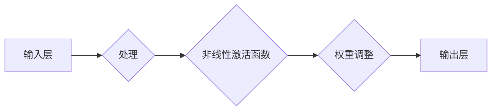

# 神经网络：人类与机器的共存

> 关键词：神经网络，深度学习，人工智能，机器学习，人类智能，认知科学，智能共生

## 1. 背景介绍

自20世纪40年代香农提出信息论，50年代阿兰·图灵提出图灵测试，人工智能领域逐渐成为计算机科学的前沿。60年代，基于多层的神经网络模型被提出，但由于计算能力的限制和理论上的难题，神经网络研究一度陷入低谷。直到80年代，随着计算机硬件和软件的发展，以及反向传播算法的提出，神经网络研究迎来了春天。21世纪初，深度学习技术的发展使得神经网络在图像识别、语音识别等领域取得了突破性进展，人工智能开始进入一个崭新的时代。本文将探讨神经网络的原理、发展历程、应用场景以及未来发展趋势，并展望人类与机器的共存模式。

## 2. 核心概念与联系

### 2.1 神经网络原理

神经网络是一种模拟人脑神经元结构和功能的计算模型。它由大量的神经元按照一定的拓扑结构连接而成，每个神经元负责处理输入信息，并通过权重传递给其他神经元。神经网络通过学习大量的输入输出数据对，不断调整神经元之间的连接权重，从而实现对输入数据的分类、回归等任务。

#### Mermaid 流程图



### 2.2 神经网络架构

神经网络架构主要包括以下几部分：

- **输入层**：接收外部输入信息。
- **隐藏层**：对输入信息进行特征提取和组合。
- **输出层**：输出最终的预测结果。

隐藏层的数量和神经元数量可以根据具体任务进行调整。

### 2.3 神经网络与机器学习、深度学习的联系

机器学习是人工智能的一个分支，研究如何让计算机从数据中学习并作出决策。神经网络是机器学习的一种重要算法，它通过模拟人脑神经元结构和功能，实现对数据的建模和分析。

深度学习是机器学习的一个子领域，它使用具有多层结构的神经网络，通过学习大量的数据进行特征提取和分类。深度学习是神经网络算法在人工智能领域的最新发展。

## 3. 核心算法原理 & 具体操作步骤

### 3.1 算法原理概述

神经网络的核心算法包括：

- **前向传播**：将输入数据从输入层传播到输出层，得到预测结果。
- **反向传播**：根据预测结果与真实标签之间的差异，计算损失函数，并通过反向传播算法更新神经元之间的权重。

### 3.2 算法步骤详解

1. **初始化**：初始化神经元权重和偏置。
2. **前向传播**：将输入数据输入到神经网络中，经过多层计算，得到最终的预测结果。
3. **计算损失**：根据预测结果与真实标签之间的差异，计算损失函数。
4. **反向传播**：根据损失函数，通过反向传播算法更新神经元权重和偏置。
5. **迭代训练**：重复步骤2-4，直到满足预设的停止条件。

### 3.3 算法优缺点

#### 优点

- **强大的特征学习能力**：神经网络能够从大量数据中学习到复杂的特征，对非线性问题具有较强的表达能力。
- **高度并行计算**：神经网络可以并行计算，提高计算效率。
- **可解释性**：神经网络可以通过可视化方式直观地展示其学习到的特征。

#### 缺点

- **计算复杂度高**：神经网络需要大量的计算资源。
- **参数调优困难**：神经网络的参数数量较多，参数调优过程较为复杂。
- **泛化能力有限**：神经网络容易过拟合，泛化能力有限。

### 3.4 算法应用领域

神经网络在以下领域取得了显著的应用成果：

- **图像识别**：如人脸识别、物体识别等。
- **语音识别**：如语音转文字、语音识别等。
- **自然语言处理**：如机器翻译、情感分析等。
- **医学诊断**：如疾病预测、影像分析等。
- **金融领域**：如风险控制、欺诈检测等。

## 4. 数学模型和公式 & 详细讲解 & 举例说明

### 4.1 数学模型构建

神经网络的主要数学模型包括：

- **激活函数**：如Sigmoid、ReLU、Tanh等。
- **权重和偏置**：连接神经元的权重和偏置。
- **损失函数**：如均方误差、交叉熵等。

### 4.2 公式推导过程

以下以Sigmoid激活函数为例，进行公式推导。

#### Sigmoid激活函数

Sigmoid激活函数定义为：

$$
f(x) = \frac{1}{1+e^{-x}}
$$

其导数为：

$$
f'(x) = f(x)(1-f(x))
$$

### 4.3 案例分析与讲解

以下以一个简单的二分类问题为例，介绍神经网络的训练过程。

假设输入特征为 $x=(x_1, x_2)$，标签为 $y \in \{0, 1\}$。我们使用一个包含一层隐藏层的神经网络进行分类。

1. **初始化**：初始化权重 $w_1, w_2, w_3$ 和偏置 $b_1, b_2, b_3$。
2. **前向传播**：
   - 输入层到隐藏层的输出为：$h_1 = w_1x_1 + b_1, h_2 = w_2x_2 + b_2$。
   - 隐藏层到输出层的输出为：$z = \frac{1}{1+e^{-(h_1 + h_2 + b_3)}}$。
3. **计算损失**：
   - 使用交叉熵损失函数：$L = -[y\log(z) + (1-y)\log(1-z)]$。
4. **反向传播**：
   - 计算梯度：$\frac{\partial L}{\partial z} = z(1-z), \frac{\partial L}{\partial h_1} = \frac{\partial L}{\partial z}\frac{\partial z}{\partial h_1} = z(1-z)w_1$, $\frac{\partial L}{\partial h_2} = \frac{\partial L}{\partial z}\frac{\partial z}{\partial h_2} = z(1-z)w_2$。
   - 更新权重和偏置：$w_1 \leftarrow w_1 - \eta \frac{\partial L}{\partial w_1}, w_2 \leftarrow w_2 - \eta \frac{\partial L}{\partial w_2}, b_1 \leftarrow b_1 - \eta \frac{\partial L}{\partial b_1}, b_2 \leftarrow b_2 - \eta \frac{\partial L}{\partial b_2}$。
5. **迭代训练**：重复步骤2-4，直到满足预设的停止条件。

通过迭代训练，神经网络可以学习到输入特征与标签之间的关系，并最终实现对新的输入数据的分类。

## 5. 项目实践：代码实例和详细解释说明

### 5.1 开发环境搭建

1. 安装Python：从Python官网下载并安装Python。
2. 安装TensorFlow或PyTorch：分别安装TensorFlow或PyTorch库。

### 5.2 源代码详细实现

以下使用PyTorch实现一个简单的二分类神经网络。

```python
import torch
import torch.nn as nn
import torch.optim as optim

# 定义模型
class NeuralNetwork(nn.Module):
    def __init__(self):
        super(NeuralNetwork, self).__init__()
        self.fc1 = nn.Linear(2, 10)
        self.fc2 = nn.Linear(10, 1)

    def forward(self, x):
        x = torch.relu(self.fc1(x))
        x = torch.sigmoid(self.fc2(x))
        return x

# 初始化模型、损失函数和优化器
model = NeuralNetwork()
criterion = nn.BCELoss()
optimizer = optim.SGD(model.parameters(), lr=0.01)

# 训练数据
x_train = torch.tensor([[0, 0], [0, 1], [1, 0], [1, 1]], requires_grad=False)
y_train = torch.tensor([0, 1, 0, 1], requires_grad=False)

# 训练模型
for epoch in range(100):
    optimizer.zero_grad()
    outputs = model(x_train)
    loss = criterion(outputs, y_train)
    loss.backward()
    optimizer.step()
    if (epoch + 1) % 10 == 0:
        print(f'Epoch {epoch+1}, Loss: {loss.item()}')

# 测试模型
x_test = torch.tensor([[0, 0], [1, 1]], requires_grad=False)
outputs = model(x_test)
print(f'Predictions: {outputs}')
```

### 5.3 代码解读与分析

1. **导入库**：导入PyTorch相关库。
2. **定义模型**：定义一个包含一层隐藏层的神经网络。
3. **初始化模型、损失函数和优化器**：初始化神经网络模型、损失函数和优化器。
4. **训练数据**：准备训练数据。
5. **训练模型**：迭代训练神经网络，更新模型参数。
6. **测试模型**：使用测试数据测试神经网络性能。

通过上述代码，我们可以训练一个简单的二分类神经网络，并使用测试数据验证其性能。

## 6. 实际应用场景

### 6.1 图像识别

图像识别是神经网络应用最广泛的领域之一。例如，人脸识别、物体识别、图像分割等。

### 6.2 语音识别

语音识别是将语音信号转换为文本的过程。例如，语音转文字、语音助手等。

### 6.3 自然语言处理

自然语言处理是研究计算机如何理解和生成人类语言的技术。例如，机器翻译、情感分析、文本分类等。

### 6.4 医学诊断

医学诊断是利用神经网络对医学图像进行分析，从而辅助医生进行诊断。例如，影像分析、疾病预测等。

### 6.5 金融领域

金融领域是神经网络应用的重要领域，例如，风险控制、欺诈检测、投资策略等。

## 7. 工具和资源推荐

### 7.1 学习资源推荐

- 《深度学习》
- 《神经网络与深度学习》
- 《动手学深度学习》

### 7.2 开发工具推荐

- TensorFlow
- PyTorch

### 7.3 相关论文推荐

- "A Learning Algorithm for Continually Running Fully Connected Neural Networks"
- "Rectifier Nonlinearities Improve Convergence Properties of Energy-Based Learning"
- "ImageNet Classification with Deep Convolutional Neural Networks"

## 8. 总结：未来发展趋势与挑战

### 8.1 研究成果总结

神经网络作为人工智能领域的重要技术，在图像识别、语音识别、自然语言处理等领域取得了显著的成果。深度学习技术的出现，使得神经网络的性能得到了进一步提升。

### 8.2 未来发展趋势

- **更大规模的网络模型**：随着计算能力的提升，更大规模的网络模型将被研究和应用。
- **更有效的训练方法**：研究更有效的训练方法和优化算法，提高神经网络训练效率。
- **更多应用领域**：神经网络将在更多领域得到应用，如生物信息学、物理学、经济学等。

### 8.3 面临的挑战

- **计算复杂度**：神经网络计算复杂度高，需要大量的计算资源。
- **可解释性**：神经网络的内部机制复杂，难以解释其决策过程。
- **数据安全问题**：神经网络可能存在隐私泄露、数据歧视等问题。

### 8.4 研究展望

- **新型神经网络架构**：研究更高效的神经网络架构，降低计算复杂度，提高性能。
- **可解释性研究**：提高神经网络的可解释性，使其决策过程更加透明。
- **安全性研究**：保障神经网络的数据安全，防止隐私泄露和歧视现象。

神经网络作为人工智能领域的重要技术，将在未来发挥越来越重要的作用。通过不断的研究和创新，神经网络将为人类带来更加美好的未来。

## 9. 附录：常见问题与解答

**Q1：神经网络与人工智能的区别是什么？**

A：人工智能是一个广泛的领域，包括多个子领域，如机器学习、自然语言处理、计算机视觉等。神经网络是机器学习的一个子领域，它通过模拟人脑神经元结构和功能，实现对数据的建模和分析。

**Q2：神经网络是如何进行学习的？**

A：神经网络通过反向传播算法，根据预测结果与真实标签之间的差异，不断调整神经元之间的连接权重，从而实现对输入数据的分类、回归等任务。

**Q3：神经网络在哪些领域取得了显著的应用成果？**

A：神经网络在图像识别、语音识别、自然语言处理、医学诊断、金融领域等领域取得了显著的应用成果。

**Q4：神经网络有哪些优缺点？**

A：神经网络的优点是强大的特征学习能力、高度并行计算和可解释性。缺点是计算复杂度高、参数调优困难、泛化能力有限。

**Q5：神经网络未来发展趋势是什么？**

A：神经网络未来发展趋势包括更大规模的网络模型、更有效的训练方法、更多应用领域等。

---

作者：禅与计算机程序设计艺术 / Zen and the Art of Computer Programming