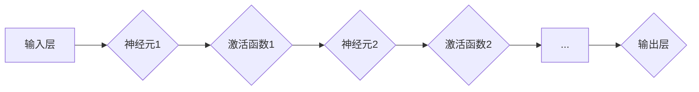

# 神经网络：机器学习的新范式

> 关键词：神经网络，机器学习，深度学习，人工神经网络，神经元，激活函数，反向传播，深度学习框架

## 1. 背景介绍

自20世纪50年代以来，机器学习领域经历了多次重大变革。从最初的符号主义到基于决策树的模型，再到支持向量机、贝叶斯方法等，每一种方法都在一定程度上推动了机器学习的发展。然而，直到20世纪80年代末，神经网络作为一种强大的机器学习范式，才逐渐崭露头角，为机器学习带来了新的活力和方向。

### 1.1 问题的由来

在传统机器学习方法中，模型的复杂度和可解释性往往是相互矛盾的。为了提高模型的复杂度以处理复杂的非线性问题，需要大量的特征工程和参数调优，这使得模型难以解释。而神经网络的出现，为机器学习提供了一种新的解决方案，它通过模仿人脑的神经元结构，能够处理复杂的非线性关系，并且具有强大的泛化能力。

### 1.2 研究现状

随着计算能力的提升和大数据的涌现，神经网络在图像识别、语音识别、自然语言处理等领域取得了显著的成果。特别是在2012年，AlexNet在ImageNet图像识别竞赛中取得的突破性成绩，标志着深度学习时代的到来。

### 1.3 研究意义

神经网络作为一种强大的机器学习范式，具有以下重要意义：

- 提高模型复杂度，处理复杂非线性问题。
- 减少人工特征工程，自动化特征提取。
- 增强模型的泛化能力，提高模型在未知数据上的表现。
- 促进跨学科交叉融合，推动人工智能技术的发展。

### 1.4 本文结构

本文将分为以下几个部分：

- 介绍神经网络的背景和核心概念。
- 阐述神经网络的原理和具体操作步骤。
- 分析神经网络的数学模型和公式。
- 展示神经网络的代码实例和实际应用。
- 探讨神经网络的未来发展趋势和挑战。

## 2. 核心概念与联系

### 2.1 核心概念

- 神经元：神经网络的基本单元，负责接收输入、计算输出和传递信号。
- 神经网络：由多个神经元组成的层次化结构，通过前向传播和反向传播进行信息传递和参数更新。
- 激活函数：用于引入非线性因素，使神经网络能够学习复杂的非线性关系。
- 反向传播：一种优化算法，通过计算损失函数对参数的梯度来更新网络权重。
- 深度学习：一种特殊的神经网络结构，层数通常超过三层。

### 2.2 联系

神经网络是由多个神经元组成的层次化结构，每个神经元都通过前向传播和反向传播与相邻的神经元进行信息传递。激活函数用于引入非线性因素，使神经网络能够学习复杂的非线性关系。反向传播算法通过计算损失函数对参数的梯度来更新网络权重，从而优化网络性能。



## 3. 核心算法原理 & 具体操作步骤

### 3.1 算法原理概述

神经网络通过前向传播和反向传播两个过程来学习和优化模型。

- **前向传播**：输入数据通过输入层传递到隐含层，再逐层传递到输出层，最终得到模型的输出结果。
- **反向传播**：根据实际输出和期望输出的差异，计算损失函数，并反向传播梯度，更新网络权重和偏置。

### 3.2 算法步骤详解

1. 初始化网络参数：随机初始化网络的权重和偏置。
2. 前向传播：将输入数据传递到网络，计算输出结果。
3. 计算损失：根据实际输出和期望输出的差异，计算损失函数。
4. 反向传播：计算损失函数对网络参数的梯度，并更新网络权重和偏置。
5. 重复步骤2-4，直到满足预设的停止条件。

### 3.3 算法优缺点

- 优点：
  - 能够学习复杂的非线性关系。
  - 自动化特征提取，减少人工特征工程。
  - 强大的泛化能力。
- 缺点：
  - 计算复杂度较高，需要大量的计算资源。
  - 模型可解释性较差。
  - 需要大量的训练数据。

### 3.4 算法应用领域

- 图像识别
- 语音识别
- 自然语言处理
- 机器人控制
- 金融预测

## 4. 数学模型和公式 & 详细讲解 & 举例说明

### 4.1 数学模型构建

神经网络的数学模型主要基于以下公式：

- 前向传播：

$$
\text{output}_i = \text{激活函数}(\text{weight} \cdot \text{input} + \text{bias})
$$

- 反向传播：

$$
\Delta w_{ij} = \alpha \cdot \text{output}_i \cdot \text{input}_j \cdot \text{error}_j
$$

$$
\Delta b_i = \alpha \cdot \text{error}_i
$$

其中，$\text{output}_i$ 表示第 $i$ 个神经元的输出，$\text{input}$ 表示输入数据，$\text{weight}$ 和 $\text{bias}$ 分别表示权重和偏置，$\text{激活函数}$ 表示激活函数，$\alpha$ 表示学习率，$\text{error}_i$ 表示第 $i$ 个神经元的误差。

### 4.2 公式推导过程

以下以单层感知机为例，推导前向传播和反向传播的公式。

- 前向传播：

$$
\text{output}_i = \text{激活函数}(\text{weight} \cdot \text{input} + \text{bias})
$$

其中，$\text{激活函数}$ 通常采用Sigmoid、ReLU或Tanh函数。

- 反向传播：

假设我们有以下目标函数：

$$
\text{loss} = \frac{1}{2} \sum_{i=1}^N (\text{output}_i - \text{label}_i)^2
$$

其中，$\text{label}_i$ 表示第 $i$ 个样本的标签。

则损失函数关于 $\text{weight}$ 和 $\text{bias}$ 的梯度为：

$$
\frac{\partial \text{loss}}{\partial \text{weight}} = \sum_{i=1}^N (\text{output}_i - \text{label}_i) \cdot \text{input}_i
$$

$$
\frac{\partial \text{loss}}{\partial \text{bias}} = \sum_{i=1}^N (\text{output}_i - \text{label}_i)
$$

根据链式法则，我们可以得到以下梯度：

$$
\frac{\partial \text{loss}}{\partial \text{weight}} = \text{output}_i - \text{label}_i
$$

$$
\frac{\partial \text{loss}}{\partial \text{bias}} = \text{output}_i - \text{label}_i
$$

将这些梯度代入到反向传播的公式中，即可得到：

$$
\Delta w_{ij} = \alpha \cdot \text{output}_i \cdot \text{input}_j \cdot \text{error}_j
$$

$$
\Delta b_i = \alpha \cdot \text{error}_i
$$

### 4.3 案例分析与讲解

以下以一个简单的神经网络为例，讲解神经网络的实现过程。

假设我们有一个包含一个输入层、一个隐含层和一个输出层的神经网络，用于二分类任务。

- 输入层：一个神经元，输入特征为 $x_1$。
- 隐含层：一个神经元，激活函数为Sigmoid函数。
- 输出层：一个神经元，激活函数为Sigmoid函数。

首先，我们需要定义神经网络的结构：

```python
import torch
import torch.nn as nn

class SimpleNet(nn.Module):
    def __init__(self):
        super(SimpleNet, self).__init__()
        self.fc1 = nn.Linear(1, 1)
        self.sigmoid = nn.Sigmoid()

    def forward(self, x):
        x = self.fc1(x)
        x = self.sigmoid(x)
        return x
```

然后，我们需要定义损失函数和优化器：

```python
criterion = nn.BCELoss()
optimizer = torch.optim.SGD(net.parameters(), lr=0.01)
```

接下来，我们进行训练：

```python
for epoch in range(100):
    for x, y in train_loader:
        optimizer.zero_grad()
        output = net(x)
        loss = criterion(output, y)
        loss.backward()
        optimizer.step()
    print(f'Epoch {epoch+1}, Loss: {loss.item()}')
```

最后，我们进行测试：

```python
net.eval()
with torch.no_grad():
    for x, y in test_loader:
        output = net(x)
        loss = criterion(output, y)
        print(f'Test Loss: {loss.item()}')
```

以上代码展示了如何使用PyTorch实现一个简单的神经网络，并进行训练和测试。在实际应用中，我们可以根据具体任务的需求，调整网络结构、激活函数和优化器等参数，以获得更好的效果。

## 5. 项目实践：代码实例和详细解释说明

### 5.1 开发环境搭建

在进行神经网络项目实践之前，我们需要准备好开发环境。以下是使用Python进行神经网络开发的典型环境配置流程：

1. 安装Anaconda：从官网下载并安装Anaconda，用于创建独立的Python环境。

2. 创建并激活虚拟环境：
```bash
conda create -n pytorch-env python=3.8 
conda activate pytorch-env
```

3. 安装PyTorch：根据CUDA版本，从官网获取对应的安装命令。例如：
```bash
conda install pytorch torchvision torchaudio cudatoolkit=11.1 -c pytorch -c conda-forge
```

4. 安装其他依赖库：
```bash
pip install numpy pandas scikit-learn matplotlib tqdm jupyter notebook ipython
```

完成上述步骤后，即可在`pytorch-env`环境中开始神经网络项目实践。

### 5.2 源代码详细实现

下面我们以一个简单的线性回归任务为例，展示如何使用PyTorch实现神经网络。

```python
import torch
import torch.nn as nn
import torch.optim as optim
import torch.nn.functional as F

# 定义神经网络结构
class LinearNet(nn.Module):
    def __init__(self):
        super(LinearNet, self).__init__()
        self.fc1 = nn.Linear(1, 1)  # 输入层到隐含层

    def forward(self, x):
        x = self.fc1(x)
        return x

# 创建网络模型、损失函数和优化器
net = LinearNet()
criterion = nn.MSELoss()
optimizer = optim.SGD(net.parameters(), lr=0.01)

# 创建数据集
x_train = torch.linspace(-1, 1, steps=100)
y_train = x_train**2 + 0.1 * torch.randn(100)

# 训练模型
for epoch in range(1000):
    optimizer.zero_grad()
    y_pred = net(x_train)
    loss = criterion(y_pred, y_train)
    loss.backward()
    optimizer.step()
    if (epoch + 1) % 100 == 0:
        print(f'Epoch {epoch + 1}, Loss: {loss.item()}')

# 测试模型
with torch.no_grad():
    y_pred = net(x_train)
    loss = criterion(y_pred, y_train)
    print(f'Test Loss: {loss.item()}')
```

以上代码展示了如何使用PyTorch实现一个线性回归任务。首先，我们定义了一个简单的神经网络结构，包含一个线性层。然后，我们创建数据集、损失函数和优化器，开始训练模型。最后，我们进行测试，评估模型的性能。

### 5.3 代码解读与分析

- `LinearNet` 类：定义了神经网络的层结构，包含一个线性层。
- `forward` 方法：实现神经网络的前向传播过程。
- 损失函数：使用均方误差损失函数评估模型预测值和真实值之间的差异。
- 优化器：使用随机梯度下降(SGD)优化算法更新模型参数。
- 训练过程：通过循环迭代，不断更新模型参数，使损失函数最小化。

### 5.4 运行结果展示

运行上述代码后，我们可以在控制台看到模型训练过程中的损失值变化，并在测试阶段打印出测试损失值。通过观察损失值的变化，我们可以判断模型的收敛情况。

## 6. 实际应用场景

神经网络在各个领域都有广泛的应用，以下列举几个典型的应用场景：

### 6.1 图像识别

神经网络在图像识别领域取得了显著的成果，如卷积神经网络(Convolutional Neural Network, CNN)在图像分类、目标检测、人脸识别等领域都取得了突破性的进展。

### 6.2 语音识别

神经网络在语音识别领域也得到了广泛的应用，如深度神经网络(Deep Neural Network, DNN)、循环神经网络(Recurrent Neural Network, RNN)和长短期记忆网络(Long Short-Term Memory, LSTM)等，使得语音识别的准确率得到了大幅提升。

### 6.3 自然语言处理

神经网络在自然语言处理领域也取得了巨大的突破，如循环神经网络(Recurrent Neural Network, RNN)、长短期记忆网络(Long Short-Term Memory, LSTM)和Transformer等，使得机器翻译、情感分析、问答系统等任务取得了显著的进展。

### 6.4 机器人控制

神经网络在机器人控制领域也有广泛的应用，如深度强化学习(Deep Reinforcement Learning, DRL)等，使得机器人能够通过学习实现更加智能的控制策略。

### 6.5 金融预测

神经网络在金融预测领域也有广泛的应用，如时间序列预测、风险评估、投资组合优化等，可以帮助金融机构提高决策效率和风险管理水平。

## 7. 工具和资源推荐

### 7.1 学习资源推荐

- 《神经网络与深度学习》：邱锡鹏著，详细介绍了神经网络的原理和应用。
- 《深度学习》：Goodfellow、Bengio和Courville著，是深度学习领域的经典教材。
- 《动手学深度学习》：花书，提供了丰富的深度学习实战案例。

### 7.2 开发工具推荐

- PyTorch：易于上手、功能强大的深度学习框架。
- TensorFlow：由Google主导开发的深度学习框架。
- Keras：基于TensorFlow的Python深度学习库，适合快速原型开发。

### 7.3 相关论文推荐

- A Simple Introduction to Neural Networks：介绍神经网络的基本概念和原理。
- Deep Learning: Goodfellow, Bengio, Courville著，是深度学习领域的经典教材。
- A Theoretically Grounded Application of Dropout in Recurrent Neural Networks：介绍Dropout技术在循环神经网络中的应用。

## 8. 总结：未来发展趋势与挑战

### 8.1 研究成果总结

本文从背景介绍、核心概念、算法原理、数学模型、项目实践、实际应用场景等方面，全面介绍了神经网络这一机器学习的新范式。通过本文的阅读，读者可以了解到神经网络的基本原理、实现方法和应用场景，为后续的学习和实践打下坚实的基础。

### 8.2 未来发展趋势

随着计算能力的提升和大数据的涌现，神经网络在未来将呈现以下发展趋势：

- 模型结构更加复杂：为了处理更加复杂的任务，神经网络的结构将变得更加复杂，如Transformer等。
- 计算效率更高：为了满足实际应用的需求，神经网络的计算效率将得到进一步提高，如模型压缩、量化等技术。
- 可解释性更强：为了提高模型的可信度和可靠性，神经网络的可解释性将得到加强，如注意力机制、可视化等技术。
- 跨学科交叉融合：神经网络将与其他学科进行交叉融合，如心理学、认知科学等，为人工智能的发展提供新的思路。

### 8.3 面临的挑战

尽管神经网络取得了巨大的进展，但仍面临着以下挑战：

- 计算资源消耗巨大：神经网络训练和推理过程需要大量的计算资源，如何降低计算资源消耗是一个重要的挑战。
- 模型可解释性差：神经网络的决策过程难以解释，如何提高模型的可解释性是一个重要的挑战。
- 数据安全和隐私保护：神经网络在处理大量数据时，如何保证数据的安全和隐私是一个重要的挑战。

### 8.4 研究展望

为了应对上述挑战，未来的研究需要在以下几个方面进行探索：

- 设计更加高效的神经网络结构，降低计算资源消耗。
- 开发更加可解释的神经网络模型，提高模型的可信度和可靠性。
- 研究数据安全和隐私保护技术，确保神经网络应用的安全和可靠。

总之，神经网络作为一种强大的机器学习范式，将在未来的人工智能发展中扮演越来越重要的角色。通过不断的研究和创新，神经网络技术将为人类社会带来更多惊喜和变革。

## 9. 附录：常见问题与解答

**Q1：神经网络和深度学习有什么区别？**

A：神经网络是深度学习的一种模型，而深度学习是一种机器学习的方法。简单来说，深度学习是神经网络的一个子集。

**Q2：如何选择合适的神经网络结构？**

A：选择合适的神经网络结构需要根据具体任务的需求进行分析。一般来说，需要考虑以下因素：

- 数据类型：不同的数据类型需要不同的神经网络结构。
- 任务类型：不同的任务类型需要不同的神经网络结构。
- 数据规模：不同的数据规模需要不同的神经网络结构。

**Q3：神经网络训练过程中如何防止过拟合？**

A：防止过拟合的方法有很多，以下是一些常见的方法：

- 数据增强：通过扩充数据集来增加模型的泛化能力。
- 正则化：通过在损失函数中添加正则化项来惩罚模型的复杂度。
- Dropout：在训练过程中随机丢弃一部分神经元的输出，减少模型对特定输入的依赖。
- Early Stopping：在验证集上评估模型性能，当性能不再提升时停止训练。

**Q4：如何提高神经网络的计算效率？**

A：提高神经网络的计算效率的方法有很多，以下是一些常见的方法：

- 模型压缩：通过减少模型参数量和计算复杂度来降低计算资源消耗。
- 量化：将浮点数参数转换为低精度整数来降低计算资源消耗。
- 并行计算：通过并行计算来加速模型的训练和推理过程。

**Q5：神经网络在应用中遇到困难时，应该怎么办？**

A：当神经网络在应用中遇到困难时，可以尝试以下方法：

- 调整模型结构：尝试不同的神经网络结构，看哪种结构更适合该任务。
- 调整超参数：调整学习率、批大小、迭代次数等超参数，看哪种参数组合更适合该任务。
- 数据清洗：检查数据质量，确保数据没有错误或噪声。
- 使用更多的数据：尝试增加训练数据量，看是否能提高模型的性能。

作者：禅与计算机程序设计艺术 / Zen and the Art of Computer Programming