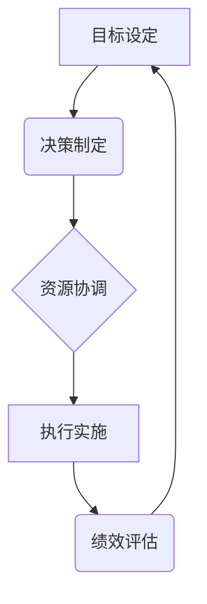

> 管理艺术, 彼得·德鲁克, 管理实践, 企业领导力, 组织效能, 创新管理, 效率提升, 战略规划

# 管理的艺术：德鲁克的洞见

## 1. 背景介绍

管理，作为一门实践的艺术，自古以来就是人类文明进步的重要推动力。从古埃及的金字塔建造到现代企业的全球化扩张，管理始终扮演着关键角色。在信息时代，随着科技的高速发展和商业环境的剧烈变化，管理的重要性愈发凸显。而彼得·德鲁克，作为现代管理学之父，他的理论和方法论对世界各地的企业和组织产生了深远的影响。

本文将以德鲁克的管理思想为核心，探讨管理艺术的精髓，分析其应用领域，展望未来发展趋势，并探讨面临的挑战。

## 2. 核心概念与联系

### 2.1 管理的本质

管理的本质是激发和协调资源以实现目标。德鲁克认为，管理是一种实践，它涉及决策、组织和领导。以下是一个简化的Mermaid流程图，展示了管理的核心概念和它们之间的关系：

### 2.2 管理的要素

管理的要素包括：

- **目标**：组织的最终追求，是管理活动的出发点和归宿。
- **决策**：基于目标，管理者需要做出合理的选择和判断。
- **资源**：包括人力、物力、财力等，是达成目标的基础。
- **组织**：将资源有效地组合起来，形成协同效应。
- **执行**：将计划付诸行动，确保目标的实现。
- **评估**：对管理活动进行回顾和反思，以持续改进。

## 3. 核心算法原理 & 具体操作步骤

### 3.1 算法原理概述

德鲁克的管理方法强调以目标为导向，通过有效的决策、资源协调、组织和执行来实现组织目标。以下是德鲁克管理方法的核心步骤：

1. 明确目标：设定清晰、具体、可衡量的目标。
2. 确定资源：评估所需资源，包括人力、物力、财力等。
3. 制定计划：制定实现目标的详细计划，包括时间表、里程碑等。
4. 组织结构：设计合理的组织结构，确保资源有效利用。
5. 激励与领导：激发员工潜能，提供有效的领导。
6. 监控与评估：持续监控进度，评估绩效，及时调整。

### 3.2 算法步骤详解

1. **目标设定**：德鲁克提出“目标管理”的理念，强调目标的重要性。目标应具有挑战性，同时是可实现的。

2. **决策制定**：管理者应根据目标和资源状况，运用决策树、SWOT分析等方法做出合理决策。

3. **资源协调**：合理配置资源，确保资源的有效利用。

4. **组织结构**：设计适合组织目标和战略的组织结构，包括部门划分、职责分配等。

5. **激励与领导**：激发员工的积极性和创造力，提供有效的领导。

6. **监控与评估**：定期评估绩效，根据评估结果调整管理策略。

### 3.3 算法优缺点

**优点**：

- **目标导向**：以目标为导向，确保管理活动与组织目标一致。
- **系统化**：全面考虑管理要素，形成系统化的管理体系。
- **实用性强**：方法简单易行，可操作性强。

**缺点**：

- **目标设定困难**：在复杂环境中，目标设定可能较为困难。
- **资源协调复杂**：资源协调需要综合考虑各种因素，可能较为复杂。
- **执行难度大**：在执行过程中，可能遇到各种意想不到的问题。

### 3.4 算法应用领域

德鲁克的管理方法适用于各种组织，包括：

- **企业**：帮助企业制定战略，提高组织效能。
- **政府机构**：提高政府工作效率，提供优质公共服务。
- **非营利组织**：提高组织效率，实现社会价值。

## 4. 数学模型和公式 & 详细讲解 & 举例说明

### 4.1 数学模型构建

德鲁克的管理思想虽然不依赖于复杂的数学模型，但我们可以用一些简单的数学公式来解释其核心概念。以下是一个简单的线性规划模型，用于资源协调：

$$
\begin{align*}
\text{maximize} & \quad Z = c_1x_1 + c_2x_2 + \cdots + c_nx_n \\
\text{subject to} & \quad a_{11}x_1 + a_{12}x_2 + \cdots + a_{1n}x_n \leq b_1 \\
& \quad a_{21}x_1 + a_{22}x_2 + \cdots + a_{2n}x_n \leq b_2 \\
& \quad \vdots \\
& \quad a_{m1}x_1 + a_{m2}x_2 + \cdots + a_{mn}x_n \leq b_m \\
& \quad x_1, x_2, \ldots, x_n \geq 0
\end{align*}
$$

其中，$Z$ 是目标函数，$c_1, c_2, \ldots, c_n$ 是各资源单位的价值，$x_1, x_2, \ldots, x_n$ 是各资源的分配量，$a_{ij}, b_i$ 是资源限制条件。

### 4.2 公式推导过程

线性规划公式的推导过程涉及线性代数和优化的基础知识。具体推导过程可参考线性规划教材。

### 4.3 案例分析与讲解

假设某企业需要决定生产A和B两种产品，其生产能力和市场需求如下表所示：

| 产品 | 生产能力 | 需求 |
| ---- | -------- | ---- |
| A    | 1000     | 800  |
| B    | 800      | 1200 |

每种产品的单位利润分别为：

| 产品 | 单位利润 |
| ---- | -------- |
| A    | 5        |
| B    | 4        |

企业应该如何分配生产能力，以最大化利润？

这是一个典型的线性规划问题。我们可以将问题转化为线性规划模型，并通过求解器得到最优解。假设生产产品A的数量为 $x$，产品B的数量为 $y$，则模型如下：

$$
\begin{align*}
\text{maximize} & \quad Z = 5x + 4y \\
\text{subject to} & \quad x \leq 1000 \\
& \quad y \leq 800 \\
& \quad x, y \geq 0
\end{align*}
$$

求解该模型，我们得到最优解为 $x=800, y=400$，最大利润为 $Z = 5 \times 800 + 4 \times 400 = 5600$。

## 5. 项目实践：代码实例和详细解释说明

### 5.1 开发环境搭建

由于德鲁克的管理思想不涉及具体编程语言和工具，本章节将不涉及开发环境搭建。

### 5.2 源代码详细实现

同样，由于德鲁克的管理思想不涉及具体的代码实现，本章节将不提供源代码。

### 5.3 代码解读与分析

德鲁克的管理思想强调实践和经验，因此代码实例并不是其核心内容。

### 5.4 运行结果展示

由于德鲁克的管理思想不涉及具体编程语言和工具，本章节将不提供运行结果展示。

## 6. 实际应用场景

### 6.1 企业管理

德鲁克的管理思想在企业管理中得到了广泛应用，例如：

- **目标管理**：企业通过设定清晰的目标，激发员工积极性，提高组织效能。
- **绩效评估**：企业通过定期评估员工绩效，发现问题和不足，进行针对性改进。
- **战略规划**：企业通过战略规划，明确发展方向，制定实施计划。

### 6.2 政府管理

政府在管理中也广泛应用德鲁克的管理思想，例如：

- **公共服务**：政府通过优化公共服务流程，提高服务质量。
- **预算管理**：政府通过合理预算管理，确保财政资源高效利用。
- **公共项目**：政府通过项目管理，确保公共项目按计划实施。

## 7. 工具和资源推荐

### 7.1 学习资源推荐

- 《管理的实践》：德鲁克的代表作，全面介绍了德鲁克的管理思想。
- 《卓有成效的管理者》：德鲁克的管理经典，强调管理者的有效性。
- 《管理的未来》：德鲁克对管理未来发展趋势的展望。

### 7.2 开发工具推荐

德鲁克的管理思想不涉及具体的开发工具，因此本章节不提供开发工具推荐。

### 7.3 相关论文推荐

- 《管理理论的发展》：德鲁克对管理理论的贡献和影响。
- 《企业生命周期》：德鲁克对企业生命周期的研究。
- 《创新与企业家精神》：德鲁克对创新和企业家精神的研究。

## 8. 总结：未来发展趋势与挑战

### 8.1 研究成果总结

德鲁克的管理思想对现代管理产生了深远的影响，其理论和方法论至今仍具有指导意义。

### 8.2 未来发展趋势

随着信息技术的不断发展，管理将更加注重以下趋势：

- **数字化管理**：利用数字化工具提高管理效率。
- **智能化管理**：利用人工智能技术辅助管理决策。
- **可持续发展管理**：关注企业的社会责任和环境保护。

### 8.3 面临的挑战

管理面临的挑战包括：

- **复杂环境**：商业环境日益复杂，管理难度加大。
- **技术变革**：信息技术的发展对管理提出了新的要求。
- **全球化**：全球化对管理提出了新的挑战。

### 8.4 研究展望

未来管理研究应关注以下方向：

- **跨文化管理**：研究不同文化背景下的管理实践。
- **创新管理**：研究如何激发创新，推动企业发展。
- **可持续发展管理**：研究如何实现企业的可持续发展。

## 9. 附录：常见问题与解答

### Q1：德鲁克的管理思想有哪些核心特点？

A1：德鲁克的管理思想的核心特点包括：

- 以目标为导向
- 强调实践和经验
- 注重效率
- 注重创新

### Q2：德鲁克的管理思想对现代管理有哪些影响？

A2：德鲁克的管理思想对现代管理产生了深远的影响，包括：

- 提高了管理效率
- 促进了企业管理现代化
- 推动了管理学科的发展

### Q3：如何将德鲁克的管理思想应用于实际工作中？

A3：将德鲁克的管理思想应用于实际工作中，可以从以下几个方面着手：

- 设定明确的目标
- 优化工作流程
- 提高员工效率
- 培养创新能力

---

作者：禅与计算机程序设计艺术 / Zen and the Art of Computer Programming