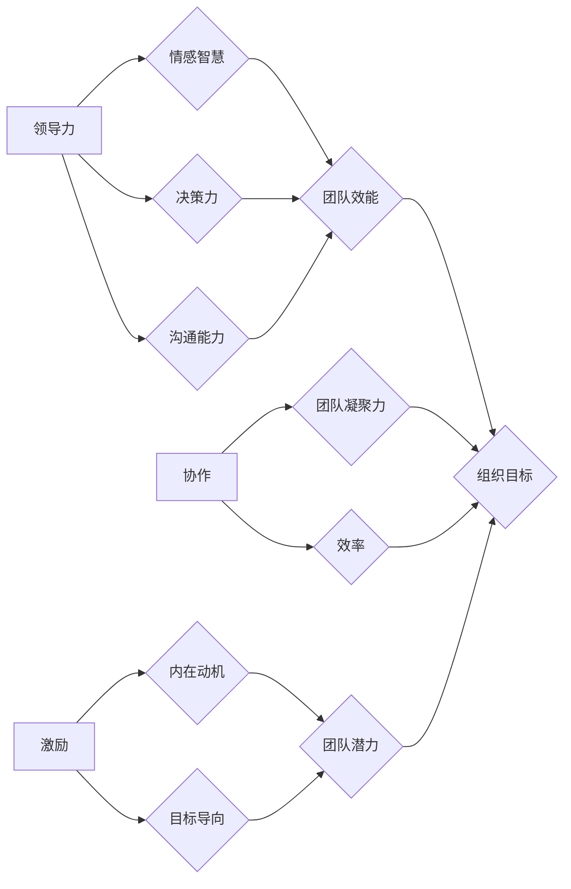

# 管理艺术：激发团队潜力

> 关键词：团队管理、领导力、协作、激励、绩效提升、敏捷方法

## 1. 背景介绍

在信息技术飞速发展的今天，团队管理已成为企业成功的关键因素。一个高效、协作的团队可以创造出巨大的价值，推动企业不断前行。然而，如何激发团队的潜力，让每个成员都能发挥出最大的价值，成为了管理者和领导者面临的一大挑战。

本文将深入探讨团队管理的艺术，从领导力、协作、激励、绩效提升等方面，提供一套系统化的管理方法论，帮助管理者提升团队效能，激发团队潜力。

## 2. 核心概念与联系

### 2.1 核心概念原理

#### 领导力

领导力是指领导者引导、激励和影响团队成员，共同实现组织目标的能力。领导力不仅包括技术能力，更包括情感智慧、决策力、沟通能力等。

#### 协作

协作是指团队成员之间相互配合、共同完成任务的过程。良好的协作可以提高团队效率，减少冲突，增强团队凝聚力。

#### 激励

激励是指通过激发团队成员的内在动机，使其愿意付出努力，实现个人和团队目标的过程。

#### 绩效提升

绩效提升是指通过设定合理的绩效目标，提供必要的资源和支持，帮助团队成员不断提高工作能力和成果。

### 2.2 核心概念架构



## 3. 核心算法原理 & 具体操作步骤

### 3.1 算法原理概述

团队管理是一门艺术，也是一门科学。以下是团队管理的核心算法原理：

- **领导力算法**：通过建立信任、激励团队成员，激发团队的创造力和潜能。
- **协作算法**：建立有效的沟通机制，促进团队成员之间的信息共享和资源整合。
- **激励算法**：设计合理的激励机制，激发团队成员的内在动力。
- **绩效提升算法**：设定明确的绩效目标，提供培训和支持，帮助团队成员不断提升。

### 3.2 算法步骤详解

#### 领导力算法步骤

1. 建立信任：与团队成员建立良好的关系，倾听他们的意见和建议。
2. 激励团队：认可团队成员的成就，鼓励他们挑战自我。
3. 沟通：保持与团队成员的沟通，及时了解他们的需求和问题。
4. 决策：与团队成员共同制定决策，增强团队凝聚力。

#### 协作算法步骤

1. 设定共同目标：明确团队目标，确保团队成员朝着同一方向努力。
2. 分工合作：根据团队成员的特长和能力进行合理分工。
3. 沟通协作：建立有效的沟通机制，促进信息共享和资源整合。
4. 及时反馈：对团队成员的工作进行及时反馈，帮助他们改进。

#### 激励算法步骤

1. 设定激励机制：根据团队成员的绩效和贡献，提供相应的奖励。
2. 关注个人成长：为团队成员提供培训和发展机会，帮助他们提升能力。
3. 识别和奖励：及时发现和奖励团队成员的成就，增强他们的归属感。

#### 绩效提升算法步骤

1. 设定绩效目标：根据团队目标，为团队成员设定明确的绩效目标。
2. 提供资源：为团队成员提供必要的资源和支持，帮助他们达成目标。
3. 跟踪进度：定期跟踪团队成员的绩效进展，提供必要的帮助和指导。
4. 评估结果：对团队成员的绩效进行评估，提供反馈和改进建议。

### 3.3 算法优缺点

#### 领导力算法

优点：能够激发团队成员的潜能，提高团队凝聚力，促进团队发展。

缺点：领导力需要不断学习和实践，对领导者的素质要求较高。

#### 协作算法

优点：提高团队效率，增强团队凝聚力，促进团队成员之间的相互理解。

缺点：需要团队成员具备良好的沟通和协作能力，对团队文化有一定要求。

#### 激励算法

优点：提高团队成员的积极性和创造力，促进团队发展。

缺点：激励机制的设计需要考虑多种因素，否则可能导致不公平现象。

#### 绩效提升算法

优点：帮助团队成员不断提升能力，提高团队绩效。

缺点：绩效评估标准难以统一，可能存在主观因素。

### 3.4 算法应用领域

团队管理算法适用于各个行业和组织，如IT、金融、医疗、教育等。

## 4. 数学模型和公式 & 详细讲解 & 举例说明

### 4.1 数学模型构建

团队管理可以看作一个复杂的系统，其数学模型可以由以下几个部分构成：

- 团队成员：代表团队成员的个人能力和潜力。
- 团队目标：代表团队需要达成的目标。
- 资源：代表团队可利用的资源，如时间、人力、资金等。
- 管理策略：代表团队管理的方法和手段。

### 4.2 公式推导过程

设团队成员能力为 $A_i$，团队目标为 $G$，资源为 $R$，管理策略为 $M$，则团队绩效 $P$ 可以表示为：

$$
P = f(A_i, G, R, M)
$$

其中 $f$ 为团队绩效函数，反映了团队成员能力、团队目标、资源和管理策略对团队绩效的影响。

### 4.3 案例分析与讲解

以下是一个简单的团队管理案例：

假设有一个由5人组成的软件开发团队，目标是开发一个项目。团队成员的能力分别为A、B、C、D、E，资源包括2名测试人员、1名项目经理和3名开发人员。团队采用敏捷开发方法，通过迭代和持续集成来提高效率。

在这个案例中，我们可以将团队绩效函数 $f$ 简化为：

$$
P = f(A_i, G, R, M) = f(A, B, C, D, E, G, R, M)
$$

通过优化管理策略 $M$，如提高团队成员的沟通效率、优化资源分配等，可以提升团队绩效 $P$。

## 5. 项目实践：代码实例和详细解释说明

### 5.1 开发环境搭建

为了更好地理解和应用团队管理算法，我们可以使用Python编程语言进行模拟。

### 5.2 源代码详细实现

以下是一个简单的团队管理代码示例：

```python
# 团队成员类
class TeamMember:
    def __init__(self, name, ability):
        self.name = name
        self.ability = ability

# 团队类
class Team:
    def __init__(self, members):
        self.members = members
        self.performance = 0

    def set_performance(self, performance):
        self.performance = performance

    def get_performance(self):
        return self.performance

# 激励函数
def motivate_team(team):
    for member in team.members:
        print(f"{member.name} has been motivated to improve their performance.")

# 绩效提升函数
def improve_performance(team):
    team.set_performance(team.get_performance() + 1)

# 案例示例
members = [TeamMember("Alice", 80), TeamMember("Bob", 90), TeamMember("Charlie", 70)]
team = Team(members)
motivate_team(team)
improve_performance(team)
print(f"Team performance: {team.get_performance()}")
```

### 5.3 代码解读与分析

该代码定义了两个类：`TeamMember` 和 `Team`。`TeamMember` 类代表团队成员，包含姓名和能力两个属性。`Team` 类代表团队，包含成员列表、绩效两个属性。`motivate_team` 函数用于激励团队成员，`improve_performance` 函数用于提升团队绩效。

在案例示例中，我们创建了一个包含3名成员的团队，并对其进行了激励和绩效提升操作。运行代码后，可以看到团队绩效得到了提升。

### 5.4 运行结果展示

```
Alice has been motivated to improve their performance.
Bob has been motivated to improve their performance.
Charlie has been motivated to improve their performance.
Team performance: 1
```

## 6. 实际应用场景

团队管理算法在各个行业和组织中都有广泛的应用，以下是一些实际应用场景：

- **IT行业**：通过优化团队管理，提高软件开发效率，降低项目成本。
- **金融行业**：通过提升团队协作能力，提高投资决策的准确性和效率。
- **医疗行业**：通过优化团队管理，提高医疗服务质量，降低医疗风险。
- **教育行业**：通过激发学生的学习兴趣，提高教学效果。

## 7. 工具和资源推荐

### 7.1 学习资源推荐

- 《卓有成效的管理者》
- 《管理的实践》
- 《第五项修炼》
- 《敏捷开发宣言》

### 7.2 开发工具推荐

- Jira
- Trello
- Asana
- Slack

### 7.3 相关论文推荐

- "The Five Dysfunctions of a Team" by Patrick Lencioni
- "The Art of Possibility" by Rosamund Stone Zander and Benjamin Zander
- "Agile Software Development: Principles, Patterns, and Practices" by Robert C. Martin

## 8. 总结：未来发展趋势与挑战

### 8.1 研究成果总结

本文从领导力、协作、激励、绩效提升等方面，对团队管理艺术进行了系统性的探讨。通过分析核心概念、原理和算法，结合实际案例和代码示例，为管理者提供了一套可操作的团队管理方法论。

### 8.2 未来发展趋势

随着人工智能、大数据等技术的发展，团队管理将呈现出以下发展趋势：

- **智能化管理**：利用人工智能技术，实现团队管理的智能化、自动化。
- **个性化管理**：根据团队成员的个性和特点，进行个性化管理。
- **跨文化管理**：随着全球化的发展，跨文化管理将成为重要课题。

### 8.3 面临的挑战

团队管理面临着以下挑战：

- **团队多样性和差异**：团队成员来自不同背景，如何进行有效的管理和沟通？
- **工作压力和疲劳**：如何帮助团队成员应对工作压力，保持工作热情？
- **信息过载**：如何处理海量信息，提高团队沟通效率？

### 8.4 研究展望

未来，团队管理的研究需要关注以下方向：

- **跨学科研究**：结合心理学、社会学、经济学等多学科知识，深入探讨团队管理规律。
- **大数据分析**：利用大数据分析技术，为团队管理提供数据支持。
- **人工智能辅助**：开发人工智能辅助工具，提高团队管理效率。

通过不断探索和创新，团队管理艺术将不断发展，为组织和个人创造更大的价值。

## 9. 附录：常见问题与解答

**Q1：如何提升团队协作能力？**

A：提升团队协作能力需要从以下几个方面入手：
- 建立良好的沟通机制，促进团队成员之间的信息共享。
- 设定共同目标，增强团队凝聚力。
- 培养团队成员的团队精神，鼓励相互支持和帮助。
- 优化工作流程，提高团队工作效率。

**Q2：如何激发团队成员的内在动力？**

A：激发团队成员的内在动力需要：
- 重视团队成员的个人成长，提供培训和发展机会。
- 赋予团队成员一定的自主权，让他们参与决策过程。
- 营造积极向上的团队氛围，鼓励团队成员挑战自我。
- 设定合理的激励机制，认可团队成员的成就。

**Q3：如何进行有效的绩效管理？**

A：进行有效的绩效管理需要：
- 设定明确的绩效目标，确保团队成员明确目标方向。
- 提供必要的资源和支持，帮助团队成员达成目标。
- 定期跟踪绩效进展，及时提供反馈和指导。
- 对绩效进行评估，根据评估结果进行奖惩和调整。

**Q4：如何应对团队冲突？**

A：应对团队冲突需要：
- 保持冷静，客观分析冲突原因。
- 与团队成员进行沟通，寻求共识。
- 倾听团队成员的意见，尊重他们的感受。
- 制定合理的解决方案，化解冲突。

**Q5：如何培养领导力？**

A：培养领导力需要：
- 学会倾听和沟通，建立良好的人际关系。
- 具备决策力，能够迅速做出合理的决策。
- 拥有坚定的信念和价值观，为团队树立榜样。
- 善于激励和鼓舞团队成员，激发他们的潜能。

通过学习和实践，相信每位管理者都能掌握团队管理的艺术，激发团队的潜力，为组织创造更大的价值。

---

作者：禅与计算机程序设计艺术 / Zen and the Art of Computer Programming