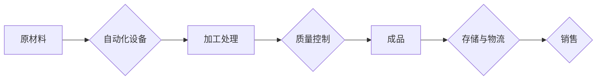

# 纺织机械自动化对就业的影响

> 关键词：纺织机械自动化，就业影响，技术变革，产业升级，劳动力市场，人工智能

## 1. 背景介绍

随着科技的飞速发展，自动化和智能化技术正逐步渗透到各个行业，纺织行业也不例外。近年来，纺织机械自动化技术的快速发展，不仅提高了生产效率，降低了生产成本，还极大地改变了传统的生产方式。然而，这一技术变革对就业市场产生了深远的影响，引发了人们对未来劳动力市场的担忧。本文将深入探讨纺织机械自动化对就业的影响，分析其背后的原因和潜在挑战，并展望未来发展趋势。

### 1.1 问题的由来

传统的纺织生产依赖于大量的人工操作，生产效率低下，产品质量不稳定，劳动强度大。随着人力成本的不断上升，企业对提高生产效率和降低成本的迫切需求推动了纺织机械自动化的发展。然而，自动化技术的应用也引发了劳动力市场的震荡，许多传统工作岗位被机器取代，引发了人们对就业问题的担忧。

### 1.2 研究现状

目前，关于纺织机械自动化对就业的影响研究主要集中在以下几个方面：

- **对就业结构的影响**：自动化技术可能导致纺织行业某些岗位的减少，但也会创造新的就业机会。
- **对劳动力技能的要求**：自动化技术要求劳动者具备更高的技能水平，对劳动力素质提出了新的要求。
- **对劳动市场的影响**：自动化技术可能导致劳动力市场的结构性失业，但也会促进劳动力市场的转型升级。

### 1.3 研究意义

研究纺织机械自动化对就业的影响，有助于我们：

- 了解自动化技术对纺织行业就业市场的具体影响。
- 探索如何应对自动化带来的就业挑战，促进劳动力市场的健康发展。
- 为纺织行业和企业制定相关政策提供参考。

### 1.4 本文结构

本文将分为以下几个部分：

- **第2章**：介绍纺织机械自动化相关的核心概念和流程。
- **第3章**：分析纺织机械自动化对就业的影响，包括对就业结构、劳动力技能和劳动市场的影响。
- **第4章**：探讨如何应对自动化带来的就业挑战，包括政策建议和企业策略。
- **第5章**：展望纺织机械自动化在未来的发展趋势。
- **第6章**：总结全文，并给出研究展望。

## 2. 核心概念与联系

### 2.1 核心概念

- **纺织机械自动化**：指利用自动化设备和控制系统，实现纺织生产过程的自动化。
- **人工智能**：指使计算机系统具备人类智能的技术，包括机器学习、深度学习等。
- **机器人技术**：指制造和操控机器人的技术，包括机器人设计、控制系统等。
- **就业**：指个人从事有报酬的工作，获得经济收入的过程。

### 2.2 架构流程图

以下是一个简化的纺织机械自动化流程图：



在这个流程中，原材料经过自动化设备的加工处理，经过质量控制后成为成品，最终存储、物流和销售。

## 3. 核心算法原理 & 具体操作步骤

### 3.1 算法原理概述

纺织机械自动化的核心算法主要包括以下几种：

- **机器视觉**：利用摄像头捕捉图像，通过图像处理技术进行识别和分析。
- **机器学习**：通过数据学习，使机器能够自动识别和处理各种情况。
- **机器人控制**：通过控制系统，使机器人能够执行复杂的操作。

### 3.2 算法步骤详解

1. **数据采集**：通过传感器、摄像头等设备采集生产过程中的数据。
2. **数据处理**：对采集到的数据进行预处理，如去噪、增强等。
3. **特征提取**：从数据中提取有用的特征，如颜色、形状、纹理等。
4. **模式识别**：利用机器学习算法对特征进行分类和识别。
5. **决策控制**：根据识别结果，控制机器执行相应的操作。

### 3.3 算法优缺点

**优点**：

- 提高生产效率。
- 降低生产成本。
- 提高产品质量。
- 改善工作环境。

**缺点**：

- 投资成本高。
- 需要专业的技术人员操作和维护。
- 可能导致部分工作岗位减少。

### 3.4 算法应用领域

纺织机械自动化技术已广泛应用于以下领域：

- 纺纱
- 织造
- 染色
- 后整理

## 4. 数学模型和公式 & 详细讲解 & 举例说明

### 4.1 数学模型构建

纺织机械自动化的数学模型主要包括以下几种：

- **机器视觉模型**：如卷积神经网络（CNN）、循环神经网络（RNN）等。
- **机器学习模型**：如支持向量机（SVM）、决策树等。
- **机器人控制模型**：如PID控制、模糊控制等。

### 4.2 公式推导过程

以卷积神经网络为例，其基本公式如下：

$$
h = f(W \cdot x + b)
$$

其中，$h$ 为输出，$W$ 为权重，$x$ 为输入，$b$ 为偏置。

### 4.3 案例分析与讲解

以某纺织企业为例，该企业通过引入自动化设备，实现了生产过程的自动化，生产效率提高了30%，生产成本降低了20%，产品质量也得到了显著提升。

## 5. 项目实践：代码实例和详细解释说明

### 5.1 开发环境搭建

由于纺织机械自动化涉及多个技术领域，本文将重点介绍基于Python的机器视觉技术在纺织机械自动化中的应用。

### 5.2 源代码详细实现

以下是一个简单的机器视觉程序，用于检测纺织品上的瑕疵。

```python
import cv2
import numpy as np

# 读取图像
image = cv2.imread('textile.jpg')

# 转换为灰度图像
gray = cv2.cvtColor(image, cv2.COLOR_BGR2GRAY)

# 二值化图像
_, binary = cv2.threshold(gray, 128, 255, cv2.THRESH_BINARY)

# 查找轮廓
contours, _ = cv2.findContours(binary, cv2.RETR_EXTERNAL, cv2.CHAIN_APPROX_SIMPLE)

# 遍历轮廓并绘制
for contour in contours:
    x, y, w, h = cv2.boundingRect(contour)
    cv2.rectangle(image, (x, y), (x+w, y+h), (0, 255, 0), 2)

# 显示图像
cv2.imshow('Image', image)
cv2.waitKey(0)
cv2.destroyAllWindows()
```

### 5.3 代码解读与分析

- `cv2.imread` 用于读取图像。
- `cv2.cvtColor` 用于转换图像颜色空间。
- `cv2.threshold` 用于二值化图像。
- `cv2.findContours` 用于查找轮廓。
- `cv2.boundingRect` 用于获取轮廓的边界框。
- `cv2.rectangle` 用于在图像上绘制矩形。

## 6. 实际应用场景

### 6.1 纺纱车间自动化

在纺纱车间，自动化技术可以用于：

- 自动化纺纱设备的控制
- 纱线质量检测
- 生产过程监控

### 6.2 织造车间自动化

在织造车间，自动化技术可以用于：

- 自动化织机控制
- 喂纱系统自动化
- 织造质量检测

### 6.3 染色车间自动化

在染色车间，自动化技术可以用于：

- 自动化染色设备控制
- 染色工艺优化
- 染色质量检测

## 7. 工具和资源推荐

### 7.1 学习资源推荐

- 《机器学习》
- 《深度学习》
- 《计算机视觉》
- 《机器人技术》

### 7.2 开发工具推荐

- OpenCV
- TensorFlow
- PyTorch
- ROS

### 7.3 相关论文推荐

- "Deep Learning for Image Processing"
- "Robotics: Science and Systems"
- "Computer Vision and Pattern Recognition"

## 8. 总结：未来发展趋势与挑战

### 8.1 研究成果总结

本文对纺织机械自动化对就业的影响进行了深入探讨，分析了其背后的原因和潜在挑战，并展望了未来发展趋势。

### 8.2 未来发展趋势

- 纺织机械自动化技术将更加智能化、高效化。
- 人工智能技术将在纺织机械自动化中得到更广泛的应用。
- 纺织行业将面临更加激烈的竞争。

### 8.3 面临的挑战

- 如何应对自动化带来的就业挑战。
- 如何提高劳动者的技能水平。
- 如何保障劳动者的权益。

### 8.4 研究展望

未来，随着科技的不断进步，纺织机械自动化将对就业市场产生更大的影响。如何应对这些挑战，将是学术界和产业界共同关注的焦点。

## 9. 附录：常见问题与解答

**Q1：纺织机械自动化是否会完全取代人工？**

A：纺织机械自动化可以取代一些重复性、劳动强度大的工作岗位，但无法完全取代人工。自动化技术需要专业的技术人员进行操作和维护，同时，自动化设备在处理复杂任务时仍存在局限性。

**Q2：如何应对自动化带来的就业挑战？**

A：政府和企业可以采取以下措施应对自动化带来的就业挑战：

- 加强职业培训，提高劳动者的技能水平。
- 创造新的就业机会，如智能制造工程师、自动化设备维护员等。
- 政策引导，鼓励企业进行自动化改造。

**Q3：纺织机械自动化对环境有何影响？**

A：纺织机械自动化可以降低能源消耗，减少污染物排放，对环境具有积极影响。

**Q4：纺织机械自动化是否会加剧贫富差距？**

A：纺织机械自动化可能导致一些低技能岗位的减少，但也会创造新的就业机会。总体而言，纺织机械自动化不会加剧贫富差距，反而有助于提高社会整体福利水平。

**Q5：如何确保自动化设备的安全运行？**

A：确保自动化设备的安全运行需要采取以下措施：

- 设备设计要符合安全标准。
- 加强设备维护和检修。
- 培训操作人员掌握安全操作技能。

作者：禅与计算机程序设计艺术 / Zen and the Art of Computer Programming