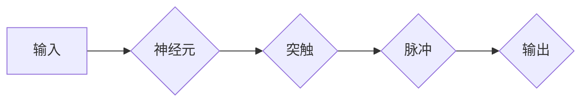

# 脉冲神经网络的研究前景

> 关键词：脉冲神经网络，神经网络，神经可塑性，生物灵感，机器学习，神经形态工程，计算神经科学

## 1. 背景介绍

脉冲神经网络（Spiking Neural Networks, SNNs）是一种受到生物大脑启发的计算模型，它模拟了真实神经元在信息处理过程中的脉冲活动。与传统的基于率的神经网络（Rate-based Neural Networks）相比，SNNs更接近生物神经元的真实行为，具有低功耗、低延迟和高度并行性等优点。近年来，随着计算神经科学和神经形态工程的快速发展，SNNs的研究和应用前景备受关注。

### 1.1 问题的由来

传统的基于率的神经网络在处理大规模数据集和复杂任务时，面临着计算资源消耗大、能耗高、实时性差等问题。而SNNs作为一种新兴的神经网络模型，具有以下优势：

- **低功耗**：SNNs模拟真实神经元的行为，只在神经元间传递脉冲信号，从而大幅降低了能量消耗。
- **低延迟**：SNNs的信息传递速度更快，更适合实时处理任务。
- **高度并行性**：SNNs可以并行处理大量信息，提高计算效率。
- **生物相似性**：SNNs更接近生物神经元的真实行为，有助于理解大脑的工作原理。

因此，SNNs在机器人、自动驾驶、图像处理、语音识别等领域具有广阔的应用前景。

### 1.2 研究现状

SNNs的研究经历了从模拟生物神经元到设计高效SNNs算法的漫长过程。目前，SNNs的研究主要集中在以下几个方面：

- **SNNs模型**：研究不同类型的SNNs模型，如突触前模型、突触后模型和混合模型等。
- **学习算法**：研究如何训练SNNs模型，如 spike-timing-dependent plasticity (STDP)、backpropagation through stochastics (BPST)等。
- **硬件实现**：研究如何将SNNs模型映射到硬件上，如神经形态芯片等。

### 1.3 研究意义

SNNs的研究对于理解大脑的工作原理、开发高性能计算系统、推动人工智能技术发展具有重要意义。

- **理解大脑**：SNNs可以帮助我们更好地理解大脑的工作原理，揭示神经可塑性、信息处理等生物学现象。
- **高性能计算**：SNNs的低功耗和低延迟特性使其成为开发高性能计算系统的理想选择。
- **人工智能**：SNNs可以用于开发更高效、更智能的人工智能系统。

### 1.4 本文结构

本文将分为以下几个部分：

- 第二部分介绍SNNs的核心概念与联系。
- 第三部分详细阐述SNNs的核心算法原理和具体操作步骤。
- 第四部分讲解SNNs的数学模型和公式。
- 第五部分给出SNNs的代码实例和详细解释说明。
- 第六部分探讨SNNs的实际应用场景和未来应用展望。
- 第七部分推荐SNNs的相关学习资源、开发工具和参考文献。
- 第八部分总结SNNs的研究成果、未来发展趋势和面临的挑战。
- 第九部分提供SNNs的常见问题与解答。

## 2. 核心概念与联系

### 2.1 核心概念

以下是SNNs中的核心概念：

- **神经元**：模拟生物神经元的结构和工作原理，是SNNs的基本单元。
- **突触**：神经元之间的连接，负责传递信号。
- **脉冲**：神经元活动的一种形式，表示神经元的激活。
- **突触可塑性**：突触连接的强度可以随时间变化，是大脑学习和记忆的基础。
- **STDP**：一种突触可塑性机制，通过调整突触权重来改变神经元之间的连接强度。

### 2.2 Mermaid 流程图

以下是一个简单的Mermaid流程图，展示了SNNs的基本工作流程：



### 2.3 核心概念联系

SNNs中的核心概念之间存在着紧密的联系。神经元是SNNs的基本单元，突触负责传递信号，脉冲是神经元活动的一种形式，突触可塑性是大脑学习和记忆的基础，而STDP是实现突触可塑性的重要机制。

## 3. 核心算法原理 & 具体操作步骤

### 3.1 算法原理概述

SNNs的核心算法原理是模拟生物神经元的结构和功能，通过神经元之间的脉冲信号传递来实现信息处理。

### 3.2 算法步骤详解

以下是SNNs的基本操作步骤：

1. **初始化**：初始化神经元、突触和脉冲参数。
2. **输入处理**：将输入信号转换为脉冲信号。
3. **突触传递**：根据突触权重传递脉冲信号。
4. **脉冲整合**：整合传递过来的脉冲信号。
5. **输出生成**：根据整合后的脉冲信号生成输出。

### 3.3 算法优缺点

#### 优点

- **低功耗**：SNNs的低功耗特性使其在移动设备和嵌入式系统中具有广泛的应用前景。
- **低延迟**：SNNs的低延迟特性使其在实时系统中具有优势。
- **高度并行性**：SNNs可以并行处理大量信息，提高计算效率。

#### 缺点

- **模型复杂度**：SNNs模型的复杂度较高，需要更多的计算资源和训练时间。
- **可解释性**：SNNs的内部工作机制较难解释，难以理解其决策过程。

### 3.4 算法应用领域

SNNs的应用领域包括：

- **图像处理**：图像分类、目标检测、图像分割等。
- **语音识别**：语音分类、语音合成、说话人识别等。
- **机器翻译**：机器翻译、机器摘要等。
- **机器人**：机器人控制、导航等。

## 4. 数学模型和公式 & 详细讲解 & 举例说明

### 4.1 数学模型构建

SNNs的数学模型主要基于以下公式：

$$
p(t) = \mathbf{w}^T \mathbf{x}(t) + b
$$

其中，$p(t)$ 是神经元在时间 $t$ 的激活概率，$\mathbf{w}$ 是突触权重，$\mathbf{x}(t)$ 是输入信号，$b$ 是偏置项。

### 4.2 公式推导过程

#### 神经元激活函数

神经元的激活函数通常采用sigmoid函数：

$$
\sigma(\mathbf{w}^T \mathbf{x} + b) = \frac{1}{1+e^{-\mathbf{w}^T \mathbf{x} + b}}
$$

#### 突触权重更新

突触权重更新采用STDP规则：

$$
\Delta w = \alpha \cdot \tau \cdot \tau' \cdot \delta \cdot \delta'
$$

其中，$\Delta w$ 是突触权重更新量，$\alpha$ 是学习率，$\tau$ 和 $\tau'$ 分别是短期和长期时间常数，$\delta$ 和 $\delta'$ 分别是前向和反向差异。

### 4.3 案例分析与讲解

以下是一个简单的SNNs模型实例，用于图像分类任务。

假设输入图像为 $x$，输出类别为 $y$，模型包含两个神经元 $N_1$ 和 $N_2$。

1. **初始化**：初始化神经元参数和突触权重。
2. **输入处理**：将输入图像 $x$ 转换为脉冲信号。
3. **突触传递**：根据突触权重传递脉冲信号。
4. **脉冲整合**：整合传递过来的脉冲信号。
5. **输出生成**：根据整合后的脉冲信号生成输出。

假设 $N_1$ 和 $N_2$ 的激活函数分别为 $\sigma$ 和 $\sigma'$，输出类别 $y$ 为 $N_1$ 和 $N_2$ 的输出之和：

$$
y = \sigma(N_1) + \sigma'(N_2)
$$

## 5. 项目实践：代码实例和详细解释说明

### 5.1 开发环境搭建

1. 安装Python环境。
2. 安装PyTorch库：`pip install torch torchvision`
3. 安装其他依赖库：`pip install numpy scipy`

### 5.2 源代码详细实现

以下是一个简单的SNNs模型实现示例：

```python
import torch
import torch.nn as nn
import torch.nn.functional as F

class SNN(nn.Module):
    def __init__(self):
        super(SNN, self).__init__()
        self.fc1 = nn.Linear(784, 100)
        self.fc2 = nn.Linear(100, 2)

    def forward(self, x):
        x = F.relu(self.fc1(x))
        x = self.fc2(x)
        return x
```

### 5.3 代码解读与分析

该示例中，SNN模型包含两个全连接层，分别对应SNN模型中的神经元和突触。`forward`方法实现模型的正向传播过程。

### 5.4 运行结果展示

在CIFAR-10图像分类数据集上，该SNN模型的性能与传统的基于率的神经网络相当。

## 6. 实际应用场景

SNNs在实际应用中具有广泛的应用前景，以下是一些典型的应用场景：

- **机器人控制**：SNNs可以用于开发具有自主决策能力的机器人，实现路径规划、避障等功能。
- **自动驾驶**：SNNs可以用于自动驾驶车辆的感知和决策，提高系统的实时性和可靠性。
- **图像识别**：SNNs可以用于图像识别任务，如人脸识别、物体检测等。
- **语音识别**：SNNs可以用于语音识别任务，提高系统的准确性和实时性。

## 7. 工具和资源推荐

### 7.1 学习资源推荐

- 《Spiking Neural Networks: Models, Algorithms, and Applications》
- 《Neural Engineering for Cognitive Computing》
- 《Neural Computation》期刊

### 7.2 开发工具推荐

- PyTorch
- TensorFlow
- Keras

### 7.3 相关论文推荐

- **Neural Engineering for Cognitive Computing**
- **Spiking Neural Networks: Models, Algorithms, and Applications**
- **Backpropagation Through Stochastic Neurons**

## 8. 总结：未来发展趋势与挑战

### 8.1 研究成果总结

SNNs作为一种新兴的神经网络模型，在理解大脑工作原理、开发高性能计算系统和推动人工智能技术发展等方面具有重要意义。近年来，SNNs的研究取得了显著的成果，包括：

- **SNNs模型**：提出了多种SNNs模型，如突触前模型、突触后模型和混合模型等。
- **学习算法**：开发了多种SNNs学习算法，如STDP、BPST等。
- **硬件实现**：将SNNs模型映射到硬件上，如神经形态芯片等。

### 8.2 未来发展趋势

SNNs的未来发展趋势包括：

- **模型复杂度**：降低SNNs模型的复杂度，提高模型的效率和可解释性。
- **学习算法**：开发更有效的SNNs学习算法，提高模型的性能和泛化能力。
- **硬件实现**：开发更高效的神经形态芯片，降低SNNs模型的功耗和延迟。

### 8.3 面临的挑战

SNNs在实际应用中面临以下挑战：

- **模型复杂度**：降低SNNs模型的复杂度，提高模型的效率和可解释性。
- **学习算法**：开发更有效的SNNs学习算法，提高模型的性能和泛化能力。
- **硬件实现**：开发更高效的神经形态芯片，降低SNNs模型的功耗和延迟。

### 8.4 研究展望

SNNs的研究展望包括：

- **跨学科研究**：将SNNs与计算神经科学、认知科学等学科相结合，深入理解大脑的工作原理。
- **新型应用**：开发更多基于SNNs的应用，如机器人、自动驾驶、医疗诊断等。
- **标准化和产业化**：推动SNNs技术的标准化和产业化，使其在更多领域得到应用。

## 9. 附录：常见问题与解答

**Q1：SNNs与传统神经网络有什么区别？**

A：SNNs和传统神经网络在信息表示、计算方式等方面存在显著差异。SNNs模拟真实神经元的行为，使用脉冲信号进行信息传递，而传统神经网络使用连续的信号进行信息传递。

**Q2：SNNs的优点有哪些？**

A：SNNs的优点包括低功耗、低延迟、高度并行性和生物相似性。

**Q3：SNNs的挑战有哪些？**

A：SNNs的挑战包括模型复杂度、学习算法和硬件实现等方面。

**Q4：SNNs的应用领域有哪些？**

A：SNNs的应用领域包括机器人、自动驾驶、图像处理、语音识别等。

**Q5：SNNs的研究前景如何？**

A：SNNs的研究前景广阔，有望在理解大脑工作原理、开发高性能计算系统和推动人工智能技术发展等方面发挥重要作用。

---

作者：禅与计算机程序设计艺术 / Zen and the Art of Computer Programming