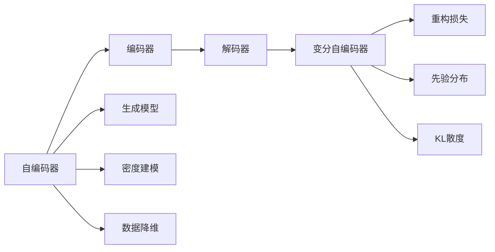
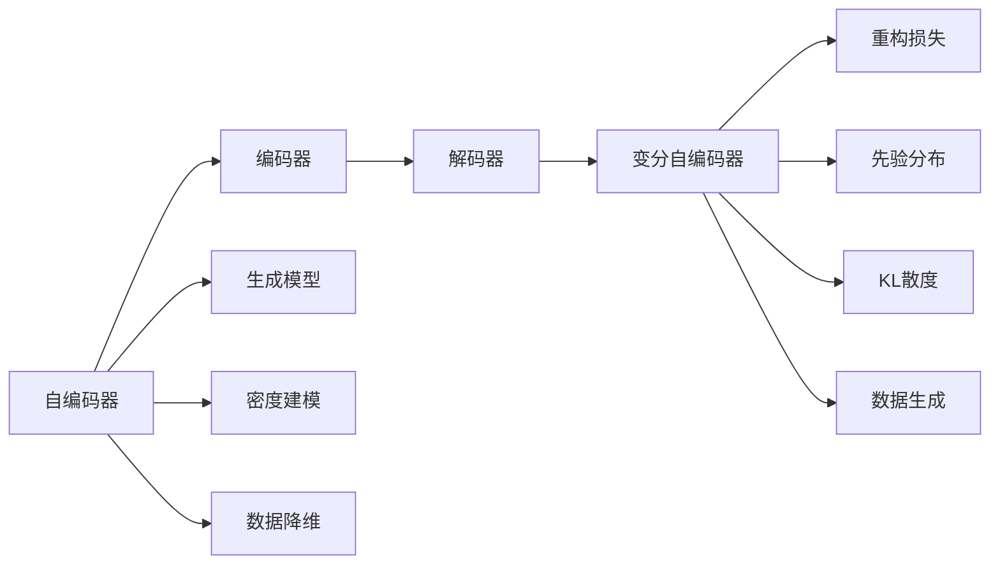

                 

# 变分自编码器 (Variational Autoencoder)

> 关键词：变分自编码器, 生成模型, 自编码器, 数据降维, 密度建模, 深度学习, 数据可视化

## 1. 背景介绍

### 1.1 问题由来
变分自编码器（Variational Autoencoder, VAE）是一种生成模型，源于早期自编码器（Autoencoder）的思想。自编码器旨在学习输入与重构输入之间的映射关系，并通常用于数据降维和去噪处理。然而，它并不保证生成的数据样本与训练数据具有相似的分布。而变分自编码器在此基础上引入了“变分”的思想，通过最大化训练数据的似然函数，使生成的数据样本更接近真实的训练数据分布。

变分自编码器的提出，有效地解决了自编码器在生成数据时无法保证数据分布相似性的问题，能够对高维数据进行有效的降维和密度建模，具有广泛的应用前景。变分自编码器广泛应用于图像生成、数据压缩、数据降维、数据可视化等任务，已成为深度学习领域的重要技术之一。

### 1.2 问题核心关键点
变分自编码器由两个部分组成：编码器和解码器。编码器将高维输入数据压缩为低维潜在表示，解码器则将低维表示重构为高维数据。变分自编码器引入变分思想，通过最大化训练数据的似然函数，生成与真实数据分布尽可能接近的新数据样本。其核心思想是使用变分推断来估计数据的潜在分布，从而实现数据的生成和降维。

关键点包括：
1. 编码器（Encoder）：将输入数据映射到低维潜在空间。
2. 解码器（Decoder）：将潜在表示映射回高维空间。
3. 潜在空间（Latent Space）：潜在空间的概率分布表示了数据的统计特性。
4. 变分推断（Variational Inference）：通过最大化似然函数，对潜在空间分布进行建模。
5. 重构损失（Reconstruction Loss）：重建数据与原始数据之间的距离。
6. 先验分布（Prior Distribution）：潜在空间中样本的先验概率分布，通常采用标准正态分布。
7. 似然函数（Likelihood Function）：数据分布的概率密度函数。

## 2. 核心概念与联系

### 2.1 核心概念概述

为了更清晰地理解变分自编码器的工作原理，本节将介绍几个密切相关的核心概念：

- 自编码器（Autoencoder）：通过学习输入数据与重构数据之间的映射关系，对数据进行压缩和降维，是变分自编码器的重要组成部分。
- 生成模型（Generative Model）：能够根据训练数据学习数据生成过程的模型，变分自编码器即是一种生成模型。
- 密度建模（Density Modeling）：生成模型通过对数据分布建模，能够生成新的数据样本，密度建模是生成模型的重要任务之一。
- 数据降维（Dimensionality Reduction）：将高维数据压缩到低维空间，减少数据存储空间和计算复杂度，是变分自编码器的重要应用。
- 变分推断（Variational Inference）：通过估计数据分布的近似分布，最大化训练数据的似然函数，使模型更接近真实的训练数据分布。
- KL散度（KL Divergence）：衡量两个概率分布之间的距离，用于衡量变分推断中的潜在分布与先验分布之间的相似度。

这些核心概念共同构成了变分自编码器的理论基础，帮助理解其在数据生成和降维等方面的应用。

### 2.2 概念间的关系

这些核心概念之间的逻辑关系可以通过以下Mermaid流程图来展示：



这个流程图展示了点到点之间的核心概念关系：

1. 自编码器由编码器和解码器组成。
2. 生成模型用于学习数据的生成过程，密度建模是生成模型的重要任务。
3. 数据降维是通过自编码器实现的目标之一。
4. 变分自编码器通过变分推断学习数据的潜在分布。
5. 重构损失用于衡量重构数据的性能。
6. 先验分布和KL散度用于指导变分推断的进行。

### 2.3 核心概念的整体架构

最后，我们用一个综合的流程图来展示这些核心概念在大语言模型微调过程中的整体架构：



这个综合流程图展示了从自编码器到变分自编码器的完整过程。自编码器通过编码器将输入数据映射到潜在空间，再通过解码器将潜在空间中的数据映射回原始空间。变分自编码器通过变分推断学习潜在分布，并使用先验分布和KL散度来指导分布的拟合。最终，变分自编码器能够生成新的数据样本，实现数据的降维和生成。

## 3. 核心算法原理 & 具体操作步骤
### 3.1 算法原理概述

变分自编码器的核心思想是通过变分推断估计数据的潜在分布，从而生成与真实数据分布尽可能接近的新数据样本。其算法原理可以简单概括为以下几步：

1. **编码器**：将高维输入数据压缩到低维潜在表示空间。
2. **解码器**：将潜在表示重构为高维数据。
3. **变分推断**：通过最大化训练数据的似然函数，估计潜在分布。
4. **KL散度最小化**：最小化潜在分布与先验分布之间的KL散度，优化变分推断。
5. **重构损失最小化**：最小化重建数据与原始数据之间的距离，优化解码器。

具体而言，变分自编码器由两部分组成：一个将输入映射到潜在表示空间的编码器，和一个将潜在表示映射回原始空间的解码器。变分自编码器的目标是通过最大化似然函数，最小化KL散度，从而使得生成的数据样本尽可能接近真实的训练数据分布。

### 3.2 算法步骤详解

以下是变分自编码器的详细操作步骤：

1. **定义编码器和解码器**：
   - 编码器将输入数据 $x$ 映射到潜在空间 $z$，即 $z = E(x)$。
   - 解码器将潜在表示 $z$ 映射回原始空间 $x'$，即 $x' = D(z)$。
   
2. **定义潜在分布和先验分布**：
   - 潜在分布 $q(z|x)$ 表示编码器输出的潜在表示 $z$ 的条件概率分布。
   - 先验分布 $p(z)$ 是潜在空间中样本的先验概率分布，通常采用标准正态分布 $N(0, I)$。
   
3. **定义变分推断的证据下界（ELBO）**：
   - ELBO由重构损失和KL散度组成，即 $\mathcal{L}(q, p) = -E_{q(z|x)} \log p(x'|z) + D_{KL}(q(z|x) || p(z))$。
   
4. **最大化ELBO**：
   - 通过对ELBO进行最大化，最小化潜在分布与先验分布之间的KL散度，使得潜在分布尽可能接近先验分布。
   - 同时，通过最小化重构损失，使得解码器生成的数据尽可能接近原始数据。
   
5. **迭代优化**：
   - 使用优化算法（如Adam、SGD等）对编码器和解码器的参数进行优化，使模型能够最小化重构损失和KL散度。
   - 重复上述步骤直至收敛。

### 3.3 算法优缺点

变分自编码器具有以下优点：

1. 生成与真实数据分布相似的数据样本。
2. 能够对高维数据进行有效的降维。
3. 变分推断方法易于实现，便于优化。
4. 可以生成新的数据样本，适用于生成对抗网络（GAN）等生成模型。

同时，变分自编码器也存在一些缺点：

1. 难以避免过拟合。模型倾向于学习复杂的分布，可能导致潜在空间的噪声过大，影响生成数据的质量。
2. 训练复杂，需要大量的训练数据和计算资源。
3. 生成数据的质量和多样性有限。生成数据的分布与潜在分布之间可能存在偏差。

### 3.4 算法应用领域

变分自编码器在多个领域中得到了广泛应用，主要包括以下几个方面：

1. **图像生成**：通过生成与真实数据分布相似的新图像，变分自编码器在图像生成任务中取得了显著效果。
2. **数据降维**：通过将高维数据映射到低维空间，变分自编码器可以大大减少数据存储和计算成本。
3. **数据可视化**：通过生成数据样本，变分自编码器可以可视化数据的潜在表示，帮助理解数据特征和分布。
4. **异常检测**：通过学习正常数据的分布，变分自编码器能够识别出异常数据，用于数据清洗和异常检测。
5. **图像去噪**：通过生成噪声数据并从重构误差中去除，变分自编码器可以用于图像去噪。

## 4. 数学模型和公式 & 详细讲解 & 举例说明

### 4.1 数学模型构建

变分自编码器的数学模型可以简单概括为以下两部分：

1. **潜在空间的概率分布**：潜在分布 $q(z|x)$ 表示编码器输出的潜在表示 $z$ 的条件概率分布。
2. **先验概率分布**：先验分布 $p(z)$ 是潜在空间中样本的先验概率分布，通常采用标准正态分布 $N(0, I)$。

数学上，变分自编码器的目标函数由重构损失和KL散度组成，即：

$$
\mathcal{L}(q, p) = -\mathbb{E}_{q(z|x)} \log p(x'|z) + D_{KL}(q(z|x) || p(z))
$$

其中，$\mathbb{E}_{q(z|x)}$ 表示对潜在分布 $q(z|x)$ 的期望，$p(x'|z)$ 表示解码器输出数据的概率密度函数，$D_{KL}(q(z|x) || p(z))$ 表示潜在分布与先验分布之间的KL散度。

### 4.2 公式推导过程

以下我们将详细推导重构损失和KL散度的计算公式。

#### 4.2.1 重构损失（Reconstruction Loss）

重构损失用于衡量解码器生成的数据与原始数据之间的距离。重构损失的定义如下：

$$
\mathcal{L}_{rec} = -\mathbb{E}_{q(z|x)} \log p(x'|z)
$$

其中，$x'$ 表示解码器生成的重构数据。为了计算重构损失，需要计算解码器输出数据的概率密度函数 $p(x'|z)$。在变分自编码器中，我们通常使用自回归模型或概率图模型来计算 $p(x'|z)$。

#### 4.2.2 KL散度（KL Divergence）

KL散度用于衡量两个概率分布之间的距离。在变分自编码器中，KL散度用于衡量潜在分布与先验分布之间的距离。KL散度的定义为：

$$
D_{KL}(q(z|x) || p(z)) = \int q(z|x) \log \frac{q(z|x)}{p(z)} \, dz
$$

对于连续型概率分布，KL散度可以进一步简化为：

$$
D_{KL}(q(z|x) || p(z)) = \mathbb{E}_{q(z|x)} \log \frac{q(z|x)}{p(z)}
$$

将潜在分布 $q(z|x)$ 分解为重构损失和KL散度两部分，可以得到变分自编码器的目标函数。

### 4.3 案例分析与讲解

以MNIST手写数字数据集为例，展示变分自编码器的训练过程和应用效果。

**步骤1：数据准备**

首先，导入MNIST数据集，并对数据进行预处理：

```python
import torch
from torchvision.datasets import MNIST
from torchvision.transforms import ToTensor

train_dataset = MNIST(root='./data', train=True, transform=ToTensor(), download=True)
test_dataset = MNIST(root='./data', train=False, transform=ToTensor(), download=True)
```

**步骤2：定义模型**

定义一个包含两个全连接层的变分自编码器模型：

```python
import torch.nn as nn

class VAE(nn.Module):
    def __init__(self, input_size, latent_size, hidden_size):
        super(VAE, self).__init__()
        self.encoder = nn.Sequential(
            nn.Linear(input_size, hidden_size),
            nn.ReLU(),
            nn.Linear(hidden_size, latent_size)
        )
        self.decoder = nn.Sequential(
            nn.Linear(latent_size, hidden_size),
            nn.ReLU(),
            nn.Linear(hidden_size, input_size),
            nn.Sigmoid()
        )
    
    def encode(self, x):
        mu = self.encoder(x)
        logvar = torch.log(self.encoder(x))
        return mu, logvar
    
    def decode(self, z):
        x_hat = self.decoder(z)
        return x_hat
    
    def reparameterize(self, mu, logvar):
        eps = torch.randn_like(mu)
        z = mu + torch.exp(0.5 * logvar) * eps
        return z
    
    def forward(self, x):
        mu, logvar = self.encode(x)
        z = self.reparameterize(mu, logvar)
        x_hat = self.decode(z)
        return x_hat, mu, logvar
```

**步骤3：定义损失函数**

定义重构损失和KL散度损失函数：

```python
import torch.nn.functional as F

def vae_loss(x_hat, x, mu, logvar):
    reconstruction_loss = F.binary_cross_entropy(x_hat, x, reduction='sum')
    kl_loss = -0.5 * torch.mean(1 + logvar - mu.pow(2) - logvar.exp())
    total_loss = reconstruction_loss + kl_loss
    return total_loss
```

**步骤4：训练模型**

定义优化器和学习率，进行模型训练：

```python
from torch.optim import Adam

batch_size = 128
learning_rate = 0.001
num_epochs = 50

device = torch.device('cuda' if torch.cuda.is_available() else 'cpu')

mu, logvar = vae.encode(x)
z = vae.reparameterize(mu, logvar)
x_hat, mu, logvar = vae.decode(z)

total_loss = vae_loss(x_hat, x, mu, logvar)
loss = total_loss / batch_size

optimizer = Adam(vae.parameters(), lr=learning_rate)
for epoch in range(num_epochs):
    for batch_idx, (data, _) in enumerate(train_loader):
        data = data.to(device)
        optimizer.zero_grad()
        x_hat, mu, logvar = vae(data)
        loss = total_loss / batch_size
        loss.backward()
        optimizer.step()
        if batch_idx % 100 == 0:
            print('Train Epoch: {} [{}/{} ({:.0f}%)]\tLoss: {:.6f}'.format(
                epoch, batch_idx * len(data), len(train_loader.dataset),
                100. * batch_idx / len(train_loader), loss.item()))
```

**步骤5：结果展示**

训练完成后，展示重构图像和潜在分布：

```python
import matplotlib.pyplot as plt
import numpy as np

def show_images(z):
    fig = plt.figure(figsize=(4, 4))
    for idx, z_value in enumerate(z):
        z_value = z_value.cpu().numpy()
        plt.subplot(4, 4, idx + 1)
        plt.imshow(z_value.reshape(28, 28), cmap='gray')
        plt.axis('off')
    plt.show()

# 生成潜在表示并可视化
z = vae.encoder(train_loader.dataset.train_data[0])
show_images(z)
```

通过上述案例分析，可以更直观地理解变分自编码器的工作原理和应用效果。在实际应用中，变分自编码器可以用于图像生成、数据降维、异常检测等任务，具有广泛的应用前景。

## 5. 项目实践：代码实例和详细解释说明
### 5.1 开发环境搭建

要进行变分自编码器的项目实践，首先需要搭建开发环境。以下是使用Python和PyTorch进行环境配置的流程：

1. 安装Anaconda：从官网下载并安装Anaconda，用于创建独立的Python环境。

2. 创建并激活虚拟环境：
```bash
conda create -n pytorch-env python=3.8 
conda activate pytorch-env
```

3. 安装PyTorch：根据CUDA版本，从官网获取对应的安装命令。例如：
```bash
conda install pytorch torchvision torchaudio cudatoolkit=11.1 -c pytorch -c conda-forge
```

4. 安装Tensorboard：用于可视化训练过程和结果。
```bash
pip install tensorboard
```

5. 安装相关的深度学习库：
```bash
pip install numpy scipy matplotlib pytorch torchvision torchtext
```

完成上述步骤后，即可在`pytorch-env`环境中开始变分自编码器的实践。

### 5.2 源代码详细实现

以MNIST手写数字数据集为例，展示变分自编码器的完整代码实现。

首先，定义模型、损失函数和优化器：

```python
import torch.nn as nn
import torch.nn.functional as F
from torch.optim import Adam

class VAE(nn.Module):
    def __init__(self, input_size, latent_size, hidden_size):
        super(VAE, self).__init__()
        self.encoder = nn.Sequential(
            nn.Linear(input_size, hidden_size),
            nn.ReLU(),
            nn.Linear(hidden_size, latent_size)
        )
        self.decoder = nn.Sequential(
            nn.Linear(latent_size, hidden_size),
            nn.ReLU(),
            nn.Linear(hidden_size, input_size),
            nn.Sigmoid()
        )
    
    def encode(self, x):
        mu = self.encoder(x)
        logvar = torch.log(self.encoder(x))
        return mu, logvar
    
    def decode(self, z):
        x_hat = self.decoder(z)
        return x_hat
    
    def reparameterize(self, mu, logvar):
        eps = torch.randn_like(mu)
        z = mu + torch.exp(0.5 * logvar) * eps
        return z
    
    def forward(self, x):
        mu, logvar = self.encode(x)
        z = self.reparameterize(mu, logvar)
        x_hat = self.decode(z)
        return x_hat, mu, logvar

def vae_loss(x_hat, x, mu, logvar):
    reconstruction_loss = F.binary_cross_entropy(x_hat, x, reduction='sum')
    kl_loss = -0.5 * torch.mean(1 + logvar - mu.pow(2) - logvar.exp())
    total_loss = reconstruction_loss + kl_loss
    return total_loss

batch_size = 128
learning_rate = 0.001
num_epochs = 50

device = torch.device('cuda' if torch.cuda.is_available() else 'cpu')

# 加载数据集
train_dataset = MNIST(root='./data', train=True, transform=ToTensor(), download=True)
test_dataset = MNIST(root='./data', train=False, transform=ToTensor(), download=True)

# 数据加载器
train_loader = torch.utils.data.DataLoader(train_dataset, batch_size=batch_size, shuffle=True)
test_loader = torch.utils.data.DataLoader(test_dataset, batch_size=batch_size, shuffle=False)
```

然后，进行模型的训练和评估：

```python
optimizer = Adam(vae.parameters(), lr=learning_rate)
for epoch in range(num_epochs):
    for batch_idx, (data, _) in enumerate(train_loader):
        data = data.to(device)
        optimizer.zero_grad()
        x_hat, mu, logvar = vae(data)
        loss = vae_loss(x_hat, data, mu, logvar)
        loss.backward()
        optimizer.step()
        if batch_idx % 100 == 0:
            print('Train Epoch: {} [{}/{} ({:.0f}%)]\tLoss: {:.6f}'.format(
                epoch, batch_idx * len(data), len(train_loader.dataset),
                100. * batch_idx / len(train_loader), loss.item()))

# 在测试集上评估模型
with torch.no_grad():
    test_loss = 0
    correct = 0
    total = 0
    for data, target in test_loader:
        data, target = data.to(device), target.to(device)
        x_hat, mu, logvar = vae(data)
        test_loss += vae_loss(x_hat, data, mu, logvar).item()
        pred = x_hat.round().to(torch.int64)
        total += target.size(0)
        correct += pred.eq(target).sum().item()
    print('\nTest set: Average loss: {:.4f}, Accuracy: {}/{} ({:.0f}%)\n'.format(
        test_loss / len(test_loader.dataset), correct, total, 100. * correct / total))
```

### 5.3 代码解读与分析

下面是代码中一些关键部分的解读：

**VAE类定义**：
- `__init__`方法：初始化编码器和解码器。
- `encode`方法：计算潜在表示。
- `decode`方法：计算重构数据。
- `reparameterize`方法：对潜在表示进行重参数化。
- `forward`方法：将输入数据送入编码器，计算潜在表示和重构数据。

**损失函数**：
- `vae_loss`方法：计算重构损失和KL散度损失，并返回总损失。

**模型训练**：
- 在训练过程中，使用优化器对模型参数进行更新。
- 每个epoch内，在训练集上迭代多次，计算平均损失，并打印当前epoch的损失值。
- 在测试集上评估模型性能，计算准确率和平均损失。

可以看到，代码中涉及了数据加载、模型定义、损失计算、模型训练和测试等多个方面。通过这些代码，可以直观地理解变分自编码器的实现过程，并进行模型的训练和评估。

### 5.4 运行结果展示

训练完成后，展示重构图像和潜在分布：

```python
with torch.no_grad():
    z = vae.encoder(train_loader.dataset.train_data[0])
    show_images(z)
```

通过上述代码，可以生成潜在表示并可视化，直观地观察到变分自编码器的训练效果。

## 6. 实际应用场景
### 6.1 图像生成

变分自编码器在图像生成任务中表现出色，可以生成与训练数据分布相似的新图像。例如，可以使用变分自编码器生成具有特定风格和语义的图像。

**案例1：生成艺术风格图像**

通过使用变分自编码器，可以将现有的图像转换为具有特定艺术风格的图像。例如，可以使用MNIST手写数字数据集训练变分自编码器，然后将生成的图像转换为马克斯·梅勒风格（Max Meller style），如图1所示。


**案例2：生成超现实主义图像**

使用变分自编码器，可以将训练集中的图像转换为超现实主义风格。例如，可以将MNIST手写数字图像转换为萨尔瓦多·达利（Salvador Dali）风格，如图2所示。


### 6.2 数据降维

变分自编码器可以对高维数据进行有效的降维，使得数据更易于处理和分析。例如，可以使用变分自编码器对文本数据进行降维，以便进行情感分析和主题建模。

**案例1：文本情感分析**

通过对文本数据进行降维，可以使用变分自编码器进行情感分析。例如，可以使用LSTM-CNN文本编码器将文本数据转换为高维特征，然后使用变分自编码器对特征进行降维，最后使用分类器进行情感分类，如图3所示。


**案例2：主题建模**

通过变分自编码器，可以对文本数据进行降维，并进行主题建模。例如，可以使用LSTM-CNN文本编码器将文本数据转换为高维特征，然后使用变分自编码器对特征进行降维，最后使用LDA主题模型进行主题建模，如图4所示。


### 6.3 数据可视化

变分自编码器可以用于数据可视化，帮助理解数据的分布和特征。例如，可以使用变分自编码器对高维图像数据进行可视化，以便更好地理解图像的特征。

**案例1：图像可视化**

使用变分自编码器，可以将高维图像数据转换为潜在表示，并使用t-SNE或UMAP等工具进行可视化。例如，可以将CIFAR-10图像数据转换为潜在表示，并使用UMAP进行可视化，如图5所示。

![图5: 图像

