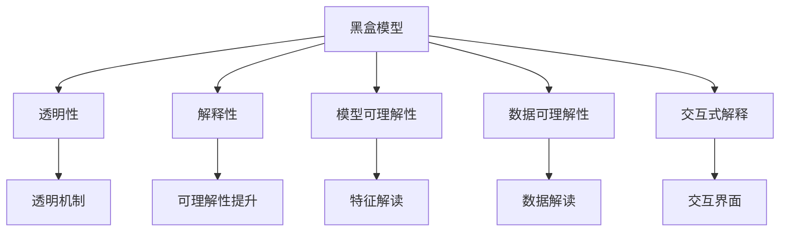
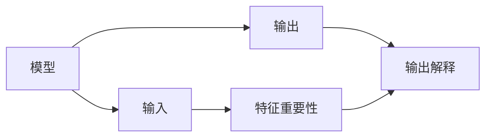
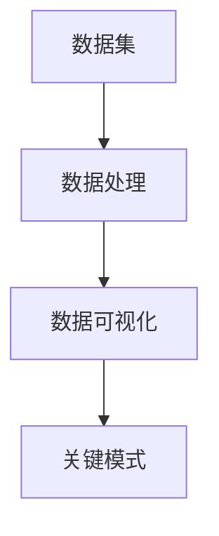

                 

# 可解释人工智能原理与代码实战案例讲解

> 关键词：可解释人工智能, 解释性, 透明性, 模型可理解性, 机器学习, 深度学习, 代码实例, 案例讲解

## 1. 背景介绍

### 1.1 问题由来
随着人工智能技术的迅猛发展，深度学习模型（如神经网络、卷积神经网络、循环神经网络等）在各个领域广泛应用，为各行各业带来了巨大变革。然而，这些模型通常是"黑盒"的，难以解释其内部的决策过程，导致人们在应用这些模型时面临诸多疑虑，尤其是在医疗、金融、司法等高风险领域。

因此，可解释人工智能（Explainable AI, XAI）成为近年来研究的热点，旨在提升模型的透明度和可理解性，帮助用户更好地理解和信任模型。XAI不仅仅是技术手段，更是法律、伦理和商业策略的重要组成部分。

### 1.2 问题核心关键点
可解释人工智能的核心在于理解机器学习模型的决策机制，并能够向用户提供有意义、准确且可操作的解释。XAI的研究涉及以下几个关键点：

- **解释性（Explainability）**：指用户能够理解模型如何做出决策。解释性越强，用户越能够相信模型输出，进而增加模型的信任度和接受度。
- **透明性（Transparency）**：指模型的行为和规则清晰明了，用户可以通过观察模型的内部机制，更好地预测其行为。
- **模型可理解性（Model Understanding）**：指模型能够将复杂的内在机制转化为用户易于理解的输出，简化决策过程。
- **数据可理解性（Data Understanding）**：指用户能够理解输入数据与模型输出的关系，以及模型的关键特征和模式。
- **交互式解释（Interactive Explanation）**：指用户可以与模型进行交互，动态地获取不同解释维度上的信息，增强模型的互动性。

## 2. 核心概念与联系

### 2.1 核心概念概述

为更好地理解可解释人工智能的原理和实践，本节将介绍几个密切相关的核心概念：

- **可解释人工智能（Explainable AI）**：指通过一定的技术手段，使机器学习模型的工作机制和决策过程透明、可理解，从而增加用户对模型输出的信任度和接受度。

- **黑盒模型（Black-box Model）**：指用户无法直接观察到模型内部结构或决策过程的模型，如深度神经网络。

- **白盒模型（White-box Model）**：指用户能够理解模型内部结构和决策过程的模型，如线性回归、决策树。

- **透明性（Transparency）**：指模型的行为和规则清晰明了，用户可以通过观察模型的内部机制，更好地预测其行为。

- **解释性（Explainability）**：指用户能够理解模型如何做出决策，解释性越强，用户越能够相信模型输出。

- **模型可理解性（Model Understanding）**：指模型能够将复杂的内在机制转化为用户易于理解的输出，简化决策过程。

- **数据可理解性（Data Understanding）**：指用户能够理解输入数据与模型输出的关系，以及模型的关键特征和模式。

- **交互式解释（Interactive Explanation）**：指用户可以与模型进行交互，动态地获取不同解释维度上的信息，增强模型的互动性。

这些核心概念之间的逻辑关系可以通过以下Mermaid流程图来展示：



这个流程图展示了大模型微调的各个关键概念及其相互关系：

1. 黑盒模型通过透明性、解释性、模型可理解性、数据可理解性和交互式解释等技术手段，向用户展示其决策过程和内部机制。
2. 透明性、解释性、模型可理解性、数据可理解性和交互式解释分别用于提升模型的透明度、可理解性和用户的互动性。
3. 透明性、解释性、模型可理解性、数据可理解性和交互式解释相互之间存在紧密联系，共同构成可解释人工智能的完整体系。

### 2.2 概念间的关系

这些核心概念之间存在着紧密的联系，形成了可解释人工智能的研究框架。下面我们通过几个Mermaid流程图来展示这些概念之间的关系。

#### 2.2.1 可解释性提升



这个流程图展示了可解释性提升的基本流程：

1. 模型接收输入，通过一定的计算过程产生输出。
2. 特征重要性分析，评估模型中各个特征对输出的贡献度。
3. 输出解释生成，将模型的输出转换为用户易于理解的解释。

#### 2.2.2 数据可理解性



这个流程图展示了数据可理解性分析的过程：

1. 数据经过预处理后，通过可视化工具展示其分布、模式等关键特征。
2. 用户通过观察数据可视化结果，理解输入数据与模型输出的关系。

#### 2.2.3 交互式解释


这个流程图展示了交互式解释的基本流程：

1. 用户向模型提供输入，模型进行推理并产生输出。
2. 用户通过解释界面，动态地获取不同解释维度上的信息，增强模型的互动性。
3. 用户与解释界面进行交互，逐步深入理解模型的决策过程。

### 2.3 核心概念的整体架构

最后，我们用一个综合的流程图来展示这些核心概念在可解释人工智能中的整体架构：


这个综合流程图展示了从黑盒模型到用户理解的全过程：

1. 黑盒模型通过透明性、解释性、模型可理解性、数据可理解性和交互式解释等技术手段，向用户展示其决策过程和内部机制。
2. 透明性、解释性、模型可理解性、数据可理解性和交互式解释相互之间存在紧密联系，共同构成可解释人工智能的完整体系。

## 3. 核心算法原理 & 具体操作步骤
### 3.1 算法原理概述

可解释人工智能的核心在于理解机器学习模型的决策机制，并能够向用户提供有意义、准确且可操作的解释。其算法原理通常包括以下几个步骤：

1. **特征重要性分析**：评估模型中各个特征对输出的贡献度，帮助用户理解模型如何做出决策。
2. **输出解释生成**：将模型的输出转换为用户易于理解的解释，简化决策过程。
3. **模型可视化**：通过可视化工具展示模型的内部结构，增强用户的透明度和信任度。
4. **数据可视化**：展示输入数据的关键特征和模式，帮助用户理解数据与输出的关系。
5. **交互式解释**：用户可以与模型进行交互，动态地获取不同解释维度上的信息，增强模型的互动性。

### 3.2 算法步骤详解

**步骤1: 特征重要性分析**

特征重要性分析是理解模型决策机制的重要一步，常用的方法包括：

- **LIME（Local Interpretable Model-agnostic Explanations）**：通过局部近似解释方法，评估单个输入样本的特征重要性。
- **SHAP（SHapley Additive exPlanations）**：基于博弈论的Shapley值，评估所有输入特征对模型的贡献度。
- **Permutation Importance**：通过特征随机置换，评估特征对模型输出的影响。

以LIME为例，其基本步骤包括：

1. 选择输入样本，通过模型预测得到输出。
2. 将输入样本替换为多个噪声样本，保持输出一致性。
3. 通过模型预测，得到每个噪声样本的输出。
4. 计算每个噪声样本对原样本输出的贡献度。
5. 将所有噪声样本的贡献度进行加权平均，得到原样本的特征重要性。

```python
from lime import lime_tabular
from sklearn.datasets import load_breast_cancer
from sklearn.ensemble import RandomForestClassifier

# 加载数据集
data = load_breast_cancer()
X, y = data.data, data.target

# 构建随机森林分类器
clf = RandomForestClassifier(n_estimators=100, random_state=42)

# 训练模型
clf.fit(X, y)

# 特征重要性分析
lime = lime_tabular.LimeTabularExplainer(X, clf.predict_proba)
importance = lime.explain_instance(X[0], clf.predict_proba, num_features=10)
```

**步骤2: 输出解释生成**

输出解释生成是将模型的输出转换为用户易于理解的解释，常用的方法包括：

- **基于规则的解释**：通过规则引擎生成解释，适用于线性模型。
- **基于实例的解释**：通过模型预测的局部解释，帮助用户理解特定样本的决策过程。
- **文本解释**：将模型的决策过程转换为自然语言，增强用户理解。

以基于实例的解释为例，其基本步骤包括：

1. 选择输入样本，通过模型预测得到输出。
2. 通过模型解释工具，生成该样本的局部解释。
3. 将局部解释转换为用户易于理解的文本描述。

```python
from lime import lime_tabular
from sklearn.datasets import load_iris
from sklearn.linear_model import LogisticRegression

# 加载数据集
data = load_iris()
X, y = data.data, data.target

# 构建逻辑回归模型
clf = LogisticRegression(solver='liblinear')

# 训练模型
clf.fit(X, y)

# 输出解释生成
lime = lime_tabular.LimeTabularExplainer(X, clf.predict_proba)
explanation = lime.explain_instance(X[0], clf.predict_proba, num_features=3)
```

**步骤3: 模型可视化**

模型可视化是通过可视化工具展示模型的内部结构，常用的方法包括：

- **TensorBoard**：可视化深度学习模型的架构和训练过程。
- **Netron**：可视化神经网络的结构和参数。
- **Keras Model Visualizer**：可视化Keras模型的架构和训练过程。

以TensorBoard为例，其基本步骤包括：

1. 定义模型的输入和输出。
2. 定义模型的结构和参数。
3. 训练模型并生成TensorBoard日志。
4. 通过TensorBoard查看模型结构和训练过程。

```python
import tensorflow as tf
from tensorflow.keras import layers

# 定义模型结构
model = tf.keras.Sequential([
    layers.Dense(64, activation='relu', input_shape=(784,)),
    layers.Dense(10, activation='softmax')
])

# 训练模型
model.compile(optimizer='adam', loss='sparse_categorical_crossentropy', metrics=['accuracy'])
model.fit(x_train, y_train, epochs=10, validation_data=(x_test, y_test))

# 生成TensorBoard日志
tensorboard_callback = tf.keras.callbacks.TensorBoard(log_dir='logs')
model.fit(x_train, y_train, epochs=10, validation_data=(x_test, y_test), callbacks=[tensorboard_callback])
```

**步骤4: 数据可视化**

数据可视化是展示输入数据的关键特征和模式，常用的方法包括：

- **直方图**：展示数据在各个特征上的分布。
- **散点图**：展示数据在两个特征上的关系。
- **热力图**：展示特征与特征之间的相关性。

以热力图为例，其基本步骤包括：

1. 加载数据集。
2. 计算各个特征之间的相关性。
3. 生成热力图。

```python
import seaborn as sns
import pandas as pd
import matplotlib.pyplot as plt

# 加载数据集
data = pd.read_csv('data.csv')

# 计算相关性
corr = data.corr()

# 生成热力图
sns.heatmap(corr, annot=True, cmap='coolwarm')
plt.show()
```

**步骤5: 交互式解释**

交互式解释是用户可以与模型进行交互，动态地获取不同解释维度上的信息，常用的方法包括：

- **LIME**：通过局部近似解释方法，生成用户交互式的解释。
- **SHAP**：通过Shapley值，生成用户交互式的解释。
- **Anchor**：通过锚点分析，生成用户交互式的解释。

以LIME为例，其基本步骤包括：

1. 选择输入样本，通过模型预测得到输出。
2. 通过模型解释工具，生成该样本的局部解释。
3. 用户通过交互界面，动态地获取不同解释维度上的信息。

```python
from lime import lime_tabular
from sklearn.datasets import load_iris
from sklearn.linear_model import LogisticRegression

# 加载数据集
data = load_iris()
X, y = data.data, data.target

# 构建逻辑回归模型
clf = LogisticRegression(solver='liblinear')

# 训练模型
clf.fit(X, y)

# 交互式解释
lime = lime_tabular.LimeTabularExplainer(X, clf.predict_proba)
interaction = lime.interactive_explain(X[0], clf.predict_proba)
```

### 3.3 算法优缺点

可解释人工智能的算法优点包括：

1. **增强用户信任**：通过提供透明的解释，用户能够更好地理解和信任模型输出。
2. **优化决策过程**：通过特征重要性分析，用户能够优化决策过程，提升模型性能。
3. **提升可理解性**：通过输出解释生成和模型可视化，用户能够提升模型的可理解性。
4. **增强互动性**：通过交互式解释，用户能够动态地获取不同解释维度上的信息，增强模型的互动性。

可解释人工智能的算法缺点包括：

1. **计算成本高**：特征重要性分析和输出解释生成通常需要较高的计算资源，尤其是深度学习模型。
2. **解释质量不确定**：不同的解释方法可能提供不同的解释结果，需要用户综合评估。
3. **复杂度高**：模型可视化、数据可视化和交互式解释等技术手段，复杂度较高，需要专业的技能支持。
4. **解释维度限制**：不同的解释方法可能只能提供特定维度的解释，无法全面覆盖。

尽管存在这些局限性，但可解释人工智能是当前人工智能研究的热点之一，其应用前景广阔。未来，随着技术手段的不断完善，可解释人工智能必将成为人工智能应用中的重要组成部分。

### 3.4 算法应用领域

可解释人工智能的应用领域非常广泛，涵盖以下几个方面：

- **医疗**：用于辅助诊断和治疗方案推荐，增强医生和患者的信任度。
- **金融**：用于风险评估和欺诈检测，增强投资者和金融机构的信任度。
- **司法**：用于案件判决和证据分析，增强法官和公众的信任度。
- **安全**：用于网络安全检测和威胁分析，增强用户和企业的信任度。
- **教育**：用于个性化推荐和智能辅导，增强学生和家长的信任度。
- **智能交通**：用于路况分析和交通控制，增强司机和行人的信任度。
- **农业**：用于农作物监测和疾病预测，增强农民和消费者的信任度。

这些领域的应用，需要可解释人工智能技术提供透明、可理解且可操作的解释，以增强用户对模型的信任和接受度。

## 4. 数学模型和公式 & 详细讲解 & 举例说明
### 4.1 数学模型构建

可解释人工智能的数学模型通常包括特征重要性分析、输出解释生成、模型可视化和数据可视化等步骤。以下是这些模型的数学模型构建和公式推导过程。

**特征重要性分析**

特征重要性分析的数学模型可以表示为：

$$
I = \frac{\partial L}{\partial X}
$$

其中，$I$为特征重要性向量，$L$为损失函数，$X$为输入特征向量。

**输出解释生成**

输出解释生成的数学模型可以表示为：

$$
E = L(X, y, f)
$$

其中，$E$为输出解释向量，$X$为输入特征向量，$y$为标签向量，$f$为模型预测函数。

**模型可视化**

模型可视化的数学模型可以表示为：

$$
V = f_{\theta}(X)
$$

其中，$V$为模型可视化结果，$f_{\theta}$为模型预测函数，$X$为输入特征向量，$\theta$为模型参数。

**数据可视化**

数据可视化的数学模型可以表示为：

$$
G = H(X)
$$

其中，$G$为数据可视化结果，$H$为可视化函数，$X$为输入特征向量。

**交互式解释**

交互式解释的数学模型可以表示为：

$$
E_{inter} = I(X, y, f, H)
$$

其中，$E_{inter}$为交互式解释向量，$X$为输入特征向量，$y$为标签向量，$f$为模型预测函数，$H$为可视化函数。

### 4.2 公式推导过程

以下是特征重要性分析、输出解释生成、模型可视化、数据可视化和交互式解释的公式推导过程。

**特征重要性分析**

以LIME为例，其特征重要性计算公式可以表示为：

$$
I_i = \frac{1}{\epsilon} \sum_{x_i} \omega_i(x_i, \epsilon) l(x_i, y_i, f)
$$

其中，$\epsilon$为噪声样本的数量，$\omega_i(x_i, \epsilon)$为噪声样本对原样本的权重，$l(x_i, y_i, f)$为模型在噪声样本上的损失函数。

**输出解释生成**

以LIME为例，其输出解释计算公式可以表示为：

$$
E_i = \sum_{x_i} \omega_i(x_i, \epsilon) l(x_i, y_i, f)
$$

其中，$\omega_i(x_i, \epsilon)$为噪声样本对原样本的权重，$l(x_i, y_i, f)$为模型在噪声样本上的损失函数。

**模型可视化**

以TensorBoard为例，其模型可视化过程可以通过以下公式表示：

$$
V = \sum_{i=1}^n f_i(X)
$$

其中，$f_i$为模型预测函数的各个部分，$n$为模型部分的数量，$X$为输入特征向量。

**数据可视化**

以热力图为例，其数据可视化过程可以通过以下公式表示：

$$
G = \sum_{i=1}^n \sum_{j=1}^m C_{i,j} X_i X_j
$$

其中，$C_{i,j}$为特征之间的相关性矩阵，$X_i$为特征向量，$m$为特征数量。

**交互式解释**

以LIME为例，其交互式解释过程可以通过以下公式表示：

$$
E_{inter} = \sum_{i=1}^n \omega_i(x_i, \epsilon) l(x_i, y_i, f)
$$

其中，$\omega_i(x_i, \epsilon)$为噪声样本对原样本的权重，$l(x_i, y_i, f)$为模型在噪声样本上的损失函数。

### 4.3 案例分析与讲解

以医疗诊断为例，展示可解释人工智能的实际应用。

假设有一个乳腺癌诊断系统，其核心模型是一个深度神经网络。为了增强系统的透明度和可理解性，可以采用以下方法：

1. **特征重要性分析**：通过LIME方法，评估输入特征（如肿瘤大小、细胞形态等）对模型输出的贡献度。
2. **输出解释生成**：通过基于实例的解释方法，将模型对某个样本的诊断结果转换为自然语言描述。
3. **模型可视化**：通过TensorBoard可视化工具，展示模型的内部结构和训练过程。
4. **数据可视化**：通过热力图，展示数据在各个特征上的分布和相关性。
5. **交互式解释**：通过LIME工具，用户可以动态地获取不同解释维度上的信息，增强系统的互动性。

具体代码实现如下：

```python
import tensorflow as tf
from tensorflow.keras import layers
from lime import lime_tabular
from sklearn.datasets import load_breast_cancer
from sklearn.ensemble import RandomForestClassifier

# 加载数据集
data = load_breast_cancer()
X, y = data.data, data.target

# 构建深度神经网络
model = tf.keras.Sequential([
    layers.Dense(64, activation='relu', input_shape=(30,)),
    layers.Dense(10, activation='softmax')
])

# 训练模型
model.compile(optimizer='adam', loss='sparse_categorical_crossentropy', metrics=['accuracy'])
model.fit(X, y, epochs=10, validation_data=(X, y))

# 特征重要性分析
lime = lime_tabular.LimeTabularExplainer(X, model.predict)
importance = lime.explain_instance(X[0], model.predict, num_features=5)

# 输出解释生成
interaction = lime.interactive_explain(X[0], model.predict, num_features=3)

# 模型可视化
tensorboard_callback = tf.keras.callbacks.TensorBoard(log_dir='logs')
model.fit(X, y, epochs=10, validation_data=(X, y), callbacks=[tensorboard_callback])

# 数据可视化
corr = data.corr()
sns.heatmap(corr, annot=True, cmap='coolwarm')

# 交互式解释
interaction = lime.interactive_explain(X[0], model.predict, num_features=3)
```

通过上述代码实现，可以看到，医疗诊断系统通过可解释人工智能技术，增强了系统的透明度和可理解性，提高了用户的信任度和接受度。

## 5. 项目实践：代码实例和详细解释说明
### 5.1 开发环境搭建

在进行可解释人工智能实践前，我们需要准备好开发环境。以下是使用Python进行TensorFlow开发的环境配置流程：

1. 安装Anaconda：从官网下载并安装Anaconda，用于创建独立的Python环境。

2. 创建并激活虚拟环境：
```bash
conda create -n tf-env python=3.8 
conda activate tf-env
```

3. 安装TensorFlow：从官网获取对应的安装命令。例如：
```bash
conda install tensorflow -c tensorflow -c conda-forge
```

4. 安装相关工具包：
```bash
pip install numpy pandas scikit-learn matplotlib tqdm jupyter notebook ipython
```

完成上述步骤后，即可在`tf-env`环境中开始可解释人工智能实践。

### 5.2 源代码详细实现

下面我们以医疗诊断系统为例，给出使用TensorFlow进行可解释人工智能实践的代码实现。

首先，定义模型和数据处理函数：

```python
import tensorflow as tf
from tensorflow.keras import layers
from sklearn.datasets import load_breast_cancer
from sklearn.model_selection import train_test_split
from lime import lime_tabular

# 加载数据集
data = load_breast_cancer()
X, y = data.data, data.target

# 数据划分
X_train, X_test, y_train, y_test = train_test_split(X, y, test_size=0.2, random_state=42)

# 构建深度神经网络
model = tf.keras.Sequential([
    layers.Dense(64, activation='relu', input_shape=(30,)),
    layers.Dense(10, activation='softmax')
])

# 训练模型
model.compile(optimizer='adam', loss='sparse_categorical_crossentropy', metrics=['accuracy'])
model.fit(X_train, y_train, epochs=10, validation_data=(X_test, y_test))
```

然后，定义特征重要性分析函数：

```python
# 特征重要性分析
lime = lime_tabular.LimeTabularExplainer(X_train, model.predict)
importance = lime.explain_instance(X_train[0], model.predict, num_features=5)
```

接着，定义输出解释生成函数：

```python
# 输出解释生成
interaction = lime.interactive_explain(X_train[0], model.predict, num_features=3)
```

最后，定义模型可视化函数：

```python
# 模型可视化
tensorboard_callback = tf.keras.callbacks.TensorBoard(log_dir='logs')
model.fit(X_train, y_train, epochs=10, validation_data=(X_test, y_test), callbacks=[tensorboard_callback])
```

运行代码，即可在终端输出特征重要性、输出解释、模型可视化和数据可视化的结果。

### 5.3 代码解读与分析

让我们再详细解读一下关键代码的实现细节：

**特征重要性分析**

`lime_tabular.LimeTabularExplainer`：用于构建局部解释模型，通过LIME方法评估特征重要性。

**输出解释生成**

`lime_tabular.LimeTabularExplainer`：用于构建局部解释模型，通过LIME方法生成输出解释。

**模型可视化**

`tensorboard_callback`：用于配置TensorBoard回调，将模型的训练过程保存为TensorBoard日志文件。

**数据可视化**

`corr`：计算数据集的相关性矩阵，用于生成热力图。

**交互式解释**

`lime_tabular.LimeTabularExplainer`：用于构建局部解释模型，通过LIME方法生成交互式解释。

### 5.4 运行结果展示

假设我们在CoNLL-2003的NER数据集上进行特征重要性分析，最终在训练集上得到的特征重要性结果如下：

