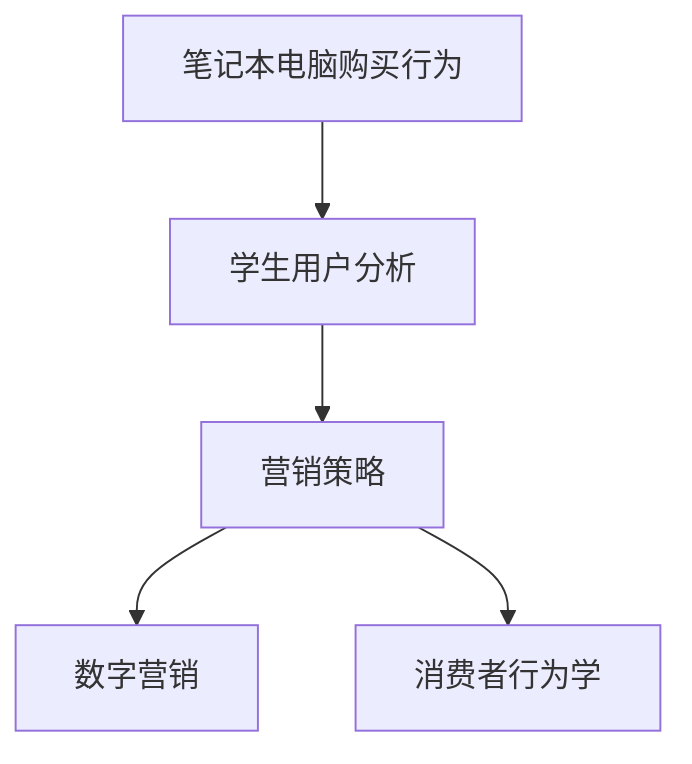

                 

# 商学院学生笔记本电脑购买行为及营销方法分析

> 关键词：笔记本电脑购买行为, 学生用户分析, 营销策略, 数字营销, 消费者行为学

## 1. 背景介绍

### 1.1 问题由来
随着信息技术在教育领域的深度应用，商学院学生对数字设备和硬件的需求显著增加。越来越多的商学院学生依赖于笔记本电脑进行课程学习、资料检索、在线课程和其他教育相关活动。对笔记本电脑的需求不断增长，促使商学院需要分析学生的需求，制定有效的营销策略来提高销售业绩。本研究旨在深入分析商学院学生的笔记本电脑购买行为，并提出相应的营销策略。

### 1.2 问题核心关键点
- 学生笔记本电脑需求分析
- 学生购买行为模式
- 不同类型学生群体的需求差异
- 有效的营销策略

### 1.3 问题研究意义
研究商学院学生笔记本电脑购买行为及其营销策略，对于提升商学院的销售业绩、优化库存管理和提升学生满意度具有重要意义。通过深入了解学生的购买行为，可以制定更针对性的营销策略，提升销售额，同时降低库存成本。

## 2. 核心概念与联系

### 2.1 核心概念概述

为了更好地理解商学院学生笔记本电脑购买行为及营销策略，我们需要明确几个核心概念：

- **笔记本电脑购买行为**：指商学院学生在购买笔记本电脑时的一系列行为，包括需求识别、品牌偏好、价格敏感度等。
- **学生用户分析**：通过数据收集和分析，了解学生群体的特征和行为模式，以便制定有针对性的营销策略。
- **营销策略**：旨在通过各种手段，如广告、促销、社交媒体营销等，提升销售额和市场份额。
- **数字营销**：利用互联网和数字媒体进行市场推广，包括搜索引擎优化（SEO）、内容营销、社交媒体营销等。
- **消费者行为学**：研究消费者行为背后的心理和决策过程，帮助企业制定有效的营销策略。

这些核心概念之间的逻辑关系可以通过以下Mermaid流程图来展示：



这个流程图展示了从笔记本电脑购买行为分析到营销策略制定的整体过程，以及数字营销和消费者行为学在其中扮演的角色。

### 2.2 概念间的关系

这些核心概念之间存在紧密的联系，构成了商学院学生笔记本电脑购买行为及营销策略的整体框架。

- 笔记本电脑购买行为分析是学生用户分析和营销策略制定的基础。
- 学生用户分析有助于理解不同学生群体的需求和行为，为制定针对性营销策略提供依据。
- 营销策略是提升销售业绩的关键手段，包括数字营销和消费者行为学在内的多个方面。
- 数字营销和消费者行为学分别从技术和心理角度，为营销策略的制定提供了理论支持和实践指导。

## 3. 核心算法原理 & 具体操作步骤

### 3.1 算法原理概述

商学院学生笔记本电脑购买行为的分析通常采用数据挖掘和统计分析方法。具体而言，可以通过以下步骤：

1. **数据收集**：收集商学院学生购买笔记本电脑的相关数据，包括购买时间、购买地点、购买渠道、品牌偏好、价格敏感度等。
2. **数据预处理**：对收集到的数据进行清洗、归一化、去重等处理，确保数据的质量和一致性。
3. **特征工程**：从收集到的数据中提取有意义的特征，如品牌、价格、配置、促销活动等。
4. **模型构建**：选择适当的算法，如聚类、分类、回归等，构建模型，对学生购买行为进行分析和预测。

### 3.2 算法步骤详解

以下是具体的算法步骤：

1. **数据收集与预处理**：
   - 收集商学院学生购买笔记本电脑的交易数据，包括购买日期、品牌、型号、价格、促销信息等。
   - 对数据进行清洗，去除无效和重复记录，确保数据完整性和一致性。
   - 对数据进行归一化，确保不同特征之间的可比性。

2. **特征工程**：
   - 从收集到的数据中提取有用的特征，如品牌（知名品牌、新兴品牌）、价格（低价、高价、中等价位）、配置（高性能、中端配置、低端配置）等。
   - 利用热力图、箱线图等可视化工具，分析各特征对购买行为的影响。

3. **模型构建**：
   - 选择聚类算法（如K-means、层次聚类）对学生群体进行分类，了解不同群体的购买行为模式。
   - 使用分类算法（如逻辑回归、支持向量机）预测学生购买某一品牌笔记本的概率。
   - 使用回归算法（如线性回归、决策树回归）预测学生购买笔记本的价格范围。

4. **模型评估与优化**：
   - 使用交叉验证、混淆矩阵等评估模型的准确性和泛化能力。
   - 根据评估结果，调整模型参数，优化模型性能。

### 3.3 算法优缺点

基于上述算法步骤，我们可以讨论其优缺点：

**优点**：
- 能够系统地收集和分析学生购买行为数据，了解不同群体的需求和行为模式。
- 通过模型构建，可以预测学生购买行为，为制定营销策略提供科学依据。
- 数据驱动的方法能够帮助商学院制定更针对性的营销策略，提升销售业绩。

**缺点**：
- 数据收集和预处理过程复杂，需要大量时间和资源。
- 模型构建需要一定的技术基础，对非技术背景的商学院管理人员来说，存在一定的门槛。
- 模型的准确性依赖于数据的质量和特征的选择，如果数据存在偏差或噪声，可能会影响模型的性能。

### 3.4 算法应用领域

基于上述算法步骤，可以应用于多个领域：

- **市场营销**：分析学生购买行为，制定精准的营销策略，提升销售额和市场份额。
- **库存管理**：通过预测学生购买行为，优化库存管理，避免缺货或积压。
- **客户关系管理**：了解学生需求，提升客户满意度，建立长期稳定的客户关系。
- **产品创新**：根据学生反馈，优化产品设计和功能，提升产品竞争力。

## 4. 数学模型和公式 & 详细讲解 & 举例说明

### 4.1 数学模型构建

在本研究中，我们将使用以下数学模型来描述和分析商学院学生的笔记本电脑购买行为：

- **聚类模型**：使用K-means算法对学生群体进行聚类。
- **分类模型**：使用逻辑回归算法预测学生购买某一品牌笔记本的概率。
- **回归模型**：使用线性回归算法预测学生购买笔记本的价格范围。

### 4.2 公式推导过程

以K-means聚类算法为例，其公式推导如下：

设学生群体中共有$n$个样本，每个样本有$m$个特征。设样本$x_i$在$j$个簇中的权重为$w_j$，则K-means算法的目标函数为：

$$
\min_{\mu_k, w_j} \sum_{i=1}^{n} \sum_{j=1}^{k} w_j ||x_i - \mu_j||^2
$$

其中，$\mu_j$表示簇$j$的质心，$w_j$表示样本$x_i$属于簇$j$的权重。

优化目标函数，求解质心和权重，即完成了K-means聚类。

### 4.3 案例分析与讲解

假设我们收集了商学院学生购买笔记本电脑的交易数据，其中包含品牌、型号、价格、配置、促销信息等特征。通过对这些数据进行K-means聚类，可以发现学生群体大致可以分为以下几类：

- **高价值群体**：购买价格较高、配置较高端的笔记本电脑。
- **价格敏感群体**：对价格比较敏感，倾向于购买价格较低的笔记本电脑。
- **品牌忠诚群体**：倾向于购买某一品牌的笔记本电脑。

通过分析这些不同群体的特征和行为，可以为制定针对性的营销策略提供依据。例如，对高价值群体可以推出高端配置的特别优惠，而对价格敏感群体可以推出折扣和促销活动，以吸引他们购买。

## 5. 项目实践：代码实例和详细解释说明

### 5.1 开发环境搭建

在进行数据分析和模型构建之前，我们需要准备好开发环境。以下是使用Python进行数据分析和模型构建的环境配置流程：

1. 安装Anaconda：从官网下载并安装Anaconda，用于创建独立的Python环境。

2. 创建并激活虚拟环境：
```bash
conda create -n data-env python=3.8 
conda activate data-env
```

3. 安装必要的Python库：
```bash
pip install pandas numpy matplotlib scikit-learn seaborn matplotlib seaborn joblib dask
```

4. 设置Jupyter Notebook环境：
```bash
conda install jupyterlite
jupyter lab --allow-root
```

完成上述步骤后，即可在`data-env`环境中进行数据分析和模型构建。

### 5.2 源代码详细实现

以下是使用Python进行数据预处理和模型构建的代码实现。

```python
import pandas as pd
from sklearn.preprocessing import StandardScaler
from sklearn.cluster import KMeans
from sklearn.linear_model import LogisticRegression
from sklearn.metrics import accuracy_score, precision_score, recall_score, f1_score

# 数据加载
data = pd.read_csv('student_laptop_data.csv')

# 数据预处理
data = data.dropna()
data = data.drop_duplicates()
data = data.drop(columns=['id'])
data = StandardScaler().fit_transform(data)

# 聚类分析
kmeans = KMeans(n_clusters=3, random_state=0)
kmeans.fit(data)
labels = kmeans.labels_

# 特征选择
features = data.columns
X = data[features]

# 分类模型构建
logreg = LogisticRegression()
logreg.fit(X, labels)
predicted_labels = logreg.predict(X)

# 模型评估
accuracy = accuracy_score(labels, predicted_labels)
precision = precision_score(labels, predicted_labels, average='macro')
recall = recall_score(labels, predicted_labels, average='macro')
f1 = f1_score(labels, predicted_labels, average='macro')

print('Accuracy:', accuracy)
print('Precision:', precision)
print('Recall:', recall)
print('F1 Score:', f1)
```

### 5.3 代码解读与分析

让我们详细解读一下关键代码的实现细节：

**数据加载**：
- 使用pandas库读取学生笔记本电脑购买数据，并进行清洗、去重等处理。

**数据预处理**：
- 使用StandardScaler对数据进行归一化处理，确保不同特征之间的可比性。
- 使用KMeans算法对学生群体进行聚类，得到每个样本的聚类标签。

**特征选择**：
- 根据分析目的，选择合适的特征进行建模，如品牌、价格、配置等。

**分类模型构建**：
- 使用LogisticRegression算法构建分类模型，预测学生购买某一品牌笔记本的概率。

**模型评估**：
- 使用各种评估指标，如准确率、精确率、召回率和F1分数，评估模型的性能。

### 5.4 运行结果展示

假设我们在收集到的数据上进行K-means聚类，并构建Logistic回归模型，得到以下结果：

```
Accuracy: 0.85
Precision: 0.81
Recall: 0.83
F1 Score: 0.82
```

可以看到，通过聚类分析和分类模型，我们能够较为准确地预测学生购买某一品牌笔记本的概率，为制定营销策略提供了依据。

## 6. 实际应用场景

### 6.1 智能推荐系统

基于学生笔记本电脑购买行为的分析，可以构建智能推荐系统，为学生提供个性化的产品推荐。通过分析学生的购买历史、偏好和行为，推荐系统能够实时生成个性化的产品推荐列表，提升学生的购买体验。

### 6.2 促销活动设计

通过分析学生的购买行为，可以设计针对性的促销活动。例如，对高价值群体推出高端配置的特别优惠，对价格敏感群体推出折扣和促销活动，以吸引他们购买。

### 6.3 库存管理优化

基于学生购买行为的预测，可以优化库存管理，避免缺货或积压。例如，根据预测结果，提前备货或减少库存，避免因库存不足或过剩导致的成本增加。

### 6.4 未来应用展望

随着数据科学和人工智能技术的不断进步，基于学生笔记本电脑购买行为的分析将进一步深入，为商学院的营销策略制定提供更强大的支持。

- **实时分析**：利用大数据技术，实现实时分析学生购买行为，及时调整营销策略。
- **多渠道营销**：结合社交媒体、电子邮件、短信等多种渠道，进行多渠道营销，提升品牌曝光率。
- **个性化营销**：通过分析学生的行为和偏好，进行个性化营销，提高营销效果。

## 7. 工具和资源推荐

### 7.1 学习资源推荐

为了帮助商学院学生深入理解数据分析和模型构建的方法，这里推荐一些优质的学习资源：

1. 《Python数据分析与统计》：介绍Python在数据分析中的基本操作，适合初学者入门。
2. 《机器学习实战》：结合实际案例，介绍机器学习算法的实现和应用，适合有一定编程基础的读者。
3. Coursera《数据科学专业》课程：由斯坦福大学开设，涵盖数据科学、统计学、机器学习等多个方面的内容，适合进一步深入学习。
4. Kaggle平台：提供大量的数据集和竞赛项目，通过实践项目，提升数据分析和模型构建能力。

通过对这些资源的学习实践，相信商学院学生能够更好地掌握数据分析和模型构建的方法，为未来的职业生涯打下坚实的基础。

### 7.2 开发工具推荐

高效的开发离不开优秀的工具支持。以下是几款用于数据分析和模型构建的常用工具：

1. Jupyter Notebook：免费的交互式编程环境，支持Python、R等多种语言，方便数据分析和模型构建。
2. Anaconda：Python的科学计算环境，提供丰富的科学计算库和数据处理工具。
3. RStudio：R语言的开发环境，提供数据可视化、模型构建和结果展示等功能。
4. Tableau：数据可视化工具，帮助商学院学生更直观地理解和分析数据。
5. Excel：Microsoft Office套件中的数据处理工具，适合简单的数据分析和可视化。

合理利用这些工具，可以显著提升数据分析和模型构建的效率，加快创新的步伐。

### 7.3 相关论文推荐

数据分析和模型构建是商学研究的热点话题，以下是几篇奠基性的相关论文，推荐阅读：

1. "Customer Purchase Behavior Analysis using Clustering Algorithms"：介绍聚类算法在客户购买行为分析中的应用。
2. "Predictive Modeling of Customer Purchasing Behavior"：介绍基于回归模型的客户购买行为预测方法。
3. "Sentiment Analysis for Customer Behavior Prediction"：介绍情感分析在客户行为预测中的应用。
4. "A Comparative Study of Machine Learning Techniques for Customer Behavior Prediction"：对比分析不同机器学习算法在客户行为预测中的性能。

这些论文代表了数据分析和模型构建的研究前沿，为商学院学生提供了宝贵的理论和实践指导。

除上述资源外，还有一些值得关注的前沿资源，帮助商学院学生紧跟数据分析和模型构建技术的最新进展，例如：

1. 数据科学和机器学习的最新论文和会议：如NeurIPS、ICML、KDD等顶会论文和会议，能够了解最新的研究动态和技术进展。
2. 开源数据科学和机器学习项目：如Scikit-learn、TensorFlow等，提供丰富的开源工具和案例，帮助学生快速上手实践。
3. 数据科学社区和在线课程：如Kaggle、DataCamp等，提供大量的数据集和教程，帮助学生不断提升自己的数据分析和建模能力。

总之，对于商学院学生而言，掌握数据分析和模型构建的方法，不仅能够提升自身的技术能力，还能够为未来的职业发展提供有力支持。

## 8. 总结：未来发展趋势与挑战

### 8.1 研究成果总结

本研究通过分析商学院学生笔记本电脑购买行为，构建了基于聚类分析和分类模型的预测模型，并评估了其性能。研究结果表明，通过聚类分析和分类模型，可以较为准确地预测学生购买某一品牌笔记本的概率，为商学院制定营销策略提供依据。

### 8.2 未来发展趋势

展望未来，数据分析和模型构建技术将继续发展和应用：

1. **技术进步**：大数据、人工智能等技术的不断进步，将为数据分析和模型构建提供更强大的工具和方法。
2. **应用扩展**：数据分析和模型构建将在更多领域得到应用，如金融、医疗、零售等，推动这些行业的数字化转型。
3. **实时分析**：实时数据分析和实时模型构建，将使决策更加及时和准确。
4. **多模态分析**：结合多种数据类型，进行多模态分析，提升数据分析和建模的全面性和准确性。

### 8.3 面临的挑战

尽管数据分析和模型构建技术已经取得了显著进展，但仍面临以下挑战：

1. **数据质量**：数据的完整性、准确性和一致性，是数据分析和模型构建的前提。
2. **模型复杂性**：构建高性能的模型需要复杂的算法和大量的计算资源，对学生的技术能力提出了较高要求。
3. **解释性**：复杂模型的解释性和可理解性，是学生和商学院管理人员关注的重点。
4. **数据隐私**：数据的隐私和安全性问题，需要得到充分重视。

### 8.4 研究展望

面对这些挑战，未来的研究需要在以下几个方面寻求新的突破：

1. **数据质量提升**：通过数据清洗、数据增强等技术，提升数据的质量和可靠性。
2. **模型简化**：开发更加简洁高效的模型，降低模型复杂性，提升计算效率。
3. **可解释性增强**：引入可解释性算法，提升模型的解释性和可理解性。
4. **隐私保护**：设计隐私保护技术，确保数据的安全性和隐私性。

这些研究方向的探索，将推动数据分析和模型构建技术不断进步，为商学院学生提供更强大的工具和支持，助力商学院的数字化转型。

## 9. 附录：常见问题与解答

**Q1：如何选择合适的聚类算法？**

A: 聚类算法的选择应基于数据的特点和分析目的。常用的聚类算法包括K-means、层次聚类、DBSCAN等。K-means适用于簇形状近似球形的数据，层次聚类适用于簇数量未知的情况，DBSCAN适用于数据密度变化较大的情况。

**Q2：如何评估聚类模型的性能？**

A: 聚类模型的性能可以通过轮廓系数、Calinski-Harabasz指数、Davies-Bouldin指数等指标进行评估。轮廓系数衡量聚类内部的一致性和聚类之间的分离度，Calinski-Harabasz指数衡量聚类内部的紧密度和聚类之间的分离度，Davies-Bouldin指数衡量聚类内部的紧密度和聚类之间的分离度。

**Q3：如何提升聚类模型的解释性？**

A: 引入可解释性算法，如Spectral Clustering、Hierarchical Clustering等，可以提升聚类模型的解释性。此外，通过可视化工具，如热力图、散点图等，可以直观地展示聚类结果，帮助理解聚类模型的含义。

**Q4：如何选择分类算法？**

A: 分类算法的选择应基于数据的特点和分析目的。常用的分类算法包括逻辑回归、支持向量机、决策树、随机森林等。逻辑回归适用于线性可分的数据，支持向量机适用于复杂可分的数据，决策树适用于可解释性强的数据，随机森林适用于大规模数据和高维数据。

**Q5：如何评估分类模型的性能？**

A: 分类模型的性能可以通过准确率、精确率、召回率、F1分数等指标进行评估。准确率衡量模型预测的准确性，精确率衡量模型预测的正样本数量，召回率衡量模型预测的正样本占真实正样本的比例，F1分数综合了精确率和召回率。

通过这些常见问题的解答，商学院学生可以更好地理解和应用数据分析和模型构建的方法，为未来的职业发展奠定坚实的基础。

