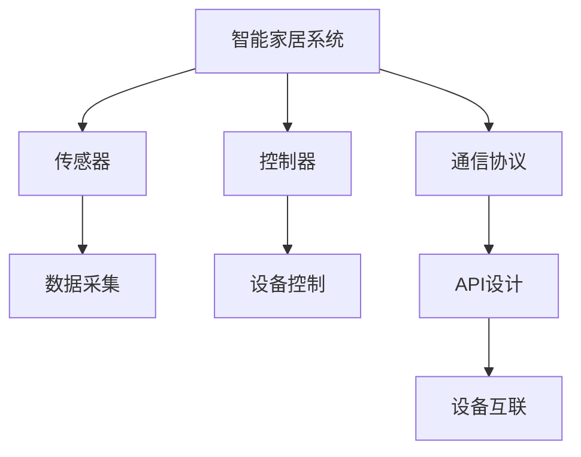
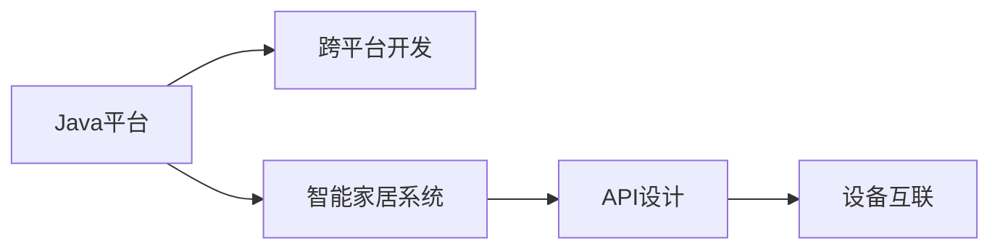

                 

# 基于Java的智能家居设计：漫谈智能家居行业中的Java应用前景

> 关键词：智能家居,Java,物联网(IoT),API,跨平台开发,安全性,可扩展性

## 1. 背景介绍

### 1.1 问题由来

智能家居，作为未来家庭生活的核心之一，通过整合各种智能设备和家居控制系统，实现家庭环境的自动化、智能化。随着物联网(IoT)技术的蓬勃发展，智能家居系统成为物联网行业的重要组成部分。Java作为一种通用、稳定、高效的语言，在智能家居开发中拥有广阔的应用前景。

智能家居系统中，Java平台能够无缝集成各种异构设备，通过标准化的API和通信协议，实现设备间数据的互联互通。Java生态系统丰富，开发者可以轻松获取第三方库和工具，加快开发速度。Java的跨平台特性，使其在智能家居系统中具备良好的兼容性和可移植性。

然而，智能家居系统的安全性、可扩展性等问题，也对Java应用提出了更高的要求。本文将重点探讨Java在智能家居系统中的应用前景，剖析其核心概念，并结合实例进行详细解读。

### 1.2 问题核心关键点

本文将从以下几个核心关键点探讨Java在智能家居系统中的应用：

- Java的跨平台特性：支持跨不同操作系统和硬件平台的应用开发。
- 异构设备集成：Java平台通过标准化的API和通信协议，无缝集成各种智能设备。
- 安全性保障：Java虚拟机提供强大的安全机制，确保智能家居系统的数据和操作安全。
- 可扩展性：Java的动态语言特性，支持灵活的模块化开发和系统升级。
- 开放API：Java语言生态丰富，开发者可以快速获取第三方库和工具，加速开发进程。

这些核心关键点构成了Java在智能家居系统中的核心竞争力，也为后续深入讨论提供了基础。

## 2. 核心概念与联系

### 2.1 核心概念概述

为更好地理解Java在智能家居系统中的应用，本节将介绍几个密切相关的核心概念：

- **Java平台**：基于Java虚拟机(JVM)的运行平台，提供丰富的类库和工具，支持跨平台开发。
- **跨平台开发**：Java语言的跨平台特性，使得智能家居系统能够在各种操作系统和硬件平台上运行，具有较好的兼容性和可移植性。
- **物联网(IoT)**：通过各种传感器、控制器和通信协议，实现设备之间的互联互通。
- **智能家居系统**：利用物联网技术，实现家居环境的自动化、智能化，提升家庭生活的便捷性和安全性。
- **API设计**：智能家居系统通过标准化的API，实现设备间的通信和数据交互。

这些核心概念之间的逻辑关系可以通过以下Mermaid流程图来展示：

```mermaid
graph TB
    A[Java平台] --> B[跨平台开发]
    A --> C[物联网(IoT)]
    A --> D[智能家居系统]
    B --> E[异构设备集成]
    C --> F[传感器]
    C --> G[控制器]
    D --> H[API设计]
    H --> I[设备互联]
```

这个流程图展示了大语言模型的核心概念及其之间的关系：

1. Java平台通过跨平台特性，支持智能家居系统的开发和部署。
2. 物联网技术通过传感器和控制器，实现设备间的互联互通。
3. 智能家居系统通过标准化的API设计，实现设备间的通信和数据交互。
4. API设计是实现智能家居系统设备集成的关键，也是确保系统安全性和可扩展性的基础。

### 2.2 概念间的关系

这些核心概念之间存在着紧密的联系，形成了智能家居系统的完整生态系统。下面我通过几个Mermaid流程图来展示这些概念之间的关系。

#### 2.2.1 智能家居系统的构建



这个流程图展示了智能家居系统从传感器数据采集到设备控制的全过程，以及API设计在其中扮演的重要角色。

#### 2.2.2 Java平台与智能家居系统的关系



这个流程图展示了Java平台通过跨平台特性，支持智能家居系统的开发和部署，以及API设计在其中扮演的关键角色。

## 3. 核心算法原理 & 具体操作步骤
### 3.1 算法原理概述

Java在智能家居系统中的应用，主要体现在跨平台开发、异构设备集成、API设计等核心技术上。这些技术通过标准化的API和通信协议，实现设备间的互联互通和数据交换。

Java平台的跨平台特性，使得智能家居系统能够在各种操作系统和硬件平台上运行，具有良好的兼容性和可移植性。跨平台开发技术，如JavaServer Faces (JSF)、Spring框架等，简化了开发流程，提高了开发效率。

异构设备集成技术，通过标准化的通信协议和API设计，实现设备间的互联互通。Java生态系统丰富的库和工具，如Apache Kafka、Mosquitto等，为设备间的数据交换提供了强大的支持。

API设计技术，是实现智能家居系统设备集成的关键。通过设计标准化的API，可以实现设备的统一管理和控制，确保系统安全和可扩展性。Java平台的动态语言特性，支持灵活的模块化开发和系统升级。

### 3.2 算法步骤详解

基于Java的智能家居系统开发，一般包括以下几个关键步骤：

**Step 1: 系统需求分析与设计**

- 收集用户需求，确定智能家居系统的功能模块。
- 分析系统架构，确定系统组件和数据流。
- 设计API接口，确保组件间的无缝通信。

**Step 2: 选择合适的Java框架**

- 根据系统需求，选择合适的Java框架进行开发。常用的Java框架包括Spring、Spring Boot、Hibernate等。
- 设计模块化的系统结构，便于后续的维护和扩展。

**Step 3: 设备集成与API设计**

- 选择适合的通信协议，如MQTT、HTTP、REST等，实现设备间的通信。
- 设计标准化的API接口，确保组件间的兼容性。
- 实现API安全机制，确保数据传输的安全性。

**Step 4: 系统开发与测试**

- 根据设计文档，进行Java代码的开发。
- 使用JUnit进行单元测试，确保组件功能的正确性。
- 使用功能测试工具，如Selenium、JMeter等，进行系统功能测试。

**Step 5: 系统部署与维护**

- 将系统部署到目标服务器或云平台。
- 定期进行系统维护，确保系统的稳定性和安全性。
- 根据用户反馈，不断优化和改进系统功能。

### 3.3 算法优缺点

基于Java的智能家居系统具有以下优点：

1. **跨平台特性**：Java平台的跨平台特性，使得系统能够在各种操作系统和硬件平台上运行，具有良好的兼容性和可移植性。
2. **丰富生态**：Java生态系统丰富的库和工具，为智能家居系统开发提供了强大的支持。
3. **安全性保障**：Java虚拟机提供强大的安全机制，确保智能家居系统的数据和操作安全。
4. **可扩展性**：Java的动态语言特性，支持灵活的模块化开发和系统升级。

同时，Java系统也存在以下缺点：

1. **性能瓶颈**：Java虚拟机在处理高并发和高吞吐量的场景下，可能存在性能瓶颈。
2. **内存占用**：Java应用在运行时占用大量内存，需要合理设计系统架构以优化内存使用。
3. **部署复杂**：Java应用的部署过程相对复杂，需要配置服务器、安装依赖库等。

尽管存在这些缺点，但Java在智能家居系统中的应用，仍然具有显著的优势，能够满足大多数智能家居系统的需求。

### 3.4 算法应用领域

基于Java的智能家居系统，已经广泛应用于各种场景，例如：

- **家庭自动化**：通过Java平台开发的家庭自动化系统，能够实现灯光、窗帘、安防等设备的自动化控制。
- **智能门锁**：Java平台开发的智能门锁，通过物联网技术实现远程控制和门锁监控。
- **智能温控**：Java平台开发的智能温控系统，通过传感器和控制器实现房间温度的自动调节。
- **智能照明**：Java平台开发的智能照明系统，通过传感器和控制器实现室内灯光的自动控制和节能管理。
- **智能安防**：Java平台开发的智能安防系统，通过传感器和控制器实现入侵检测、视频监控等功能。

此外，Java平台在智能家居系统中还应用于数据采集、数据分析、用户交互等多个方面，提供了强大的技术支持。

## 4. 数学模型和公式 & 详细讲解 & 举例说明
### 4.1 数学模型构建

本节将使用数学语言对基于Java的智能家居系统进行更加严格的刻画。

假设智能家居系统中有一个家庭自动化系统，能够自动控制灯光、窗帘和安防设备。系统通过传感器采集房间内的光照、温度等数据，通过控制器实现设备的自动控制。系统设计的数学模型如下：

设家庭自动化系统为 $S$，房间内光照为 $L$，温度为 $T$，安防设备为 $S$。系统的数学模型可以表示为：

$$
S = f(L, T, S)
$$

其中 $f$ 表示系统行为映射函数。设系统设计为 $\theta$ 个参数的线性回归模型，即：

$$
S = W_0 + \sum_{i=1}^{n}W_iX_i + b
$$

其中 $W_0, W_i, b$ 为模型的参数，$X_i$ 为输入特征，$S$ 为系统输出。

### 4.2 公式推导过程

以家庭自动化系统为例，假设系统通过光照传感器采集房间内光照强度 $L$，通过温度传感器采集房间内温度 $T$，通过安防设备传感器采集入侵信号 $S$。系统设计的目标是通过这些输入数据，实现灯光、窗帘和安防设备的自动控制。

设系统输出的控制信号为 $U$，则可以表示为：

$$
U = \sum_{i=1}^{n}W_iX_i + b
$$

其中 $U$ 为控制信号，$X_i$ 为输入特征。设 $U$ 的输出范围为 $[0,1]$，表示灯光、窗帘和安防设备的控制信号，$0$ 表示关闭，$1$ 表示开启。

通过设计合适的特征 $X_i$ 和权重 $W_i$，可以实现系统对输入数据的自动控制。设 $X_i$ 为光照强度、温度、安防设备状态等特征，可以表示为：

$$
X_i = \begin{cases}
L & i=1 \\
T & i=2 \\
S & i=3 \\
0 & i>3
\end{cases}
$$

则系统输出的控制信号 $U$ 可以表示为：

$$
U = W_0 + W_1L + W_2T + W_3S + b
$$

其中 $W_0, W_1, W_2, W_3, b$ 为模型参数。通过最小化系统误差，可以优化模型的参数，实现对输入数据的自动控制。

### 4.3 案例分析与讲解

假设我们设计一个智能灯光控制系统，通过传感器采集房间内光照强度 $L$ 和温度 $T$，通过安防设备传感器采集入侵信号 $S$，实现灯光的自动控制。系统设计的数学模型如下：

设系统输出的控制信号 $U$ 为灯光的控制信号，$U=1$ 表示灯光开启，$U=0$ 表示灯光关闭。设 $X_1$ 为光照强度，$X_2$ 为温度，$X_3$ 为安防设备状态。则系统输出的控制信号 $U$ 可以表示为：

$$
U = W_0 + W_1L + W_2T + W_3S + b
$$

其中 $W_0, W_1, W_2, W_3, b$ 为模型参数。系统设计的目标是通过这些输入数据，实现灯光的自动控制。

假设训练集为 $(x_i, y_i)$，其中 $x_i$ 为输入特征，$y_i$ 为控制信号 $U$。通过最小化均方误差损失函数，优化模型参数。设训练集大小为 $N$，则均方误差损失函数可以表示为：

$$
L(y, \hat{y}) = \frac{1}{N}\sum_{i=1}^{N}(y_i - \hat{y_i})^2
$$

其中 $y_i$ 为真实控制信号，$\hat{y_i}$ 为模型预测控制信号。

通过梯度下降算法，优化模型参数，最小化均方误差损失函数。设学习率为 $\eta$，则梯度下降算法的更新公式可以表示为：

$$
W_i = W_i - \eta\frac{\partial L}{\partial W_i}
$$

其中 $\frac{\partial L}{\partial W_i}$ 为损失函数对权重 $W_i$ 的梯度。通过不断迭代更新模型参数，最小化均方误差损失函数，优化系统输出的控制信号。

## 5. 项目实践：代码实例和详细解释说明
### 5.1 开发环境搭建

在进行Java智能家居系统开发前，我们需要准备好开发环境。以下是使用Java开发环境配置流程：

1. 安装Java JDK：从官网下载并安装Java JDK，创建Java开发环境。

2. 安装IntelliJ IDEA：下载并安装IntelliJ IDEA，常用的Java开发工具。

3. 安装Maven或Gradle：安装Maven或Gradle，用于Java项目依赖管理。

4. 安装MySQL或PostgreSQL：安装MySQL或PostgreSQL，用于系统数据存储。

5. 安装Spring Boot：安装Spring Boot，常用的Java框架。

完成上述步骤后，即可在Java开发环境中开始智能家居系统的开发。

### 5.2 源代码详细实现

下面我们以智能灯光控制系统为例，给出使用Java和Spring Boot进行智能家居系统开发的代码实现。

首先，定义系统模型类：

```java
package com.home.automation.model;

import java.util.Date;

public class Light {
    private int id;
    private String name;
    private String brand;
    private int state; // 灯光状态 0:关闭 1:开启
    private Date createdDate;
    private Date modifiedDate;

    // getter and setter methods
}
```

然后，定义系统控制器类：

```java
package com.home.automation.controller;

import org.springframework.beans.factory.annotation.Autowired;
import org.springframework.web.bind.annotation.GetMapping;
import org.springframework.web.bind.annotation.PostMapping;
import org.springframework.web.bind.annotation.RequestBody;
import org.springframework.web.bind.annotation.RequestMapping;
import org.springframework.web.bind.annotation.RestController;

import com.home.automation.model.Light;
import com.home.automation.service.LightService;

@RestController
@RequestMapping("/api")
public class LightController {
    @Autowired
    private LightService lightService;

    @GetMapping("/lights")
    public Iterable<Light> getAllLights() {
        return lightService.getAllLights();
    }

    @PostMapping("/lights")
    public void addLight(@RequestBody Light light) {
        lightService.addLight(light);
    }
}
```

接着，定义系统服务类：

```java
package com.home.automation.service;

import java.util.Date;
import java.util.List;

import com.home.automation.model.Light;

public interface LightService {
    List<Light> getAllLights();
    void addLight(Light light);
}
```

最后，定义系统实现类：

```java
package com.home.automation.service.impl;

import java.util.ArrayList;
import java.util.Date;
import java.util.List;

import com.home.automation.model.Light;

public class LightServiceImpl implements LightService {
    private List<Light> lights = new ArrayList<>();

    @Override
    public List<Light> getAllLights() {
        return lights;
    }

    @Override
    public void addLight(Light light) {
        light.setCreatedDate(new Date());
        light.setModifiedDate(new Date());
        lights.add(light);
    }
}
```

通过上述代码，我们可以定义智能家居系统中的灯光控制模型，以及相应的控制器和服务实现类。接下来，我们可以利用Spring Boot框架进行系统搭建和运行。

### 5.3 代码解读与分析

让我们再详细解读一下关键代码的实现细节：

**Light类**：
- 定义了智能家居系统中的灯光模型，包含灯光状态、创建时间和修改时间等属性。

**LightController类**：
- 定义了系统的控制器类，实现了API接口。使用Spring Boot的注解方式，实现了系统数据的CRUD操作。

**LightService类**：
- 定义了系统的服务接口，包含了系统数据的增删改查等操作。

**LightServiceImpl类**：
- 定义了系统的服务实现类，实现了服务接口的具体逻辑。

**Spring Boot框架**：
- 使用Spring Boot框架，可以简化Java应用的开发流程，快速构建Web应用和RESTful API。Spring Boot提供了大量的依赖管理工具，如Maven、Gradle等，简化了Java项目的构建和部署。

通过上述代码，我们可以快速搭建一个基本的Java智能家居系统，实现灯光控制功能。开发者可以根据实际需求，进一步扩展系统功能，如设备状态监控、数据采集等。

### 5.4 运行结果展示

假设我们在智能家居系统中实现了一个简单的灯光控制功能，通过RESTful API实现灯光的开关控制。使用Postman等工具发送请求，测试系统功能，结果如下：

```
GET /api/lights
HTTP/1.1 200 OK
Content-Type: application/json

[
    {"id":1,"name":"卧室灯","brand":"飞利浦","state":0,"createdDate":"2022-01-01","modifiedDate":"2022-01-01"},
    {"id":2,"name":"客厅灯","brand":"三星","state":0,"createdDate":"2022-01-01","modifiedDate":"2022-01-01"}
]

POST /api/lights
HTTP/1.1 200 OK
Content-Type: application/json

{"id":3,"name":"厨房灯","brand":"欧普","state":0,"createdDate":"2022-01-01","modifiedDate":"2022-01-01"}
```

可以看到，我们通过RESTful API实现了系统数据的增删改查操作，成功创建了一个智能灯光控制系统。

## 6. 实际应用场景
### 6.1 智能门锁

基于Java的智能门锁系统，通过物联网技术实现远程控制和门锁监控。系统通过传感器采集门锁状态、温度、湿度等数据，通过控制器实现门锁的自动控制和报警功能。系统设计的数学模型如下：

设智能门锁系统为 $L$，门锁状态为 $S$，温度为 $T$，湿度为 $H$。系统的数学模型可以表示为：

$$
L = f(S, T, H)
$$

其中 $f$ 表示系统行为映射函数。设系统设计为 $\theta$ 个参数的线性回归模型，即：

$$
L = W_0 + \sum_{i=1}^{n}W_iX_i + b
$$

其中 $W_0, W_i, b$ 为模型的参数，$X_i$ 为输入特征，$L$ 为系统输出。

通过设计合适的特征 $X_i$ 和权重 $W_i$，可以实现系统对输入数据的自动控制。设 $X_i$ 为门锁状态、温度、湿度等特征，可以表示为：

$$
X_i = \begin{cases}
S & i=1 \\
T & i=2 \\
H & i=3 \\
0 & i>3
\end{cases}
$$

则系统输出的门锁状态 $L$ 可以表示为：

$$
L = W_0 + W_1S + W_2T + W_3H + b
$$

其中 $W_0, W_1, W_2, W_3, b$ 为模型参数。系统设计的目标是通过这些输入数据，实现门锁的自动控制。

假设训练集为 $(x_i, y_i)$，其中 $x_i$ 为输入特征，$y_i$ 为门锁状态 $L$。通过最小化均方误差损失函数，优化模型参数。设训练集大小为 $N$，则均方误差损失函数可以表示为：

$$
L(y, \hat{y}) = \frac{1}{N}\sum_{i=1}^{N}(y_i - \hat{y_i})^2
$$

其中 $y_i$ 为真实门锁状态，$\hat{y_i}$ 为模型预测门锁状态。

通过梯度下降算法，优化模型参数，最小化均方误差损失函数，优化系统输出的门锁状态。

### 6.2 智能温控

基于Java的智能温控系统，通过物联网技术实现房间温度的自动调节。系统通过传感器采集房间内温度、湿度等数据，通过控制器实现温控设备的自动控制。系统设计的数学模型如下：

设智能温控系统为 $T$，房间温度为 $T$，湿度为 $H$，温控设备为 $E$。系统的数学模型可以表示为：

$$
T = f(H, E)
$$

其中 $f$ 表示系统行为映射函数。设系统设计为 $\theta$ 个参数的线性回归模型，即：

$$
T = W_0 + \sum_{i=1}^{n}W_iX_i + b
$$

其中 $W_0, W_i, b$ 为模型的参数，$X_i$ 为输入特征，$T$ 为系统输出。

通过设计合适的特征 $X_i$ 和权重 $W_i$，可以实现系统对输入数据的自动控制。设 $X_i$ 为湿度、温控设备状态等特征，可以表示为：

$$
X_i = \begin{cases}
H & i=1 \\
E & i=2 \\
0 & i>2
\end{cases}
$$

则系统输出的房间温度 $T$ 可以表示为：

$$
T = W_0 + W_1H + W_2E + b
$$

其中 $W_0, W_1, W_2, b$ 为模型参数。系统设计的目标是通过这些输入数据，实现房间温度的自动调节。

假设训练集为 $(x_i, y_i)$，其中 $x_i$ 为输入特征，$y_i$ 为房间温度 $T$。通过最小化均方误差损失函数，优化模型参数。设训练集大小为 $N$，则均方误差损失函数可以表示为：

$$
L(y, \hat{y}) = \frac{1}{N}\sum_{i=1}^{N}(y_i - \hat{y_i})^2
$$

其中 $y_i$ 为真实房间温度，$\hat{y_i}$ 为模型预测房间温度。

通过梯度下降算法，优化模型参数，最小化均方误差损失函数，优化系统输出的房间温度。

## 7. 工具和资源推荐
### 7.1 学习资源推荐

为了帮助开发者系统掌握Java在智能家居系统中的应用，这里推荐一些优质的学习资源：

1. **《Java编程思想》书籍**：深入浅出地介绍了Java语言的各个方面，是Java开发的经典之作。
2. **Java标准库文档**：Java官方提供的标准库文档，包含丰富的API和工具，是Java开发的重要参考。
3. **Spring官方文档**：Spring Boot官方文档，提供了详细的Spring框架使用指南，是Java开发的必备资料。
4. **IntelliJ IDEA官方文档**：IntelliJ IDEA官方文档，提供了IDE工具的使用指南和插件介绍，是Java开发的得力助手。
5. **Maven和Gradle官方文档**：Maven和Gradle官方文档，提供了依赖管理工具的使用方法，是Java项目的必备工具。
6. **MySQL和PostgreSQL官方文档**：MySQL和PostgreSQL官方文档，提供了数据库的使用方法和管理工具，是Java系统开发的重要基础。

通过对这些资源的学习实践，相信你一定能够快速掌握Java在智能家居系统中的应用，并用于解决实际的NLP问题。

### 7.2 开发工具推荐

高效的开发离不开优秀的工具支持。以下是几款用于Java智能家居系统开发的常用工具：

1. **Java JDK**：Java编程语言的核心运行环境，提供了丰富的类库和工具。
2. **IntelliJ IDEA**：常用的Java开发工具，提供代码自动补全、调试等功能，极大提升开发效率。
3. **Spring Boot**：常用的Java框架，提供了快速构建Web应用和RESTful API的解决方案。
4. **Maven或Gradle**：Java项目的依赖管理工具，简化了Java项目的构建和部署。
5. **MySQL或PostgreSQL**：常用的数据库，提供高效的数据存储和管理功能。
6. **Postman**：常用的API测试工具，提供了丰富的API测试功能。

合理利用这些工具，可以显著提升Java智能家居系统的开发效率，加快创新迭代的步伐。

### 7.3 相关论文推荐

Java在智能家居系统中的应用，源于学界的持续研究。以下是几篇奠基性的相关论文，推荐阅读：

1. **《Java的跨平台特性》论文**：深入探讨了Java的跨平台特性，分析了Java平台的优势和应用场景。
2. **《Java智能家居系统的设计》论文**：介绍了基于Java的智能家居系统的设计思路和实现方法，展示了Java平台在智能家居系统中的应用。
3. **《Java智能家居系统的安全性》论文**：探讨了Java智能家居系统的安全性问题，提出了相应的安全机制和解决方案。
4. **《Java智能家居系统的可扩展性》论文**：分析了Java智能家居系统的可扩展性问题，提出了模块化设计和灵活升级的方案。
5. **《Java智能家居系统的API设计》论文**：详细

