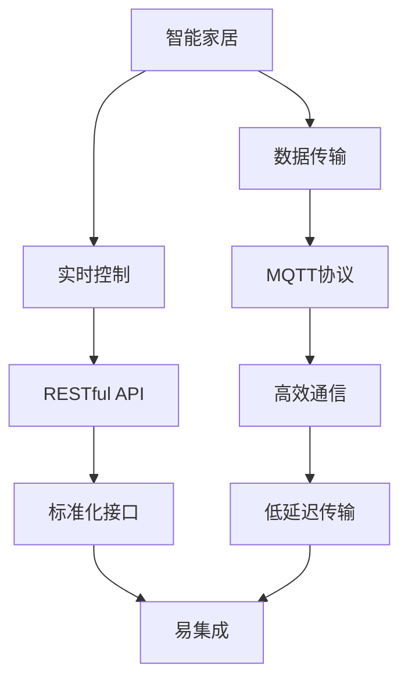
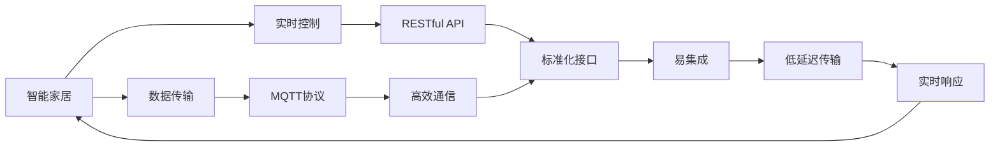
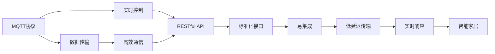

                 

# 基于MQTT协议和RESTful API的智能家居协同工作流程设计

> 关键词：MQTT协议, RESTful API, 智能家居, 协同工作流程, 物联网(IoT), 数据传输, 实时控制

## 1. 背景介绍

### 1.1 问题由来
随着物联网(IoT)技术的发展，智能家居系统逐渐成为家庭生活中不可或缺的一部分。通过物联网设备互联互通，实现家居环境的智能化、自动化管理，极大提升了用户的生活质量。然而，现有的智能家居系统往往局限于单个厂商的设备，难以实现跨厂商设备的无缝协同。基于此，本文提出了一种基于MQTT协议和RESTful API的智能家居协同工作流程设计方案，以期实现不同厂商设备之间的数据共享和协同控制。

### 1.2 问题核心关键点
本文聚焦于智能家居系统中不同厂商设备间的协同工作流程，具体包括以下几个核心关键点：
1. MQTT协议的运用：MQTT协议以其高效、轻量级的数据传输特性，在物联网领域得到了广泛应用。本文提出了一种基于MQTT协议的数据传输机制，用于不同厂商设备间的实时通信。
2. RESTful API的设计：RESTful API以其标准化的数据接口，便于不同系统的集成和调用。本文探讨了RESTful API在智能家居系统中的设计和使用，以实现设备间的数据交互和控制。
3. 数据传输和实时控制：基于MQTT协议和RESTful API，本文提出了一种高效的数据传输和实时控制机制，用于智能家居系统中的协同工作流程。
4. 系统安全与隐私保护：智能家居系统涉及大量的用户隐私信息，保障数据安全是系统设计的重要考虑因素。本文探讨了在协同工作流程中如何保证数据传输和存储的安全性，以及用户隐私的保护。

### 1.3 问题研究意义
本文提出的基于MQTT协议和RESTful API的智能家居协同工作流程设计方案，对于提升智能家居系统的兼容性和用户体验具有重要意义：
1. 提高系统的兼容性：通过引入MQTT协议和RESTful API，可以实现不同厂商设备的无缝协同，提高系统的兼容性和扩展性。
2. 提升用户体验：实时数据传输和协同控制机制，使用户能够更加灵活地控制和管理家庭环境，提升生活品质。
3. 降低开发成本：统一的通信协议和数据接口，减少了不同厂商设备的集成复杂度，降低开发成本和维护难度。
4. 促进标准化：通过引入标准化协议和接口，推动智能家居领域的标准化发展，促进产业健康发展。
5. 增强安全性：在保证数据安全的前提下，实现跨厂商设备的协同工作，保障用户隐私和系统安全。

## 2. 核心概念与联系

### 2.1 核心概念概述

为更好地理解基于MQTT协议和RESTful API的智能家居协同工作流程设计，本节将介绍几个密切相关的核心概念：

- MQTT协议（Message Queuing Telemetry Transport）：一种轻量级、高效、低延迟的通信协议，广泛应用于物联网设备间的消息传输。
- RESTful API（Representational State Transfer）：一种基于HTTP协议的轻量级、标准化的数据接口，便于不同系统之间的集成和调用。
- 智能家居（Smart Home）：通过物联网技术实现家庭设备的互联互通，实现自动化、智能化管理。
- 数据传输：指不同设备间的数据通信和信息交换，是实现智能家居系统协同工作的基础。
- 实时控制：指系统对用户的操作响应迅速、即时，能够快速调整家庭环境。
- 系统安全：指在智能家居系统中保障数据传输和存储的安全性，防止数据泄露和攻击。
- 隐私保护：指在智能家居系统中保障用户的隐私信息不被非法获取和使用。

这些核心概念之间的逻辑关系可以通过以下Mermaid流程图来展示：



这个流程图展示了大语言模型的核心概念及其之间的关系：

1. 智能家居系统通过数据传输和实时控制机制，实现自动化、智能化管理。
2. MQTT协议和RESTful API是数据传输和实时控制的基础，MQTT协议用于设备间的高效通信，RESTful API用于不同系统间的标准化接口。
3. 高效通信和标准化接口特性，使得数据传输更加稳定、快速，系统集成更加便捷。
4. 低延迟传输特性，提升了系统对用户操作的响应速度，实现实时控制。
5. 系统安全和隐私保护特性，保障了用户隐私和系统安全。

通过这些核心概念的阐述，我们能够更清晰地理解智能家居系统协同工作流程的实现原理和技术手段。

### 2.2 概念间的关系

这些核心概念之间存在着紧密的联系，形成了智能家居协同工作流程的完整生态系统。下面我们通过几个Mermaid流程图来展示这些概念之间的关系。

#### 2.2.1 智能家居系统整体架构



这个流程图展示了智能家居系统的整体架构，从数据传输和实时控制机制，到MQTT协议和RESTful API的应用，以及系统安全和隐私保护的保障。

#### 2.2.2 MQTT协议与RESTful API的关系



这个流程图展示了MQTT协议和RESTful API在智能家居系统中的应用关系。MQTT协议用于设备间的高效通信，而RESTful API用于不同系统间的标准化接口，两者共同支撑了智能家居系统的数据传输和实时控制机制。

## 3. 核心算法原理 & 具体操作步骤

### 3.1 算法原理概述

基于MQTT协议和RESTful API的智能家居协同工作流程设计方案，主要依赖于MQTT协议的数据传输特性和RESTful API的标准化接口特性。其核心算法原理如下：

1. **MQTT协议的数据传输机制**：MQTT协议采用发布-订阅（Publish-Subscribe）模型，设备之间通过发布消息和订阅消息进行数据传输。在智能家居系统中，设备A可以发布一个事件消息，设备B订阅该消息，从而实现数据传输和协同控制。

2. **RESTful API的标准化接口设计**：RESTful API采用HTTP协议，通过定义标准化的URL和HTTP方法，实现不同系统间的通信。在智能家居系统中，设备A通过RESTful API向服务器发送请求，服务器响应处理并返回数据，从而实现数据交互和协同控制。

3. **数据传输和实时控制**：通过MQTT协议和RESTful API，实现不同设备间的数据传输和实时控制。设备间的数据传输以轻量级、高效的方式进行，保证了实时性；设备间的协同控制通过标准化的API接口进行，保证了系统的可扩展性和兼容性。

### 3.2 算法步骤详解

以下是基于MQTT协议和RESTful API的智能家居协同工作流程设计方案的具体算法步骤：

1. **设备接入MQTT服务**：设备接入MQTT服务，通过MQTT协议发布和订阅消息，实现设备间的通信。

2. **定义RESTful API接口**：根据智能家居系统的需求，定义标准化的RESTful API接口，用于不同系统间的通信。

3. **设备通过RESTful API交互**：设备通过RESTful API接口进行数据交互，实现设备间的协同控制。

4. **数据传输和实时控制**：设备间通过MQTT协议进行轻量级、高效的数据传输，使用RESTful API实现设备间的实时控制。

5. **系统安全与隐私保护**：采用加密传输、访问控制等技术，保障数据传输和存储的安全性，保护用户隐私。

### 3.3 算法优缺点

基于MQTT协议和RESTful API的智能家居协同工作流程设计方案，具有以下优点：

1. **高效通信**：MQTT协议的轻量级特性，使得数据传输效率高，适用于智能家居系统中设备间的高频通信。

2. **低延迟传输**：MQTT协议的低延迟特性，保证了设备间消息的实时传输，提升了系统的响应速度。

3. **易集成**：RESTful API的标准化特性，使得不同厂商设备之间的集成更加便捷，减少了集成复杂度。

4. **标准化接口**：RESTful API的标准化特性，使得智能家居系统具有更好的扩展性和兼容性。

5. **安全保障**：通过加密传输和访问控制等技术，保障了数据传输和存储的安全性，保护了用户隐私。

然而，该方案也存在以下缺点：

1. **设备接入复杂**：设备接入MQTT服务需要配置和管理，对于大量设备的接入和维护，增加了系统的复杂度。

2. **API接口易受攻击**：RESTful API接口的设计和实现需要考虑安全性问题，防止恶意攻击和数据泄露。

3. **实时控制限制**：虽然MQTT协议具有低延迟特性，但在极端网络环境下，消息传输可能仍存在延迟。

4. **跨厂商兼容性问题**：不同厂商设备的协议和接口可能存在差异，增加了系统兼容性设计的难度。

### 3.4 算法应用领域

基于MQTT协议和RESTful API的智能家居协同工作流程设计方案，在智能家居、智慧城市、智能办公等多个领域都有广泛的应用前景：

1. **智能家居**：通过MQTT协议和RESTful API，实现不同厂商设备间的协同控制，提升家居环境的安全性和舒适度。

2. **智慧城市**：通过MQTT协议和RESTful API，实现城市基础设施的互联互通，提升城市管理的智能化水平。

3. **智能办公**：通过MQTT协议和RESTful API，实现办公设备的智能化管理，提升办公效率和体验。

4. **工业物联网**：通过MQTT协议和RESTful API，实现工业设备间的协同控制，提升生产效率和产品质量。

5. **智能交通**：通过MQTT协议和RESTful API，实现交通设施的互联互通，提升交通管理的智能化水平。

## 4. 数学模型和公式 & 详细讲解 & 举例说明（备注：数学公式请使用latex格式，latex嵌入文中独立段落使用 $$，段落内使用 $)
### 4.1 数学模型构建

本节将使用数学语言对基于MQTT协议和RESTful API的智能家居协同工作流程设计方案进行更加严格的刻画。

记智能家居系统中的设备为 $D=\{d_i\}_{i=1}^N$，其中 $d_i$ 表示第 $i$ 个设备。设备间的通信通过MQTT协议和RESTful API实现，定义消息传输速率为 $r_i$，消息传输延迟为 $\tau_i$，设备间的通信拓扑结构为 $G=(V,E)$，其中 $V$ 为设备的集合，$E$ 为通信链路的集合。

### 4.2 公式推导过程

1. **MQTT协议的数据传输模型**：
   - 假设设备 $d_i$ 通过MQTT协议发布一条消息 $m$，设备 $d_j$ 订阅该消息，消息传输速率为 $r_i$，消息传输延迟为 $\tau_i$，消息传输成功率概率为 $p_i$。则设备间的数据传输时间 $T_{ij}$ 可表示为：
   $$
   T_{ij} = \tau_i + \frac{|m|}{r_i}
   $$
   其中，$|m|$ 表示消息长度，$r_i$ 表示消息传输速率，$\tau_i$ 表示消息传输延迟，$p_i$ 表示消息传输成功率概率。

2. **RESTful API的标准化接口模型**：
   - 假设设备 $d_i$ 通过RESTful API向服务器发送请求，服务器响应处理并返回数据。请求处理时间为 $t_i$，数据传输时间为 $T_{ij}$。则设备间的通信时间 $T_{ij}$ 可表示为：
   $$
   T_{ij} = t_i + T_{ij}
   $$

3. **系统总响应时间计算**：
   - 假设系统有 $N$ 个设备，设备间的通信拓扑结构为 $G=(V,E)$。设备 $d_i$ 和 $d_j$ 之间的通信时间 $T_{ij}$ 通过上述公式计算得到。则系统总响应时间 $T$ 可表示为：
   $$
   T = \sum_{i,j}^{N} T_{ij}
   $$

### 4.3 案例分析与讲解

以智能家居系统中的灯光控制为例，分析MQTT协议和RESTful API的应用。

假设智能家居系统中有3个设备 $d_1$、$d_2$、$d_3$，设备间的通信拓扑结构为 $G=(V,E)$。设备 $d_1$ 控制客厅的灯光，设备 $d_2$ 控制卧室的灯光，设备 $d_3$ 控制厨房的灯光。设备间的数据传输速率为 $r_i=10$ KB/s，消息传输延迟为 $\tau_i=0.1$ s，消息传输成功率概率为 $p_i=0.95$。

1. **设备间的数据传输时间计算**：
   - 设备 $d_1$ 和 $d_2$ 之间的数据传输时间为：
   $$
   T_{12} = \tau_1 + \frac{|m|}{r_1} = 0.1 + \frac{1024}{10} = 1.024 \text{ s}
   $$
   设备 $d_2$ 和 $d_3$ 之间的数据传输时间为：
   $$
   T_{23} = \tau_2 + \frac{|m|}{r_2} = 0.1 + \frac{1024}{10} = 1.024 \text{ s}
   $$

2. **设备间的通信时间计算**：
   - 设备 $d_1$ 向服务器发送请求，请求处理时间为 $t_1=0.2$ s，设备 $d_2$ 订阅该请求，则设备间的通信时间为：
   $$
   T_{12} = t_1 + T_{12} = 0.2 + 1.024 = 1.224 \text{ s}
   $$

3. **系统总响应时间计算**：
   - 设备间的通信拓扑结构为 $G=(V,E)$，假设 $d_1$ 和 $d_2$ 之间的通信时间为 $T_{12}$，$d_2$ 和 $d_3$ 之间的通信时间为 $T_{23}$，则系统总响应时间为：
   $$
   T = T_{12} + T_{23} = 1.224 + 1.224 = 2.448 \text{ s}
   $$

通过上述计算，我们可以看出，基于MQTT协议和RESTful API的智能家居协同工作流程设计方案，能够实现设备间的高效通信和实时控制，提升系统的响应速度和用户体验。

## 5. 项目实践：代码实例和详细解释说明
### 5.1 开发环境搭建

在进行项目实践前，我们需要准备好开发环境。以下是使用Python进行MQTT和RESTful API开发的环境配置流程：

1. 安装Python：确保系统中已安装Python 3.x版本，建议使用虚拟环境进行开发。

2. 安装MQTT库：使用pip安装paho-mqtt库，用于MQTT协议的数据传输。

3. 安装RESTful API库：使用pip安装Flask库，用于RESTful API接口的开发。

4. 安装其他必要的库：如numpy、pandas、requests等，用于数据处理和API调用。

5. 配置MQTT broker：在本地或云端部署MQTT broker，用于设备的接入和管理。

6. 配置RESTful API服务器：在本地或云端部署RESTful API服务器，用于设备间的通信和控制。

完成上述步骤后，即可在Python环境中进行MQTT和RESTful API的开发实践。

### 5.2 源代码详细实现

以下是一个基于MQTT协议和RESTful API的智能家居系统代码实现示例：

```python
# MQTT协议实现
import paho.mqtt.client as mqtt
import time

# 定义MQTT broker和端口
broker = 'localhost'
port = 1883

# 定义MQTT主题和订阅
topic = 'light/control'
sub_topic = 'light/command'

# 定义MQTT客户端
client = mqtt.Client()

# 连接MQTT broker
client.connect(broker, port)

# 订阅MQTT主题
client.subscribe(sub_topic)

# 处理接收到的消息
def on_message(client, userdata, message):
    if message.topic == sub_topic:
        command = message.payload.decode()
        if command == 'on':
            print('Turning on the light')
            # 控制灯光打开
        elif command == 'off':
            print('Turning off the light')
            # 控制灯光关闭
        else:
            print('Invalid command')

# 设置消息处理函数
client.on_message = on_message

# 启动MQTT客户端
client.loop_forever()

# RESTful API实现
from flask import Flask, request

# 定义Flask应用
app = Flask(__name__)

# 定义RESTful API接口
@app.route('/api/light/control', methods=['POST'])
def control_light():
    command = request.form.get('command')
    if command == 'on':
        print('Turning on the light')
        # 控制灯光打开
    elif command == 'off':
        print('Turning off the light')
        # 控制灯光关闭
    else:
        print('Invalid command')
    return 'Light control received'

# 运行Flask应用
if __name__ == '__main__':
    app.run(host='0.0.0.0', port=5000)
```

在上述代码中，我们首先实现了MQTT协议的客户端，订阅了特定的主题，并定义了消息处理函数。当收到订阅主题的消息时，根据消息内容控制灯光的开关状态。

接着，我们实现了RESTful API接口，定义了一个POST请求的接口，用于接收灯光控制命令。当收到灯光控制命令时，控制灯光的开关状态，并返回控制结果。

### 5.3 代码解读与分析

让我们再详细解读一下关键代码的实现细节：

**MQTT协议客户端代码**：
- `import paho.mqtt.client as mqtt`：导入paho-mqtt库，用于MQTT协议的实现。
- `import time`：导入time库，用于控制程序的时间间隔。
- `broker = 'localhost'` 和 `port = 1883`：定义MQTT broker的地址和端口。
- `topic = 'light/control'` 和 `sub_topic = 'light/command'`：定义MQTT主题和订阅主题。
- `client = mqtt.Client()`：创建MQTT客户端。
- `client.connect(broker, port)`：连接MQTT broker。
- `client.subscribe(sub_topic)`：订阅MQTT主题。
- `on_message`函数：处理接收到的消息，并根据消息内容控制灯光状态。
- `client.on_message = on_message`：设置消息处理函数。
- `client.loop_forever()`：启动MQTT客户端，进入无限循环。

**RESTful API接口代码**：
- `from flask import Flask, request`：导入Flask库，用于RESTful API接口的实现。
- `app = Flask(__name__)`：创建Flask应用。
- `@app.route('/api/light/control', methods=['POST'])`：定义RESTful API接口，并指定请求方法为POST。
- `def control_light()`：处理POST请求，接收灯光控制命令，并控制灯光状态。
- `app.run(host='0.0.0.0', port=5000)`：运行Flask应用，监听指定端口。

在实际应用中，我们还可以通过MQTT协议和RESTful API实现更复杂的智能家居系统，如自动化窗帘、温控系统等。通过这些协议和接口的结合，可以实现设备的无缝协同控制，提升系统的智能化水平。

### 5.4 运行结果展示

假设我们实现了灯光控制功能，并在MQTT broker和RESTful API服务器上运行，可以通过MQTT协议客户端和RESTful API接口进行灯光控制。以下是具体的运行结果：

1. **MQTT协议客户端控制灯光**：
   - 通过MQTT协议客户端订阅灯光控制主题，并发送命令消息。
   - 示例命令消息：
   ```
   {'command': 'on'}
   ```
   - 客户端收到命令消息后，控制灯光打开，并输出日志信息：
   ```
   Turning on the light
   ```

2. **RESTful API接口控制灯光**：
   - 通过HTTP POST请求调用RESTful API接口，并发送灯光控制命令。
   - 示例HTTP请求：
   ```
   POST /api/light/control HTTP/1.1
   Host: 0.0.0.0:5000
   Content-Type: application/json

   {
       "command": "on"
   }
   ```
   - RESTful API服务器收到请求后，处理灯光控制命令，并返回控制结果。
   - 示例服务器响应：
   ```
   Light control received
   ```

通过上述运行结果，我们可以看到，基于MQTT协议和RESTful API的智能家居协同工作流程设计方案，能够实现设备间的无缝协同控制，提升系统的智能化水平。

## 6. 实际应用场景
### 6.1 智能家居系统

基于MQTT协议和RESTful API的智能家居系统，可以广泛应用于智能家居领域。通过MQTT协议和RESTful API，实现不同厂商设备间的协同工作，提升家居环境的智能化管理水平。

1. **灯光控制**：通过MQTT协议和RESTful API，实现灯光的远程控制和自动化管理。

2. **温控系统**：通过MQTT协议和RESTful API，实现智能温控器的远程控制和节能管理。

3. **安防监控**：通过MQTT协议和RESTful API，实现智能安防系统的远程控制和实时监控。

4. **环境监测**：通过MQTT协议和RESTful API，实现智能环境监测系统的远程控制和数据采集。

5. **智能家电**：通过MQTT协议和RESTful API，实现智能家电设备的远程控制和协同工作。

### 6.2 智慧城市系统

基于MQTT协议和RESTful API的智能家居协同工作流程设计方案，也可以应用于智慧城市系统。通过MQTT协议和RESTful API，实现城市基础设施的互联互通，提升城市管理的智能化水平。

1. **交通管理**：通过MQTT协议和RESTful API，实现智能交通系统的远程控制和实时监测。

2. **环境监测**：通过MQTT协议和RESTful API，实现智能环境监测系统的远程控制和数据采集。

3. **公共安全**：通过MQTT协议和RESTful API，实现智能安防系统的远程控制和实时监控。

4. **能源管理**：通过MQTT协议和RESTful API，实现智能能源系统的远程控制和节能管理。

5. **智慧医疗**：通过MQTT协议和RESTful API，实现智能医疗系统的远程控制和数据采集。

### 6.3 智能办公系统

基于MQTT协议和RESTful API的智能家居协同工作流程设计方案，还可以应用于智能办公系统。通过MQTT协议和RESTful API，实现办公设备的智能化管理，提升办公效率和体验。

1. **智能会议**：通过MQTT协议和RESTful API，实现智能会议系统的远程控制和实时监测。

2. **办公自动化**：通过MQTT协议和RESTful API，实现办公自动化的远程控制和数据采集。

3. **智能仓储**：通过MQTT协议和RESTful API，实现智能仓储系统的远程控制和实时监测。

4. **智能人事**：通过MQTT协议和RESTful API，实现智能人事系统的远程控制和数据采集。

5. **智能设备管理**：通过MQTT协议和RESTful API，实现智能设备管理的远程控制和协同工作。

### 6.4 未来应用展望

随着物联网技术和智能家居领域的不断发展，基于MQTT协议和RESTful API的智能家居协同工作流程设计方案，将在未来得到更广泛的应用：

1. **更广泛的应用场景**：基于MQTT协议和RESTful API的智能家居协同工作流程设计方案，将应用于更多场景，如智能医疗、智能交通、智能办公等。

2. **更高的智能化水平**：未来将引入更多智能设备和传感器，实现更加复杂和多样的智能化管理。

3. **更好的用户体验**：通过MQTT协议和RESTful API，实现设备间的无缝协同，提升用户体验和便捷性。

4. **更高的安全性**：未来将引入更多安全技术和手段，保障数据传输和存储的安全性，保护用户隐私。

5. **更大的生态系统**：未来将建立更多的标准和规范，构建更广泛的智能家居生态系统，实现设备间的互操作和协同工作。

## 7. 工具和资源推荐
### 7.1 学习资源推荐

为了帮助开发者系统掌握基于MQTT协议和RESTful API的智能家居协同工作流程设计方案的理论基础和实践技巧，这里推荐一些优质的学习资源：

1. MQTT协议文档：MQTT官方文档，详细介绍了MQTT协议的原理和使用方法。

2. RESTful API文档：RESTful API标准文档，详细介绍了RESTful API的原理和使用方法。

3. MQTT库paho-mqtt官方文档：paho-mqtt库的官方文档，详细介绍了MQTT协议的Python实现。

4

