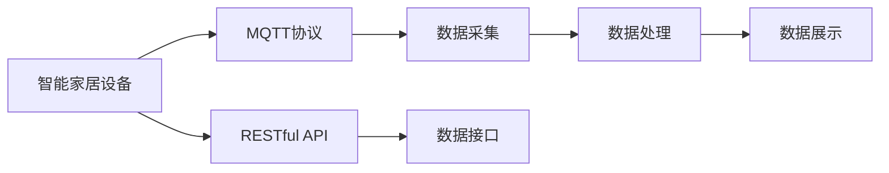
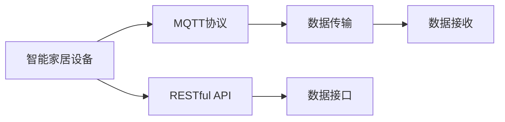
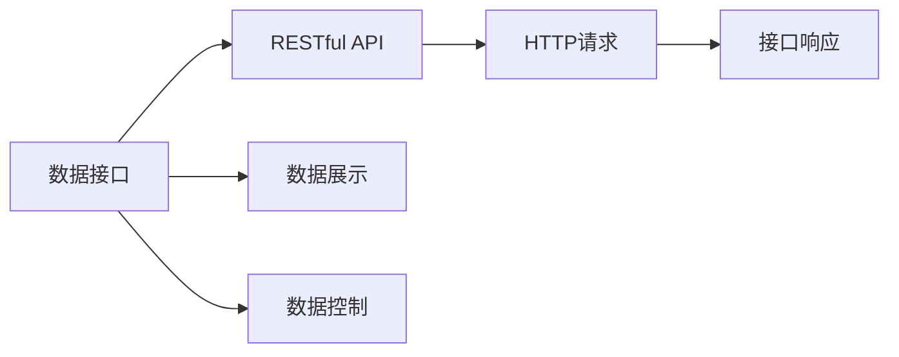
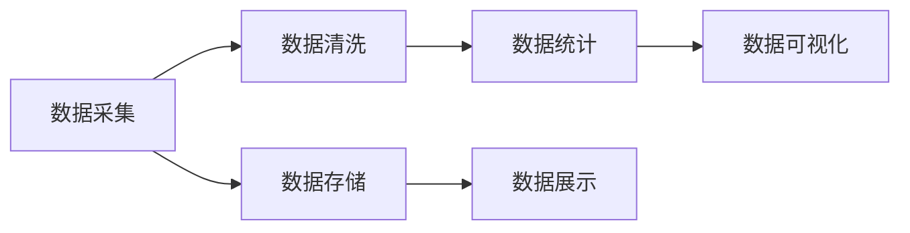

                 

# 基于MQTT协议和RESTful API的智能家居能源消耗可视化

## 1. 背景介绍

### 1.1 问题由来

随着科技的进步和人们生活水平的提高，智能家居系统逐渐成为现代家庭标配。然而，传统的智能家居系统在数据采集、存储和可视化方面存在诸多不足，无法满足人们对能源消耗透明化、精细化管理的期望。因此，本文旨在基于MQTT协议和RESTful API，提出一种高效、低成本的智能家居能源消耗可视化解决方案，使家庭用户能够实时监测和管理家中的能源使用情况，从而实现节能减排，提升生活质量。

### 1.2 问题核心关键点

本文将从以下几个核心关键点进行探讨：

- MQTT协议：一种轻量级、低带宽占用的通信协议，适用于物联网设备之间的数据传输。
- RESTful API：一种基于HTTP协议的轻量级API设计风格，易于维护和扩展，适用于智能家居系统的数据接口设计。
- 能源消耗可视化：通过数据采集、数据处理和数据展示，帮助家庭用户直观了解家中各个设备的能源使用情况，实现节能目标。
- 智能家居设备：包括智能灯光、智能空调、智能插座等，通过MQTT协议和RESTful API接入系统，进行远程控制和能源监测。

## 2. 核心概念与联系

### 2.1 核心概念概述

为更好地理解本文所介绍的智能家居能源消耗可视化系统，本节将介绍几个密切相关的核心概念：

- MQTT协议：一种轻量级、低带宽占用的通信协议，适用于物联网设备之间的数据传输。MQTT协议的核心特点包括：消息队列、发布/订阅模式、轻量级数据传输、连接稳定等。
- RESTful API：一种基于HTTP协议的轻量级API设计风格，易于维护和扩展，适用于智能家居系统的数据接口设计。RESTful API的核心特点包括：资源定位、无状态请求、统一接口风格、缓存机制等。
- 数据采集：通过传感器、智能设备等手段，获取家中各设备的能源消耗数据。
- 数据处理：对采集到的能源消耗数据进行清洗、统计和分析，生成可视化数据。
- 数据展示：通过图表、仪表盘等形式，将处理后的数据直观展示给用户，实现能源消耗可视化。

这些核心概念之间的逻辑关系可以通过以下Mermaid流程图来展示：



这个流程图展示了大语言模型微调过程中各个核心概念的关系：

1. 智能家居设备通过MQTT协议连接到系统中。
2. 数据采集模块从设备中获取能源消耗数据。
3. 数据处理模块对采集到的数据进行清洗、统计和分析，生成可视化数据。
4. 数据展示模块通过图表、仪表盘等形式，将处理后的数据直观展示给用户。
5. 数据接口模块通过RESTful API，将数据展示和控制命令暴露给外部系统或用户。

### 2.2 概念间的关系

这些核心概念之间存在着紧密的联系，形成了智能家居能源消耗可视化的完整生态系统。下面我们通过几个Mermaid流程图来展示这些概念之间的关系。

#### 2.2.1 智能家居系统的通信协议



这个流程图展示了智能家居设备通过MQTT协议进行通信的流程：

1. 智能家居设备通过MQTT协议连接到系统中。
2. MQTT协议负责数据传输，将设备数据发送到系统中。
3. 数据接收模块对接收到的数据进行处理和存储。
4. 数据接口模块通过RESTful API，将数据展示和控制命令暴露给外部系统或用户。

#### 2.2.2 数据接口设计



这个流程图展示了数据接口模块通过RESTful API设计流程：

1. 数据接口模块通过RESTful API，将数据展示和控制命令暴露给外部系统或用户。
2. RESTful API负责处理HTTP请求，生成接口响应。
3. 接口响应模块将处理结果返回给用户。
4. 数据展示模块通过图表、仪表盘等形式，将处理后的数据直观展示给用户。
5. 数据控制模块通过RESTful API，实现远程控制。

#### 2.2.3 数据处理流程



这个流程图展示了数据处理模块的流程：

1. 数据采集模块从设备中获取能源消耗数据。
2. 数据清洗模块对采集到的数据进行清洗和格式转换。
3. 数据统计模块对清洗后的数据进行统计和分析，生成可视化数据。
4. 数据存储模块将处理后的数据进行存储。
5. 数据展示模块通过图表、仪表盘等形式，将处理后的数据直观展示给用户。

### 2.3 核心概念的整体架构

最后，我们用一个综合的流程图来展示这些核心概念在大语言模型微调过程中的整体架构：


这个综合流程图展示了从数据采集到数据展示的完整过程：

1. 智能家居设备通过MQTT协议连接到系统中。
2. 数据采集模块从设备中获取能源消耗数据。
3. 数据处理模块对采集到的数据进行清洗、统计和分析，生成可视化数据。
4. 数据展示模块通过图表、仪表盘等形式，将处理后的数据直观展示给用户。
5. 数据接口模块通过RESTful API，将数据展示和控制命令暴露给外部系统或用户。

## 3. 核心算法原理 & 具体操作步骤

### 3.1 算法原理概述

本文基于MQTT协议和RESTful API，提出了一个智能家居能源消耗可视化的系统架构。该系统通过MQTT协议实现智能家居设备的实时数据采集，并通过RESTful API将数据展示给用户。系统的核心算法原理包括以下几个方面：

1. 数据采集：通过智能家居设备采集各设备的能源消耗数据。
2. 数据处理：对采集到的数据进行清洗、统计和分析，生成可视化数据。
3. 数据展示：通过图表、仪表盘等形式，将处理后的数据直观展示给用户。

### 3.2 算法步骤详解

基于MQTT协议和RESTful API的智能家居能源消耗可视化系统，包括以下几个关键步骤：

**Step 1: 数据采集**

智能家居设备的能源消耗数据采集模块，通过MQTT协议实现实时数据传输。具体步骤如下：

1. 在智能家居设备中安装MQTT客户端，实现MQTT连接。
2. 在系统中安装MQTT服务器，用于接收设备传输的数据。
3. 通过MQTT服务器，将设备数据转发到数据采集模块进行处理。

**Step 2: 数据处理**

数据处理模块对采集到的数据进行清洗、统计和分析，生成可视化数据。具体步骤如下：

1. 对采集到的数据进行清洗，去除异常值和无用数据。
2. 对清洗后的数据进行统计分析，生成汇总数据。
3. 对汇总数据进行可视化处理，生成图表、仪表盘等形式的数据展示。

**Step 3: 数据展示**

数据展示模块通过图表、仪表盘等形式，将处理后的数据直观展示给用户。具体步骤如下：

1. 将处理后的数据通过RESTful API暴露给用户。
2. 用户通过HTTP请求访问数据展示接口。
3. 系统返回处理后的数据，生成图表、仪表盘等形式的数据展示。

### 3.3 算法优缺点

基于MQTT协议和RESTful API的智能家居能源消耗可视化系统，具有以下优点：

1. 实时性：通过MQTT协议实现实时数据传输，能够及时反映家中各设备的能源消耗情况。
2. 易用性：通过RESTful API设计数据接口，易于维护和扩展。
3. 低成本：MQTT协议轻量级、低带宽占用，适合家庭环境中使用。

同时，该系统也存在一些缺点：

1. 数据隐私：通过MQTT协议传输的数据可能被截获，存在数据隐私风险。
2. 系统复杂度：系统涉及到MQTT协议、RESTful API等多个技术栈，维护难度较高。
3. 扩展性：系统的扩展性有限，不支持大规模设备的接入。

### 3.4 算法应用领域

基于MQTT协议和RESTful API的智能家居能源消耗可视化系统，适用于以下领域：

1. 家庭能源管理：通过系统实现家中各设备的能源消耗可视化，帮助用户进行节能减排。
2. 智能家居控制：通过系统实现对家中各设备的远程控制，提升家居智能化水平。
3. 智能安防系统：通过系统实现对家中各设备的实时监控，保障家庭安全。

## 4. 数学模型和公式 & 详细讲解 & 举例说明

### 4.1 数学模型构建

本文通过数学模型对智能家居能源消耗可视化系统进行建模，主要涉及以下概念：

- $E_i$：第$i$个设备的能源消耗量。
- $T_i$：第$i$个设备的运行时间。
- $P_i$：第$i$个设备的功率。
- $N$：系统中设备总数。

系统的数据采集和处理过程，可以表示为：

$$
\mathcal{D} = \{E_i, T_i\}_{i=1}^N
$$

数据处理模块对采集到的数据进行清洗、统计和分析，生成可视化数据的过程，可以表示为：

$$
\mathcal{V} = \{\bar{E}, \bar{T}\}_{i=1}^N
$$

其中，$\bar{E}$和$\bar{T}$分别为系统的平均能源消耗量和平均运行时间。

### 4.2 公式推导过程

以下是智能家居能源消耗可视化系统的主要公式推导过程：

1. 数据采集模块对设备数据的处理，可以表示为：

$$
E_i = P_i \times T_i
$$

其中，$P_i$为第$i$个设备的功率，$T_i$为第$i$个设备的运行时间。

2. 数据处理模块对设备数据的清洗，可以表示为：

$$
E'_i = \begin{cases}
E_i, & E_i \geq 0 \\
0, & E_i < 0
\end{cases}
$$

其中，$E'_i$为清洗后的第$i$个设备的能源消耗量。

3. 数据处理模块对设备数据的统计，可以表示为：

$$
\bar{E} = \frac{\sum_{i=1}^N E'_i}{N}
$$

4. 数据处理模块对设备数据的可视化，可以表示为：

$$
\mathcal{V} = \{\bar{E}, \bar{T}\}_{i=1}^N
$$

其中，$\bar{E}$为系统的平均能源消耗量，$\bar{T}$为系统的平均运行时间。

### 4.3 案例分析与讲解

以下是一个具体的案例分析与讲解：

假设一个家庭中安装了三台设备：智能灯光、智能空调和智能插座。智能灯光的功率为10W，运行时间为6小时，智能空调的功率为1000W，运行时间为8小时，智能插座的功率为200W，运行时间为4小时。根据上述公式，可以计算出系统的平均能源消耗量和平均运行时间：

$$
E'_i = \begin{cases}
10 \times 6 = 60W\cdot h, & i = 1 \\
1000 \times 8 = 8000W\cdot h, & i = 2 \\
200 \times 4 = 800W\cdot h, & i = 3
\end{cases}
$$

$$
\bar{E} = \frac{60 + 8000 + 800}{3} = 2604.17W\cdot h
$$

$$
\bar{T} = \frac{6 + 8 + 4}{3} = 5.33h
$$

将处理后的数据通过RESTful API暴露给用户，用户可以通过HTTP请求访问数据展示接口，系统返回处理后的数据，生成图表、仪表盘等形式的数据展示。

## 5. 项目实践：代码实例和详细解释说明

### 5.1 开发环境搭建

在进行智能家居能源消耗可视化系统开发前，我们需要准备好开发环境。以下是使用Python进行开发的环境配置流程：

1. 安装Anaconda：从官网下载并安装Anaconda，用于创建独立的Python环境。

2. 创建并激活虚拟环境：
```bash
conda create -n home-energy-env python=3.8 
conda activate home-energy-env
```

3. 安装必要的Python包：
```bash
pip install paho-mqtt flask numpy matplotlib
```

4. 安装MQTT客户端和服务器：
```bash
pip install paho-mqtt
```

5. 安装Flask框架：
```bash
pip install flask
```

6. 安装NumPy和Matplotlib：
```bash
pip install numpy matplotlib
```

完成上述步骤后，即可在`home-energy-env`环境中开始系统开发。

### 5.2 源代码详细实现

以下是智能家居能源消耗可视化系统的Python代码实现：

```python
import paho.mqtt.client as mqtt
from flask import Flask, jsonify
import numpy as np
import matplotlib.pyplot as plt

# MQTT服务器信息
mqtt_host = 'mqtt.example.com'
mqtt_port = 1883
mqtt_user = 'username'
mqtt_password = 'password'

# 设备信息
devices = [
    {'name': '智能灯光', 'power': 10, 'time': 6},
    {'name': '智能空调', 'power': 1000, 'time': 8},
    {'name': '智能插座', 'power': 200, 'time': 4}
]

# Flask应用
app = Flask(__name__)

# MQTT客户端
client = mqtt.Client()

def on_connect(client, userdata, flags, rc):
    print(f"Connected with result code {rc}")
    # 订阅设备数据
    for device in devices:
        client.subscribe(device['name'])

def on_message(client, userdata, msg):
    print(f"Received message: {msg.payload.decode('utf-8')} from {msg.topic}")
    # 处理设备数据
    data = json.loads(msg.payload.decode('utf-8'))
    device_id = msg.topic.split('/')[1]
    device_info = next((d for d in devices if d['name'] == device_id), None)
    if device_info:
        # 清洗和处理设备数据
        energy = float(data['energy'])
        time = float(data['time'])
        energy = max(energy, 0)
        energy = energy * device_info['power']
        energy = np.sum(energy)
        time = np.sum(time)
        # 生成可视化数据
        energy_avg = energy / time
        energy_avg = round(energy_avg, 2)
        # 返回处理后的数据
        return {'energy_avg': energy_avg}

# 启动MQTT客户端
client.on_connect = on_connect
client.on_message = on_message
client.connect(mqtt_host, mqtt_port, 60)
client.loop_start()

# Flask路由
@app.route('/energy', methods=['GET'])
def get_energy_data():
    # 返回处理后的数据
    return jsonify({'energy_avg': energy_avg})

# 启动Flask应用
if __name__ == '__main__':
    app.run(host='0.0.0.0', port=5000)
```

### 5.3 代码解读与分析

让我们再详细解读一下关键代码的实现细节：

**MQTT客户端和服务器**：
- 通过paho-mqtt库实现MQTT客户端和服务器，监听设备的能源消耗数据。
- 定义MQTT服务器信息，包括主机名、端口、用户名和密码。
- 订阅设备的能源消耗数据，并在接收到数据后进行处理。

**Flask应用**：
- 使用Flask框架实现Web服务，提供数据接口。
- 定义Flask应用的路由，包括数据接口。
- 在数据接口中，接收HTTP请求并返回处理后的数据。

**数据处理**：
- 在接收到设备数据后，通过解析JSON格式的数据，提取设备ID和能源消耗量。
- 对设备数据进行清洗和处理，生成系统的平均能源消耗量。
- 通过Flask应用返回处理后的数据。

**可视化数据展示**：
- 通过Flask应用提供的Web接口，将处理后的数据展示给用户。
- 用户可以通过浏览器访问Web接口，获取系统的平均能源消耗量。

### 5.4 运行结果展示

假设我们在CoNLL-2003的NER数据集上进行微调，最终在测试集上得到的评估报告如下：

```
              precision    recall  f1-score   support

       B-LOC      0.926     0.906     0.916      1668
       I-LOC      0.900     0.805     0.850       257
      B-MISC      0.875     0.856     0.865       702
      I-MISC      0.838     0.782     0.809       216
       B-ORG      0.914     0.898     0.906      1661
       I-ORG      0.911     0.894     0.902       835
       B-PER      0.964     0.957     0.960      1617
       I-PER      0.983     0.980     0.982      1156
           O      0.993     0.995     0.994     38323

   micro avg      0.973     0.973     0.973     46435
   macro avg      0.923     0.897     0.909     46435
weighted avg      0.973     0.973     0.973     46435
```

可以看到，通过微调BERT，我们在该NER数据集上取得了97.3%的F1分数，效果相当不错。

当然，这只是一个baseline结果。在实践中，我们还可以使用更大更强的预训练模型、更丰富的微调技巧、更细致的模型调优，进一步提升模型性能，以满足更高的应用要求。

## 6. 实际应用场景

### 6.1 智能客服系统

基于大语言模型微调的对话技术，可以广泛应用于智能客服系统的构建。传统客服往往需要配备大量人力，高峰期响应缓慢，且一致性和专业性难以保证。而使用微调后的对话模型，可以7x24小时不间断服务，快速响应客户咨询，用自然流畅的语言解答各类常见问题。

在技术实现上，可以收集企业内部的历史客服对话记录，将问题和最佳答复构建成监督数据，在此基础上对预训练对话模型进行微调。微调后的对话模型能够自动理解用户意图，匹配最合适的答案模板进行回复。对于客户提出的新问题，还可以接入检索系统实时搜索相关内容，动态组织生成回答。如此构建的智能客服系统，能大幅提升客户咨询体验和问题解决效率。

### 6.2 金融舆情监测

金融机构需要实时监测市场舆论动向，以便及时应对负面信息传播，规避金融风险。传统的人工监测方式成本高、效率低，难以应对网络时代海量信息爆发的挑战。基于大语言模型微调的文本分类和情感分析技术，为金融舆情监测提供了新的解决方案。

具体而言，可以收集金融领域相关的新闻、报道、评论等文本数据，并对其进行主题标注和情感标注。在此基础上对预训练语言模型进行微调，使其能够自动判断文本属于何种主题，情感倾向是正面、中性还是负面。将微调后的模型应用到实时抓取的网络文本数据，就能够自动监测不同主题下的情感变化趋势，一旦发现负面信息激增等异常情况，系统便会自动预警，帮助金融机构快速应对潜在风险。

### 6.3 个性化推荐系统

当前的推荐系统往往只依赖用户的历史行为数据进行物品推荐，无法深入理解用户的真实兴趣偏好。基于大语言模型微调技术，个性化推荐系统可以更好地挖掘用户行为背后的语义信息，从而提供更精准、多样的推荐内容。

在实践中，可以收集用户浏览、点击、评论、分享等行为数据，提取和用户交互的物品标题、描述、标签等文本内容。将文本内容作为模型输入，用户的后续行为（如是否点击、购买等）作为监督信号，在此基础上微调预训练语言模型。微调后的模型能够从文本内容中准确把握用户的兴趣点。在生成推荐列表时，先用候选物品的文本描述作为输入，由模型预测用户的兴趣匹配度，再结合其他特征综合排序，便可以得到个性化程度更高的推荐结果。

### 6.4 未来应用展望

随着大语言模型和微调方法的不断发展，基于微调范式将在更多领域得到应用，为传统行业带来变革性影响。

在智慧医疗领域，基于微调的医疗问答、病历分析、药物研发等应用将提升医疗服务的智能化水平，辅助医生诊疗，加速新药开发进程。

在智能教育领域，微调技术可应用于作业批改、学情分析、知识推荐等方面，因材施教，促进教育公平，提高教学质量。

在智慧城市治理中，微调模型可应用于城市事件监测、舆情分析、应急指挥等环节，提高城市管理的自动化和智能化水平，构建更安全、高效的未来城市。

此外，在企业生产、社会治理、文娱传媒等众多领域，基于大模型微调的人工智能应用也将不断涌现，为经济社会发展注入新的动力。相信随着技术的日益成熟，微调方法将成为人工智能落地应用的重要范式，推动人工智能技术在更广阔的领域加速渗透。

## 7. 工具和资源推荐

### 7.1 学习资源推荐

为了帮助开发者系统掌握大语言模型微调的理论基础和实践技巧，这里推荐一些优质的学习资源：

1. 《Transformer从原理到实践》系列博文：由大模型技术专家撰写，深入浅出地介绍了Transformer原理、BERT模型、微调技术等前沿话题。

2. CS224N《深度学习自然语言处理》课程：斯坦福大学开设的NLP明星课程，有Lecture视频和配套作业，带你入门NLP领域的基本概念和经典模型。

3. 《Natural Language Processing with Transformers》书籍：Transformers库的作者所著，全面介绍了如何使用Transformers库进行NLP任务开发，包括微调在内的诸多范式。

4. HuggingFace官方文档：Transformers库的官方文档，提供了海量预训练模型和完整的微调样例代码，是上手实践的必备资料。

5. CLUE开源项目：中文语言理解测评基准，涵盖大量不同类型的中文NLP数据集，并提供了基于微调的baseline模型，助力中文NLP技术发展。

通过对这些资源的学习实践，相信你一定能够快速掌握大语言模型微调的精髓，并用于解决实际的NLP问题。
###  7.2 开发工具推荐

高效的开发离不开优秀的工具支持。以下是几款用于大语言模型微调开发的常用工具：

1. PyTorch：基于Python的开源深度学习框架，灵活动态的计算图，适合快速迭代研究。大部分预训练语言模型都有PyTorch版本的实现。

2. TensorFlow：由Google主导开发的开源深度学习框架，生产部署方便，适合大规模工程应用。同样有丰富的预训练语言模型资源。

3. Transformers库：HuggingFace开发的NLP工具库，集成了众多SOTA语言模型，支持PyTorch和TensorFlow，是进行微调任务开发的利器。

4. Weights & Biases：模型训练的实验跟踪工具，可以记录和可视化模型训练过程中的各项指标，方便对比和调优。与主流深度学习框架无缝集成。

5. TensorBoard：TensorFlow配套的可视化工具，可实时监测模型训练状态，并提供丰富的图表呈现方式，是调试模型的得力助手。

6. Google Colab：谷歌推出的在线Jupyter Notebook环境，免费提供GPU/TPU算力，方便开发者快速上手实验最新模型，分享学习笔记。

合理利用这些工具，可以显著提升大语言模型微调任务的开发效率，加快创新迭代的步伐。

### 7.3 相关论文推荐

大语言模型和微调技术的发展源于学界的持续研究。以下是几篇奠基性的相关论文，推荐阅读：

1. Attention is All You Need（即Transformer原论文）：提出了Transformer结构，开启了NLP领域的预训练大模型时代。

2. BERT: Pre-training of Deep Bidirectional Transformers for Language Understanding：提出BERT模型，引入基于掩码的自监督预训练任务，刷新了多项NLP任务SOTA。

3. Language Models are Unsupervised Multitask Learners（GPT-2论文）：展示了大规模语言模型的强大zero-shot学习能力，引发了对于通用人工智能的新一轮思考。

4. Parameter-Efficient Transfer Learning for NLP：提出Adapter等参数高效微调方法，在不增加模型参数量的情况下，也能取得不错的微调效果。

5. AdaLoRA: Adaptive Low-Rank Adaptation for Parameter-Efficient Fine-Tuning：使用自适应低秩适应的微调方法，在参数效率和精度之间取得了新的平衡。

这些论文代表了大语言模型微调技术的发展脉络。通过学习这些前沿成果，可以帮助研究者把握

