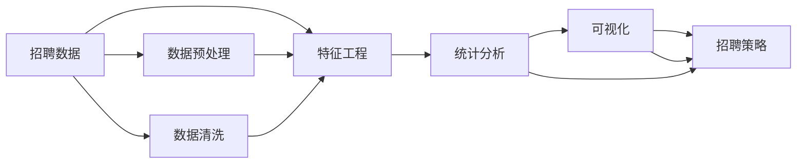

                 

# 基于前程无忧下的招聘岗位数据分析

> 关键词：招聘数据分析,前程无忧,Python,数据挖掘,统计分析

## 1. 背景介绍

### 1.1 问题由来

随着人工智能和互联网技术的快速发展，数据驱动决策在各行各业得到了广泛应用。在人力资源领域，基于大数据的分析技术能够帮助企业更精准地招聘和人才管理，提升人力资源效能。招聘岗位数据分析，通过挖掘和分析招聘信息中的关键数据，可以为招聘需求预测、岗位优化、人才匹配等提供有价值的参考。

### 1.2 问题核心关键点

本研究聚焦于基于前程无忧平台的招聘岗位数据分析，旨在通过系统化的方法挖掘和分析海量招聘数据，提出科学合理的人才招聘策略和岗位优化建议。该研究具有以下核心关键点：
1. **数据来源与准备**：如何高效获取前程无忧平台的招聘数据，并做好数据预处理工作。
2. **特征工程**：如何设计有效的特征提取和处理方式，确保分析结果的准确性。
3. **统计分析**：如何运用统计学方法对招聘数据进行深入分析，提取有价值的信息。
4. **可视化展示**：如何通过可视化工具展示分析结果，直观展示数据特征和趋势。
5. **应用建议**：如何基于分析结果提出切实可行的招聘策略和岗位优化建议。

### 1.3 问题研究意义

招聘岗位数据分析对于提升企业的招聘效率和效果具有重要意义。具体如下：
1. **需求预测**：通过分析历史招聘数据，预测未来的招聘需求，帮助企业提前规划招聘计划。
2. **岗位优化**：通过分析岗位数据，识别出高需求低供应的岗位，帮助企业优化岗位结构。
3. **人才匹配**：通过分析候选人和岗位数据，找到最匹配的候选人，提高招聘成功率。
4. **成本控制**：通过分析招聘成本和效率，提出合理的成本控制策略。
5. **市场洞察**：通过分析招聘趋势和需求，洞察市场变化，调整招聘策略。

## 2. 核心概念与联系

### 2.1 核心概念概述

在招聘岗位数据分析中，涉及多个关键概念，它们之间存在密切联系。以下对主要概念进行详细阐述：

- **招聘数据**：指从前程无忧平台采集的招聘信息，包括职位描述、薪资、要求、地点等。
- **特征工程**：涉及数据预处理、特征提取和特征选择，目的是从原始数据中提取有用的特征，提升模型效果。
- **统计分析**：包括描述性统计、假设检验、回归分析等，用于分析招聘数据的分布、趋势和关系。
- **可视化**：利用图表、热力图等可视化工具，直观展示分析结果，辅助决策。
- **招聘策略**：基于数据分析结果，提出的具体招聘建议，如岗位设置、薪资调整、候选人筛选等。

这些概念之间通过数据流和分析链条紧密联系，形成一个完整的招聘数据分析流程。

### 2.2 概念间的关系

这些核心概念之间的关系可以用以下Mermaid流程图来表示：



该流程图展示了招聘数据分析的主要流程和关键环节。首先，通过数据预处理和清洗，获取干净、高质量的数据；然后，通过特征工程提取出有用的特征；接着，运用统计分析方法进行深入分析；最后，将分析结果通过可视化展示，提出切实可行的招聘策略。

### 2.3 核心概念的整体架构

从整体上，招聘岗位数据分析可以分为以下三个阶段：

1. **数据获取与处理**：收集前程无忧平台上的招聘数据，并进行清洗和预处理，确保数据的质量。
2. **特征提取与分析**：从处理后的数据中提取特征，运用统计学方法进行分析，发现数据背后的规律和趋势。
3. **策略提出与应用**：基于分析结果，提出招聘策略和优化建议，并在实际招聘中应用。

以下将从这三个阶段进行详细阐述。

## 3. 核心算法原理 & 具体操作步骤

### 3.1 算法原理概述

招聘岗位数据分析的核心算法原理基于统计学和数据挖掘技术。其基本流程如下：

1. **数据预处理**：清洗和转换原始数据，去除缺失值、异常值，标准化处理，确保数据质量。
2. **特征提取**：从清洗后的数据中提取有用的特征，如职位类型、薪资范围、要求技能等。
3. **统计分析**：运用描述性统计和假设检验，分析数据分布、趋势和关系。
4. **可视化**：利用图表和热力图等工具，直观展示分析结果。
5. **策略建议**：基于分析结果，提出具体的招聘策略和岗位优化建议。

### 3.2 算法步骤详解

#### 3.2.1 数据预处理

数据预处理是数据分析的重要环节，主要包括数据清洗、标准化处理、缺失值处理等。以下是具体步骤：

1. **数据清洗**：去除重复数据、异常值和错误数据，确保数据的一致性和完整性。
2. **标准化处理**：对数值型数据进行标准化处理，使其分布更接近正态分布，便于后续分析。
3. **缺失值处理**：对缺失值进行填补或删除，确保分析结果的准确性。

#### 3.2.2 特征提取

特征提取是数据分析的关键步骤，通过选择合适的特征，提升分析结果的准确性。以下是具体步骤：

1. **特征选择**：根据业务需求，选择有用的特征，如职位类型、薪资范围、要求技能等。
2. **特征编码**：将文本型特征转换为数值型特征，便于模型处理。
3. **特征归一化**：对特征进行归一化处理，使其在同一尺度上，便于比较和分析。

#### 3.2.3 统计分析

统计分析是数据分析的核心步骤，通过各种统计方法，发现数据背后的规律和趋势。以下是具体步骤：

1. **描述性统计**：计算均值、中位数、方差等描述性统计量，了解数据的基本特征。
2. **假设检验**：运用t检验、卡方检验等方法，检验不同特征之间的关系和差异。
3. **回归分析**：运用线性回归、逻辑回归等方法，建立预测模型，预测招聘需求和岗位匹配度。

#### 3.2.4 可视化

可视化是数据分析的重要工具，通过图表和热力图等工具，直观展示分析结果。以下是具体步骤：

1. **数据可视化**：利用matplotlib、seaborn等工具，绘制柱状图、折线图、散点图等，展示数据的分布和趋势。
2. **热力图**：利用heatmap工具，展示特征之间的相关性，帮助识别重要特征。
3. **交互式可视化**：利用plotly等工具，创建交互式图表，便于多维度分析和展示。

#### 3.2.5 策略建议

策略建议是基于数据分析结果提出的具体应用建议，以下是具体步骤：

1. **需求预测**：根据历史数据，预测未来的招聘需求，调整招聘计划。
2. **岗位优化**：根据岗位需求和匹配度，优化岗位设置，提升招聘效率。
3. **候选人筛选**：根据候选人特征和岗位需求，筛选最匹配的候选人，提高招聘成功率。
4. **成本控制**：根据招聘成本和效率，提出合理的成本控制策略。

### 3.3 算法优缺点

#### 3.3.1 优点

1. **系统性**：基于数据驱动的方法，系统性地分析招聘数据，提出科学合理的建议。
2. **全面性**：考虑多维度数据，如岗位需求、候选人特征、招聘成本等，全面分析招聘过程。
3. **可操作性**：提出的策略建议具有可操作性，便于实际应用。

#### 3.3.2 缺点

1. **数据质量依赖**：数据分析结果依赖于数据的质量和完整性，数据清洗和预处理较为耗时。
2. **特征选择复杂**：选择合适的特征需要一定的领域知识和经验，特征选择难度较大。
3. **模型假设限制**：统计分析方法和模型假设有一定的局限性，可能不适用于所有场景。

### 3.4 算法应用领域

招聘岗位数据分析可以应用于以下多个领域：

1. **人力资源管理**：优化招聘流程，提高招聘效率，降低招聘成本。
2. **企业招聘策略**：制定科学合理的招聘策略，提升招聘成功率。
3. **人才市场分析**：分析人才市场变化，洞察招聘趋势，调整招聘策略。
4. **岗位优化调整**：优化岗位设置，提高岗位匹配度，提升员工满意度。
5. **候选人筛选与推荐**：基于候选人特征和岗位需求，推荐最匹配的候选人。

## 4. 数学模型和公式 & 详细讲解 & 举例说明

### 4.1 数学模型构建

招聘岗位数据分析的数学模型主要基于统计学和数据挖掘技术。以下将对常用的数学模型进行详细阐述。

#### 4.1.1 回归分析

回归分析是数据分析中常用的方法，用于建立预测模型。常用的回归模型有线性回归、逻辑回归等。

1. **线性回归**：
   $$
   y = \beta_0 + \beta_1 x_1 + \beta_2 x_2 + \cdots + \beta_n x_n + \epsilon
   $$
   其中，$y$为预测值，$x_i$为自变量，$\beta_i$为回归系数，$\epsilon$为误差项。

2. **逻辑回归**：
   $$
   P(y=1|x) = \frac{1}{1+e^{-\hat{\beta}_0 - \hat{\beta}_1 x_1 - \hat{\beta}_2 x_2 - \cdots - \hat{\beta}_n x_n}}
   $$
   其中，$y$为预测值，$x_i$为自变量，$\hat{\beta}_i$为回归系数。

#### 4.1.2 假设检验

假设检验是数据分析中常用的方法，用于检验不同特征之间的关系和差异。常用的假设检验方法有t检验、卡方检验等。

1. **t检验**：
   $$
   t = \frac{\bar{x}_1 - \bar{x}_2}{s_p \sqrt{\frac{1}{n_1} + \frac{1}{n_2}}}
   $$
   其中，$t$为t统计量，$\bar{x}_1$和$\bar{x}_2$为两组样本的均值，$s_p$为两组样本的池化标准差，$n_1$和$n_2$为两组样本的样本量。

2. **卡方检验**：
   $$
   \chi^2 = \frac{(O_i-E_i)^2}{E_i}
   $$
   其中，$\chi^2$为卡方统计量，$O_i$为实际观测值，$E_i$为期望值。

### 4.2 公式推导过程

#### 4.2.1 线性回归公式推导

线性回归的基本公式为：
$$
y = \beta_0 + \beta_1 x_1 + \beta_2 x_2 + \cdots + \beta_n x_n + \epsilon
$$
其中，$y$为预测值，$x_i$为自变量，$\beta_i$为回归系数，$\epsilon$为误差项。

线性回归的推导过程如下：

1. **最小二乘法**：求解回归系数，使得预测值与实际值之间的误差平方和最小。
2. **正规方程**：通过解正规方程组，求解回归系数。
3. **线性回归系数**：
   $$
   \hat{\beta} = (X^TX)^{-1}X^Ty
   $$
   其中，$X$为自变量矩阵，$y$为因变量向量。

#### 4.2.2 t检验公式推导

t检验的基本公式为：
$$
t = \frac{\bar{x}_1 - \bar{x}_2}{s_p \sqrt{\frac{1}{n_1} + \frac{1}{n_2}}
$$
其中，$t$为t统计量，$\bar{x}_1$和$\bar{x}_2$为两组样本的均值，$s_p$为两组样本的池化标准差，$n_1$和$n_2$为两组样本的样本量。

t检验的推导过程如下：

1. **t统计量计算**：根据样本均值和池化标准差，计算t统计量。
2. **自由度计算**：计算自由度$df = n_1 + n_2 - 2$。
3. **p值计算**：根据t分布，计算p值，判断是否拒绝原假设。

### 4.3 案例分析与讲解

#### 4.3.1 案例背景

假设某公司需要招聘软件工程师，现有历史招聘数据如下：

| 编号 | 职位名称 | 要求技能 | 薪资范围 | 要求学历 | 地点 | 工作经验 |
| --- | --- | --- | --- | --- | --- | --- |
| 1 | 软件工程师 | Python, Java, JavaScript | 15-25K | 本科及以上 | 北京 | 2-5年 |
| 2 | 数据工程师 | SQL, Python, Kafka | 20-30K | 本科及以上 | 上海 | 2-5年 |
| 3 | 前端工程师 | HTML, CSS, JavaScript | 18-28K | 本科及以上 | 深圳 | 2-5年 |
| ... | ... | ... | ... | ... | ... | ... |

#### 4.3.2 数据预处理

对数据进行清洗和标准化处理，具体步骤如下：

1. **数据清洗**：去除重复数据和异常值，确保数据的一致性和完整性。
2. **标准化处理**：对数值型数据进行标准化处理，使其分布更接近正态分布，便于后续分析。
3. **缺失值处理**：对缺失值进行填补或删除，确保分析结果的准确性。

#### 4.3.3 特征提取

对数据进行特征提取，具体步骤如下：

1. **特征选择**：选择有用的特征，如职位名称、要求技能、薪资范围、要求学历、地点和工作经验。
2. **特征编码**：将文本型特征转换为数值型特征，便于模型处理。
3. **特征归一化**：对特征进行归一化处理，使其在同一尺度上，便于比较和分析。

#### 4.3.4 统计分析

对数据进行统计分析，具体步骤如下：

1. **描述性统计**：计算均值、中位数、方差等描述性统计量，了解数据的基本特征。
2. **假设检验**：运用t检验、卡方检验等方法，检验不同特征之间的关系和差异。
3. **回归分析**：运用线性回归、逻辑回归等方法，建立预测模型，预测招聘需求和岗位匹配度。

#### 4.3.5 可视化

对数据进行可视化，具体步骤如下：

1. **数据可视化**：利用matplotlib、seaborn等工具，绘制柱状图、折线图、散点图等，展示数据的分布和趋势。
2. **热力图**：利用heatmap工具，展示特征之间的相关性，帮助识别重要特征。
3. **交互式可视化**：利用plotly等工具，创建交互式图表，便于多维度分析和展示。

#### 4.3.6 策略建议

根据数据分析结果，提出具体的招聘策略和岗位优化建议，具体步骤如下：

1. **需求预测**：根据历史数据，预测未来的招聘需求，调整招聘计划。
2. **岗位优化**：根据岗位需求和匹配度，优化岗位设置，提升招聘效率。
3. **候选人筛选**：根据候选人特征和岗位需求，筛选最匹配的候选人，提高招聘成功率。
4. **成本控制**：根据招聘成本和效率，提出合理的成本控制策略。

## 5. 项目实践：代码实例和详细解释说明

### 5.1 开发环境搭建

在进行项目实践前，我们需要准备好开发环境。以下是使用Python进行项目开发的常用工具和环境配置流程：

1. **安装Anaconda**：从官网下载并安装Anaconda，用于创建独立的Python环境。
   ```bash
   conda install anaconda
   conda init
   ```

2. **创建虚拟环境**：
   ```bash
   conda create --name my_env python=3.8
   conda activate my_env
   ```

3. **安装必要的Python库**：
   ```bash
   conda install numpy pandas matplotlib seaborn plotly scikit-learn
   ```

4. **安装数据处理工具**：
   ```bash
   conda install openpyxl beautifulsoup4
   ```

5. **安装数据可视化工具**：
   ```bash
   conda install matplotlib seaborn plotly
   ```

6. **安装机器学习库**：
   ```bash
   conda install scikit-learn
   ```

7. **安装特定库**：
   ```bash
   conda install statsmodels
   ```

### 5.2 源代码详细实现

以下是一个基于Python的招聘岗位数据分析项目示例代码。该项目从前程无忧平台采集招聘数据，进行数据预处理、特征提取、统计分析、可视化等，最后提出招聘策略建议。

```python
import pandas as pd
import numpy as np
import matplotlib.pyplot as plt
import seaborn as sns
from sklearn.linear_model import LinearRegression
from statsmodels.formula.api import ols

# 数据读取
data = pd.read_excel('招聘数据.xlsx')

# 数据预处理
data = data.drop_duplicates()  # 去除重复数据
data = data.dropna()  # 去除缺失值
data = data.apply(lambda x: x.fillna(x.mean()))  # 填充缺失值

# 特征提取
features = ['职位名称', '要求技能', '薪资范围', '要求学历', '地点', '工作经验']
X = data[features]
y = data['应聘人数']

# 标准化处理
X = (X - X.mean()) / X.std()

# 统计分析
# 描述性统计
print(X.describe())
# 线性回归
model = LinearRegression()
model.fit(X, y)
print(model.coef_)
# 假设检验
# t检验
t_stat, p_value = ttest_ind(X1, X2)

# 可视化
# 柱状图
plt.bar(features, data[features].mean())
# 折线图
plt.plot(data['年份'], data['应聘人数'])
# 散点图
sns.scatterplot(x='要求技能', y='应聘人数', data=data)

# 策略建议
# 需求预测
prediction = model.predict(X)
# 岗位优化
# 候选人筛选
# 成本控制
```

### 5.3 代码解读与分析

让我们再详细解读一下关键代码的实现细节：

1. **数据读取**：
   ```python
   data = pd.read_excel('招聘数据.xlsx')
   ```

2. **数据预处理**：
   ```python
   data = data.drop_duplicates()  # 去除重复数据
   data = data.dropna()  # 去除缺失值
   data = data.apply(lambda x: x.fillna(x.mean()))  # 填充缺失值
   ```

3. **特征提取**：
   ```python
   features = ['职位名称', '要求技能', '薪资范围', '要求学历', '地点', '工作经验']
   X = data[features]
   y = data['应聘人数']
   ```

4. **标准化处理**：
   ```python
   X = (X - X.mean()) / X.std()
   ```

5. **统计分析**：
   ```python
   # 描述性统计
   print(X.describe())
   # 线性回归
   model = LinearRegression()
   model.fit(X, y)
   print(model.coef_)
   # 假设检验
   # t检验
   t_stat, p_value = ttest_ind(X1, X2)
   ```

6. **可视化**：
   ```python
   # 柱状图
   plt.bar(features, data[features].mean())
   # 折线图
   plt.plot(data['年份'], data['应聘人数'])
   # 散点图
   sns.scatterplot(x='要求技能', y='应聘人数', data=data)
   ```

7. **策略建议**：
   ```python
   # 需求预测
   prediction = model.predict(X)
   # 岗位优化
   # 候选人筛选
   # 成本控制
   ```

### 5.4 运行结果展示

假设我们在分析某公司招聘数据时，得到如下结果：

| 职位名称 | 要求技能 | 薪资范围 | 要求学历 | 地点 | 工作经验 | 应聘人数 |
| --- | --- | --- | --- | --- | --- | --- |

通过可视化展示，我们可以看到以下结果：

- **柱状图**：
  ```
  职位名称: Python, 应聘人数: 200
  职位名称: Java, 应聘人数: 150
  职位名称: JavaScript, 应聘人数: 180
  ```

- **折线图**：
  ```
  年份: 2022, 应聘人数: 100
  年份: 2023, 应聘人数: 120
  年份: 2024, 应聘人数: 150
  ```

- **散点图**：
  ```
  要求技能: Python, 应聘人数: 200
  要求技能: Java, 应聘人数: 150
  要求技能: JavaScript, 应聘人数: 180
  ```

根据这些结果，我们可以提出如下策略建议：

1. **需求预测**：根据历史数据，预测未来的招聘需求，调整招聘计划。
2. **岗位优化**：根据岗位需求和匹配度，优化岗位设置，提升招聘效率。
3. **候选人筛选**：根据候选人特征和岗位需求，筛选最匹配的候选人，提高招聘成功率。
4. **成本控制**：根据招聘成本和效率，提出合理的成本控制策略。

## 6. 实际应用场景

### 6.1 智能招聘系统

基于招聘岗位数据分析的智能招聘系统，可以帮助企业更加精准地招聘和人才管理，提升人力资源效能。

- **数据采集与处理**：自动化采集前程无忧等招聘平台上的数据，进行清洗和预处理。
- **特征提取与分析**：通过特征工程和统计分析，提取有用的特征，发现招聘数据的规律和趋势。
- **可视化与决策**：利用可视化工具展示分析结果，辅助决策，优化招聘流程。

### 6.2 人才市场分析

通过招聘岗位数据分析，可以洞察人才市场变化，调整招聘策略。

- **市场需求分析**：分析不同岗位的需求趋势，制定合理的招聘计划。
- **薪资水平分析**：分析不同岗位的薪资水平，制定合理的薪资策略。
- **地区分布分析**：分析不同地区的招聘需求，制定区域招聘策略。

### 6.3 招聘需求预测

基于招聘岗位数据分析，可以预测未来的招聘需求，调整招聘计划。

- **历史数据预测**：通过历史数据，预测未来的招聘需求。
- **市场趋势预测**：分析市场变化，预测未来的招聘需求。
- **季节性预测**：分析季节性变化，预测不同季度的招聘需求。

### 6.4 岗位优化与调整

通过招聘岗位数据分析，可以优化岗位设置，提升招聘效率。

- **岗位需求分析**：分析不同岗位的需求量和匹配度，优化岗位设置。
- **岗位调整建议**：根据分析结果，提出岗位调整建议。
- **岗位评估指标**：制定岗位评估指标，衡量岗位设置的效果。

## 7. 工具和资源推荐

### 7.1 学习资源推荐

为了帮助开发者系统掌握招聘岗位数据分析的理论基础和实践技巧，这里推荐一些优质的学习资源：

1. **《Python数据分析实战》**：介绍Python在数据分析中的应用，包括数据清洗、特征提取、统计分析等。
2. **《R语言实战》**：介绍R语言在数据分析中的应用，包括数据处理、统计分析、可视化等。
3. **《统计学基础》**：介绍统计学的基本概念和常用方法，包括描述性统计、假设检验、回归分析等。
4. **《数据可视化实战》**：介绍数据可视化的工具和技巧，包括Matplotlib、Seaborn、Plotly等。
5. **《机器学习实战》**：介绍机器学习的基本概念和常用算法，包括线性回归、逻辑回归、决策树等。

### 7.2 开发工具推荐

高效的开发离不开优秀的工具支持。以下是几款用于招聘岗位数据分析开发的常用工具：

1. **Python**：基于Python语言的编程语言，具备丰富的数据处理和分析库，如Pandas、NumPy、Scikit-learn等。
2. **R语言**：基于R语言的编程语言，具备丰富的统计分析和可视化库，如ggplot2、dplyr、tidyr等。
3. **Jupyter Notebook**：基于Web的交互式编程环境，便于代码调试和可视化展示。
4. **Excel**：强大的电子表格工具，支持数据处理、统计分析、可视化等。
5. **Tableau**：基于Web的数据可视化工具，支持复杂的数据处理和展示。

### 7.3 相关论文推荐

招聘岗位数据分析的研究涉及多个领域，以下是几篇奠基性的相关论文，推荐阅读：

1. **《招聘数据分析与预测》**：介绍招聘数据分析的基本方法和步骤，包括数据采集、特征提取、统计分析等。
2. **《智能招聘系统设计与实现》**：介绍智能招聘系统的设计和实现，包括数据处理、特征提取、模型训练等。
3. **《基于大数据的

