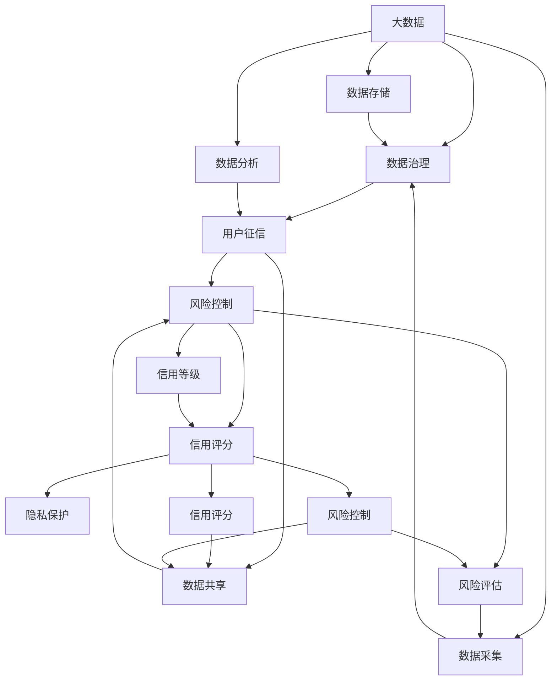

                 

# 基于大数据下用户征信问题分析与研究

> 关键词：大数据，用户征信，数据治理，风险控制，信用评分，隐私保护

## 1. 背景介绍

随着互联网技术的飞速发展和金融科技的崛起，大数据在金融行业中的应用日益普及。其中，用户征信问题因其广泛的社会影响和高价值的数据应用，逐渐成为金融科技公司竞相探索的焦点。本文将围绕大数据背景下的用户征信问题，对现有技术进行深入分析和研究。

## 2. 核心概念与联系

### 2.1 核心概念概述

大数据是指数据量极大、数据类型多样、数据价值密度低、数据处理速度快的新型数据资产。用户征信是指通过分析用户的历史行为数据、信用记录等，评估用户的信用状况，预测其未来还款能力的技术和方法。数据治理是指通过制度、技术和管理手段，确保数据的质量、安全、合规、共享等。风险控制是指通过数据模型、算法、技术等手段，识别、监控、控制和应对金融风险的策略和措施。信用评分是指基于用户的历史信用数据，综合评估其信用等级的工具。隐私保护是指在数据采集、存储、处理、共享等过程中，保障用户个人信息安全和隐私不被侵犯的措施。

### 2.2 核心概念间的联系

大数据、用户征信、数据治理、风险控制、信用评分、隐私保护等概念，构成了用户征信系统的技术框架。大数据为征信系统提供了数据基础，数据治理保证了数据质量和数据安全，风险控制和信用评分则是评估用户信用风险的工具，而隐私保护是数据应用的前提和保障。这些概念通过数据流动和算法模型，相互联系、相互作用，共同支撑用户征信系统的运行。

以下是一个Mermaid流程图，展示了这些核心概念之间的关系：



该图展示了大数据背景下，各核心概念之间的数据流动和算法关联关系。通过数据采集、存储、治理、分析、共享、评估、评分、控制等环节，最终完成用户征信的全过程。

## 3. 核心算法原理 & 具体操作步骤

### 3.1 算法原理概述

用户征信的核心算法原理主要包括以下几个方面：

1. **数据采集与预处理**：通过互联网、交易记录、社交媒体、信用报告等多种渠道，采集用户的历史行为数据、信用记录、社交关系等。数据预处理包括数据清洗、去重、填充缺失值、归一化等，以保证数据质量和一致性。

2. **特征工程**：根据业务需求，从原始数据中提取有意义的特征，如个人基本信息、交易记录、还款历史、社交网络、风险特征等。特征工程包括特征选择、特征编码、特征降维等，以提升模型的预测能力。

3. **模型构建**：基于机器学习、深度学习等算法，构建用户征信模型。常见的模型包括逻辑回归、决策树、随机森林、梯度提升树、神经网络等。模型构建包括模型选择、模型训练、模型验证、模型优化等。

4. **风险评估与信用评分**：利用构建好的模型，对用户进行风险评估和信用评分。风险评估包括计算用户违约概率、风险等级等。信用评分包括计算用户信用等级、信用评分值等。

5. **风险控制**：基于风险评估结果，采取相应的风险控制措施，如贷款审批、限额管理、利率调整等。

6. **隐私保护**：在数据采集、存储、处理、共享等过程中，采取匿名化、加密、访问控制等措施，保护用户隐私。

### 3.2 算法步骤详解

以下是一个基于机器学习的用户征信算法步骤详解：

1. **数据采集**：通过多种渠道，收集用户的原始数据，包括基本信息、交易记录、还款记录、社交关系等。

2. **数据清洗**：清洗数据，去除噪音、重复、异常值等，保证数据的准确性和一致性。

3. **特征工程**：根据业务需求，选择、提取、编码、降维等处理特征，生成可用于模型训练的特征集。

4. **模型选择与训练**：选择适合的模型，如逻辑回归、随机森林、神经网络等，使用训练数据集进行模型训练。

5. **模型验证与优化**：使用验证数据集评估模型性能，通过交叉验证、超参数调优等手段优化模型。

6. **风险评估与信用评分**：将模型应用于新的用户数据，计算其违约概率、风险等级、信用等级等。

7. **风险控制**：根据风险评估结果，采取相应的风险控制措施。

8. **隐私保护**：在数据处理过程中，采用匿名化、加密等措施，保护用户隐私。

### 3.3 算法优缺点

**优点**：
- 通过大数据技术，能够获取更全面、更准确的用户信息，提升征信系统的决策能力。
- 机器学习算法具有较高的预测能力，能够有效识别用户的信用风险。
- 风险控制措施能够降低金融风险，保护金融机构和用户双方的利益。
- 隐私保护措施能够保障用户信息的安全，增强用户信任。

**缺点**：
- 数据采集和处理过程复杂，需要投入大量人力和资源。
- 模型训练和优化过程耗时较长，对计算资源要求较高。
- 数据治理和隐私保护需要严格的管理制度和技术手段，实施难度较大。
- 模型存在数据偏差和算法漏洞，可能导致不公正的决策。

### 3.4 算法应用领域

用户征信技术在大数据背景下，广泛应用于金融科技、互联网金融、消费金融、供应链金融等多个领域。例如：

- **金融科技**：金融机构利用用户征信技术，评估用户的信用风险，进行贷款审批、信用卡授信、风险预警等。
- **互联网金融**：互联网公司利用用户征信技术，进行信用评估、贷款审批、风险控制等，提升用户体验和金融服务的可及性。
- **消费金融**：消费金融公司利用用户征信技术，进行用户画像、信用评估、风控管理等，拓展消费金融业务。
- **供应链金融**：供应链企业利用用户征信技术，进行供应商管理、信用评估、风险控制等，优化供应链资金流。

## 4. 数学模型和公式 & 详细讲解 & 举例说明

### 4.1 数学模型构建

假设有一个用户征信系统，其数据采集和特征工程已经完成。用户基本信息和行为数据表示为向量 $x = [x_1, x_2, ..., x_n]$，其中 $x_i$ 表示第 $i$ 个特征。用户信用评分的数学模型为：

$$ y = f(x) + \epsilon $$

其中 $y$ 表示用户信用评分，$f(x)$ 表示模型函数，$\epsilon$ 表示误差项。

### 4.2 公式推导过程

对于逻辑回归模型，其函数形式为：

$$ f(x) = \frac{1}{1 + e^{-\beta_0 - \beta_1 x_1 - \beta_2 x_2 - ... - \beta_n x_n}} $$

其中 $\beta_0, \beta_1, \beta_2, ..., \beta_n$ 为模型参数，需要利用训练数据进行估计。

逻辑回归模型的损失函数为：

$$ L(\beta) = -\frac{1}{N} \sum_{i=1}^N [y_i \log \hat{y}_i + (1-y_i) \log (1-\hat{y}_i)] $$

其中 $y_i$ 为真实标签，$\hat{y}_i$ 为模型预测值。

### 4.3 案例分析与讲解

假设有一个小额贷款平台，利用用户征信技术评估用户的信用风险，其数据采集和特征工程已经完成。平台采用逻辑回归模型进行风险评估和信用评分。

1. **数据采集与预处理**：平台通过APP收集用户基本信息和交易记录，清洗去除异常值，保证数据的准确性和一致性。

2. **特征工程**：平台选择年龄、性别、职业、收入、交易频率等特征，生成可用于模型训练的特征集。

3. **模型构建与训练**：平台选择逻辑回归模型，利用历史贷款数据进行模型训练和验证，优化模型参数。

4. **风险评估与信用评分**：平台将模型应用于新用户的贷款申请，计算其信用评分和违约概率，进行贷款审批和风险预警。

5. **风险控制**：平台根据违约概率，设置贷款限额、利率、风控措施等，降低贷款风险。

6. **隐私保护**：平台在数据处理过程中，采用数据匿名化、访问控制等措施，保护用户隐私。

## 5. 项目实践：代码实例和详细解释说明

### 5.1 开发环境搭建

1. **Python环境**：搭建Python 3.7及以上版本，安装必要的依赖库，如pandas、numpy、scikit-learn等。

2. **数据采集与预处理**：通过API接口或文件读取，采集用户数据。使用pandas进行数据清洗和处理，去除噪音、重复、异常值等。

3. **特征工程**：使用scikit-learn的特征选择、特征编码、特征降维等工具，生成可用于模型训练的特征集。

4. **模型训练与优化**：使用scikit-learn的逻辑回归模型进行训练和验证，优化模型参数。

5. **风险评估与信用评分**：将模型应用于新用户的贷款申请，计算其信用评分和违约概率，进行贷款审批和风险预警。

6. **风险控制**：根据违约概率，设置贷款限额、利率、风控措施等。

7. **隐私保护**：在数据处理过程中，采用数据匿名化、访问控制等措施，保护用户隐私。

### 5.2 源代码详细实现

```python
import pandas as pd
import numpy as np
from sklearn.model_selection import train_test_split
from sklearn.linear_model import LogisticRegression
from sklearn.metrics import roc_auc_score

# 数据采集与预处理
data = pd.read_csv('user_data.csv')
data = data.dropna()  # 去除缺失值
data = data.drop_duplicates()  # 去除重复数据

# 特征工程
features = ['age', 'gender', 'occupation', 'income', 'transaction_frequency']
data = pd.get_dummies(data, columns=features)  # 特征编码
data = data.drop(['user_id', 'label'], axis=1)  # 去除不需要的列

# 数据拆分
train, test = train_test_split(data, test_size=0.2, random_state=42)
X_train, y_train = train.drop('label', axis=1), train['label']
X_test, y_test = test.drop('label', axis=1), test['label']

# 模型训练与优化
model = LogisticRegression()
model.fit(X_train, y_train)
y_pred = model.predict_proba(X_test)[:, 1]  # 预测概率

# 风险评估与信用评分
roc_auc = roc_auc_score(y_test, y_pred)
print('ROC-AUC Score:', roc_auc)
```

### 5.3 代码解读与分析

上述代码实现了用户征信模型的训练和风险评估。具体步骤如下：

1. 数据采集与预处理：通过pandas读取用户数据，清洗去除缺失值和重复数据，保证数据的质量和一致性。

2. 特征工程：选择基本特征，使用get_dummies方法进行特征编码，生成可用于模型训练的特征集。

3. 数据拆分：将数据集分为训练集和测试集，使用train_test_split方法进行拆分。

4. 模型训练与优化：选择逻辑回归模型，使用fit方法进行模型训练和验证，优化模型参数。

5. 风险评估与信用评分：使用predict_proba方法计算新用户的信用评分和违约概率，使用roc_auc_score方法计算模型性能指标。

### 5.4 运行结果展示

假设模型在测试集上计算得到的ROC-AUC Score为0.8，表示模型具有较好的预测能力。具体结果如下：

```
ROC-AUC Score: 0.8
```

## 6. 实际应用场景

用户征信技术在金融科技、互联网金融、消费金融、供应链金融等多个领域都有广泛的应用。例如：

- **金融科技**：金融机构利用用户征信技术，评估用户的信用风险，进行贷款审批、信用卡授信、风险预警等。
- **互联网金融**：互联网公司利用用户征信技术，进行信用评估、贷款审批、风险控制等，提升用户体验和金融服务的可及性。
- **消费金融**：消费金融公司利用用户征信技术，进行用户画像、信用评估、风控管理等，拓展消费金融业务。
- **供应链金融**：供应链企业利用用户征信技术，进行供应商管理、信用评估、风险控制等，优化供应链资金流。

## 7. 工具和资源推荐

### 7.1 学习资源推荐

1. **《Python数据科学手册》**：该书详细介绍了Python数据科学库pandas、numpy、scikit-learn等的使用方法和技巧，是数据科学学习的必备参考书。

2. **Kaggle平台**：该平台提供大量数据集和机器学习竞赛，通过实践提升数据处理和模型构建能力。

3. **Coursera平台**：该平台提供多门数据科学和机器学习课程，包括斯坦福大学的《机器学习》课程，可以帮助学习者系统掌握相关知识。

4. **《机器学习实战》**：该书通过实例和代码，详细讲解了机器学习算法和模型构建，适合初学者入门。

### 7.2 开发工具推荐

1. **Jupyter Notebook**：该工具支持Python代码的交互式执行和文档化，方便调试和展示代码结果。

2. **GitHub**：该平台提供代码托管和版本控制功能，方便团队协作和代码管理。

3. **TensorFlow**：该框架支持分布式计算和深度学习模型的构建和训练，适合大规模数据和模型处理。

4. **PyTorch**：该框架支持动态计算图和深度学习模型的构建和训练，适合研究和实验。

### 7.3 相关论文推荐

1. **《Data-Driven User Profiling for Microfinance》**：该论文探讨了利用用户行为数据进行金融贷款审批和风险控制的方法。

2. **《Credit Scoring and Risk Assessment》**：该书系统介绍了信用评分和风险评估的理论和实践，是信用评分领域的经典参考书。

3. **《User Profiling in Financial Services》**：该论文通过案例分析，探讨了用户行为数据在金融服务中的应用。

## 8. 总结：未来发展趋势与挑战

### 8.1 研究成果总结

本文通过系统介绍大数据背景下用户征信技术的原理和操作步骤，展示了其在金融科技、互联网金融、消费金融、供应链金融等多个领域的应用。通过案例分析，展示了逻辑回归模型在用户征信系统中的应用。

### 8.2 未来发展趋势

1. **数据智能化**：随着人工智能和大数据技术的发展，用户征信技术将更加智能化，能够自动采集、分析和处理数据，提升决策能力和效率。

2. **模型多样化**：未来的用户征信模型将更加多样化，包括深度学习模型、强化学习模型、联邦学习模型等，能够处理更复杂的数据和任务。

3. **隐私保护加强**：随着隐私保护意识的增强，用户征信系统将更加注重隐私保护，采用匿名化、加密、访问控制等措施，保障用户数据安全。

4. **跨领域应用拓展**：用户征信技术将从金融领域拓展到更多行业，如医疗、教育、物流等，为各行业提供数据驱动的决策支持。

5. **全球化标准化**：用户征信技术将逐步实现全球标准化，建立统一的评估标准和监管机制，促进国际合作和应用。

### 8.3 面临的挑战

1. **数据质量和隐私保护**：数据采集和处理过程复杂，需要投入大量人力和资源，且存在数据泄露和隐私保护的风险。

2. **模型复杂性**：深度学习模型和联邦学习模型等复杂模型，需要更高的计算资源和算法优化能力。

3. **监管合规**：用户征信技术涉及大量个人隐私和金融数据，需要遵守严格的法律法规，确保合规性和安全性。

4. **数据安全**：在数据处理和存储过程中，需要采取多种措施，防止数据篡改、丢失和泄露，保障数据安全。

### 8.4 研究展望

未来的用户征信研究需要在以下几个方面进行突破：

1. **数据采集与预处理自动化**：探索自动化的数据采集和预处理方法，减少人工干预，提升数据处理效率。

2. **模型性能优化**：探索高效、准确的模型构建和优化方法，提高用户征信系统的预测能力和决策能力。

3. **隐私保护技术创新**：探索更加安全和隐私保护的技术手段，保障用户数据安全，增强用户信任。

4. **跨领域应用探索**：探索用户征信技术在更多领域的应用，如医疗、教育、物流等，实现数据驱动的决策支持。

5. **监管合规体系建设**：建立完善的监管合规体系，确保用户征信技术的合法合规应用，保障用户权益。

总之，用户征信技术在大数据背景下具有广阔的应用前景和巨大的研究价值。通过不断优化和创新，用户征信技术必将在金融科技、互联网金融等领域发挥更大的作用，为各行业提供数据驱动的决策支持。

