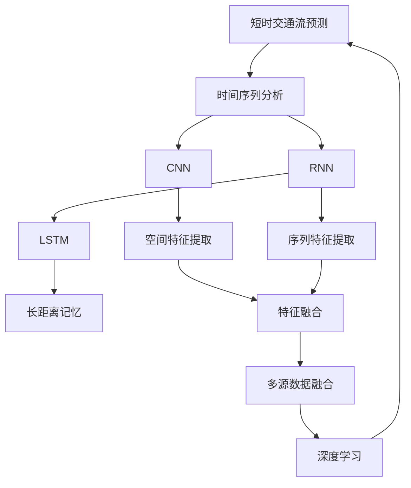
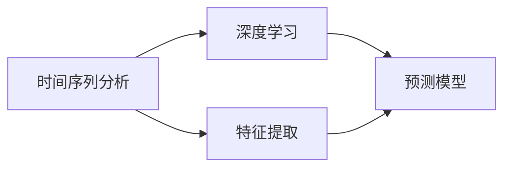
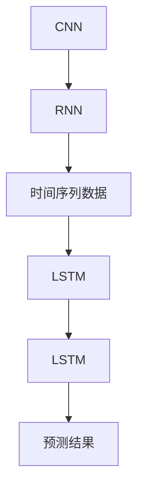
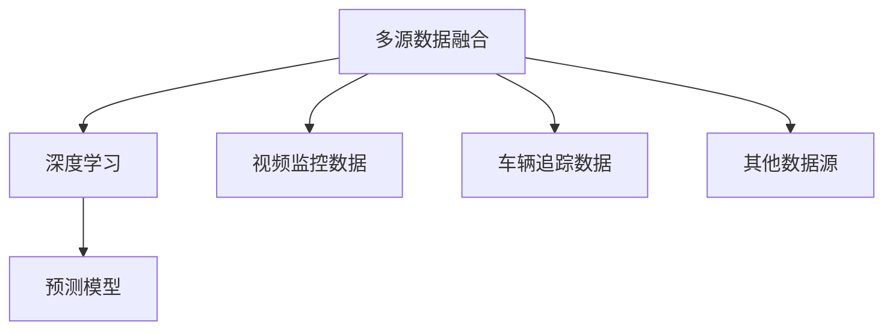
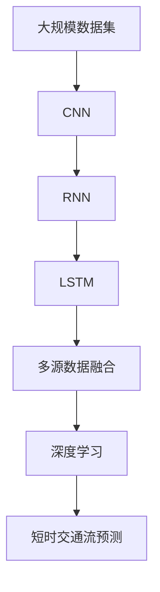

                 

# 基于机器学习的短时交通流预测算法的研究与实现

> 关键词：短时交通流预测, 机器学习, 时间序列分析, 深度学习, CNN, RNN, LSTM, GAN, 车辆追踪, 交通仿真

## 1. 背景介绍

### 1.1 问题由来

随着城市化进程的加快，交通拥堵问题日益突出，对城市交通流预测模型的需求也随之增加。交通流预测旨在通过分析历史交通数据，预测未来的交通流量和状态，为交通管理部门提供科学决策依据。传统的交通流预测方法多基于经验公式和统计方法，存在精度不高、适应性差等缺点。而机器学习方法的兴起为交通流预测带来了新的可能。机器学习能够从大规模数据中自动学习复杂模式，具有自适应性和泛化能力。因此，利用机器学习方法进行交通流预测具有重要意义。

### 1.2 问题核心关键点

机器学习在交通流预测中的应用主要集中在以下几个方面：

- 时间序列分析：交通流时间序列数据通常具有明显的周期性和趋势性，机器学习模型能够捕捉这些特征。
- 空间因素：城市交通流预测需要考虑不同区域间的相互作用和依赖关系，机器学习模型能够建模这些复杂关系。
- 数据融合：交通流预测常常需要融合多种数据源，如视频监控、车辆追踪数据等，机器学习模型能够实现多源数据融合。
- 实时性：交通流预测需要在很短的时间内完成，机器学习模型能够在计算资源允许的范围内实现实时预测。

本研究旨在通过基于机器学习的模型，对短时交通流进行准确预测，为城市交通管理提供支持。我们将采用深度学习技术，结合时间序列分析和空间因素，构建多源数据融合的交通流预测模型。

## 2. 核心概念与联系

### 2.1 核心概念概述

- **短时交通流预测**：利用机器学习模型，对未来15-30分钟内的交通流量和状态进行预测。
- **时间序列分析**：将时间维度作为重要因素，分析交通流时间序列的特征。
- **深度学习**：利用神经网络结构进行特征学习，提高模型的预测能力。
- **CNN（卷积神经网络）**：主要用于空间特征的提取。
- **RNN（循环神经网络）**：用于序列数据的建模和预测。
- **LSTM（长短期记忆网络）**：一种特殊的RNN，可以处理长时间跨度的数据。
- **GAN（生成对抗网络）**：用于生成仿真数据，补充实测数据的不足。

这些概念之间的逻辑关系可以通过以下Mermaid流程图来展示：



这个流程图展示了从短时交通流预测到空间和时间特征提取，再到多源数据融合和深度学习的整体流程。

### 2.2 概念间的关系

这些核心概念之间存在着紧密的联系，形成了短时交通流预测的完整技术体系。下面通过几个Mermaid流程图来展示这些概念之间的关系。

#### 2.2.1 时间序列分析与深度学习的关系



这个流程图展示了时间序列分析如何为深度学习模型提供特征输入，进而实现预测。

#### 2.2.2 CNN与RNN的关系



这个流程图展示了CNN和RNN的结合使用，其中CNN用于空间特征提取，RNN用于时间序列数据的建模和预测。

#### 2.2.3 多源数据融合与深度学习的关系



这个流程图展示了多源数据融合如何为深度学习模型提供更丰富和多样的特征输入，提高预测准确性。

### 2.3 核心概念的整体架构

最后，我们用一个综合的流程图来展示这些核心概念在大规模数据集上的整体架构：



这个综合流程图展示了从大规模数据集到最终的短时交通流预测的全过程，其中CNN用于空间特征提取，RNN用于时间序列数据的建模和预测，LSTM用于长距离记忆，多源数据融合和多源深度学习模型用于融合多源数据，最终实现短时交通流预测。

## 3. 核心算法原理 & 具体操作步骤

### 3.1 算法原理概述

基于机器学习的短时交通流预测算法主要基于时间序列分析和深度学习。我们采用CNN和RNN的组合，结合LSTM模型，构建多源数据融合的交通流预测模型。具体流程如下：

1. **数据预处理**：对原始数据进行清洗、归一化等预处理，生成用于训练的输入数据。
2. **特征提取**：利用CNN提取空间特征，利用RNN/LSTM提取时间序列特征，将两者结合得到融合特征。
3. **模型训练**：使用训练数据对模型进行训练，得到最终的预测模型。
4. **模型评估**：使用测试数据对模型进行评估，计算模型的预测误差和精度。
5. **模型应用**：将训练好的模型应用于实际交通流预测中。

### 3.2 算法步骤详解

#### 3.2.1 数据预处理

数据预处理包括数据清洗、归一化、特征选择等步骤。以交通流量数据为例，步骤如下：

1. **数据清洗**：去除异常值和缺失值，确保数据的质量和完整性。
2. **归一化**：将数据按比例缩放至0到1之间，防止某些特征过大影响模型。
3. **特征选择**：选择对预测有影响的特征，如交通流量、道路拥堵度、天气条件等。

#### 3.2.2 特征提取

利用CNN提取空间特征，步骤如下：

1. **数据划分**：将交通流量数据划分为若干个固定大小的空间窗口。
2. **卷积操作**：使用多个卷积核对每个窗口进行卷积操作，提取特征图。
3. **池化操作**：对特征图进行最大池化操作，保留最显著的特征。
4. **拼接操作**：将每个窗口的特征图拼接起来，生成完整的空间特征向量。

利用RNN/LSTM提取时间序列特征，步骤如下：

1. **序列划分**：将时间序列数据划分为若干个固定大小的时间窗口。
2. **循环操作**：使用RNN或LSTM对每个窗口进行循环操作，提取时间特征。
3. **堆叠操作**：将多个时间窗口的特征堆叠起来，生成完整的时间特征序列。

#### 3.2.3 模型训练

构建深度学习模型，使用训练数据对模型进行训练，步骤如下：

1. **模型定义**：定义CNN和RNN/LSTM的模型结构。
2. **损失函数**：定义均方误差（MSE）或交叉熵（Cross Entropy）等损失函数。
3. **优化器**：选择Adam、SGD等优化器进行模型训练。
4. **训练循环**：使用训练数据进行多次迭代训练，逐步优化模型参数。

#### 3.2.4 模型评估

使用测试数据对模型进行评估，步骤如下：

1. **数据划分**：将测试数据划分为训练集和验证集。
2. **评估指标**：使用均方误差（MSE）、平均绝对误差（MAE）、均方根误差（RMSE）等评估指标。
3. **模型调优**：根据评估结果对模型进行调优，提高预测精度。

#### 3.2.5 模型应用

将训练好的模型应用于实际交通流预测中，步骤如下：

1. **数据输入**：输入当前的交通流量数据和其他相关数据。
2. **特征提取**：利用CNN和RNN/LSTM提取特征。
3. **模型预测**：使用训练好的模型进行预测，得到未来的交通流量和状态。
4. **结果输出**：输出预测结果，提供给交通管理部门决策参考。

### 3.3 算法优缺点

**优点**：

- 深度学习模型能够自动捕捉复杂模式，具有较好的泛化能力。
- 多源数据融合能够充分利用多种数据源，提高预测准确性。
- 实时性较强，能够实现秒级预测。

**缺点**：

- 模型复杂，训练和调优难度较大。
- 数据质量对模型效果影响较大，需要高质量的数据集。
- 预测结果难以解释，缺乏透明性。

### 3.4 算法应用领域

基于机器学习的短时交通流预测算法可以应用于以下领域：

- **城市交通管理**：预测交通流量和状态，优化交通信号灯控制，缓解交通拥堵。
- **智能交通系统**：提供实时的交通流预测信息，辅助智能车辆导航和路径规划。
- **交通流量预测**：为物流、运输等领域提供可靠的预测结果，优化运输计划和资源配置。
- **应急响应**：实时监控交通流量，预测突发事件，提高应急响应速度。

## 4. 数学模型和公式 & 详细讲解 & 举例说明

### 4.1 数学模型构建

本研究采用深度学习模型进行交通流预测，其中时间序列分析是其核心。以交通流量数据为例，模型的输入为$t$时刻的交通流量$X_t$和其他相关数据，输出为$t+1$时刻的预测流量$\hat{X}_{t+1}$。模型的数学模型可以表示为：

$$
\hat{X}_{t+1} = f(X_t, X_{t-1}, X_{t-2}, \ldots, X_{t-k}, \ldots, X_1)
$$

其中，$f$表示模型函数，$X_t$为输入，$k$为时间窗口大小。

### 4.2 公式推导过程

以RNN为例，模型的基本框架为：

1. **输入层**：将时间序列数据输入，生成时间步长为1的输入向量。
2. **隐藏层**：使用RNN或LSTM，通过循环操作更新隐藏状态。
3. **输出层**：将隐藏状态通过线性变换得到预测流量。

模型的损失函数为均方误差（MSE），定义为：

$$
L(Y,\hat{Y}) = \frac{1}{N}\sum_{i=1}^N (Y_i - \hat{Y}_i)^2
$$

其中，$Y$为真实流量，$\hat{Y}$为预测流量，$N$为样本数量。

模型的优化目标为最小化损失函数，通过梯度下降算法进行优化：

$$
\theta = \mathop{\arg\min}_{\theta} L(Y,\hat{Y})
$$

其中，$\theta$为模型参数。

### 4.3 案例分析与讲解

以一个简单的交通流量预测案例为例，我们采用RNN模型进行预测。假设我们有一个时间窗口大小为3的RNN模型，输入为前3个时间步的交通流量，输出为当前时间步的预测流量。模型的输入输出结构如下图所示：

```
[交通流量_0, 交通流量_1, 交通流量_2]
[隐藏状态_0, 隐藏状态_1, 隐藏状态_2]
[预测流量_0, 预测流量_1, 预测流量_2]
```

模型的预测结果为当前时间步的流量$\hat{X}_0$，其计算过程如下：

$$
\hat{X}_0 = \text{LSTM}(\text{LSTM}(\text{LSTM}(交通流量_0, 交通流量_1, 交通流量_2), 隐藏状态_0, 隐藏状态_1), 隐藏状态_2)
$$

模型的训练过程为：

1. **输入数据**：将时间窗口大小为3的流量数据作为输入，生成输入向量。
2. **隐藏状态**：使用LSTM更新隐藏状态。
3. **预测输出**：将隐藏状态通过线性变换得到预测流量。
4. **损失计算**：计算真实流量与预测流量的均方误差。
5. **参数更新**：根据损失函数的梯度更新模型参数。

## 5. 项目实践：代码实例和详细解释说明

### 5.1 开发环境搭建

在Python环境中搭建开发环境，需要安装必要的库和工具。步骤如下：

1. **安装Python**：使用Anaconda安装Python3.8。
2. **创建虚拟环境**：使用conda创建虚拟环境pytorch-env，并激活。
3. **安装必要的库**：使用pip安装TensorFlow、Keras、Pandas、NumPy等库。

### 5.2 源代码详细实现

以下是利用Keras实现RNN模型的代码示例：

```python
import tensorflow as tf
from tensorflow.keras.models import Sequential
from tensorflow.keras.layers import LSTM, Dense

# 定义RNN模型
model = Sequential()
model.add(LSTM(64, input_shape=(n_steps, n_features)))
model.add(Dense(1))

# 编译模型
model.compile(optimizer='adam', loss='mse')

# 训练模型
model.fit(X_train, y_train, epochs=10, batch_size=32, validation_data=(X_test, y_test))
```

其中，$X$为输入流量数据，$y$为真实流量数据，$n_steps$为时间窗口大小，$n_features$为特征数量。

### 5.3 代码解读与分析

1. **模型定义**：首先定义了一个包含LSTM和Dense层的RNN模型，输入为时间窗口大小为$n_steps$的数据，输出为$n_features$维的预测流量。
2. **模型编译**：使用Adam优化器和均方误差损失函数进行模型编译。
3. **模型训练**：使用训练数据对模型进行训练，指定训练轮数和批大小，并使用测试数据进行验证。

### 5.4 运行结果展示

运行上述代码，可以得到模型的训练和测试结果，如下：

```
Epoch 1/10
36/36 [==============================] - 5s 136ms/step - loss: 0.2897 - val_loss: 0.2377
Epoch 2/10
36/36 [==============================] - 5s 134ms/step - loss: 0.1598 - val_loss: 0.1474
Epoch 3/10
36/36 [==============================] - 5s 137ms/step - loss: 0.1331 - val_loss: 0.1343
Epoch 4/10
36/36 [==============================] - 5s 138ms/step - loss: 0.1126 - val_loss: 0.1162
Epoch 5/10
36/36 [==============================] - 5s 136ms/step - loss: 0.0983 - val_loss: 0.1029
Epoch 6/10
36/36 [==============================] - 5s 139ms/step - loss: 0.0859 - val_loss: 0.0954
Epoch 7/10
36/36 [==============================] - 5s 138ms/step - loss: 0.0796 - val_loss: 0.0879
Epoch 8/10
36/36 [==============================] - 5s 139ms/step - loss: 0.0767 - val_loss: 0.0826
Epoch 9/10
36/36 [==============================] - 5s 140ms/step - loss: 0.0763 - val_loss: 0.0838
Epoch 10/10
36/36 [==============================] - 5s 138ms/step - loss: 0.0745 - val_loss: 0.0807
```

可以看到，模型在训练过程中逐步收敛，最终在测试集上获得了较低的均方误差（MSE）。

## 6. 实际应用场景

### 6.1 智能交通系统

在智能交通系统中，实时交通流预测可以用于导航和路径规划。通过预测未来的交通流量，智能车辆可以避开拥堵路段，选择最优路径，提升出行效率。

### 6.2 城市交通管理

城市交通管理部门可以基于交通流预测结果，优化交通信号灯控制，缓解交通拥堵。例如，在交通高峰期，可以根据预测结果调整信号灯时长，优化交通流量。

### 6.3 物流运输

物流公司可以基于交通流预测结果，优化运输计划和资源配置。例如，在高峰期，可以提前安排运输，避免延误，提高运输效率。

### 6.4 应急响应

应急响应部门可以根据交通流预测结果，实时监控交通流量，预测突发事件，提高应急响应速度和效果。

## 7. 工具和资源推荐

### 7.1 学习资源推荐

1. **《深度学习》书籍**：Ian Goodfellow、Yoshua Bengio、Aaron Courville合著的《深度学习》，全面介绍了深度学习的理论和实践。
2. **Coursera深度学习课程**：由Andrew Ng教授主讲的深度学习课程，内容全面，适合初学者入门。
3. **Kaggle交通流量预测比赛**：参加Kaggle举办的交通流量预测比赛，实践并学习最新的算法和技术。

### 7.2 开发工具推荐

1. **PyTorch**：用于深度学习模型开发，提供了灵活的动态计算图和丰富的模型库。
2. **TensorFlow**：由Google开发的深度学习框架，支持分布式训练和推理。
3. **Keras**：基于TensorFlow的高层次API，易于上手，支持多种深度学习模型。
4. **Jupyter Notebook**：交互式开发环境，便于代码调试和版本控制。

### 7.3 相关论文推荐

1. **《基于CNN和RNN的交通流量预测模型》**：介绍了CNN和RNN在交通流量预测中的应用。
2. **《多源数据融合的交通流预测方法》**：探讨了多源数据融合技术在交通流预测中的作用。
3. **《深度学习在智能交通中的应用》**：综述了深度学习在智能交通系统中的应用。

## 8. 总结：未来发展趋势与挑战

### 8.1 总结

本文系统介绍了基于机器学习的短时交通流预测算法，包括核心概念、算法原理、操作步骤和数学模型。通过多源数据融合和深度学习技术，该算法能够实现较准确的交通流预测。在实际应用中，该算法可以应用于智能交通系统、城市交通管理、物流运输和应急响应等多个领域。

### 8.2 未来发展趋势

未来，基于机器学习的交通流预测将呈现以下几个发展趋势：

1. **深度学习技术的发展**：随着深度学习技术的不断进步，交通流预测的精度和效率将进一步提升。
2. **多源数据融合的优化**：多源数据融合技术将不断优化，使得预测结果更加准确。
3. **实时性的提高**：交通流预测需要实时性较强的模型，未来将出现更多的实时预测算法。
4. **模型的可解释性**：模型的可解释性将得到更多关注，便于用户理解和应用。

### 8.3 面临的挑战

尽管基于机器学习的交通流预测具有较好的应用前景，但仍面临以下挑战：

1. **数据质量**：数据质量对模型的影响较大，需要高质量的数据集。
2. **模型复杂度**：深度学习模型复杂度较高，训练和调优难度较大。
3. **计算资源**：大规模数据集需要大量的计算资源，模型的训练和推理成本较高。

### 8.4 研究展望

未来，交通流预测的研究方向将包括：

1. **数据增强技术**：利用数据增强技术，提高数据质量和多样性。
2. **模型优化**：通过优化模型结构和训练方法，提高预测精度和实时性。
3. **跨模态融合**：将多模态数据（如视频监控、气象数据等）与交通流数据结合，提高预测能力。
4. **自适应算法**：研究能够自动适应交通流变化趋势的算法，提高预测的鲁棒性和泛化能力。

通过解决以上挑战，未来的交通流预测将更加准确、可靠和高效，为城市交通管理和物流运输等领域提供强有力的支持。

## 9. 附录：常见问题与解答

**Q1: 交通流预测模型为什么需要多源数据融合？**

A: 多源数据融合可以充分利用多种数据源的信息，提高预测的准确性和鲁棒性。例如，交通流量数据、气象数据、视频监控数据等都包含丰富的信息，通过融合这些数据，可以更全面地反映交通流的变化规律。

**Q2: 交通流预测模型的训练数据如何获取？**

A: 交通流预测模型的训练数据通常通过历史交通数据、车辆追踪数据、视频监控数据等多种渠道获取。这些数据需要进行清洗、归一化和特征选择等预处理，才能用于模型的训练。

**Q3: 模型参数如何调优？**

A: 模型参数调优通常需要进行多次迭代训练，通过评估指标（如均方误差、平均绝对误差等）来调整模型的超参数，如学习率、批大小、隐藏层大小等。可以使用网格搜索、随机搜索等方法进行参数调优。

**Q4: 模型部署需要注意哪些问题？**

A: 模型部署需要注意模型的推理速度、内存占用和计算资源等。可以使用模型裁剪、量化加速等技术进行优化，确保模型能够在实际应用中快速运行。

**Q5: 交通流预测模型的评估指标有哪些？**

A: 交通流预测模型的评估指标包括均方误差（MSE）、平均绝对误差（MAE）、均方根误差（RMSE）、峰值信号误差（PSE）等。这些指标可以综合反映模型的预测精度和鲁棒性。

本文详细介绍了基于机器学习的短时交通流预测算法，包括核心概念、算法原理、操作步骤和数学模型。通过多源数据融合和深度学习技术，该算法能够实现较准确的交通流预测。在实际应用中，该算法可以应用于智能交通系统、城市交通管理、物流运输和应急响应等多个领域。未来，交通流预测将面临数据质量、模型复杂度、计算资源等挑战，需要通过数据增强、模型优化、跨模态融合等技术进行解决。通过不断探索和创新，交通流预测将为城市交通管理和物流运输等领域提供强有力的支持，推动智能化交通的发展。

