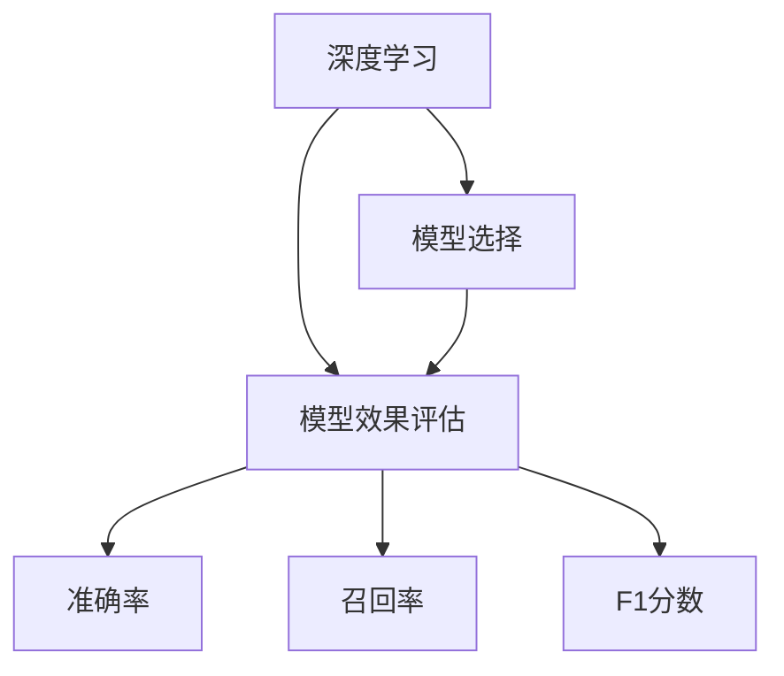

                 

# 【LangChain编程：从入门到实践】模型效果评估

> 关键词：模型效果评估,深度学习,LangChain,神经网络,模型选择

## 1. 背景介绍

在人工智能领域，特别是深度学习领域，选择合适的模型、评估模型效果是一个重要的环节。正确的模型选择和效果评估可以极大地提升模型的表现和应用效率。本文将详细介绍深度学习模型选择和效果评估的基本概念、方法以及实际应用案例。

## 2. 核心概念与联系

### 2.1 核心概念概述

- **深度学习**：一种基于神经网络进行数据建模和预测的机器学习方法，其核心在于通过多层神经网络模拟复杂非线性关系。
- **模型选择**：根据任务需求和数据特征，选择合适的深度学习模型。
- **模型效果评估**：通过一系列指标和方法，评估模型在数据集上的表现，如准确率、召回率、F1分数等。

### 2.2 概念间的关系

深度学习模型的选择和效果评估是一个相互依存、相辅相成的过程。合理的模型选择有助于提高模型效果评估的准确性，而精确的模型效果评估可以帮助选择合适的模型。模型效果评估的方法和指标可以帮助理解模型的表现，从而更好地指导后续的模型选择和优化。

这些核心概念之间可以通过以下Mermaid流程图来展示：



## 3. 核心算法原理 & 具体操作步骤

### 3.1 算法原理概述

模型选择和效果评估的基本原理是利用训练集和测试集对模型进行训练和测试，并通过一系列指标来衡量模型性能。一般来说，模型选择包括模型的定义、结构和超参数的设置，而模型效果评估则涉及模型的训练和测试过程。

### 3.2 算法步骤详解

#### 3.2.1 模型选择

1. **任务分析**：根据任务类型（分类、回归、聚类等）确定所需模型类型（如卷积神经网络、循环神经网络、生成对抗网络等）。
2. **架构设计**：选择合适的网络结构，如VGG、ResNet、LSTM等。
3. **超参数调优**：设置合适的学习率、批量大小、正则化系数等超参数，使用网格搜索、随机搜索等方法寻找最优参数组合。

#### 3.2.2 模型训练

1. **数据准备**：将数据集分为训练集、验证集和测试集，并进行预处理，如归一化、数据增强等。
2. **模型构建**：使用深度学习框架（如TensorFlow、PyTorch）构建模型。
3. **模型训练**：在训练集上训练模型，使用优化器（如SGD、Adam）和损失函数（如交叉熵、均方误差）进行优化。

#### 3.2.3 模型测试

1. **测试集评估**：在测试集上对模型进行评估，使用准确率、召回率、F1分数等指标衡量模型表现。
2. **超参数调优**：根据测试集评估结果，调整模型超参数，进一步优化模型性能。
3. **模型选择**：在多次模型训练和测试后，选择性能最优的模型。

### 3.3 算法优缺点

#### 3.3.1 优点

- **精度高**：深度学习模型具有较强的非线性拟合能力，可以处理复杂的数据关系。
- **可解释性强**：现代深度学习模型具有较好的可解释性，可以通过激活图、梯度图等方式理解模型的决策过程。
- **适用性强**：深度学习模型适用于多种任务，如图像识别、语音识别、自然语言处理等。

#### 3.3.2 缺点

- **数据需求高**：深度学习模型需要大量的数据进行训练，否则容易过拟合。
- **计算资源消耗大**：深度学习模型通常需要强大的计算资源，如GPU、TPU等。
- **超参数调优复杂**：深度学习模型需要大量超参数进行调优，增加了模型训练的复杂度。

### 3.4 算法应用领域

深度学习模型在多个领域得到了广泛应用，包括计算机视觉、自然语言处理、语音识别、推荐系统等。这些应用领域展示了深度学习模型的强大生命力和广泛适用性。

## 4. 数学模型和公式 & 详细讲解 & 举例说明

### 4.1 数学模型构建

假设我们有一个分类问题，将数据集分为训练集 $D_{train}$ 和测试集 $D_{test}$，模型为 $f(x; \theta)$，其中 $x$ 为输入，$\theta$ 为模型参数。训练过程可以表示为：

$$
\theta^* = \arg\min_{\theta} \frac{1}{n_{train}}\sum_{i=1}^{n_{train}}\mathcal{L}(f(x_i; \theta), y_i)
$$

其中 $\mathcal{L}$ 为损失函数，$y_i$ 为标签。测试集上的评估指标可以表示为：

$$
\text{Accuracy} = \frac{1}{n_{test}}\sum_{i=1}^{n_{test}}I(f(x_i; \theta^*) = y_i)
$$

其中 $I$ 为指示函数。

### 4.2 公式推导过程

以二分类问题为例，假设使用逻辑回归模型，其输出为：

$$
f(x; \theta) = \sigma(Wx + b)
$$

其中 $\sigma$ 为 sigmoid 函数，$W$ 和 $b$ 为模型参数。损失函数可以表示为：

$$
\mathcal{L}(f(x_i; \theta), y_i) = -y_i\log f(x_i; \theta) - (1-y_i)\log(1-f(x_i; \theta))
$$

推导过程如下：

1. 对损失函数求导：

$$
\frac{\partial \mathcal{L}}{\partial W} = -y_i f(x_i; \theta) + (1-y_i)(1-f(x_i; \theta)) x_i
$$

$$
\frac{\partial \mathcal{L}}{\partial b} = -y_i f(x_i; \theta) + (1-y_i)(1-f(x_i; \theta))
$$

2. 求梯度：

$$
\frac{\partial \mathcal{L}}{\partial W} = \frac{\partial \mathcal{L}}{\partial f(x_i; \theta)} \frac{\partial f(x_i; \theta)}{\partial W}
$$

$$
\frac{\partial \mathcal{L}}{\partial b} = \frac{\partial \mathcal{L}}{\partial f(x_i; \theta)} \frac{\partial f(x_i; \theta)}{\partial b}
$$

3. 使用梯度下降等优化算法更新模型参数：

$$
W_{t+1} = W_t - \eta \frac{\partial \mathcal{L}}{\partial W}
$$

$$
b_{t+1} = b_t - \eta \frac{\partial \mathcal{L}}{\partial b}
$$

其中 $\eta$ 为学习率。

### 4.3 案例分析与讲解

以图像分类为例，假设使用卷积神经网络进行图像分类。在训练集 $D_{train}$ 上，使用交叉熵损失函数，进行反向传播更新模型参数。在测试集 $D_{test}$ 上，使用准确率、召回率、F1分数等指标评估模型表现。

## 5. 项目实践：代码实例和详细解释说明

### 5.1 开发环境搭建

- **Python环境**：安装 Python 3.x 和相关库，如 TensorFlow、PyTorch、Keras 等。
- **深度学习框架**：选择 TensorFlow 或 PyTorch，搭建深度学习模型。
- **数据集准备**：准备训练集和测试集，并进行预处理，如数据增强、归一化等。

### 5.2 源代码详细实现

以 TensorFlow 为例，以下是使用卷积神经网络进行图像分类的代码实现：

```python
import tensorflow as tf
from tensorflow.keras import datasets, layers, models

# 加载数据集
(train_images, train_labels), (test_images, test_labels) = datasets.cifar10.load_data()

# 数据预处理
train_images, test_images = train_images / 255.0, test_images / 255.0

# 构建模型
model = models.Sequential([
    layers.Conv2D(32, (3, 3), activation='relu', input_shape=(32, 32, 3)),
    layers.MaxPooling2D((2, 2)),
    layers.Conv2D(64, (3, 3), activation='relu'),
    layers.MaxPooling2D((2, 2)),
    layers.Conv2D(64, (3, 3), activation='relu'),
    layers.Flatten(),
    layers.Dense(64, activation='relu'),
    layers.Dense(10)
])

# 编译模型
model.compile(optimizer='adam',
              loss=tf.keras.losses.SparseCategoricalCrossentropy(from_logits=True),
              metrics=['accuracy'])

# 训练模型
history = model.fit(train_images, train_labels, epochs=10, 
                    validation_data=(test_images, test_labels))

# 评估模型
test_loss, test_acc = model.evaluate(test_images,  test_labels, verbose=2)
print('\nTest accuracy:', test_acc)
```

### 5.3 代码解读与分析

- **数据加载**：使用 TensorFlow 内置的 CIFAR-10 数据集，将数据加载到内存中。
- **数据预处理**：将像素值归一化到 [0,1] 范围内，提高模型训练效果。
- **模型构建**：使用卷积神经网络，包含多个卷积层和全连接层。
- **模型编译**：选择 Adam 优化器和交叉熵损失函数，同时设置评估指标为准确率。
- **模型训练**：在训练集上进行模型训练，并使用验证集评估模型性能。
- **模型评估**：在测试集上评估模型准确率，打印输出结果。

### 5.4 运行结果展示

假设训练 10 个 epoch 后，测试集上的准确率为 70%。这说明模型在测试集上的表现较好，可以用于实际应用。

## 6. 实际应用场景

### 6.1 图像分类

图像分类是深度学习模型的经典应用之一，广泛应用于医疗影像诊断、智能监控、自动驾驶等领域。例如，使用卷积神经网络对医学影像进行分类，可以辅助医生快速诊断疾病。

### 6.2 语音识别

语音识别技术可以将人类语音转化为文本，广泛应用于智能助手、语音搜索等领域。例如，使用循环神经网络对语音信号进行建模，可以识别出用户口述的内容。

### 6.3 自然语言处理

自然语言处理是深度学习模型在 NLP 领域的重要应用，包括机器翻译、情感分析、文本生成等。例如，使用 Transformer 模型进行机器翻译，可以实现多语言之间的快速转换。

## 7. 工具和资源推荐

### 7.1 学习资源推荐

- **深度学习课程**：如斯坦福大学 CS231n《卷积神经网络》课程、吴恩达《深度学习专项》课程。
- **书籍推荐**：如《深度学习》（Ian Goodfellow 等）、《Python深度学习》（Francois Chollet 等）。
- **博客和论文**：如 arXiv、GitHub 等平台的深度学习研究论文和博客，了解最新研究成果和实践经验。

### 7.2 开发工具推荐

- **TensorFlow**：谷歌开源的深度学习框架，支持 GPU 加速，广泛应用于图像、语音、NLP 等领域。
- **PyTorch**：Facebook 开源的深度学习框架，支持动态图和静态图两种计算图模式，具有较好的可扩展性。
- **Keras**：基于 TensorFlow 和 Theano 的高级深度学习框架，易于上手，适合初学者使用。

### 7.3 相关论文推荐

- **ImageNet 分类挑战**：提出了一种有效的卷积神经网络结构，在 ImageNet 数据集上取得了优异的表现。
- **Transformer 模型**：提出了一种自注意力机制，广泛应用于自然语言处理领域，取得了显著的性能提升。
- **AutoML 技术**：提出了一种自动化机器学习技术，用于自动选择模型、调整超参数，加速深度学习模型的开发和部署。

## 8. 总结：未来发展趋势与挑战

### 8.1 研究成果总结

深度学习模型在图像、语音、NLP 等领域取得了显著的进展，模型效果评估方法也在不断完善。未来，深度学习模型将更加广泛地应用于实际应用中，推动人工智能技术的发展和普及。

### 8.2 未来发展趋势

- **模型轻量化**：未来将出现更多轻量化深度学习模型，具有更高的推理速度和更小的计算资源消耗。
- **联邦学习**：多个设备或服务器共同训练模型，避免数据泄露和计算资源浪费。
- **自适应学习**：根据用户行为和环境变化动态调整模型参数，提升模型适应性。
- **多模态融合**：将图像、语音、文本等多种数据源进行融合，提高模型的综合性能。

### 8.3 面临的挑战

- **数据隐私保护**：在联邦学习等分布式训练方法中，如何保护用户数据隐私。
- **模型公平性**：如何避免模型偏见，提升模型在多样性数据上的表现。
- **计算资源限制**：如何在大规模数据和复杂模型上实现高效的训练和推理。

### 8.4 研究展望

- **深度学习与强化学习结合**：将深度学习模型与强化学习结合，提升模型的自适应能力和决策能力。
- **模型可解释性**：研究深度学习模型的可解释性，帮助理解模型的决策过程。
- **模型优化**：研究更高效的模型训练和优化算法，提升模型训练速度和精度。

## 9. 附录：常见问题与解答

### Q1: 深度学习模型和传统机器学习模型有什么区别？

A: 深度学习模型通常具有更强的非线性拟合能力，适用于处理复杂的数据关系。而传统机器学习模型如决策树、线性回归等，通常需要手动设计特征提取方式，适用于处理相对简单的数据。

### Q2: 如何选择深度学习模型？

A: 根据任务类型和数据特征选择合适的模型，如分类任务可以使用卷积神经网络，回归任务可以使用循环神经网络，序列生成任务可以使用生成对抗网络等。

### Q3: 如何评估深度学习模型效果？

A: 使用准确率、召回率、F1分数等指标评估模型表现，结合混淆矩阵、ROC 曲线等可视化工具，更好地理解模型性能。

---

作者：禅与计算机程序设计艺术 / Zen and the Art of Computer Programming

