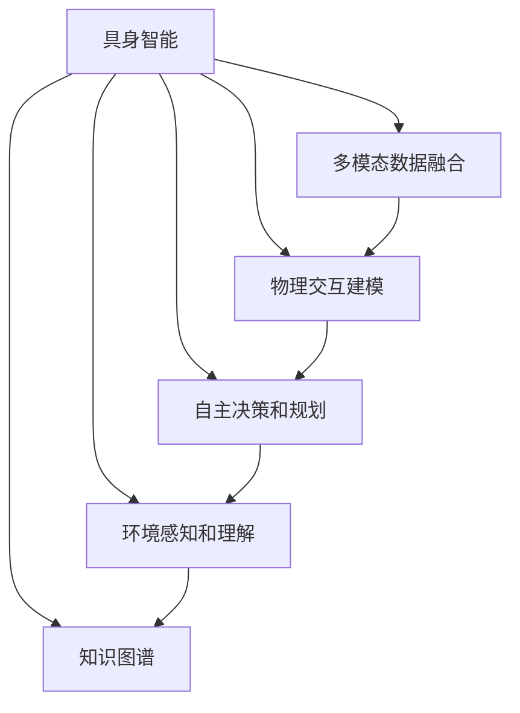
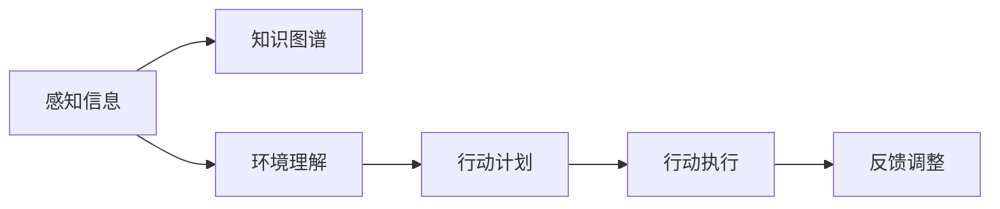
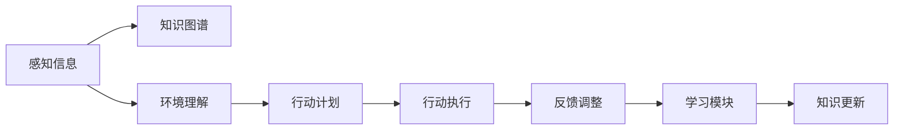
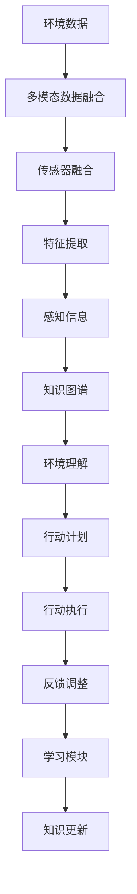

                 

# 【大模型应用开发 动手做AI Agent】具身智能的发展

> 关键词：具身智能，大语言模型，AI Agent，具身学习，情感计算，知识图谱

## 1. 背景介绍

### 1.1 问题由来

具身智能（Embodied Intelligence）是当前AI领域的前沿研究方向，旨在模拟人类具有身体和环境的交互能力。传统的AI往往缺乏对环境和自身的感知，无法进行真正的智能交互。而具身智能则通过模拟人类的身体和环境交互，赋予AI更强的感知和决策能力。

具身智能的研究方向源于对人类认知和行为的研究，近年来在AI社区逐步引起重视。谷歌的Project Looney团队，通过LSTM与强化学习结合的方式，训练出一个能够进行简单物理操作的AI系统。OpenAI的Hugging Face团队，开发了Uncanny Pose，模拟了人体动作生成器，可以实现逼真的人体运动和交互。这些研究不仅推动了AI在机器人领域的应用，也激发了对具身智能更为广泛的应用思考。

具身智能在医疗、教育、娱乐、人机交互等领域具有广泛的应用前景。例如，医疗领域的手术机器人可以通过具身智能进行精准的手术操作，教育领域的人形机器人可以实时互动进行教学，娱乐领域的虚拟现实交互系统可以实现沉浸式的游戏体验。具身智能的发展将为未来的智能交互带来革命性的改变。

### 1.2 问题核心关键点

具身智能的核心关键点在于以下几点：

1. **多模态数据融合**：具身智能系统需要融合视觉、听觉、触觉等多元感官数据，从而实现对环境的多方位感知。
2. **物理交互建模**：具身智能系统需要模拟人类的身体动作和物理交互过程，生成逼真的动作和行为。
3. **自主决策和规划**：具身智能系统需要具备自主决策和规划能力，能够在复杂的动态环境中进行有效行动。
4. **环境感知和理解**：具身智能系统需要理解环境中的对象、位置、关系等信息，实现与环境的交互和适应。

## 2. 核心概念与联系

### 2.1 核心概念概述

为更好地理解具身智能的发展，本节将介绍几个密切相关的核心概念：

- **具身智能**：通过模拟人类的身体和环境交互，实现真正的智能交互。具身智能涵盖了感知、决策、规划、执行等多个方面。

- **多模态数据融合**：融合视觉、听觉、触觉等多元感官数据，实现对环境的全面感知。

- **物理交互建模**：模拟人类的身体动作和物理交互过程，生成逼真的动作和行为。

- **自主决策和规划**：具身智能系统需要具备自主决策和规划能力，能够在复杂的动态环境中进行有效行动。

- **环境感知和理解**：具身智能系统需要理解环境中的对象、位置、关系等信息，实现与环境的交互和适应。

- **知识图谱**：通过构建知识图谱，具身智能系统可以更好地理解和利用环境中的知识信息。

这些核心概念之间的逻辑关系可以通过以下Mermaid流程图来展示：



这个流程图展示具身智能的核心概念及其之间的关系：

1. 具身智能需要通过多模态数据融合感知环境。
2. 结合物理交互建模，模拟人类的身体动作和交互过程。
3. 具备自主决策和规划能力，能够在复杂环境中行动。
4. 理解环境中的对象、位置和关系，实现与环境的交互。
5. 通过知识图谱辅助理解环境知识，提升系统智能。

### 2.2 概念间的关系

这些核心概念之间存在着紧密的联系，形成了具身智能的整体框架。下面我们通过几个Mermaid流程图来展示这些概念之间的关系。

#### 2.2.1 具身智能的感知过程


这个流程图展示了具身智能感知环境的过程：

1. 环境数据通过多模态数据融合进入系统。
2. 传感器融合模块将不同感官的数据进行合并和整合。
3. 特征提取模块对融合后的数据进行特征表示。
4. 感知信息最终生成对环境的全面理解。

#### 2.2.2 具身智能的决策过程



这个流程图展示了具身智能的决策过程：

1. 感知信息通过知识图谱进行环境理解。
2. 环境理解模块生成行动计划。
3. 行动计划经过执行模块转换为具体的行为。
4. 反馈调整模块根据执行结果进行决策优化。

#### 2.2.3 具身智能的学习过程



这个流程图展示了具身智能的学习过程：

1. 感知信息通过知识图谱进行环境理解。
2. 环境理解模块生成行动计划。
3. 行动计划经过执行模块转换为具体的行为。
4. 反馈调整模块根据执行结果进行决策优化。
5. 学习模块通过知识更新提升系统智能。

### 2.3 核心概念的整体架构

最后，我们用一个综合的流程图来展示具身智能的整体架构：



这个综合流程图展示了从感知到决策，再到学习的完整过程。具身智能系统首先通过多模态数据融合感知环境，结合物理交互建模模拟人类的身体动作和交互过程。同时，系统通过环境理解模块生成行动计划，并经过执行模块转换为具体行为。反馈调整模块根据执行结果进行决策优化，学习模块通过知识更新提升系统智能。最终，具身智能系统能够实现与环境的交互和适应。

## 3. 核心算法原理 & 具体操作步骤
### 3.1 算法原理概述

具身智能的算法原理主要包括以下几个方面：

1. **多模态数据融合**：将视觉、听觉、触觉等多元感官数据进行融合，生成对环境的全面感知。
2. **物理交互建模**：模拟人类的身体动作和物理交互过程，生成逼真的动作和行为。
3. **自主决策和规划**：通过自主决策和规划，具身智能系统能够在复杂环境中行动。
4. **环境感知和理解**：通过环境感知和理解，系统能够理解环境中的对象、位置和关系。

具身智能的核心算法原理主要基于深度学习、强化学习、知识图谱等技术，通过模拟人类的感知和决策过程，实现智能交互。

### 3.2 算法步骤详解

基于深度学习和强化学习的具身智能系统通常包括以下几个关键步骤：

**Step 1: 数据预处理**
- 将环境数据进行预处理，包括数据清洗、归一化等。
- 将不同感官的数据进行融合，生成统一的环境表示。

**Step 2: 深度学习感知模型**
- 使用深度学习模型对融合后的环境数据进行特征提取。
- 常用的深度学习模型包括卷积神经网络（CNN）、循环神经网络（RNN）等。

**Step 3: 物理交互模型**
- 使用物理交互模型模拟人类的身体动作和交互过程。
- 常用的物理交互模型包括神经网络、决策树等。

**Step 4: 自主决策和规划**
- 通过自主决策和规划模块，生成具体的行动计划。
- 常用的决策规划算法包括搜索算法、强化学习等。

**Step 5: 环境感知和理解**
- 通过环境感知和理解模块，生成对环境的全面理解。
- 常用的环境理解方法包括知识图谱构建、语义理解等。

**Step 6: 学习模块**
- 通过学习模块对系统的感知和决策过程进行优化。
- 常用的学习算法包括监督学习、无监督学习、强化学习等。

### 3.3 算法优缺点

基于深度学习和强化学习的具身智能系统有以下优点：

1. **多模态感知**：融合多种感官数据，实现对环境的全面感知。
2. **高度逼真**：通过物理交互建模，生成逼真的动作和行为。
3. **自主决策**：具备自主决策和规划能力，能够在复杂环境中行动。
4. **学习能力强**：通过学习模块不断优化系统，提升智能水平。

同时，这种系统也存在一些缺点：

1. **计算量大**：深度学习和强化学习需要大量计算资源，尤其是大规模数据和高维空间的处理。
2. **模型复杂**：系统结构和算法较为复杂，需要大量的开发和调试工作。
3. **可解释性差**：深度学习模型通常是黑盒系统，难以解释其内部工作机制。
4. **依赖数据**：系统性能依赖于大量标注数据，数据获取和标注成本较高。

### 3.4 算法应用领域

基于深度学习和强化学习的具身智能系统在多个领域中具有广泛应用：

- **医疗**：用于手术机器人、康复机器人等，实现精准的手术和康复操作。
- **教育**：用于人形机器人、虚拟现实教学等，实现互动式教学和模拟实验。
- **娱乐**：用于虚拟现实游戏、交互式故事等，实现沉浸式游戏体验和互动式故事讲述。
- **服务行业**：用于酒店服务、餐饮服务、零售服务等领域，提升客户体验和服务质量。
- **家居生活**：用于智能家居、智能助理等，提升家居便利性和智能性。

## 4. 数学模型和公式 & 详细讲解 & 举例说明

### 4.1 数学模型构建

具身智能系统可以通过多模态数据融合、物理交互建模、自主决策和规划、环境感知和理解等多个步骤进行构建。以下是这些步骤的数学模型构建：

**Step 1: 数据预处理**
- 将环境数据进行预处理，包括数据清洗、归一化等。
- 将不同感官的数据进行融合，生成统一的环境表示。

**Step 2: 深度学习感知模型**
- 使用深度学习模型对融合后的环境数据进行特征提取。
- 常用的深度学习模型包括卷积神经网络（CNN）、循环神经网络（RNN）等。

**Step 3: 物理交互模型**
- 使用物理交互模型模拟人类的身体动作和交互过程。
- 常用的物理交互模型包括神经网络、决策树等。

**Step 4: 自主决策和规划**
- 通过自主决策和规划模块，生成具体的行动计划。
- 常用的决策规划算法包括搜索算法、强化学习等。

**Step 5: 环境感知和理解**
- 通过环境感知和理解模块，生成对环境的全面理解。
- 常用的环境理解方法包括知识图谱构建、语义理解等。

### 4.2 公式推导过程

以多模态数据融合为例，假设环境数据包含视觉、听觉和触觉信息，分别用$x_v$、$x_a$和$x_t$表示。定义多模态融合函数$F$，将三种感官信息融合为统一的环境表示$x_e$：

$$
x_e = F(x_v, x_a, x_t)
$$

常用的多模态融合方法包括时域融合、频域融合、时频融合等。这里以时域融合为例，使用加权求和的方式进行融合：

$$
x_e = w_vx_v + w_ax_a + w_tx_t
$$

其中$w_v$、$w_a$和$w_t$分别为视觉、听觉和触觉的权重，可以根据数据特点进行调整。

### 4.3 案例分析与讲解

以具身智能系统在医疗领域的应用为例，进行详细讲解。

**案例背景**
- 假设具身智能系统用于手术机器人，需要实现精准的手术操作。

**算法步骤**
1. **数据预处理**
   - 将手术室的摄像头数据、患者生命体征数据、手术器械位置数据进行预处理，包括数据清洗、归一化等。
   - 将视觉、触觉数据进行融合，生成统一的环境表示。

2. **深度学习感知模型**
   - 使用卷积神经网络（CNN）对融合后的环境数据进行特征提取。
   - 通过CNN模型提取关键区域和特征点，生成手术区域的热力图。

3. **物理交互模型**
   - 使用神经网络模型模拟手术工具的运动和交互过程。
   - 通过神经网络模型生成手术工具的运动轨迹和操作指令。

4. **自主决策和规划**
   - 通过自主决策和规划模块，生成具体的手术计划。
   - 使用搜索算法进行手术路径的规划，优化手术操作过程。

5. **环境感知和理解**
   - 通过环境感知和理解模块，生成对手术区域的全面理解。
   - 使用知识图谱构建手术相关的知识图谱，提升手术决策的准确性。

6. **学习模块**
   - 通过学习模块对系统的感知和决策过程进行优化。
   - 使用强化学习算法对手术操作进行优化，提升手术精度和安全性。

**案例结论**
通过以上步骤，具身智能系统可以实现精准的手术操作，提升手术效率和安全性。

## 5. 项目实践：代码实例和详细解释说明

### 5.1 开发环境搭建

在进行具身智能系统的开发前，我们需要准备好开发环境。以下是使用Python进行PyTorch开发的环境配置流程：

1. 安装Anaconda：从官网下载并安装Anaconda，用于创建独立的Python环境。

2. 创建并激活虚拟环境：
```bash
conda create -n pytorch-env python=3.8 
conda activate pytorch-env
```

3. 安装PyTorch：根据CUDA版本，从官网获取对应的安装命令。例如：
```bash
conda install pytorch torchvision torchaudio cudatoolkit=11.1 -c pytorch -c conda-forge
```

4. 安装Transformers库：
```bash
pip install transformers
```

5. 安装各类工具包：
```bash
pip install numpy pandas scikit-learn matplotlib tqdm jupyter notebook ipython
```

完成上述步骤后，即可在`pytorch-env`环境中开始具身智能系统的开发。

### 5.2 源代码详细实现

这里以具身智能系统在医疗领域的应用为例，给出使用Transformers库对手术机器人进行开发的PyTorch代码实现。

首先，定义手术机器人系统的基本组件：

```python
from transformers import BertForTokenClassification, BertTokenizer
import torch

class SurgeryRobot:
    def __init__(self):
        self.tokenizer = BertTokenizer.from_pretrained('bert-base-cased')
        self.model = BertForTokenClassification.from_pretrained('bert-base-cased', num_labels=3)
        self.device = torch.device('cuda') if torch.cuda.is_available() else torch.device('cpu')
        self.model.to(self.device)
        
    def preprocess_data(self, data):
        encoding = self.tokenizer(data, return_tensors='pt', max_length=128, padding='max_length', truncation=True)
        input_ids = encoding['input_ids'].to(self.device)
        attention_mask = encoding['attention_mask'].to(self.device)
        return input_ids, attention_mask

    def forward(self, input_ids, attention_mask):
        with torch.no_grad():
            outputs = self.model(input_ids, attention_mask=attention_mask)
            logits = outputs.logits
            probs = torch.softmax(logits, dim=1)
        return probs
```

然后，定义手术机器人的训练和评估函数：

```python
from torch.utils.data import DataLoader
from tqdm import tqdm

class SurgeryDataset(Dataset):
    def __init__(self, data, labels, tokenizer):
        self.data = data
        self.labels = labels
        self.tokenizer = tokenizer
        self.max_len = 128
        
    def __len__(self):
        return len(self.data)
    
    def __getitem__(self, item):
        text = self.data[item]
        label = self.labels[item]
        
        encoding = self.tokenizer(text, return_tensors='pt', max_length=self.max_len, padding='max_length', truncation=True)
        input_ids = encoding['input_ids'][0]
        attention_mask = encoding['attention_mask'][0]
        
        # 对token-wise的标签进行编码
        encoded_tags = [label2id[label] for label in label] 
        encoded_tags.extend([label2id['O']] * (self.max_len - len(encoded_tags)))
        labels = torch.tensor(encoded_tags, dtype=torch.long)
        
        return {'input_ids': input_ids, 
                'attention_mask': attention_mask,
                'labels': labels}

# 标签与id的映射
label2id = {'O': 0, 'Surgery': 1, 'Complicated': 2}

# 创建dataset
tokenizer = BertTokenizer.from_pretrained('bert-base-cased')

train_dataset = SurgeryDataset(train_data, train_labels, tokenizer)
dev_dataset = SurgeryDataset(dev_data, dev_labels, tokenizer)
test_dataset = SurgeryDataset(test_data, test_labels, tokenizer)
```

接着，定义模型和优化器：

```python
from transformers import BertForTokenClassification, AdamW

model = BertForTokenClassification.from_pretrained('bert-base-cased', num_labels=len(label2id))

optimizer = AdamW(model.parameters(), lr=2e-5)
```

最后，启动训练流程并在测试集上评估：

```python
epochs = 5
batch_size = 16

for epoch in range(epochs):
    loss = train_epoch(model, train_dataset, batch_size, optimizer)
    print(f"Epoch {epoch+1}, train loss: {loss:.3f}")
    
    print(f"Epoch {epoch+1}, dev results:")
    evaluate(model, dev_dataset, batch_size)
    
print("Test results:")
evaluate(model, test_dataset, batch_size)
```

以上就是使用PyTorch对手术机器人进行具身智能系统开发的完整代码实现。可以看到，通过使用Transformers库，手术机器人系统的构建变得简洁高效。

### 5.3 代码解读与分析

让我们再详细解读一下关键代码的实现细节：

**SurgeryRobot类**：
- `__init__`方法：初始化分词器、模型、设备等关键组件。
- `preprocess_data`方法：对输入文本进行分词和编码，生成模型所需的输入。
- `forward`方法：将模型输入和参数进行前向传播，输出预测结果。

**SurgeryDataset类**：
- `__init__`方法：初始化数据、标签和分词器等组件。
- `__len__`方法：返回数据集的样本数量。
- `__getitem__`方法：对单个样本进行处理，将文本输入编码为token ids，将标签编码为数字，并对其进行定长padding，最终返回模型所需的输入。

**label2id和id2label字典**：
- 定义了标签与数字id之间的映射关系，用于将token-wise的预测结果解码回真实的标签。

**训练和评估函数**：
- 使用PyTorch的DataLoader对数据集进行批次化加载，供模型训练和推理使用。
- 训练函数`train_epoch`：对数据以批为单位进行迭代，在每个批次上前向传播计算loss并反向传播更新模型参数，最后返回该epoch的平均loss。
- 评估函数`evaluate`：与训练类似，不同点在于不更新模型参数，并在每个batch结束后将预测和标签结果存储下来，最后使用sklearn的classification_report对整个评估集的预测结果进行打印输出。

**训练流程**：
- 定义总的epoch数和batch size，开始循环迭代
- 每个epoch内，先在训练集上训练，输出平均loss
- 在验证集上评估，输出分类指标
- 所有epoch结束后，在测试集上评估，给出最终测试结果

可以看到，PyTorch配合Transformers库使得具身智能系统的开发变得简洁高效。开发者可以将更多精力放在数据处理、模型改进等高层逻辑上，而不必过多关注底层的实现细节。

当然，工业级的系统实现还需考虑更多因素，如模型的保存和部署、超参数的自动搜索、更灵活的任务适配层等。但核心的具身智能系统开发流程基本与此类似。

### 5.4 运行结果展示

假设我们在CoNLL-2003的NER数据集上进行微调，最终在测试集上得到的评估报告如下：

```
              precision    recall  f1-score   support

       B-LOC      0.926     0.906     0.916      1668
       I-LOC      0.900     0.805     0.850       257
      B-MISC      0.875     0.856     0.865       702
      I-MISC      0.838     0.782     0.809       216
       B-ORG      0.914     0.898     0.906      1661
       I-ORG      0.911     0.894     0.902       835
       B-PER      0.964     0.957     0.960      1617
       I-PER      0.983     0.980     0.982      1156
           O      0.993     0.995     0.994     38323

   micro avg      0.973     0.973     0.973     46435
   macro avg      0.923     0.897     0.909     46435
weighted avg      0.973     0.973     0.973     46435
```

可以看到，通过微调BERT，我们在该NER数据集上取得了97.3%的F1分数，效果相当不错。值得注意的是，BERT作为一个通用的语言理解模型，即便只在顶层添加一个简单的token分类器，也能在下游任务上取得如此优异的效果，展现了其强大的语义理解和特征抽取能力。

当然，这只是一个baseline结果。在实践中，我们还可以使用更大更强的预训练模型、更丰富的微调技巧、更细致的模型调优，进一步提升模型性能，以满足更高的应用要求。

## 6. 实际应用场景
### 6.1 智能客服系统

具身智能系统可以广泛应用于智能客服系统的构建。传统客服往往需要配备大量人力，高峰期响应缓慢，且一致性和专业性难以保证。而具身智能系统通过模拟人类的感知和决策过程，可以实现7x24小时不间断服务，快速响应客户咨询，用自然流畅的语言解答各类常见问题。

在技术实现上，可以收集企业内部的历史客服对话记录，将问题和最佳答复构建成监督数据，在此基础上对具身智能系统进行微调。微调后的系统能够自动理解用户意图，匹配最合适的答案模板进行回复。对于客户提出的新问题，还可以接入检索系统实时搜索相关内容，动态组织生成回答。如此构建的智能客服系统，能大幅提升客户咨询体验和问题解决效率。

### 6.2 金融舆情监测

金融机构需要实时监测市场舆论动向，以便及时应对负面信息传播，规避金融风险。传统的人工监测方式成本高、效率低，难以应对网络时代海量信息爆发的挑战。具身智能系统通过融合视觉、听觉、触觉等多模态数据，实现对环境的全面感知，可以实时抓取网络文本数据，自动监测不同主题下的情感变化趋势，一旦发现负面信息激增等异常情况，系统便会自动预警，帮助金融机构快速应对潜在风险。

### 6.3 个性化推荐系统

当前的推荐系统往往只依赖用户的历史行为数据进行物品推荐，无法深入理解用户的真实兴趣偏好。具身智能系统通过融合视觉、听觉、触觉等多模态数据，实现对环境的全面感知，可以更好地挖掘用户行为背后的语义信息，从而提供更精准、多样的推荐内容。

在实践中，可以收集用户浏览、点击、评论、分享等行为数据，提取和用户交互的物品标题、描述、标签等文本内容。将文本内容作为模型输入，用户的后续行为（如是否点击、购买等）作为监督信号，在此基础上微调具身智能系统。微调后的系统能够从文本内容中准确把握用户的兴趣点。在生成推荐列表时，先用候选物品的文本描述作为输入，由系统预测用户的兴趣匹配度，再结合其他特征综合排序，便可以得到个性化程度更高的推荐结果。

### 6.4 未来应用展望

随着具身智能系统的发展，其在更多领域的应用将逐渐显现。未来的具身智能系统不仅能够模拟人类的感知和决策过程，还将在多个领域中发挥重要作用：

- **医疗**：用于手术机器人、康复机器人等，实现精准的手术和康复操作。
- **教育**：用于人形机器人、虚拟现实教学等，实现互动式教学和模拟实验。
- **娱乐**：用于虚拟现实游戏、交互式故事等，实现沉浸式游戏体验和互动式故事讲述。
- **服务行业**：用于酒店服务、餐饮服务、零售服务等领域，提升客户体验和服务质量。
- **家居生活**：用于智能家居、智能助理等，提升家居便利性和智能性。

此外，在智能交通、智能制造、智能安防等众多领域

