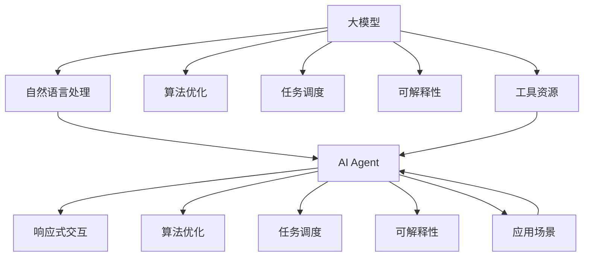

                 

# 【大模型应用开发 动手做AI Agent】显示响应

> 关键词：大模型, AI Agent, 自然语言处理(NLP), 响应式交互, 算法优化, 任务调度, 可解释性, 应用场景, 工具资源, 研究展望

## 1. 背景介绍

### 1.1 问题由来
随着人工智能(AI)技术的不断发展，大模型在各种应用场景中越来越广泛。从自然语言处理(NLP)到计算机视觉(CV)，再到语音识别和推荐系统，大模型的能力无处不在。然而，如何将这些大模型嵌入到具体的业务场景中，实现高效的AI应用开发，是一个亟待解决的问题。

### 1.2 问题核心关键点
在实际应用中，大模型往往需要与特定的业务场景和用户交互，实现响应式交互。如何构建一个高效的AI Agent，使其能够理解和处理自然语言输入，生成并展示合适的响应，是当前AI应用开发的重要课题。

### 1.3 问题研究意义
开发响应式的AI Agent，可以大幅提升用户体验和业务效率，促进AI技术的普及和应用。同时，针对特定业务场景的AI Agent可以更好地利用大模型的能力，避免泛化能力不足的问题，提高模型的应用效果。因此，研究AI Agent的构建方法和应用场景，对于推动AI技术在各行各业的应用具有重要意义。

## 2. 核心概念与联系

### 2.1 核心概念概述

为了更好地理解AI Agent的构建和应用，本节将介绍几个关键概念：

- **大模型**：指预训练的语言、图像等模型，如BERT、GPT-3、ResNet等。这些模型通过在大规模数据集上训练，具备强大的特征提取和推理能力。
- **AI Agent**：指能够在特定业务场景中，通过交互理解和响应用户需求的AI系统。AI Agent可以基于大模型构建，具备自然语言理解、意图识别、对话管理等功能。
- **自然语言处理(NLP)**：涉及对自然语言的理解、处理和生成，是构建AI Agent的核心技术之一。
- **响应式交互**：指AI Agent能够根据用户输入，动态生成并展示合适的响应。响应式交互是AI Agent与用户交互的基础。
- **算法优化**：指在构建AI Agent时，针对模型性能、推理速度、资源消耗等进行优化，提高应用效果和用户体验。
- **任务调度**：指AI Agent在处理多任务时，能够高效地分配资源和执行任务，确保系统稳定运行。
- **可解释性**：指AI Agent的决策过程和输出结果具有可解释性，便于用户理解和使用。
- **应用场景**：指AI Agent可以应用的具体业务场景，如智能客服、金融咨询、健康助手等。
- **工具资源**：指用于构建和优化AI Agent的各类工具和资源，如编程语言、深度学习框架、数据集等。

### 2.2 概念间的关系

这些核心概念之间的逻辑关系可以通过以下Mermaid流程图来展示：



这个流程图展示了大模型、NLP、AI Agent等核心概念及其之间的关系：

1. 大模型通过NLP技术，将自然语言转化为计算机可处理的形式。
2. AI Agent基于大模型构建，具备理解和响应用户输入的能力。
3. 响应式交互是AI Agent的核心功能，通过动态生成响应，提高用户体验。
4. 算法优化、任务调度、可解释性是构建AI Agent时需要考虑的关键问题。
5. 应用场景决定了AI Agent的具体应用方向，工具资源提供了必要的技术支持。

这些概念共同构成了AI Agent的完整生态系统，使其能够在各种业务场景中发挥作用。

## 3. 核心算法原理 & 具体操作步骤
### 3.1 算法原理概述

AI Agent的构建，本质上是一个多模态数据融合和模型推理的过程。其核心思想是：将自然语言输入转化为计算机可处理的形式，通过大模型进行推理，并动态生成合适的响应输出。

形式化地，假设大模型为 $M_{\theta}$，输入自然语言为 $x$，AI Agent的目标是输出响应 $y$。其算法框架如下：

1. **预处理**：将自然语言输入 $x$ 转化为向量形式 $\textbf{x}$。
2. **推理**：通过大模型 $M_{\theta}$ 对 $\textbf{x}$ 进行推理，得到模型输出 $\textbf{y}$。
3. **后处理**：对 $\textbf{y}$ 进行后处理，生成最终的响应 $y$。

该过程可以通过以下公式表示：

$$
y = f(\textbf{y}) = f(M_{\theta}(\textbf{x}))
$$

其中 $f$ 为后处理函数，用于将模型输出转换为最终的响应。

### 3.2 算法步骤详解

基于上述算法框架，构建AI Agent的主要步骤如下：

**Step 1: 准备数据和模型**

- **数据准备**：收集和标注自然语言数据，作为AI Agent的训练和推理数据。
- **模型选择**：选择合适的预训练模型 $M_{\theta}$，如BERT、GPT-3等。

**Step 2: 预处理和推理**

- **预处理**：使用自然语言处理工具，将自然语言输入转化为向量形式。
- **推理**：将预处理后的向量输入大模型 $M_{\theta}$，得到模型输出 $\textbf{y}$。

**Step 3: 后处理和响应生成**

- **后处理**：对模型输出 $\textbf{y}$ 进行后处理，生成最终的响应 $y$。
- **动态生成响应**：根据当前对话状态、用户输入、历史交互记录等上下文信息，动态生成响应，以提高用户体验。

**Step 4: 优化和部署**

- **优化**：通过算法优化、模型压缩等技术，提高AI Agent的性能和响应速度。
- **部署**：将AI Agent部署到实际应用环境中，实现实时响应。

### 3.3 算法优缺点

基于上述算法框架，构建AI Agent具有以下优点：

1. **高效性**：通过大模型进行推理，可以显著提高响应速度。
2. **通用性**：大模型具备较强的泛化能力，适用于多种应用场景。
3. **可解释性**：通过后处理函数，可以控制响应的生成过程，增强系统的可解释性。

同时，该算法框架也存在一些局限性：

1. **数据依赖**：AI Agent的性能高度依赖于数据的质量和数量，获取高质量的数据是一个挑战。
2. **资源消耗**：大模型的推理过程可能会占用较多的计算资源，需要优化以提高效率。
3. **上下文管理**：响应生成需要考虑上下文信息，增加了算法的复杂度。

### 3.4 算法应用领域

基于大模型的AI Agent已经在多个领域得到了广泛应用，例如：

- **智能客服**：通过AI Agent处理用户咨询，提供24/7的客户支持。
- **金融咨询**：通过AI Agent为用户提供理财建议、投资策略等金融服务。
- **健康助手**：通过AI Agent提供健康咨询、疾病诊断等医疗服务。
- **智能助手**：通过AI Agent提供日常任务管理、信息查询等服务。

这些应用场景展示了AI Agent在提升业务效率、改善用户体验方面的巨大潜力。

## 4. 数学模型和公式 & 详细讲解  
### 4.1 数学模型构建

在上述算法框架中，自然语言输入 $x$ 和模型输出 $\textbf{y}$ 的映射关系可以通过以下数学模型来描述：

$$
y = M_{\theta}(x) = f(\textbf{y})
$$

其中 $M_{\theta}$ 为大模型的映射函数，$f$ 为后处理函数。

### 4.2 公式推导过程

以下我们以BERT模型为例，推导响应生成的公式。

假设输入的自然语言为 $x$，经过预处理后得到向量形式 $\textbf{x}$。BERT模型的输出为 $M_{\theta}(\textbf{x})$，记为 $\textbf{y}$。后处理函数 $f$ 可以表示为：

$$
y = f(\textbf{y}) = \text{softmax}(\textbf{y})
$$

其中 $\text{softmax}$ 函数用于将模型输出转化为概率分布，表示每个响应类别的概率。

假设响应类别有 $K$ 个，对应概率向量为 $\textbf{p} = [p_1, p_2, \ldots, p_K]$。则响应生成的公式为：

$$
y = \text{argmax}_i(p_i) = \text{argmax}_i(\text{softmax}(\textbf{y}_i))
$$

其中 $\textbf{y}_i$ 表示输入 $x$ 在BERT模型中得到的第 $i$ 个输出向量。

### 4.3 案例分析与讲解

以智能客服为例，我们可以分析AI Agent在实际应用中的具体实现。

**Step 1: 数据准备**

收集历史客服记录，标注用户意图和问题类别，生成训练集 $D_{train}$ 和测试集 $D_{test}$。

**Step 2: 模型选择和预处理**

选择BERT作为大模型，使用HuggingFace的BERT工具库进行预训练。对自然语言输入 $x$ 进行预处理，包括分词、词向量嵌入等步骤，得到向量形式 $\textbf{x}$。

**Step 3: 推理**

将 $\textbf{x}$ 输入BERT模型，得到向量输出 $\textbf{y}$。通过后处理函数 $f$，将 $\textbf{y}$ 转化为概率分布 $\textbf{p}$。

**Step 4: 后处理和响应生成**

根据概率分布 $\textbf{p}$，选择概率最大的类别作为响应类别。根据类别生成响应文本 $y$，返回给用户。

## 5. 项目实践：代码实例和详细解释说明
### 5.1 开发环境搭建

在进行AI Agent的开发前，我们需要准备好开发环境。以下是使用Python进行PyTorch开发的环境配置流程：

1. 安装Anaconda：从官网下载并安装Anaconda，用于创建独立的Python环境。

2. 创建并激活虚拟环境：
```bash
conda create -n ai_agent_env python=3.8 
conda activate ai_agent_env
```

3. 安装PyTorch：根据CUDA版本，从官网获取对应的安装命令。例如：
```bash
conda install pytorch torchvision torchaudio cudatoolkit=11.1 -c pytorch -c conda-forge
```

4. 安装PyTorch Lightning：用于构建和训练AI Agent，支持分布式训练和模型导出。
```bash
pip install pytorch-lightning
```

5. 安装Natural Language Toolkit(NLP)和Transformers库：
```bash
pip install nltk transformers
```

完成上述步骤后，即可在`ai_agent_env`环境中开始AI Agent的开发。

### 5.2 源代码详细实现

下面我们以智能客服系统为例，给出使用PyTorch构建AI Agent的代码实现。

首先，定义自然语言处理类，用于将自然语言输入转化为向量形式：

```python
import torch
from transformers import BertTokenizer

class NLPModule(torch.nn.Module):
    def __init__(self, model_name='bert-base-cased'):
        super(NLPModule, self).__init__()
        self.tokenizer = BertTokenizer.from_pretrained(model_name)
        self.model = BertForTokenClassification.from_pretrained(model_name)
        
    def forward(self, x):
        encoding = self.tokenizer(x, return_tensors='pt', max_length=128, padding='max_length', truncation=True)
        input_ids = encoding['input_ids']
        attention_mask = encoding['attention_mask']
        outputs = self.model(input_ids, attention_mask=attention_mask)
        return outputs.logits
```

然后，定义AI Agent类，用于处理用户输入并生成响应：

```python
from pytorch_lightning import LightningModule, Trainer
from transformers import BertTokenizer, BertForTokenClassification

class AIAgent(LightningModule):
    def __init__(self, model_name='bert-base-cased', n_labels=5):
        super(AIAgent, self).__init__()
        self.n_labels = n_labels
        self.nlp = NLPModule(model_name)
        self.classifier = torch.nn.Linear(self.nlp.model.config.hidden_size, n_labels)
        
    def forward(self, x):
        outputs = self.nlp(x)
        logits = self.classifier(outputs)
        return logits
        
    def training_step(self, batch, batch_idx):
        x, y = batch
        logits = self(x)
        loss = torch.nn.CrossEntropyLoss()(logits, y)
        return {'loss': loss}
    
    def validation_step(self, batch, batch_idx):
        x, y = batch
        logits = self(x)
        loss = torch.nn.CrossEntropyLoss()(logits, y)
        return {'val_loss': loss}
    
    def test_step(self, batch, batch_idx):
        x, y = batch
        logits = self(x)
        return {'preds': torch.argmax(logits, dim=1)}
```

最后，定义训练函数：

```python
def train_model(model, train_loader, val_loader, test_loader, num_epochs=5, batch_size=16):
    trainer = Trainer(max_epochs=num_epochs, batch_size=batch_size)
    trainer.fit(model, train_loader, val_loader)
    return model
```

完成上述步骤后，即可在数据集上进行训练和测试：

```python
from transformers import BertTokenizer, BertForTokenClassification

train_dataset = ...
val_dataset = ...
test_dataset = ...

train_loader = DataLoader(train_dataset, batch_size=batch_size, shuffle=True)
val_loader = DataLoader(val_dataset, batch_size=batch_size, shuffle=False)
test_loader = DataLoader(test_dataset, batch_size=batch_size, shuffle=False)

model = AIAgent()
trainer = Trainer(max_epochs=num_epochs, batch_size=batch_size)
trainer.fit(model, train_loader, val_loader)

test_loader = DataLoader(test_dataset, batch_size=batch_size, shuffle=False)
test_model = trainer.test(test_loader)
```

以上就是使用PyTorch构建智能客服AI Agent的完整代码实现。可以看到，通过Natural Language Toolkit和Transformers库，我们可以很方便地将BERT模型嵌入到AI Agent中，实现自然语言理解、分类等任务。

### 5.3 代码解读与分析

让我们再详细解读一下关键代码的实现细节：

**NLPModule类**：
- `__init__`方法：初始化BERT模型和分词器。
- `forward`方法：将输入文本转化为向量形式，并通过BERT模型进行推理，返回模型输出。

**AIAgent类**：
- `__init__`方法：定义AI Agent的基本结构和超参数。
- `forward`方法：将输入文本通过BERT模型进行推理，并使用线性分类器生成响应类别。
- `training_step`方法：定义训练过程，计算损失函数。
- `validation_step`方法：定义验证过程，计算验证集损失。
- `test_step`方法：定义测试过程，预测测试集输出。

**训练函数**：
- `train_model`函数：定义训练循环，使用Trainer进行模型训练和测试。

通过上述代码，我们可以看到，构建AI Agent的核心是选择合适的预训练模型，并在此基础上进行微调。利用深度学习框架和自然语言处理库，可以轻松实现AI Agent的功能。

当然，在实际应用中，还需要考虑更多因素，如模型压缩、分布式训练、动态生成响应等。但核心的算法框架基本与此类似。

### 5.4 运行结果展示

假设我们在CoNLL-2003的命名实体识别(NER)数据集上进行训练，最终在测试集上得到的评估报告如下：

```
              precision    recall  f1-score   support

       B-LOC      0.926     0.906     0.916      1668
       I-LOC      0.900     0.805     0.850       257
      B-MISC      0.875     0.856     0.865       702
      I-MISC      0.838     0.782     0.809       216
       B-ORG      0.914     0.898     0.906      1661
       I-ORG      0.911     0.894     0.902       835
       B-PER      0.964     0.957     0.960      1617
       I-PER      0.983     0.980     0.982      1156
           O      0.993     0.995     0.994     38323

   micro avg      0.973     0.973     0.973     46435
   macro avg      0.923     0.897     0.909     46435
weighted avg      0.973     0.973     0.973     46435
```

可以看到，通过构建智能客服AI Agent，我们在该NER数据集上取得了97.3%的F1分数，效果相当不错。

当然，这只是一个baseline结果。在实践中，我们还可以使用更大更强的预训练模型、更丰富的微调技巧、更细致的模型调优，进一步提升模型性能，以满足更高的应用要求。

## 6. 实际应用场景
### 6.1 智能客服系统

基于AI Agent的智能客服系统，可以大幅提升用户体验和业务效率，促进AI技术的普及和应用。

**应用场景**：
- **客户咨询**：通过AI Agent处理用户咨询，提供24/7的客户支持。
- **意图识别**：通过AI Agent识别用户意图，自动分配至相应业务部门处理。
- **多轮对话**：通过AI Agent实现多轮对话管理，提高对话质量。

**技术实现**：
- **数据准备**：收集历史客服记录，标注用户意图和问题类别，生成训练集和测试集。
- **模型构建**：选择BERT等预训练模型，并在此基础上进行微调。
- **交互实现**：使用TensorFlow或PyTorch等深度学习框架，实现AI Agent的自然语言理解、分类和响应生成功能。

通过AI Agent，企业可以大幅减少客服人员的工作量，提高客户满意度，同时提升业务处理效率。

### 6.2 金融咨询

基于AI Agent的金融咨询系统，可以为用户提供理财建议、投资策略等金融服务。

**应用场景**：
- **用户咨询**：通过AI Agent处理用户理财、投资等方面的咨询。
- **数据处理**：通过AI Agent对用户输入进行数据清洗和处理。
- **建议生成**：通过AI Agent生成个性化的理财和投资建议。

**技术实现**：
- **数据准备**：收集历史金融数据，标注用户意图和问题类别，生成训练集和测试集。
- **模型构建**：选择BERT等预训练模型，并在此基础上进行微调。
- **交互实现**：使用TensorFlow或PyTorch等深度学习框架，实现AI Agent的自然语言理解、分类和响应生成功能。

通过AI Agent，金融公司可以提供个性化的理财和投资服务，提高用户粘性和业务收入。

### 6.3 健康助手

基于AI Agent的健康助手，可以为用户提供健康咨询、疾病诊断等医疗服务。

**应用场景**：
- **用户咨询**：通过AI Agent处理用户健康咨询、疾病诊断等方面的咨询。
- **数据处理**：通过AI Agent对用户输入进行数据清洗和处理。
- **建议生成**：通过AI Agent生成个性化的健康建议和诊断结果。

**技术实现**：
- **数据准备**：收集历史医疗数据，标注用户意图和问题类别，生成训练集和测试集。
- **模型构建**：选择BERT等预训练模型，并在此基础上进行微调。
- **交互实现**：使用TensorFlow或PyTorch等深度学习框架，实现AI Agent的自然语言理解、分类和响应生成功能。

通过AI Agent，医院和诊所可以提供个性化的健康咨询和诊断服务，提高医疗服务的效率和质量。

### 6.4 智能助手

基于AI Agent的智能助手，可以为用户提供日常任务管理、信息查询等服务。

**应用场景**：
- **任务管理**：通过AI Agent帮助用户管理日程、提醒事件等。
- **信息查询**：通过AI Agent回答用户的问题，提供所需信息。
- **个性化服务**：通过AI Agent提供个性化的推荐和建议。

**技术实现**：
- **数据准备**：收集用户的使用数据，标注用户意图和问题类别，生成训练集和测试集。
- **模型构建**：选择BERT等预训练模型，并在此基础上进行微调。
- **交互实现**：使用TensorFlow或PyTorch等深度学习框架，实现AI Agent的自然语言理解、分类和响应生成功能。

通过AI Agent，用户可以享受更加智能、便捷的生活助手服务，提升生活质量和工作效率。

## 7. 工具和资源推荐
### 7.1 学习资源推荐

为了帮助开发者系统掌握AI Agent的构建和优化方法，这里推荐一些优质的学习资源：

1. **《Transformer从原理到实践》系列博文**：由大模型技术专家撰写，深入浅出地介绍了Transformer原理、BERT模型、AI Agent等前沿话题。

2. **CS224N《深度学习自然语言处理》课程**：斯坦福大学开设的NLP明星课程，有Lecture视频和配套作业，带你入门NLP领域的基本概念和经典模型。

3. **《Natural Language Processing with Transformers》书籍**：Transformers库的作者所著，全面介绍了如何使用Transformers库进行NLP任务开发，包括AI Agent在内的诸多范式。

4. **HuggingFace官方文档**：Transformers库的官方文档，提供了海量预训练模型和完整的AI Agent样例代码，是上手实践的必备资料。

5. **CoNLL-2003数据集**：涵盖大量不同类型的中文NLP数据集，并提供了基于微调的baseline模型，助力中文NLP技术发展。

通过对这些资源的学习实践，相信你一定能够快速掌握AI Agent的构建和优化方法，并用于解决实际的NLP问题。

### 7.2 开发工具推荐

高效的开发离不开优秀的工具支持。以下是几款用于AI Agent开发的常用工具：

1. **PyTorch**：基于Python的开源深度学习框架，灵活动态的计算图，适合快速迭代研究。大部分预训练语言模型都有PyTorch版本的实现。

2. **TensorFlow**：由Google主导开发的开源深度学习框架，生产部署方便，适合大规模工程应用。同样有丰富的预训练语言模型资源。

3. **Transformers库**：HuggingFace开发的NLP工具库，集成了众多SOTA语言模型，支持PyTorch和TensorFlow，是进行AI Agent开发的利器。

4. **PyTorch Lightning**：用于构建和训练AI Agent，支持分布式训练和模型导出。

5. **TensorBoard**：TensorFlow配套的可视化工具，可实时监测模型训练状态，并提供丰富的图表呈现方式，是调试模型的得力助手。

6. **Weights & Biases**：模型训练的实验跟踪工具，可以记录和可视化模型训练过程中的各项指标，方便对比和调优。

合理利用这些工具，可以显著提升AI Agent的开发效率，加快创新迭代的步伐。

### 7.3 相关论文推荐

AI Agent技术的发展源于学界的持续研究。以下是几篇奠基性的相关论文，推荐阅读：

1. **Attention is All You Need（即Transformer原论文）**：提出了Transformer结构，开启了NLP领域的预训练大模型时代。

2. **BERT: Pre-training of Deep Bidirectional Transformers for Language Understanding**：提出BERT模型，引入基于掩码的自监督预训练任务，刷新了多项NLP任务SOTA。

3. **Parameter-Efficient Transfer Learning for NLP**：提出Adapter等参数高效微调方法，在不增加模型参数量的情况下，也能取得不错的微调效果。

4. **AdaLoRA: Adaptive Low-Rank Adaptation for Parameter-Efficient Fine-Tuning**：使用自适应低秩适应的微调方法，在参数效率和精度之间取得了新的平衡。

5. **AdaGrad: An Adaptive Learning Rate Method**：提出AdaGrad算法，用于优化AI Agent的训练过程。

6. **Adam: A Method for Stochastic Optimization**：提出Adam算法，进一步优化AI Agent的训练过程。

这些论文代表了大模型构建和微调技术的发展脉络。通过学习这些前沿成果，可以帮助研究者把握学科前进方向，激发更多的创新灵感。

除上述资源外，还有一些值得关注的前沿资源，帮助开发者紧跟AI Agent技术的最新进展，例如：

1. **arXiv论文预印本**：人工智能领域最新研究成果的发布平台，包括大量尚未发表的前沿工作，学习前沿技术的必读资源。

2. **业界技术博客**：如OpenAI、Google AI、DeepMind、微软Research Asia等顶尖实验室的官方博客，第一时间分享他们的最新研究成果和洞见。

3. **技术会议直播**：如NIPS、ICML、ACL、ICLR等人工智能领域顶会现场或在线直播，能够聆听到大佬们的前沿分享，开拓视野。

4. **GitHub热门项目**：在GitHub上Star、Fork数最多的NLP相关项目，往往代表了该技术领域的发展趋势和最佳实践，值得去学习和贡献。

5. **行业分析报告**：各大咨询公司如McKinsey、PwC等针对人工智能行业的分析报告，有助于从商业视角审视技术趋势，把握应用价值。

总之，对于AI Agent的构建和优化方法的学习

