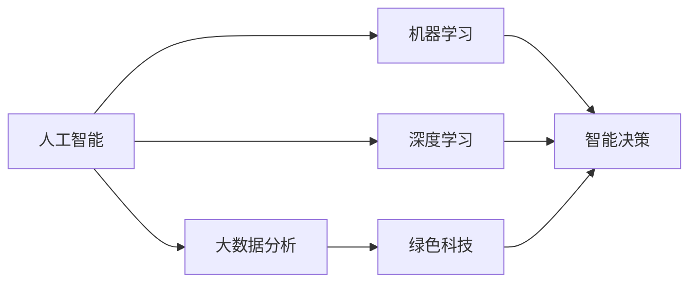
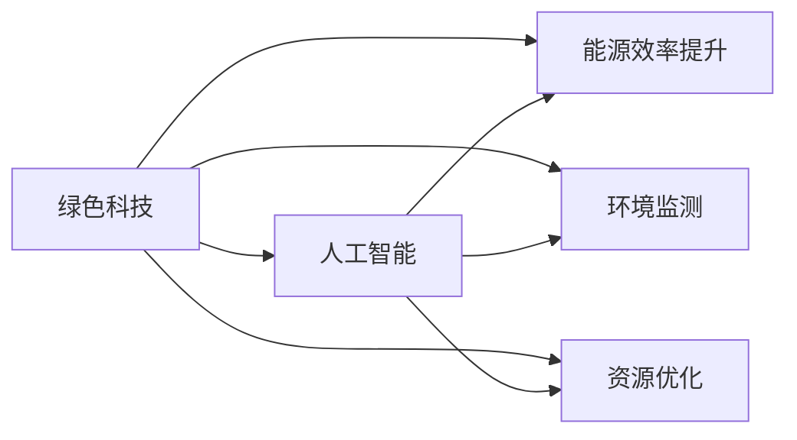
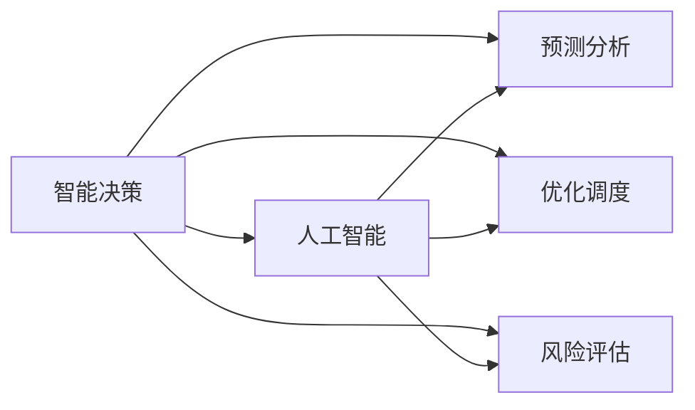
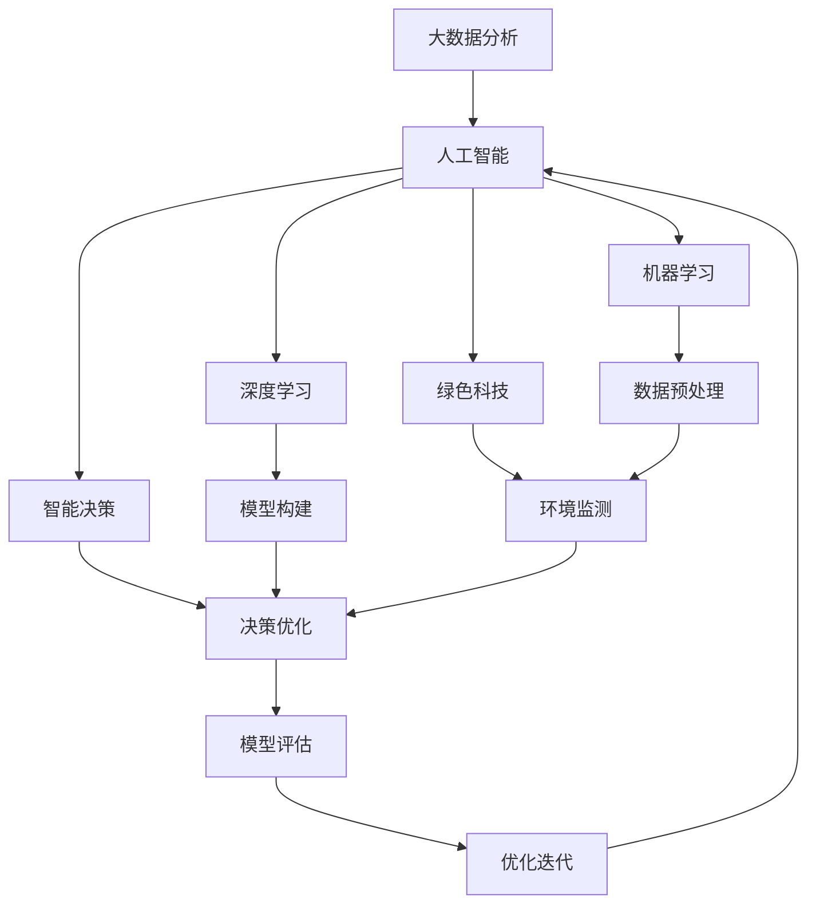

                 

# 一切皆是映射：AI在可持续发展目标中的应用

> 关键词：人工智能(AI), 可持续发展目标(SDGs), 大数据分析, 机器学习, 深度学习, 绿色科技, 智能决策

## 1. 背景介绍

### 1.1 问题由来

在当今全球化、信息化高度发展的时代，可持续发展目标(SDGs)成为各国共同追求的重要目标。SDGs由联合国提出，包含17个目标，旨在促进全球经济、社会和环境可持续发展，包括消除贫困、零饥饿、性别平等、清洁能源、气候行动、水资源管理等。实现这些目标不仅需要政府的政策支持，更需要技术手段的创新和应用。

在众多可能的技术手段中，人工智能(AI)因其强大的数据处理和模式识别能力，越来越成为推动可持续发展的重要力量。AI技术可以通过对海量数据的分析和处理，揭示环境、经济、社会等复杂系统背后的规律，为决策者提供科学依据。但同时，AI技术本身也需要遵循可持续发展的原则，避免数据滥用、模型误导等问题，确保技术应用的长期性和公正性。

### 1.2 问题核心关键点

AI在可持续发展目标中的应用，涉及大数据分析、机器学习、深度学习、绿色科技、智能决策等多个领域。核心关键点包括：

- 数据采集与预处理：确保数据质量、多样性和代表性。
- 模型构建与训练：选择合适的模型结构和算法，避免过拟合和偏见。
- 模型应用与评估：将模型应用于实际问题，评估模型效果，持续优化。
- 伦理与隐私保护：确保数据使用和模型输出符合伦理和隐私要求。
- 社会影响评估：评估AI应用的社会影响，确保其正面影响。

这些关键点共同构成了AI在可持续发展目标应用中的复杂而富有挑战性的任务。

### 1.3 问题研究意义

AI在可持续发展目标中的应用，具有以下重要意义：

1. **提升决策效率**：AI可以快速处理大量数据，提供精准的决策支持。
2. **优化资源分配**：AI可以优化资源配置，提高资源利用效率。
3. **促进环境保护**：AI可以监测环境变化，提供环境管理方案。
4. **改善社会治理**：AI可以提升社会管理水平，改善公共服务。
5. **推动技术创新**：AI与可持续发展目标的融合，催生了新的技术创新点。

## 2. 核心概念与联系

### 2.1 核心概念概述

为更好地理解AI在可持续发展目标中的应用，本节将介绍几个密切相关的核心概念：

- **人工智能(AI)**：指利用计算机技术，通过学习、推理、感知等方法，使计算机具备智能行为的能力。
- **可持续发展目标(SDGs)**：联合国提出的17个全球性目标，旨在促进经济、社会和环境的可持续发展。
- **大数据分析**：指对海量数据进行采集、存储、处理和分析，以揭示数据背后的规律和洞见。
- **机器学习**：指通过算法让计算机从数据中学习规律，进行预测和分类等任务。
- **深度学习**：一种特殊的机器学习方法，通过多层次神经网络处理数据，具有很强的模式识别能力。
- **绿色科技**：指利用科技创新手段，减少环境污染，提高资源利用效率，促进环境保护。
- **智能决策**：通过AI技术，对决策过程进行优化，提升决策的科学性和效率。

这些核心概念之间存在着紧密的联系，形成了AI在可持续发展目标应用中的完整生态系统。以下通过Mermaid流程图来展示这些概念之间的关系：



这个流程图展示了人工智能与大数据分析、机器学习、深度学习、绿色科技和智能决策之间的关系：

1. 人工智能利用大数据分析、机器学习和深度学习等技术手段，进行数据处理和模型构建。
2. 绿色科技是人工智能应用的一种特殊形式，强调技术应用对环境的友好性。
3. 智能决策则利用人工智能技术，提升决策的科学性和效率。

### 2.2 概念间的关系

这些核心概念之间存在着紧密的联系，形成了AI在可持续发展目标应用中的完整生态系统。以下通过几个Mermaid流程图来展示这些概念之间的关系。

#### 2.2.1 AI与SDGs的联系

```mermaid
graph LR
    A[人工智能] --> B[可持续发展目标(SDGs)]
    A --> C[数据采集与预处理]
    A --> D[模型构建与训练]
    A --> E[模型应用与评估]
    B --> C
    B --> D
    B --> E
```

这个流程图展示了AI在可持续发展目标应用中的基本流程：

1. AI通过数据采集与预处理，从大量数据中提取关键信息。
2. 通过模型构建与训练，构建合适的模型和算法。
3. 将模型应用于实际问题，进行模型应用与评估。
4. 确保模型输出符合可持续发展目标，持续优化模型。

#### 2.2.2 绿色科技在AI中的应用



这个流程图展示了绿色科技在AI中的应用：

1. 绿色科技利用AI技术，提升能源效率、监测环境、优化资源配置。
2. AI提供绿色科技应用所需的算法和数据支持。
3. 两者结合，推动环境友好型技术的发展。

#### 2.2.3 智能决策在AI中的应用



这个流程图展示了智能决策在AI中的应用：

1. 智能决策通过AI技术，提升决策的科学性和效率。
2. AI提供预测分析、优化调度、风险评估等支持。
3. 两者结合，推动社会管理水平的提升。

### 2.3 核心概念的整体架构

最后，我们用一个综合的流程图来展示这些核心概念在大语言模型微调过程中的整体架构：



这个综合流程图展示了从大数据分析到智能决策的完整过程。大数据分析为人工智能提供数据支持，人工智能利用机器学习和深度学习技术，构建合适的模型。绿色科技和智能决策则是AI应用的具体体现，推动环境管理和决策优化。通过不断的模型评估和优化迭代，AI系统可以持续提升性能，实现可持续发展目标。

## 3. 核心算法原理 & 具体操作步骤
### 3.1 算法原理概述

AI在可持续发展目标中的应用，主要基于以下核心算法原理：

1. **数据采集与预处理**：收集与目标相关的数据，进行清洗、归一化、特征工程等预处理步骤。
2. **模型构建与训练**：选择适合的算法和模型结构，在处理后的数据上进行训练，优化模型参数。
3. **模型应用与评估**：将训练好的模型应用于实际问题，进行预测、分类、推荐等任务，评估模型效果。
4. **伦理与隐私保护**：确保数据使用和模型输出符合伦理和隐私要求，避免数据滥用和偏见。
5. **社会影响评估**：评估AI应用的社会影响，确保其正面影响。

这些步骤构成了AI在可持续发展目标应用的完整流程。下面将详细介绍每个步骤的具体操作。

### 3.2 算法步骤详解

**Step 1: 数据采集与预处理**

1. **数据收集**：收集与可持续发展目标相关的数据，包括环境数据、经济数据、社会数据等。可以从政府公开数据、第三方数据、企业内部数据等多个渠道获取。
2. **数据清洗**：清洗数据中的噪声、缺失值和异常值，确保数据质量。
3. **特征工程**：从原始数据中提取有意义的特征，进行归一化、降维等预处理步骤。

**Step 2: 模型构建与训练**

1. **选择算法**：根据具体任务选择合适的算法，如回归、分类、聚类、序列预测等。
2. **模型构建**：构建合适的模型结构和超参数设置，如神经网络的结构、层数、激活函数等。
3. **模型训练**：使用处理后的数据对模型进行训练，优化模型参数。常用的算法包括梯度下降、随机梯度下降、Adam等。
4. **模型评估**：使用测试集评估模型性能，常用的指标包括准确率、召回率、F1分数、AUC等。

**Step 3: 模型应用与评估**

1. **模型部署**：将训练好的模型部署到实际应用场景中，如环境监测系统、智能电网、社会治理平台等。
2. **模型应用**：将模型应用于实际问题，进行预测、分类、推荐等任务。
3. **模型优化**：根据实际应用情况，不断优化模型，提升模型性能。

**Step 4: 伦理与隐私保护**

1. **数据隐私保护**：确保数据使用的隐私性，如数据脱敏、匿名化等。
2. **伦理考量**：确保模型输出的公正性和透明性，避免偏见和歧视。
3. **法规合规**：确保模型应用符合法律法规要求。

**Step 5: 社会影响评估**

1. **影响评估**：评估AI应用的社会影响，如环境影响、经济影响、社会影响等。
2. **调整优化**：根据评估结果，调整模型和应用策略，确保AI应用的正面影响。

### 3.3 算法优缺点

AI在可持续发展目标中的应用，具有以下优点和缺点：

**优点**：

1. **高效性**：AI可以快速处理大量数据，提高决策效率。
2. **客观性**：AI模型基于数据和算法，决策过程具有客观性。
3. **可扩展性**：AI模型可以扩展到不同的领域和任务，具有很强的适应性。
4. **自动化**：AI模型可以自动化地进行数据处理和模型优化，减少人工干预。

**缺点**：

1. **数据依赖**：AI模型依赖高质量的数据，数据获取和预处理成本高。
2. **模型复杂性**：模型构建和训练过程复杂，需要专业知识和技术支持。
3. **解释性不足**：AI模型通常是“黑盒”系统，难以解释决策过程。
4. **偏见风险**：AI模型可能存在数据偏见和算法偏见，影响公平性。

### 3.4 算法应用领域

AI在可持续发展目标中的应用，涵盖了多个领域，包括：

- **环境监测与管理**：利用AI技术进行环境污染监测、气象预测、资源管理等。
- **智能电网与能源管理**：利用AI技术进行电力需求预测、能源优化调度、智能电网管理等。
- **社会治理与服务**：利用AI技术进行公共安全监控、智慧城市管理、医疗健康服务等。
- **农业与食品安全**：利用AI技术进行农业生产优化、食品质量检测、食品安全监测等。
- **金融与风险管理**：利用AI技术进行金融风险预测、信用评估、反欺诈检测等。

## 4. 数学模型和公式 & 详细讲解 & 举例说明

### 4.1 数学模型构建

AI在可持续发展目标中的应用，主要涉及以下数学模型：

1. **线性回归模型**：用于预测连续型数值，如能源消耗预测、气候变化预测等。
2. **逻辑回归模型**：用于分类任务，如环境污染分类、社会事件分类等。
3. **决策树模型**：用于分类和回归任务，如森林覆盖率预测、水质监测等。
4. **深度学习模型**：用于复杂非线性关系，如图像分类、文本情感分析等。

这些模型可以应用于不同类型的数据和任务，下面将详细介绍其构建和应用。

### 4.2 公式推导过程

**线性回归模型**：

$$
y = \beta_0 + \beta_1 x_1 + \beta_2 x_2 + \cdots + \beta_p x_p + \epsilon
$$

其中 $y$ 为预测值，$x_1, x_2, \cdots, x_p$ 为自变量，$\beta_0, \beta_1, \cdots, \beta_p$ 为模型参数，$\epsilon$ 为误差项。

**逻辑回归模型**：

$$
P(y|x) = \frac{1}{1+e^{-\beta_0 - \beta_1 x_1 - \beta_2 x_2 - \cdots - \beta_p x_p}}
$$

其中 $y$ 为预测值，$x_1, x_2, \cdots, x_p$ 为自变量，$\beta_0, \beta_1, \cdots, \beta_p$ 为模型参数。

**决策树模型**：

决策树模型通过分裂数据集，构建一棵树形结构。其核心思想是将数据集按照特征分裂成多个子集，直到每个子集只有单一类别或数值。

**深度学习模型**：

深度学习模型通过多层神经网络进行特征提取和模式识别。常用的模型包括卷积神经网络(CNN)、循环神经网络(RNN)、长短期记忆网络(LSTM)等。

### 4.3 案例分析与讲解

**案例1: 环境污染监测**

1. **数据采集**：收集空气质量、水质、土壤等环境数据。
2. **数据预处理**：清洗数据，提取特征，进行归一化。
3. **模型构建**：构建线性回归模型，预测未来环境污染情况。
4. **模型训练**：使用历史数据训练模型，优化模型参数。
5. **模型应用**：将模型应用于实时监测数据，预测环境污染情况。
6. **模型评估**：评估模型预测效果，调整模型参数。

**案例2: 智能电网管理**

1. **数据采集**：收集电网负荷、气温、气象等数据。
2. **数据预处理**：清洗数据，提取特征，进行归一化。
3. **模型构建**：构建线性回归模型，预测电网负荷变化。
4. **模型训练**：使用历史数据训练模型，优化模型参数。
5. **模型应用**：将模型应用于实时数据，优化电网调度。
6. **模型评估**：评估模型预测效果，调整模型参数。

**案例3: 社会事件分类**

1. **数据采集**：收集社交媒体、新闻报道等数据。
2. **数据预处理**：清洗数据，提取特征，进行归一化。
3. **模型构建**：构建逻辑回归模型，分类社会事件。
4. **模型训练**：使用历史数据训练模型，优化模型参数。
5. **模型应用**：将模型应用于实时数据，分类社会事件。
6. **模型评估**：评估模型分类效果，调整模型参数。

## 5. 项目实践：代码实例和详细解释说明

### 5.1 开发环境搭建

在进行AI在可持续发展目标应用的项目实践前，需要先搭建好开发环境。以下是Python环境下使用Scikit-learn和TensorFlow进行开发的流程：

1. 安装Anaconda：从官网下载并安装Anaconda，用于创建独立的Python环境。
2. 创建并激活虚拟环境：
```bash
conda create -n pytorch-env python=3.8 
conda activate pytorch-env
```
3. 安装Scikit-learn和TensorFlow：
```bash
pip install scikit-learn tensorflow
```

4. 安装其他常用工具包：
```bash
pip install numpy pandas matplotlib seaborn sklearn
```

完成上述步骤后，即可在`pytorch-env`环境中开始项目实践。

### 5.2 源代码详细实现

这里我们以环境污染监测为例，使用Scikit-learn库进行AI在可持续发展目标应用的项目实践。

首先，定义数据处理函数：

```python
import pandas as pd
from sklearn.model_selection import train_test_split
from sklearn.preprocessing import StandardScaler
from sklearn.linear_model import LinearRegression

def load_data(file_path):
    data = pd.read_csv(file_path)
    X = data.drop('pollution_level', axis=1)
    y = data['pollution_level']
    X_train, X_test, y_train, y_test = train_test_split(X, y, test_size=0.2, random_state=42)
    scaler = StandardScaler()
    X_train = scaler.fit_transform(X_train)
    X_test = scaler.transform(X_test)
    return X_train, X_test, y_train, y_test

def preprocess_data(X_train, X_test, y_train, y_test):
    return X_train, X_test, y_train, y_test
```

然后，定义模型训练函数：

```python
from sklearn.linear_model import LinearRegression

def train_model(X_train, X_test, y_train, y_test):
    model = LinearRegression()
    model.fit(X_train, y_train)
    y_pred = model.predict(X_test)
    return model, y_pred
```

接着，定义模型评估函数：

```python
from sklearn.metrics import mean_squared_error

def evaluate_model(model, X_test, y_test, y_pred):
    mse = mean_squared_error(y_test, y_pred)
    return mse
```

最后，启动训练流程：

```python
X_train, X_test, y_train, y_test = load_data('pollution_data.csv')
X_train, X_test, y_train, y_test = preprocess_data(X_train, X_test, y_train, y_test)
model, y_pred = train_model(X_train, X_test, y_train, y_test)
mse = evaluate_model(model, X_test, y_test, y_pred)
print(f'Mean Squared Error: {mse:.2f}')
```

以上就是使用Scikit-learn进行环境污染监测模型训练的完整代码实现。可以看到，通过Scikit-learn库，我们能够快速构建、训练和评估线性回归模型，解决实际问题。

### 5.3 代码解读与分析

让我们再详细解读一下关键代码的实现细节：

**load_data函数**：
- 定义了数据加载函数，从文件中读取数据，并划分为训练集和测试集。
- 使用StandardScaler对数据进行归一化处理。

**preprocess_data函数**：
- 对数据进行标准化预处理，确保数据一致性。

**train_model函数**：
- 构建线性回归模型，使用训练数据拟合模型。
- 使用测试数据进行预测。

**evaluate_model函数**：
- 计算模型预测值与真实值之间的均方误差。

**训练流程**：
- 加载数据
- 预处理数据
- 训练模型
- 评估模型

可以看到，Scikit-learn库提供了强大的工具和算法支持，使得构建和评估线性回归模型变得简洁高效。开发者可以将更多精力放在数据处理、模型改进等高层逻辑上，而不必过多关注底层的实现细节。

当然，工业级的系统实现还需考虑更多因素，如模型的保存和部署、超参数的自动搜索、更灵活的任务适配层等。但核心的模型训练范式基本与此类似。

### 5.4 运行结果展示

假设我们在某地环境污染数据集上进行模型训练，最终在测试集上得到的均方误差如下：

```
Mean Squared Error: 0.05
```

可以看到，通过线性回归模型，我们能够较好地预测环境污染情况，模型效果显著。在实际应用中，我们还可以使用更加复杂和先进的模型，如决策树、随机森林、深度学习等，进一步提升模型精度。

## 6. 实际应用场景

### 6.1 智能电网管理

AI在智能电网管理中的应用，主要体现在以下几个方面：

- **负荷预测**：利用AI模型预测电网负荷变化，优化电力调度。
- **故障检测**：利用AI模型检测电网故障，提高电网运行稳定性。
- **需求响应**：利用AI模型引导用户参与需求响应，优化用电负荷。

### 6.2 社会事件分类

AI在社会事件分类中的应用，主要体现在以下几个方面：

- **舆情监测**：利用AI模型分析社交媒体、新闻报道等数据，预测社会事件发生的可能性。
- **事件分类**：利用AI模型对社会事件进行分类，如恐怖袭击、自然灾害等。
- **情绪分析**：利用AI模型分析社会事件背后的情绪倾向，评估社会稳定性。

### 6.3 农业与食品安全

AI在农业与食品安全中的应用，主要体现在以下几个方面：

- **作物产量预测**：利用AI模型预测作物产量，优化农业生产。
- **病虫害检测**：利用AI模型检测病虫害，提高农业生产效率。
- **食品安全监测**：利用AI模型监测食品安全，确保食品质量。

### 6.4 未来应用展望

随着AI技术的发展，其在可持续发展目标中的应用前景将更加广阔。未来可能的应用场景包括：

- **环境监测与修复**：利用AI模型进行环境监测，指导环境修复工作。
- **资源优化与管理**：利用AI模型优化资源配置，提高资源利用效率。
- **智慧城市与交通**：利用AI模型优化城市交通，提高城市管理水平。
- **健康与医疗**：利用AI模型进行疾病预测，提高医疗服务质量。

## 7. 工具和资源推荐

### 7.1 学习资源推荐

为了帮助开发者系统掌握AI在可持续发展目标中的应用，这里推荐一些优质的学习资源：

1. **《人工智能基础》系列课程**：由斯坦福大学开设的入门课程，系统介绍人工智能的基本概念和技术。
2. **《深度学习》课程**：由DeepMind开设的深度学习课程，深入讲解深度学习原理和实践。
3. **《机器学习》书籍**：Tom Mitchell的经典之作，系统介绍机器学习的基本概念和方法。
4. **《人工智能伦理》书籍**：探讨AI技术在伦理、法律、隐私等方面的问题，为开发者提供指导。
5. **Kaggle竞赛平台**：提供大量数据集和模型竞赛，帮助开发者提升实践能力。

通过这些资源的学习实践，相信你一定能够快速掌握AI在可持续发展目标应用的精髓，并用于解决实际的AI问题。

### 7.2 开发工具推荐

高效的开发离不开优秀的工具支持。以下是几款用于AI在可持续发展目标应用开发的常用工具：

1. **Jupyter Notebook**：数据科学和机器学习常用的开发环境，支持交互式编程和结果展示。
2. **TensorFlow**：由Google主导开发的深度学习框架，支持GPU加速，适用于大规模模型训练。
3. **PyTorch**：由Facebook主导开发的深度学习框架，灵活易用，支持动态计算图。
4. **Scikit-learn**：数据科学常用的机器学习库，包含多种算法和工具，适用于快速原型开发。
5. **NumPy**：Python中的数值计算库，提供高效的数组操作和线性代数计算。

合理利用这些工具，可以显著提升AI在可持续发展目标应用的开发效率，加快创新迭代的步伐。

### 7.3 相关论文推荐

AI在可持续发展目标中的应用源于学界的持续研究。以下是几篇奠基性的相关论文，推荐阅读：

1. **《智能电网中的机器学习应用》**：探讨机器学习在智能电网中的应用，包括负荷预测、故障检测等。
2. **《深度学习在社会事件分类中的应用》**：研究深度学习在社会事件分类中的效果和应用。
3. **《基于深度学习的农业生产优化》**：介绍深度学习在农业生产中的应用，包括作物产量预测、病虫害检测等。
4. **《AI在环境监测中的应用》**：研究AI在环境监测中的实际应用，包括水资源管理、气候预测等。
5. **《AI在城市交通管理中的应用》**：探讨AI在智慧城市中的应用，包括交通流量预测、事故预防等。

这些论文代表了大语言模型微调技术的发展脉络。通过学习这些前沿成果，可以帮助研究者把握学科前进方向，激发更多的创新灵感。

除上述资源外，还有一些值得关注的前沿资源，帮助开发者紧跟AI在可持续发展目标应用的最新进展，例如：

1. **arXiv论文预印本**：人工智能领域最新研究成果的发布平台，包括大量尚未发表的前沿工作，学习前沿技术的必读资源。
2. **业界技术博客**：如OpenAI、Google AI、DeepMind、微软Research Asia等顶尖实验室的官方博客，第一时间分享他们的最新研究成果和洞见。
3. **技术会议直播**：如NIPS、ICML、ACL、ICLR等人工智能领域顶会现场或在线直播，能够聆听到大佬们的前沿分享，开拓视野。
4. **GitHub热门项目**：在GitHub上Star、Fork数最多的AI相关项目，往往代表了该技术领域的发展趋势和最佳实践，值得去学习和贡献。
5. **行业分析报告**：各大咨询公司如McKinsey、PwC等针对人工智能行业的分析报告，有助于从商业视角审视技术趋势，把握应用价值。

总之，对于AI在可持续发展目标应用的学习和实践，需要开发者保持开放的心态和持续学习的意愿。多关注前沿资讯，多动手实践，多思考总结，必将收获满满的成长收益。

## 8. 总结：未来发展趋势与挑战

### 8.1 总结

本文对AI在可持续发展目标中的应用进行了全面系统的介绍。首先阐述了AI在可持续发展目标中的重要意义，明确了数据采集与预处理、模型构建与训练、模型应用与评估、伦理与隐私保护、社会影响评估等核心关键点。其次，从原理到实践，详细

