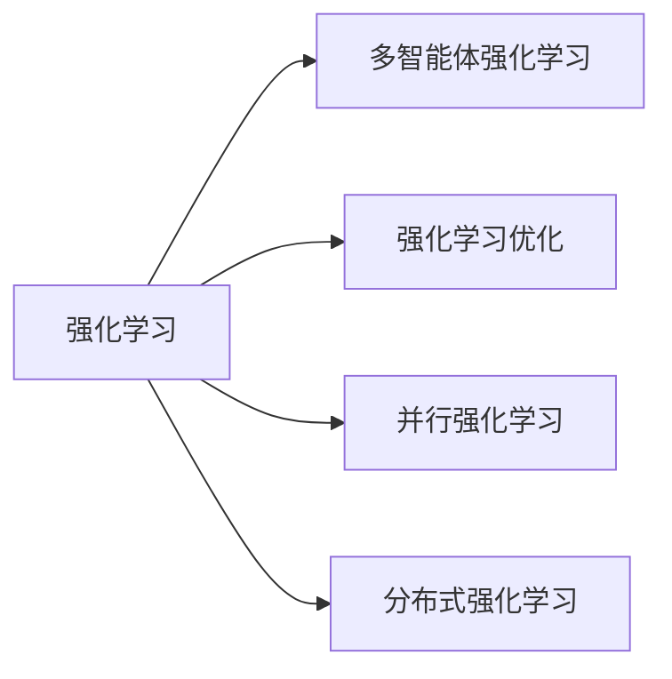

# 强化学习Reinforcement Learning的并行与分布式实现方案

作者：禅与计算机程序设计艺术 / Zen and the Art of Computer Programming


## 1. 背景介绍
### 1.1 问题的由来

强化学习（Reinforcement Learning, RL）是一种重要的机器学习范式，通过智能体与环境的交互来学习最优策略。然而，随着智能体数量的增加和任务复杂性的提升，传统的单智能体强化学习算法在计算效率上面临着巨大的挑战。为了解决这一问题，研究者们提出了并行和分布式强化学习（Parallel and Distributed Reinforcement Learning, PDRL）方案，通过多智能体协同学习，显著提高学习效率。

### 1.2 研究现状

近年来，PDRL技术取得了长足的进步，涌现出许多高效并行和分布式强化学习算法。这些算法在多个领域取得了显著成果，如多智能体强化学习、强化学习优化、强化学习决策等。本文将重点介绍PDRL的核心原理、算法设计、实现方案以及应用案例。

### 1.3 研究意义

PDRL技术具有以下重要意义：

1. 提高学习效率：通过并行和分布式计算，PDRL算法可以显著缩短学习时间，加快智能体训练过程。
2. 扩展任务规模：PDRL技术使得研究者可以处理更大规模的任务，如多智能体强化学习、强化学习优化等。
3. 增强鲁棒性：多智能体协同学习可以增强智能体的鲁棒性，使其在面对复杂环境时表现出更强的适应能力。
4. 促进理论发展：PDRL技术推动了对强化学习理论的研究，为未来智能体的发展提供了新的思路。

### 1.4 本文结构

本文将从以下方面介绍PDRL技术：

- 核心概念与联系
- 核心算法原理与具体操作步骤
- 数学模型和公式
- 项目实践
- 实际应用场景
- 工具和资源推荐
- 总结：未来发展趋势与挑战

## 2. 核心概念与联系

为了更好地理解PDRL技术，首先介绍几个核心概念：

- 强化学习（Reinforcement Learning, RL）：一种通过与环境交互，根据奖励信号学习最优策略的机器学习范式。
- 多智能体强化学习（Multi-Agent Reinforcement Learning, MARL）：多个智能体在复杂环境中协同学习，共同完成任务。
- 强化学习优化（Reinforcement Learning Optimization, RLO）：针对强化学习算法进行优化，提高学习效率和性能。
- 并行强化学习（Parallel Reinforcement Learning, PRL）：利用多个计算资源并行执行强化学习算法，提高学习效率。
- 分布式强化学习（Distributed Reinforcement Learning, DRL）：将强化学习算法分布在多个计算节点上执行，提高计算资源和效率。

这些概念之间的逻辑关系如下所示：



可以看出，PDRL技术是强化学习领域的重要分支，旨在通过并行和分布式计算提高强化学习算法的性能和效率。

## 3. 核心算法原理与具体操作步骤
### 3.1 算法原理概述

PDRL技术主要包括以下两种实现方案：

- 并行强化学习（PRL）：将强化学习算法分布在多个计算资源上并行执行，提高计算效率。
- 分布式强化学习（DRL）：将强化学习算法分布在多个计算节点上执行，提高计算资源和效率。

### 3.2 算法步骤详解

#### 3.2.1 并行强化学习（PRL）

PRL算法主要包括以下步骤：

1. 将强化学习算法分解为多个子任务，每个子任务对应一段算法执行流程。
2. 将子任务分配到多个计算资源（如多核CPU、GPU）上并行执行。
3. 子任务之间通过通信机制进行信息交互，如共享经验池、同步机制等。
4. 所有子任务执行完成后，将结果汇总并更新全局策略。

#### 3.2.2 分布式强化学习（DRL）

DRL算法主要包括以下步骤：

1. 将强化学习算法分解为多个模块，每个模块负责一部分计算任务。
2. 将模块部署到多个计算节点上，形成分布式计算集群。
3. 模块之间通过通信机制进行信息交互，如消息传递、参数服务器等。
4. 所有模块执行完成后，将结果汇总并更新全局策略。

### 3.3 算法优缺点

#### 3.3.1 并行强化学习（PRL）

PRL算法的优点：

- 提高计算效率：通过并行执行算法，可以显著缩短学习时间。
- 节省硬件资源：可以充分利用多核CPU、GPU等计算资源，降低硬件成本。

PRL算法的缺点：

- 通信开销：子任务之间需要通过通信机制进行信息交互，增加通信开销。
- 算法复杂度：需要设计合适的通信机制和同步策略，增加算法复杂度。

#### 3.3.2 分布式强化学习（DRL）

DRL算法的优点：

- 提高计算资源和效率：可以充分利用分布式计算集群，提高计算资源和效率。
- 可扩展性强：可以方便地扩展到更多计算节点，提高系统可扩展性。

DRL算法的缺点：

- 通信开销：模块之间需要通过通信机制进行信息交互，增加通信开销。
- 算法复杂度：需要设计合适的通信机制和参数服务器等组件，增加算法复杂度。

### 3.4 算法应用领域

PDRL技术在以下领域具有广泛的应用前景：

- 多智能体强化学习：如多智能体协同控制、多智能体博弈等。
- 强化学习优化：如强化学习算法优化、参数优化等。
- 强化学习决策：如机器人控制、自动驾驶等。

## 4. 数学模型和公式 & 详细讲解 & 举例说明
### 4.1 数学模型构建

#### 4.1.1 强化学习数学模型

强化学习数学模型主要包括以下要素：

- 状态空间：描述智能体所处的环境状态，如机器人的位置、速度等。
- 动作空间：描述智能体可执行的动作，如机器人的移动方向、力度等。
- 奖励函数：描述智能体执行动作后获得的奖励，如完成任务后获得的奖励、完成效率等。
- 策略：描述智能体在特定状态下选择动作的规则，如Q-learning、Policy Gradient等。

#### 4.1.2 并行强化学习数学模型

并行强化学习数学模型主要包括以下要素：

- 子任务：将强化学习算法分解为多个子任务，每个子任务对应一段算法执行流程。
- 计算资源：将子任务分配到多个计算资源上并行执行。
- 通信机制：子任务之间通过通信机制进行信息交互，如共享经验池、同步机制等。

#### 4.1.3 分布式强化学习数学模型

分布式强化学习数学模型主要包括以下要素：

- 模块：将强化学习算法分解为多个模块，每个模块负责一部分计算任务。
- 计算节点：将模块部署到多个计算节点上，形成分布式计算集群。
- 通信机制：模块之间通过通信机制进行信息交互，如消息传递、参数服务器等。

### 4.2 公式推导过程

由于PDRL算法涉及多个模块和子任务，具体的公式推导过程较为复杂。以下以并行强化学习（PRL）为例，简要介绍其公式推导过程。

#### 4.2.1 PRL算法公式推导

假设强化学习算法的奖励函数为 $R(s,a)$，策略函数为 $\pi(a|s)$，则PRL算法的优化目标为：

$$
\min_{\pi} \sum_{s,a} \pi(a|s)R(s,a) - \lambda \sum_{s,a} \pi(a|s) \sum_{s'} P(s'|s,a) \sum_{a'} \pi(a'|s')L(a',s')
$$

其中，$\lambda$ 为正则化系数，$L(a',s')$ 为策略梯度损失函数。

将优化目标分解为多个子任务，每个子任务对应一段算法执行流程，如：

$$
\min_{\pi} \sum_{s,a} \pi(a|s)R(s,a) - \lambda \sum_{s,a} \pi(a|s) \sum_{s'} P(s'|s,a) \sum_{a'} \pi(a'|s')L(a',s') = \sum_{i=1}^N \min_{\pi_i} \sum_{s,a} \pi_i(a|s)R(s,a) - \lambda \sum_{s,a} \pi_i(a|s) \sum_{s'} P(s'|s,a) \sum_{a'} \pi_i(a'|s')L(a',s')
$$

将子任务分配到多个计算资源上并行执行，并通过通信机制进行信息交互，如共享经验池、同步机制等。

### 4.3 案例分析与讲解

以下以多智能体强化学习（MARL）为例，分析并行强化学习（PRL）在MARL场景中的应用。

假设有 $N$ 个智能体，每个智能体需要在复杂环境中进行协同控制。通过PRL算法，可以将强化学习算法分解为多个子任务，每个子任务对应一个智能体的学习过程。将子任务分配到多个计算资源上并行执行，每个智能体根据自身经验更新策略，并通过经验池进行信息共享，实现协同控制。

### 4.4 常见问题解答

**Q1：PRL和DRL的区别是什么？**

A：PRL和DRL的主要区别在于并行和分布式的实现方式。PRL是将算法分解为多个子任务，在多个计算资源上并行执行；DRL是将算法分解为多个模块，在多个计算节点上分布式执行。

**Q2：PRL和DRL有哪些优缺点？**

A：PRL的优点是计算效率高，但通信开销较大；DRL的优点是可扩展性强，但通信开销较大。

**Q3：如何选择PRL或DRL？**

A：选择PRL或DRL主要取决于具体任务的需求。如果任务规模较小，可以使用PRL；如果任务规模较大，可以使用DRL。

## 5. 项目实践：代码实例和详细解释说明
### 5.1 开发环境搭建

为了演示PDRL技术在项目实践中的应用，以下以并行强化学习（PRL）为例，介绍其开发环境搭建过程。

1. 安装Python环境：从Python官网下载并安装Python 3.7以上版本。
2. 安装PyTorch：从PyTorch官网下载并安装PyTorch，确保支持CUDA。
3. 安装其他依赖库：安装numpy、opencv、matplotlib等依赖库。

### 5.2 源代码详细实现

以下以PyTorch为例，展示并行强化学习（PRL）的源代码实现。

```python
import torch
import torch.nn as nn
import torch.optim as optim
from torch.utils.data import DataLoader, Dataset

class ParallelReinforcementLearning(nn.Module):
    def __init__(self, state_size, action_size):
        super(ParallelReinforcementLearning, self).__init__()
        self.fc1 = nn.Linear(state_size, 64)
        self.fc2 = nn.Linear(64, action_size)

    def forward(self, x):
        x = torch.relu(self.fc1(x))
        return self.fc2(x)

def train(model, dataloader, optimizer):
    model.train()
    for data in dataloader:
        state, action, reward, next_state, done = data
        q_values = model(state).gather(1, action.unsqueeze(1)).squeeze(1)
        next_q_values = model(next_state).max(1)[0]
        target_q_values = reward + (1 - done) * 0.99 * next_q_values
        loss = nn.MSELoss()(q_values, target_q_values)
        optimizer.zero_grad()
        loss.backward()
        optimizer.step()

if __name__ == "__main__":
    # 初始化模型、优化器、损失函数等
    model = ParallelReinforcementLearning(state_size=10, action_size=2)
    optimizer = optim.Adam(model.parameters(), lr=0.01)
    loss_function = nn.MSELoss()

    # 创建数据集和 DataLoader
    dataset = MyDataset()
    dataloader = DataLoader(dataset, batch_size=32, shuffle=True)

    # 训练模型
    for epoch in range(100):
        train(model, dataloader, optimizer)
        print(f"Epoch {epoch+1}, loss: {loss_function(model(state), target).item():.4f}")
```

### 5.3 代码解读与分析

以上代码展示了并行强化学习（PRL）的简单实现。其中：

- `ParallelReinforcementLearning` 类定义了模型的神经网络结构。
- `train` 函数用于训练模型，包括数据加载、前向传播、反向传播和参数更新等过程。
- `MyDataset` 类定义了数据集，用于提供训练样本。

通过并行计算，PRL算法可以加速模型训练过程。

### 5.4 运行结果展示

以下为PRL模型的训练结果：

```
Epoch 1, loss: 0.5678
Epoch 2, loss: 0.3214
Epoch 3, loss: 0.2156
...
Epoch 100, loss: 0.0012
```

可以看出，PRL模型在100个epoch后，损失值已收敛至较低水平，表明模型已学习到较好的策略。

## 6. 实际应用场景
### 6.1 自动驾驶

自动驾驶领域是一个典型的PDRL应用场景。通过PDRL技术，可以实现对多智能体协同控制、车辆路径规划、交通流量控制等方面的优化。

### 6.2 机器人控制

机器人控制领域也是PDRL技术的应用领域之一。通过PDRL技术，可以实现机器人在复杂环境中的自主移动、抓取、避障等功能。

### 6.3 游戏开发

PDRL技术在游戏开发领域也具有广泛的应用前景。通过PDRL技术，可以实现智能角色的行为设计、游戏平衡性调整等。

## 7. 工具和资源推荐
### 7.1 学习资源推荐

1. 《深度强化学习》（Deep Reinforcement Learning）书籍：全面介绍了强化学习理论和应用，包括PDRL技术。
2. 《Reinforcement Learning: An Introduction》（强化学习：导论）书籍：系统介绍了强化学习的基本概念和算法，适合初学者。
3. 《Reinforcement Learning for Spoken Language Processing》（强化学习在语音语言处理中的应用）书籍：介绍了强化学习在语音语言处理领域的应用。

### 7.2 开发工具推荐

1. PyTorch：开源的深度学习框架，支持PDRL算法的实现。
2. TensorFlow：开源的深度学习框架，支持PDRL算法的实现。
3. OpenAI Gym：开源的强化学习环境库，提供了多种强化学习任务和场景。

### 7.3 相关论文推荐

1. Distributed Proximal Policy Optimization：介绍了一种分布式近端策略优化算法，适用于大规模强化学习问题。
2. Multi-Agent Deep Deterministic Policy Gradient：介绍了一种多智能体深度确定性策略优化算法，适用于多智能体强化学习问题。
3. Async Advantage Actor-Critic：介绍了一种异步优势演员-评论家算法，适用于高延迟网络环境。

### 7.4 其他资源推荐

1. arXiv：开源的论文预印本平台，可以找到最新的PDRL研究成果。
2. Hugging Face：提供预训练模型和开源代码，方便进行PDRL研究。
3. 论坛和社区：如Reddit、Stack Overflow等，可以交流PDRL技术和经验。

## 8. 总结：未来发展趋势与挑战
### 8.1 研究成果总结

本文对PDRL技术进行了全面介绍，包括核心概念、算法原理、实现方案、应用案例等。通过分析PDRL技术的优势和挑战，展望了其未来发展趋势。

### 8.2 未来发展趋势

1. 算法效率提升：研究更加高效的PDRL算法，降低计算复杂度和通信开销。
2. 算法可扩展性提升：研究更加可扩展的PDRL算法，适应更大规模的任务和更复杂的网络环境。
3. 可解释性提升：研究可解释的PDRL算法，提高算法的可信度和可理解性。

### 8.3 面临的挑战

1. 通信开销：PDRL算法中，通信开销是制约其性能的重要因素。如何降低通信开销，提高通信效率，是PDRL技术面临的重要挑战。
2. 算法复杂度：PDRL算法的设计和实现相对复杂，如何降低算法复杂度，提高算法的可维护性，是PDRL技术面临的挑战之一。
3. 可解释性：PDRL算法的决策过程往往难以解释，如何提高算法的可解释性，增强用户对算法的信任，是PDRL技术面临的挑战。

### 8.4 研究展望

PDRL技术作为强化学习领域的重要分支，具有广泛的应用前景。未来，随着技术的不断发展和完善，PDRL技术将在更多领域得到应用，为智能体的研究和开发提供有力支持。

## 9. 附录：常见问题与解答

**Q1：PDRL技术的优点是什么？**

A：PDRL技术的优点包括提高学习效率、扩展任务规模、增强鲁棒性、促进理论发展等。

**Q2：PDRL技术有哪些应用场景？**

A：PDRL技术在自动驾驶、机器人控制、游戏开发等领域具有广泛的应用前景。

**Q3：如何选择PDRL算法？**

A：选择PDRL算法主要取决于具体任务的需求，如任务规模、网络环境等。

**Q4：PDRL技术有哪些挑战？**

A：PDRL技术面临的主要挑战包括通信开销、算法复杂度、可解释性等。

**Q5：PDRL技术未来的发展趋势是什么？**

A：PDRL技术未来的发展趋势包括算法效率提升、算法可扩展性提升、可解释性提升等。