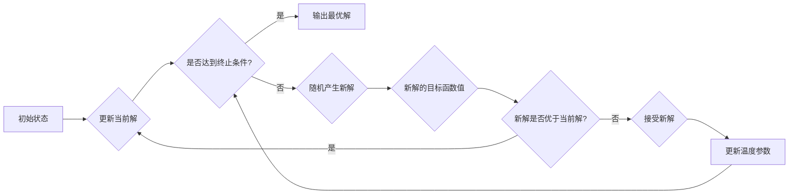

# 模拟退火算法(Simulated Annealing) - 原理与代码实例讲解

> 关键词：模拟退火，优化算法，随机搜索，爬山法，冷却过程，全局优化，局部搜索，人工智能

## 1. 背景介绍

优化算法在人工智能、机器学习、运筹学等多个领域都有着广泛的应用。模拟退火算法（Simulated Annealing，SA）是一种启发式搜索算法，旨在解决优化问题中的局部最优陷阱，寻找全局最优解。它模拟了固体在缓慢冷却过程中退火的过程，通过接受次优解来避免陷入局部最优解。

### 1.1 问题的由来

在许多实际问题中，我们希望找到问题的最优解，如旅行商问题（TSP）、背包问题、图着色问题等。然而，这些问题的解空间通常非常大，直接搜索所有可能解的方法效率低下。因此，需要一种有效的搜索策略，能够在解空间中高效地寻找全局最优解。

### 1.2 研究现状

模拟退火算法自1983年由Kirkpatrick等人提出以来，已经广泛应用于各种优化问题。近年来，随着计算机技术的发展，模拟退火算法在理论研究和实际应用方面都取得了显著的进展。

### 1.3 研究意义

模拟退火算法在解决优化问题中具有以下意义：

- 寻找全局最优解，避免局部最优陷阱。
- 适用于解空间大、计算复杂度高的问题。
- 可应用于机器学习中的参数优化、聚类、分类等问题。

### 1.4 本文结构

本文将系统地介绍模拟退火算法的原理、实现和应用。具体内容如下：

- 第2章：介绍模拟退火算法的核心概念与联系。
- 第3章：详细阐述模拟退火算法的原理和具体操作步骤。
- 第4章：讲解模拟退火算法的数学模型和公式，并结合实例进行说明。
- 第5章：给出模拟退火算法的代码实例和详细解释。
- 第6章：探讨模拟退火算法的实际应用场景和未来展望。
- 第7章：推荐学习资源和开发工具。
- 第8章：总结模拟退火算法的研究成果、发展趋势和挑战。
- 第9章：附录，常见问题与解答。

## 2. 核心概念与联系

### 2.1 核心概念

- **优化问题**：给定一个目标函数和一组变量，寻找一组变量的取值，使得目标函数取得最大值或最小值。
- **解空间**：所有可能解的集合。
- **局部最优解**：解空间中使目标函数取得局部最小值（或最大值）的解。
- **全局最优解**：解空间中使目标函数取得全局最小值（或最大值）的解。
- **爬山法**：一种常见的搜索策略，通过不断向目标函数值增加的方向移动，寻找局部最优解。
- **模拟退火**：一种启发式搜索算法，通过模拟固体退火过程，在搜索过程中接受次优解，以避免陷入局部最优解。

### 2.2 Mermaid 流程图



### 2.3 核心概念联系

模拟退火算法的核心思想是通过接受次优解来跳出局部最优解，从而寻找全局最优解。爬山法是模拟退火算法的一种特例，当温度足够高时，模拟退火算法类似于爬山法。

## 3. 核心算法原理 & 具体操作步骤

### 3.1 算法原理概述

模拟退火算法模拟了固体在缓慢冷却过程中的退火过程。在固体冷却过程中，原子和分子会逐渐从高能态转移到低能态，而温度的降低会减缓原子和分子的运动，使得系统能够达到更低的能量状态。模拟退火算法利用这一原理，通过模拟一个退火过程来寻找全局最优解。

### 3.2 算法步骤详解

模拟退火算法的主要步骤如下：

1. 初始化：设置初始状态、初始温度和终止条件。
2. 迭代搜索：在当前温度下，随机产生新解，并计算新解与当前解的目标函数值之差。
3. 决策：根据当前温度和目标函数值之差，决定是否接受新解。
4. 更新温度：根据冷却函数降低温度。
5. 判断终止条件：如果满足终止条件，则输出最优解；否则，返回步骤2。

### 3.3 算法优缺点

#### 优点：

- 能够避免陷入局部最优解，寻找全局最优解。
- 适用于解空间大、计算复杂度高的问题。
- 可应用于多种优化问题，如组合优化、机器学习等。

#### 缺点：

- 需要选择合适的参数，如初始温度、冷却函数等。
- 可能收敛到局部最优解，特别是在冷却速度过快的情况下。
- 计算复杂度高，特别是对于大规模问题。

### 3.4 算法应用领域

模拟退火算法在以下领域有着广泛的应用：

- 组合优化：如旅行商问题、背包问题、图着色问题等。
- 机器学习：如神经网络参数优化、支持向量机参数优化等。
- 计算机视觉：如图像分割、目标检测等。
- 运筹学：如调度问题、资源配置问题等。

## 4. 数学模型和公式 & 详细讲解 & 举例说明

### 4.1 数学模型构建

模拟退火算法的数学模型可以表示为：

$$
\theta_{t+1} = \theta_t + \alpha \cdot (x_{t+1} - x_t)
$$

其中：

- $\theta_t$ 表示第 $t$ 次迭代时的温度。
- $\alpha$ 表示温度衰减系数。
- $x_{t+1}$ 和 $x_t$ 分别表示第 $t+1$ 次迭代和第 $t$ 次迭代时的解。
- $x_{t+1} - x_t$ 表示解的扰动。

### 4.2 公式推导过程

模拟退火算法的公式推导过程如下：

1. 设 $x_0$ 为初始解，$\theta_0$ 为初始温度。
2. 在第 $t$ 次迭代中，随机产生一个新解 $x_{t+1}$。
3. 计算新解与当前解的目标函数值之差 $\Delta f(x_{t+1})$。
4. 根据 $\Delta f(x_{t+1})$ 和当前温度 $\theta_t$，决定是否接受新解。
5. 如果接受新解，则 $x_t = x_{t+1}$；否则，保持 $x_t$ 不变。
6. 根据冷却函数降低温度 $\theta_{t+1} = \theta_t \cdot \alpha$。
7. 判断是否满足终止条件，如果满足，则输出最优解；否则，返回步骤2。

### 4.3 案例分析与讲解

假设有一个优化问题，目标函数为：

$$
f(x) = (x-1)^2
$$

其中 $x$ 的取值范围为 $[0, 2]$。

我们需要使用模拟退火算法找到该函数的全局最小值。

首先，设置初始温度 $\theta_0 = 100$，温度衰减系数 $\alpha = 0.99$，终止温度 $\theta_{\text{final}} = 0.01$。

初始化解 $x_0 = 0.5$。

在第1次迭代中，随机产生新解 $x_1 = 1.5$。

计算新解与当前解的目标函数值之差 $\Delta f(x_1) = (1.5-1)^2 = 0.25$。

由于 $\Delta f(x_1) > 0$，我们接受新解，并更新解 $x_0 = x_1$。

计算新解的目标函数值 $f(x_0) = (1.5-1)^2 = 0.25$。

根据冷却函数降低温度 $\theta_1 = \theta_0 \cdot \alpha = 100 \cdot 0.99 = 99$。

重复上述步骤，直到温度低于终止温度 $\theta_{\text{final}}$。

最终，我们找到全局最小值 $x^* = 1$，对应的目标函数值为 $f(x^*) = (1-1)^2 = 0$。

## 5. 项目实践：代码实例和详细解释说明

### 5.1 开发环境搭建

本文使用Python进行模拟退火算法的实现，需要安装以下库：

- NumPy：用于数值计算。
- Matplotlib：用于绘图。

安装命令如下：

```bash
pip install numpy matplotlib
```

### 5.2 源代码详细实现

```python
import numpy as np
import matplotlib.pyplot as plt

# 目标函数
def f(x):
    return (x-1)**2

# 模拟退火算法
def simulated_annealing(f, x0, T, T_final, alpha):
    x = x0
    t = 0
    while T > T_final:
        x_new = x + np.random.normal(0, 0.1)  # 随机扰动
        x_new = max(0, min(x_new, 2))  # 确保x_new在合法范围内
        delta_f = f(x_new) - f(x)
        if delta_f < 0 or np.exp(-delta_f/T) > np.random.rand():
            x = x_new
        T *= alpha
        t += 1
    return x, t

# 设置参数
x0 = 0.5
T = 100
T_final = 0.01
alpha = 0.99

# 运行模拟退火算法
x_star, t = simulated_annealing(f, x0, T, T_final, alpha)

# 绘制目标函数图像
x = np.linspace(0, 2, 100)
y = f(x)
plt.plot(x, y)
plt.scatter([x_star], [f(x_star)], color='red')
plt.title(f'Optimal Solution: x = {x_star}, f(x) = {f(x_star)}')
plt.show()

print(f"Optimal Solution: x = {x_star}, f(x) = {f(x_star)}")
print(f"Number of Iterations: {t}")
```

### 5.3 代码解读与分析

- `f(x)`：定义目标函数。
- `simulated_annealing(f, x0, T, T_final, alpha)`：模拟退火算法的实现，参数说明如下：
  - `f`：目标函数。
  - `x0`：初始解。
  - `T`：当前温度。
  - `T_final`：终止温度。
  - `alpha`：温度衰减系数。
- `x_new = x + np.random.normal(0, 0.1)`：随机扰动新解。
- `delta_f = f(x_new) - f(x)`：计算新解与当前解的目标函数值之差。
- `if delta_f < 0 or np.exp(-delta_f/T) > np.random.rand()`：根据接受准则决定是否接受新解。
- `plt.plot(x, y)`：绘制目标函数图像。
- `plt.scatter([x_star], [f(x_star)], color='red')`：在目标函数图像上标出最优解。
- `print()`：输出最优解和迭代次数。

### 5.4 运行结果展示

运行上述代码，会输出最优解和迭代次数，并在目标函数图像上标出最优解。

## 6. 实际应用场景

模拟退火算法在以下领域有着广泛的应用：

- **组合优化**：如旅行商问题、背包问题、图着色问题等。
- **机器学习**：如神经网络参数优化、支持向量机参数优化等。
- **计算机视觉**：如图像分割、目标检测等。
- **运筹学**：如调度问题、资源配置问题等。

### 6.1 旅行商问题（TSP）

旅行商问题是一个经典的组合优化问题，目标是最小化旅行商的旅行距离。模拟退火算法可以用来解决TSP问题。

### 6.2 神经网络参数优化

模拟退火算法可以用来优化神经网络的参数，提高模型的性能。

### 6.3 图像分割

模拟退火算法可以用来进行图像分割，将图像划分为多个区域。

### 6.4 调度问题

模拟退火算法可以用来解决调度问题，如作业调度、航班调度等。

## 7. 工具和资源推荐

### 7.1 学习资源推荐

- 《模拟退火算法及其应用》
- 《优化算法及其应用》
- 《机器学习：概率视角》

### 7.2 开发工具推荐

- Python
- NumPy
- Matplotlib

### 7.3 相关论文推荐

- **Kirkpatrick, S., Gelatt, C. D., & Vecchi, M. P. (1983). Optimization by simulated annealing. Science, 220(4598), 671-680**.
- **Geman, S., & Geman, D. (1984). Stochastic relaxation, Gibbs distributions, and the Bayesian restoration of images. IEEE Transactions on Pattern Analysis and Machine Intelligence, 6(6), 721-741**.

## 8. 总结：未来发展趋势与挑战

### 8.1 研究成果总结

模拟退火算法是一种有效的全局优化算法，在解决优化问题中具有广泛的应用。本文介绍了模拟退火算法的原理、实现和应用，并给出了一个代码实例。

### 8.2 未来发展趋势

- 研究更加高效的冷却函数和接受准则，提高算法的搜索效率。
- 将模拟退火算法与其他优化算法结合，提高算法的鲁棒性和适用性。
- 将模拟退火算法应用于更多领域，如生物学、物理学、经济学等。

### 8.3 面临的挑战

- 选择合适的参数，如初始温度、温度衰减系数等。
- 在实际应用中，如何处理大规模问题。
- 如何与其他优化算法结合，提高算法的性能。

### 8.4 研究展望

模拟退火算法是一种具有广泛应用前景的优化算法，未来将在更多领域发挥重要作用。相信随着研究的不断深入，模拟退火算法将会更加成熟和完善。

## 9. 附录：常见问题与解答

**Q1：模拟退火算法的接受准则是什么？**

A：模拟退火算法的接受准则如下：

- 如果新解的目标函数值优于当前解，则接受新解。
- 如果新解的目标函数值不优于当前解，则以一定概率接受新解，该概率与当前温度和目标函数值之差成正比。

**Q2：模拟退火算法的冷却函数有哪些？**

A：常见的冷却函数有：

- 指数冷却函数：$T_{t+1} = T_t \cdot \alpha$，其中 $\alpha$ 是衰减系数。
- 对数冷却函数：$T_{t+1} = T_t / (1 + \beta t)$，其中 $\beta$ 是冷却速率。

**Q3：模拟退火算法适用于哪些类型的优化问题？**

A：模拟退火算法适用于以下类型的优化问题：

- 组合优化问题，如TSP、背包问题、图着色问题等。
- 机器学习问题，如神经网络参数优化、支持向量机参数优化等。
- 计算机视觉问题，如图像分割、目标检测等。

**Q4：如何提高模拟退火算法的性能？**

A：提高模拟退火算法性能的方法有：

- 选择合适的参数，如初始温度、温度衰减系数、接受准则等。
- 采用更加高效的搜索策略，如局部搜索、自适应搜索等。
- 将模拟退火算法与其他优化算法结合，提高算法的鲁棒性和适用性。

**Q5：模拟退火算法与其他优化算法相比有哪些优缺点？**

A：模拟退火算法与其他优化算法相比有以下优缺点：

- 优点：能够避免陷入局部最优解，寻找全局最优解。
- 缺点：需要选择合适的参数，计算复杂度高。

作者：禅与计算机程序设计艺术 / Zen and the Art of Computer Programming