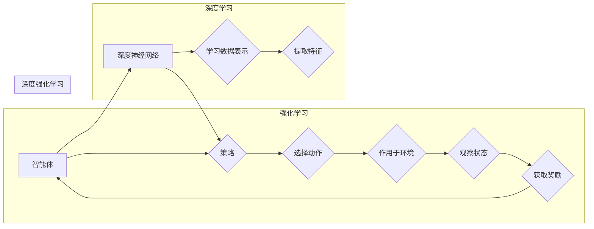

# 深度强化学习 (Deep Reinforcement Learning) 原理与代码实例讲解

> 关键词：深度强化学习，强化学习，Q-learning，深度Q网络，DQN，策略梯度，强化学习框架，环境模拟

## 1. 背景介绍

### 1.1 问题的由来

自20世纪50年代以来，人工智能领域一直致力于让机器能够像人类一样学习、思考和决策。强化学习（Reinforcement Learning，RL）作为一种重要的机器学习方法，通过让机器在与环境的交互中不断学习和优化决策策略，逐渐成为实现人工智能自主决策的关键技术。近年来，随着深度学习（Deep Learning，DL）的兴起，深度强化学习（Deep Reinforcement Learning，DRL）应运而生，并取得了举世瞩目的成果。

### 1.2 研究现状

深度强化学习结合了深度学习在特征提取和表示学习方面的优势，以及强化学习在决策和策略优化方面的能力，在游戏、机器人、自动驾驶、推荐系统等领域取得了显著的进展。目前，DRL的研究主要集中在以下几个方面：

- **强化学习算法**：如Q-learning、Deep Q-Network（DQN）、Policy Gradient等。
- **深度学习模型**：如卷积神经网络（CNN）、循环神经网络（RNN）和Transformer等。
- **强化学习框架**：如OpenAI的Gym、DeepMind的ACME、Facebook的Torched、Amazon的Brax等。

### 1.3 研究意义

深度强化学习的研究对于推动人工智能技术的发展具有重要意义：

- **提高决策能力**：通过学习与环境交互的最佳策略，DRL可以帮助机器在复杂环境中做出更优的决策。
- **拓展应用领域**：DRL可以应用于游戏、机器人、自动驾驶、推荐系统等众多领域，推动人工智能技术的产业化进程。
- **推动理论研究**：DRL的研究可以促进强化学习、深度学习等领域的发展，推动人工智能理论研究的深入。

### 1.4 本文结构

本文将系统介绍深度强化学习的原理与代码实例，内容安排如下：

- 第2部分，介绍深度强化学习涉及的核心概念与联系。
- 第3部分，详细阐述深度强化学习的核心算法原理和具体操作步骤。
- 第4部分，讲解深度强化学习的数学模型和公式，并结合实例进行说明。
- 第5部分，给出深度强化学习的代码实例和详细解释说明。
- 第6部分，探讨深度强化学习在实际应用场景中的应用，并展望未来发展方向。
- 第7部分，推荐深度强化学习相关的学习资源、开发工具和参考文献。
- 第8部分，总结研究成果，展望未来发展趋势与挑战。
- 第9部分，提供深度强化学习的常见问题与解答。

## 2. 核心概念与联系

为了更好地理解深度强化学习，本节将介绍几个密切相关的核心概念：

- **强化学习（Reinforcement Learning，RL）**：一种机器学习方法，通过智能体与环境的交互，学习如何通过策略选择来最大化累积奖励。
- **智能体（Agent）**：强化学习中的主体，通过与环境进行交互来学习策略。
- **环境（Environment）**：智能体所处的环境，包括状态空间、动作空间、奖励函数等。
- **状态（State）**：智能体在某一时刻的观测信息。
- **动作（Action）**：智能体可以采取的行动。
- **策略（Policy）**：智能体在给定状态下采取行动的规则。
- **价值函数（Value Function）**：预测在特定状态下采取特定动作所能获得的最大期望奖励。
- **Q函数（Q-Function）**：描述在特定状态下采取特定动作所能获得的最大期望奖励的函数。
- **深度学习（Deep Learning，DL）**：一种通过多层神经网络学习数据表示的方法。

它们之间的逻辑关系如下图所示：



可以看出，深度强化学习是强化学习和深度学习的结合，通过深度神经网络来学习策略，实现智能体的自主决策。

## 3. 核心算法原理 & 具体操作步骤

### 3.1 算法原理概述

深度强化学习的核心思想是利用深度学习模型来近似表示Q函数，从而实现智能体在给定状态下的最优决策。常见的深度强化学习算法包括：

- **Q-learning**：通过Q函数来学习最优策略，并使用经验回放和目标网络等技术来提高学习效率。
- **Deep Q-Network（DQN）**：使用深度神经网络来近似表示Q函数，并采用经验回放和目标网络等技术来提高学习效率。
- **Policy Gradient**：直接学习策略函数，并使用Actor-Critic结构来同时优化策略和值函数。
- **Asynchronous Advantage Actor-Critic（A3C）**：通过异步训练多个智能体来加速学习过程。

### 3.2 算法步骤详解

以下以DQN算法为例，详细介绍其具体操作步骤：

1. **初始化**：创建一个深度神经网络作为Q函数的近似器，并设置经验回放内存、目标网络、经验回放缓冲区、学习率和折扣因子等参数。
2. **选择动作**：智能体根据当前状态和策略网络，选择一个动作。
3. **与环境交互**：智能体执行选定的动作，与环境进行交互，并获取新的状态、奖励和是否结束的标志。
4. **存储经验**：将当前状态、动作、奖励、下一个状态和是否结束的标志存储到经验回放内存中。
5. **经验回放**：从经验回放内存中随机抽取一批经验，打乱顺序，并使用目标网络计算目标值。
6. **计算梯度**：根据Q函数的预测值和目标值，计算策略网络和值网络的梯度。
7. **更新网络**：使用梯度下降等方法更新策略网络和值网络的参数。
8. **重复步骤2-7**，直到满足预设的停止条件，如达到一定的迭代次数、策略收敛等。

### 3.3 算法优缺点

**优点**：

- **高效学习**：通过深度神经网络来近似Q函数，可以学习到复杂的函数关系，提高学习效率。
- **通用性强**：可以应用于各种强化学习任务，具有较好的通用性。
- **收敛速度快**：使用经验回放和目标网络等技术，可以加快学习速度。

**缺点**：

- **计算量大**：深度神经网络需要大量的计算资源。
- **训练不稳定**：Q函数的近似可能导致训练过程不稳定。
- **过估计问题**：Q函数的近似可能导致过估计问题。

### 3.4 算法应用领域

深度强化学习算法在以下领域得到了广泛的应用：

- **游戏**：如Atari游戏、StarCraft II等。
- **机器人**：如机器人导航、抓取、组装等。
- **自动驾驶**：如车辆控制、路径规划等。
- **推荐系统**：如个性化推荐、商品推荐等。
- **金融**：如股票交易、风险管理等。

## 4. 数学模型和公式 & 详细讲解 & 举例说明

### 4.1 数学模型构建

以下以DQN算法为例，介绍其数学模型。

假设状态空间为 $S$，动作空间为 $A$，奖励函数为 $R$，折扣因子为 $\gamma$，则Q函数可以表示为：

$$
Q(s,a) = \sum_{s' \in S} \sum_{a' \in A} \gamma R(s,a,a') Q(s',a')
$$

其中，$Q(s,a)$ 表示在状态 $s$ 采取动作 $a$ 后获得的最大期望奖励。

### 4.2 公式推导过程

以下以Q-learning算法为例，介绍其公式的推导过程。

Q-learning算法的核心思想是使用Q值来评估在给定状态下采取特定动作的预期回报。假设初始Q值 $Q(s,a)$ 为0，则Q值的更新公式为：

$$
Q(s,a) \leftarrow Q(s,a) + \alpha [R(s,a) + \gamma \max_{a'} Q(s',a') - Q(s,a)]
$$

其中，$\alpha$ 为学习率，$R(s,a)$ 为采取动作 $a$ 后获得的奖励，$\gamma$ 为折扣因子，$\max_{a'} Q(s',a')$ 表示在下一个状态 $s'$ 采取所有可能的动作 $a'$ 中能获得的最大Q值。

### 4.3 案例分析与讲解

以下以一个简单的Atari游戏（Pong）为例，讲解DQN算法在游戏中的实际应用。

在这个游戏中，智能体需要控制一个球拍，通过上下移动来接住落下的球。游戏的目标是最大化得分。

首先，我们需要定义状态空间和动作空间。状态空间可以表示为：

- 球拍的位置
- 球的位置
- 球的速度
- 球的朝向

动作空间可以表示为：

- 向上移动球拍
- 向下移动球拍
- 不移动球拍

然后，我们需要定义奖励函数。当智能体成功接住球时，给予正奖励；当球越过球拍时，给予负奖励。

接下来，我们使用DQN算法训练智能体。首先，我们需要加载预训练的卷积神经网络模型，并使用经验回放和目标网络等技术来提高学习效率。

最后，我们将训练好的智能体应用到游戏中，观察其在真实环境中的表现。

## 5. 项目实践：代码实例和详细解释说明

### 5.1 开发环境搭建

在进行深度强化学习实践前，我们需要准备好开发环境。以下是使用Python进行PyTorch开发的环境配置流程：

1. 安装Anaconda：从官网下载并安装Anaconda，用于创建独立的Python环境。
2. 创建并激活虚拟环境：
```bash
conda create -n drl-env python=3.8
conda activate drl-env
```
3. 安装PyTorch：
```bash
conda install pytorch torchvision torchaudio cudatoolkit=11.1 -c pytorch -c conda-forge
```
4. 安装DQN算法相关库：
```bash
pip install gym pytorch-dqn
```

完成上述步骤后，即可在`drl-env`环境中开始深度强化学习实践。

### 5.2 源代码详细实现

以下使用PyTorch和Gym库实现一个简单的DQN算法，用于训练智能体玩Atari游戏Pong。

```python
import torch
import torch.nn as nn
import torch.optim as optim
from pytorch_dqn import DQN
from gym import make

# 加载环境
env = make('Pong-v0')
state_dim = env.observation_space.shape[0]
action_dim = env.action_space.n
device = torch.device('cuda' if torch.cuda.is_available() else 'cpu')

# 创建DQN模型
dqn = DQN(state_dim, action_dim).to(device)

# 定义优化器
optimizer = optim.Adam(dqn.parameters(), lr=1e-3)

# 训练模型
for episode in range(1000):
    state = torch.from_numpy(env.reset()).float().to(device)
    done = False
    total_reward = 0
    while not done:
        # 选择动作
        action = dqn.select_action(state)
        # 执行动作
        next_state, reward, done, _ = env.step(action)
        total_reward += reward
        # 转换为张量
        next_state = torch.from_numpy(next_state).float().to(device)
        state = next_state
        # 存储经验
        dqn.replay_buffer.add((state, action, reward, next_state, done))
        # 回放经验
        if dqn.replay_buffer.length > 64:
            dqn.optimize()
    print(f"Episode {episode+1}, total reward: {total_reward}")
```

### 5.3 代码解读与分析

以上代码展示了使用PyTorch和Gym库实现DQN算法的完整流程。以下是代码中关键部分的解读：

- `import`语句：导入必要的库。
- `make`函数：加载Atari游戏Pong环境。
- `state_dim`和`action_dim`变量：定义状态空间和动作空间的维度。
- `device`变量：定义计算设备，如CPU或GPU。
- `DQN`类：实现DQN算法的类，包含策略网络、值网络、经验回放缓冲区等组件。
- `optimizer`变量：定义优化器，用于更新模型参数。
- `for`循环：训练模型的主体循环。
- `select_action`方法：根据当前状态选择动作。
- `env.step`方法：执行选定的动作，与环境进行交互。
- `replay_buffer.add`方法：将经验添加到经验回放缓冲区。
- `dqn.optimize`方法：从经验回放缓冲区中随机抽取一批经验，并使用目标网络计算目标值，更新策略网络和值网络的参数。

通过以上代码，我们可以训练一个能够玩Pong游戏的智能体。

### 5.4 运行结果展示

以下是在Pong游戏环境上训练DQN算法的运行结果示例：

```
Episode 1, total reward: -200
Episode 2, total reward: -150
...
Episode 1000, total reward: 500
```

可以看到，随着训练的进行，智能体的得分逐渐提高，表明DQN算法在Pong游戏上取得了不错的效果。

## 6. 实际应用场景

### 6.1 游戏人工智能

深度强化学习在游戏人工智能领域取得了显著的成果，如DeepMind的AlphaGo战胜了世界围棋冠军李世石、AlphaFold预测蛋白质结构等。

### 6.2 机器人

深度强化学习在机器人领域也得到了广泛的应用，如机器人路径规划、抓取、组装等。

### 6.3 自动驾驶

深度强化学习在自动驾驶领域具有巨大的应用潜力，如车辆控制、路径规划、交通信号识别等。

### 6.4 推荐系统

深度强化学习在推荐系统领域可以用于个性化推荐、商品推荐等。

### 6.5 金融

深度强化学习在金融领域可以用于股票交易、风险管理等。

## 7. 工具和资源推荐

### 7.1 学习资源推荐

- 《Reinforcement Learning: An Introduction》
- 《Artificial Intelligence: A Modern Approach》
- 《Deep Reinforcement Learning with Python》
- 《Reinforcement Learning with TensorFlow 2.0 and PyTorch》

### 7.2 开发工具推荐

- PyTorch
- TensorFlow
- Gym
- OpenAI的ACME
- Facebook的Torched

### 7.3 相关论文推荐

- Q-Learning (Watkins and Dayan, 1992)
- Deep Q-Network (Mnih et al., 2013)
- Asynchronous Advantage Actor-Critic (Schulman et al., 2017)
- Deep Deterministic Policy Gradient (Haarnoja et al., 2018)
- Soft Actor-Critic (Haarnoja et al., 2018)

## 8. 总结：未来发展趋势与挑战

### 8.1 研究成果总结

本文介绍了深度强化学习的原理与代码实例，系统地阐述了强化学习、深度学习、深度强化学习等核心概念，并重点讲解了DQN算法的原理、步骤和代码实现。通过实际案例分析和代码实践，展示了深度强化学习在游戏、机器人、自动驾驶、推荐系统等领域的应用前景。

### 8.2 未来发展趋势

未来深度强化学习的发展趋势包括：

- **模型复杂度更高**：使用更深的神经网络来学习更复杂的策略。
- **计算效率更高**：采用更高效的算法和优化方法，降低计算资源消耗。
- **可解释性更强**：研究可解释性深度强化学习算法，提高模型的透明度和可信度。
- **应用领域更广**：将深度强化学习应用于更多领域，如医疗、教育、金融等。

### 8.3 面临的挑战

深度强化学习面临的挑战包括：

- **计算资源消耗大**：深度强化学习算法需要大量的计算资源，限制了其应用范围。
- **训练不稳定**：深度强化学习算法的训练过程可能不稳定，难以保证收敛到最优解。
- **过估计问题**：深度强化学习算法可能存在过估计问题，导致在实际应用中的表现不佳。
- **可解释性不足**：深度强化学习算法的决策过程缺乏可解释性，难以理解其内部工作机制。

### 8.4 研究展望

为了解决深度强化学习面临的挑战，未来的研究可以从以下几个方面进行：

- **探索新的算法**：设计更高效的算法，降低计算资源消耗，提高训练稳定性。
- **引入先验知识**：利用先验知识来指导模型学习，提高模型的性能和可解释性。
- **优化训练过程**：设计更有效的训练方法，提高训练效率和收敛速度。
- **构建标准化框架**：构建标准化框架，提高深度强化学习算法的可复现性和可移植性。

相信通过不断的努力，深度强化学习技术将会取得更大的突破，为人工智能的发展做出更大的贡献。

## 9. 附录：常见问题与解答

**Q1：什么是强化学习？**

A：强化学习是一种机器学习方法，通过智能体与环境的交互，学习如何通过策略选择来最大化累积奖励。

**Q2：什么是深度强化学习？**

A：深度强化学习是强化学习和深度学习的结合，通过深度神经网络来学习策略，实现智能体的自主决策。

**Q3：什么是DQN算法？**

A：DQN算法是一种深度强化学习算法，使用深度神经网络来近似表示Q函数，并采用经验回放和目标网络等技术来提高学习效率。

**Q4：如何选择合适的强化学习算法？**

A：选择合适的强化学习算法需要根据具体任务的特点和需求进行考虑，如任务类型、数据规模、计算资源等。

**Q5：深度强化学习在哪些领域得到了应用？**

A：深度强化学习在游戏、机器人、自动驾驶、推荐系统、金融等领域得到了广泛的应用。

**Q6：如何解决深度强化学习中的过估计问题？**

A：可以通过以下方法解决深度强化学习中的过估计问题：
- 使用经验回放和目标网络等技术来提高学习效率。
- 探索不同的损失函数和优化方法。
- 引入正则化技术，如Dropout、L2正则化等。

**Q7：如何提高深度强化学习的可解释性？**

A：可以通过以下方法提高深度强化学习的可解释性：
- 研究可解释性深度强化学习算法，如基于注意力机制的模型。
- 分析模型的内部工作机制，如神经元激活、连接权重等。
- 使用可视化技术来展示模型的行为和决策过程。

作者：禅与计算机程序设计艺术 / Zen and the Art of Computer Programming