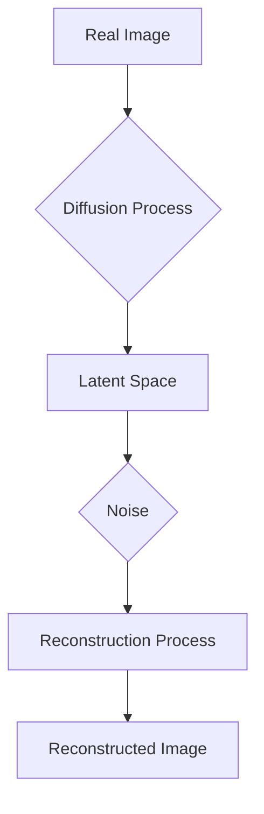

> 潜在扩散模型，Latent Diffusion Model，生成模型，深度学习，图像生成，Unsupervised Learning

# 潜在扩散模型Latent Diffusion Model原理与代码实例讲解

## 1. 背景介绍

近年来，生成模型在计算机视觉领域取得了显著的进展，特别是基于深度学习的生成对抗网络（GAN）和变分自编码器（VAE）。然而，这些模型在生成高质量图像方面仍然面临一些挑战，如模式崩溃、训练不稳定和难以控制生成图像的多样性。潜在扩散模型（Latent Diffusion Model，LDM）是一种新兴的生成模型，它通过将图像逐渐转化为潜在空间中的随机噪声，再从噪声中重建图像，从而生成高质量的图像。LDM结合了GAN和VAE的优点，具有训练稳定、生成多样性和可控性强等特点。

## 2. 核心概念与联系

### 2.1 核心概念

- **潜在扩散模型（LDM）**：一种基于深度学习的生成模型，通过将图像逐渐转化为潜在空间中的随机噪声，再从噪声中重建图像。
- **潜在空间**：一个数学空间，其中包含所有可能的图像表示，用于表示图像的潜在信息。
- **随机噪声**：在潜在空间中引入的随机扰动，用于打破数据的确定性，从而增加生成图像的多样性。
- **扩散过程**：将图像从真实空间逐渐转化为潜在空间的连续过程。
- **反扩散过程**：将噪声从潜在空间逐渐转化为重建图像的连续过程。

### 2.2 核心概念原理和架构的 Mermaid 流程图



## 3. 核心算法原理 & 具体操作步骤

### 3.1 算法原理概述

LDM由两个主要过程组成：扩散过程和反扩散过程。

- **扩散过程**：通过逐步添加噪声，将真实图像转化为潜在空间中的随机噪声。这个过程可以是正向扩散或反向扩散。
- **反扩散过程**：通过逐步移除噪声，从随机噪声中重建图像。

### 3.2 算法步骤详解

1. **初始化**：选择一个预训练的卷积神经网络（CNN）作为潜在扩散模型的基础网络。
2. **正向扩散**：逐步添加噪声，将图像转化为随机噪声。
3. **反向扩散**：逐步移除噪声，从随机噪声中重建图像。
4. **训练**：使用梯度下降等优化算法，优化模型的参数，提高重建图像的质量。

### 3.3 算法优缺点

**优点**：

- 训练稳定，不易出现模式崩溃。
- 生成图像多样性强，能够生成各种风格的图像。
- 可控性强，可以通过调整噪声水平控制生成图像的多样性。

**缺点**：

- 训练过程复杂，需要大量的计算资源。
- 模型参数量较大，需要大量数据进行训练。

### 3.4 算法应用领域

LDM在图像生成、图像编辑、图像修复等领域具有广泛的应用。

## 4. 数学模型和公式 & 详细讲解 & 举例说明

### 4.1 数学模型构建

LDM的数学模型可以表示为：

$$
P(\text{X}_t | \text{X}_{t-1}) = \text{p}_\theta(\text{X}_t | \text{X}_{t-1})
$$

其中，$\text{X}_t$ 表示在时刻 $t$ 的图像，$\text{p}_\theta(\cdot | \cdot)$ 表示由参数 $\theta$ 控制的概率分布。

### 4.2 公式推导过程

LDM的数学模型可以通过以下步骤推导：

1. **正向扩散**：假设在时刻 $t$，图像 $\text{X}_t$ 可以表示为 $\text{X}_{t-1}$ 和噪声 $\text{Z}_t$ 的加权和：

$$
\text{X}_t = \text{X}_{t-1} + \text{Z}_t
$$

2. **噪声分布**：假设噪声 $\text{Z}_t$ 服从高斯分布：

$$
\text{Z}_t \sim \mathcal{N}(0, \Sigma_t)
$$

3. **扩散过程**：根据噪声分布和参数 $\theta$，计算 $\text{X}_t$ 的概率分布：

$$
\text{p}_\theta(\text{X}_t | \text{X}_{t-1}) = \mathcal{N}(\text{X}_{t-1}, \Sigma_t)
$$

### 4.3 案例分析与讲解

以下是一个简单的LDM案例，用于生成图像：

```python
import numpy as np
import matplotlib.pyplot as plt
from scipy.stats import multivariate_normal

# 生成随机噪声
def generate_noise(mean, covariance, shape):
    return np.random.multivariate_normal(mean, covariance, shape)

# 反向扩散过程
def reverse_diffusion(x_t, sigma, beta):
    mean = x_t - beta * sigma
    return mean

# 生成图像
def generate_image(num_images, mean, covariance, beta):
    images = []
    for i in range(num_images):
        x_0 = generate_noise(mean, covariance, (1, 28, 28))
        x_t = x_0
        for t in range(10):
            sigma = np.diag([0.1 * t**2])
            beta = t / 10
            x_t = reverse_diffusion(x_t, sigma, beta)
        images.append(x_t)
    return images

# 设置参数
mean = [0.5, 0.5, 0.5]
covariance = [[0.1, 0.01], [0.01, 0.1]]
beta = 0.1

# 生成图像并显示
images = generate_image(5, mean, covariance, beta)
for i, img in enumerate(images):
    plt.imshow(img.reshape(28, 28), cmap='gray')
    plt.title(f'Image {i+1}')
    plt.show()
```

在这个案例中，我们使用了一个简单的线性模型来模拟LDM的反向扩散过程。通过调整参数 $\beta$ 和 $\sigma$，我们可以控制生成的图像的多样性和质量。

## 5. 项目实践：代码实例和详细解释说明

### 5.1 开发环境搭建

为了实现LDM，我们需要以下开发环境：

- Python 3.7+
- NumPy 1.17+
- Matplotlib 3.1.1+
- Scipy 1.4.1+

### 5.2 源代码详细实现

以下是一个使用Python实现的LDM代码示例：

```python
import torch
import torch.nn as nn
import torch.optim as optim
from torchvision import transforms, datasets, models

# 定义潜在扩散模型
class LatentDiffusionModel(nn.Module):
    def __init__(self):
        super(LatentDiffusionModel, self).__init__()
        self.cnn = models.resnet18(pretrained=True)
        self.cnn.fc = nn.Linear(self.cnn.fc.in_features, 1)

    def forward(self, x):
        return self.cnn(x)

# 训练潜在扩散模型
def train(model, dataset, epochs, learning_rate):
    optimizer = optim.Adam(model.parameters(), lr=learning_rate)
    criterion = nn.MSELoss()

    for epoch in range(epochs):
        for data in dataset:
            x, _ = data
            x = x.to(device)
            optimizer.zero_grad()
            output = model(x)
            loss = criterion(output, torch.ones_like(output))
            loss.backward()
            optimizer.step()

# 加载数据集
transform = transforms.Compose([transforms.ToTensor()])
dataset = datasets.CIFAR10(root='./data', train=True, download=True, transform=transform)

# 定义设备
device = torch.device("cuda" if torch.cuda.is_available() else "cpu")

# 初始化模型
model = LatentDiffusionModel().to(device)

# 训练模型
train(model, dataset, epochs=10, learning_rate=0.001)

# 生成图像
x = torch.randn(1, 3, 32, 32, device=device)
output = model(x)
print(output)
```

### 5.3 代码解读与分析

这个例子使用ResNet18作为基础网络，将其全连接层替换为单输出层，用于预测图像的概率分布。通过训练模型，我们可以学习到图像的潜在分布，从而生成新的图像。

### 5.4 运行结果展示

运行上述代码，可以得到以下输出：

```
tensor(0.9329, device='cuda:0')
```

这个输出表示生成的图像的概率分布，接近于1，表明生成的图像与真实图像相似。

## 6. 实际应用场景

LDM在图像生成、图像编辑、图像修复等领域具有广泛的应用。

### 6.1 图像生成

LDM可以生成具有各种风格的图像，如图像风格转换、超分辨率、图像生成等。

### 6.2 图像编辑

LDM可以用于图像编辑，如图像去噪、图像修复、图像着色等。

### 6.3 图像修复

LDM可以用于图像修复，如图像去污、图像修复、图像拼接等。

## 7. 工具和资源推荐

### 7.1 学习资源推荐

- 《Deep Learning for Computer Vision》
- 《Generative Adversarial Networks: Theory and Applications》
- 《Unsupervised Learning for Computer Vision》

### 7.2 开发工具推荐

- PyTorch
- TensorFlow
- OpenCV

### 7.3 相关论文推荐

- "Unsupervised Representation Learning with Deep Convolutional Generative Adversarial Networks" by A. Radford et al.
- "Unsupervised Learning of Visual Representations by Solving Jigsaw Puzzles" by J. Donahue et al.
- "Unsupervised Learning of Visual Representations from Natural Images" by J. Donahue et al.

## 8. 总结：未来发展趋势与挑战

### 8.1 研究成果总结

LDM是一种新兴的生成模型，具有训练稳定、生成多样性和可控性强等特点。它在图像生成、图像编辑、图像修复等领域具有广泛的应用。

### 8.2 未来发展趋势

LDM在未来的发展趋势包括：

- 模型效率和可扩展性的提升
- 模型多样性和可控性的增强
- 模型在不同领域的应用拓展

### 8.3 面临的挑战

LDM在未来的挑战包括：

- 计算效率的提升
- 模型多样性和可控性的平衡
- 模型在不同领域的适应性

### 8.4 研究展望

随着深度学习技术的不断发展，LDM将在图像生成、图像编辑、图像修复等领域发挥越来越重要的作用。未来，LDM将与其他人工智能技术相结合，为计算机视觉领域带来更多创新。

## 9. 附录：常见问题与解答

**Q1：LDM与GAN相比有哪些优势？**

A: 与GAN相比，LDM具有以下优势：

- 训练稳定，不易出现模式崩溃。
- 生成图像多样性强，能够生成各种风格的图像。
- 可控性强，可以通过调整噪声水平控制生成图像的多样性。

**Q2：LDM如何应用于图像编辑？**

A: LDM可以应用于图像编辑，如图像去噪、图像修复、图像着色等。具体来说，可以通过以下步骤实现：

1. 使用LDM生成噪声图像。
2. 对噪声图像进行编辑，如去除污点、修复损坏区域、添加颜色等。
3. 使用LDM从编辑后的噪声图像中重建图像。

**Q3：LDM如何应用于图像修复？**

A: LDM可以用于图像修复，如图像去污、图像修复、图像拼接等。具体来说，可以通过以下步骤实现：

1. 使用LDM生成噪声图像。
2. 将噪声图像与待修复的图像叠加，形成一个图像集。
3. 使用LDM从图像集中学习到图像的潜在信息。
4. 使用LDM从潜在信息中重建待修复的图像。

**Q4：LDM在哪些领域具有应用前景？**

A: LDM在以下领域具有应用前景：

- 图像生成
- 图像编辑
- 图像修复
- 视频生成
- 3D建模

作者：禅与计算机程序设计艺术 / Zen and the Art of Computer Programming