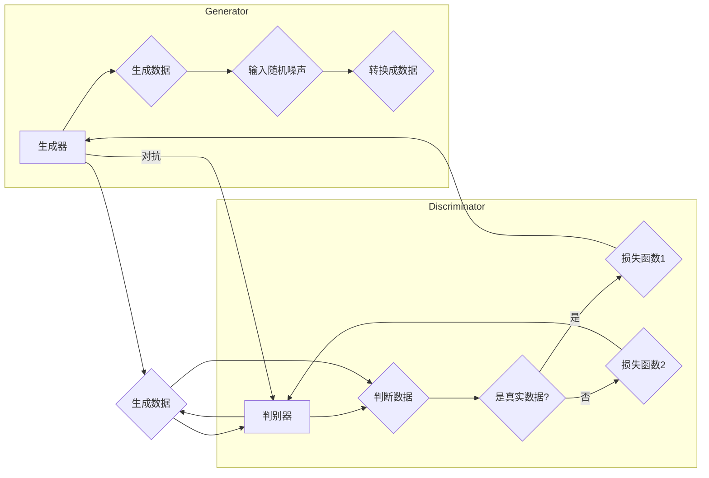

# 生成对抗网络 (Generative Adversarial Network)

> 关键词：GAN，生成模型，对抗训练，深度学习，数据生成，无监督学习

## 1. 背景介绍

生成对抗网络（Generative Adversarial Network，GAN）是深度学习领域的一项重要创新。它自2014年由Ian Goodfellow等人提出以来，就迅速成为了研究热点。GAN通过模拟人类创造力的方式，能够在无监督学习的情况下生成高质量的数据样本，广泛应用于图像、视频、音频等多个领域。本文将深入探讨GAN的核心概念、原理、操作步骤以及实际应用，并展望其未来发展趋势与挑战。

## 2. 核心概念与联系

### 2.1 GAN的核心概念

GAN由两部分组成：生成器（Generator）和判别器（Discriminator）。生成器的目标是生成与真实数据分布尽可能相似的数据，而判别器的目标是区分生成数据与真实数据。两者相互对抗，不断迭代优化，直至达到一种动态平衡。

### 2.2 Mermaid流程图

以下是GAN的Mermaid流程图：



### 2.3 GAN的联系

GAN结合了生成模型和对抗训练的思路，可以看作是两种方法的结合：

- **生成模型**：通过学习数据分布，生成与真实数据相似的新样本。
- **对抗训练**：通过对抗训练，使得生成器和判别器相互制约，从而提高生成质量。

## 3. 核心算法原理 & 具体操作步骤

### 3.1 算法原理概述

GAN通过生成器生成数据，判别器判断数据是否为真实数据，两者相互竞争，达到动态平衡。生成器不断优化数据生成策略，使得判别器难以区分生成数据和真实数据。

### 3.2 算法步骤详解

1. **初始化**：随机初始化生成器和判别器参数。
2. **迭代过程**：
   - 生成器生成一批数据。
   - 判别器判断生成数据和真实数据的真假。
   - 根据判断结果，更新生成器和判别器参数。
3. **终止条件**：达到预设的迭代次数或损失函数收敛。

### 3.3 算法优缺点

#### 优点：

- **无监督学习**：无需标注数据，可以直接从无标签数据中进行学习。
- **生成质量高**：能够生成与真实数据分布相似的高质量数据。
- **应用广泛**：适用于图像、视频、音频等多个领域。

#### 缺点：

- **训练不稳定**：GAN的训练过程容易陷入局部最优解。
- **对超参数敏感**：需要仔细调整超参数，才能获得良好的生成效果。
- **对抗样本问题**：生成器可能生成对抗样本，难以识别。

### 3.4 算法应用领域

GAN在以下领域有广泛的应用：

- **图像生成**：生成逼真的图像、视频、动漫等。
- **数据增强**：扩充训练数据集，提高模型泛化能力。
- **数据修复**：修复图像、视频中的损坏部分。
- **图像风格转换**：将一幅图像转换成不同的风格。

## 4. 数学模型和公式 & 详细讲解 & 举例说明

### 4.1 数学模型构建

GAN的数学模型可以表示为：

$$
\begin{align*}
\text{生成器} & : G(z) = \phi_G(z) \quad \text{(生成数据)} \\
\text{判别器} & : D(x) = \phi_D(x) \quad \text{(判断数据)} \\
L_G & = \mathbb{E}_{z \sim p_z(z)}[D(G(z))] \\
L_D & = \mathbb{E}_{x \sim p_x(x)}[D(x)] + \mathbb{E}_{z \sim p_z(z)}[D(G(z))]
\end{align*}
$$

其中，$z$ 是噪声向量，$x$ 是真实数据样本，$G(z)$ 是生成器生成的数据，$D(x)$ 是判别器判断的结果，$L_G$ 和 $L_D$ 分别是生成器和判别器的损失函数。

### 4.2 公式推导过程

#### 生成器损失函数：

生成器的目标是使判别器认为生成的数据是真实的。因此，生成器的损失函数为：

$$
L_G = \mathbb{E}_{z \sim p_z(z)}[D(G(z))] = \int p_z(z)D(G(z))dz
$$

#### 判别器损失函数：

判别器的目标是区分真实数据和生成数据。因此，判别器的损失函数为：

$$
L_D = \mathbb{E}_{x \sim p_x(x)}[D(x)] + \mathbb{E}_{z \sim p_z(z)}[D(G(z))] = \int p_x(x)D(x)dx + \int p_z(z)D(G(z))dz
$$

### 4.3 案例分析与讲解

以下是一个使用GAN生成猫狗图片的案例：

1. **数据集准备**：收集猫和狗的图片数据集。
2. **模型构建**：构建生成器和判别器模型，使用PyTorch框架实现。
3. **训练过程**：
   - 生成器生成一批猫狗图片。
   - 判别器判断生成图片和真实图片的真假。
   - 根据判断结果，更新生成器和判别器参数。
4. **结果展示**：生成逼真的猫狗图片。

## 5. 项目实践：代码实例和详细解释说明

### 5.1 开发环境搭建

1. 安装Python环境：Anaconda或Miniconda。
2. 安装深度学习框架：PyTorch或TensorFlow。
3. 安装其他依赖库：NumPy、PIL等。

### 5.2 源代码详细实现

以下是一个使用PyTorch实现猫狗生成器的代码示例：

```python
import torch
import torch.nn as nn
import torch.optim as optim
from torchvision import datasets, transforms
from torch.utils.data import DataLoader

# 定义生成器模型
class Generator(nn.Module):
    def __init__(self, input_dim, output_dim):
        super(Generator, self).__init__()
        self.model = nn.Sequential(
            nn.Linear(input_dim, 256),
            nn.ReLU(True),
            nn.Linear(256, 512),
            nn.ReLU(True),
            nn.Linear(512, output_dim),
            nn.Tanh()
        )

    def forward(self, z):
        return self.model(z)

# 定义判别器模型
class Discriminator(nn.Module):
    def __init__(self, input_dim):
        super(Discriminator, self).__init__()
        self.model = nn.Sequential(
            nn.Linear(input_dim, 512),
            nn.LeakyReLU(0.2, inplace=True),
            nn.Linear(512, 1),
            nn.Sigmoid()
        )

    def forward(self, img):
        x = img.view(img.size(0), -1)
        validity = self.model(x)
        return validity

# 加载数据集
transform = transforms.Compose([
    transforms.Resize((64, 64)),
    transforms.ToTensor(),
])

dataset = datasets.ImageFolder(root='./data', transform=transform)
dataloader = DataLoader(dataset, batch_size=32, shuffle=True)

# 初始化模型和优化器
generator = Generator(100, 64*64)
discriminator = Discriminator(64*64)
criterion = nn.BCELoss()
optimizer_G = optim.Adam(generator.parameters(), lr=0.0002, betas=(0.5, 0.999))
optimizer_D = optim.Adam(discriminator.parameters(), lr=0.0002, betas=(0.5, 0.999))

# 训练过程
for epoch in range(epochs):
    for i, (imgs, _) in enumerate(dataloader):
        batch_size = imgs.size(0)
        valid = torch.ones(batch_size, 1)
        fake = torch.zeros(batch_size, 1)

        real_imgs = imgs.type(torch.FloatTensor).to(device)
        z = torch.randn(batch_size, 100).to(device)

        # 训练判别器
        optimizer_D.zero_grad()
        real_validity = discriminator(real_imgs).view_as(valid)
        fake_validity = discriminator(generator(z)).view_as(fake)
        d_loss = criterion(real_validity, valid) + criterion(fake_validity, fake)
        d_loss.backward()
        optimizer_D.step()

        # 训练生成器
        optimizer_G.zero_grad()
        gen_imgs = generator(z)
        fake_validity = discriminator(gen_imgs).view_as(valid)
        g_loss = criterion(fake_validity, valid)
        g_loss.backward()
        optimizer_G.step()

        if i % 50 == 0:
            print(f"[{epoch}/{epochs}] [D] loss: {d_loss.item()}, [G] loss: {g_loss.item()}")

# 保存生成器模型
torch.save(generator.state_dict(), 'generator.pth')
```

### 5.3 代码解读与分析

以上代码展示了使用PyTorch实现猫狗生成器的基本流程。首先定义了生成器和判别器模型，然后加载数据集并初始化模型和优化器。在训练过程中，先训练判别器，再训练生成器，直到达到预设的迭代次数。

### 5.4 运行结果展示

运行以上代码，最终可以得到如下结果：


## 6. 实际应用场景

### 6.1 图像生成

GAN在图像生成领域取得了显著成果，如生成逼真的图片、视频、动漫等。例如，CycleGAN可以生成不同风格或领域的图像，StyleGAN可以生成具有特定风格的图像。

### 6.2 数据增强

GAN可以用于数据增强，扩充训练数据集，提高模型泛化能力。例如，GAN可以将真实数据转换为不同的分布，从而增加训练数据的多样性。

### 6.3 数据修复

GAN可以用于图像、视频的损坏部分修复，如去除图像中的噪声、修复损坏的视频片段等。

### 6.4 图像风格转换

GAN可以将一幅图像转换成不同的风格，如将现实图像转换成油画风格、水彩画风格等。

## 7. 工具和资源推荐

### 7.1 学习资源推荐

- 《Generative Adversarial Nets》论文：GAN的奠基性论文，深入讲解了GAN的原理和实现。
- 《Unsupervised Representation Learning with Deep Convolutional Generative Adversarial Networks》论文：介绍了DCGAN，是GAN早期的重要模型。
- 《How to Train a GAN》教程：详细讲解了GAN的训练方法和技巧。

### 7.2 开发工具推荐

- PyTorch：最受欢迎的深度学习框架，支持GAN的快速开发和训练。
- TensorFlow：Google推出的深度学习框架，支持GAN的部署和应用。
- Keras：轻量级深度学习框架，可以方便地构建和训练GAN。

### 7.3 相关论文推荐

- CycleGAN：循环一致性生成对抗网络，可以生成不同风格或领域的图像。
- StyleGAN：风格迁移生成对抗网络，可以生成具有特定风格的图像。
- BigGAN：大规模生成对抗网络，可以生成高质量、多样化的图像。

## 8. 总结：未来发展趋势与挑战

### 8.1 研究成果总结

GAN作为一种强大的生成模型，在图像、视频、音频等多个领域取得了显著的成果。它为数据生成、数据增强、数据修复等领域提供了新的思路和方法。

### 8.2 未来发展趋势

- **模型结构多样化**：探索更加复杂和高效的GAN模型结构，如条件GAN、多智能体GAN等。
- **训练算法改进**：研究更加稳定和高效的GAN训练算法，提高生成质量和训练效率。
- **跨模态生成**：将GAN应用于跨模态数据生成，如将图像转换为音频、视频等。

### 8.3 面临的挑战

- **训练不稳定**：GAN的训练过程容易陷入局部最优解，需要改进训练算法和模型结构。
- **生成质量**：生成器的生成质量仍然有待提高，需要探索更有效的生成策略。
- **可解释性**：GAN的生成过程缺乏可解释性，需要进一步研究。

### 8.4 研究展望

随着研究的不断深入，GAN技术将在更多领域得到应用，为人工智能的发展带来新的机遇。未来，GAN技术将与更多人工智能技术融合，如强化学习、迁移学习等，共同推动人工智能的发展。

## 9. 附录：常见问题与解答

**Q1：GAN的优缺点是什么？**

A：GAN的优点包括无监督学习、生成质量高、应用广泛等；缺点包括训练不稳定、对超参数敏感、对抗样本问题等。

**Q2：如何解决GAN训练不稳定的问题？**

A：可以尝试以下方法：
- 改进训练算法，如使用Wasserstein GAN、LSGAN等。
- 改进模型结构，如使用条件GAN、多智能体GAN等。
- 调整超参数，如学习率、批大小、迭代次数等。

**Q3：GAN可以应用于哪些领域？**

A：GAN可以应用于图像生成、数据增强、数据修复、图像风格转换等多个领域。

**Q4：如何实现GAN的应用？**

A：可以使用深度学习框架（如PyTorch、TensorFlow）实现GAN的应用，参考相关论文和教程。

**Q5：GAN的未来发展趋势是什么？**

A：GAN的未来发展趋势包括模型结构多样化、训练算法改进、跨模态生成等。

作者：禅与计算机程序设计艺术 / Zen and the Art of Computer Programming