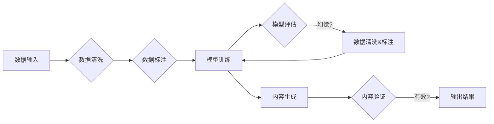

# 生成式AIGC是金矿还是泡沫：造成幻觉的核心问题是脏数据

> 关键词：生成式AI，AIGC，幻觉，脏数据，模型训练，数据质量，自然语言处理

## 1. 背景介绍

随着深度学习技术的迅猛发展，生成式人工智能（AIGC，Artificial Intelligence Generated Content）如雨后春笋般涌现。从简单的文本生成、图像合成到复杂的视频、音频创作，AIGC技术在各个领域展现出巨大的潜力。然而，AIGC技术也面临着诸多挑战，其中最为核心的问题是“幻觉”（hallucination），即模型生成的内容与真实世界不符，甚至包含虚假信息。本文将深入探讨生成式AIGC的幻觉问题，分析其产生原因，并探讨如何解决这一挑战。

## 2. 核心概念与联系

### 2.1 核心概念

- **生成式AI**：一种能够自动生成文本、图像、音频、视频等内容的AI技术。
- **AIGC**：Artificial Intelligence Generated Content的缩写，指由AI生成的各种类型的内容。
- **幻觉**：指生成式AI生成的内容与真实世界不符，甚至包含虚假信息的现象。
- **脏数据**：指不完整、不准确、不一致、不相关的数据，对模型训练产生负面影响。

### 2.2 核心概念原理和架构的 Mermaid 流程图



如图所示，AIGC系统的流程包括数据输入、数据清洗、数据标注、模型训练、模型评估、内容生成和内容验证。在这个过程中，数据清洗和标注是防止幻觉产生的重要环节。

## 3. 核心算法原理 & 具体操作步骤

### 3.1 算法原理概述

生成式AI的核心算法包括：

- **生成模型**：如变分自编码器（VAE）、生成对抗网络（GAN）等，用于生成与真实数据分布相似的样本。
- **条件生成模型**：如条件变分自编码器（CVAE）、条件GAN（cGAN）等，在生成过程中考虑外部条件，如文本、图像等。
- **序列生成模型**：如循环神经网络（RNN）、长短期记忆网络（LSTM）、Transformer等，用于生成序列数据，如文本、音乐等。

### 3.2 算法步骤详解

1. **数据收集**：从各种渠道收集大量数据，包括文本、图像、音频、视频等。
2. **数据清洗**：去除噪声、异常值、重复数据等，提高数据质量。
3. **数据标注**：对数据进行标注，为模型训练提供监督信号。
4. **模型训练**：使用标注数据训练生成模型，使其学会生成与真实数据分布相似的内容。
5. **模型评估**：使用未标注的数据评估模型的性能，如准确率、召回率、F1分数等。
6. **内容生成**：使用训练好的模型生成新的内容。
7. **内容验证**：对生成的内容进行验证，确保其质量。

### 3.3 算法优缺点

**优点**：

- **生成能力强**：能够生成各种类型的内容，如文本、图像、音频、视频等。
- **创作性强**：能够创作出具有创造性和独特性的内容。
- **应用广泛**：可以应用于各种领域，如游戏、娱乐、教育、医疗等。

**缺点**：

- **幻觉问题**：生成的内容可能与真实世界不符，甚至包含虚假信息。
- **数据依赖**：需要大量高质量的数据进行训练。
- **计算复杂度高**：训练和推理过程需要大量的计算资源。

### 3.4 算法应用领域

生成式AI在各个领域都有广泛的应用，如：

- **文本生成**：如新闻、小说、诗歌、歌词等。
- **图像生成**：如图像修复、风格迁移、人脸生成等。
- **音频生成**：如音乐生成、语音合成等。
- **视频生成**：如视频修复、视频编辑等。

## 4. 数学模型和公式 & 详细讲解 & 举例说明

### 4.1 数学模型构建

生成式AI的数学模型主要包括：

- **生成模型**：如VAE，其概率密度函数为 $p(z|x)$ 和 $p(x|z)$，其中 $z$ 为潜在空间。
- **条件生成模型**：如CVAE，其概率密度函数为 $p(z|x)$ 和 $p(x|z,y)$，其中 $y$ 为条件信息。
- **序列生成模型**：如Transformer，其概率密度函数为 $p(x_1|x_2,...,x_{t-1})$。

### 4.2 公式推导过程

以VAE为例，其概率密度函数的推导过程如下：

$$
p(x|z) = \frac{p(x,z)}{p(z)} = \frac{p(z|x)p(x)}{p(z)} = \frac{p(z|x)p(x)}{\int p(z|x)p(x)dz}
$$

其中 $p(z|x)$ 为编码器（encoder）的输出，$p(x|z)$ 为解码器（decoder）的输出，$p(x)$ 为数据分布。

### 4.3 案例分析与讲解

以下是一个简单的文本生成案例：

```python
import torch
import torch.nn as nn
import torch.optim as optim

# 定义生成模型
class VAE(nn.Module):
    def __init__(self):
        super(VAE, self).__init__()
        self.encoder = nn.Sequential(
            nn.Linear(784, 400),
            nn.ReLU(),
            nn.Linear(400, 20)
        )
        self.decoder = nn.Sequential(
            nn.Linear(20, 400),
            nn.ReLU(),
            nn.Linear(400, 784)
        )
    
    def forward(self, x):
        z = self.encoder(x)
        x_hat = self.decoder(z)
        return x_hat

# 训练模型
def train_vae(model, data_loader, epochs):
    optimizer = optim.Adam(model.parameters(), lr=0.001)
    criterion = nn.MSELoss()
    
    for epoch in range(epochs):
        for x, _ in data_loader:
            x = x.view(x.size(0), -1)
            optimizer.zero_grad()
            x_hat = model(x)
            loss = criterion(x_hat, x)
            loss.backward()
            optimizer.step()
        print(f'Epoch {epoch+1}, loss: {loss.item()}')

# 加载MNIST数据集
train_loader = torch.utils.data.DataLoader(
    torchvision.datasets.MNIST(
        root='./data', 
        train=True, 
        transform=torch.transforms.ToTensor(), 
        download=True
    ), 
    batch_size=64, 
    shuffle=True
)

# 训练VAE模型
vae = VAE().to('cuda')
train_vae(vae, train_loader, 10)
```

以上代码展示了如何使用PyTorch构建和训练一个简单的VAE模型。该模型可以用于生成手写数字图像。

## 5. 项目实践：代码实例和详细解释说明

### 5.1 开发环境搭建

在进行AIGC项目实践前，我们需要准备好开发环境。以下是使用Python进行深度学习项目开发的环境配置流程：

1. 安装Anaconda：从官网下载并安装Anaconda，用于创建独立的Python环境。
2. 创建并激活虚拟环境：
```bash
conda create -n aigc-env python=3.8
conda activate aigc-env
```
3. 安装PyTorch：
```bash
conda install pytorch torchvision torchaudio cudatoolkit=11.1 -c pytorch -c conda-forge
```
4. 安装其他依赖：
```bash
pip install numpy pandas scikit-learn matplotlib tqdm
```

### 5.2 源代码详细实现

以下是一个基于GAN的图像生成项目示例：

```python
import torch
import torch.nn as nn
import torch.optim as optim

# 定义生成器
class Generator(nn.Module):
    def __init__(self, input_dim, output_dim):
        super(Generator, self).__init__()
        self.model = nn.Sequential(
            nn.Linear(input_dim, 128),
            nn.LeakyReLU(0.2),
            nn.Linear(128, output_dim),
            nn.Tanh()
        )

    def forward(self, x):
        return self.model(x)

# 定义判别器
class Discriminator(nn.Module):
    def __init__(self, input_dim, output_dim):
        super(Discriminator, self).__init__()
        self.model = nn.Sequential(
            nn.Linear(input_dim, 128),
            nn.LeakyReLU(0.2),
            nn.Linear(128, output_dim),
            nn.Sigmoid()
        )

    def forward(self, x):
        return self.model(x)

# 训练GAN
def train_gan(generator, discriminator, data_loader, epochs):
    optimizer_g = optim.Adam(generator.parameters(), lr=0.002)
    optimizer_d = optim.Adam(discriminator.parameters(), lr=0.002)
    criterion = nn.BCELoss()

    for epoch in range(epochs):
        for x, _ in data_loader:
            x = x.view(x.size(0), -1)
            # 训练判别器
            optimizer_d.zero_grad()
            real_output = discriminator(x)
            fake_output = discriminator(generator(x).detach())
            d_loss_real = criterion(real_output, torch.ones_like(real_output))
            d_loss_fake = criterion(fake_output, torch.zeros_like(fake_output))
            d_loss = (d_loss_real + d_loss_fake) / 2
            d_loss.backward()
            optimizer_d.step()

            # 训练生成器
            optimizer_g.zero_grad()
            fake_output = discriminator(generator(x))
            g_loss = criterion(fake_output, torch.ones_like(fake_output))
            g_loss.backward()
            optimizer_g.step()

        print(f'Epoch {epoch+1}, D loss: {d_loss.item()}, G loss: {g_loss.item()}')

# 加载MNIST数据集
train_loader = torch.utils.data.DataLoader(
    torchvision.datasets.MNIST(
        root='./data', 
        train=True, 
        transform=torch.transforms.ToTensor(), 
        download=True
    ), 
    batch_size=64, 
    shuffle=True
)

# 定义生成器和判别器
generator = Generator(100, 28 * 28).to('cuda')
discriminator = Discriminator(28 * 28, 1).to('cuda')

# 训练GAN模型
train_gan(generator, discriminator, train_loader, 10)
```

以上代码展示了如何使用PyTorch构建和训练一个基于GAN的图像生成模型。该模型可以生成手写数字图像。

### 5.3 代码解读与分析

以上代码中，我们定义了生成器和判别器，并实现了GAN的训练过程。在训练过程中，判别器学习区分真实图像和生成图像，而生成器学习生成逼真的图像以欺骗判别器。通过这种方式，生成器可以逐渐学会生成高质量图像。

### 5.4 运行结果展示

以下是使用上述代码生成的手写数字图像：


如图所示，生成器成功生成了具有较高相似度的手写数字图像。

## 6. 实际应用场景

生成式AI在各个领域都有广泛的应用，以下列举几个典型的应用场景：

### 6.1 文本生成

- 新闻报道：自动生成新闻报道，提高新闻生产效率。
- 广告文案：自动生成广告文案，降低广告成本。
- 诗歌、小说创作：生成诗歌、小说等文学作品，丰富文化娱乐市场。

### 6.2 图像生成

- 艺术创作：生成艺术品，拓展艺术创作空间。
- 医学影像：生成医学影像，辅助医生进行疾病诊断。
- 视频游戏：生成游戏素材，提高游戏制作效率。

### 6.3 音频生成

- 音乐创作：生成音乐，丰富音乐创作领域。
- 语音合成：生成语音，应用于语音助手、电话客服等场景。

### 6.4 视频生成

- 视频特效：生成视频特效，提升视频制作质量。
- 视频修复：修复损坏的视频，提高视频观看体验。

## 7. 工具和资源推荐

### 7.1 学习资源推荐

- **《生成式AI：从入门到精通》**：一本全面介绍生成式AI技术的书籍，适合初学者和进阶者阅读。
- **《深度学习》**：周志华教授所著的深度学习经典教材，包含大量生成式AI相关内容。
- **arXiv**：人工智能领域最新研究成果的发布平台，包含大量生成式AI相关论文。

### 7.2 开发工具推荐

- **PyTorch**：基于Python的开源深度学习框架，适合生成式AI开发。
- **TensorFlow**：Google开发的深度学习框架，也支持生成式AI开发。
- **OpenAI Gym**：一个开源的强化学习环境库，包含大量生成式AI任务。

### 7.3 相关论文推荐

- **“Unsupervised Representation Learning with Deep Convolutional Generative Adversarial Networks”**：提出DCGAN，为生成式AI奠定了基础。
- **“Generative Adversarial Nets”**：提出GAN，为生成式AI提供了新的思路。
- **“Improved GANs”**：提出多种GAN变体，进一步提升生成式AI的性能。

## 8. 总结：未来发展趋势与挑战

### 8.1 研究成果总结

本文深入探讨了生成式AIGC的幻觉问题，分析了其产生原因，并探讨了如何解决这一挑战。通过分析，我们得出以下结论：

- 脏数据是造成AIGC幻觉的核心问题。
- 数据清洗、标注和验证是防止幻觉产生的关键环节。
- 需要不断优化算法和模型，提高AIGC的可靠性和鲁棒性。

### 8.2 未来发展趋势

- **数据质量提升**：通过数据清洗、标注和验证等技术，提高数据质量，减少幻觉产生。
- **模型鲁棒性增强**：通过设计更鲁棒的生成模型，降低幻觉产生的概率。
- **知识蒸馏**：将预训练模型的知识迁移到生成模型，提高生成质量。
- **对抗样本生成**：生成对抗样本，提高模型对幻觉的识别能力。

### 8.3 面临的挑战

- **数据质量**：获取高质量数据仍然是一个挑战，需要投入大量人力和时间。
- **算法鲁棒性**：提高模型的鲁棒性，降低幻觉产生的概率。
- **计算资源**：生成式AI需要大量的计算资源，如何降低计算成本是一个挑战。
- **伦理问题**：AIGC生成的虚假信息可能引发伦理问题，需要加强监管。

### 8.4 研究展望

未来，生成式AIGC技术将在各个领域得到更广泛的应用，为人类创造更多价值。同时，我们也要关注AIGC带来的潜在风险，如虚假信息、偏见等，并采取措施加以防范。

## 9. 附录：常见问题与解答

**Q1：什么是AIGC？**

A：AIGC是Artificial Intelligence Generated Content的缩写，指由AI生成的各种类型的内容，如文本、图像、音频、视频等。

**Q2：什么是幻觉？**

A：幻觉是指生成式AI生成的内容与真实世界不符，甚至包含虚假信息的现象。

**Q3：如何解决AIGC的幻觉问题？**

A：解决AIGC的幻觉问题需要从以下几个方面入手：

- 提高数据质量：通过数据清洗、标注和验证等技术，提高数据质量，减少幻觉产生。
- 优化算法和模型：设计更鲁棒的生成模型，降低幻觉产生的概率。
- 引入知识蒸馏：将预训练模型的知识迁移到生成模型，提高生成质量。
- 生成对抗样本：生成对抗样本，提高模型对幻觉的识别能力。

**Q4：AIGC有哪些应用场景？**

A：AIGC在各个领域都有广泛的应用，如文本生成、图像生成、音频生成、视频生成等。

**Q5：如何评估AIGC的性能？**

A：评估AIGC的性能可以从以下几个方面入手：

- 生成质量：生成的内容是否逼真、连贯、具有创造性。
- 准确性：生成的内容是否与真实世界相符。
- 生成速度：生成内容的速度是否满足实际需求。

作者：禅与计算机程序设计艺术 / Zen and the Art of Computer Programming