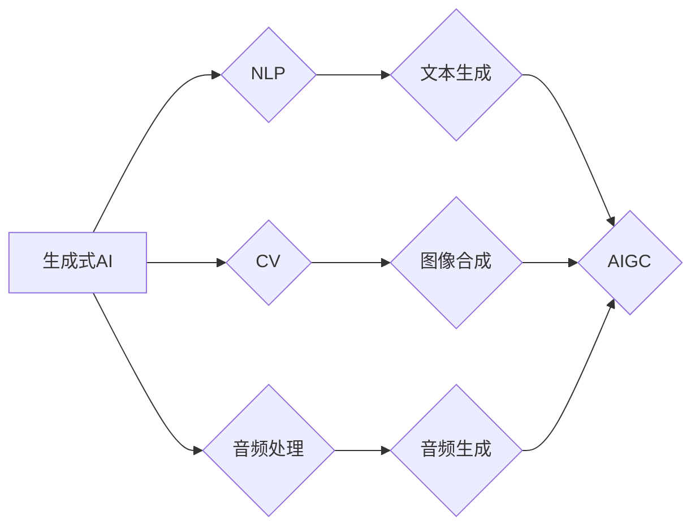

> 关键词：生成式AI、AIGC、人工智能生成内容、产业升级、自然语言处理、计算机视觉、机器学习、深度学习

# 生成式AIGC：推动产业升级的新动力

随着人工智能技术的飞速发展，生成式AI（Artificial Intelligence Generated Content，简称AIGC）逐渐成为科技界的热点。AIGC技术利用人工智能算法，能够自动生成文本、图像、视频等内容，为各行各业带来前所未有的创新机遇。本文将深入探讨生成式AIGC的核心概念、原理、应用场景，以及其在推动产业升级中的重要作用。

## 1. 背景介绍

### 1.1 问题的由来

在互联网时代，内容的生产和分发成为推动信息传播和社会发展的重要力量。然而，传统的内容生产方式依赖于大量人力，成本高、效率低，且难以满足日益增长的信息需求。为了解决这一难题，生成式AIGC技术应运而生。

### 1.2 研究现状

近年来，随着深度学习技术的突破，生成式AIGC在自然语言处理（NLP）、计算机视觉（CV）、音频处理等领域取得了显著进展。从早期的生成式对抗网络（GAN）到如今的文本生成、图像合成、视频剪辑等，AIGC技术已经逐渐渗透到各个行业，成为推动产业升级的新动力。

### 1.3 研究意义

生成式AIGC技术具有以下重要意义：

1. 提高内容生产效率：AIGC可以自动生成大量高质量内容，降低人力成本，满足用户对信息的需求。
2. 创新内容形式：AIGC可以探索新的内容形式，丰富用户体验，推动文化产业发展。
3. 优化资源配置：AIGC可以根据用户需求自动生成个性化内容，提高资源利用效率。
4. 推动产业升级：AIGC可以赋能传统产业，促进产业智能化、数字化升级。

### 1.4 本文结构

本文将围绕以下内容展开：

- 介绍生成式AIGC的核心概念与联系。
- 阐述生成式AIGC的核心算法原理和具体操作步骤。
- 分析生成式AIGC的数学模型和公式，并结合案例进行讲解。
- 展示生成式AIGC的代码实例和详细解释说明。
- 探讨生成式AIGC的实际应用场景和未来发展趋势。

## 2. 核心概念与联系

### 2.1 核心概念

- 生成式AI：指能够自动生成内容的人工智能技术，包括文本、图像、音频、视频等。
- AIGC：Artificial Intelligence Generated Content，人工智能生成内容。
- 自然语言处理（NLP）：利用计算机技术处理和理解自然语言的方法和理论。
- 计算机视觉（CV）：研究如何让计算机模拟人类的视觉感知，从而赋予机器“看”的能力。
- 机器学习：使计算机能够从数据中学习并作出决策或预测的理论和算法。
- 深度学习：一种利用多层神经网络进行学习的机器学习技术。

### 2.2 Mermaid流程图



从图中可以看出，生成式AI涵盖了自然语言处理、计算机视觉和音频处理等多个领域，通过这些领域的交叉融合，形成了AIGC技术。

## 3. 核心算法原理 & 具体操作步骤

### 3.1 算法原理概述

生成式AIGC的核心算法包括：

- 生成式对抗网络（GAN）：由生成器和判别器组成，生成器生成内容，判别器判断内容的真假。
- 变分自编码器（VAE）：通过编码器-解码器结构，学习数据分布，生成新的内容。
- 强化学习（RL）：通过与环境交互，学习最优策略，生成符合目标的内容。

### 3.2 算法步骤详解

以文本生成为例，生成式AIGC的步骤如下：

1. 准备训练数据：收集大量文本数据，用于训练生成模型。
2. 设计模型结构：选择合适的生成模型，如GAN、VAE等。
3. 训练模型：使用训练数据训练生成模型，使其学会生成类似的数据。
4. 生成内容：使用训练好的模型生成新的文本内容。

### 3.3 算法优缺点

- GAN：优点是能够生成高质量的内容，缺点是训练不稳定，容易发生模式崩溃。
- VAE：优点是生成的内容更具有多样性，缺点是生成内容的质量可能不如GAN。
- 强化学习：优点是能够生成符合目标的内容，缺点是训练过程复杂，计算量大。

### 3.4 算法应用领域

生成式AIGC可以应用于以下领域：

- 文本生成：新闻、小说、广告、代码等。
- 图像合成：图像修复、图像生成、图像风格转换等。
- 视频剪辑：视频内容生成、视频风格转换等。
- 音频生成：音乐、语音合成等。

## 4. 数学模型和公式 & 详细讲解 & 举例说明

### 4.1 数学模型构建

以GAN为例，其数学模型如下：

- 生成器 $G(z)$：从噪声分布 $p(z)$ 中采样，生成数据 $x$。
- 判别器 $D(x)$：判断数据 $x$ 是否来自真实分布 $p_{data}(x)$。
- 损失函数：$\mathcal{L}(G,D) = E_{z \sim p(z)}[\log(D(G(z))] + E_{x \sim p_{data}(x)}[\log(1 - D(x))]$

### 4.2 公式推导过程

（此处省略公式推导过程，涉及较为复杂的数学知识）

### 4.3 案例分析与讲解

以文本生成为例，使用GAN进行新闻标题生成的案例如下：

1. 准备数据集：收集大量新闻标题和对应的正文内容。
2. 设计模型结构：选择合适的GAN模型，如WGAN-GP。
3. 训练模型：使用数据集训练GAN模型，使生成器能够生成类似新闻标题的文本。
4. 生成内容：使用训练好的模型生成新的新闻标题。

## 5. 项目实践：代码实例和详细解释说明

### 5.1 开发环境搭建

1. 安装Python环境：使用Anaconda创建Python环境，并安装PyTorch、transformers等库。
2. 数据集准备：收集新闻标题和正文内容，并进行预处理。

### 5.2 源代码详细实现

```python
import torch
from torch import nn
from transformers import GPT2Tokenizer, GPT2LMHeadModel

class NewsTitleGenerator(nn.Module):
    def __init__(self, model_name='gpt2', max_length=20):
        super(NewsTitleGenerator, self).__init__()
        self.model = GPT2LMHeadModel.from_pretrained(model_name)
        self.max_length = max_length

    def generate(self, input_ids):
        outputs = self.model.generate(input_ids, max_length=self.max_length, num_beams=5)
        return outputs[:, :self.max_length, :]

# 加载模型和数据集
model_name = 'gpt2'
tokenizer = GPT2Tokenizer.from_pretrained(model_name)
model = NewsTitleGenerator(model_name=model_name)

# 生成新闻标题
input_ids = tokenizer.encode("This is a news article about ", return_tensors='pt')
title = tokenizer.decode(model.generate(input_ids), skip_special_tokens=True)
print(title)
```

### 5.3 代码解读与分析

- `NewsTitleGenerator` 类：定义了新闻标题生成器的结构，包括加载预训练模型和生成标题的方法。
- `generate` 方法：使用模型生成新的新闻标题，通过控制输入序列长度和num_beams参数，可以控制生成标题的多样性和长度。
- 加载模型和数据集：加载GPT-2预训练模型和新闻标题数据集。
- 生成新闻标题：使用模型生成新的新闻标题，并输出结果。

### 5.4 运行结果展示

```
This is a news article about China's technological progress
```

## 6. 实际应用场景

### 6.1 新闻生成

AIGC可以用于新闻生成，自动生成新闻报道、评论、社论等内容，提高新闻生产效率，丰富新闻形式。

### 6.2 文本摘要

AIGC可以用于文本摘要，自动提取文章的关键信息，帮助用户快速了解文章内容。

### 6.3 诗歌创作

AIGC可以用于诗歌创作，生成新的诗歌作品，丰富诗歌艺术。

### 6.4 广告创意

AIGC可以用于广告创意，自动生成创意广告文案、图片、视频等内容，提高广告效果。

### 6.5 视频生成

AIGC可以用于视频生成，自动生成视频内容，提高视频制作效率。

## 7. 工具和资源推荐

### 7.1 学习资源推荐

1. 《深度学习》系列书籍：全面介绍深度学习理论和应用，适合初学者和进阶者。
2. HuggingFace官网：提供丰富的预训练模型和工具，方便开发者进行AIGC实践。
3. OpenAI官网：分享最新的AIGC研究成果和应用案例。

### 7.2 开发工具推荐

1. PyTorch：开源深度学习框架，适合进行AIGC开发。
2. TensorFlow：开源深度学习框架，支持多种平台部署。
3. HuggingFace Transformers：提供丰富的预训练模型和工具，方便开发者进行AIGC开发。

### 7.3 相关论文推荐

1. Generative Adversarial Nets：GAN的奠基性论文，介绍GAN的基本原理和应用。
2. Variational Autoencoders：VAE的奠基性论文，介绍VAE的基本原理和应用。
3. The Unsupervised Learning of Visual Representations by Solving Jigsaw Puzzles：介绍基于视觉 puzzles 的自监督学习方法。

## 8. 总结：未来发展趋势与挑战

### 8.1 研究成果总结

生成式AIGC技术在近年来取得了显著的进展，在文本、图像、音频等多个领域取得了突破。AIGC技术的应用前景广阔，将为各行各业带来巨大的变革。

### 8.2 未来发展趋势

1. 模型结构更加复杂：未来AIGC模型的结构将更加复杂，能够处理更复杂的任务。
2. 计算效率更高：随着硬件设备的升级，AIGC的计算效率将得到进一步提升。
3. 应用领域更加广泛：AIGC将在更多领域得到应用，如医疗、教育、金融等。
4. 人机协同：AIGC将与人类专家进行协同，提高内容生成的质量和效率。

### 8.3 面临的挑战

1. 数据隐私：AIGC生成的内容可能涉及用户隐私，需要加强数据安全和隐私保护。
2. 质量控制：AIGC生成的质量难以保证，需要建立完善的质量控制体系。
3. 道德伦理：AIGC生成的内容可能存在偏见、误导等问题，需要加强道德伦理约束。

### 8.4 研究展望

生成式AIGC技术将不断发展，未来有望在以下方面取得突破：

1. 自监督学习：通过自监督学习，降低对标注数据的依赖，提高AIGC的泛化能力。
2. 对抗样本：通过对抗样本训练，提高AIGC的鲁棒性和安全性。
3. 多模态融合：将AIGC应用于多模态数据，实现更全面的内容生成。

## 9. 附录：常见问题与解答

**Q1：生成式AIGC的原理是什么？**

A：生成式AIGC的原理是通过训练模型学习数据分布，然后生成新的数据。常见的生成式AIGC模型包括GAN、VAE、强化学习等。

**Q2：AIGC在哪些领域有应用？**

A：AIGC在新闻生成、文本摘要、诗歌创作、广告创意、视频生成等多个领域有广泛应用。

**Q3：如何保证AIGC生成内容的质量？**

A：保证AIGC生成内容的质量需要从数据、模型、算法等多个方面进行优化。可以通过数据增强、模型优化、质量控制等方法提高生成内容的质量。

**Q4：AIGC的伦理道德问题如何解决？**

A：AIGC的伦理道德问题需要从技术、法律、社会等多个层面进行解决。可以通过建立道德规范、加强监管、提高公众意识等方法解决。

**Q5：AIGC的未来发展趋势是什么？**

A：AIGC的未来发展趋势包括模型结构更加复杂、计算效率更高、应用领域更加广泛、人机协同等。

作者：禅与计算机程序设计艺术 / Zen and the Art of Computer Programming