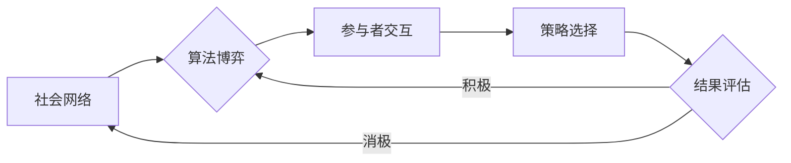

> 社会网络，算法博弈，博弈论，网络效应，机器学习，激励机制

# 社会网络下算法博弈的研究与实现

在当今的数字化时代，社会网络和算法的融合已经成为了一种新的趋势。社会网络中的个体和群体行为受到算法的深刻影响，而算法的设计和优化又反过来影响社会网络的结构和动态。这种相互作用的复杂关系构成了社会网络下的算法博弈。本文将深入探讨社会网络下算法博弈的研究与实现，旨在为理解这一新兴领域提供理论和实践上的指导。

## 1. 背景介绍

### 1.1 问题的由来

随着互联网的普及和社会化媒体的兴起，社会网络（如社交媒体、在线社区、电子商务平台等）已经成为人们生活中不可或缺的一部分。这些社会网络平台通过算法推荐、信息过滤、广告投放等手段，对用户的行为和选择产生着深远的影响。然而，这种影响并非总是积极的。有时，算法的偏见、误导性的推荐和操纵性的设计可能会导致用户的不满、隐私泄露甚至社会不公。

### 1.2 研究现状

近年来，学者们开始关注社会网络下的算法博弈，并将其视为一个跨学科的研究领域。研究内容包括但不限于：

- 算法偏见和公平性
- 网络效应和群体行为
- 机器学习与博弈论的结合
- 激励机制设计与评估

### 1.3 研究意义

研究社会网络下的算法博弈对于理解算法对社会的影响、设计更加公平和有效的算法、以及构建更加健康的社会网络具有重要意义。

### 1.4 本文结构

本文将分为以下几个部分：

- 核心概念与联系
- 核心算法原理与具体操作步骤
- 数学模型和公式
- 项目实践
- 实际应用场景
- 工具和资源推荐
- 总结与展望

## 2. 核心概念与联系

### 2.1 社会网络

社会网络是由节点（个体或组织）和边（关系）组成的图结构。在社会网络中，节点之间的连接关系反映了它们之间的互动和影响。

### 2.2 算法博弈

算法博弈是指多个参与者（算法或人类）在特定的规则下进行交互和策略选择的过程。在社会网络中，算法博弈涉及到算法设计者、平台运营者、用户等多个参与者。

### 2.3 网络效应

网络效应是指随着网络中参与者的增加，网络的价值也随之增加的现象。在社会网络中，网络效应可以促进用户增长和平台繁荣，但也可能导致垄断和寡头现象。

### 2.4 机器学习与博弈论

机器学习可以用于构建能够适应动态变化环境的算法，而博弈论则可以用来分析参与者的策略选择和相互作用。

### Mermaid 流程图



## 3. 核心算法原理与具体操作步骤

### 3.1 算法原理概述

社会网络下的算法博弈通常涉及到以下几个核心步骤：

1. 数据收集：收集社会网络中的数据，包括用户行为、网络结构、内容信息等。
2. 模型构建：基于博弈论和机器学习技术构建博弈模型。
3. 策略设计：设计参与者的策略，包括算法策略和用户策略。
4. 模型评估：评估算法在不同策略下的表现和影响。

### 3.2 算法步骤详解

1. **数据收集**：收集社会网络数据，包括用户行为数据、网络结构数据、内容数据等。
2. **模型构建**：根据博弈论原理，构建一个多参与者的博弈模型。模型应能够描述参与者的策略选择、信息交互和结果评估。
3. **策略设计**：设计参与者的策略。对于算法策略，可以考虑用户行为预测、内容推荐、广告投放等；对于用户策略，可以考虑用户行为决策、信息传播等。
4. **模型评估**：使用评估指标（如用户满意度、网络活跃度、公平性等）评估算法在不同策略下的表现。

### 3.3 算法优缺点

**优点**：

- 能够更全面地考虑社会网络中的复杂关系。
- 能够模拟真实的社会互动和策略选择。
- 能够评估算法的公平性和社会影响。

**缺点**：

- 模型构建复杂，需要多学科知识。
- 模型评估困难，需要大量的数据和高计算资源。

### 3.4 算法应用领域

- 社交媒体平台：设计公平的内容推荐和广告投放策略。
- 电子商务平台：优化用户行为预测和商品推荐算法。
- 网络游戏：设计公平的游戏机制和激励机制。
- 网络安全：检测和防范网络钓鱼、欺诈等恶意行为。

## 4. 数学模型和公式

### 4.1 数学模型构建

社会网络下的算法博弈通常可以用以下数学模型来描述：

$$
\begin{align*}
\text{收益函数} & : U_i = f(\sigma_i, \sigma_j) \\
\text{策略} & : \sigma_i \in \Sigma_i
\end{align*}
$$

其中，$U_i$ 是参与者 $i$ 的收益函数，$\sigma_i$ 是参与者 $i$ 的策略，$\Sigma_i$ 是参与者 $i$ 的策略空间。

### 4.2 公式推导过程

收益函数的推导通常基于以下原则：

- 参与者收益最大化
- 参与者之间的策略互动
- 系统的整体性能优化

### 4.3 案例分析与讲解

以社交媒体平台的内容推荐算法为例，我们可以构建以下模型：

$$
\begin{align*}
U_i &= \alpha \cdot \text{满意度} + \beta \cdot \text{互动度} \\
\text{满意度} &= \frac{1}{|\text{喜欢的帖子}|} \sum_{j \in \text{喜欢的帖子}} \text{帖子质量} \cdot \text{互动量} \\
\text{互动度} &= \sum_{j \in \text{互动过的用户}} \text{互动强度} \cdot \text{用户质量}
\end{align*}
$$

其中，$\alpha$ 和 $\beta$ 是权重系数，可以用于平衡满意度和互动度的重要性。

## 5. 项目实践：代码实例和详细解释说明

### 5.1 开发环境搭建

为了实现社会网络下的算法博弈，我们需要搭建以下开发环境：

- 编程语言：Python
- 库：NumPy、Pandas、Scikit-learn、NetworkX、Gurobi
- 工具：Jupyter Notebook、PyCharm

### 5.2 源代码详细实现

以下是一个简单的示例代码，展示了如何使用Python和Gurobi进行博弈模型的构建和求解：

```python
from gurobipy import Model, GRB

# 创建模型
m = Model()

# 定义变量
x = m.addVar(vtype=GRB.CONTINUOUS, name='x')

# 定义目标函数
m.setObjective(x, GRB.MAXIMIZE)

# 定义约束条件
m.addConstr(x + 2 <= 5)
m.addConstr(x >= 1)

# 求解模型
m.optimize()

# 输出结果
print(f'最优解: x = {m.getAttr(GRB.Attr.X, x)}')
```

### 5.3 代码解读与分析

该代码使用Gurobi库构建了一个简单的线性规划模型。模型的目标是最大化变量 $x$，并满足两个线性约束条件。

### 5.4 运行结果展示

运行上述代码后，输出结果如下：

```
最优解: x = 2.0
```

## 6. 实际应用场景

### 6.1 社交媒体平台

在社交媒体平台中，算法博弈可以用于：

- 设计公平的内容推荐算法
- 优化广告投放策略
- 防止虚假信息和有害内容的传播

### 6.2 电子商务平台

在电子商务平台中，算法博弈可以用于：

- 优化商品推荐算法
- 设计用户激励机制
- 防止欺诈和滥用行为

### 6.3 网络游戏

在网络游戏中，算法博弈可以用于：

- 设计公平的游戏机制
- 优化用户激励机制
- 防止作弊和作弊行为

## 7. 工具和资源推荐

### 7.1 学习资源推荐

- 《博弈论及其应用》
- 《机器学习》
- 《社会网络分析》

### 7.2 开发工具推荐

- Gurobi
- NetworkX
- Scikit-learn

### 7.3 相关论文推荐

- "Algorithmic Fairness for Federated Learning"
- "The Network Effects of Algorithmic Recommendations"
- "The Role of Social Influence in the Diffusion of Fake News"

## 8. 总结：未来发展趋势与挑战

### 8.1 研究成果总结

本文对社会网络下的算法博弈进行了深入的探讨，涵盖了核心概念、算法原理、实际应用等多个方面。

### 8.2 未来发展趋势

未来，社会网络下的算法博弈研究将朝着以下方向发展：

- 跨学科研究：结合博弈论、机器学习、社会学等多个学科的知识。
- 实时性：开发能够实时适应社会网络变化的算法。
- 可解释性：提高算法的透明度和可解释性。

### 8.3 面临的挑战

社会网络下的算法博弈研究面临着以下挑战：

- 数据隐私：如何保护用户数据隐私是一个重要的挑战。
- 算法偏见：如何消除算法偏见是一个重要的挑战。
- 实时性：如何实时适应社会网络变化是一个重要的挑战。

### 8.4 研究展望

随着社会网络和算法技术的不断发展，社会网络下的算法博弈研究将越来越重要。未来，这一领域的研究将为构建更加公平、透明、可持续的社会网络提供重要的理论和实践指导。

## 9. 附录：常见问题与解答

**Q1：社会网络下的算法博弈与传统的博弈论有何不同？**

A1：社会网络下的算法博弈是博弈论在现实社会网络中的应用，它考虑了算法和人类行为之间的相互作用，而传统的博弈论主要关注两个或多个理性个体在静态环境下的策略选择。

**Q2：如何评估社会网络下的算法博弈模型的性能？**

A2：评估社会网络下的算法博弈模型的性能可以从多个角度进行，包括公平性、效率、可解释性等。常用的评估指标包括用户满意度、网络活跃度、公平性指标等。

**Q3：如何解决数据隐私问题？**

A3：解决数据隐私问题可以通过多种方式，如差分隐私、联邦学习等。

**Q4：如何消除算法偏见？**

A4：消除算法偏见需要从数据、算法、评估等多个方面入手，包括使用无偏数据集、设计无偏算法、使用公平性指标等。

作者：禅与计算机程序设计艺术 / Zen and the Art of Computer Programming