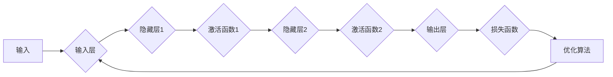

> 神经网络, 深度学习, 机器学习, 人工智能, 计算机视觉, 自然语言处理

# 神经网络：改变世界的技术

## 1. 背景介绍

自20世纪中叶以来，人工智能（AI）的发展经历了多次高潮和低谷。特别是近年来，随着计算能力的提升、大数据的积累以及深度学习技术的突破，AI技术取得了前所未有的进展。其中，神经网络作为深度学习的重要工具，已经在各个领域展现出巨大的潜力，正在悄然改变着我们的世界。

### 1.1 人工智能的兴起与挑战

人工智能的发展经历了三个阶段：第一个阶段是20世纪50年代到70年代的逻辑推理阶段，主要基于逻辑符号和规则进行推理；第二个阶段是20世纪80年代到90年代的专家系统阶段，通过知识库和推理引擎来模拟人类专家的决策过程；第三个阶段是21世纪初至今的深度学习阶段，通过模拟人脑神经元连接的方式，实现了对复杂模式的自动学习。

然而，传统的机器学习方法在处理高维度、非线性、大规模数据时存在诸多局限性，难以达到人类智能的水平。为了解决这些问题，研究者们开始探索模拟人脑神经元连接的神经网络模型，以期在AI领域取得突破。

### 1.2 神经网络的诞生与发展

神经网络的研究始于20世纪40年代，最初由心理学家和数学家共同发起。1958年，美国心理学家弗兰克·罗森布拉特（Frank Rosenblatt）提出了感知器（Perceptron）模型，它是第一个成功的神经网络模型。然而，由于理论上的局限性和计算能力的不足，神经网络在20世纪70年代陷入了低谷。

直到20世纪80年代，反向传播算法的提出为神经网络的复兴奠定了基础。1990年代，随着并行计算和大规模数据集的涌现，神经网络在图像识别、语音识别等领域取得了显著成果。进入21世纪，深度学习技术迅速发展，神经网络在多个领域实现了突破性的应用，成为推动AI发展的关键力量。

## 2. 核心概念与联系

神经网络是一种模拟人脑神经元连接的数学模型，通过学习输入数据中的特征，实现对复杂模式的自动学习和识别。本节将介绍神经网络的核心概念，并给出其原理和架构的Mermaid流程图。

### 2.1 神经网络的核心概念

- **神经元**：神经网络的基本单元，负责接收输入信号、计算输出结果。
- **层**：由多个神经元组成，可以是输入层、隐藏层或输出层。
- **连接**：神经元之间的连接，用于传递信号。
- **激活函数**：对神经元输出进行非线性变换，增加模型的非线性能力。
- **损失函数**：衡量模型预测结果与真实标签之间的差异，用于指导模型优化。
- **优化算法**：根据损失函数对模型参数进行更新，使得模型在训练过程中不断逼近真实标签。

### 2.2 神经网络原理和架构的Mermaid流程图



在上述流程图中，输入数据经过输入层处理后，进入隐藏层进行特征提取。每层神经元通过激活函数处理后，将特征信息传递到下一层。最终，输出层的预测结果与真实标签进行比较，计算损失函数，并通过优化算法更新模型参数。

## 3. 核心算法原理 & 具体操作步骤

### 3.1 算法原理概述

神经网络的核心算法主要包括以下几个方面：

- **前向传播**：将输入数据传递到神经网络的各个层，计算输出结果。
- **反向传播**：根据输出结果和真实标签，计算损失函数，并反向传播梯度，更新模型参数。
- **激活函数**：对神经元的输出进行非线性变换，增加模型的非线性能力。
- **损失函数**：衡量模型预测结果与真实标签之间的差异，用于指导模型优化。
- **优化算法**：根据损失函数对模型参数进行更新，使得模型在训练过程中不断逼近真实标签。

### 3.2 算法步骤详解

以下是神经网络训练过程的详细步骤：

1. 初始化模型参数，包括权重和偏置。
2. 将输入数据输入到输入层，计算每个神经元的输入值。
3. 应用激活函数对每个神经元的输入值进行非线性变换，得到激活值。
4. 将激活值传递到下一层，重复步骤2-3，直到输出层。
5. 计算输出层的预测结果与真实标签之间的损失值。
6. 使用反向传播算法计算损失值对模型参数的梯度。
7. 根据梯度更新模型参数，减小损失值。
8. 重复步骤2-7，直到满足预设的迭代次数或损失值收敛。

### 3.3 算法优缺点

神经网络算法的优点如下：

- **非线性能力**：通过激活函数可以实现非线性变换，更好地拟合复杂数据。
- **并行计算**：神经网络可以并行处理大量数据，提高计算效率。
- **可解释性**：神经网络的结构和参数具有可解释性，便于分析模型的决策过程。

神经网络算法的缺点如下：

- **局部最优**：神经网络训练过程中可能陷入局部最优，导致模型性能不佳。
- **过拟合**：神经网络容易过拟合训练数据，泛化能力较差。
- **参数调优**：神经网络参数调优过程复杂，需要大量实验和经验。

### 3.4 算法应用领域

神经网络在多个领域取得了显著的成果，主要包括：

- **计算机视觉**：图像识别、目标检测、图像分割等。
- **语音识别**：语音识别、语音合成、语音翻译等。
- **自然语言处理**：文本分类、机器翻译、情感分析等。
- **推荐系统**：个性化推荐、协同过滤等。
- **医疗诊断**：疾病预测、药物发现等。

## 4. 数学模型和公式 & 详细讲解 & 举例说明

### 4.1 数学模型构建

神经网络的数学模型主要基于以下公式：

$$
z^{[l]} = \sigma(W^{[l]} \cdot a^{[l-1]} + b^{[l]})
$$

其中，$z^{[l]}$ 表示第 $l$ 层神经元的输入值，$\sigma$ 表示激活函数，$W^{[l]}$ 表示第 $l$ 层的权重矩阵，$a^{[l-1]}$ 表示第 $l-1$ 层的输出，$b^{[l]}$ 表示第 $l$ 层的偏置向量。

### 4.2 公式推导过程

以下以全连接神经网络为例，介绍公式推导过程：

1. 假设第 $l-1$ 层的输出为 $a^{[l-1]}$，第 $l$ 层的权重矩阵为 $W^{[l]}$，偏置向量为 $b^{[l]}$。
2. 第 $l$ 层第 $j$ 个神经元的输入值为 $z^{[l]}_j = \sum_{i=1}^{n} W^{[l]}_{ji}a^{[l-1]}_i + b^{[l]}_j$。
3. 应用激活函数 $\sigma$ 对 $z^{[l]}$ 进行变换，得到 $a^{[l]} = \sigma(z^{[l]})$。

### 4.3 案例分析与讲解

以下以一个简单的二分类问题为例，说明神经网络的训练过程：

假设输入层有2个神经元，隐藏层有3个神经元，输出层有1个神经元。激活函数使用ReLU函数，损失函数使用交叉熵损失函数。

1. 初始化权重和偏置。
2. 将输入数据输入到输入层。
3. 计算隐藏层的输入值和输出值。
4. 计算输出层的输出值。
5. 计算输出层的损失值。
6. 使用反向传播算法计算损失值对权重和偏置的梯度。
7. 根据梯度更新权重和偏置。
8. 重复步骤2-7，直到满足预设的迭代次数或损失值收敛。

## 5. 项目实践：代码实例和详细解释说明

### 5.1 开发环境搭建

在Python中，可以使用TensorFlow或PyTorch等深度学习框架进行神经网络的开发。以下以PyTorch为例，介绍如何搭建开发环境：

1. 安装Python环境：从官网下载并安装Python 3.6及以上版本。
2. 安装PyTorch：根据CUDA版本，从PyTorch官网下载安装脚本，并执行。
3. 安装其他依赖包：使用pip安装NumPy、Matplotlib等依赖包。

### 5.2 源代码详细实现

以下是一个简单的二分类问题神经网络代码实例：

```python
import torch
import torch.nn as nn
import torch.optim as optim

# 定义神经网络模型
class SimpleNN(nn.Module):
    def __init__(self):
        super(SimpleNN, self).__init__()
        self.fc1 = nn.Linear(2, 3)
        self.fc2 = nn.Linear(3, 1)
        
    def forward(self, x):
        x = torch.relu(self.fc1(x))
        x = torch.sigmoid(self.fc2(x))
        return x

# 创建模型、损失函数和优化器
model = SimpleNN()
criterion = nn.BCELoss()
optimizer = optim.SGD(model.parameters(), lr=0.01)

# 训练模型
def train(model, criterion, optimizer, x_train, y_train):
    model.train()
    optimizer.zero_grad()
    outputs = model(x_train)
    loss = criterion(outputs, y_train)
    loss.backward()
    optimizer.step()
    return loss.item()

x_train = torch.tensor([[1, 2], [2, 3], [3, 4], [4, 5]], requires_grad=False)
y_train = torch.tensor([0, 1, 1, 0], requires_grad=False)

for epoch in range(100):
    loss = train(model, criterion, optimizer, x_train, y_train)
    print(f"Epoch {epoch+1}, loss: {loss:.4f}")

# 测试模型
def test(model, x_test, y_test):
    model.eval()
    with torch.no_grad():
        outputs = model(x_test)
        loss = criterion(outputs, y_test)
        print(f"Test loss: {loss:.4f}")

x_test = torch.tensor([[5, 5], [6, 6], [7, 7], [8, 8]], requires_grad=False)
y_test = torch.tensor([1, 1, 1, 1], requires_grad=False)

test(model, x_test, y_test)
```

### 5.3 代码解读与分析

以上代码实现了一个简单的二分类问题神经网络。首先，定义了一个名为`SimpleNN`的神经网络模型，包含两层全连接层，激活函数分别为ReLU和Sigmoid。然后，创建模型、损失函数和优化器。在训练函数`train`中，使用梯度下降算法更新模型参数，最小化损失函数。最后，在测试函数`test`中，评估模型的测试集性能。

## 6. 实际应用场景

神经网络在多个领域取得了显著的成果，以下列举几个应用场景：

### 6.1 计算机视觉

- **图像识别**：通过卷积神经网络（CNN）对图像进行分类、检测和分割。
- **目标检测**：通过 Faster R-CNN、YOLO 等模型实现对图像中目标的检测和定位。
- **图像分割**：通过 U-Net、Mask R-CNN 等模型实现对图像中目标的分割。

### 6.2 语音识别

- **语音识别**：通过深度神经网络（DNN）、卷积神经网络（CNN）等模型实现对语音信号的识别。
- **语音合成**：通过循环神经网络（RNN）和长短期记忆网络（LSTM）等模型实现对语音信号的合成。

### 6.3 自然语言处理

- **文本分类**：通过卷积神经网络（CNN）、循环神经网络（RNN）等模型对文本进行分类。
- **机器翻译**：通过编码器-解码器（Encoder-Decoder）模型实现跨语言的文本翻译。
- **情感分析**：通过情感词典和深度学习模型对文本进行情感分析。

### 6.4 未来应用展望

随着神经网络的不断发展，未来将在更多领域得到应用，包括：

- **自动驾驶**：通过神经网络实现对车辆行为的感知、决策和控制。
- **医疗诊断**：通过神经网络实现对疾病的风险评估和早期诊断。
- **金融分析**：通过神经网络实现对金融市场趋势的预测和投资策略制定。
- **教育**：通过神经网络实现个性化学习方案和智能教育助手。

## 7. 工具和资源推荐

### 7.1 学习资源推荐

- 《深度学习》（Goodfellow等著）：介绍了深度学习的基本概念、算法和实现。
- 《神经网络与深度学习》（邱锡鹏著）：深入讲解了神经网络的原理、算法和应用。
- 《Python深度学习》（François Chollet著）：以Python编程语言为基础，介绍了深度学习框架和实战案例。

### 7.2 开发工具推荐

- TensorFlow：Google开源的深度学习框架，支持多种语言和平台。
- PyTorch：Facebook开源的深度学习框架，以Python语言为基础，易于使用和调试。
- Keras：基于Theano和TensorFlow的深度学习库，简化了模型构建和训练。

### 7.3 相关论文推荐

- "A Few Useful Things to Know about Machine Learning"（Jack Bishop等著）：介绍了机器学习的基本原理和应用。
- "ImageNet Classification with Deep Convolutional Neural Networks"（Alex Krizhevsky等著）：介绍了深度卷积神经网络在图像识别中的应用。
- "Sequence to Sequence Learning with Neural Networks"（Ilya Sutskever等著）：介绍了循环神经网络在序列到序列学习中的应用。

## 8. 总结：未来发展趋势与挑战

### 8.1 研究成果总结

神经网络作为一种强大的学习工具，已经在多个领域取得了显著的成果。随着深度学习技术的不断发展，神经网络将展现出更加强大的能力，为人类社会带来更多创新和变革。

### 8.2 未来发展趋势

- **模型轻量化**：为了在移动设备和嵌入式设备上部署神经网络，模型轻量化将成为重要研究方向。
- **可解释性**：为了增强人们对神经网络的理解和信任，可解释性研究将得到越来越多的关注。
- **多模态学习**：通过结合多种模态数据（如文本、图像、语音等），神经网络将更好地理解和模拟人类智能。

### 8.3 面临的挑战

- **数据质量**：神经网络对数据质量要求较高，如何获取高质量的数据成为一大挑战。
- **计算资源**：神经网络训练需要大量的计算资源，如何降低计算成本成为重要问题。
- **模型可解释性**：神经网络决策过程难以解释，如何提高模型的可解释性成为一大挑战。

### 8.4 研究展望

神经网络作为人工智能的重要工具，将在未来发挥越来越重要的作用。随着技术的不断发展和创新，神经网络将在更多领域得到应用，为人类社会带来更多福祉。

## 9. 附录：常见问题与解答

**Q1：什么是神经网络？**

A：神经网络是一种模拟人脑神经元连接的数学模型，通过学习输入数据中的特征，实现对复杂模式的自动学习和识别。

**Q2：神经网络有哪些类型？**

A：神经网络主要有以下类型：感知器、多层感知器、卷积神经网络（CNN）、循环神经网络（RNN）、长短期记忆网络（LSTM）等。

**Q3：神经网络的应用场景有哪些？**

A：神经网络在多个领域取得了显著的成果，包括计算机视觉、语音识别、自然语言处理、推荐系统等。

**Q4：如何解决神经网络过拟合问题？**

A：解决神经网络过拟合问题的方法包括：增加数据、使用正则化、使用Dropout、早停等。

**Q5：神经网络训练需要哪些计算资源？**

A：神经网络训练需要大量的计算资源，通常需要GPU或TPU等高性能计算设备。

**Q6：神经网络在未来有哪些发展趋势？**

A：神经网络未来的发展趋势包括：模型轻量化、可解释性、多模态学习等。

作者：禅与计算机程序设计艺术 / Zen and the Art of Computer Programming