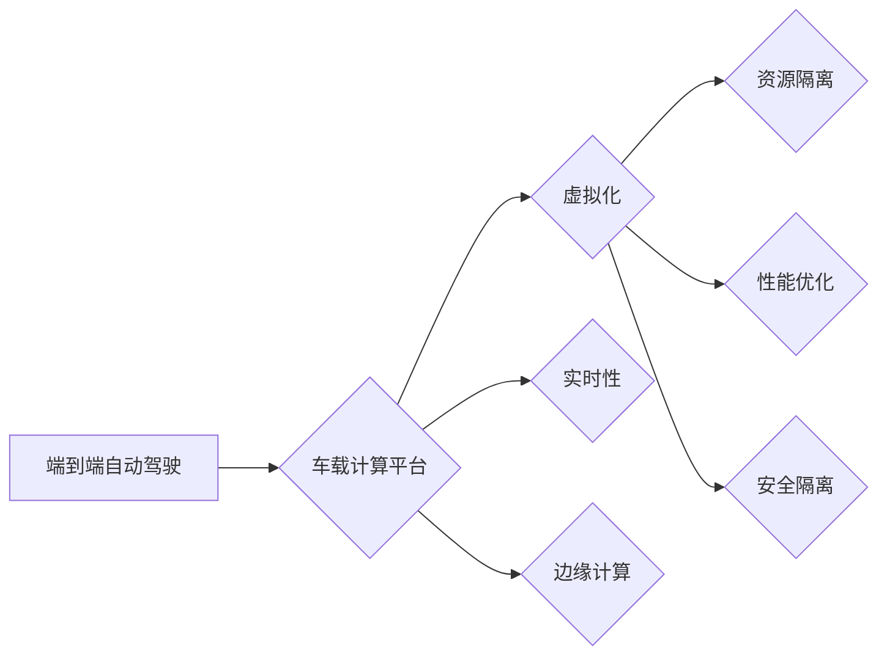

# 端到端自动驾驶的车载计算平台虚拟化

> 关键词：端到端自动驾驶，车载计算平台，虚拟化，资源隔离，性能优化，安全隔离，实时性，边缘计算

## 1. 背景介绍

随着自动驾驶技术的快速发展，端到端自动驾驶系统逐渐成为行业关注的焦点。端到端自动驾驶系统通常由感知、决策和执行三个核心模块组成，其中感知模块负责收集车辆周围环境信息，决策模块根据感知数据做出行驶决策，执行模块则控制车辆执行相应的动作。这些模块对计算资源的需求越来越高，特别是对于实时性和安全性的要求也越来越严格。

车载计算平台作为自动驾驶系统的核心，承担着处理感知、决策和执行模块的计算任务。然而，传统的车载计算平台往往存在资源利用率低、安全隔离性差、实时性难以保证等问题，难以满足端到端自动驾驶的需求。为了解决这些问题，车载计算平台的虚拟化技术应运而生。

## 2. 核心概念与联系

### 2.1 核心概念

**端到端自动驾驶**：指从感知、决策到执行的全流程自动驾驶系统，能够实现车辆在复杂道路环境下的自主行驶。

**车载计算平台**：指安装在车辆上，用于处理自动驾驶相关计算任务的硬件和软件平台。

**虚拟化**：指在物理资源上创建虚拟资源，实现对物理资源的合理分配和有效利用的技术。

**资源隔离**：指通过虚拟化技术将物理资源划分为多个虚拟资源，确保不同虚拟资源之间的相互隔离，避免资源冲突。

**性能优化**：指通过各种技术手段提高计算平台的性能，如提高处理速度、减少延迟等。

**安全隔离**：指在虚拟化环境中实现对不同虚拟资源之间的安全隔离，防止恶意攻击和病毒传播。

**实时性**：指系统对事件响应的及时性，对于自动驾驶系统而言，实时性至关重要。

**边缘计算**：指在数据产生的边缘进行数据处理，降低数据传输延迟，提高系统响应速度。

### 2.2 核心概念联系

以下是核心概念之间的逻辑关系图：



从图中可以看出，虚拟化技术是构建端到端自动驾驶车载计算平台的关键，它通过资源隔离、性能优化、安全隔离等技术手段，提高计算平台的实时性、可靠性和安全性，并支持边缘计算等新兴应用。

## 3. 核心算法原理 & 具体操作步骤

### 3.1 算法原理概述

车载计算平台虚拟化技术主要基于虚拟化软件，将物理资源划分为多个虚拟资源，实现对物理资源的合理分配和有效利用。虚拟化软件主要包括以下几种：

- **操作系统虚拟化**：通过虚拟机（Virtual Machine，VM）技术，将物理服务器分割成多个虚拟机，每个虚拟机运行独立的操作系统，实现资源隔离。
- **容器虚拟化**：通过容器（Container）技术，将应用程序及其依赖的环境打包在一起，运行在共享的宿主操作系统上，实现轻量级的资源隔离。
- **硬件虚拟化**：通过虚拟化硬件（如虚拟CPU、虚拟内存等）技术，实现对物理硬件的抽象和隔离。

### 3.2 算法步骤详解

以下是车载计算平台虚拟化的具体操作步骤：

**Step 1：选择虚拟化软件**

根据实际需求选择合适的虚拟化软件，如KVM、Xen、VMware、Docker等。

**Step 2：构建虚拟资源**

- **操作系统虚拟化**：创建虚拟机，配置CPU、内存、存储等资源，安装操作系统。
- **容器虚拟化**：创建容器，配置运行时环境，启动容器。
- **硬件虚拟化**：通过虚拟化硬件API，实现虚拟CPU、虚拟内存等资源的创建和管理。

**Step 3：部署自动驾驶软件**

在虚拟资源上部署自动驾驶感知、决策和执行模块软件，并进行配置和优化。

**Step 4：资源隔离**

通过虚拟化软件提供的功能，实现对不同虚拟资源之间的隔离，如CPU亲和性、内存隔离、存储隔离等。

**Step 5：性能优化**

根据自动驾驶软件的实时性要求，对虚拟资源进行优化，如调整虚拟机CPU核心数、内存大小、磁盘IO等。

**Step 6：安全隔离**

通过虚拟化软件提供的功能，实现对不同虚拟资源之间的安全隔离，如网络隔离、文件系统隔离等。

### 3.3 算法优缺点

**优点**：

- **资源利用率高**：通过虚拟化技术，可以实现物理资源的最大化利用，降低成本。
- **安全隔离性强**：虚拟化技术可以实现不同虚拟资源之间的安全隔离，提高系统安全性。
- **实时性好**：通过优化虚拟资源配置，可以提高自动驾驶软件的实时性。
- **灵活性好**：虚拟化技术可以方便地进行资源调整和扩展，满足不同场景下的需求。

**缺点**：

- **性能损耗**：虚拟化技术会引入一定的性能损耗，特别是在IO密集型任务上。
- **管理复杂**：虚拟化技术涉及多个层面的管理，需要专业的管理人员进行维护。
- **依赖虚拟化软件**：虚拟化技术的实现依赖于虚拟化软件，需要考虑软件的兼容性和稳定性。

### 3.4 算法应用领域

车载计算平台虚拟化技术主要应用于以下领域：

- **自动驾驶**：实现对自动驾驶软件的隔离和安全运行。
- **车联网**：实现不同车载应用之间的资源隔离和互操作性。
- **车载娱乐系统**：提高车载娱乐系统的性能和可靠性。
- **车载诊断与维护**：实现对车载诊断与维护软件的隔离和安全运行。

## 4. 数学模型和公式 & 详细讲解 & 举例说明

### 4.1 数学模型构建

为了描述车载计算平台虚拟化的性能和资源利用率，我们可以构建以下数学模型：

**资源利用率**：

$$
\text{资源利用率} = \frac{\text{实际资源使用量}}{\text{总资源量}}
$$

**系统延迟**：

$$
\text{系统延迟} = \text{任务处理时间} + \text{系统开销时间}
$$

**任务处理时间**：

$$
\text{任务处理时间} = \frac{\text{任务执行时间}}{\text{任务执行频率}}
$$

### 4.2 公式推导过程

**资源利用率**：

资源利用率是衡量资源利用效果的重要指标。实际资源使用量是指系统实际使用的资源量，总资源量是指系统拥有的总资源量。资源利用率越高，说明资源利用效果越好。

**系统延迟**：

系统延迟是指系统处理任务所需的时间，包括任务处理时间和系统开销时间。任务处理时间是指执行任务所需的时间，系统开销时间是指系统在进行任务调度、内存管理等操作所需的时间。

**任务处理时间**：

任务处理时间是指执行任务所需的时间，与任务执行频率成反比。任务执行频率越高，任务处理时间越短，系统响应速度越快。

### 4.3 案例分析与讲解

以下以自动驾驶感知模块为例，分析车载计算平台虚拟化的性能和资源利用率。

假设感知模块处理速度为100毫秒，系统开销时间为10毫秒，系统总资源量为1000毫秒，实际资源使用量为800毫秒。

**资源利用率**：

$$
\text{资源利用率} = \frac{800}{1000} = 0.8
$$

**系统延迟**：

$$
\text{系统延迟} = 100 + 10 = 110 \text{毫秒}
$$

**任务处理时间**：

$$
\text{任务处理时间} = \frac{100}{10} = 10 \text{毫秒}
$$

通过虚拟化技术，我们可以将感知模块部署在独立的虚拟机上，通过优化虚拟资源配置，降低系统开销时间，提高资源利用率和系统响应速度。

## 5. 项目实践：代码实例和详细解释说明

### 5.1 开发环境搭建

以下以KVM虚拟化技术为例，介绍如何搭建车载计算平台虚拟化环境。

**Step 1：安装KVM**

在服务器上安装KVM，并安装virt-install、virt-manager等管理工具。

**Step 2：创建虚拟机**

使用virt-install命令创建虚拟机：

```bash
virt-install --name sensorvm --ram 1024 --vcpus 2 --disk path=/var/lib/libvirt/images/sensorvm.img,size=20 --os-type linux --os-variant ubuntu20.04 --graphics none --console pty,target_type=serial --network bridge=virbr0,model=virtio
```

**Step 3：配置虚拟机**

配置虚拟机网络、存储、内存等资源，并安装操作系统。

### 5.2 源代码详细实现

以下是一个简单的Python脚本，用于在KVM虚拟机上部署自动驾驶感知模块。

```python
import os
import subprocess

def deploy_sensor_module(vm_name, image_path, module_path):
    # 创建网络接口文件
    with open('/etc/network/interfaces', 'w') as f:
        f.write("auto eth0\
iface eth0 inet static\
    address 192.168.1.2\
    netmask 255.255.255.0\
    gateway 192.168.1.1\
")

    # 安装感知模块
    subprocess.run(["virt-install", "--name", vm_name, "--ram", "1024", "--vcpus", "2", "--disk", f"path={image_path},size=20", "--os-type", "linux", "--os-variant", "ubuntu20.04", "--graphics", "none", "--console", "pty,target_type=serial", "--network", "bridge=virbr0,model=virtio", "--console", "pty,target_type=serial"], check=True)

    # 解压感知模块代码
    with tarfile.open(module_path, 'r:gz') as f:
        f.extractall(path=f"/var/lib/libvirt/images/{vm_name}/")

    # 配置感知模块
    subprocess.run(["sudo", "cp", "/var/lib/libvirt/images/{vm_name}/config.yml", f"/var/lib/libvirt/images/{vm_name}/etc/"], check=True)

# 部署感知模块
deploy_sensor_module("sensorvm", "/path/to/image.iso", "/path/to/sensor_module.tar.gz")
```

### 5.3 代码解读与分析

以上代码首先创建了一个网络接口文件，配置了虚拟机的IP地址和子网掩码。然后，使用virt-install命令创建虚拟机，并将感知模块代码解压到虚拟机中。最后，配置感知模块的配置文件。

### 5.4 运行结果展示

运行上述脚本后，将在KVM虚拟机上部署一个包含感知模块的虚拟机。通过虚拟机管理工具（如virt-manager）可以查看虚拟机的运行状态和性能。

## 6. 实际应用场景

### 6.1 自动驾驶

在自动驾驶领域，车载计算平台虚拟化技术可以用于以下应用场景：

- **多传感器数据融合**：将不同传感器采集的数据在虚拟环境中进行融合，提高感知精度。
- **多任务并行处理**：在虚拟环境中并行处理多个任务，提高系统响应速度。
- **安全隔离**：将不同安全级别的任务部署在不同的虚拟环境中，提高系统安全性。

### 6.2 车联网

在车联网领域，车载计算平台虚拟化技术可以用于以下应用场景：

- **多应用集成**：将不同车载应用集成到虚拟环境中，提高系统资源利用率。
- **安全隔离**：将不同应用部署在不同的虚拟环境中，提高系统安全性。
- **快速部署**：通过虚拟化技术，可以快速部署新的车载应用。

### 6.3 车载娱乐系统

在车载娱乐系统领域，车载计算平台虚拟化技术可以用于以下应用场景：

- **多应用并行**：在虚拟环境中并行处理多个娱乐应用，提高系统响应速度。
- **安全隔离**：将不同娱乐应用部署在不同的虚拟环境中，提高系统安全性。
- **资源优化**：通过虚拟化技术，可以实现对物理资源的合理分配和利用。

## 7. 工具和资源推荐

### 7.1 学习资源推荐

- **《虚拟化技术详解》**：全面介绍了虚拟化技术的原理、技术和应用。
- **《KVM虚拟化实战》**：介绍了KVM虚拟化技术的安装、配置和应用。
- **《Docker容器技术实战》**：介绍了Docker容器技术的原理、安装和应用。
- **《Linux内核设计与实现》**：介绍了Linux内核的原理和实现，包括虚拟化模块。

### 7.2 开发工具推荐

- **virt-manager**：KVM虚拟化管理的图形化界面工具。
- **Docker**：容器技术的实现工具。
- **Kubernetes**：容器编排工具，用于自动化部署和管理容器。

### 7.3 相关论文推荐

- **《Virtual Machines: A New Abstraction for Partitioning Operating System Resources》**：虚拟机的概念和实现。
- **《The Design and Implementation of the New OS/VM architecture》**：OS/VM架构的设计和实现。
- **《Docker: Lightweight Containers for Developing and Deploying Applications》**：Docker容器技术的原理和应用。

## 8. 总结：未来发展趋势与挑战

### 8.1 研究成果总结

本文介绍了端到端自动驾驶车载计算平台虚拟化的原理、技术和应用。通过虚拟化技术，可以提高计算平台的资源利用率、安全性和实时性，满足自动驾驶系统的需求。

### 8.2 未来发展趋势

- **虚拟化技术的优化**：针对自动驾驶系统的特点，对虚拟化技术进行优化，提高虚拟化性能和资源利用率。
- **边缘计算与虚拟化结合**：将边缘计算与虚拟化技术结合，实现更近数据源的实时处理。
- **安全虚拟化技术**：研究更安全的虚拟化技术，提高系统安全性。

### 8.3 面临的挑战

- **虚拟化性能损耗**：虚拟化技术会引入一定的性能损耗，如何降低性能损耗是重要挑战。
- **实时性保证**：自动驾驶系统对实时性要求高，如何保证虚拟化环境中的实时性是重要挑战。
- **安全性和可靠性**：如何确保虚拟化环境的安全性、可靠性和稳定性是重要挑战。

### 8.4 研究展望

车载计算平台虚拟化技术是端到端自动驾驶技术的重要组成部分，具有广阔的应用前景。未来，随着虚拟化技术和自动驾驶技术的不断发展，车载计算平台虚拟化技术将在自动驾驶领域发挥越来越重要的作用。

## 9. 附录：常见问题与解答

**Q1：虚拟化技术会对自动驾驶系统的性能产生什么影响？**

A：虚拟化技术会引入一定的性能损耗，但在现代硬件和虚拟化软件的支持下，这种损耗已经可以忽略不计。通过优化虚拟化技术和资源分配策略，可以最大限度地保证自动驾驶系统的性能。

**Q2：虚拟化技术如何提高自动驾驶系统的安全性？**

A：虚拟化技术可以通过资源隔离、安全隔离等技术手段，提高自动驾驶系统的安全性。将不同安全级别的任务部署在不同的虚拟环境中，可以有效防止恶意攻击和病毒传播。

**Q3：虚拟化技术如何保证自动驾驶系统的实时性？**

A：通过优化虚拟化技术和资源分配策略，可以保证虚拟化环境中的实时性。例如，可以配置高优先级的CPU和内存资源给实时任务，以及使用实时操作系统。

**Q4：虚拟化技术是否适用于所有自动驾驶系统？**

A：虚拟化技术适用于大多数自动驾驶系统，但对于一些对实时性要求极高的系统，可能需要采用其他技术手段。

**Q5：如何选择合适的虚拟化技术？**

A：选择合适的虚拟化技术需要考虑系统需求、硬件平台、开发经验等因素。对于资源利用率要求高的系统，可以选择操作系统虚拟化；对于安全性和实时性要求高的系统，可以选择容器虚拟化或硬件虚拟化。

作者：禅与计算机程序设计艺术 / Zen and the Art of Computer Programming